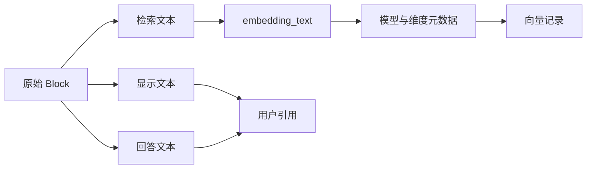

# Embedding 文本、模型与版本元数据

一张权限表里有一行“生产环境 | 系统负责人 | 两小时”。页面展示时，读者需要看到表头、行和所在章节；生成回答时，需要保留能引用的原始字段；做语义检索时，还希望模型知道这行属于“远程访问制度”。如果只给 Chunk 留一个 `text` 字段，三种用途会互相牵制。

更合适的数据模型会保留多种文本视图。`content` 是切块后的规范正文，`display_content` 面向阅读和来源预览，`answer_content` 是可以进入证据包的回答材料，`embedding_text` 则专门作为 Embedding 输入。它们共享同一个 Chunk 和 Source Version，不等于四份可以各自修改的文档。

::: info 文本视图解决的是接口分工

检索器用 `embedding_text` 找候选，答案生成读取 `answer_content`，引用界面展示 `display_content`，质量门禁用 `content` 和结构字段核对内容保留。字段分开以后，每个消费者可以拿到适合自己的形状，同时沿 Chunk ID 回到同一来源。

:::

本文继续使用编号为 `RA-204` 的远程访问规则。它位于“安全制度 > 远程访问 > 生产环境”，表格字段为环境、审批角色和有效期。用户可能问“生产连接找谁批准”，也可能直接查 `RA-204`。文本设计既要照顾语义召回，又不能破坏精确编号与原文引用。



## 文本视图由谁生成和维护

解析器是规范正文和结构字段的所有者。它读取原始 Source，产出 `content`、章节路径、表格字段与来源位置；显示层只能根据这些字段安全渲染，不能反向修改规范正文。切块器拥有 Chunk 边界与稳定身份，但不负责决定模型和向量维度。职责分开以后，页面样式变化不会触发内容重切，切块策略变化则会明确创建新的候选版本。

表示构造器负责从规范字段生成 `embedding_text`。它读取标题、路径和正文，按照带版本的确定规则拼接，不自行调用生成模型补写事实。Embedding 适配器拥有模型请求、批次和返回维度校验，Repository 拥有向量记录与状态转换。查询服务只能读取已经 ready 且属于活动索引的向量，不能在请求期间临时改写表示文本。

`display_content` 的维护者是呈现适配器，`answer_content` 的维护者是证据装配层。两者可以从同一规范正文派生，但每次派生都保留 Chunk 与 Source Version。若答案层为了节省上下文生成压缩文本，压缩结果属于运行时证据包，不应覆盖入库阶段的 `answer_content`。字段同名不等于所有组件都可以写入。

索引配置拥有模型、维度、模板和规范化版本，发布服务拥有活动索引指针。这两个所有权也不能合并：修改配置只会创建候选，只有结构检查和检索评测通过后，发布服务才切换查询入口。活动指针切换失败时，旧索引继续服务；候选构建失败时，不会把半成品暴露给检索器。

多文本视图的取舍是用更多字段、哈希和迁移成本换取接口稳定与可回滚。小型只读语料可以让四个视图暂时相同，但仍保存明确生成规则；规模较大后，再根据真实召回和展示问题拆分。反过来，为每种消费者提前生成大量派生文本会增加存储、重算和一致性代价，也可能让读者看到与原文不一致的内容，因此新增视图必须有具体消费者和回归证据。

## 一个 Chunk 为什么需要多种文本视图

`content` 先承担规范化后的主体内容。普通段落通常就是切块结果，表格行则可能是带表头的 Markdown 行或稳定序列化文本。质量门禁根据它计算内容哈希、重复和长度，Chunk 身份也会受它影响。它应该尽量稳定，不为某一次搜索活动临时加入关键词。

`display_content` 服务于人读。HTML 解析可以移除脚本并保留可见结构，外部图片也可能被本地化；表格预览需要列名和行关系。显示文本允许做安全且可追踪的呈现处理，但不能把没解析出来的内容编回去。若它与规范正文不同，界面应仍能定位到原 Source。

`answer_content` 是生成与证据引用使用的文本。当前最小实现里，它通常与 `content` 相同，这个相同本身是合理的保守选择：模型拿到的是可核对原文，不是为了检索而扩写的句子。以后若做上下文压缩或表格口语化，也应保留原文位置，并明确压缩结果只是派生材料。

`embedding_text` 面向表示模型。当前构造顺序是文档标题、Source 标题、章节路径和 Chunk 正文，去掉空项后用换行连接。对于 `RA-204` 这行，输入可能是：

```text
安全制度
远程访问规则
安全制度 > 远程访问 > 生产环境
| 编号 | 环境 | 审批角色 | 有效期 |
| RA-204 | 生产环境 | 系统负责人 | 两小时 |
```

章节信息补足了短表格行的语境。用户问“生产连接找谁批准”时，即使没有输入编号，也更容易召回这一行。回答仍读取 `answer_content` 中的字段并引用 Source，不能把标题和路径拼接后的表示文本冒充原文。

四个字段也可能暂时完全相同。分开保存不是为了制造差异，而是为了稳定契约。今天所有消费者共用正文，明天展示层需要图片链接、检索层需要章节前缀时，不必偷偷改一个字段并影响其余链路。

## 表示文本怎样加入结构信息

短 Chunk 缺少上文时，语义会变得模糊。“系统负责人批准”可以属于发布、采购或远程连接。文档标题、Source 标题和章节路径提供最小语境，通常比固定重叠上一段更可控。它们来自解析和切块状态，不由模型猜测。

加入顺序应固定。相同内容在两次入库中顺序变化，会生成不同 Embedding 哈希并触发重算，也让离线对比无法解释。构造函数应过滤空字符串、规范换行，但不要随运行环境改变字段顺序。模板版本随索引配置保存，后续可以知道一个向量由哪种拼接方式产生。

表格需要同时处理语义和精确字段。表头与当前行进入 `embedding_text`，让“有效期”这类列语义可见；`RA-204` 进入 `exact_terms`，环境和审批角色进入 `structured_fields`。向量负责“生产连接审批”的语义候选，编号和字段过滤由确定性通道负责。

父章节 Chunk 与叶子 Chunk 也要区分。父 Chunk 可以只表示章节标题和摘要，叶子保存可引用正文。若把整个章节全文重复塞进每个叶子，向量会被通用主题支配，存储和调用量也增加；只留下短行，又可能失去条件。通过评测调整上下文前缀，比对所有文档固定增加一段通用描述更可靠。

代码片段的表示取决于检索目标。函数名、错误消息和语言标识通常有用，整段许可证头或生成文件路径可能只制造噪声。清理规则必须确定且有测试，不能让生成模型自由改写代码后再向量化，因为改写会损失精确 Token 和可引用性。

OCR 文本带有另一类风险。低置信结果可以进入显示预览并标记警告，是否进入 `embedding_text` 要由准入策略决定。把错误 OCR 当作可靠正文会影响召回；完全丢弃又使扫描页不可搜。关键字段需要人工标注或原页定位，Embedding 不能修复 OCR 事实。

## 不应进入 Embedding 文本的内容

访问权限不能作为自然语言提示拼进向量。加入“仅管理员可见”不会阻止普通用户命中，反而会让权限类查询更接近这段内容。ACL、租户、Subject 和 Release 是查询过滤字段，它们应保留在 Chunk 元数据及关联表中，由数据库执行。

秘密、凭证和隐私字段也不能因为“只会变成向量”就放进去。向量不是脱敏形式，模型服务会接触输入，数据库与日志也可能保留可关联数据。文件准入检测到秘密或 PII 时，应按策略阻止、警告或经过明确脱敏流程，不能用 Embedding 替代安全处理。

与内容无关的热门关键词会污染表示。为了让 Chunk 更容易被搜到，给每段都追加“知识库、AI、智能问答、最佳实践”，只会让不相关片段互相靠近。标题和章节路径要来自真实文档结构，别名要有治理来源，查询扩展则属于在线检索阶段。

运行时状态通常也不进入离线表示。当前审批人、任务状态和剩余额度如果来自业务数据库，应走结构化查询或工具调用；把一次快照拼进文档向量会迅速过期。确实要索引快照时，需要版本、时间和撤回机制，不能把它写成永远有效的知识。

生成模型产出的摘要、关键词和问题列表可以作为派生表示候选，但不能悄悄覆盖原文。它们要保存生成模型、Prompt 版本、来源和失败状态，并通过检索评测证明有收益。派生文本命中后，Evidence 仍指向可见原文；无法回到原文的扩写不应进入可信回答链路。

## 内容哈希与 Embedding 哈希各自负责什么

`content_hash` 对规范正文计算，回答“这段 Chunk 内容是否变化”。`embedding_hash` 对完整 `embedding_text` 计算，回答“送给表示模型的输入是否变化”。正文相同但章节路径改变时，内容哈希可以不变，Embedding 哈希应变化，因为向量输入已经不同。

文档版本还有覆盖所有 Source 内容的哈希，用于标记一次发布的内容快照。Source Version 保存自身内容哈希，Chunk 再保存正文和表示哈希。三层哈希服务不同粒度，不能只保留一个文档哈希后推断每个 Chunk 都没变。

哈希相同只是复用判断的一项条件。还要比较 Embedding 模型、维度、输入模板、规范化方式和必要的模型供应配置。相同文本换模型，向量空间改变；模型名称相同但供应方在不兼容升级后改变输出，也需要新的配置版本和回归证据。

哈希不承担访问控制。两个租户的公开模板可以有相同 `embedding_hash`，是否允许共享计算结果要看隔离策略；即使复用向量，Chunk 记录、Source Version、Release 和 ACL 仍然独立。不能用内容相同推导权限相同。

哈希也不证明输入正确。解析器把表格列弄反，错误文本仍会得到稳定哈希；重放时可以稳定复现错误。质量门禁、结构断言和标注样本负责正确性，哈希负责身份和变化检测。

## 模型、维度和模板必须形成一个版本

一条可用的向量记录至少保存 `embedding_model`、`embedding_dimension`、`embedding_hash`、`index_version` 和 `index_status`。文档版本同时记录解析器、Chunker、Embedding 模型与维度，出现异常时才能区分内容变化和管线变化。

当前示例索引使用固定 1024 维。Embedding 适配器请求这个维度，并逐条检查返回数组长度；响应数量与批次不一致或某个向量不是 1024 维，任务停止。数据库列也使用相同维度，避免把不同形状的数据写进一个索引。

维度相同仍不代表空间兼容。模型 M1 与 M2 都输出 1024 维，把文档向量留在 M1、查询改用 M2，距离没有可靠含义。模型迁移应构建候选索引，对同一评测集比较后原子切换，不能只更新运行时模型配置。

模板版本同样重要。V1 输入“章节路径 + 正文”，V2 增加文档标题；旧 Chunk 正文没有改变，向量输入却变了。只看 `content_hash` 会漏掉重建，`embedding_hash` 和模板版本能够发现差异。模板回滚也要回到配套向量，不只是恢复一段字符串拼接代码。

规范化规则属于模板的一部分。全半角、大小写、连续空白、Markdown 标记和 Unicode 规范化都会影响哈希与输入。规则应该小而确定，针对编号、代码和中文标点有反例测试。过强的规范化可能把 `RA-204` 与 `RA204`、大小写敏感变量或负号差异错误合并。

## 一条 Chunk 从解析结果到可检索记录

输入是一张远程访问权限表，Source ID 为 S7，文档版本 V3，索引版本 I3。解析器产出表头和一行字段；Chunker 生成 `table_row` 叶子，写入章节路径、表格 ID、行号、结构字段和精确编号。此时向量状态是 `pending`。

构造器将文档标题、Source 标题、章节路径与行内容连接，计算 `content_hash` 和 `embedding_hash`。Chunk ID 还包含文档、版本、Source、Source 内序号和内容哈希，因此同一版本重放保持一致；在前面插入新 Chunk 会改变后续序号，不能把它描述为跨任意编辑稳定。

Embedding 服务读取 `embedding_text`，按固定批次调用活动模型。响应数量等于输入数量、每个向量维度正确后，才给 Chunk 写入模型、维度、向量并把状态改为 `ready`。任一检查失败，候选不能激活。

Repository 在事务内写文档版本、Source Version 和 Chunk。落盘后反查 Source 数、Chunk 数、ready 向量数和 Coverage 数，四项一致才切换活动状态。最终记录同时保留四类文本视图、结构字段、哈希、模型和索引版本。

用户查询“生产连接找谁批准”时，向量通道通过 `embedding_text` 命中这行；答案生成读取 `answer_content` 得到“系统负责人”；引用预览使用 `display_content` 展示表头和行；精确查询 `RA-204` 则通过 `exact_terms` 命中。一个 Chunk 的不同接口在这里汇合，但来源身份始终是 S7/V3。

失败推演把章节路径误改为“采购制度”。`content_hash` 不变，`embedding_hash` 改变，候选索引中的语义位置可能偏向采购。结构回归比较发现 section path 与父 Chunk 不一致，门禁阻止激活；修复路径后重新计算表示和向量，旧活动版本继续服务。若系统只比较正文哈希，这个错误会被当作可复用向量漏过去。

## 如何评测文本模板而不被主观感觉误导

准备同一批 Chunk，分别用模板 A“正文”、模板 B“章节路径 + 正文”和模板 C“文档标题 + Source 标题 + 章节路径 + 正文”生成候选索引。查询集包含普通语义问题、跨术语改写、短表格行、编号、否定句和无关问题，标注期望 Source 与相关等级。

评测先看 Recall@K 与排名，再按文档类型拆分。模板 C 可能改善短表格行，却让大量通用文档标题主导普通段落；平均分相同也要看失败转移。编号题用于确认精确通道仍然生效，不要求模板把随机 ID 变成语义。

还要检查上下文重复和来源多样性。模板前缀过长会让同一文档的所有 Chunk 非常相近，Top K 被一份文档占满。此时召回目标也许在前十，证据覆盖却下降。去重、每文档上限和重排能缓解结果，输入设计仍需修正。

线上影子验证记录候选差异但不改变用户答案。相同查询并行运行活动模板与候选模板，比较命中 Source、权限过滤和耗时，正文和向量不写入日志。候选通过离线与影子检查后，重新构建完整索引并切换版本。

代码测试覆盖构造顺序、空字段、哈希变化和模型元数据。固定输入应得到固定 `embedding_text`；只改显示文本不应影响表示哈希，改章节路径必须影响；向量数量或维度错误时不得写 `ready`。这些测试证明确定性控制逻辑，真实语义质量仍由目标模型和标注查询集验证。

## 不同内容类型不能套同一段表示模板

普通段落最接近默认情况。文档标题与章节路径提供语境，正文保留条件和结论；显示、回答与规范正文通常可以相同。若段落已经足够完整，继续追加父章节全文只会稀释当前主题。模板可以根据 `chunk_type` 选择字段，但选择规则要写进版本，不能靠运行时猜测。

标题 Chunk 没有足够正文，单独生成向量容易召回大量空信息。它更适合作为父节点和导航关系，命中后展开受限的叶子；若确实要检索标题，表示文本应标明完整章节路径，返回时仍需要叶子证据。标题本身不能支持正文里没有的 Claim。

列表项需要保留列表所在的主题和必要的引导句。“提交申请”“等待审批”单独向量化时几乎没有领域信息，章节路径只能补出一部分。切块阶段可以把关系紧密的短列表保留在同一 Chunk，或者让叶子带父段落摘要。具体方案由召回样本决定，不能默认每一项都拆开。

表格行需要列名。只有“生产环境 | 系统负责人 | 两小时”，模型未必知道三个值分别是什么；加入“环境 | 审批角色 | 有效期”后语义明确。显示文本可以保留 Markdown 表格，回答文本可保留表头与目标行，结构字段保存列值，精确字段保存编号。超大表拆分时，每个片段重复必要表头，不重复整表。

整表 Chunk 与行级 Chunk 可以同时存在，但二者类型不同。用户问“有哪些环境”时，整表有助于覆盖；查某个编号时，行级结果更准。融合去重要知道它们来自同一张表，避免把两种视图当成两个独立来源提高证据权重。

代码块需要保留语言、符号和错误文本。为了自然语言召回可以加入所在章节，但不能把代码经生成模型解释后取代原代码。显示与回答文本若截断，必须保留可回到完整 Source 的位置；Embedding 文本可按函数或语义段拆分，精确通道处理类名、函数名和错误码。

扫描 PDF 的 OCR 文本还要保留页码与警告。页码适合放在元数据和引用位置，不必机械拼进每段表示；文档标题与章节路径仍可进入。OCR 未执行或结果为空时，失败关闭，不生成一个只有文件名的“成功向量”。低置信页面若允许入库，检索和引用界面都要能够看到质量标记。

附件 Source 不能丢掉身份。主制度和附件表格可能共享章节名，`source_title` 能帮助表示，`source_version_id` 则用于权限、版本和引用。把附件内容直接合入主文一个长字符串，会让撤回附件、更新附件或定位原页都变得困难。

HTML 的显示文本可能保留安全的链接和布局，规范正文会移除脚本、样式与不可见节点。Embedding 不需要把标签名当语义，链接文字和标题却可能有用。解析器负责得到可控内容，表示模板只消费解析结果，不能再次用正则从原始 HTML 临时抽取。

## 模型或模板升级时怎样保持可回滚

假设活动索引 I7 使用模型 M1 和模板 T1，计划切换到 M2/T2。第一步不是修改查询服务，而是冻结 I7 的配置和评测结果，给候选索引 I8 写入新的模型、维度、模板、规范化和构建版本。相同 Source 也要得到属于 I8 的向量记录。

候选构建按 `embedding_hash + 模型版本 + 模板版本` 判断计算身份。M2 与 T2 都变化时，所有 Chunk 需要重算；只有无关显示样式变化，表示哈希不变，可以在隔离验证后复用计算结果。当前链路没有实现跨版本向量复用时，应选择全量重算，不能把设计建议写成已经节省调用。

构建期间，线上查询继续固定 I7。I8 的 Source 数、Chunk 数、ready 向量数和 Coverage 一致后，离线查询集同时运行两套索引。记录相关 Source 是否进入 Top K、首个相关位置、权限过滤、空结果和检索耗时，差异落到具体问题。

候选通过后，发布服务原子切换活动版本，新的请求使用 I8，已经开始的 Turn 继续使用它固定的旧 Release 和索引配置。缓存键包含索引版本，切换不会把 I7 候选当作 I8 返回；共享向量计算缓存也要绑定模型与表示哈希。

切换后发现“生产连接找谁批准”召回退化，可以把活动指针恢复到 I7。回滚不需要临时重新计算旧向量，因为 I7 仍作为不可变版本保存。只保留一列被覆盖的向量，就无法做到这种快速恢复。

旧索引不能立即删除。运行中的 Turn、审计记录和回归对比可能仍引用它；清理器先确认没有活动引用，再按保留策略删除。删除向量不等于删除 Source 历史，引用与合规要求可能需要更长时间保存文本版本，两者生命周期应分开。

升级失败也要留下证据。Embedding 服务超时记录候选 I8 的失败状态，不影响 I7；返回维度错误时，适配器在写库前停止；数据库批次部分写入则由事务回滚；质量评测未通过时，I8 保持不可见。每个终点对应不同重试条件，不能统一显示“模型升级失败”后盲目再跑。

## 表示文本发生问题时如何排查

语义查询命中了正确文档的错误章节，先比较候选 `embedding_text`。若所有 Chunk 都带同一个过长标题或摘要，通用前缀可能压过正文；若目标表格行没有表头，查询词与字段含义无法对应；若章节路径来自旧版本，问题在父子关系或局部重建。

查询命中候选，引用却缺字段，需要比较 `answer_content` 和 `display_content`。检索表示可能正确，回答视图却在压缩时删了条件；反过来，页面能看到字段而 `embedding_text` 没有，也会出现可读但搜不到。字段分开后，排障应沿消费者定位，不要把所有异常归给向量模型。

重复结果要检查表示模板和 Chunk 身份。相同正文加上不同但无意义的前缀，内容去重可能失效；父 Chunk 与叶子 Chunk 同时召回时，需要按表格或章节关系合并。直接按 `embedding_text` 完全相等去重，会漏掉语义重复，也可能错误合并不同 Source。

修复后用同一 Source 的多类问题回归：自然语言问题命中目标行，编号走精确通道，章节级问题可以展开父节点，无权限用户拿不到候选，旧 Release 的 Turn 仍得到旧引用。模板调整只改善一个演示问题，却破坏这些边界，不能发布。

审查记录还应保存一个反向检查：从最终 Evidence 的 Chunk ID 回到四种文本、Source Version 和构建配置，确认每个字段都能解释。若线上只保留向量与最终片段，模板升级后无法还原当时模型到底看到了什么，也无法判断引用差异来自解析、表示还是回答装配。这个反查不需要记录用户的完整问题或敏感正文副本，稳定身份、哈希、版本和授权后的来源定位已经足够完成多数诊断。

测试数据要故意让四种视图不同。比如显示文本保留本地化图片链接，回答文本只含审批表，表示文本加入章节路径，规范正文用于哈希。分别修改其中一个字段，断言只有对应消费者和预期哈希发生变化。所有字段一直相同的样本虽然容易通过，却证明不了接口真的隔离。

## 文本视图的边界决定后续能否追责

显示层不应读取 `embedding_text`，其中可能含有用于召回但不适合直接展示的前缀。答案层不应直接使用模型生成的派生关键词，除非它能回到原文。检索层也不能只返回向量和分数，必须保留 Chunk、Source 与 Release 身份。

字段出现差异时，Trace 记录使用了哪个视图。用户看到的引用与答案不一致，可以比较 `display_content` 和 `answer_content`；语义召回异常则查看 `embedding_text` 与模板版本；重复或身份漂移查看 `content_hash`、Chunk ID 和 Source Version。只有一个 `text` 字段时，这些问题最后都会变成“模型可能不稳定”。

设计建议与当前实现也要分开。当前最小链路让三类正文视图保持相同，并以标题和章节路径构造表示文本；按哈希跨版本复用向量、生成摘要型表示或多模型并行属于后续优化，需要各自的缓存、版本与评测。文章不能因为数据模型预留了字段，就宣称这些优化已经运行。

文本视图分开的目的很朴素：检索可以调整表示，回答和引用仍然忠于可见来源。模型、维度、模板与哈希一起版本化后，每个向量才有可解释的来历，重建和回滚也有明确边界。
