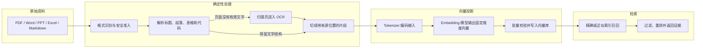

# Embedding 是什么：从文本向量到语义检索

Embedding 是把一段文本映射成固定维度的数值向量，用于比较语义接近程度。它位于文档切片之后、向量存储和检索之前：模型只负责投影，不负责回答问题、判断权限或证明引用正确。查询文本和知识片段使用同一模型与版本投影后，程序才可以用距离函数做语义召回。

在知识库中，Embedding 不能单独工作。文件先转换成结构块并切成带来源的片段，片段经过向量模型投影后写入兼容索引；查询也使用同一模型投影，检索器才有可比较的两个向量。本文沿“文件 -> 结构块 -> 片段 -> 向量 -> 索引 -> Evidence”解释这条链路，同时说明模型版本、权限和召回评估为何不能省略。

## Embedding 在知识库中的位置

一份文件不会直接变成一条向量。中间至少要保留原文件、解析块、语义片段、向量版本和索引版本。



输入是不同格式的原文件。解析阶段负责恢复结构，Embedding 阶段只负责把已经合格的片段映射到**向量空间**，向量库负责存储和查找，检索阶段还要执行权限和版本过滤。任何一步失败，都应保留失败状态，不应把空文本当作成功结果写入索引。

## 从不同文件得到统一结构块

### PDF：先判断是不是扫描件

普通 PDF 往往包含可复制文字，可以直接读取页面文本块和坐标。扫描 PDF 只有图片，需要把指定页面渲染成图片，再进入 OCR。OCR 是 Optical Character Recognition，用来从图片中识别字符，但它可能错字、漏字或破坏表格结构。

导入 PDF 时至少记录：页码、文本块位置、是否经过 OCR、OCR 失败原因和解析器版本。后续引用必须能从片段跳回页码，不能只保存一段没有来源的纯文本。

### Word：段落样式、列表和表格不能抹平

`.docx` 本质上是一个压缩包里的 XML 文档。解析器要保留标题样式、段落顺序、列表层级和表格行列。把所有段落直接拼成字符串，会丢掉“这一段属于哪个标题”和“这一行属于哪一列”。

### PPT：一页就是一个结构边界

PowerPoint 需要按幻灯片处理。标题、文本框、表格和图片应该分别成为结构块，并保留幻灯片编号。图片中的文字是否 OCR，取决于图片是否承载主要信息；不要把整套演示文稿无条件 OCR。

### Excel：表头决定一行数据的含义

Excel 不是普通长文本。导入时要保存工作表名、表头和行号。为了让语义检索理解一行数据，可以生成“字段名：值”的文本表示，同时保留原单元格位置，方便引用和回查。

### Markdown 和 HTML：语法本身就是结构

Markdown 的标题、列表、代码围栏和表格可以直接转换成结构块。HTML 则需要过滤导航、脚本和重复页脚，保留正文标题、段落、列表和表格。清洗不能删除所有换行，否则代码和列表会失去含义。

### 统一的 Block 产物

无论输入什么格式，都可以先转换为匿名的结构块：

```text
Heading(level=2, text="远程访问")
Paragraph(text="申请前需要确认设备满足安全要求")
ListItem(order=1, text="登录申请页面")
Table(headers=["角色", "审批人"], rows=[["员工", "直属负责人"]])
Code(language="bash", text="curl https://example.invalid/status")
```

`Heading` 记录标题层级，`Paragraph` 记录正文，`ListItem` 保留操作顺序，`Table` 同时保存表头和行，`Code` 保留语言与缩进。切片器先处理这些结构块，再决定哪些块需要合并或拆分。这样做的好处是，向量模型得到的文本仍然能说明自己属于哪个主题。

## 从结构块得到可检索片段

一个片段太大，会把多个主题混在一起；太小，检索命中后又看不懂。切片不是简单的“每 500 个字符截断”，而是一个结构决策：

1. 标题开启新的主题路径；
2. 段落、列表、表格和代码优先保持完整；
3. 同一标题下的短段落可以合并；
4. 超大段落再按句子或 Token 上限递归拆分；
5. 每个片段记录 `headingPath`、页码/幻灯片/单元格位置、父片段和相邻片段。

父子片段可以同时满足召回和回答。子片段短，适合计算相似度；父片段完整，适合提供给模型。命中子片段后，程序按预算补充父片段或相邻片段，但仍要重新检查版本和权限。

## 从文本得到 Embedding 向量

### Tokenizer 不是按字数切分

**Tokenizer** 把字符串转换成模型训练时使用的 Token 序列。一个中文汉字、英文单词、标点或子词都可能对应一个或多个 Token。模型的输入上限按 Token 计算，不按 JavaScript 的 `length` 计算。

这会影响两件事：切片长度和费用。一个含有大量代码、URL 或中英文混排的片段，字符数相同，Token 数可能差很多。生产导入需要在向量化前测量 Token 数，超过模型上限时按结构拆分或拒绝。

### 向量是空间中的一个点

Embedding 模型把一段文本编码成固定长度数组，例如 `[0.12, -0.04, ...]`。数组长度就是**维度**。二维例子容易画图，但真实模型通常有数百到数千维，每个维度不宜简单解释为某个单独主题；语义来自整个向量在空间中的相对位置。

### 余弦、点积和欧氏距离

**余弦相似度**比较两个向量的方向：

```text
cos(a, b) = (a · b) / (||a|| × ||b||)
```

点积是对应维度相乘后相加，`||a||` 是向量长度。余弦越接近 1，方向越接近；距离越小通常表示越相似，但具体方向取决于数据库算子。

下面的代码只用于手算验证。它不是向量库客户端，重点是让读者看到维度检查、点积、长度和零向量判断如何发生。

```python
# 三个函数对同一向量对计算方向、内积和直线距离，归一化前后结果用于解释度量差异。
import math

def cosine_similarity(left: list[float], right: list[float]) -> float:
    # 两个向量必须来自兼容模型并具有相同非零维度，否则各维无法一一相乘。
    if len(left) != len(right) or not left:
        raise ValueError("vectors must have the same non-zero dimension")
    dot = sum(a * b for a, b in zip(left, right, strict=True))
    norm_left = math.sqrt(sum(value * value for value in left))
    norm_right = math.sqrt(sum(value * value for value in right))
    # 零向量没有方向，而且会让余弦公式的分母变成零。
    if norm_left == 0 or norm_right == 0:
        raise ValueError("zero vector has no direction")
    # 点积除以两个范数，把结果缩放为只比较方向的相似度。
    return dot / (norm_left * norm_right)

print(cosine_similarity([0.8, 0.6], [0.75, 0.66]))
```

函数先保证两个列表维度一致；`zip(..., strict=True)` 按位置配对，`dot` 累加点积，两个平方和开根号得到向量长度；零向量没有方向，因此直接抛错；最后用点积除以两个长度的乘积。调用处的两个二维向量方向很接近，终端会输出接近 `1` 的数。把列表改成不同长度或全是 `0`，可以观察两个错误分支。

如果模型输出已经做了 L2 **归一化**，点积排序与余弦排序等价；如果没有归一化，点积还会受到向量长度影响。数据库列、查询向量和索引算子必须使用同一种约定。

## Embedding 模型与版本契约

模型选择不是只看排行榜。至少填写以下字段：

| 维度 | 要回答的问题 |
| --- | --- |
| 语言 | 中文、英文或多语言是否都重要？ |
| 领域 | 技术文档、客服、法律、代码的表达是否和通用语料不同？ |
| 输入 | 单片段最大 Token 数是多少？是否支持查询/文档不同前缀？ |
| 输出 | 向量维度、是否归一化、距离函数如何约定？ |
| 运行 | 托管 API 还是自部署？延迟、网络和凭证如何管理？ |
| 许可 | 模型和权重是否允许当前用途？ |
| 版本 | 如何固定 revision、校验和和重新向量化时间？ |

中文和多语言语料可先比较多语言模型与中文优化模型；技术术语和代码较多时，应加入领域样本评测。托管模型省去 GPU 和模型服务运维，但受网络、配额和供应商版本影响；自部署模型能控制数据和延迟，却要承担显存、升级和容量管理。

文档向量和查询向量必须来自兼容的模型版本、维度和预处理规则。有些模型要求给查询和文档加不同的任务前缀，漏掉前缀会让两个向量不在预期分布中。向量表至少保存 `model_id`、`model_revision`、`dimension`、`normalized`、`distance` 和 `content_hash`，否则升级后很难判断旧数据能否继续比较。

### 主流模型怎样进入候选，而不是直接抄一个榜单

截至本文更新时，常见候选可以按运行方式分组。托管 API 中可以关注 OpenAI `text-embedding-3-small` / `text-embedding-3-large`、Cohere Embed 系列和云平台提供的区域化 Embedding 服务；可下载或自部署模型中，经常进入多语言/中文候选的有 BGE-M3、multilingual-e5 系列、Jina Embeddings 系列与 Qwen Embedding 系列。具体模型名、维度、输入上限、许可和服务状态会更新，接入时必须以锁定版本的官方模型卡或供应商文档复核，不能把这张候选表当长期不变的接口清单。

| 候选类型 | 优先验证 | 容易忽略 |
| --- | --- | --- |
| OpenAI 托管 Embedding | 多语言样本、维度选项、批量和配额 | 数据区域、网络、模型版本记录 |
| Cohere 等托管检索模型 | query/document 输入类型、Rerank 组合 | 任务类型参数与计费边界 |
| BGE-M3 | 中文/多语言、长文档与检索任务表现 | 模型许可、部署显存、输入前缀 |
| multilingual-e5 | 多语言召回与成熟工具链 | `query:` / `passage:` 等训练约定 |
| Jina Embeddings | 多语言、长上下文或特定模态候选 | 模型版本之间的维度和任务差异 |
| Qwen Embedding | 中文与多语言、不同参数规模候选 | 模型大小带来的显存与延迟差异 |

“主流”只表示值得进入实验，不表示适合你的数据。先准备包含中文、英文、缩写、代码、表格行、精确编号和无关干扰项的小型 Gold Set；对每个候选固定查询/文档模板，测 Recall@K、MRR/nDCG、P95、批处理失败率、单百万 Token 或自部署资源成本。领域文档差异大时，自己的标注集比通用榜单更有决策价值。

### 为什么更换模型必须重新向量化

不同模型输出的向量空间没有共同坐标含义，即使维度恰好相同，也不能把新查询向量与旧文档向量直接比较。升级流程应创建新的 `model_revision` 和候选索引，重新计算全部 required Chunk，完成召回与资源评测后再切换；旧索引保留到回滚窗口结束。

降维选项也属于向量身份。若托管模型允许请求不同输出维度，`model_id` 相同但维度不同仍是两个索引版本。查询端必须从当前 Release 读取模型与预处理配置，不能根据默认值临时选择。

## 批量向量化与幂等写入

文档导入一般一次产生很多片段。逐条调用会浪费连接和配额，一次发送全部片段又可能超过供应商的条数、Token 或请求大小限制。批处理器需要同时限制批大小、总 Token、并发数和速率。

批处理不应按返回数组下标盲写。假设输入有 32 个片段，服务只返回 31 个向量，如果程序仍按位置写入，后面的向量会错配到别的内容。可靠的接口应让每个输入带稳定 ID，返回结果也带同一个 ID；缺失、重复、维度错误或 NaN 都使批次进入失败状态。

下面是一个最小的批处理伪代码。它展示输入如何分批、如何按 ID 对齐，以及为什么失败时不能静默跳过。

```python
# 写入键同时包含片段 ID、模型与版本；同内容重试覆盖同一投影，更换模型则生成新向量版本。
from dataclasses import dataclass

@dataclass(frozen=True)
class Chunk:
    chunk_id: str
    text: str

async def embed_in_batches(chunks: list[Chunk], batch_size: int, client: EmbeddingClient, dimension: int) -> list[tuple[str, list[float]]]:
    results: list[tuple[str, list[float]]] = []
    # 逐批处理输入，单批数量受上游限制；批次校验通过后才合并到总结果。
    for start in range(0, len(chunks), batch_size):
        batch = chunks[start : start + batch_size]
        # 请求携带稳定 chunk_id，不能只靠 Provider 返回顺序与输入位置对齐。
        response = await client.embed([{"id": item.chunk_id, "text": item.text} for item in batch])
        # 数量不一致表示 Provider 截断或遗漏了输入，整批不能直接写入。
        if len(response) != len(batch):
            raise ValueError(f"embedding result count mismatch at offset {start}")
        # 建立本批允许的 ID 集合，防止混入其他并发批次的返回值。
        expected_ids = {item.chunk_id for item in batch}
        for item in response:
            # 同时验证返回 ID 属于本批次，并且向量维度与索引定义一致。
            if item["id"] not in expected_ids or len(item["vector"]) != dimension:
                raise ValueError(f"invalid embedding result: {item['id']}")
            results.append((item["id"], item["vector"]))
    return results
```

外层循环用 `start` 和 `batchSize` 切出当前批次；请求只发送片段 ID 和正文；数量检查防止服务少返回一条；内层按 ID 查找原始片段并检查维度，避免错误向量继续写入。真实实现还要增加限速、有限重试、指数退避、请求超时和批次幂等键。写入数据库时使用 `(chunk_id, embedding_model, model_revision)` 唯一约束，重试同一批不会生成重复行。

部分失败的处理取决于业务：可以重试失败的片段，也可以让整个文档版本保持 `embedding_failed`，不激活半成品。旧版本继续提供服务，候选版本通过完整性检查后再切换。

## 向量存储的选择条件

向量库不是越专门越好，要先看已有系统的边界：

| 方案 | 适合情况 | 需要注意 |
| --- | --- | --- |
| PostgreSQL + pgvector | 已经使用 PostgreSQL，权限、版本和业务数据需要同一事务 | 大规模向量和独立扩展要评估资源隔离 |
| Qdrant | 希望独立服务，重视过滤和向量检索 API | 需要单独管理一致性、备份和权限同步 |
| Milvus | 向量规模大，需要专门的分布式检索能力 | 部署组件更多，运维门槛更高 |
| Weaviate | 需要较完整的向量服务和模块化能力 | 要核对版本、插件和数据治理边界 |
| Pinecone 等托管服务 | 不想管理向量集群，接受供应商托管 | 网络、费用、区域和供应商锁定需要评估 |

如果权限、知识版本和片段元数据都在 PostgreSQL 中，pgvector 往往便于在同一条 SQL 中完成过滤和检索；如果向量规模、写入吞吐或资源隔离已经成为主要矛盾，再评估独立向量服务。选型时用自己的数据集比较 Recall@K、P95 延迟、索引构建时间、内存和恢复时间，不要用单条示例决定。

## pgvector 的数据模型与索引

向量表要把“内容身份”和“向量身份”分开。内容改变时，`content_hash` 改变；模型改变时，`model_revision` 改变。下面是教学用 SQL，字段名是匿名示例，实际项目应按已有权限模型调整。

```sql
CREATE TABLE knowledge_chunk_embedding (
  chunk_id TEXT NOT NULL,
  content_hash TEXT NOT NULL,
  model_id TEXT NOT NULL,
  model_revision TEXT NOT NULL,
  dimension INTEGER NOT NULL,
  embedding VECTOR(768) NOT NULL,
  source_version TEXT NOT NULL,
  visibility_scope TEXT NOT NULL,
  -- 联合主键允许同一片段保留多个模型版本，同时阻止同版本重复写入。
  PRIMARY KEY (chunk_id, model_id, model_revision)
);

-- 索引的距离算子必须与查询算子一致，否则可能无法使用索引或排序语义改变。
CREATE INDEX knowledge_embedding_hnsw_cosine
ON knowledge_chunk_embedding
USING hnsw (embedding vector_cosine_ops);
```

第一组字段标识片段和内容版本，防止不同模型的结果混在一起；`VECTOR(768)` 把维度固定为 768，写入错误维度时由数据库拒绝；`source_version` 和 `visibility_scope` 用于版本与权限过滤；复合主键让同一片段可以并存多个模型候选。HNSW 索引使用余弦算子，查询必须使用兼容的距离表达式。

HNSW 适合在数据持续更新、希望较好召回和低查询延迟的场景。IVFFlat 需要先建立聚类列表，构建和参数选择依赖数据分布；数据量很小或正在做基线时，可以先用精确扫描。索引不是免费加速：它占内存，构建需要时间，过滤条件和数据分布还会影响实际召回。

典型查询会先限制授权范围和激活版本，再按距离排序：

```sql
SELECT chunk_id, content_hash, source_version,
       embedding <=> $1::vector AS distance
FROM knowledge_chunk_embedding
-- 先按权限、知识版本和模型版本过滤，避免在不可见或不兼容向量中近邻搜索。
WHERE visibility_scope = $2
  AND source_version = $3
  AND model_id = $4
  AND model_revision = $5
-- 按与索引一致的距离算子升序排列，数值越小表示越相近。
ORDER BY embedding <=> $1::vector
LIMIT $6;
```

`$1` 是已经用同一模型编码的查询向量，`$2` 到 `$5` 是确定性过滤条件，保证用户不会因为向量相似而看到无权访问的片段；`<=>` 是 pgvector 的余弦距离算子，数值越小越接近；`LIMIT` 控制候选数量。缓存命中后仍要重新检查范围和版本，不能把权限放在缓存键之外。

## 近似索引的精确召回基线

近似索引会用更少的计算换取延迟。判断参数是否合适，必须先有一个“精确扫描返回了什么”的基线。

建立一个小评测集：每个问题标注相关片段 ID；对每个问题做精确 Top 10；再比较 HNSW 或 IVFFlat 的 Top K 与基线。至少记录：

- `Recall@K`：相关片段是否出现在前 K 个结果中；
- `MRR`：第一个相关结果出现得有多早；
- `nDCG`：多个相关结果按排序位置的质量；
- 查询 P50/P95 延迟；
- 索引构建时间、内存和更新影响。

没有真实评测数据时，只能写评测方法，不能写“召回率提升了多少”。如果换了模型、切片规则、距离函数或索引参数，必须保留版本并重新跑同一组问题。

## 端到端入库与检索验证

遇到“检索不到”时，不要先调 `ef_search`。按下面的顺序排查：

1. 原文件是否通过格式准入，文件哈希是否正确；
2. PDF 是否有扫描页，OCR 是否成功，Word/PPT 表格是否被保留；
3. 片段是否带标题路径、来源位置和稳定 ID；
4. 文档和查询是否使用同一模型版本、维度和归一化规则；
5. 批处理结果数量、向量维度和写入行数是否一致；
6. 查询过滤是否把正确片段排除；
7. 精确扫描是否能找到，近似索引是否才是问题；
8. 混合检索是否需要全文、精确编号或结构化通道。

## 版本、记录与回滚证据

### 文档导入卡

```text
格式：PDF / DOCX / PPTX / XLSX / HTML / Markdown
解析器与版本：
OCR 页面与失败策略：
标题、表格、列表、代码是否保留：
片段来源位置：
覆盖率与激活门禁：
```

### 模型与向量卡

```text
模型 ID 与 revision：
文档/查询输入规则：
维度与归一化：
距离函数：
批大小、Token 上限、并发与速率限制：
失败重试与幂等键：
```

### 索引与评测卡

```text
向量库：
精确扫描基线：
索引类型与参数：
Recall@5 / Recall@10：
MRR / nDCG：
P95 延迟与资源占用：
重建和回滚方式：
```

Embedding 只负责把片段映射到语义空间。它不能修复错误解析、越权过滤或不完整引用；精确标识、关键词、结构化字段和语义相近问题仍需要不同检索通道协作。


**Embedding 到底解决了什么问题？**

它把文本映射为固定维度向量，使系统能用空间距离寻找表达不同但语义接近的片段，例如“怎样重置密码”和“忘记登录凭证怎么办”。输入是经过解析与切片的文本，输出是模型版本绑定的数值数组；它不生成答案，也不证明事实正确。检索时查询必须使用兼容模型映射到同一空间，再与文档向量比较，最后仍需权限过滤、证据选择和答案验证。

**余弦相似度、点积和欧氏距离应该怎样选？**

先遵循 Embedding 模型的训练与官方建议。余弦比较方向，适合向量模长不应影响语义时；归一化向量的点积与余弦排序等价，计算通常更直接；欧氏距离同时受方向和模长影响。索引算子、SQL 查询和离线评测必须使用同一度量。不要在入库用归一化向量、查询时又换原始向量，也不要只因某个数值更大就认为检索更好，最终用 Recall 与排序指标验证。

**中文或多语言 Embedding 模型应该怎样选择？**

先建立代表真实问题和文档的评测集，覆盖中文口语、英文术语、数字编号、领域缩写和跨语言查询。候选模型比较许可、部署方式、最大输入、维度、归一化要求、批处理限制、延迟与成本，再在同一切片和索引上测 Recall@K、MRR 和资源。主流候选可以来自托管 API 或公开多语言模型，但榜单不能替代领域数据；若主要是中文业务术语，通用英文优势没有直接意义。

**更换 Embedding 模型后可以继续使用旧向量吗？**

通常不可以。不同模型、revision、维度和归一化方式定义了不同向量空间，即使维度碰巧相同，数值也不可直接比较。正确做法是为新模型建立独立向量版本，从稳定 Chunk 重放，完成数量、有限值、召回和性能验证后切换 Retriever 配置；旧索引保留回滚窗口。缓存键也要包含模型版本。直接把新查询向量与旧文档向量比较，会得到看似有结果但没有语义依据的排序。

**PDF、Word、PPT 和 Excel 是直接送进 Embedding 模型吗？**

不是。模型通常接收文本或多模态输入，而 RAG 需要先将文档解析为统一 Block：PDF 保留页与坐标，Word 保留标题和表格，PPT 保留页与版面，Excel 保留 sheet、表头和行列。随后按语义切成 Chunk，把必要结构序列化为文本，再计算向量。源位置、ACL、Release 和内容 hash 作为元数据保存，不应全部塞入嵌入文本。错误解析会直接污染向量，模型无法自动恢复丢失结构。

**向量维度越高，效果一定越好吗？**

维度提高可能承载更多表达能力，也会增加存储、内存、网络和距离计算成本，但质量由模型训练与任务匹配共同决定。某些模型支持缩短维度或提供不同尺寸，必须按官方规则处理并重新评测。比较候选时在同一语料上记录 Recall、MRR、P95 延迟、索引大小和构建时间。不能把维度本身当质量分数，也不能为了省空间随意截断不支持降维的向量。

**如何知道 Embedding 检索真的有效，而不是看几个例子？**

建立带问题、相关片段 ID 与相关等级的固定数据集，先用精确向量扫描得到基线，再测试索引和参数。Recall@K 检查正确片段是否进入候选，MRR 观察第一个相关结果位置，nDCG 处理多级相关；同时记录延迟和资源。还要包含精确 ID、否定条件、无资料和无权限样本，证明向量通道不会替代其他检索和权限边界。每次模型、切片或索引变化只改一个变量。
