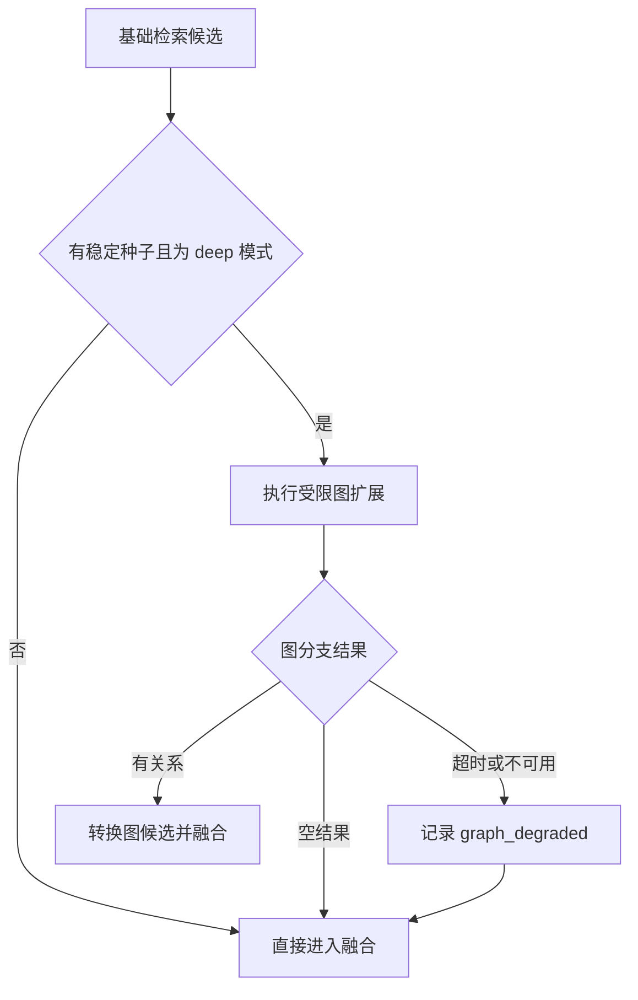

# 图谱辅助检索的路由、扩展与回退

用户问“远程访问和设备合规有什么关系”时，全文检索可能分别找到两份文档，却不一定找到连接它们的关系。知识图谱可以从已命中的“远程访问规范”出发，扩展出 `has_topic -> 设备合规`，为后续检索补充对象和查询词。

这不意味着查询一进来就遍历整张图。可靠的顺序是先用 Alias、精确检索、全文或向量检索找到少量种子对象，再做受限的一跳扩展。图结果作为一个候选通道参加融合，普通文本 Evidence 仍然保留。图服务超时或没有关系时，原检索结果照常返回。

::: info 图谱在在线检索中的位置

图谱负责发现“与已知对象存在什么受证据支持的关系”。它不负责认证用户，不负责决定活动 Release，也不替代原文 Chunk。身份、版本和权限由运行时传入，最终 Claim 仍要经过 Evidence 验证。

:::

## 图谱补的是关系召回，不是文本相似度

全文检索根据词项重合找内容，向量检索根据表示距离找语义相近内容，图谱检索沿显式关系找邻居。三种通道可能返回相同对象，也可能互相补充。

“远程访问需要什么条件”直接出现在规范正文时，全文检索已经足够。“远程访问规范关联的合规主题由哪些制度约束”则可能跨过文档、主题和上级目录，图谱更容易发现中间对象。图扩展找到对象后，还要回到全文、精确或向量通道取能够直接回答问题的片段。

把向量近邻直接写成图边，会混淆两种信号。向量距离随 Embedding 模型和索引变化，图边应有稳定关系类型和来源 Evidence。向量近邻适合在线计算，只有经过解释和治理的关系才适合长期入图。

图谱也不能补救差的基础检索。种子对象错了，扩展只会围绕错误对象找到更多邻居。实施图分支前，应先保证对象 ID、版本、ACL 和文本召回可用，再用成对样本验证图谱是否增加有效 Evidence。
## 种子对象来自已有候选，不由模型凭空创建

在线链路先解析查询。Alias 可以把“六六活动”路由到稳定知识对象，精确检索可以从编号命中对象，全文和向量通道则返回 Chunk。融合后，每个候选保留 `knowledge_object_id`、`root_node_id`、文档版本和通道来源。

图分支从排名靠前的候选取稳定对象 ID，而不是把查询中的名词直接拼进 SQL。原因很实际：查询里的“它”“平台”“当前规范”可能依赖多轮上下文；模型抽出的实体名称也可能同名。已有候选经过范围和权限过滤，更适合作为种子。

如果候选没有 `knowledge_object_id`，可以退回 `root_node_id`；两者都没有时，不应按标题猜图节点。标题只适合搜索候选，不能证明图中的同名节点就是当前文档。

种子还要去重和限量。一个问题经过多路检索可能返回同一文档的多个 Chunk，全部拿去扩展会重复查询同一个节点。可以先按知识对象融合，取前 12 个种子，再由图分支控制最终关系数量。
## 查询意图决定关系方向和允许集合

同一个种子可以连接很多种边。用户问“这个需求有哪些任务”，需要从需求沿 `has_task` 出边；问“这个任务属于哪个需求”，则从任务沿同一关系反向查找。若查询层只识别实体、不识别关系意图，图服务只能双向展开，噪声会明显增加。

关系意图可以由结构化查询理解产生，例如 `target_type=requirement`、`relation_intent=children`、`answer_shape=list`。模型负责提出候选，程序把候选映射到已注册的关系模板。`children` 在需求域映射到 `has_task` 出边，在文档域可能映射到 `contains` 出边，不能把领域差异交给一条通用 Prompt 猜。

查询中没有明确关系词时，可以先运行一跳宽松扩展，再让 Reranker 判断，但开放的仍是安全白名单。涉及“负责人”“权限”“依赖”这类高风险关系时，最好要求明确意图和直接 Evidence。模型看到某个人名与项目同处一个子图，不得自行补成负责人关系。

关系模板还应定义返回形状。归属关系预期一个父对象，包含关系可能返回列表，依赖关系可能有方向和状态条件。图结果不符合基数约束时，返回冲突或多个候选，而不是只取排序第一项。这个约束能提前暴露图数据错误，也能帮助回答层选择列表、澄清或拒答。

多轮对话要保存稳定对象焦点，而不是只保存上一轮名字。上一轮已经确认 `requirement-66`，下一轮问“它有哪些任务”时可以复用对象 ID，但仍要用本轮身份和 Release 重新过滤。权限变化后，旧焦点不能绕过当前 ACL。

::: warning Alias 命中只是种子候选

Alias 解决名称映射，不能跳过 ACL。不可见对象即使在别名表中命中，也不能成为图种子，更不能把节点名称和邻居带进模型上下文。

:::
## 只有需要关系推理的模式才开启图分支

图查询会增加数据库遍历、候选数量和验证成本。简单事实查询每次都跑图，通常只会增加延迟。因此可以让检索计划区分快速、标准和深度模式。

快速模式优先精确与稀疏检索，标准模式加入向量、表格等通道，深度模式才增加 `graph` 分支。模式选择不能只看用户是否说“分析一下”，还要结合问题是否包含关系、多对象、归属、依赖或跨文档比较。

计划中的图分支要和其他分支共享总 Deadline 与 Evidence 预算。它可以有自己的 `top_k`，但不能在文本通道已经耗尽时间后无限等待。若图分支只是增强项，超时后应立即降级；只有产品明确要求必须回答关系问题时，才把图不可用升级为整体失败。

运行时也可以根据种子质量决定是否执行。没有稳定对象 ID、候选分数过低或候选互相冲突时，先做澄清或普通检索。低质量种子进入图后产生的节点越多，后续重排越难纠正。
## 一跳扩展先解决大多数在线关系问题

从种子节点找直接相连的边，是最容易控制的图检索。查询输入包括知识范围、当前身份、种子对象 ID、种子节点 ID、数量上限和可选的 `knowledge_release_id`。

数据库先构造 `visible_nodes` 与 `visible_edges`。可见节点必须有至少一条当前身份可读、版本有效的节点来源；可见边必须连接两个可见节点，并至少有一条可读、版本有效的活动 Evidence。之后再从可见节点中选种子并连接一跳边。

这套顺序很重要。若先遍历全图，最后才过滤节点，查询计划可能已经接触不可见关系，缓存和日志也可能记录敏感名称。把 ACL 与版本条件放入基础 CTE，后续种子和边都只能从可见集合产生。

一跳结果可以返回：

| 字段 | 用途 |
| --- | --- |
| `seed_object_id` | 说明关系由哪个检索候选引出 |
| `seed_node_id` | 连接图节点与文档根节点 |
| `relation_type` / `label` | 表达机器关系和显示名称 |
| `source_name` / `target_name` | 形成可读关系上下文 |
| `target_description` | 给重排和查询扩展提供少量说明 |
| `confidence` | 关系通道的排序信号之一 |

结果按置信度、边权重和更新时间排序，并限制在一个小上限内。置信度不是最终真值，只用于同一批已通过证据与权限过滤的关系排序。
## Release 条件决定关系属于当前还是历史版本

普通查询只读取活动文档版本的节点来源和 Evidence。携带 `knowledge_release_id` 时，版本条件改为读取该 Release 对象的图谱投影版本。这样旧 Release 可以继续看到当时的关系，而不会混入当前草稿。

Release 感知不是只过滤种子。关系两端的节点来源、边 Evidence 和图谱投影状态都要属于指定版本。只固定种子对象，邻居却从当前图读取，会生成跨版本路径。

权限条件始终按当前主体计算。历史 Release 保存旧内容，不代表已撤回权限的用户还能查看。版本回答“当时发布了什么”，ACL 回答“现在谁能读”，二者缺一不可。

图谱投影尚未就绪时，系统可以返回空图上下文并继续文本检索，因为 RAG 投影可能已经可用。若图谱是该问题不可缺少的通道，响应要明确“关系投影未就绪”，不能把空图误判成“对象之间没有关系”。
## 关系白名单、方向和节点预算控制扩展范围

热门节点会迅速放大候选。“信息安全”主题可能连接几百份文档，“负责人”节点可能连接大量需求。仅设置深度为一跳，也可能返回过多关系。

数量限制是最后一道保护，更早的过滤应基于关系类型和方向。查询“某需求包含哪些任务”只需要 `has_task` 的出边；查询“这项任务属于哪个需求”则需要同一关系的入边。无差别双向扩展会把无关的负责人、主题和附件都带进来。

关系白名单可以由查询意图映射得到。归属问题开放 `contains`、`has_task`；引用问题开放 `references_document`；主题问题开放 `has_topic`。模型可以提出候选意图，程序从受控集合中选择关系，不能让模型直接提供任意 SQL 关系名。

对高出度节点，还可以设置每种关系配额、每个种子配额和全局配额。比如每个种子最多取 5 条 `has_topic` 和 8 条 `references_document`，总关系不超过 30。配额不应隐藏在固定 `slice` 中，要进入检索计划和 Trace，便于解释为何某条邻居未被访问。

多跳扩展需要更严格的路径约束。第二跳只有在第一跳关系与问题相关、剩余预算足够时才执行。每条路径保存访问节点集合，避免环路；同一节点经不同路径到达时，保留更短或证据更强的路径。
## 多跳检索需要显式路径状态和停止条件

一跳回答不了“规范关联的主题由哪些上位制度定义”时，可以继续第二跳，但执行对象已经从一批关系变成一组路径。每条路径至少保存当前节点、经过的边、累计证据、深度、已访问节点和剩余预算。

扩展可以使用受限的 Beam Search。每轮只保留少量得分较高的路径，得分综合查询相关性、关系类型优先级、Evidence 完整度和路径长度惩罚。不能只把边置信度相乘，确定性边的 `1.0` 与模型边的 `0.9` 不代表可直接比较的概率。

停止条件需要写进程序：达到最大深度；关系或节点预算用完；新一轮没有未访问节点；已经找到满足答案形状的 Evidence；剩余 Deadline 不足以完成下一轮检索。模型可以建议“证据似乎够了”，最终是否停止仍由这些可观察条件决定。

环路检测按稳定节点 ID，而不是显示名称。`A -> B -> A` 必须停止；`A -> B -> C` 中 C 与 A 同名但 ID 不同，则不能因名称相同提前丢弃。路径去重可以用节点和关系序列，保留证据更完整的一条。

每多一跳，ACL 组合都要重新计算。路径中任何节点或边不可见，整条路径不能返回。不能只过滤终点，否则路径本身可能泄露一个不可见中间项目。Release 条件也要覆盖每条 Evidence，跨版本拼出的完整路径仍是无效路径。

多跳输出最好先用于发现目标对象，再回到文本检索。把三跳关系直接塞进回答上下文，读者很难核对每一步。重新检索目标对象后，可以用原文 Evidence 支撑具体事实，路径只解释为什么系统找到了它。
## 图关系怎样变成可以融合的候选

图服务返回关系上下文后，检索运行时可以把它转换成统一 `SearchCandidate`。内容通常是“远程访问规范 --主题--> 设备合规”加目标说明，通道标记为 `graph`，类型标记为 `knowledge_graph_relation`。

统一候选格式让图通道进入同一去重、融合、重排和 Evidence 预算流程，但不能抹掉来源差异。图关系没有普通 Chunk 的段落正文和邻接内容，`metadata.source_type` 必须保留为知识图谱，回答验证才能识别它是关系证据。

更严格的实现会把 `edge_id` 和可见 `evidence_id` 一并返回，再从对应 Chunk 取得 quote。只把关系名称和目标说明交给回答层，适合导航与查询扩展，不足以支撑包含具体条件的事实 Claim。比如 `requires` 说明存在依赖，却不包含“哪些设备、何时检查、失败如何处理”。

图候选可以有两种用途：

- 作为上下文候选，帮助 Planner 知道对象之间的关系。
- 作为查询扩展，使用目标对象 ID 或规范名称再跑一次文本检索。

第二种更适合事实回答，因为最终 Evidence 回到文档 Chunk。代价是多一轮检索，需要从总预算扣除。不能把扩展产生的所有邻居都重新检索，否则热门节点问题会换一种形式出现。
## 融合时不能让图候选挤掉直接原文

图关系分数和全文、向量分数不在同一量纲。直接按数值排序会让某个通道长期占优。可以使用 RRF 等基于排名的融合，再给通道设置上限，最后由 Reranker 根据问题评估相关性。

Evidence 预算还要保证直接原文的席位。对于需要回答制度内容的问题，图候选最多占一部分预算，其余留给当前 Release 的 Chunk、表格行和结构化结果。图谱适合解释关系，不应该把支撑细节的原文全部挤走。

去重不能只看标题。图候选的 `chunk_id` 可以由种子对象和关系序号生成，普通候选则用真实 Chunk ID。对象级去重时保留通道信息：同一知识对象既被全文命中又被图扩展发现，这种交叉信号可以提升排序，但内容只保留一份最合适的表示。

目标描述来自可见节点来源，仍可能与原文 Chunk 重复。融合后检查高相似段落，保留带精确来源定位的文本证据，把图关系作为关联元数据，而不是重复占两个 Evidence 名额。
## 图谱描述仍属于不可信检索内容

节点名称、说明和关系标签最终来自文档、管理员输入或模型派生，它们都可能包含间接提示注入。图服务把一段节点说明标成 `tool_result`，只表示它由受控工具返回，不表示说明文本可以修改系统指令。

传入模型前应使用结构化边界，把对象 ID、关系类型与显示文本分开，并明确这些字段只能作为资料。节点说明出现“忽略之前规则”“调用某工具删除数据”等内容时，安全扫描应标记并剥离指令性片段。图候选不能直接进入工具参数，Planner 需要从受控字段重新组装请求。

关系类型和对象 ID 比自由文本更可信，因为它们经过 Schema 与程序校验；名称和说明仍要按外部内容处理。回答引用关系时，优先使用 Evidence quote，不引用图数据库内部 ID，也不把隐藏的 ACL 主体或策略信息写进答案。

日志同样要限制内容。记录种子 ID、边 ID、关系类型、过滤数量和耗时已经足够排障，完整节点说明不进入指标标签。安全事件可以保存受控摘要，并通过权限严格的 Trace 查看原始候选。

图谱中的恶意文本被过滤后，关系仍可能用于对象导航，但不能支撑包含该文本的 Claim。若关系本身也依赖被判定不可信的唯一 Evidence，应让边退出本轮可见集合。
## 图服务失败时保留基础检索

图分支是并行检索的一部分，它的失败不应默认清空其他分支。超时、连接错误、Release 投影未就绪和没有种子是四种不同结果。

没有种子表示基础检索尚未找到稳定对象，图查询不执行；没有关系表示种子可见，但受限扩展为空；超时表示结果未知；投影未就绪表示该版本暂时没有可用图。Trace 要分别记录，回答层才能避免把“未知”说成“没有”。



重试要服从总 Deadline。数据库瞬时错误可以在剩余预算内重试一次；ACL 拒绝、种子为空和关系被版本过滤不会因重试改变。图服务持续超时时，熔断器可以暂时关闭图分支，让流量回到文本检索，避免每个请求都付出完整超时。

回退后的回答可以照常生成，但若问题明确要求跨对象关系，而文本 Evidence 不足，应安全说明无法确认。降级不等于用模型常识补齐缺失关系。
## 缓存必须绑定种子、版本和权限范围

一跳扩展查询重复度可能很高，适合短时缓存。缓存键至少包含知识范围、排序后的种子对象 ID、Release 或活动版本、关系白名单、方向、数量上限和权限范围哈希。只用查询文本或种子 ID，会把管理员看到的邻居复用给普通用户。

缓存值保存稳定关系上下文，不保存完整用户问题。命中后仍可做一次轻量可见性复核，防止 ACL 在 TTL 内撤回。安全要求高的系统宁可缓存全局候选并每次执行 ACL SQL，也不要缓存已经授权的最终结果而忽略策略版本。

图谱构建激活、Evidence 失活、Release 切换和 ACL 修订都会影响缓存。可以把构建版本与策略修订放进键，让旧值自然失效；也可以发布精确失效事件。只依靠固定 TTL，撤回窗口可能过长。

并发请求命中同一未缓存键时，Singleflight 可以合并图查询。等待者要有自己的 Deadline 和取消状态，不能因为首个请求仍在运行就无限等待。首个查询失败时，所有等待者都应回到各自的基础检索，而不是共享一个整体错误响应。

缓存指标要区分“命中后返回关系”和“命中后被 ACL 全部过滤”。后者持续升高，说明权限修订没有进入键或失效机制滞后。缓存节省的图查询次数可以观察，但不能以牺牲撤回时效为代价追求命中率。
## 一次图文联合检索的执行轨迹

共享示例从一个文本种子开始。图中有两条关系：可见的“远程访问规范 has_topic 设备合规”，以及仅管理员可见的“远程访问规范 references_document 未公开项目”。普通读者查询 `release-7`，并只开放 `has_topic` 与 `requires`。

<<< ../../examples/ai-agent/graph_assisted_retrieval.py

运行示例：

```bash
PYTHONPATH=examples/ai-agent \
  python3 examples/ai-agent/graph_assisted_retrieval.py
```

结果保留一个基础候选和一个图关系。未公开项目同时被 ACL 与关系白名单排除，不会出现在图上下文。`standard` 模式不会调用图服务；`deep` 模式遇到 `GraphTimeout` 时返回原基础候选，并写入 `degraded_reason=graph_timeout`。

这个示例验证的是路由和过滤控制流。它没有数据库 CTE、真实 Release 投影、并发分支、RRF 和 Reranker，也没有证明图关系能提高答案质量。
## 故障证据要能判断问题出在种子还是扩展

图分支返回无关内容时，可以按五个位置排查：

| 位置 | 需要保留的证据 | 常见原因 |
| --- | --- | --- |
| 查询理解 | 模式、规范化查询、Alias 候选 | 关系问题被当成普通事实问题 |
| 基础检索 | 候选对象 ID、版本、通道和排名 | 种子对象本身错误 |
| 图扩展 | 关系白名单、方向、种子与数量上限 | 热门节点或方向设置错误 |
| 可见性 | Release ID、ACL 策略版本、过滤计数 | 旧边或越权边进入结果 |
| 融合 | 各通道排名、去重键、预算分配 | 图候选挤掉直接 Evidence |

只记录“graph returned 30 nodes”没有帮助。需要知道 30 个节点由哪个种子、哪类边、哪个版本产生，又有多少在 ACL 和关系过滤后被删除。日志保存稳定 ID 和计数即可，节点说明、完整查询与文档内容留在受控存储。

若图候选和当前原文冲突，先核对二者版本。版本相同再检查边 Evidence 是否仍活动、原文是否删除了关系、图构建是否过期。不能用图边的高置信度覆盖原文，也不能在没有检查 Evidence 的情况下直接删除关系。

图扩展为空却预期有关系时，按顺序检查种子身份、节点来源可见性、边 Evidence、Release 投影和关系阈值。重复调用模型不会修复这些确定性问题。
## 用成对问题测量图谱是否真的增加 Evidence

图谱评测不能只数返回节点。需要准备两组问题：图关系确实能补召回的问题，以及普通检索已经足够的问题。前一组看新增 Evidence 覆盖，后一组看是否引入噪声和额外延迟。

一个关系样本可以问“远程访问规范关联哪个合规主题，该主题由哪份制度解释”。评测记录基础检索 Evidence、加入图分支后的 Evidence、最终支持的 Claim 和错误扩展。若图只返回主题名，没有找到解释主题的原文，说明关系发现成功，但端到端回答仍未改善。

还要覆盖 Alias 歧义、图服务超时、旧 Release、ACL 撤回和热门节点。每个样本同时比较：

- 种子对象是否正确。
- 关系路径是否在允许集合内。
- 新增候选是否带可见 Evidence。
- 最终答案是否增加受支持 Claim。
- 普通问题的错误率和延迟是否恶化。

线上指标可以观察图分支启用率、空结果率、降级原因、候选进入最终 Evidence 的比例，以及图候选带来的额外耗时。启用率高不代表有价值，真正相关的是它是否补充了文本检索缺少的证据。
## 什么时候普通文本检索已经足够

问题能在单份文档中直接找到、知识对象缺少稳定身份、关系没有 Evidence 或图构建严重滞后时，普通混合检索更可靠。只为展示一张图而维护在线图分支，会增加版本、ACL、缓存和排障成本。

图谱适合关系问题稳定出现的知识域，例如需求与任务、制度与主题、文档与附件、系统与负责人。即使在这些场景，也应从一跳、少量关系白名单开始。评测证明一跳不足后，再增加受控多跳或社区摘要。

最终链路应保持可降级：Alias 和文本检索找到种子，图谱补邻居，RAG 取原文，验证器确认 Claim。图谱拿不到结果时，系统少一个增强通道，不会失去整套检索能力。

上线时可以先把图分支放在 Shadow 模式，只记录它会补充哪些候选，不进入最终回答。离线回放确认新增候选确实提高 Evidence 覆盖，而且 ACL、版本和延迟都在预算内，再逐步开放给关系型问题。若结果主要是重复文本候选，就继续保留普通检索，不必为了使用图谱而切换主链路。
## 图扩展必须有深度和边界

图谱适合沿已确认实体关系补齐候选，不适合把模糊名称扩展成全库漫游。路由先确认实体与 ACL，再限制 hop 数、节点数和关系类型，每条边保留来源与 Release。

图服务超时或关系缺证时，退回普通检索并标记降级原因。图谱候选和向量候选去重后仍要经过同一套 Evidence 验证，图上的连通性不是答案事实。
