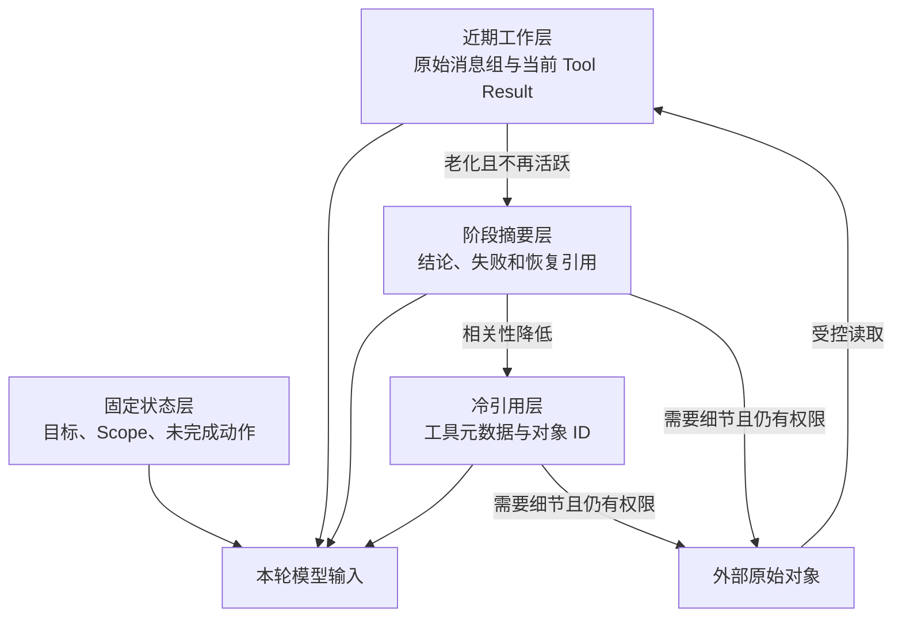

# 分层压缩怎样保护近期工作状态

“越旧越不重要”适合做初步判断，却不是真理。Agent 可能在第三步读取一个配置文件，之后花二十步检索和测试，最后仍要修改最早那份文件。如果压缩器只看距离，把旧 File Result 降成“曾读取 config.py，共 18 KB”，模型只能再次读取。省下的 Token 很快原样回来，还多一次工具往返。

单层摘要还有另一个问题：它让所有内容以同一种速度退化。近期 Tool Result、阶段决定、工作文件和一个月前的背景资料，对当前决策的价值不同。分层压缩会为它们设置不同表示：近期工作集保留原文，中期结果保留含义和恢复线索，较冷材料保留元数据与稳定引用，原始对象继续存在外部存储。

本篇不再重复摘要生成与接纳流程，而是回答三件事：怎样划层，哪些旧结果不能降到底层，以及怎样限制分层压缩本身的模型调用与缓存代价。

::: info 分层不是按时间删文件

层级描述“本轮给模型看多少”，不改变原始对象的事实身份和保留策略。内容从完整视图降为摘要或存根后，原文件、Tool Result 和会话消息仍由各自存储管理。

:::

## 共享示例需要什么环境

本文的分类器是 Python 标准库示例，不需要模型密钥、向量数据库或远程服务。若要运行文章末尾的测试，先从 [Python 官方下载页](https://www.python.org/downloads/) 选择维护中的版本，再创建隔离环境：

<figure class="doc-shot">
  
  <figcaption>Python 官方下载入口。截图只帮助定位平台下载位置，实际版本和系统要求以页面当前内容为准。</figcaption>
</figure>

```bash
python3 --version
python3 -m venv .venv
. .venv/bin/activate
python -m pip install --upgrade pip
```

命令只验证解释器和虚拟环境可用，不代表真实模型、浏览器或外部工具已经接入。看到 `python --version` 与当前环境一致后，再运行示例测试；如果终端找不到命令，先检查 PATH 和虚拟环境是否已激活。

## 为什么单层摘要保护不了工作集

单层摘要把一段旧历史揉成一段文本，适合承接会话目标，却不适合所有工具结果。搜索结果的匹配行、页面可访问性树、数据表结构和正在编辑的文件，正文就是调用价值。只保留“执行过搜索”或“读取过页面”，无法支持下一步。

另一类结果可以安全降级。例如健康检查已经确认服务正常，后续只需知道时间、目标与 `status=ok`；安装命令已经成功，完整终端输出只在排障时需要。它们保留元数据和回执即可，不必每轮重复全文。

单层摘要还会混淆任务分支。Agent 同时调查鉴权、网络和缓存，若一段总摘要写“已经定位配置问题”，读者不知道属于哪条分支、用了哪份证据。分层结构让每个观察保持 `observation_id`、工具、参数摘要、分支和原文引用，即使正文缩短，身份仍然独立。

压缩误差也会递归传播。所有旧内容每轮重新进入总摘要，一次错误概括可能覆盖多个阶段。分层后，近期原文不会被旧摘要改写；中期摘要只处理自己的观察；冷存根不再反复送给模型。误差被限制在对应层，而不是不断扩散。

## 四层上下文分别承担什么职责

**固定状态层**保存当前目标、可信 Scope、Policy、未完成动作、审批状态和输出合同。它不按年龄压缩，由 Runtime 从结构化状态渲染。某项完成或失效后退出，而不是永久占用窗口。

**近期工作层**保存当前几步的消息组、Tool Call 与 Tool Result、最近纠正和正在使用的文件片段。模型正在基于这些内容推理，改成摘要可能立即丢掉变量名、错误行或页面控件。该层按 Token 设置上限，同时保证消息协议配对。

**阶段摘要层**保存已经离开近期窗口、但仍可能影响当前任务的结果。它保留结论、失败路径、关键字段、来源和恢复引用，格式可以是语义摘要或确定性首尾预览。模型知道学到了什么，也知道需要细节时从哪里取回。

**冷引用层**只保存工具、参数摘要、时间、结果大小、状态和对象引用。适合已完成且重读概率低的健康检查、目录枚举或旧搜索。存根能说明发生过什么，却不应被当成支持答案的 Evidence。

原始对象存储可以视为层外来源。它不占 Prompt，却是摘要与存根的恢复基础。对象删除、权限撤回或版本更新时，对应摘要和引用必须失效；一个无法回读的存根不能继续标记为 recoverable。

四层不是固定产品常量。短任务可能只有固定状态和近期层；长研究任务需要阶段摘要与冷引用；涉及大文件还要对象存储。设计时先列实际材料和失败模式，再设各层预算，不能为了名词完整创建无消费者的状态表。



## 年龄为什么只能作为相关性的代理

年龄容易计算：某条结果之后又出现多少个 Tool Result，或距离当前 Turn 多少步。多数任务中，较新内容更可能相关，因此它适合作为默认分类信号。问题在于代理会失效，活跃引用、任务依赖和内容类型都能推翻年龄判断。

一份很旧的文件只要仍在编辑计划中，就属于工作集。一个较新的目录列表如果已确认无用，可以直接降级。压缩器需要从 Runtime 读取活动对象、当前计划依赖和未完成 `call_id`，而不是让模型根据正文猜相关性。

任务切换也会改变层级。用户暂停鉴权问题，转去处理部署，鉴权的近期结果可以降到阶段摘要；用户稍后恢复鉴权分支，相关摘要和文件引用重新读入近期层。升级不是把旧摘要伪装成原文，而是通过受控工具取回原对象并生成新的 Observation。

相关性判断要有版本。计划 V3 仍引用文件 F1，计划 V4 已删除这项依赖，V3 的活动标记不能让 F1 永久留在近期层。编译器固定当前 Plan 与 State revision，并记录每次层级变化基于哪个版本。

年龄和任务相关性发生冲突时，承重状态优先。这样会增加一些 Token，却避免重复工具调用与错误决策。是否值得保留可以用重读率、重读成本和质量回归验证，不用主观感觉决定。

## 哪些工具结果需要最低保留层

判断方法很直接：只看元数据存根，模型能继续任务吗？如果答案只能是“重新运行工具”，说明存根销毁了调用价值，这类工具需要最低保留层。

文件读取、代码搜索、目录查询和网页观察通常属于正文承载型结果。`grep` 的存根写“命中 47 处”没有告诉模型命中了什么；页面存根写“观察过设置页”没有控件名称和当前状态；目录存根没有文件列表，也无法选择下一路径。它们至少保留有界预览、匹配摘要或可操作结构。

最低保留不等于完整原文永久驻留。正在修改的文件可以完整留在近期层，离开工作集后降成结构化摘要，保存关键符号、改动范围和内容哈希；再次需要时按哈希读取。浏览器页面一旦导航或 DOM 变化，旧观察已不再可操作，即使文本仍有信息，也应标记 stale，不让模型按旧坐标点击。

状态型工具更容易进入冷层。健康检查、任务状态查询和版本读取只要有稳定字段与回执，存根常能支持后续判断。即便如此，涉及当前审批、权限或外部副作用的状态仍进入固定层，不能因工具类型通常轻量就降级。

工具分类由能力目录或适配器提供，不能靠名称前缀成为唯一依据。新工具上线时要明确 `content_bearing`、是否可重读、结果生命周期和最低层。名称规则可以作为默认值，最终由契约测试确认。

## 不同结果怎样生成缩减表示

文件结果的阶段摘要要保存路径或对象 ID、内容哈希、语言、读取范围、关键符号与当前改动关系。首尾预览适合普通文本，却可能漏掉中间正在修改的函数；计划已经指向具体符号时，应围绕符号保留局部片段。文件更新后哈希变化，旧片段立即失效。

代码搜索结果保留查询、匹配总数、每个来源的代表匹配、行范围和继续读取游标。只保留第一批命中可能让一个文件占满摘要，因此还要限制每来源数量。正则、大小写和忽略规则属于查询身份，缺失后无法解释为什么再次搜索得到不同结果。

结构化数据不能先转成长字符串再截断。表格预览保留列名、总行数、排序与过滤条件、若干代表行和分页游标；JSON 保留顶层 Schema、关键状态字段、数组数量和被省略路径。金额、权限、版本和错误码使用原始类型，不能在语义摘要中变成“大约”或“类似”。

终端输出按命令阶段处理。成功命令保留命令摘要、退出码和关键产物；失败命令保留退出码、标准错误尾部、首个相关栈位置和工作目录。大量安装进度可以丢弃，真正触发失败的行不能只因位于中间而消失。命令中包含凭证时先脱敏，摘要器不应接触秘密。

页面观察既有文本，也有可操作结构。当前页面的控件角色、名称、状态和页面版本属于近期工作集；导航后旧控件坐标失效，可以降为访问记录与截图引用。仅保留截图而没有可访问性信息，模型未必能恢复控件；仅保留文本又可能丢掉布局和状态，具体组合由交互工具合同决定。

检索 Evidence 与普通 Tool Result 也不同。Evidence 缩减后仍要保留 Source、Chunk、Release、ACL 结果和引用片段，不能只留模型生成的结论。多个 Chunk 来自同一 Source 时，可以按 Claim 合并预览，但来源覆盖和相关等级仍然独立，避免把重复片段误算成多份证据。

每种缩减器都返回统一外壳：观察身份、原对象身份、表示层、生成方法、内容、截断位置、是否可恢复、失效条件和前后 Token。统一的是元数据合同，不是内容算法。这样上下文编译器可以计费和去重，同时把文件、表格、页面各自交给正确解析器。

缩减失败也按类型处理。JSON 解析失败时保留有界原文和解析错误，不使用可能破坏结构的字段摘要；文件不存在时只保留删除事实和旧哈希；页面已经失效时禁止继续输出“可点击”控件。失败表示仍可进入 Trace，但是否进入模型取决于当前任务需要。

## 每层预算怎样在压力下收缩

层级预算先扣除固定状态，再为近期工作集设置硬下限。剩余空间分给阶段摘要和冷存根。近期层超过自身目标时，不立即把当前观察压掉，而是先让已经完成且不活跃的组离开；阶段层超限时按任务相关性与重读成本选择表示；冷层只保留足以审计和重新发现的身份。

预算不是四个互不相通的固定桶。阶段摘要很少时，空余可以给近期层；近期突然出现大日志时，可以外溢并借用一部分阶段空间。借用要保持总输入、输出预留和安全余量，不能让每层都按自己的上限计算后总和超过模型窗口。

压缩压力持续上升时，系统按已声明顺序退化：先合并重复结果，再减少低相关预览，随后把可恢复的阶段摘要降为存根，最后缩小近期可选组。固定状态、当前问题和不可恢复的活动对象仍装不下时，进入明确失败，不再创建新摘要调用。

Token 压力与时间压力要分开。Deadline 临近时，即使还有 Token，也不适合启动语义压缩；使用现有表示和确定性预览更可控。模型配额耗尽同理，不能让上下文维护抢走回答所需的最后一次调用。

运行时可以根据重读率调整策略，但调整生成新版本。某类搜索摘要经常被再次展开，说明保留过少或任务需要专用工作文件；某类健康检查从不重读，可以更快进入冷层。在线指标提出候选，离线回归确认后才更新阈值，不能让每个请求自适应到无法复现。

## 派生表示何时可以清理

近期原文退出 Prompt 不代表原对象可删。清理器先检查活动 Turn、计划引用、审批、审计与回滚窗口，再处理摘要和存根。一个仍被活动对象引用的派生表示即使很旧，也不能按创建时间删除。

原对象删除会使所有派生层失效，但审计可能仍需保留身份、删除时间和哈希。摘要正文是否保留取决于数据政策；若正文包含用户已要求删除的信息，就不能以“只是摘要”为由继续保存。失效传播使用 Source ID 和版本关系，不靠全文搜索。

表示模板升级后，旧摘要可以作为回滚版本短期保留。新模板影子生成并通过回归，再切活动表示；观察期结束且没有 Turn 引用后精确清理旧 revision。删除目标按对象和版本列出，不使用“清理所有非当前层”这种宽条件。

## 分层变化为什么最好是单向且有版本

同一份摘要被每轮反复改写，会继续损失信息并破坏 Prompt Cache。一个观察第一次从完整层降为摘要后，保存压缩版本和输入哈希；材料、策略和摘要器没有变化时，后续继续使用同一字节，不再次概括。

从摘要层降为冷存根也需要明确策略。如果产品允许渐进老化，就创建新的表示版本，并保留上一层引用；如果摘要本身体积已经很小，继续降级的收益可能小于缓存失效和信息损失。并非所有对象最终都必须到最冷层。

“单向”指同一个派生表示不会原地升级成原文。任务再次需要对象时，从外部存储读取当前授权版本，创建新的近期 Observation。这样能确认读到的是最新对象，而不是把旧摘要扩写成看似完整的文本。

层级状态包含 `source_hash`、`representation_hash`、层级、方法和修订。原对象更新后，旧表示失效；摘要模型或模板升级时，候选重建与旧版本并存，回归通过后再切换。只保存一个 `compressed=true` 无法解释使用了哪种表示。

## 语义压缩本身也需要调用预算

阶段摘要可能调用模型。如果一次压力处理发现十二条中期结果，逐条调用十二次摘要器，成本和延迟可能超过被节省的上下文。每一趟要设置语义压缩尝试上限，超过后使用确定性首尾预览或保持原层等待下次处理。

上限按尝试次数计算，不按成功次数。摘要器连续失败时，失败尝试同样消耗时间和配额；按成功计数会让故障服务无限尝试。每个调用继承 Turn 剩余 Deadline，压缩不能把业务调用拖到超时。

语义摘要适合需要保留含义的自然语言和复杂输出，确定性预览适合代码、日志、JSON 和已经有结构字段的结果。对 JSON 可以保留 Schema、关键字段与首尾条目，对搜索结果保留命中数、前几条来源与游标。不能统一截前 300 字符后宣称语义完整。

压缩预算还要考虑重读代价。一个工具便宜、结果可快速重建，冷存根更合理；一个远程扫描耗时很长或结果依赖已经消失的页面，保留更多内容更划算。成本模型至少包含当前 Token、压缩调用、未来重读概率、工具延迟和不可恢复风险。

## 一个最小分层分类器怎样运行

共享示例用 `calls_after` 表示观察之后又发生了多少次工具调用，并接收两个修正信号：`active_reference` 表示当前计划仍引用，`content_bearing` 表示正文是工具价值。阈值由调用方传入，代码没有把某个实现快照的数字写成普遍规则。

<<< ../../examples/ai-agent/hierarchical_compression.py

输入包含四条观察。`o-1` 已经很旧，却是正在修改的文件，因此保持 full；`o-2` 是旧搜索正文，不能降成纯元数据，使用一次 semantic 摘要；`o-3` 是旧健康检查，进入 stub；`o-4` 位于中期且承载文件正文，但语义尝试额度已经用完，所以采用 deterministic 预览。

输出依次是 `full/none`、`summary/semantic`、`stub/metadata` 和 `summary/deterministic`。测试证明了活动引用优先于年龄，正文型结果存在最低层，语义额度按尝试受限。它没有生成摘要文本，也没有实现对象存储，生产链路要把决定交给对应适配器并验证输出结构。

把 `recent_distance` 设为负数，或冷层阈值不大于近期阈值，函数返回 `invalid_distance_thresholds`。配置错误在处理观察前失败，不会生成一半分层结果。

## 一次长任务怎样在各层之间移动

知识 Agent 要修改一份远程访问说明。第 1 步读取 `policy.md`，第 2 到 6 步搜索相关代码，第 7 步运行测试，第 8 到 15 步调查权限状态。到第 16 步，最早的文件已经很旧，但当前计划仍要求修改它。

固定层保存目标、只读 Scope、计划版本和待修改文件 ID。近期层保存最新权限查询、失败测试与当前用户纠正。`policy.md` 因 active reference 继续保留必要正文；早期搜索结果进入阶段摘要，记录匹配符号、无效路径和来源；已确认正常的健康检查只留存根。

编译器发现中期有五条可摘要结果，本趟语义额度为两次。两条自然语言调查结果走摘要器，其余代码搜索按结构生成首尾预览。每条保持 Tool Call 与 Tool Result 配对，最终请求复算后进入模型。

模型提出修改前，运行时核对 `policy.md` 的内容哈希。文件在任务期间已经更新，旧 Observation 失效。系统重新读取当前版本并替换近期对象，不把旧摘要当作可写基线。模型看到差异后重新规划。

失败轨迹把 `policy.md` 错降为存根。下一轮模型再次调用读取工具，Trace 出现同一对象短时间重复读取。这个证据指向层级下限或活动引用失效，不应通过扩大所有结果预算掩盖。修复后只让活动内容回到近期层，其他冷结果保持原策略。

## Tool Call 配对和缓存怎样保持可解释

分层压缩会重写 Tool Result，却不能删除对应 Tool Call 或改变 `call_id`。压缩前先建立调用映射，渲染摘要或存根时保留工具名、参数摘要和结果身份。供应商消息协议要求怎样配对，就按该协议生成完整组。

只压缩 Result 而 Call 仍携带巨大参数，也可能省不了多少。参数中的可信身份不应来自模型，长查询或输入文件可以外部化；但审批绑定的动作指纹和必要参数必须留在状态。Call 与 Result 分别有预算，不能只统计结果体积。

每次内容重写都会使该位置之后的 Prompt Cache 失效。压缩事件记录观察 ID、旧层、新层、方法、前后 Token 和表示哈希。缓存命中下降时，能够区分正常分层变化、摘要版本升级和其他 Prompt 变动。

已压缩结果保持字节稳定。装配器每轮重新排序字段、更新时间戳或换一种摘要措辞，即使语义不变也会破坏缓存。动态观测数据放 Trace，不写进稳定表示；只有来源、策略或内容变化才创建新 revision。

## 层间重复和旧状态覆盖怎样处理

同一观察不能同时以完整、摘要和存根三种文本进入模型。编译器按 `observation_id` 去重，只选择当前有效层；需要展示摘要加原文片段时，它们属于一个复合表示，共享一次预算，不是两条独立 Evidence。

阶段摘要可能提到“审批仍在等待”，固定层却显示刚刚批准。结构化近因状态优先，旧摘要中的冲突句在渲染时标记为历史，或触发摘要重建。不能让模型自行比较两段文字的时间并决定。

引用对象被删除或撤权后，摘要不能继续暴露其正文。失效器沿 Source ID 找到派生表示，移除内容并保留必要审计身份；下一次装配记录 `source_unavailable`。任务依赖该内容时停止或请求新来源，不从模型记忆补写。

层级迁移并发也要有 revision。压缩 Worker 基于 observation revision 3 生成摘要，主任务同时读取新版 revision 4；Worker 提交时因条件不匹配而放弃。按最后完成覆盖会让旧内容重新出现。

## 什么情况下分层压缩不是合适方案

短会话没有足够冷内容，运行分层器只增加代码路径与缓存变化。保持近期原文即可，达到可观察压力后再启用。

需要在任务末尾对比最早与最新完整结果时，年龄与相关性并不单调。长期基准、首次错误栈和最终结果都可能同等重要。它们应放进命名工作文件或数据集，通过明确引用读取，而不是依赖在对话中的相对位置。

对象不可重读且细节不可丢时，不应降为存根。临时网页、一次性终端和即将过期的外部响应需要在受控存储保存快照，或在当前阶段完成所需提取。没有恢复来源却标记为冷引用，会在真正需要时暴露空壳。

工具数量少、结果结构化且始终很短时，统一预算和简单裁剪足够。引入四层状态、迁移和清理的代价可能高于收益。架构取舍应比较实际超限、重复读取和缓存失效数据。

## 怎样测试分层没有省出更多成本

分类单元测试覆盖阈值边界、活动引用、正文型结果、状态型结果、语义尝试额度和非法配置。年龄相同但内容类型不同的观察应进入不同层，证明算法不只看距离。

协议测试构造多组并行 Tool Call，压缩后交给真实模型适配器做消息校验。每个 `call_id` 保持配对，Result 的摘要和存根满足内容 Schema；取消或失败调用也有对应终态，不留下孤立块。

质量回归准备长任务，检查当前文件、未完成动作、用户纠正和关键错误仍可用。模型需要重读的对象计数是重要信号：压缩后 Token 降低，却让同一文件反复读取，说明只是把成本转移到了工具和延迟。

故障测试让摘要器持续超时，断言尝试次数达到上限后全部退回确定性预览，不继续调用；让对象在装配前撤权，断言派生正文不进入模型；让旧 Worker 迟到提交，断言 revision 不倒退。

缓存回归比较重写前后的前缀断点。每个变化能关联到分层事件，未变化表示保持字节一致。模型、策略或 Source 更新产生预期失效，不应为了缓存继续使用旧内容。

共享示例运行命令如下：

```bash
PYTHONPATH=examples/ai-agent python3 -m unittest discover \
  -s examples/ai-agent/tests -p 'test_*.py'
```

测试通过只证明分类与调用预算。生产验证还要观察各层 Token、摘要尝试、确定性降级、对象重读、缓存命中、权限失效和恢复成功。上线先影子分类，不改实际 Prompt；确认活动对象没有被错误降级后，再按任务类型逐步启用。

分层压缩的核心不是设计更多摘要，而是让信息按职责退化：当前状态保持确定，近期内容保留细节，中期结果保留意义，冷材料保留身份与恢复路径。年龄提供起点，活动引用和内容类型修正它，调用预算约束压缩成本，版本与事件则让每次重写能够解释和回滚。
