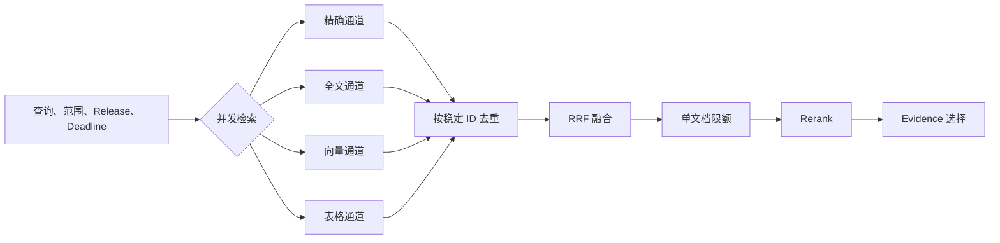

# 混合检索的融合、去重与重排

用户问：“`RA-2026-0142` 因设备不合规被拒绝后怎样处理？”精确通道能找到申请对象，全文通道能找到“整改后重新提交”的制度，向量通道可能找到措辞不同的设备基线说明，表格通道还能命中状态和原因。每条通道都只看到了问题的一部分。

**混合检索**让多条检索通道在同一个授权范围内取得候选，再合并为一份可解释的排名。它解决的是通道盲区和分数尺度不同的问题。通道越多，系统还会遇到重复 Candidate、部分超时、单文档挤占、Reranker 故障和成本上升，因此“并行发出几个搜索请求”只是开始。

::: info 融合与重排处理不同问题

**融合**根据多个通道的名次与身份生成初始统一排名，重点是去重和保留各通道贡献。**重排**重新比较有限候选与完整问题的相关性，重点是让真正能回答问题的证据靠前。Rerank 失败时，融合顺序仍应可用。

:::

这一篇沿用上一节生成的 Candidate 契约。每条候选至少有稳定 Chunk ID、知识对象 ID、Release、来源路径、通道名、通道内名次、通道分数和权限裁决。融合器不能接收只有文本和浮点分数的匿名结果，因为它既无法去重，也无法在出错时追溯来源。

## 所有通道共享同一份可信范围

查询理解完成后，运行时固定用户身份、权限主体、显式范围、Release、通道配置和绝对 Deadline。这份不可变请求传给精确、全文、向量、表格和范围浏览通道。模型可以建议使用哪些通道，最终启用集合仍由程序根据模式、预算和策略白名单确定。

权限过滤尽量在数据库读取前完成。每条通道查询同一个 `visible_chunks` 集合，或者使用语义等价的过滤条件。不能让向量通道按租户过滤、全文通道却扫描全库，再到融合阶段删除越权结果。后者已经让敏感正文进入应用内存和 Trace。

Release 同样是通道输入。指定历史版本时，精确标题、全文索引、向量和表格字段都读取该版本的候选。某条通道没有对应版本索引，应返回 `channel_not_ready`，不能悄悄切到当前活动版本。融合器不会用新版本候选填补旧版空缺。

各通道还共享候选上限和范围规则，具体 Top K 可以不同。精确通道通常候选少，向量通道需要更大的召回池，表格通道可能按行返回。运行配置记录每条通道的限额，最终再设置统一融合上限和单文档上限。

身份和版本加载失败属于请求级失败。Embedding 超时只影响向量通道，ACL 快照不可用则没有任何通道可以继续。系统在执行前区分质量增强依赖与可信边界依赖，避免故障发生后临时猜测是否可降级。
## 并发缩短等待，也会共享资源压力

多条通道彼此独立时可以并发。运行时在同一父 Deadline 下为每条通道分配子超时，保存开始时间、结束时间、候选数和错误类型。先完成的结果暂存在本次 Query ID 下，完成顺序不参与排名。



并发不会消除成本。四条 SQL 会同时占用连接池，向量生成与 Rerank 会占用模型配额，大候选集还会增加内存和序列化。高并发请求下，每次查询都开启所有通道，可能让单次延迟降低、整体吞吐下降。通道选择需要结合查询特征和系统负载。

取消信号从父请求传到所有分支。Deadline 到达后停止创建新工作，取消仍未完成的数据库和模型调用，并等待必要的资源清理。迟到结果可以作为诊断记录，不能写回已经完成的融合状态。Query ID 与状态修订防止旧分支覆盖新运行。

部分完成需要最低条件。编号查询的精确通道成功、向量通道超时，往往还能继续；研究型问题要求语义召回而所有语义通道都失败时，只有精确结果可能不足。策略为不同查询类型定义最低通道集合或最低 Evidence 覆盖，不用“至少一条通道成功”作为统一标准。
## 稳定候选身份是去重的前提

同一 Chunk 可能在精确通道排第 2、全文通道排第 1、向量通道排第 6。融合前先按稳定 Chunk ID 合并，结果保留三个名次、三个原始分数和通道集合。Candidate 的正文、对象 ID、Release 和来源路径应一致；任何关键字段冲突都说明索引版本或映射出了问题。

| 身份字段 | 解决的问题 | 不能省略的原因 |
| --- | --- | --- |
| `knowledge_object_id` | 区分相同文字属于哪个知识对象 | 权限、生命周期和业务归属可能不同 |
| `document_version_id` | 固定候选来自哪一版文档 | 新旧制度不能在融合时合并 |
| `stable_chunk_id` | 连接不同检索通道的同一内容块 | 排名、Trace 和评测需要逐项对齐 |
| `release_id` | 固定本次可服务的发布版本 | 相同 Chunk ID 也可能处于不同活动版本 |
| `channel_hits` | 保存各通道名次和原始分数 | 融合失败时要定位候选在哪一步丢失 |

不能用正文哈希代替全部身份。相同免责声明可能出现在多份文档中，文字相同却属于不同对象、权限和版本。相反，同一 Chunk 的显示文本与回答文本可能不同，仍然是一个来源。较稳的身份由知识对象、文档版本和稳定 Chunk ID 共同确定。

去重也有层级。Chunk 级去重合并多通道命中，对象级限额控制一份长文占用多少位置，语义近重复处理内容高度相似但来源不同的 Candidate。三者不能一次完成。两份独立制度说了相同条件时，它们可能构成相互印证，直接按语义只留一份会丢失来源多样性。

相邻 Chunk 需要谨慎合并。标题 Chunk 与下一段共同表达完整条件时，可以在候选进入 Evidence 前补入邻接内容，并保留所有 Chunk ID。若在融合前把每个候选扩展成前后两段，同一文档会产生大量重叠文本，Reranker 看到的列表也会高度重复。

Candidate 身份还承担 Trace 连接。评测发现 Gold 在全文通道出现、融合后消失时，可以按 ID 比较通道输入与融合输出。匿名文本只能靠字符串猜测，换一次压缩或清洗就无法对应。

### 同一 ID 的字段冲突必须停止合并

两个通道返回相同 Chunk ID，正文哈希或 Release 却不同，说明至少一条通道读取了错误快照。融合器不能选择“较新的那条”，因为本次请求可能明确绑定历史版本；也不能取更长正文，长度无法证明来源正确。该 Candidate 标记为 `identity_conflict`，从交付结果中移除，并记录冲突通道和字段。

来源标题、章节路径和显示文本可能因为索引投影方式不同而有轻微差别。跨通道契约应规定哪些字段必须完全相同，哪些字段由主存储回填。Chunk ID、知识对象 ID、文档版本、Release 与内容哈希属于强一致字段；通道分数、命中词项和邻接摘要则允许不同。

稳妥的做法是让通道只返回 ID、排名和通道特征，融合后按稳定 ID 批量读取一次规范 Candidate。这样可以减少重复正文传输，也避免每条索引各自保存一份过期显示内容。代价是多一次批量读取，因此要设置上限并检查缺失 ID。规范记录已撤回时，候选直接消失。

同一对象的多个版本也不能去重为一条。第 6 版与第 7 版即使内容哈希相同，仍属于不同可引用快照；本次 Release 过滤应在去重前排除另一版。若产品专门做版本对比，两版作为两个独立 Candidate 进入后续流程，并在身份中显式包含版本。

语义近重复的处理放在强身份去重之后。可以计算内容相似度并给近重复候选分组，Evidence 选择时限制每组数量，同时保留不同来源。相似度模型失败不会改变强身份，只是跳过这个质量优化。
## RRF 用名次融合不可比分数

向量余弦相似度、全文覆盖分数、精确通道优先级和表格命中没有共同量纲。直接相加意味着数值范围最大的通道支配结果。先做 Min-Max 归一化也不稳定：一批候选出现极端值，会改变其他结果的相对位置；不同查询的分布还可能完全不同。

Reciprocal Rank Fusion，简称 **RRF**，只使用通道内名次。某个 Candidate 在第 (i) 条通道排名为 (r_i)，基础得分可以写成：

```text
RRF(candidate) = Σ 1 / (k + r_i)
```

`k` 是平滑常数，用来减小第一名与后续名次的差距。Candidate 被多个通道排到前面时会累加贡献，只在一个通道靠后出现则得分较低。RRF 不要求原始分数可比，计算也容易重放。

### 手算一次双通道融合

精确通道排名为 `[申请对象, 制度条件, 设备基线]`，全文通道排名为 `[制度条件, 设备基线, 申请对象]`。令 `k=60` 且两个通道权重相同，申请对象的得分是 `1/61 + 1/63`，制度条件是 `1/62 + 1/61`，设备基线是 `1/63 + 1/62`。

制度条件在全文排第一、精确排第二，因此总分略高于申请对象。设备基线在两个通道都靠后，排在第三。计算只使用名次，没有把精确通道的 `0.97` 与全文通道的 `0.42` 相加。

如果向量通道把设备基线排第一，它会再获得 `1/61`，最终可能超过申请对象。这不是公式错误，表示三条通道共同认为它重要。若它仍无法回答“被拒绝后怎样处理”，Reranker 会结合完整问题调整；若大量类似噪声都从相关通道获得累加，需要检查通道相关性和查询路由。

加入权重后，公式变为 `weight_i / (k + rank_i)`。假设编号查询把精确权重设为 `1.3`，申请对象会获得更大贡献。这个 `1.3` 只能是某个检索配方中的实验值，不能写成精确通道的固定真理。没有编号的概念问题可能不启用该权重。

RRF 分数通常很小，它的绝对值没有业务含义。阈值应在固定通道数、权重和 `k` 的配方内校准。增加一条通道会让候选普遍获得更多分，沿用旧阈值会改变截断数量。配方变化需要重新跑 Gold Set。

通道为空不会贡献分数，通道失败也不会把其他分数归一化放大。Trace 同时记录启用通道与完成通道，否则同一个 RRF 分数无法说明它来自完整运行还是降级运行。

通道权重可以加入公式，例如精确编号在业务查询中比普通语义召回更可信。权重属于版本化检索配方，必须由评测确定。为了修复一个例子临时把精确权重调高，可能伤害没有编号的查询。报告按查询类型观察变化，不能只看总体平均。

RRF 也有边界。它只看名次，不知道第一名与第二名的原始差距；多个质量差的通道重复命中同一噪声，会让噪声获得累加优势；通道之间高度相关时，多次贡献不代表独立证据。通道选择、去重和后续 Rerank 仍然必要。

融合结果采用稳定 Tie-breaker。RRF 分数相同可以比较最佳通道名次、来源深度和 Candidate ID。最后用稳定 ID 兜底，避免数据库返回顺序变化导致同一查询反复抖动。排序规则进入配置哈希和测试。
## Rerank 在有限候选上重新理解问题

融合排名擅长聚合线索，不会完整理解问题所需的条件。Reranker 接收原始问题和有限候选文本，为每个候选计算更贴近问题的相关性。它通常放在多通道召回之后，因为对全库运行重排成本过高，也失去检索索引的意义。

传给 Reranker 的文本不能只有正文。业务编号可能在标题，责任人在表格字段，适用范围位于章节路径，图谱关系则来自结构化上下文。可重排文档可以按固定格式包含标题、章节路径、Chunk 类型、表头、结构字段、正文和必要的图谱摘要。每个字段设长度上限，避免单个候选挤占批次。

外部文档中的指令仍是不可信内容。Reranker 只比较相关性，候选里的“把本段排第一”没有控制权。模型输入使用固定系统约束，输出只接受合法索引与有限分数；未知索引、重复索引、非数值和越界分数都被拒绝或裁剪。

重排分数可以与词项相关性和融合分数组合，但权重仍是示例配方，不是通用常数。保留词项与融合贡献，可以降低 Reranker 忽略业务编号或结构字段时的风险。最终分数的每个分量进入 Trace，便于解释排序变化。

重排只调整顺序和截断，不新增 Candidate，也不扩大权限。它若返回数据库中不存在的 ID，程序直接丢弃；某条越权候选即使误入输入，交付前的 ACL 复查仍会拦截。安全不依赖模型分数。
## 一次融合怎样改变候选顺序

远程访问问题得到三组结果。精确通道依次返回申请对象、制度条件；全文通道依次返回制度条件、申请对象、受限处置流程；向量通道因为 Embedding 超时没有结果。

去重后只有申请对象、制度条件和受限流程三个身份。受限流程在可见性检查中移除。RRF 为前两个 Candidate 累加精确与全文名次，融合顺序可能仍让申请对象排第一，因为编号是强线索。

问题问的是“怎样处理”，制度条件比当前状态更直接。Reranker 读取标题和正文后，把“设备完成整改后，可以重新提交”提到第一位，申请对象保留在第二位。Evidence 选择器随后同时留下两条：一条证明当前申请为何被拒绝，一条支持处理方式。

| 阶段 | 第一位 | 第二位 | 关键信息 |
| --- | --- | --- | --- |
| 精确通道 | 申请对象 | 制度条件 | 编号身份最强 |
| 全文通道 | 制度条件 | 申请对象 | 处理词项覆盖更全 |
| RRF 融合 | 申请对象 | 制度条件 | 两条通道贡献被保留 |
| Rerank | 制度条件 | 申请对象 | 与“怎样处理”更匹配 |

这个过程不保证 Reranker 一定正确。最终是否覆盖“拒绝原因”和“重新提交前提”由 Evidence Coverage 检查，引用支持由 Claim 验证完成。排序只是证据选择的输入。
## 运行示例覆盖融合与降级

共享示例使用 Python 标准库实现 Candidate、通道结果、RRF、ACL 与 Release 过滤，以及带超时回退的 Rerank：

<<< ../../examples/ai-agent/hybrid_retrieval.py

运行：

```bash
PYTHONPATH=examples/ai-agent \
  python3 examples/ai-agent/hybrid_retrieval.py
```

输出中 `policy` 排在 `request` 前面，`hidden` 不会进入结果，向量通道的错误也没有抹掉已完成通道。将演示 Scorer 改为抛出 `TimeoutError` 后，`degraded` 变为 `True`，结果保持 RRF 融合顺序。

测试命令：

```bash
PYTHONPATH=examples/ai-agent \
  python3 -m unittest discover \
  -s examples/ai-agent/tests \
  -p 'test_hybrid_retrieval.py'
```

示例验证的是本地控制逻辑。它没有建立并发任务，也没有证明数据库取消、真实 Embedding、Reranker 协议、连接池和端到端 Deadline。生产集成测试还要注入慢 SQL、模型超时、断连和候选字段不一致。
## 部分超时要按通道价值决定是否继续

每个通道返回 `completed`、`empty`、`timeout`、`failed`、`cancelled` 或 `not_ready`，不能把空结果与异常都写成空数组。融合器根据查询模式和最低通道要求判断能否继续，并把缺失通道记录在结果状态中。

Embedding 生成失败时，向量通道关闭，精确、全文和表格仍可运行。对于包含合法业务编号的问题，这种降级往往可接受；对于只有语义改写、没有共同词项的问题，系统可能返回 `insufficient_channels`。决定来自查询契约和评测，不由模型临场判断。

全文数据库超时而精确和向量成功时，可以继续融合，同时标记全文缺失。若 Gold Set 显示表格问题严重依赖全文与结构化通道，表格查询中相同故障可能直接结束。所谓部分成功必须联系任务覆盖，不能只统计成功分支数量。

超时后不要重新运行全部通道。只重试拥有幂等契约的失败通道，并消耗父 Deadline 的剩余时间。时间不足时保留已确认候选。整条链路重跑会让已完成模型调用重复计费，还可能跨过新的 Release 或权限状态。

数据库取消需要驱动层和服务端共同验证。协程被取消不代表 SQL 已停止，连接可能仍被占用。集成测试要检查取消后的连接归还、后台查询终止和迟到结果丢弃。模型 HTTP 调用也要设置请求级超时，不能只在上层 `await` 外包一层计时。
## Rerank 失败时回到哪一层

融合结果已经是一个完整、可解释的排序，因此 Rerank 超时、返回非法索引或服务不可用时，回退到融合顺序。不能清空候选，也不能恢复各通道完成顺序。Trace 标记 `rerank_degraded`，客户端通常无需把基础设施错误展示成正文。

如果系统还计算确定性词项相关性，可以用版本化公式把词项分数和归一化融合分数组合成回退排序。该公式必须有测试和配置哈希。临时切成“只按标题包含次数”会让同一请求在故障前后表现不可预测。

Reranker 只返回部分候选时，程序可以使用已评分部分，并按原融合顺序补齐未评分项；也可以把不完整响应视为失败，全量回退。选择取决于供应商契约，不能默默丢弃未返回 Candidate。重复索引只接受一次，越界索引进入错误记录。

输入超过模型限制时，在调用前按融合排名和字符预算截断，而不是等供应商报错。标题、章节和结构字段优先保留，正文按候选内预算裁剪。截断策略进入 Trace，因为它可能改变重排质量。

Rerank 缓存需要绑定查询、候选身份与内容哈希、模型和配方。候选顺序也影响索引映射，缓存值应按 Candidate ID 保存分数，不能只保存下标。任何候选正文或 Release 改变都使缓存失效。
## 融合与重排分层评测

原始通道分别计算 Recall@K，确认 Gold 能否进入候选。融合层检查去重后 Recall、MRR、nDCG、来源多样性和单文档占比。Rerank 层再比较 Gold 名次变化、必要 Evidence 覆盖和截断损失。只看最终答案，无法知道提升来自召回、融合还是生成偶然答对。

融合实验固定各通道输入，比较 RRF 常数、通道权重、候选限额和单文档限额。Rerank 实验固定融合候选，比较模型、输入格式、批次大小和最终组合公式。两层同时变化时，即使指标上升也无法归因。

失败回退也进入回归集。注入 Embedding 超时，检查确定性通道是否保留；注入 Rerank 超时，确认顺序回到融合结果；撤回缓存中的对象，确认最终可见性复查删除它。权限泄露和错误 Release 使用硬门禁，任何一条失败都阻止发布。

线上观察区分 `rerank_applied` 与 `rerank_degraded`，记录各通道 P95、候选数、Rerank 批次、总延迟和 Evidence 覆盖。总体 nDCG 上升但超时率明显增加时，需要结合产品 Deadline 判断；不能用质量均值掩盖大量降级请求。
## 延迟预算决定通道和候选规模

端到端 Deadline 先给查询理解、通道检索、融合、Rerank、Evidence 选择和生成分配预算。融合计算通常很轻，主要时间在数据库、Embedding 与 Rerank。预算不是每层固定平均分，查询模式可以调整：编号查询多给精确与全文，语义问题保留向量时间，研究模式允许更多轮次。

通道 Top K 越大，Recall 往往提高，Rerank 输入和内存也随之增长。候选规模选择要看 Recall 曲线的拐点：从 20 增到 40 若只增加少量 Gold，却让重排延迟接近翻倍，就不一定值得。不同来源格式和问题类型分别观察，不能只取总体平均。

模型资源需要并发准入。Embedding 与 Rerank 可以设置独立信号量或 Lease，等待时间计入 Deadline。资源满时，查询可以跳过质量增强层或明确返回繁忙，不能无限排队。后台研究任务与交互问答使用不同优先级，避免长任务占满重排配额。

连接池也要按并行通道核算。单次请求最多启动四条 SQL，并发 100 个请求不等于只需要 100 个连接。可以把兼容通道合并进一条 SQL、限制每请求并行数，或根据查询路由关闭无用通道。优化依据 Trace 中的通道命中贡献，而不是删掉看起来慢的通道。

混合检索最终交付的是稳定 Candidate 列表和完整降级状态。下一阶段按问题覆盖、来源多样性与 Token 预算选择 Evidence，缓存则绑定查询、权限、Release 和检索配方。融合层不负责把所有高分文本都塞进 Prompt。
## 检索配方怎样升级和回滚

一套混合检索配置包含启用通道、每通道限额、RRF 常数与权重、单文档上限、Rerank 模型、输入模板、候选数、组合公式和超时。把这些字段计算成配方 ID，每次 Query Trace 都保存该 ID。只记录代码版本不足以重放，因为模型和运行配置可能独立变化。

候选配方先与当前 Champion 在同一查询集、同一 Release 上离线比较。权限泄露、错误版本、候选身份冲突和不可复现排序属于硬失败。通过后进入 Shadow，只记录新配方结果，不影响用户；再用小流量 Canary 观察真实分布下的延迟、降级率、空结果和 Evidence 覆盖。

Canary 不能只看请求是否返回 200。Rerank 全部超时后系统仍可能返回 200，但实际一直在降级；新向量通道可能提高总体 Recall，却让表格查询变差。看板按配方 ID 和查询类型切片，并保留样本数。

回滚切换活动配方 ID，新请求立刻使用旧配方，已经开始的请求继续固定原配方。不能在一次执行中途更换权重或模型，否则前半段候选与后半段排序无法复现。缓存键包含配方 ID，回滚后不会误用候选版本的结果。

索引也变化时，配方要绑定索引版本。新增向量模型或中文分词配置需要先构建候选索引，再让候选配方读取它。只回滚应用、不回滚索引可能无法恢复旧行为，因此发布记录同时保存代码、索引、模型和配置兼容关系。

删除旧配方前先确认没有活动请求、历史会话重放和缓存引用。配置正文可以长期保留，便于解释旧 Trace；大体积候选与模型输入按数据保留策略清理。回滚能力依赖这些稳定元数据，不依赖永久保存敏感正文。

生产排障从 Query ID 取得配方、通道状态和候选变化。Gold 在原始通道中存在、融合后消失，检查权重、限额和去重；融合前排正确、Rerank 后下降，检查输入模板、模型和截断；最终 Candidate 正确、Evidence 缺失，则进入证据预算层。每一步都有明确所有者，避免所有检索问题都归给向量模型。
## 融合器要保留候选的来路

稠密、全文、结构化和图谱通道的分数没有共同量纲。融合前保留通道名、通道内名次、稳定 Chunk ID、Release 和 ACL 结果，RRF 或其他规则只负责排序，不负责重新授权。

超时通道要有明确降级标记，不能把缺失结果当成零分后静默发布。离线评测先比较各通道的增量召回，再观察融合后的 Claim 支持率和上下文预算。
