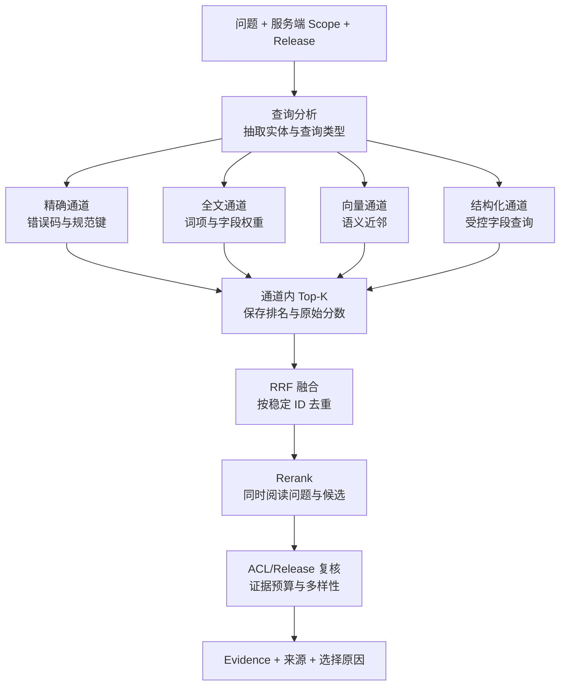

# 精确、全文、向量、结构化检索与重排

## 混合检索与重排分别负责什么

混合检索是一种让精确、全文、向量和结构化查询分别召回候选，再把结果合并的检索方式；Rerank 是在候选集合上重新估计与当前问题的相关顺序。它们位于查询理解和 Evidence 选择之间，用于兼顾专有名词、自然语言同义表达和结构化条件。

用户输入“ERR_CONN_104 怎么处理”，精确匹配通常比**向量检索**可靠；用户输入“发布后为什么还是旧页面”，向量检索更容易找到“缓存失效”这种不同表达；用户问“哪个版本在 8 月 10 日发布”，结构化查询比让模型从段落中猜日期更稳。

因此，企业知识检索很少只有一个搜索框和一个向量索引。不同通道负责各自适合的问题，同一组数据依次经过**查询分析、四路召回、RRF 融合、Rerank 和证据输出**，最终得到有限 Evidence。

Top-K 是“取排序最靠前的 K 个候选”；Embedding 相似度表示语义接近，不等于事实正确；**ACL** 和知识 Release 是服务端可信过滤条件。Multi-Query、HyDE 或 Step-back 产生的查询可以进入多路召回，但每一路仍要使用同一组可信过滤条件。

## 召回和排序是两个不同问题

召回阶段的目标是“不要漏掉可能有用的片段”，因此会容忍一定噪声。排序阶段的目标是“把真正能回答当前问题的片段放到前面”。如果召回阶段没有拿到正确片段，**Rerank** 无法凭空创建证据；如果召回已经拿到但排序很差，继续扩大 Top-K 只会挤占上下文。

一条候选应至少保留：

| 字段 | 用途 |
| --- | --- |
| `chunk_id` | 跨通道去重和引用 |
| `document_id` | 控制同一文档占比 |
| `release_id` | 防止新旧知识混用 |
| `scope_id` | 权限复核 |
| `channel` | 解释候选从哪里来 |
| `rank` / `raw_score` | 记录原始排名与分数 |
| `text` / `locator` | Rerank、生成和原文定位 |

`raw_score` 不能直接跨通道相加。全文分数、余弦相似度、业务优先级的量纲和分布都不同，这也是后面使用排名融合的原因。

## 四种召回通道分别解决什么

### 精确检索：保住不可改写的标识符

**精确检索**按相等、前缀或规范化后的键匹配，适合错误码、订单号、类名、配置键、版本号和规范标题。输入通常是从问题中确定性抽取出的实体，处理过程是规范化大小写或分隔符后查询倒排键，输出是匹配实体关联的片段。

它不是**全文检索**的低配版本。精确命中代表“字符串或规范键一致”，不代表该片段一定能回答问题；例如同一个错误码可能出现在变更记录和排障手册中，仍需后续排序。模糊问题没有稳定标识符时，不应强行走精确通道。

### 全文检索：利用词项、词频和字段权重

全文检索把文本分词并建立倒排索引。查询“代理 热加载”时，索引直接找到包含这些词的片段，再结合词频、文档频率和字段权重排序。标题命中通常可以比正文命中权重高，短片段中出现一个稀有词也往往更有区分度。

中文全文检索需要明确分词器、词典和归一化策略。英文常见的 BM25 会考虑词频饱和和文档长度；无论具体实现是什么，都要把分词配置当索引版本的一部分。全文检索擅长精确术语和关键词组合，但不天然理解“切流”与“上游切换”是近义表达。

### 向量检索：寻找语义相近的表达

向量检索把查询和片段送入兼容的 Embedding 模型，再按余弦距离、点积或欧氏距离查找近邻。它适合同义表达、自然语言描述和用户不知道文档术语的情况。

它不是“理解事实”。向量相近只说明模型空间里接近，日期、否定词、数字和专有标识可能被弱化。查询向量与文档向量必须使用同一模型、维度、归一化和版本；近似索引还需要与精确扫描比较 Recall@K。

### 结构化检索：让数据库直接回答确定字段

**结构化检索**针对日期、状态、负责人、版本、标签和实体关系等字段。输入应是经过 Schema 校验的过滤或聚合请求，程序把允许字段映射成参数化查询，输出是结构化事实及其来源。

模型可以从问题中提出 `status = active` 这样的候选条件，但不能直接生成并执行任意 SQL。租户、Scope、Release 等可信条件由服务端注入。结构化结果仍要绑定来源；数据库里一个字段有值，不代表用户有权看到它。

## 一次混合检索怎样流动



`A` 只判断开放哪些检索通道，不扩大权限。四个召回分支可以并行，但它们必须使用同一快照。`P` 保留每个通道内的名次，`U` 用名次融合避免不同分数尺度互相污染。`R` 只对有限候选做精排。`G` 是最后的确定性门禁，即使前面已经过滤也要复核，避免缓存或索引延迟带来越权结果。

## RRF 为什么比直接加分更稳

Reciprocal Rank Fusion，简称 **RRF**，根据候选在每个列表中的名次计算分数：

`RRF(d) = Σ 1 / (k + rank_i(d))`

`rank_i(d)` 是文档 `d` 在第 `i` 个通道的名次，`k` 是平滑常数。RRF 不关心全文分数是 8.4 还是向量相似度是 0.78，只关心它们各自在本通道排第几。一个片段同时在两路靠前，会累积更高分。

`k` 越大，第一名和后续名次差距越小；它不是 Top-K 的 K。团队应固定参数并用评测集选择，不要因为某个示例没排第一就临时改权重。

假设三路结果如下：

| 名次 | 精确 | 全文 | 向量 |
| ---: | --- | --- | --- |
| 1 | c-error | c-reload | c-drain |
| 2 | c-release | c-drain | c-reload |
| 3 | c-reload | c-cache | c-health |

`c-reload` 在三路都出现，`c-drain` 在两路靠前；它们通常会超过只在一路第一的候选。注意这只是“多路一致性”，还没有判断文本是否真正支持问题，所以仍需 Rerank 或规则验证。

## Rerank 在看什么

Reranker 接收“原问题 + 一个候选片段”，输出相关性分数或等级。Cross-Encoder 会把两段文本一起编码，能观察词语间细粒度交互，通常比各自独立生成向量后计算距离更适合精排。代价是每个候选都要参与模型计算，因此通常只处理融合后的几十条候选，而不是整个知识库。

Rerank 解决的是排序，不负责 ACL、版本选择和事实验证。模型分数也不是概率，阈值必须在标注集上校准。Reranker 不可用时，系统可以降级到 RRF 排名，但应记录 `rerank_degraded`，让后续评测区分正常与降级结果。

## 手工跑通融合和精排

下面的示例不依赖第三方包。输入是三个通道的有序候选、一个问题和片段词项；目标是先按 RRF 合并，再用可解释的词项覆盖分数模拟 Rerank。预期结果会展示每个片段的 RRF 分数、Rerank 分数和来源通道。

```python
# 先按各通道名次计算 RRF，再对有限候选精排；不同检索器的原始分数不会直接相加。
from __future__ import annotations

from dataclasses import dataclass, field

@dataclass
class Candidate:
    chunk_id: str
    text: str
    rrf_score: float = 0.0
    rerank_score: float = 0.0
    channels: list[str] = field(default_factory=list)

TEXTS = {
    "c-error": "错误码 ERR_CONN_104 表示上游连接被关闭",
    "c-release": "发布记录保存候选版本和切换时间",
    "c-reload": "修改代理上游后校验配置并热加载",
    "c-drain": "旧进程停止接收新请求并等待长连接排空",
    "c-cache": "页面缓存按版本键失效",
    "c-health": "健康检查验证候选进程能够响应",
}

# RRF 只使用各通道名次，不直接比较全文分数与向量距离这两种不同量纲。
def rrf_fuse(
    rankings: dict[str, list[str]], *, smooth: int = 60
) -> dict[str, Candidate]:
    # fused 以 chunk_id 去重，同时保留命中的通道和累计 RRF 分数。
    fused: dict[str, Candidate] = {}
    for channel, ranked_ids in rankings.items():
        for rank, chunk_id in enumerate(ranked_ids, start=1):
            candidate = fused.setdefault(
                chunk_id,
                Candidate(chunk_id=chunk_id, text=TEXTS[chunk_id]),
            )
            candidate.rrf_score += 1 / (smooth + rank)
            candidate.channels.append(channel)
    return fused

def terms(text: str) -> set[str]:
    return {term.strip("，。？") for term in text.split() if term.strip()}

# 精排只处理融合后的有限候选，并用统一特征重新计算可比较分数。
def rerank(question: str, candidates: dict[str, Candidate]) -> list[Candidate]:
    question_terms = terms(question)
    # 逐个候选检查硬约束并计算可解释得分，最终排序不会修改输入证据。
    for candidate in candidates.values():
        overlap = question_terms & terms(candidate.text)
        candidate.rerank_score = len(overlap) + 0.1 * len(candidate.channels)
    return sorted(
        candidates.values(),
        key=lambda item: (-item.rerank_score, -item.rrf_score, item.chunk_id),
    )

rankings = {
    "exact": ["c-error", "c-release", "c-reload"],
    "fulltext": ["c-reload", "c-drain", "c-cache"],
    "vector": ["c-drain", "c-reload", "c-health"],
}
fused = rrf_fuse(rankings)
for candidate in rerank("代理 热加载 旧进程 长连接", fused):
    print(
        candidate.chunk_id,
        round(candidate.rrf_score, 4),
        candidate.rerank_score,
        candidate.channels,
    )
```

`rrf_fuse` 遍历每个通道的有序列表，用 `chunk_id` 作为去重键，并累计倒数名次分数。`Candidate.channels` 保留来源，让 Trace 能解释某条证据为什么入选。`rerank` 用词项重叠模拟真实 Reranker，额外给多通道候选一个很小的稳定加分；生产系统应把这个函数替换为经过版本管理的模型适配器。

调用顺序是：构造三路排名、执行融合、以当前问题重排、输出候选状态。相同分数时按 RRF 再按稳定 ID 排序，保证回归测试可重复。未知 `chunk_id` 会在读取 `TEXTS` 时失败；真实实现应在索引适配器层返回结构化的 `missing_chunk`，而不是吞掉数据不一致。

## 用测试锁住融合语义

下面的测试直接复用混合检索实现，需要证明三个容易被改坏的性质：多路候选会累积分数、重复 ID 只生成一个对象、输入顺序相同时输出稳定。

```python
# 测试固定去重、稳定排序和通道缺失降级，确保一个检索器失败不会清空其他可用候选。
from hybrid import rrf_fuse, rerank

# 这个用例用固定样本核对评测指标，避免实现变化悄悄改变分母、排序或通过条件。
def test_multi_channel_candidate_accumulates_score() -> None:
    fused = rrf_fuse({"a": ["c-reload"], "b": ["c-reload"]})
    assert fused["c-reload"].channels == ["a", "b"]
    assert fused["c-reload"].rrf_score > 1 / 61

# 这个用例重复提交或恢复同一运行，确认 Checkpoint、幂等键或事件序号阻止重复副作用。
def test_same_chunk_is_deduplicated() -> None:
    fused = rrf_fuse({"a": ["c-reload"], "b": ["c-reload"]})
    assert list(fused) == ["c-reload"]

def test_rerank_is_stable() -> None:
    fused = rrf_fuse({"fulltext": ["c-reload", "c-drain"]})
    first = [item.chunk_id for item in rerank("代理 热加载", fused)]
    second = [item.chunk_id for item in rerank("代理 热加载", fused)]
    assert first == second
```

执行 `python hybrid.py` 查看融合轨迹，再执行 `python -m pytest -q`。三个测试的输入分别构造跨通道重复、同 ID 去重和重复执行，输出检查累积分数、对象数量与排序序列；任一断言失败都表示融合实现语义改变。这些测试没有验证语义质量，语义质量要靠带相关性标注的问题集；单元测试负责锁算法不变量，离线评测负责判断检索结果是否真的变好。

## ACL 和 Release 应该在哪里过滤

最理想的是每个通道在查询阶段就带上 `tenant_id`、`scope_ids` 和 `release_id`，减少越权候选进入内存。融合后仍应复核一次，因为不同索引可能存在刷新延迟，缓存也可能来自旧版本。

不要先跨租户取 Top-K 再在应用层过滤。假设前 10 条都属于无权范围，过滤后合法结果变成空；更严重的是无权片段的分数、标题或日志可能已经泄露。对向量索引而言，还要实测过滤与近似搜索的执行顺序，必要时扩大过滤后的候选量或按范围分区。

## 超时、空结果和降级怎么传播

并行通道应有各自超时和整轮绝对 Deadline。精确通道失败不等于全文通道也失败，服务端可以保留成功分支，但必须在结果里记录 `channels_succeeded` 与 `channels_failed`。

| 状态 | 可以怎样处理 | 不应怎样处理 |
| --- | --- | --- |
| 一路超时，其他路有足够证据 | 降级并记录缺失通道 | 假装完整执行 |
| Reranker 超时 | 使用 RRF 顺序，标记降级 | 无限重试直到整轮过期 |
| 所有通道为空 | 返回证据不足 | 放宽 ACL 到其他范围 |
| 候选存在但版本冲突 | 拒绝组合并触发索引检查 | 选择分数最高的新旧片段 |
| 用户取消 | 取消并行任务并停止下游 | 继续调用 Reranker 和模型 |

## 启用全部检索通道的条件

错误码、ID 等查询可以先走精确和全文；自然语言“为什么”问题可以走全文和向量；日期、状态、负责人问题应优先结构化；混合问题再并行多路。通道选择器应输出可审计枚举，不要让模型直接拼检索 SQL。

评测时分别保存各通道 Recall@K、融合后 Recall@K、Rerank 后 MRR/nDCG、最终 Evidence 覆盖率、P50/P95 延迟和降级率。只有融合带来稳定收益时才值得承担额外连接、计算和排障成本。

## 用检索设计表固定通道和降级语义

为项目中的 20 个真实问题填一张表：查询类型、不可改写实体、开放通道、每路 Top-K、过滤字段、融合方法、Reranker 版本、证据上限和失败终态。随后完成三个迁移实验：关闭向量通道观察缩写问题，关闭全文通道观察精确术语问题，让 Reranker 超时验证 RRF 降级。

混合检索的输出是有来源、有稳定 ID 的候选列表，还不是可以直接放入答案的 Evidence。候选仍要经过权限复核、证据预算与 Claim 覆盖选择。


**为什么精确、全文、向量和结构化检索不能只留一个？**

它们解决不同信号：精确检索保护错误码、ID 和固定名称；全文利用词项、字段权重与布尔条件；向量寻找语义相近表达；结构化查询直接处理状态、日期和负责人等确定字段。把所有问题交给向量会改坏精确条件，把自然语言都交给 SQL 又无法表达语义。Router 可以按查询类型开启必要通道，混合问题再并行多路，并用评测证明额外通道确有收益。

**不同检索器的分数为什么不能直接相加？**

BM25、余弦相似度、数据库规则分和模型 Rerank 分的尺度与分布不同，同一个 0.8 并不代表同等相关。直接加分会让数值范围大的通道支配结果，还会随索引变化漂移。RRF 使用每个通道的名次计算贡献，对分数标定要求较低，并能让跨通道重复项累积支持。需要加权时也应通过固定评测集校准，并保存通道、原始名次与融合轨迹。

**Reranker 和向量检索有什么区别？**

向量检索通常分别编码查询和文档，适合在大规模索引中快速召回；Reranker 往往同时读取查询与候选文本，能判断更细的语义匹配，但成本较高，只处理有限候选。执行顺序一般是多路召回、去重融合，再把前 N 个交给 Reranker。Reranker 超时可以退回稳定的 RRF 顺序，并标记降级；它不能修复被召回阶段完全漏掉的正确片段。

**某一路检索超时，是否应该取消整轮？**

要看该通道是否必要以及其他结果是否覆盖证据目标。并行分支各自有超时和状态，整轮受绝对 Deadline 控制；可选向量通道失败而精确与全文已提供完整 Evidence 时可以降级，结构化权限查询失败则可能必须停止。结果要记录成功和失败通道，不能假装完整执行。所有通道为空与所有通道失败也不同，前者是证据不足，后者是基础设施未完成。

**ACL 应在融合前还是融合后检查？**

每个检索通道在查询阶段就应带 tenant、Scope、Release 和状态过滤，避免越权候选进入内存、日志与分数；融合后再做一次防御性复核，处理索引刷新或缓存滞后。只在融合后过滤会让无权结果占满 Top-K，合法候选被挤掉，甚至泄露标题和分数。向量 ANN 还要专门评测过滤顺序与 Recall，必要时分区或受控过采样，但不能放宽 ACL。

**如何判断混合检索真的比单通道好？**

保存各通道、融合后和 Rerank 后的逐样本候选，分别计算 Recall@K、MRR/nDCG、Evidence 覆盖、禁止 ID、P50/P95 和降级率。按错误码、语义问法、结构化条件等查询类型分层，避免平均数掩盖某类退化。若融合只提高候选数量却不改善支持率，或延迟与成本明显上升，就减少通道。每次实验固定知识 Release、Embedding 和标注集，只改变检索组合。
