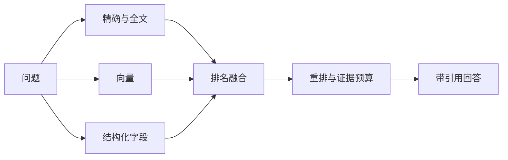

# 混合检索、重排与引用

“REF-1042 的状态”和“上次失败后怎样恢复”需要不同检索能力。前者依赖精确编号，后者依赖语义；只用向量或只用关键词，至少有一类问题表现不稳定。

本篇理解混合检索怎样召回、融合、重排并生成引用。工程实现见 Agent 实践 06、07、09 和 10。

## 混合检索为什么存在

精确通道处理编号和别名，全文处理词面，向量处理语义改写，结构化通道处理表格与实体字段。它们是互补关系。

## 第一步：召回阶段优先避免漏解

各通道在知识版本与 ACL 范围内返回候选。召回数过少可能漏掉正确证据，过多则增加重排成本。按问题类型选择通道，不是每次无条件运行全部能力。

向量服务失败时可以保留全文和精确结果，同时在 Trace 中标记降级。降级可用不等于质量完整。

## 第二步：不同分数不能直接相加

向量距离、全文排名和精确匹配使用不同尺度。常见做法是按各通道排名进行融合，再结合词法覆盖与精确命中。

同一片段多路命中时按稳定 ID 去重，合并通道信息。还要限制单个长文档占比，让其他来源有机会进入证据集。

## 第三步：重排看完整语境

重排输入包含标题、章节路径、片段类型、表头、结构字段和正文。只给一行 `30s`，模型无法知道它是超时、缓存还是保留期。

模型重排可以改善语义判断，却不是权限裁决。被过滤的候选不能因重排分高重新进入结果。

## 第四步：引用从证据身份生成

回答使用服务端授权的证据 ID，发布前检查引用存在、属于本轮、当前仍可见。模型不能直接拼接任意 URL。

引用要能回到来源版本和片段位置。来源更新后，历史回答仍可以解释当时使用了什么证据。

## 正常结果和失败结果

正常编号查询由精确通道命中；语义问题由全文与向量共同召回；最终引用都来自当前用户可见证据。

失败系统把所有候选先交给重排模型，再删除越权结果；私密内容已经进入外部调用和 Trace。另一种失败是引用只保存文档标题，更新后无法定位原证据。

## 怎样评测检索

分别准备编号、同义表达、表格字段、多来源比较、无结果和权限隔离样本。观察目标命中、排名、证据覆盖、禁止来源和降级行为，不只看最终回答是否流畅。

## 手工合并一次检索结果

准备查询“访问申请流程”，让全文通道返回 A、B、C，让向量通道返回 B、D、A。两个通道的原始分数不可直接比较：全文分数来自词项统计，向量分数来自距离。可以先使用 RRF（Reciprocal Rank Fusion）按名次融合，其思想是排名越靠前贡献越大，而不要求分数同量纲。

假设只为演示取 `k = 10`，某结果的贡献是 `1 / (k + rank)`：

| 证据 | 全文名次 | 向量名次 | 融合贡献 |
| --- | ---: | ---: | ---: |
| A | 1 | 3 | `1/11 + 1/13` |
| B | 2 | 1 | `1/12 + 1/11` |
| C | 3 | - | `1/13` |
| D | - | 2 | `1/12` |

B 因为在两个通道都靠前，融合后通常排在前面。这里的数字是教学样例，不代表线上参数；实际 `k`、每路召回量和通道权重应由固定查询集验证。

融合后再检查三件事：结果是否属于用户可见范围，同一来源是否挤占全部位置，片段是否需要父级或相邻内容才能理解。最后才把候选交给重排器。保存每阶段名次和淘汰原因，遇到坏答案时才能判断是“没召回”“融合压下去了”还是“生成没有使用证据”。

### 检索验收卡

为编号精确查找、同义表达、表格字段、无结果和无权限各准备至少一个查询。分别记录目标证据是否进入候选、最终名次、引用是否能打开。检索的完成标准不是“返回十条”，而是合适证据在当前权限内可被稳定找到。

## 参考资料

- [PostgreSQL：Full Text Search](https://www.postgresql.org/docs/current/textsearch.html)
- [pgvector](https://github.com/pgvector/pgvector)
- [Reciprocal Rank Fusion](https://plg.uwaterloo.ca/~gvcormac/cormacksigir09-rrf.pdf)
