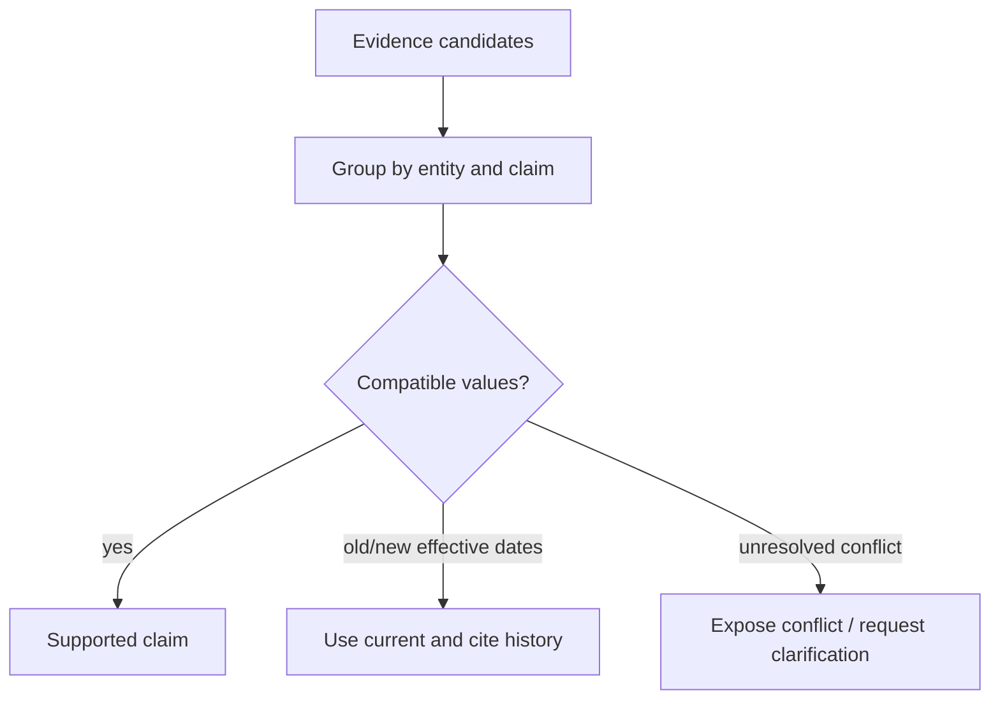

# 混合检索、重排与引用

单一向量检索很难同时处理精确编号、专有名词、语义改写、表格条件和关系问题。可靠 RAG 需要先理解查询，再让不同召回通道各自发挥优势。

## 查询计划

结构化理解输出实体、时间范围、目标来源、精确词和可改写语义。计划根据这些字段选择通道，而不是每次固定执行全部检索。

- Exact/Title/Alias：编号、标题、别名；
- 全文检索：关键词和短语；
- 向量检索：语义相近表达；
- 结构化查询：表格、状态、日期和数值条件；
- 图检索：已建模实体关系。

所有通道在查询前带上用户可见范围和固定的知识版本。

查询理解不应该在每个通道重复调用模型。先产生一次结构化计划，后续检索器只消费自己需要的字段：

```python
class RetrievalPlan(TypedDict):
    original_query: str
    semantic_queries: list[str]
    exact_terms: list[str]
    entities: list[dict]
    filters: dict
    channels: list[Literal["exact", "fts", "vector", "table", "graph"]]
    scope_ids: tuple[str, ...]
    release_id: str
    candidate_budget: int
```

`scope_ids` 和 `release_id` 由服务端安全上下文与当前知识空间决定，模型只能建议请求范围，不能扩大实际范围。结构化字段如状态、时间和数值先通过白名单与类型校验，再进入 SQL；不要让模型直接生成并执行任意 SQL。

## 不同召回通道解决不同失败模式

Exact/别名通道处理错误码、文档编号、API 名称与专有缩写。它使用规范化词典和大小写/全半角策略，命中精度高但对改写不敏感。FTS 支持短语、词形、布尔组合和字段权重，适合关键词明确的长文档。向量检索补充语义改写，但容易把“主题相似”误当“答案支持”。

表格查询处理时间、状态、数值区间和聚合。图检索只在实体与关系经过建模时使用，不能把任意文本相似连接称为知识图谱。每个通道返回统一候选协议，同时保留自己的诊断：

```ts
type Candidate = {
  chunkId: string
  documentId: string
  revisionId: string
  channel: 'exact' | 'fts' | 'vector' | 'table' | 'graph'
  rank: number
  rawScore: number | null
  matchedTerms: string[]
  headingPath: string[]
  excerpt: string
  sourceAuthority: number
  publishedAt: string | null
}
```

统一协议不意味着统一原始分数。FTS 的 `ts_rank`、cosine distance、图路径代价和精确匹配权重没有共同量纲，不能直接加权相加。

## ACL 和 Release 必须进入每个查询

并行通道经常由不同存储实现，最容易出现某一个通道忘记权限条件。检索接口把安全上下文设为必填参数，并在适配层测试生成的过滤器：

```sql
SELECT c.chunk_id,
       ts_rank_cd(c.search_vector, websearch_to_tsquery(:language, :query)) AS score
FROM chunks c
JOIN release_items ri ON ri.revision_id = c.revision_id
JOIN actor_visible_scopes avs ON avs.scope_id = c.scope_id
WHERE ri.release_id = :release_id
  AND c.tenant_id = :tenant_id
  AND avs.actor_id = :actor_id
  AND c.search_vector @@ websearch_to_tsquery(:language, :query)
ORDER BY score DESC, c.chunk_id
LIMIT :limit;
```

向量通道同样先应用租户、Release、范围和状态过滤，再按距离取 Top K。图和表格通道若不能表达同等 ACL，就不能进入受限知识问答。后置过滤只能作为防御检查；若先取全局 Top 20 再删除不可见项，既接触了越权候选，又会使合法结果 Recall 降低。

权限变化后缓存必须失效。缓存键至少包含 tenant、actor 或可见范围摘要、策略版本、Release、规范化查询、通道配置和检索算法版本。只用 query 做键会跨用户返回结果。

## 融合与去重

不同通道的原始分数不可直接比较。可以使用 Reciprocal Rank Fusion 按名次融合，再按文档和语义片段去重。融合结果保留各通道命中原因，方便评测和排障。

RRF 对每个候选累加 `1 / (k + rank)`，避免依赖原始分数量纲：

```ts
type RankedCandidate = Candidate & {
  fusionScore: number
  channels: Array<{ channel: Candidate['channel']; rank: number }>
}

function reciprocalRankFusion(
  resultSets: Candidate[][],
  k = 60
): RankedCandidate[] {
  const fused = new Map<string, RankedCandidate>()
  for (const results of resultSets) {
    for (const item of results) {
      const current = fused.get(item.chunkId) ?? {
        ...item,
        fusionScore: 0,
        channels: []
      }
      current.fusionScore += 1 / (k + item.rank)
      current.channels.push({ channel: item.channel, rank: item.rank })
      fused.set(item.chunkId, current)
    }
  }
  return [...fused.values()].sort(
    (a, b) => b.fusionScore - a.fusionScore || a.chunkId.localeCompare(b.chunkId)
  )
}
```

`k` 与各通道候选数通过 Eval 选择，不是越小越强调头部就一定越好。可以给可靠 Exact 通道额外权重，但需要离线验证并记录版本。

去重分三层：相同 Chunk ID 合并通道信息；同一父块的重叠子块保留最高分并扩展上下文；跨文档近重复按 canonical 来源合并，但保留不同来源的引用关系。不能仅凭向量相似就删除两份可能互相冲突的规范。

去重后做多样性约束，避免 Top K 全来自同一章节的相邻块。MMR 或按文档/章节配额可以改善覆盖，但不能牺牲唯一的精确答案。多样性策略同样进入评测版本。

## 重排

重排输入包含原始问题、候选段落和必要的标题路径。重排只改变候选顺序，不扩大权限，也不创造新证据。对于时间敏感问题，新鲜度和来源权威性应作为显式特征。

证据达到预算后可以提前取消慢通道，但提前停止条件必须来自覆盖度，而不是“已经有几个结果”。

重排器输入应最小而充分：原问题、必要改写、标题路径、候选片段、来源类型和时间，不把整篇文档全部拼入。候选数过大时先用轻量规则/融合缩到几十条，再使用 Cross Encoder 或 LLM reranker。

重排输出稳定候选 ID 和相关性等级，禁止重排模型改写证据正文：

```python
class RerankResult(BaseModel):
    candidate_id: str
    relevance: Literal["direct", "supporting", "related", "irrelevant"]
    score: float = Field(ge=0, le=1)
    reason_code: Literal[
        "answers_question",
        "matches_entity",
        "matches_constraints",
        "background_only",
        "topic_mismatch",
    ]
```

LLM Reranker 输出仍需校验：ID 必须来自候选集合，不允许凭空新增；非法结果丢弃并记录。重排服务不可用时，回退到已验证的 RRF 顺序，而不是清空结果。重排超时受总截止时间限制。

新鲜度和权威性不能隐含在 Prompt 里“请优先最新”。为候选提供结构化特征并定义策略：状态类问题优先当前生效版本；历史问题允许旧版本；来源冲突时权威级别只影响排序，不抹掉冲突事实。

## 父块扩展和证据预算

召回用小 Chunk，生成需要足够上下文。命中子块后根据内容类型扩展父标题、相邻段落、表格表头或代码签名。扩展不是固定前后各一个块：跨章节边界不能混入不相关内容，表格必须带列头，代码需要符号上下文。

证据预算同时限制 Token、来源数和重复度：

```ts
type EvidenceBudget = {
  maxTokens: number
  maxItems: number
  maxItemsPerDocument: number
  minimumDirectEvidence: number
}

function canAdd(
  selected: Candidate[],
  candidate: Candidate,
  usedTokens: number,
  candidateTokens: number,
  budget: EvidenceBudget
): boolean {
  const sameDocument = selected.filter((item) => item.documentId === candidate.documentId).length
  return selected.length < budget.maxItems
    && sameDocument < budget.maxItemsPerDocument
    && usedTokens + candidateTokens <= budget.maxTokens
}
```

贪心选择可以加入边际信息增益：候选与问题相关、与已选证据不重复、补充未覆盖实体/约束时优先。达到 `minimumDirectEvidence` 不代表可以停止，还要检查问题的关键子问题是否覆盖。

并行检索提前结束需要可解释条件，例如精确通道命中唯一实体，且两个独立来源覆盖全部必需 Claim。若只是向量通道先返回 5 条相似结果，不应取消可能提供精确依据的 FTS/表格通道。

## Evidence 与 Claim

最终回答先形成事实声明 `Claim`，再绑定一个或多个 `Evidence`。证据包含来源标识、版本、可见文本范围和定位信息。回答中的引用指向证据，而不是只链接整个文档。


Evidence 是本轮冻结的可见片段，不等同于数据库 Chunk。它还包含检索与展示元数据：

```ts
type Evidence = {
  evidenceId: string
  chunkId: string
  releaseId: string
  sourceRef: string
  locator: { page?: number; headingPath: string[]; charRange?: [number, number] }
  excerpt: string
  contentDigest: string
  retrievalTrace: Array<{ channel: string; rank: number }>
}

type Claim = {
  claimId: string
  text: string
  evidenceIds: string[]
  verdict: 'supported' | 'conflicted' | 'unsupported'
}
```

回答生成可以要求模型输出 Claim 结构，再由程序确认所有 Evidence ID 属于本轮集合、引用位置有效、当前用户仍可见。语义验证判断片段是否真正支持 Claim，而不是只出现相同关键词。

引用 UI 指向可公开/可授权的稳定定位，不暴露对象存储地址、本机路径或数据库 ID。若原文不能直接展示，返回受控查看入口与页码/标题。引用文本经过 HTML 转义，防止文档内容成为脚本注入载体。

模型参数知识与证据知识要区分。若产品承诺“只根据指定知识回答”，任何无法绑定证据的事实都应删除或明确表示未知。通用连接词不需要逐句引用，但数值、状态、定义、步骤和归因等可验证 Claim 必须有支持。

## 无结果与冲突

指定范围没有证据时应明确说明，而不是退回全局知识。证据互相冲突时保留来源和时间，向用户呈现冲突或请求缩小范围，不应让模型悄悄选择更顺眼的一条。

“无结果”至少分为：范围内确实没有、检索服务失败、查询无法理解、过滤条件过严、内容尚未发布。只有第一种可以回答“没有找到相关证据”；服务失败要返回系统错误或降级通道，不能伪装成知识不存在。

冲突检测比较同一实体/属性的不同值、来源版本和有效时间。若新旧版本有明确生效关系，可以选择当前生效版本并说明历史；若两个当前权威来源冲突，保留双方证据并提示需要确认。



查询扩展也不能突破用户范围。指定某集合无结果时，可以建议用户扩大范围，但只有用户有权并明确选择后才能重新检索。

## 评测指标

召回层使用 Hit@K、Recall@K 和权限泄漏数；重排层使用 MRR、NDCG；回答层检查 Claim 支撑率、引用准确率、拒答正确率。只看最终回答主观评分无法定位是哪一层退化。

Golden Query 记录安全上下文、Release、相关 Chunk/文档集合、必需 Claim 和期望行为。相关集合不完整时，Recall 只能作为弱指标；通过人工池化多个检索器的 Top K，减少只标一个答案造成的偏差。

| 层次 | 指标 | 关键切片 |
| --- | --- | --- |
| 查询理解 | 实体/过滤/通道选择准确率 | 精确编号、歧义、跨轮指代 |
| 召回 | Recall@K、Hit@K | 文档类型、语言、查询长度 |
| 融合 | MRR、channel contribution | 单通道与多通道命中 |
| 重排 | NDCG@K、Top1 accuracy | 冲突、背景相似、时效 |
| 证据 | 覆盖率、重复率、Token 效率 | 表格、代码、长文 |
| 回答 | Claim 支撑率、引用精度 | 数值、步骤、比较 |
| 安全 | 越权候选/引用数量 | 跨租户、撤权、缓存 |

安全指标是硬门禁，不能被平均 NDCG 掩盖。性能指标记录各通道 P50/P95、候选数、重排耗时和查询成本。候选版本在相同 Release、权限和预算上与当前版本比较。

```python
@pytest.mark.parametrize("channel", ["exact", "fts", "vector", "table", "graph"])
async def test_channel_never_returns_invisible_candidates(channel: str) -> None:
    context = fixtures.restricted_actor()
    results = await retrievers[channel].search(fixtures.cross_scope_query(), context)
    assert all(item.scope_id in context.visible_scope_ids for item in results)
```

## 故障与恢复测试

检索是并行分布式流程，需要注入部分失败：向量服务超时、FTS 数据库限流、重排返回未知 ID、权限缓存刚失效、候选 Release 切换、客户端取消。系统应返回明确诊断并遵守降级策略。

| 故障 | 允许降级 | 不允许的行为 |
| --- | --- | --- |
| 向量通道失败 | Exact/FTS/Table 继续 | 声称执行了完整混合检索 |
| Reranker 失败 | 使用版本化 RRF | 清空候选或绕过 ACL |
| 权限服务不确定 | 安全拒绝 | 默认放行 |
| 指定 Release 不存在 | 明确失败 | 偷换当前 Release |
| 证据不足 | 拒答/澄清 | 用模型常识补齐 |
| 生成失败 | 返回证据列表 | 丢失已检索证据 |

取消信号传播到所有通道，已完成结果可以丢弃或缓存到当前安全上下文，但不能在用户取消后继续占用昂贵重排与模型调用。

## 可观测性

一次 Retrieval Trace 记录 plan 版本、启用通道、每通道耗时/候选数/错误、过滤前后数量（只记录计数）、融合贡献、去重数、重排版本、最终 Evidence ID 和 Token。查询原文与片段默认不写普通 Trace；使用脱敏摘要和受控引用。

线上监控通道贡献率和零结果率。某通道长期零贡献可能是索引或配置损坏，也可能说明它不值得默认执行。权限拒绝突降不是好消息，可能是安全过滤未生效，需要结合跨范围探针检查。

## 检索决策记录

为了复现一次回答，不能只保存最终 Top K。记录查询计划摘要、实际通道、各通道 Top 候选 ID/名次、过滤与去重计数、RRF/重排版本、证据选择原因和被预算丢弃的候选摘要。正文仍保存在受控证据存储，不复制进 Trace。

```ts
type RetrievalDecision = {
  planVersion: string
  releaseId: string
  scopeDigest: string
  channels: Array<{ name: string; status: string; candidates: number; durationMs: number }>
  fusionVersion: string
  rerankerVersion: string | null
  selectedEvidenceIds: string[]
  stoppedEarly: boolean
  stopReason: 'coverage_met' | 'deadline' | 'budget' | 'all_channels_complete'
}
```

`scopeDigest` 用于确认运行边界相同，不可反向还原真实权限列表。若调查需要查看具体范围，通过受控审计接口读取当时的策略快照。

## 查询漂移与回归

搜索内容、用户措辞和数据分布会变化。按意图、语言、文档类型、通道选择和零结果原因监控分布。向量通道贡献突然升高不一定更好，可能是 Exact/FTS 索引损坏；重排 Top1 一致率下降可能是候选分布或模型版本变化。

定期从审核后的线上样本构建中性回归集，并固定安全上下文与 Release 重放。新检索配置必须说明它改善了哪类 query slice，又在哪些切片有退化。对于权限、指定范围和引用完整性，任何回归都应阻止晋级。

## 常见误区

- 每次固定并行所有检索通道，不看查询和预算。
- 直接相加 FTS、向量和图的原始分数。
- 全局召回后再做 ACL 过滤，造成泄露和有效 Recall 降低。
- 重排器可以新增/改写候选，被模型“创造证据”。
- 命中几个片段就取消所有慢通道，没有覆盖度判断。
- 引用只链接整篇文档，无法证明具体 Claim。
- 无结果时回退到更大范围，破坏用户指定边界。
- 只评最终回答，不知道退化发生在解析、召回、重排还是生成。

## 参考资料

- [PostgreSQL Full Text Search](https://www.postgresql.org/docs/current/textsearch.html)：词典、`tsvector`、查询匹配和排序的数据库语义。
- [pgvector](https://github.com/pgvector/pgvector)：向量距离、精确/近似索引、过滤与迭代扫描能力。
- [Reciprocal Rank Fusion](https://plg.uwaterloo.ca/~gvcormac/cormacksigir09-rrf.pdf)：只基于名次融合异构结果的原始论文。
- [Elasticsearch RRF](https://www.elastic.co/docs/reference/elasticsearch/rest-apis/reciprocal-rank-fusion)：RRF 的实际参数和分页实现参考。
- [OWASP Prompt Injection Prevention Cheat Sheet](https://cheatsheetseries.owasp.org/cheatsheets/LLM_Prompt_Injection_Prevention_Cheat_Sheet.html)：检索内容进入模型前仍应作为不可信数据处理。
- [一文入门 LangChain.js，从 0-1 实现智能客服系统](https://juejin.cn/post/7504926961628364819)：我的基础 RAG 实践；本篇补充多通道、权限、证据与分层评测。
