# 知识 Agent 工程实践：从文档进入系统到可审计回答

## 知识 Agent 综合项目解决什么问题

知识 Agent 是一套在受控范围内导入资料、检索 Evidence、调用模型和工具，并保存可恢复 Turn 的应用系统。它位于知识源和最终问答界面之间，把资料版本、权限、检索、生成与运行状态连成可审计链路。集成输入是一份文档和用户问题，输出是带 Evidence、引用、usage、事件和唯一终态的回答；所有组件继续遵守同一套公开协议。

现在把一份匿名 Markdown 放进 `documents/`，然后提交问题：“访问申请需要满足什么条件？”

这次不再创建新的 `DemoRuntime`，也不把固定字符串当模型回答。前文逐步得到的文件会在这里连接起来：

```text
documents/access-guide.md
→ app/ingestion.py 生成 Block、Chunk 和候选 Release
→ Embedding Adapter 写入 PostgreSQL/pgvector
→ FastAPI 创建 Turn、快照和 Outbox
→ Celery Worker 取得 Lease 并运行 app/graph.py
→ app/retriever.py 按 Scope 与 Release 检索 Evidence
→ app/model_gateway.py 调用真实 Responses API
→ app/validation.py 检查 Claim、引用、权限和注入
→ PostgreSQL 原子写入答案、Reference、终态与事件
→ SSE 按序号推送，断线后从数据库重放
```

**完整实践的通过条件不是“页面出现了一段文字”，而是同一个 Turn 产生可追溯 Evidence、验证通过的答案、唯一终态、连续事件和真实 usage。** 没有 API Key 时可以运行离线测试和基础设施检查，但在线模型 Gate 仍然是未执行，不能用 Fake 替代。

## 最终目录中每个文件从哪里来

`agent-demo` 沿主线累积，终章没有隐藏的下载工程：

```text
agent-demo/
  app/
    model_gateway.py      # Responses API、usage 与供应商错误
    messages.py           # Message 与输入角色
    schemas.py            # SearchPlan、Evidence、Claim、ContextSnapshot
    tools.py              # 只读工具注册表与执行门禁
    agent_loop.py         # 纯 Python 有限循环，保留为对照
    decision_policy.py    # Router、Planner 与停止预算
    langchain_agent.py    # Message/Prompt/Runnable/Tool 适配
    graph.py              # LangGraph State、Node、Edge 与 Checkpoint
    context.py            # ContextSnapshot、压缩、记忆与预算
    ingestion.py          # Source、Block、Chunk、Release
    retriever.py          # pgvector、多路检索、融合与 Evidence
    validation.py         # Claim、引用、权限、隐私与注入验证
    runtime.py            # Turn、Lease、Deadline、Finalize
    security.py           # Scope、Policy 与工具返回值边界
    observability.py      # Trace、用量、成本和稳定错误
    api.py                # FastAPI 的 Turn、状态和 SSE 接口
    worker.py             # Celery 任务入口，只接收 turn_id
  migrations/
  tests/
    rag_eval.json
    agent_eval.json
    test_end_to_end.py
  documents/
  compose.yaml
  Dockerfile
  .env.example
```

这里有两个容易踩的坑。第一，文件多不代表职责清楚；`api.py` 如果自己检索和调用模型，前面的 Runtime 仍然没有被复用。第二，复用不等于循环导入所有模块。领域对象放在 `schemas.py`，外部依赖通过 Protocol 注入，`runtime.py` 只编排状态和所有权。

## 从文档导入到可发布知识快照

准备一份不含敏感信息的本地文档：

```markdown
# 访问申请

测试环境访问需要完成身份校验，由项目负责人审批。

## 有效期

批准后的访问权限默认保留 7 天；到期后需要重新申请。
```

导入命令接收目录，不接收在线索引表名或手写 Release ID。服务会计算文件哈希、识别格式、生成 Block 和 Chunk，调用 Embedding，写候选投影，完成检查后再激活：

```bash
# 在 agent-demo 根目录执行；输入是 documents，输出是候选 Release 与检查报告。
docker compose run --rm api \
  python -m app.cli ingest documents --scope public

# 只读查询激活结果，确认在线指针和候选检查状态。
docker compose run --rm api \
  python -m app.cli release status --scope public
```

第一条命令应打印 Source 数、Block 数、Chunk 数、向量数和候选 Release ID。第二条只有在来源定位、向量维度、ACL 投影与最小检索检查全部通过后才显示 `active`。如果解析器只读到标题、向量少于 required Chunk，或者候选使用不同 ACL，Release 保持 failed，旧 active 继续服务。

这一阶段可以不用生成模型，但需要真实 Embedding Adapter 和 pgvector 才算完成向量链。为了诊断，导入程序同时保留精确扫描入口；ANN 索引的 Top K 要与它计算 Recall@K，避免“索引建成”被误当成“召回正确”。

## 启动 Runtime 前检查五个事实源

[本地 Compose 部署](/docs/ai-agent/agent-compose-local-runtime)已经把 FastAPI、PostgreSQL/pgvector、Redis、Celery 与 MinIO 接到同一网络。这里沿用那份拓扑，启动命令和检查顺序如下：

```bash
# 先展开变量和服务依赖；这一步不会创建容器。
docker compose config --quiet

# 启动基础设施与应用，带 healthcheck 的服务要等到就绪。
docker compose up -d --build --wait

# 迁移由独立命令执行，避免 API 与多个 Worker 并发建表。
docker compose run --rm api alembic upgrade head

# 分别观察容器、API Readiness 和 Worker，而不是只看一个端口。
docker compose ps
curl -fsS http://127.0.0.1:8000/health/ready
docker compose logs --tail=80 worker
```

`docker compose config` 通过，只证明 YAML 和变量可展开；容器 healthy，只证明各自探针通过。完整 Gate 还要确认数据库迁移 revision、`vector` 扩展、active Release、Worker 心跳、对象 Bucket 和真实模型凭证。

| 组件 | 它保存的事实 | 不能拿谁替代 |
| --- | --- | --- |
| PostgreSQL | Turn、Task、Event、Release、Evidence、Reference、向量 | Redis 状态或 Worker 内存 |
| MinIO | 原文件与可重建的大制品 | 数据库中的临时路径字符串 |
| Redis | Celery Broker、短期协调与 SSE 唤醒 | 最终答案和唯一终态 |
| Worker | 当前 attempt 的执行进程 | 长期所有权事实 |
| 模型 API | 候选理解与候选答案 | 权限、Release 和终态判断 |

## 连接适配器时只在组合根选择真实或测试实现

业务节点依赖 Protocol，因此生产组合根可以显式选择真实适配器。环境变量缺失时直接失败，不能自动退回 Fake：

```python
import os

from app.graph import build_graph
from app.model_gateway import OpenAIResponsesGateway
from app.repositories import PostgresEventStore, PostgresTurnStore
from app.retriever import PgVectorRetriever
from app.runtime import AgentRuntime
from app.validation import AnswerValidator

def build_runtime() -> AgentRuntime:
    # 生产组合根要求真实 Key；Fake 只允许测试显式注入。
    if not os.environ.get("OPENAI_API_KEY"):
        raise RuntimeError("OPENAI_API_KEY 未设置，真实模型 Gate 不能执行")

    turn_store = PostgresTurnStore.from_env()
    event_store = PostgresEventStore.from_env()
    retriever = PgVectorRetriever.from_env()
    model = OpenAIResponsesGateway()
    validator = AnswerValidator()

    # Graph 节点复用同一 Retriever、Model 和 Validator；Runtime 管所有权与终态。
    graph = build_graph(
        retriever=retriever,
        model=model,
        validator=validator,
    )
    return AgentRuntime(
        graph=graph,
        turns=turn_store,
        events=event_store,
    )
```

调用顺序从 `build_runtime()` 开始。它先阻断无 Key 的生产启动，再创建数据库 Store、pgvector Retriever、真实 Responses 网关和验证器。`build_graph()` 只得到这些依赖，不创建另一套内存检索。`AgentRuntime` 负责 Turn Lease、取消、Deadline、Checkpoint 与 Finalize；Graph 负责从 State 到节点更新。

测试中可以调用 `build_test_runtime(fake_model, memory_retriever, fake_clock)`，但函数名和日志必须带 `test/fake`。测试替身证明状态语义可重复，不证明网络、模型、数据库或召回质量。

## 一次 Turn 具体怎样穿过整条链

```mermaid
flowchart LR
  A[POST /turns<br/>问题与幂等键]:::input --> B[短事务<br/>Turn、快照、Outbox]:::program
  B --> C[Celery 投递 turn_id<br/>Worker 取得 Lease]:::tool
  C --> D[LangGraph 预处理与 Planner<br/>生成受限 SearchPlan]:::model
  D --> E[pgvector 与全文检索<br/>Scope、Release 前置过滤]:::tool
  E --> F[融合、Rerank 与 Evidence Budget<br/>保存可定位 Evidence]:::data
  F --> G[Responses API 生成候选<br/>记录真实 usage]:::model
  G --> H{Claim、引用、权限、隐私<br/>与注入验证}:::program
  H -->|通过| I[Finalize 条件更新<br/>答案、Reference、唯一终态]:::ok
  H -->|可修复且有预算| G
  H -->|硬失败或预算耗尽| J[拒答、no_evidence 或 failed]:::bad
  I --> K[SSE 序号事件<br/>断线从数据库重放]:::ok
  classDef input fill:#ccfbf1,stroke:#0f766e,color:#134e4a
  classDef program fill:#dbeafe,stroke:#2563eb,color:#1e3a8a
  classDef model fill:#f3e8ff,stroke:#9333ea,color:#581c87
  classDef tool fill:#ffedd5,stroke:#ea580c,color:#7c2d12
  classDef data fill:#fef3c7,stroke:#ca8a04,color:#713f12
  classDef ok fill:#dcfce7,stroke:#16a34a,color:#14532d
  classDef bad fill:#fee2e2,stroke:#dc2626,color:#7f1d1d
```



API 从认证依赖取得用户和 Scope，客户端请求体只有问题。Turn 快照固定 Release、Policy、Prompt、模型能力与 Deadline。Worker 只凭 `turn_id` 回库读取，消息里不复制整份 Prompt，也不信任客户端提交的 Scope。

Planner 输出查询候选和证据目标。程序再注入允许通道、Scope、Release、查询上限和停止条件。Retriever 的 SQL 在相似度排序前就限制 Scope/Release；融合后保存 Evidence ID、Chunk、原文位置、内容哈希和通道信息。

模型看到的是 `ContextSnapshot` 的最终投影：稳定规则、允许工具、经过压缩的历史、当前 Evidence 和问题。Prompt Cache 可以复用稳定前缀，但不复用答案，也不跳过本轮权限。Responses 返回的文本仍是候选；Validator 逐个核对 Claim 引用、位置、Scope、Release、隐私和注入影响。

Finalize 只有一个入口。数据库条件要求 Turn 未终态、fencing token 仍属于当前 Worker、取消和 Deadline 没有先提交。更新成功后在同一事务中写正式答案、Reference 与终态事件；更新行数为零时重新读取现状并丢弃迟到候选。

## 发起真实请求并观察 usage、引用和事件

先在本地 Secret 或 `.env` 中设置 `OPENAI_API_KEY`，不要把值放进命令、文章或提交记录。然后创建 Turn：

```bash
# 创建真实 Turn；相同幂等键和相同请求指纹应返回同一个 turn_id。
curl -sS -X POST http://127.0.0.1:8000/turns \
  -H 'Content-Type: application/json' \
  -H 'Idempotency-Key: access-guide-001' \
  -d '{"question":"访问申请需要满足什么条件？"}'

# 使用接口返回的 turn_id；Last-Event-ID=0 表示从第一条事件开始读取。
curl -N -H 'Last-Event-ID: 0' \
  http://127.0.0.1:8000/turns/turn_demo/events

# 终态后查询结构化结果，核对引用、版本与 usage，而不是复制流式草稿。
curl -sS http://127.0.0.1:8000/turns/turn_demo
```

第一条返回 `202`、`turn_id` 和 `accepted/queued`。SSE 应出现单调递增的 `id`，阶段至少覆盖创建、检索、证据选择、模型调用、验证和终态。最终查询中的每个 Reference 都能回到刚才导入文档的位置；`usage` 来自真实 Response，不能由字符串长度估算。

示例里的 `turn_demo` 是占位符。真实回答、Token 和延迟随模型与环境变化，文章不提供伪造的固定结果。若 Key 缺失，应用应在组合根或模型节点明确失败，并留下 `model_credentials_missing`；此时离线测试通过也不算这一 Gate 完成。

## 端到端测试检查状态，不锁死自然语言

测试创建一条公开文档和一条不可见文档，提交真实 Turn，等待终态，再检查 Evidence、Reference、事件和 usage。下面保留决定验收语义的断言：

```python
import pytest

@pytest.mark.integration
def test_real_turn_is_answered_from_visible_release(client, seeded_release) -> None:
    # 测试前先激活 seeded_release；请求体不允许提交 scope 或 release。
    response = client.post(
        "/turns",
        headers={"Idempotency-Key": "integration-access-001"},
        json={"question": "访问申请需要满足什么条件？"},
    )
    assert response.status_code == 202

    turn_id = response.json()["turn_id"]
    result = wait_for_terminal(client, turn_id, timeout_seconds=45)

    # 自然语言允许变化，可信边界和可观测结果必须稳定。
    assert result["status"] == "completed"
    assert result["release_id"] == seeded_release.release_id
    assert result["references"]
    assert all(ref["scope_id"] == "public" for ref in result["references"])
    assert result["usage"]["input_tokens"] > 0
    assert result["usage"]["output_tokens"] > 0
    assert_event_sequence_is_contiguous(result["events"])
```

这个测试不要求答案逐字相同。它检查真实模型确实被调用、当前 Release 和公开 Scope 没有漂移、引用存在、usage 非零、事件没有缺口。`wait_for_terminal` 超时后要输出最后状态、最近事件、Task attempt 和 Trace ID，不能只报一个等待失败。

离线套件继续使用 Fake Model 覆盖空证据、未知引用、循环上限、取消和迟到 Worker；集成套件负责数据库、队列、SSE 和真实模型；RAG Eval 负责召回与支持率。三层测试回答不同问题，不能用最快的一层代替另外两层。

## 六条路径才构成一次完整验收

### 正常回答

公开 Release 中有直接证据。期望 `completed`，每个 Claim 有 Reference，事件连续，usage 和 Trace 可查。重复提交同一幂等键返回同一 Turn，不产生第二次模型计费。

### 当前范围没有证据

问题指向文档没有描述的处理时长。允许一次受限改写后仍无 Evidence，进入 `no_evidence`；Model Gateway 不应凭常识补值。观察检索通道、Coverage、停止原因和模型调用次数。

### 证据存在但用户无权读取

数据库中存在 private Chunk，当前 Scope 只有 public。它在 Retriever SQL 阶段就被过滤，Validator 再做输出复核。产品可按策略返回 `rejected` 或不泄露存在性的安全结果，但日志要保留权限原因，不能伪装成数据库故障。

### 显式取消

提交长请求后调用取消接口。持久化 `cancel_requested`，节点将信号传给模型与工具；最终进入 `cancelled`。旧 Worker 迟到返回时，Finalize 条件更新失败，不能覆盖取消终态。

### Worker 中断与恢复

在检索后停止 Worker。新 Worker 只有在 Lease 过期并取得更高 fencing token 后才能继续；它读取 Checkpoint，跳过已完成的幂等阶段。事件序号延续原 Turn，外部 attempt 有明确记录。

### SSE 断线与重放

客户端读到事件 4 后断开。重新连接携带 `Last-Event-ID: 4`，服务端从 PostgreSQL 返回 5 之后的事件；Redis 只负责唤醒。终态已经完成时，状态接口和重放结果一致。

## 完成后怎样清理本地数据

先停止应用，再决定是否删除演示数据：

```bash
# 删除容器和网络，保留 PostgreSQL、Redis 与 MinIO 命名卷。
docker compose down

# 只有确认本项目演示数据不再需要时才删除命名卷。
docker compose down --volumes
```

第二条会删除本地 Release、Turn、事件、对象和向量，属于破坏性操作。执行前用 `docker compose ls` 和 `docker volume ls` 确认项目名，不运行影响其他工程的全局 prune。


**为什么完整实践不能只用 Fake Model？**

Fake Model 能固定输出和错误，适合测试循环、状态、引用校验与恢复，却不会经过真实鉴权、网络、供应商事件和 usage。完整 Gate 要证明 `OpenAIResponsesGateway` 收到 ContextSnapshot、返回真实 Response，并让计量进入 Turn。没有 Key 时应该明确标记在线 Gate 未执行；把固定字符串包装成 ModelReply 只能说明测试替身契约正确。

**为什么终章还保留纯 Python Agent 和 LangChain 代码？**

纯 Python 版本让 ToolCall、ToolResult 和停止条件可直接推演；LangChain 版本提供 Message、Runnable、Tool 和 Retriever 适配；LangGraph 负责显式状态、分支、回边与 Checkpoint。最终 Runtime 运行 LangGraph，但前两个版本仍是理解与回归对照。它们共享 schemas 和外部适配器，不是三套各自维护的产品实现。

维护时只让一个组合根选择实现：测试可以注入纯 Python/Fake 适配器，在线路径注入真实 ModelGateway、Retriever 和 LangGraph。若三个版本各自复制权限、错误码或消息结构，它们很快就会产生不同语义；共享领域契约和契约测试正是保留对照版本的前提。

**LangGraph Checkpoint 能否替代 Turn 数据库？**

Checkpoint 保存图执行状态，回答“哪些节点完成、恢复时从哪继续”。Turn 数据库保存业务身份、幂等、Scope/Release 快照、所有权、终态、答案和事件。更换图版本或清理 Checkpoint 后，业务记录仍要可查询。两者通过 turn_id/thread_id 关联，但生命周期和事务责任不同。

**Prompt Cache 命中后为什么还要重新检索和鉴权？**

Prompt Cache 复用相同输入前缀的模型处理状态，不缓存当前答案，也不是 ACL。当前问题、RAG Evidence、用户 Scope 和 Release 位于动态区域；权限收紧或知识版本变化还要产生新的缓存范围。即使 usage 显示 cached tokens，本轮 Retriever、Validator 和 Finalize 仍照常执行。

排查时同时记录 `scope_hash`、`release_id`、Prompt/Tool Schema 版本与 cached tokens。若权限或 Release 已变化却仍共用旧缓存范围，应先修正缓存键和前缀边界；但即便缓存键错误，Retriever 的前置 ACL 与 Finalize 权限复核也必须阻止越权结果成为终态。

**有引用就能说明回答正确吗？**

引用存在只证明文本挂了一个 ID。Validator 还要确认 ID 属于本轮 Evidence、位置可回查、内容直接支持 Claim、Scope/Release 正确，并检查回答有没有加入原文不存在的限定词。检索分数高也不等于事实可信。RAG Eval、Claim 支持验证和人工抽样分别覆盖召回、生成与业务判断。

**为什么 Redis 不保存最终事件，速度不是更快吗？**

Redis Pub/Sub 很适合低延迟唤醒，但订阅者断线会错过消息，缓存键也可能过期。PostgreSQL 中的 `(turn_id, sequence)` 事件是重放事实；SSE 收到 Redis 通知后仍按数据库游标读取。这样 Redis 故障只影响实时性，不会让终态或引用消失。

可以用断线实验验证：记住客户端最后序号，关闭连接，让 Worker 继续产生事件，再携带该序号重连。若缺失事件能从 PostgreSQL 补齐，说明 Redis 只是唤醒层；若只能等待下一条 Pub/Sub 消息，事件协议还没有真正支持重放。

**真实模型已经返回，为什么 Turn 还可能不完成？**

模型返回的是候选。此后还要检查 Claim、引用、权限、隐私和注入，Worker 也可能已经失去 Lease、收到取消或超过 Deadline。Finalize 的条件更新决定当前 attempt 是否仍有提交权。迟到候选被记录为 attempt 结果，但不能覆盖其他终态。

定位时查看候选生成事件之后的 Validator 结果、当前 attempt/Lease、取消时间和 Finalize 条件更新影响行数。影响 0 行通常表示所有权或状态已变化，不应盲目重试提交；验证器硬失败则应保留具体原因，进入拒答或失败终态。

**怎样判断问题出在解析、召回还是生成？**

先沿数据链找最早偏差。原文没有 Block 是解析问题；Block 正确但 Chunk 丢字段是切片问题；精确扫描能命中而 ANN 漏掉是索引召回问题；Evidence 正确但 Claim 无支持是生成或验证问题。Trace 关联 release、processor、embedding、retriever、prompt 和 model 版本，让同一问题可以在各阶段重放。

**什么时候可以同步返回 200，不使用队列和 SSE？**

固定步骤少、没有长工具、可在严格 Deadline 内完成的小请求可以同步优化。它仍应创建同一 Turn、使用同一 Retriever/Validator，并写相同终态；否则同步和异步会形成两套权限与质量语义。请求一旦需要多路检索、恢复或较长生成，202 + Turn + SSE 更容易处理断线和重试。

**达到这些检查后就算企业级了吗？**

没有一个永久的标签。这里建立的是可继续验证的工程边界：真实模型和基础设施可运行，权限与版本不由模型控制，失败有终态，运行可恢复，答案可追溯，Eval 与 Trace 使用同一 Runtime。上线前仍需按实际数据、模型、容量、合规和故障目标做隔离测试、压测、候选验证和回滚演练；未执行的检查继续标记为未验证。
