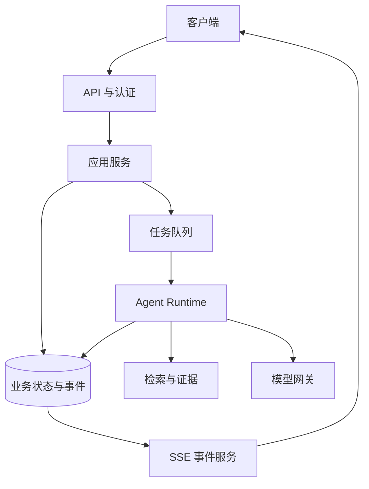
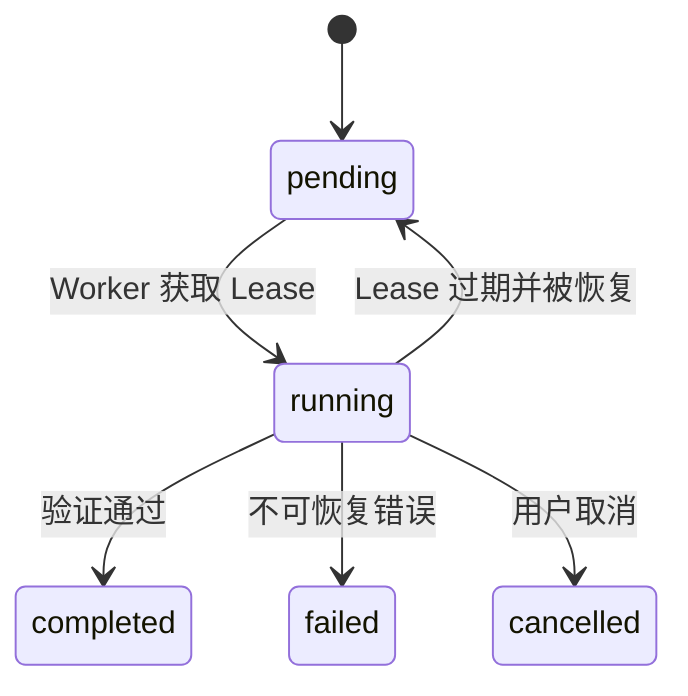
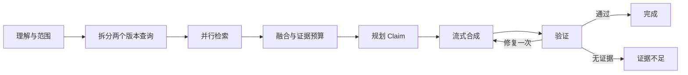

# 从零串起一个只读知识 Agent 完整案例

现在把前十五章放进同一个系统。用户输入“比较远程访问旧版与新版申请流程，并给出引用”。系统需要固定身份和版本、创建回合、异步执行、检索两个版本、合并证据、生成 Claim、流式返回、验证引用，并在断线或 Worker 中断后保持可查询状态。

本章提供实现蓝图，不复制私有项目的类名、接口、表结构或 Prompt。公开示例使用中性模块，所有“已实现行为”都来自只读源码、测试或运行脚本的交叉取证；GPU 集群等不属于本案例。

## 先看系统组件



API 处理协议和认证；应用服务创建会话与回合；队列把长任务交给 Worker；Runtime 运行状态图；RAG 负责权限过滤和证据；模型网关统一模型差异；数据库保存业务状态和事件；SSE 从持久事件序列向客户端推送。

Redis 可以承担通知、准入或短期协调，但数据库事件序列是真相源。Redis 消息丢失时，客户端仍可按游标轮询数据库补齐。

## 第一步：创建回合并钉住运行快照

API 收到请求后依次：

1. 验证身份；
2. 解析明确知识范围；
3. 读取当前激活知识版本与策略版本；
4. 使用幂等键创建或返回已有回合；
5. 在数据库提交后派发任务；
6. 返回回合 ID，客户端连接事件流。

为什么先提交再派发？Worker 取到任务时必须能读到回合。派发失败时，应用把回合标记为可识别的失败或待恢复状态。当前行为不宣称使用 transactional outbox；如果未来需要消除提交与派发之间的窗口，应明确作为演进方案设计。

运行快照保存知识版本、策略版本、模型路由和 Deadline。执行中即使管理员发布新知识，本轮仍使用创建时版本，保证引用一致。

## 第二步：准入和任务所有权

创建任务前检查全局、用户和模型维度的并发槽，避免在线请求耗尽 Worker。Worker 领取任务时获取 owner lease：在租约有效期内只有一个所有者写入执行状态。



Lease 需要所有者标识和过期时间。续租失败的旧 Worker 停止写入，恢复扫描器才能安全把停滞任务交给新 Worker。业务终态只有一个，晚到事件不能覆盖已完成或已取消状态。

## 第三步：Runtime 执行状态图

本案例的主图可以拆成：预处理、检索研究、证据融合、Claim 规划、回答合成、验证和终态。



理解阶段一次性生成意图、实体、版本和查询候选，程序再叠加权限。不能针对某个标题或测试问题写关键词特判。

两个版本的检索可以并行，但分支数有上限。Reducer 按证据 ID 去重；完成顺序不决定最终排名。若一侧无证据，可在总预算内做一次补充研究，最多两轮，避免无限循环。

## 第四步：检索前过滤权限

身份主体展开成允许的知识范围。SQL 在全文和向量查询前加入租户、知识库、版本和状态过滤；缓存键包含范围摘要和策略版本；命中缓存后再次检查证据可见性；引用发布前再确认。

用户主动指定旧版和新版，只表示希望查看这两个对象。若其中一个不在权限范围，系统返回范围拒绝或只回答可见部分，不能自动去全局索引补齐比较。

权限撤销后，新请求立即使用新范围。已经运行的回合如何处理取决于策略：高敏感系统在节点边界重新检查，普通系统至少在引用发布前检查。

## 第五步：证据、Claim 和流式事件协作

Runtime 先生成 Claim 计划，再开始流式回答。流式事件不能只是一串 Token，还包括稳定事件：

```text
turn_started
research_started
evidence_selected
answer_delta
citation_added
validation_started
turn_completed | turn_failed | turn_cancelled
```

每条持久事件有递增序号。客户端断线后使用 `Last-Event-ID` 继续；服务器从数据库读取缺失事件，Redis 只通知“有新序号”。若 SSE 不可用，客户端按同一序号轮询。

流式合成期间展示的引用必须来自已选 Evidence。最终验证失败时可以发修复事件，不能悄悄用一份完全不同答案覆盖客户端状态。

## 第六步：取消、Deadline 和恢复

Deadline 保存为绝对时间。每个节点计算剩余预算，调用模型、检索和工具时使用更短超时。用户取消后写入持久取消标志；Worker 在节点边界、长检索和模型流中检查并传播取消。

Checkpoint 只在需要恢复的运行模式启用。恢复时重新建立输出流，读取业务任务是否已终止，并对外部副作用做幂等检查。本案例工具只读，恢复风险小于写操作，但模型调用仍可能重复产生费用，所以要记录 Attempt 和预算。

停滞扫描器检查 Lease 与最后进度时间。它不会简单把所有 `running` 改回 `pending`，而要确认所有者失效、任务未到 Deadline、未取消且恢复次数未超限。

## 第七步：同一 Runtime 做 Eval 和观测

离线 Eval 固定知识与策略版本，通过同一 Runtime 执行：

- 两个版本资料是否都被召回；
- Claim 是否被证据支持；
- 引用是否准确；
- 指定范围和 ACL 是否遵守；
- 提示注入是否被隔离；
- 无结果是否安全拒答；
- 取消、超时和恢复是否进入唯一终态。

Trace 关联 HTTP、应用服务、队列等待、图节点、检索、模型、首事件、引用和终态。Metric 记录分布而不是敏感原文，例如队列年龄、节点耗时、TTFT、成功终态、引用数量和 Eval 版本结果。

## 一条正常运行的状态记录

| 时刻 | 业务状态 | 事件 | 说明 |
| --- | --- | --- | --- |
| T0 | pending | turn_created | 回合已提交 |
| T1 | running | turn_started | Worker 获取 Lease |
| T2 | running | research_started | 两个版本并行检索 |
| T3 | running | evidence_selected | 证据融合完成 |
| T4 | running | answer_delta | 客户端接收文字 |
| T5 | running | validation_started | 检查 Claim 与引用 |
| T6 | completed | turn_completed | 唯一终态写入 |

状态与事件不是同一个东西。状态表示当前业务事实，事件记录发生过什么；图状态只服务本次编排。三者分开后，恢复和审计更容易解释。

## 五条必须验证的失败路径

### 无证据

检索成功但两个版本都没有相关资料，终态为证据不足，不调用常识补齐。

### 无权限

指定范围与服务端权限交集为空，检索不回退全局，事件说明范围不可用。

### 派发失败

回合已提交但队列派发失败，状态可查询并进入明确恢复或失败路径，不能永远 pending。

### 客户端断线

Worker 继续按策略执行，事件持久化；客户端重连从最后序号补齐，不重复应用事件。

### Worker 中断

Lease 过期后恢复器接管；已完成节点从 Checkpoint 或业务状态恢复；终态和费用不会被旧 Worker 覆盖。

## 当前能力与可选演进

本案例可以由现有源码、测试和脚本验证的行为包括：只读工具、结构化理解、文档解析与条件 OCR、结构切片、版本投影、混合检索、权限过滤、状态图、有限研究、Claim/Evidence、上下文记忆、幂等准入、Celery Worker、取消与恢复、SSE 事件、Eval、Trace 和候选发布。

Transactional Outbox、写工具审批和通用 Mutation 工作流不作为现状。若未来增加写操作，需要单独设计幂等、副作用审计、审批、补偿和恢复，不能从只读工具直接推导。

## 实现顺序

1. 先用固定模型替身跑通回合、事件和终态；
2. 加入只读检索与权限；
3. 建立知识版本与候选发布；
4. 加入 LangGraph，但保持节点调用现有服务；
5. 增加 Claim、引用和验证；
6. 再加入队列、Lease、取消和恢复；
7. 最后接真实模型、Eval、Trace 和发布门禁。

这个顺序避免一开始同时调模型、数据库、队列和流式 UI，初学者可以逐层验证。

## 最终验收清单

- 能从回合 ID 查询状态和事件；
- 重复幂等键不创建第二次执行；
- 用户范围进入每次检索和引用；
- 知识与策略版本在整轮固定；
- 证据不足和无权限不会使用越界兜底；
- 并行分支受限且合并稳定；
- Claim 与 Evidence 一一可核对；
- 客户端能断线重放；
- 取消、Deadline、Worker 中断都有终态；
- Eval 与线上复用 Runtime；
- Trace 能关联请求、节点、证据和终态；
- 候选失败时旧版本仍可服务。

到这里，AI 与 Agent 课程形成了一条连续路径：从四种应用形态到完整知识 Agent。后端课程会进一步拆开数据库、Redis、消息队列、事务与三种语言的服务实现；AI Infra 课程负责让这些组件可靠运行。

## 参考资料

- [LangGraph Overview](https://docs.langchain.com/oss/python/langgraph/overview)
- [Celery Tasks](https://docs.celeryq.dev/en/stable/userguide/tasks.html)
- [HTML Living Standard：Server-sent events](https://html.spec.whatwg.org/multipage/server-sent-events.html)
- [OpenTelemetry Traces](https://opentelemetry.io/docs/concepts/signals/traces/)

