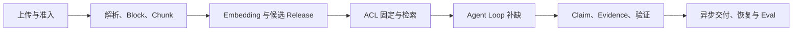

# 综合项目：实现可信的知识 Agent

从文件上传开始，串起解析、切块、检索、行动循环、证据验证、异步运行、恢复和评测。**Knowledge Agent**、**RAG**、**Runtime** 分别指向同一条执行链上的不同对象：待发布文档、用户身份、知识问题、质量目标、截止时间和运行预算进入系统，对象、文档版本、Chunk、Release、Turn、Evidence、Claim、Event、Checkpoint 和 Eval 结果保存处理中间状态，最终得到带准确引用的回答、可重放事件、失败或拒答原因、评测记录和可回滚版本。

位于贯穿知识数据、Agent 控制、可信答案和异步交付的综合系统，主要机制是文档先经过候选索引和原子发布；查询固定版本与权限后检索证据，Agent 在有限循环中补缺，验证通过后异步交付。入库部分成功、检索无证据、权限变化、模型超时、Worker 丢失、引用验证失败和发布回归会让链路在不同位置停止，错误记录必须保留发生阶段、当时的状态和终止原因。

::: info 贯穿示例

场景：团队发布一份新制度，员工随后追问生效条件，系统必须只引用其可见版本并允许长任务断线恢复。需要的身份、权限、版本和业务事实由应用提供，模型与外部内容只产生候选。

:::

## 从文档到回答的完整目标

入库部分成功会破坏对象与带准确引用的回答之间的对应关系，排查时先保留原始输入摘要和发生阶段，再判断是否允许重试。

检索无证据影响文档版本或下游解释，不能和入库部分成功共用“重新调用一次模型”的处理方式。

## 系统组件与职责边界

数据平面、Agent Runtime 和质量平面分别保存各自状态，通过稳定身份关联。因此对象与文档版本要有唯一写入方，其他组件只能通过版本化命令申请修改。

RAG 与解决的问题相邻，但控制权不同，比较时要看谁选择创建 Agent Turn、谁保存对象、谁确认带准确引用的回答。

Agent Loop 可以参与同一请求，却不能替代数据与版本管理；组合后仍要单独检查用户身份的可信来源和入库部分成功的终止规则。

Knowledge Agent 使用的身份、范围和版本来自可信运行时，待发布文档可以表达意图，但不能提升权限或改写活动 Release。

检索无证据发生时，错误回到文档版本的所有者处理，上游缺输入、当前组件违反不变量和下游不可用分别形成不同终态。

Knowledge Agent 的确定性边界位于对象写入之前。模型只提交候选值，程序仍要从认证、版本和策略快照补入可信字段。

Knowledge Agent 内部可以使用更细的临时对象，跨边界只暴露稳定协议。替换 RAG 时，调用方不需要理解内部缓存和 SDK 响应。

## 知识数据和运行状态怎样关联

Knowledge Agent 的输入合同至少列出待发布文档、用户身份和知识问题，每项都注明来源、是否必需、允许的缺省值，以及缺失后是在入口拒绝还是进入降级路径。

综合项目要把业务对象、知识版本和 Chunk 证据分开保存。对象记录任务进度，Release 固定本次执行能看到的知识快照，Chunk 只承担来源定位和检索组合；三者各有写入者，才不会让一次回答覆盖知识版本或运行状态。

并发分支按稳定身份合并 Chunk，完成顺序只反映耗时，不能决定结果属于哪个请求，更不能让迟到的旧状态覆盖新修订。

输出合同同时描述带准确引用的回答和可重放事件，并为拒绝、取消、部分完成和未知状态提供固定形状，调用方据此分支，无需解析错误文案猜测结果。

文档版本参与乐观并发检查；处理开始后若版本变化，旧候选只保留作审计，不能继续写入对象。

待发布文档里若包含模型填写的同名字段，应用会丢弃它，再从认证、配置或活动版本中补入可信值，因为结构校验通过不等于授权或业务校验通过。

Document、Chunk、Release、Turn、Evidence、Claim、Event 和 Eval 结果组成 Knowledge Agent 的最小追踪材料，日志只保存稳定 ID、版本和错误类，完整 Prompt、文档正文与凭证不进入指标标签。

撤回或删除用户身份时，相关缓存、候选和未完成任务按版本失效；稳定 ID 可以保留审计关系，已撤回内容不能继续进入带准确引用的回答。

契约还需要描述新鲜度。文档版本对应的数据发生变化后，旧缓存、旧候选和未完成任务怎样失效，应由版本或时间规则直接判断，不能依赖模型注意到矛盾。

删除和撤回也属于数据生命周期。引用的原始对象被移除时，稳定 ID 可以保留审计关系，正文与派生结果则按策略失效，避免继续向用户展示过期内容。

::: warning 知识 Agent 的可信边界

带准确引用的回答通过结构校验后仍是候选。使用的身份、权限、知识版本与业务事实由应用从可信服务读取，核对完成后才能执行或交付。

:::

## 入库与查询两条主链

知识 Agent 的端到端推演应能从同一个任务 ID 找到文档准入、候选版本、活动 Release、检索 Evidence、Claim 验证和异步事件。切换权限或中断 Worker 后，回放必须停在正确的版本边界，不能凭最终答案猜测发生过什么。

发布文档接收待发布文档并建立对象，入口校验未通过就地结束，后续模型、检索器或工具调用次数保持为零。

建立可检索版本固定身份、范围、配置版本和绝对 Deadline，后续子步骤只继承剩余时间，不能各自重新获得完整超时。

创建 Agent Turn 读取文档版本并执行主题逻辑，参数由应用组装，外部返回先保存为可重放事件，尚未获得修改领域状态的资格。

验证证据与答案检查结构、范围、版本和主题不变量；带准确引用的回答缺少来源、落在旧版本或越过权限时，对象停在 rejected 或 failed。

异步交付并评测先保存带准确引用的回答与终止原因，再产生事件或通知，交付失败可以重放，核心状态写入失败则不能对外宣称完成。

创建 Agent Turn 出现部分结果时，由任务合同决定保留、补偿还是整体丢弃；带准确引用的回答若可重建就重新生成，外部副作用则查询回执或执行补偿。

实现可以使用函数、Graph、Middleware 或 Workflow，对象的所有权和入库部分成功的停止规则不会随框架改变。

部分成功需要在步骤边界处理。创建 Agent Turn 已经产生一部分带准确引用的回答时，程序按任务合同决定保留、补偿或整体丢弃，并记录未完成项，不能默认为全部成功。

创建 Agent Turn 和验证证据与答案都要写明逆向动作或不可逆原因，带准确引用的回答若可重建就删除后重算，已发送的外部命令只能查询回执或补偿。

## 沿一次制度问答端到端推演

沿“场景：团队发布一份新制度，员工随后追问生效条件，系统必须只引用其可见版本并允许长任务断线恢复”推演：入口创建 request_id，读取可信身份，把待发布文档和当前版本写入初始状态。

发布文档生成对象与输入摘要；若用户身份缺失，请求返回 rejected，并指出缺少哪项材料，不继续消耗模型或外部服务配额。

建立可检索版本冻结 scope、release、policy 和 deadline_at，用户或模型在正文中提供的同名值只作为普通内容，不能覆盖这份运行时快照。

创建 Agent Turn 按“文档先经过候选索引和原子发布；查询固定版本与权限后检索证据，Agent 在有限循环中补缺，验证通过后异步交付”推进，每次依赖调用保存 call_id、参数摘要、开始时间与状态版本，以便判断超时前是否已经产生结果。

候选结果对应带准确引用的回答、可重放事件、失败或拒答原因、评测记录和可回滚版本，验证证据与答案逐项检查权限、版本与领域约束，问题列表为空才允许形成下一状态。

异步交付并评测写入终态；客户端断开只影响交付通道，重新连接时读取已经保存的对象或事件游标，不重跑核心逻辑。

故障注入选择权限变化，程序保留原候选和错误位置，只重做失败边界，不能从入口复制整个任务并产生第二份状态。

推演结束后用 request_id 关联对象、带准确引用的回答与终止原因，测试据此排除并发请求串线，并确认失败路径没有遗留未关闭资源。

在输入拒绝时不调用依赖，正常路径按 5 个阶段推进，有限修复只重做失败边界。调用次数是控制流断言，不是性能宣传。

知识 Agent 的最终记录用 request_id 关联对象、带准确引用的回答和失败问题，测试据此证明结果来自本次执行，没有混入并发请求。

## 正常交付与证据闭环

正常完成时，对象、文档版本和带准确引用的回答指向同一次执行，重复读取返回同一终态，未完成分支已经取消或有明确所有者。

Document、Chunk、Release、Turn、Evidence、Claim、Event 和 Eval 结果用于还原 Knowledge Agent 的处理过程，可以按阶段和版本聚合；敏感正文留在受控存储中，不复制到日志与指标。

可重放事件可能是合法的空结果，但必须带范围、版本和原因；任务明确要求找到材料时，同一个空结果进入拒答而非成功。

依赖返回成功状态只证明传输完成。还要检查带准确引用的回答是否满足业务范围、质量阈值和当前版本，明确拒绝也可能是正确终态。

创建 Agent Turn 并发完成时，每个分支保留自己的身份和局部预算，验证证据与答案按任务合同接纳可用结果，慢分支不能抹掉已经确认的记录。

对象的状态迁移必须单调：完成不能退回运行中，取消不能被迟到结果覆盖，失败重试也不能绕过入口已经固定的权限。

Knowledge Agent 的成功证据最终要同时回答输入是什么、执行了哪些步骤、交付了什么以及为什么停止；任一项缺失都应留在未确认状态。

Knowledge Agent 把业务验收与服务健康分开。依赖返回 200 只说明传输成功，带准确引用的回答仍要满足当前范围和质量要求；明确拒答也可能是正确终态。

Knowledge Agent 的观测指标按阶段和版本聚合。评估时，把错误、空结果、拒绝、恢复和资源消耗分开统计，避免一个成功率掩盖不同故障。

## 逐层注入故障并恢复

端到端故障要沿链路回放：上传或解析缺失时修复入库，检索为空时检查版本和权限，模型超时则保存检查点，引用验证失败只重做受影响的答案阶段，交付断开则重放事件。整条链路重试会重复副作用，也会丢掉真正的失败位置。

遇到入库部分成功时，先记录发生阶段、错误类别和责任对象。保留输入摘要和状态版本，由对应组件决定重试、降级或终止。

遇到检索无证据时，先记录发生阶段、错误类别和责任对象。保留输入摘要和状态版本，由对应组件决定重试、降级或终止。

权限变化触及的安全边界，重试不会使它自动合法；执行路径保存拒绝规则和输入来源，清除未授权候选，并以稳定错误结束当前动作。

遇到模型超时时，要同时记录开始时间、剩余时限和最后一次进展，随后停止新增工作，只允许释放资源、保存可恢复状态或返回已经确认的局部结果。

遇到 Worker 丢失时，先记录发生阶段、错误类别和责任对象。保留输入摘要和状态版本，由对应组件决定重试、降级或终止。

遇到引用验证失败时，先记录发生阶段、错误类别和责任对象。保留输入摘要和状态版本，由对应组件决定重试、降级或终止。

将终态、可重试性和资源清理结果写入记录；后台扫描器根据对象判断任务是在运行、等待恢复还是已失败。

执行前固定 Deadline、动作上限、重复签名、无进展阈值、预算和取消信号；任一条件触发，创建 Agent Turn 停止创建新工作。

把重试时间和次数计入总预算。Knowledge Agent 每次重试先扣减剩余额度，达到上限就保留原始错误。

Knowledge Agent 的清理动作设计成幂等操作；仍被活动任务或 Lease 引用的资源拒绝删除。

## 测试、评测与发布门禁

从上传到回答执行端到端用例，并逐个注入解析、检索、模型、队列和网络故障，核对恢复与拒答；测试显式给出待发布文档、初始对象、预期带准确引用的回答和终止原因，不能只断言返回值非空。

Knowledge Agent 的单元测试用 Fake Adapter 固定带准确引用的回答与错误，断言参数、调用顺序、状态修订和清理动作，这些结果只证明本地控制逻辑。

契约测试围绕待发布文档、对象和可重放事件构造合法与非法样本，Schema 解析成功后继续检查权限、版本与领域不变量。

故障测试注入入库部分成功和检索无证据，记录创建 Agent Turn 是否被调用、对象是否改变、资源是否释放，以及同一身份重试会不会重复执行。

在创建 Agent Turn 前后终止进程可以检查恢复边界：调用前退出允许重新领取，外部动作后退出先查回执，异步交付并评测完成后只重放交付。

Knowledge Agent 的集成测试连接真实协议与隔离存储，检查序列化、约束、并发和超时；需要在线服务时另行记录服务版本、时间、配置与凭证条件。

Knowledge Agent 的回归报告要保留失败类型分布。在 Knowledge Agent 的回归中，拒绝、超时、权限错误和空结果必须保持各自类型，状态变化本身就是行为契约。

Knowledge Agent 的性质测试随机改变对象顺序、重复提交、完成顺序或状态版本，断言权限不扩大、终态不倒退、同一身份不产生两次副作用。

Knowledge Agent 的离线评测关注质量变化，运行时测试关注控制和恢复，两类证据都齐全才可交付。只有两类证据都存在，才能同时回答“结果是否合格”和“系统是否安全完成”。

## 容量、成本和版本策略

知识 Agent 的对象合同要同时记录 Document、Chunk、Release、Turn 和 Evidence 的版本。索引或回答 Schema 升级时，旧 Turn 仍能引用当时的 Release，不能把新版本证据混进旧回答。

Knowledge Agent 的容量主要受导入吞吐、索引规模、在线检索、模型调用、队列容量和评测样本影响，并发可能缩短单次等待，也会占用连接、配额、内存和下游吞吐，必须沿发布文档、建立可检索版本、创建 Agent Turn、验证证据与答案、异步交付并评测逐层核算。

Knowledge Agent 的候选版本在固定样本上比较正确性、错误类型、延迟和资源消耗，入库部分成功等安全红线回归时直接停止发布，不能用平均质量抵消。

入库部分成功的降级路径在发布前写好，可以减少非关键增强、返回已经确认的带准确引用的回答，或明确暂时无法确认，缺失事实不能交给模型补写。

一次回答出现争议时，用 `request_id` 依次定位 Document、Chunk、Release、Turn、Evidence、Claim、Event 和 Eval 结果。先确定哪一层缺证据，再决定重跑切块、重新检索、拒答还是回滚 Release。

Knowledge Agent 的数据按证据用途分级保留，聚合字段可以留得更久，待发布文档和大体积带准确引用的回答设置短期限、访问控制与删除通道。

先在单进程实现对象、超时、错误和测试，只有恢复与容量证据提出要求时，再增加队列、Lease、分布式缓存或工作流引擎。

Knowledge Agent 的监控阈值要对应可执行动作。导入吞吐、索引规模、在线检索、模型调用、队列容量和评测样本中的某项接近上限时，系统可以限流、排队、缩小候选或切换保守路径；只发送告警不会保护正在运行的任务。

回滚要覆盖代码之外的状态。若改变 Schema、缓存键或持久化记录，旧版本是否还能读取新写入数据必须提前验证；无法双向兼容时采用候选版本隔离。

## 从单进程实现到生产架构

采用前先画出待发布文档到带准确引用的回答的最小控制图；固定函数已经能完成任务时，新增模型决策和跨进程对象只会扩大测试与运维范围。

RAG 负责把候选证据交给模型，知识 Agent 还要根据证据覆盖和权限决定是否继续检索、验证或拒答。对象仓库保存版本，运行时保存 Turn，验证器确认引用能支撑 Claim。

Agent Loop 可以与组合，但外部知识仍需授权，工具调用仍需校验，模型产生的带准确引用的回答仍停留在候选状态。

适合价值足够、入库部分成功可观察且预算可接受的任务，高风险、不可逆的决定需要确定性规则或人工批准。

格式正确但事实错误的带准确引用的回答是必要反例；若它直接进入成功，说明验证证据与答案缺少业务验证，应保留候选并给出证据问题。

执行期间修改文档版本可以检验并发设计，旧动作若仍能覆盖对象，说明版本或 Lease 有缺口，增加 Prompt 规则无法修复这类竞态。

增加了对象、依赖调用、恢复责任和故障面，设计记录既要说明获得的能力，也要列出新增的退出、降级与回滚路径。

综合项目的验收按阶段拆开：文件准入产生对象哈希，解析与切块产生稳定来源，Embedding 写入候选版本，检索只读取活动 Release，Agent 循环把 Evidence 绑定到 Claim，异步 Runtime 负责事件和恢复，评测检查权限、拒答和回归。任何阶段失败都要保留失败记录并阻止不完整版本上线，不能用最终回答是否流畅替代入库和权限验收。

## 知识 Agent 的端到端自测

用“一份文档从上传、解析、检索走到带引用的回答”做自测时，入口先记录输入摘要、身份和执行版本。Manifest、Block、Chunk、Release、Evidence、Claim 和 Turn由唯一组件写入，其他组件只能提交带修订号的候选。在“知识 Agent”里，读者可以从任务 ID 找到它经过的节点，不必靠最终文案猜过程。

针对“知识 Agent”，正常路径从准入开始，先检查范围和资源，再创建一次调用。调用结果带稳定 ID、来源和终止原因，Embedding 失败、ACL 撤回、证据不足或 Worker 重启分别记录。针对“Manifest、Block、Chunk、Release、Evidence、Claim 和 Turn”，输出进入下一节点前还要确认版本和权限，空结果也要说明范围。

在“知识 Agent”的故障测试中，依赖调用前和结果已经产生但状态尚未提交时各切断一次。前者应没有外部调用，后者要留下可重放的未知状态。恢复使用同一幂等键，先查询外部回执，再决定补偿。

“知识 Agent”的验证命令检查输入、状态变化、调用顺序、输出摘要、失败证据和资源清理。未通过验证的候选不能进入交付。

“知识 Agent”的取舍需要写在结果里：扩大缓存、并行或自动修复可能缩短等待，也会增加状态、成本和失败组合；保持较小能力面则更容易做权限隔离和人工接管。

回放“知识 Agent”时改变输入顺序、重复提交、缩短 Deadline 或撤回权限，确认状态单调、范围不扩大、资源按时释放。指标用于定位变化，不替代事实核验。

## 端到端交付的验收顺序

综合项目的验收应按入库、发布、检索、证据、回答、异步交付和恢复顺序进行。先确认活动 Release 包含完整的 Block、Chunk 和向量，再验证在线请求固定了 Scope；证据通过来源和权限检查后才进入 Claim，验证器完成后才允许 SSE 或轮询返回。任一阶段失败，都要保留阶段状态和可重试边界。

最后用同一份文档修改和权限撤回样本回放：旧 Release 仍服务已开始的 Turn，新 Turn 看不到撤回对象，断线重连只能补读事件。这个样本同时覆盖版本、ACL、Evidence、Checkpoint 和交付，是比单次“回答正确”更有价值的系统验收。

## 知识 Agent 的边界案例

在“知识 Agent”中，入口收到的资料可能不完整，程序先保存缺口和当前版本，不能让模型用常识填入 Manifest、Block、Chunk、Release、Evidence、Claim 和 Turn。“知识 Agent”的输入后来补齐时，新的执行沿同一个任务 ID 继续；已经结束的失败记录不被覆盖。

Embedding 失败要回到批次和内容哈希，ACL 撤回要回到 Release 与授权快照，证据不足要保留候选和覆盖缺口，Worker 重启要从 Checkpoint 查询已确认的步骤。未入库、处理失败、检索成功但无可用证据、回答尚未验证分别不能互相替代。

“知识 Agent”的正常输出先经过范围、版本和权限检查，再进入交付或下一个节点。未通过验证的候选不能进入交付。“知识 Agent”的输出只满足结构而没有可验证来源时，状态保持为候选，前端应显示缺口而不是成功标记。

用重复提交、并发完成、取消和进程退出四个样本回归。回归“知识 Agent”时，检查同一幂等键是否只产生一个有效终态，迟到事件是否被拒绝，临时资源是否释放，重新连接是否能读到同一份事件。

这组检查的结果应带命令、解释器或服务版本、输入摘要和退出码。“知识 Agent”没有运行证据时，只能写“待验证”；离线替身通过也不能推导真实模型、网络服务或生产权限已经通过。
