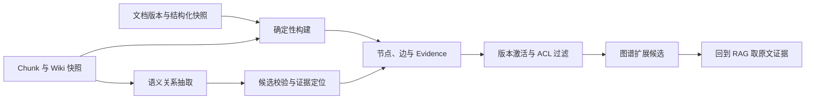
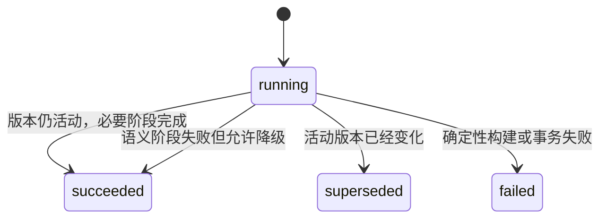
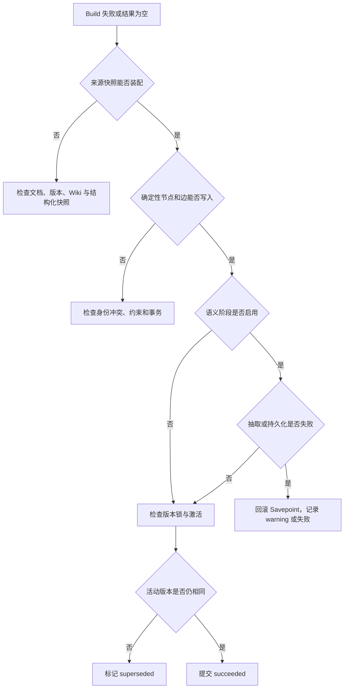

# 知识图谱怎样从证据构建节点与边

文档检索擅长找出与问题相近的片段，但有些问题天然带着关系：“这份规范引用了哪些文档”“某需求包含哪些任务”“这个系统由谁负责”。把所有关系都留在自然语言里，每次查询都让模型重新猜，答案很难稳定。

知识图谱把对象表示为节点，把对象之间的关系表示为边。图中的每条边还要连着 Evidence，说明关系来自哪份文档、哪个版本和哪段内容。没有这层证据，图谱只是另一种形式的模型输出，无法判断它为何出现，也无法在来源撤回后安全失效。

这篇用《远程访问规范》贯穿构建过程。文档属于“信息安全”目录，Wiki 主题是“设备合规”，正文明确写着“受管设备必须通过合规检查后才能建立远程连接”。目录层级和 Wiki 主题可以由确定性数据构建；“受管设备 requires 合规检查”则是语义候选，只有原文引用可定位时才进入活动图。

::: info 图谱构建的输入和输出

输入不是一段孤立文本，而是文档 ID、文档版本、稳定知识对象 ID、结构化字段、Wiki 快照、Chunk、可见范围和可选的语义抽取结果。输出包括节点、边、节点来源、边证据和 Build 记录。

:::

## 图谱解决关系检索，不替代原文和业务数据库

知识图谱适合保存稳定或可版本化的关系。目录包含文档、需求包含任务、文档引用附件、别名指向规范对象，这些关系有明确的字段或来源。查询可以先命中一个对象，再沿边扩展一小圈候选，最后回到原文检索取证。

图谱不适合接管高频变化的业务状态。任务的当前状态、账号权限和余额仍应从业务数据库读取。把这些值复制到节点属性后，更新延迟会制造两份不一致的状态。节点可以保存业务对象 ID，Agent 真正需要状态时再调用确定性工具。

关系数据库也不会因为有了图谱就失去作用。关系数据库负责事务、约束和权威字段，图谱负责跨对象遍历与关系检索。构图过程通常正是从关系数据库、文档结构和发布快照读取确定性事实，再把适合遍历的部分投影成节点和边。



图谱扩展返回的是检索上下文，不是最终答案。即使边上有引用，回答层仍要把关系与其他 Evidence 一起验证，避免把过期边或不完整关系直接写成结论。
## 确定性关系和语义候选的证据等级不同

确定性关系来自程序能直接读取的字段。父目录 ID 指向当前文档，可以建立 `contains`；结构化快照里需求 ID 与任务的 `requirement_id` 一致，可以建立 `has_task`；附件元数据明确父来源，可以建立 `references_document`。这些关系不需要模型猜，但仍要保存来源版本和构建方法。

语义关系来自正文含义。模型可能从“受管设备必须通过合规检查”抽取 `受管设备 requires 合规检查`。这个结果要经过几道检查：起点和终点必须对应已接受实体，二者不能是同一节点，关系类型要归一化，置信度达到当前规则阈值，Evidence 不能包含敏感字段，还要能定位到某个 Chunk。

两类关系可以落在同一张边表，但 `extraction_method` 必须保留。确定性边若之后又获得语义证据，不应被降级成模型关系。反过来，语义边也不能因为置信度很高就伪装成确定性事实。

| 关系 | 典型来源 | 构建方式 | 失败时怎样处理 |
| --- | --- | --- | --- |
| 目录包含文档 | `parent_node_id` | 确定性 | 缺父节点时跳过并记录结构缺口 |
| 文档引用附件 | 来源清单与父来源 ID | 确定性 | 找不到父来源时回到根文档或拒绝错误结构 |
| 需求包含任务 | 版本化业务快照 | 确定性 | 外键关系缺失时不猜测归属 |
| Wiki 主题 | 绑定文档版本的 Wiki 快照 | 派生但可追踪 | Card 未就绪时不建立活动边 |
| 正文语义关系 | 模型抽取与原文 quote | 语义候选 | 无引用、低置信或实体缺失时丢弃 |

同一需求下出现两个任务，只能说明它们共享父对象，不能自动创建“依赖”关系。共现是一种候选信号，不是依赖证据。依赖边要来自明确字段、人工关系或可定位的文本陈述。
## 节点、边、来源和 Evidence 各自保存什么

把所有内容塞进节点和边两张表，会让版本与权限失控。一个可审计图谱至少需要四类记录。

**节点**保存稳定身份与当前显示值，例如对象类型、对象 ID、名称、说明和有限属性。显示名称可以更新，节点 ID 不应随名称改变。

**节点来源**说明节点在某份文档版本中怎样出现，包含文档 ID、版本 ID、Chunk ID、引用、抽取方法和可见范围。同一个节点可以有多条来源。查询时的名称、说明和属性也应从当前用户可见的来源派生，不能直接展示一个来自私密来源的全局节点描述。

**边**保存起点、关系类型、终点、标签、置信度和构建方法。边的身份不包含文档版本，因此不同版本或不同文档可以共同支持同一条稳定关系。

**Evidence**把边与具体来源绑定，至少包含文档 ID、文档版本、Chunk ID、来源 URL、引用与 ACL。边是否可见，取决于它是否还有当前身份可见且版本有效的活动 Evidence。

这种拆分解决了两个问题。第一，同一实体由多份文档支持时，不需要复制多个节点；第二，一份来源撤回后，可以只让对应来源与 Evidence 失效，其他文档支持的关系继续存在。

::: warning 节点属性也会泄露信息

即使节点本身被标为公开，它的名称、说明或属性也可能来自私密文档。展示节点详情时要从 ACL 过滤后的活动来源聚合可见属性，不能只检查节点行上的一个 `visibility_scope`。

:::
## 稳定 ID 让重复构建得到同一批对象

构图任务会重试，也会因发布、规则升级和管理员操作反复执行。若每次都用随机 ID 创建节点和边，图会不断膨胀。稳定 ID 可以用命名空间与业务身份生成，例如 UUID v5：

```text
node_id = uuid5(kb_id, object_type, object_id)
edge_id = uuid5(kb_id, source_node_id, target_node_id, relation_type)
evidence_id = uuid5(edge_id, document_version_id, chunk_id)
```

业务对象已有稳定 ID 时直接使用。纯语义实体没有业务 ID，可以对实体类型与规范化名称做哈希，但要承认它的局限：同名不同实体可能被合并。可靠方案是引入命名空间、来源对象或实体消歧结果，不能只按显示名去重。

边的方向也属于身份。`A contains B` 与 `B contains A` 不是同一条边；对称关系则需要在关系定义里说明，避免查询层随意反转。关系类型要归一化成受控集合，模型返回的新词先映射或进入候选区，不能无限制造 `related_to_v2` 一类近义边。

稳定 ID 配合数据库 Upsert，重复构建会更新名称、属性和最后出现时间，而不是插入重复行。Evidence 用版本与 Chunk 组成唯一身份，同一个构建重跑也只会重新激活原记录。
## 同名实体要先区分身份，再讨论合并

规范化名称很适合搜索，不适合单独充当实体身份。“统一登录”可能是一个系统、一项需求，也可能是一份文档标题。即使实体类型相同，不同团队也可能使用同名项目。若构建器只用 `normalize(name)` 生成 ID，这些对象会被合成一个节点，之后任何关系都难以拆开。

身份解析可以按证据强度分层。业务数据库给出的对象 ID 最强，直接组成 `object_type + object_id`；文档和附件通常有稳定来源 ID；Wiki Alias 已经经过冲突治理时，可以提供候选身份；只有纯语义实体时，才退回到类型、规范化名称和来源命名空间。

退回名称哈希的节点应保留“待消歧”状态，不能假装已经找到全局实体。新的来源到来后，系统可以提出合并候选，由确定性规则或人工审核决定。合并动作需要迁移节点来源和边 Evidence，还要保留旧 ID 到新 ID 的映射，避免历史链接失效。

拆分比合并更麻烦。一个错误节点已经连着十几条边时，程序必须根据各条 Evidence 的来源重新分配，不能平均分成两个节点。没有可定位 Evidence 的旧边无法可靠拆分，只能降级为待复核或失效。这也是构建之初坚持保存来源的直接收益。

人物实体尤其容易同名。只有显示名时，可以用于当前文档内的局部关系，但不适合跨知识库合并成同一个人。企业成员 ID、账号主体或经过授权的目录 ID 才能支持全局身份。公开图谱也不应为了消歧额外暴露手机号、邮箱或其他个人字段。

节点当前显示值与身份也要分开。项目改名时更新 `name`，稳定 `object_id` 不变；节点来源继续保留各版本使用过的名称。查询旧 Release 时从旧来源显示旧名称，当前查询显示新名称，比把一个全局名称强行覆盖所有历史更容易解释。
## 确定性构建先于模型抽取

确定性构建成本低，失败原因也容易定位，应该先执行。对《远程访问规范》，构建器先创建文档根节点，再按输入逐项投影：

- 上级目录存在时，建立目录到文档的 `contains`。
- 附件带稳定来源 ID 和层级时，建立 `references_document` 或 `contains`。
- Wiki Alias 生成 `alias_of`，Topic 生成 `has_topic`，并保存 Wiki 引用。
- 版本化需求与任务快照生成 `describes_requirement` 和 `has_task`。
- 负责人、创建人、参与人和验证人来自结构化字段，分别生成受控关系。

敏感属性要在入图前过滤。属性键包含 password、secret、token、cookie、authorization 或 API Key 时直接丢弃；字符串值还要检查凭证形态并限制长度。列表也要限制元素数量和单项长度。过滤后的属性适合搜索和展示，但秘密扫描不能只靠这几个关键字，来源准入与权限仍是第一道防线。

确定性构建没有 Chunk 时也可以建立文档节点和部分结构边，Evidence 引用结构化来源。需要回答原文细节时，检索层仍可能因为没有 Chunk 而返回空结果。图谱存在和 RAG 就绪是两个独立状态，发布投影应分别记录。
## 构建输入必须来自同一份版本快照

一份文档的图谱输入往往来自多个表：文档元数据、Chunk、Wiki、业务对象快照和附件层级。只给文档表加版本号还不够，其余输入若读取“当前值”，构建结果仍会混合时间点。

文档版本 ID 是装配入口。Chunk 必须属于该版本；Wiki 优先读取绑定到来源版本的快照；需求和任务等结构化对象需要使用发布时保存的快照或明确的版本链；附件关系也要保留来源 ID、父来源 ID 和深度。当前草稿里的新 Topic 不能进入旧 Release 图谱。

可以把装配结果建模成只读 `DocumentGraphSource`。其中包含知识范围、文档与版本 ID、知识对象 ID、根节点 ID、标题、创建者、可见范围、父对象、Alias、Wiki 摘要和 Topic。构建函数只接收这个快照，不能在处理中随意回查当前表补字段。

Chunk 也要保存来源层级。一个根文档引用两层外部附件时，第一层可能由根文档 `references_document`，第二层由上级附件 `contains`。若只保留扁平 URL 列表，图谱会把所有附件都挂到根节点，原本的引用关系消失。

结构化需求与任务要按稳定本地 ID 和远端 ID 建立映射。任务的 `requirement_id` 找不到对应需求时，不应根据标题相似度猜父节点。构建可以保留孤立任务候选并记录 warning，或直接跳过这条边，具体策略取决于图谱是否允许不完整对象。

来源装配失败属于确定性阶段错误。比如请求的文档版本不存在、Chunk 指向另一知识库或发布快照缺少必要对象，这些问题不会通过重试模型修复。任务应在调用语义抽取前停止，Build 记录指出缺失的对象和版本。
## 模型抽取只有在引用可定位时才落边

语义抽取器接收标题和受限长度的 Chunk 内容，返回实体、关系、置信度与 Evidence 字符串。结构化输出能保证字段形状，不能保证关系真实。持久化前还要做程序校验。

实体名称或属性出现秘密形态时应跳过。关系的起点和终点必须能在本轮实体表中解析，不能为了保存一条关系临时猜一个同名节点。Evidence 文本要映射到最接近的 Chunk；找不到定位时，可以保留为待审核候选，但不能进入可回答的活动图。

置信度阈值只是一道粗筛。`0.92` 表示抽取器对自己的输出评分，不代表事实有 92% 的客观概率。真正决定边能否用于回答的是来源是否可见、引用能否定位、版本是否活动，以及关系类型是否符合领域约束。

语义抽取失败时，可以让确定性图谱继续发布，并在 Build 中记录 warning。这种部分成功适用于图谱增强是可选能力的场景。若产品承诺语义关系必须完整，发布门禁就应把它视为失败。选择哪种策略要写进 Release 状态，不能由异常捕获代码临时决定。

使用数据库 Savepoint 可以隔离语义持久化。模型返回的一组关系中途违反约束时，回滚这一组语义写入，之前的确定性节点仍保留。没有 Savepoint，捕获异常后继续提交可能留下半组实体和缺失的边。
## 构建版本要防止迟到任务覆盖新版本

构图通常由异步 Worker 执行。第 7 版任务启动后，第 8 版可能已经激活。第 7 版任务若在最后直接把结果标成活动，会把图谱切回旧状态。

Build 记录先保存 `document_id`、`document_version_id`、状态和开始时间。构建结束前对文档行加锁并读取 `active_version_id`。版本仍相同才允许激活；若已经变化，本次 Build 进入 `superseded`，保留错误说明，但不能修改活动图。



Build 开始状态可以先提交，使监控能看到长任务正在运行。后续构建事务失败时，回滚图数据，再单独把 Build 更新为 `failed`。这样失败记录不会跟着业务事务一起消失。

这里有一项取舍：先提交 Build 状态会多一次事务，也需要处理 Worker 在写入 `running` 后崩溃的情况。系统要有 Watchdog 把超时运行记录标记为失败或重新排队。完全放在一个事务里较简单，但长时间构图会持有事务，其他进程也看不到进度。
## 构建失败要定位到装配、确定性、语义或激活阶段

“图谱构建失败”没有足够信息指导恢复。来源不存在、模型超时、数据库约束冲突和版本被替换，需要完全不同的处理。Build 可以保留阶段、计数、warning 与有限长度的错误消息，Trace 再用 `build_id` 串起外部调用。



装配阶段记录文档 ID、请求版本和缺失输入类型，不能记录整份文档。确定性阶段记录冲突的对象类型、稳定 ID 和数据库错误类。语义阶段可以记录模型调用 ID、结构校验结果和被过滤的候选数量，不保存完整 Prompt。激活阶段保存构建版本与当时读到的活动版本。

状态计数也能帮助定位。确定性节点为零，多半是装配或首个写入失败；确定性图完整而语义节点为零，可能是功能关闭、模型失败或全部候选未过校验；边数突然下降，需要区分来源内容确实删除了关系，还是 Evidence 定位规则变化。

监控阈值必须连接到动作。`running` 超过租约时间可以由 Watchdog 复查 Worker 与活动版本，再决定重新排队；`superseded` 数量上升说明发布频率高于构建速度，可以合并中间版本任务；语义 warning 增多时先检查模型和 Schema，不要自动扩大重试次数。

重试 Build 要复用或明确关联原 `build_id`。若每次都创建新记录，运维只能看到多条失败，无法判断哪个是同一任务的第几次尝试。复用 ID 时要重置本轮计数并保留尝试历史；新建 ID 时则保存 `parent_build_id`。两种方式都比靠时间猜关联可靠。

队列派发失败发生在 Worker 之前。API 已创建 `pending` Build，却没能把任务发给 Broker 时，应把派发失败写回 Build，并在响应中分开报告排队成功与失败。简单返回 500 而不更新状态，会留下一个永远等待的 `pending` 记录。
## 版本切换通过来源失活，不直接删除全图

新版本激活时，与旧文档版本绑定的节点来源和 Evidence 先变为非活动。随后检查边是否仍有活动 Evidence，没有则停用边；节点没有活动来源时再停用节点。按这个顺序处理，可以保留其他文档对同一节点或边的支持。

直接删除旧节点会破坏 Release 历史和审计。历史 Release 查询可以通过版本感知条件读取旧 Evidence，当前查询只读取活动文档版本。若当前 ACL 撤回，即使历史 Release 仍保存关系，也不能继续向已失去权限的用户返回。

图谱历史不是权限豁免。版本条件回答“这条证据属于哪个发布内容”，ACL 条件回答“当前主体能否看到它”。两个条件都满足，边才可用于扩展。

来源撤回与内容更新也不同。更新会让旧版本转为历史，撤回可能要求任何查询都不再展示内容。稳定 ID 可以保留作内部审计，Quote 和派生属性则按删除策略清理或封存。
## 一次从文档到活动关系的完整构建

下面的共享示例保留图谱控制逻辑，省略数据库和模型适配器。输入包含文档稳定身份、版本、正文、Topic 与两条语义候选。第一条引用能在正文找到，第二条虽然置信度更高，引用却不存在，因此不会落边。

<<< ../../examples/ai-agent/knowledge_graph_build.py

在仓库根目录运行：

```bash
PYTHONPATH=examples/ai-agent python3 examples/ai-agent/knowledge_graph_build.py
```

示例执行两次相同构建，结果仍是 4 个节点、2 条边和 2 条 Evidence。两条活动边分别是确定性的 `has_topic` 和有原文引用的 `requires`。没有原文支持的 `grants` 不会出现。

```text
{'nodes': 4, 'edges': 2, 'evidence': 2, 'active_edges': 2}
```

再构建同一文档的新版本，但新版本不再包含 Topic，旧 Topic Evidence 仍可保存在历史记录中，当前活动边变为 0。这个结果验证了“边依赖活动 Evidence”，没有验证真实数据库锁、并发 Worker、ACL SQL 或模型抽取质量。
## 测试应同时覆盖幂等、回滚和可见性

本地示例用标准库 `unittest`，可运行指定测试：

```bash
PYTHONPATH=examples/ai-agent \
  python3 -m unittest discover \
  -s examples/ai-agent/tests \
  -p 'test_knowledge_graph_build.py'
```

单元测试覆盖重复构建、无引用候选、低置信候选和版本切换。生产实现还需要数据库集成测试，至少验证以下不变量：

| 测试 | 关键断言 |
| --- | --- |
| 重复构建同一版本 | 节点、边和 Evidence 数量不增长 |
| 语义写入中途失败 | Savepoint 回滚语义记录，确定性图仍可提交 |
| 活动版本在构建中变化 | Build 为 `superseded`，新版本图不被覆盖 |
| Wiki Topic 构边 | `has_topic` 带文档 ID、版本和 Wiki Evidence |
| 附件关系 | 父子层级、来源 URL 与引用保留 |
| 当前版本切换 | 当前查询看不到旧边，历史 Release 仍可读取 |
| ACL 撤回 | 当前和历史查询都不向该主体返回关系 |
| 节点详情 | 名称、说明和属性只来自可见来源 |

API 层还要先验证批量重建请求中的全部文档 ID，再向队列派发。若前两个任务已提交，第三个 ID 才发现越权，调用方会得到部分执行且难以回滚。Broker 不可用时，Build 记录要留下派发失败，响应分别报告已排队和失败数量。
## 关系类型与构建规则也需要版本治理

图谱 Schema 会变化。早期可能把附件统一记为 `related_to`，后来才拆成 `references_document` 与 `contains`；人物关系也可能从一个 `owner` 拆成负责人、创建人和验证人。只改构建代码，新旧边会同时存在，查询端无法知道该信哪一种。

生产实现应为构建器和关系词表保存版本。规则升级后，按知识范围或文档批次重建，查询在迁移完成前可以限定兼容版本。旧关系确认不再使用时再失活，不能直接改关系类型字符串，因为 Edge ID 包含关系类型，原地修改会破坏幂等身份。

关系类型要带方向、允许的起止节点类型和是否对称等约束。`has_task` 只允许需求指向任务，`alias_of` 允许 Alias 指向知识对象，`references_document` 的终点应是文档。模型抽取先映射到这份词表，无法映射的关系留在候选区，不直接扩充在线 Schema。

兼容迁移需要比较新旧构建。可以统计节点与边的增加、删除和类型变化，再抽样回查 Evidence。数量变化本身不是质量结论，但能发现整类关系意外消失。发布门禁应关注重要关系覆盖与无证据边数量，而不是要求节点总数持续增长。

构建规则回滚也要考虑已写数据。仅回滚代码不会自动恢复旧图，应该保留上一构建版本或能够按旧规则重建的输入快照。若模型版本不可重复，至少保留经过校验的候选与 Evidence，使回滚不必依赖模型再次生成相同结果。
## 图谱深度来自关系约束，不来自节点数量

构建更多节点并不代表图谱更有用。大量没有 Evidence 的泛化概念会增加歧义，图扩展时还会挤掉真正相关的邻居。先把少量确定性关系、版本和 ACL 做对，再评估语义抽取是否提高检索覆盖。

图谱构建也有成本：需要额外存储、版本失活、审计、后台任务和查询过滤。只做关键词与向量检索已经能回答的问题，不必为了“有图谱”再复制一层数据。关系型问题稳定出现、对象有可靠身份、边能绑定证据时，图谱才值得进入在线链路。

在线使用时，图谱负责找邻居，RAG 负责取原文，Claim 验证负责判断 Evidence 是否足够。把这三步拆开，关系错了可以定位到构建证据，原文缺失可以定位到检索，最终回答越界则回到验证与权限层处理。

GraphRAG 通常还会把子图、社区摘要或关系路径编入检索上下文，它比“一跳邻居扩展”多了聚合与生成步骤。社区摘要同样需要版本和来源，不能因为由图算法分组就获得更高可信度。知识规模不大、问题主要是找相似段落时，全文与向量检索更直接；只有问题依赖跨对象关系，图扩展才会带来新的候选。

语义搜索比较文本表示，知识图谱遍历显式边。两者可以组合：先用 Alias 或向量找到种子对象，再沿受控关系扩展，最后对邻居文档做混合检索。不能把向量距离直接改名为关系边，否则每次更换 Embedding 模型都会重写整张图，边也没有可供用户理解的关系语义。

构图前可以先抽取一批真实问题，标出哪些需要关系才能回答。构图后用这些问题检查种子命中、边扩展、Evidence 可见性和最终召回。若图扩展没有增加有效证据，维护这套投影的代价就没有得到回报，应缩小关系范围，而不是继续增加模型抽取数量。
## 建边先保存证据，再发布关系

节点和边都要有稳定 ID、来源定位、抽取器版本、置信状态和审核状态。规则确认的外键关系与模型提出的语义候选分开存储，候选未经核验不能参与高风险路由。

构建失败时保留失败批次并阻止激活，不删除上一版图谱。增量重建按文档版本幂等，撤回来源后能定位并下线所有派生边。
