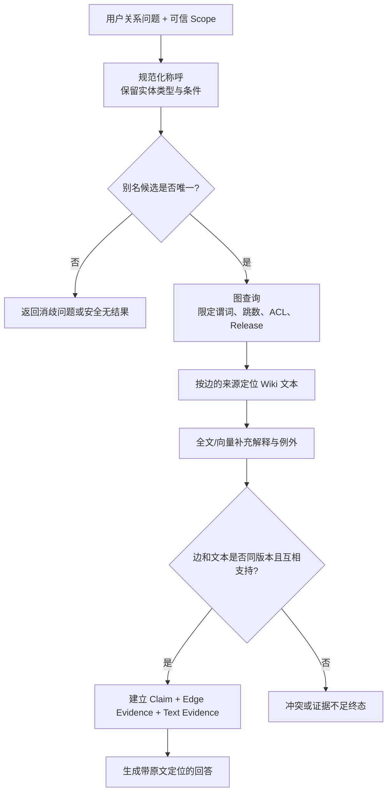

# 知识图谱、Wiki、别名、ACL 与 Release 怎样和 RAG 配合

## 知识图谱、Wiki、Alias、ACL 与 Release 分别负责什么

知识图谱是一种保存实体和明确关系的结构化知识表示，Wiki 用文本解释背景与例外，别名把用户称呼映射到规范实体，ACL 和 Release 分别约束可见范围与知识版本。它们位于 RAG 的知识组织和检索层，用于让关系查询与可引用原文落在同一权限、同一版本中。

用户问“结算服务归哪个团队维护，它依赖的网关是谁负责？”向量检索可能找到多个包含“结算”“网关”“负责人”的段落，却不一定能稳定完成 `服务 -> 依赖服务 -> 负责团队` 两跳关系。**知识图谱**适合保存这种明确关系，Wiki 文本则负责解释职责边界、例外条件和引用原文。

实体与关系、Wiki、别名与消歧、ACL、**Release** 分别承担不同职责。双通道查询先把用户称呼解析成规范实体，沿允许的关系查图，再在同一版本和权限范围内获取文本证据。

开始前需要了解混合检索、知识候选版本和基本关系数据。图谱不是所有 RAG 项目的必选组件；只有关系问题频繁、实体边界可维护且文本检索确实不稳定时，它的建设成本才可能值得。

## 知识图谱的结构与边界

知识图谱把知识表示为实体和关系。实体有稳定 ID 与类型，例如 `service:billing`；关系是一条有方向的边，例如 `service:billing --depends_on--> service:gateway`。边还应保存来源、适用版本、有效期和权限范围。

图谱解决的是关系遍历和实体约束：谁负责谁、谁依赖谁、哪个策略适用于哪个环境。它不擅长保存一整页操作说明，也不天然提供可供用户阅读的引用。把整段文档都转换成节点和边，既丢失语境，又产生高昂的抽取与校验成本。

图谱同样不等于“模型抽取出来的事实集合”。模型可以提出实体和边候选，但候选需要 Schema、来源、冲突和权限校验，验证通过后才能进入候选 Release。没有来源的边不能因为看起来合理就发布。

## Wiki、图谱和向量索引各自负责什么

| 载体 | 擅长内容 | 典型查询 | 输出怎样成为证据 |
| --- | --- | --- | --- |
| **Wiki**/原始文档 | 解释、步骤、条件、上下文 | 发布流程有哪些注意事项 | 返回可定位原文片段 |
| 全文/向量索引 | 在大量文本中召回相关片段 | 旧连接为什么没有排空 | 返回候选 Chunk 与位置 |
| 知识图谱 | 稳定实体与显式关系 | 哪个服务依赖网关 | 返回带来源的实体边 |
| 结构化业务表 | 当前状态、日期、受控字段 | 当前生效版本是什么 | 返回带审计来源的字段 |

实践中常见顺序是：图谱确定实体和关系，文本检索补充说明，Evidence 验证器检查二者是否来自同一 Release 与可见 Scope。图谱边可以支持结构化 Claim，但最终引用最好仍能指向用户可读的原文或受控记录。

## 实体：稳定 ID 和显示名称必须分开

实体至少有 `entity_id`、`entity_type` 和 `display_name`。稳定 ID 用于关系、缓存和版本对照；显示名称可以改名。若用名称当主键，“支付网关”改成“交易网关”后，旧边、引用和缓存都会断裂。

类型也很关键。`gateway` 可能既是服务名，也可能是基础设施类别。实体解析应返回带类型的候选，例如 `service:gateway`，不能只返回一段字符串。查询关系前还要检查该实体类型是否允许出现对应谓词，例如 `service depends_on service` 合理，而 `person depends_on service` 可能是建模错误。

实体合并和拆分都需要迁移记录。把两个实体静默合并会改变历史答案；生产系统应维护重定向或弃用状态，并在新 Release 中原子发布。

## 关系边：不只是 subject、predicate、object

一条可审计边至少需要：

- 主体、谓词、客体及其类型；
- 来源文档与原文定位；
- `release_id` 和适用时间；
- `scope_id` 或继承的访问策略；
- 抽取方式、校验状态和冲突状态。

边的方向会影响查询。“A 依赖 B”不能直接回答“谁依赖 A”，除非查询明确反向遍历。谓词应使用受控枚举而不是模型自由文本，否则 `owned_by`、`maintained_by`、`responsible_team` 会变成三种难以融合的关系。

图谱遍历必须有限。限定允许谓词、最大跳数、访问过的实体和剩余预算，避免从一个高连接节点扩散到整个图。

## 别名和实体消歧是两个阶段

**别名**解决“用户称呼和规范名称不同”，消歧解决“同一个称呼可能指向多个实体”。两者不能用一个字典查找完成。

别名记录至少包括 `alias`、规范实体 ID、语言或大小写规则、适用 Scope、来源和状态。规范化可以处理全半角、空白、大小写和明确缩写，但不要随意删除版本号或环境名。

若“gateway”同时指生产网关和开发组件，解析器应返回多个候选及区分字段。系统可以利用问题中的团队、环境和实体类型消歧；信息仍不足时输出 `ambiguous_entity` 并追问，而不是选择相似度最高者。

| 解析结果 | 后续动作 |
| --- | --- |
| 唯一可见实体 | 进入图查询 |
| 多个可见候选 | 用上下文消歧或追问 |
| 候选存在但均不可见 | 返回无权或安全的无结果 |
| 无候选 | 回到文本检索或请求更具体名称 |
| 别名映射冲突 | 记录冲突，阻止候选 Release 发布 |

## ACL 必须在图和文本两边同时生效

只给原文做 **ACL**、不保护图谱边，会从关系中泄露不可见实体；只过滤最终答案也太晚，因为查询结果、模型上下文和 Trace 已经接触了数据。

正确做法是在图查询和文本查询内部都带可信 `tenant_id`、`scope_ids` 与 `release_id`，融合后再复核。用户输入或模型动作不能修改这些字段。对多跳查询，每一跳都重新验证目标实体和边是否可见，第一跳可见不代表第二跳自动继承权限。

“无结果”也不能触发跨范围 fallback。若指定 Scope 中没有负责人资料，系统应说明证据不足或请求授权，不应到全局图里找一个看似合理的团队。

## Release 保证图、文本和别名是一张快照

一次文档更新可能同时改变 Wiki 文本、实体显示名、别名映射和关系边。如果四种投影各自用一个“current”标志，检索可能拿到新图谱边和旧文本说明，形成内部矛盾。

更稳妥的发布过程是：

1. 创建不可见的候选 Release；
2. 在候选版本中解析 Wiki 为 Block；
3. 生成全文/向量投影；
4. 提取实体、别名和关系候选；
5. 校验来源、ACL、冲突、数量和覆盖；
6. 所有投影就绪后，原子切换“当前 Release”指针；
7. 旧 Release 保留到回滚窗口结束。

图谱成功、向量索引失败时，候选 Release 仍保持 `staging`。不要让局部成功的数据提前进入线上查询。

## 双通道查询的完整流程



`N` 不直接决定实体；`A` 是显式消歧门禁。`G` 返回结构化关系和来源 ID，`T` 用来源取原文，`R` 只补解释，不改变已经验证的实体关系。`V` 对 Release、Scope、方向和语义一致性做检查。失败时保留冲突原因，不让模型投票决定事实。

## 实现别名解析与受控关系查询

下面的例子只依赖标准库。输入是用户别名、允许 Scope、Release 和谓词；输出是唯一实体、可见边以及原文 Evidence ID。匿名数据故意加入一个同名但不可见实体，用来验证查询不会先取全量再过滤。

```python
# 别名先解析为稳定实体 ID，关系查询再同时按 Scope 与 Release 过滤，避免名称匹配绕过权限。
from __future__ import annotations

from dataclasses import dataclass
from enum import StrEnum

class ResolutionStatus(StrEnum):
    RESOLVED = "resolved"
    AMBIGUOUS = "ambiguous"
    NOT_FOUND = "not_found"

@dataclass(frozen=True)
class Entity:
    entity_id: str
    entity_type: str
    display_name: str
    aliases: frozenset[str]
    release_id: str
    scope_id: str

@dataclass(frozen=True)
class Edge:
    subject_id: str
    predicate: str
    object_id: str
    source_evidence_id: str
    release_id: str
    scope_id: str

@dataclass(frozen=True)
class Resolution:
    status: ResolutionStatus
    candidates: tuple[Entity, ...]

# 实体使用稳定 ID 作为关系端点；显示名和别名只负责把用户语言映射到这个 ID。
ENTITIES = (
    Entity("service:billing", "service", "结算服务", frozenset({"结算", "billing"}), "r8", "public"),
    Entity("team:blue", "team", "蓝队", frozenset({"blue-team"}), "r8", "public"),
    Entity("service:billing-lab", "service", "结算实验服务", frozenset({"结算"}), "r8", "private"),
)

# 每条边同时携带来源证据、知识版本和 Scope，查询时三项都要参与过滤。
EDGES = (
    Edge("service:billing", "owned_by", "team:blue", "e-owner-8", "r8", "public"),
    Edge("service:billing-lab", "owned_by", "team:secret", "e-owner-secret", "r8", "private"),
)

def normalize_alias(value: str) -> str:
    # casefold 和空白归一化只统一表示形式，不做模糊猜测或自动纠错。
    return " ".join(value.casefold().split())

def resolve_entity(
    alias: str, *, entity_type: str, release_id: str, visible_scopes: set[str]
) -> Resolution:
    # 先统一空白和大小写，确保查询与校验使用同一种输入表示。
    normalized = normalize_alias(alias)
    matches = tuple(
        entity
        for entity in ENTITIES
        if entity.entity_type == entity_type
        and entity.release_id == release_id
        and entity.scope_id in visible_scopes
        and normalized in {normalize_alias(item) for item in entity.aliases | {entity.display_name}}
    )
    # 没有候选与多个候选是两种不同终态：前者缺知识，后者需要消歧。
    if not matches:
        return Resolution(ResolutionStatus.NOT_FOUND, ())
    # 数量约束用于发现截断、重复或越界返回，失败时不能把不完整结果交给下一步。
    if len(matches) > 1:
        return Resolution(ResolutionStatus.AMBIGUOUS, matches)
    return Resolution(ResolutionStatus.RESOLVED, matches)

# 查询函数只接收业务查询参数；可信 Scope、版本和上限由调用侧一并传入。
def query_edges(
    subject_id: str,
    *,
    predicate: str,
    release_id: str,
    visible_scopes: set[str],
) -> tuple[Edge, ...]:
    allowed_predicates = {"owned_by", "depends_on", "uses_process"}
    # 谓词必须来自服务端白名单，不能让模型把任意字符串变成图查询语句。
    if predicate not in allowed_predicates:
        raise ValueError("predicate is not allowed")
    return tuple(
        edge
        for edge in EDGES
        if edge.subject_id == subject_id
        and edge.predicate == predicate
        and edge.release_id == release_id
        and edge.scope_id in visible_scopes
    )

resolution = resolve_entity(
    "结算", entity_type="service", release_id="r8", visible_scopes={"public"}
)
# 先检查当前状态是否允许继续推进，避免终态被重复任务或迟到结果覆盖。
if resolution.status is ResolutionStatus.RESOLVED:
    entity = resolution.candidates[0]
    # 关系查询复用同一 Release 与 Scope；解析阶段通过权限检查并不代表后续边可以免检。
    edges = query_edges(
        entity.entity_id,
        predicate="owned_by",
        release_id="r8",
        visible_scopes={"public"},
    )
    # 输出稳定实体 ID 和证据 ID，正文展示可在下一步按 evidence_id 回查原文。
    print(entity.entity_id, [(edge.object_id, edge.source_evidence_id) for edge in edges])
else:
    print(resolution.status, [item.entity_id for item in resolution.candidates])
```

`Entity` 把稳定 ID、类型、显示名和别名分开；`Edge` 让关系携带来源、版本和 Scope。`resolve_entity` 在候选筛选阶段就应用类型、Release 和可见范围，因此私有同名实体不会进入返回值。返回 `Resolution` 而不是 `Entity | None`，调用方可以区分无结果和歧义。

`query_edges` 先校验谓词白名单，再在查询内部应用版本和权限条件。示例执行顺序是：规范化“结算”、解析唯一公开服务、查询 `owned_by` 边、输出团队 ID 和原文 Evidence ID。预期只得到公开关系；改变为未知谓词会抛出 `ValueError`，避免模型构造任意图查询。

这个示例没有连接图数据库。小规模关系可以存在 PostgreSQL 关系表中；只有遍历深度、连接规模和图算法需求明确时，才需要独立图数据库。存储选型不改变版本和权限语义。

## 用 pytest 验证冲突、越权和版本隔离

下面的测试直接复用前文实现。测试应直接检查状态与返回边，而不是让最终回答文本掩盖错误。

为了验证“用 pytest 验证冲突、越权和版本隔离”，下面的测试把“测试构造别名冲突、受限关系和旧版本边，断言查询拒绝猜实体且不泄露越权关系”变成可执行断言。每个用例自己构造输入，并用断言固定返回值或失败状态；某条测试失败时，可以从用例名直接定位到被破坏的契约。

```python
# 测试构造别名冲突、受限关系和旧版本边，断言查询拒绝猜实体且不泄露越权关系。
import pytest

from knowledge_graph import (
    ResolutionStatus,
    query_edges,
    resolve_entity,
)

def test_private_alias_candidate_is_not_exposed() -> None:
    result = resolve_entity(
        "结算",
        entity_type="service",
        release_id="r8",
        visible_scopes={"public"},
    )
    assert result.status is ResolutionStatus.RESOLVED
    assert [item.entity_id for item in result.candidates] == ["service:billing"]

# 这个用例固定版本快照，确认一次运行不会混用新旧知识、策略或模型配置。
def test_release_mismatch_returns_no_edge() -> None:
    edges = query_edges(
        "service:billing",
        predicate="owned_by",
        release_id="r7",
        visible_scopes={"public"},
    )
    assert edges == ()

# 这个用例走失败或拒绝分支，确认错误码、终态和副作用都符合契约。
def test_free_form_predicate_is_rejected() -> None:
    with pytest.raises(ValueError, match="not allowed"):
        query_edges(
            "service:billing",
            predicate="show_everything",
            release_id="r8",
            visible_scopes={"public"},
        )
```

执行 `python -m pytest -q`。三个测试分别锁定别名权限隔离、版本一致性和谓词白名单。生产集成测试还要覆盖真正的别名冲突、实体删除、边来源不可读、图投影成功但文本投影失败以及 Release 回滚。

## 图谱事实怎样进入 Claim 和引用

假设图查询得到 `service:billing owned_by team:blue`，不能直接把字符串拼进答案。运行时应建立 Claim，例如 `claim-1`，关联图边 Evidence `e-owner-8`，再读取该 Evidence 的原文位置。若原文明确支持关系，Claim 状态为 `supported`；若边存在但来源文档不可见或已删除，状态为 `invalid_source`。

解释性内容可以来自文本 RAG，例如“该团队只负责生产环境”。这个条件必须作为独立 Claim 和引用，不能默认附着在图边上。若文本与边冲突，应进入 `conflict` 并阻止自动回答，等待知识维护者修复候选 Release。

## 什么时候值得引入知识图谱

可以先统计真实问题：有多少是实体查找、关系遍历或多跳关系；文本检索对这些问题的 Recall 和引用准确率如何；实体和关系是否有稳定来源；团队是否能维护冲突与版本。如果只是偶尔查询负责人，一张带来源和 ACL 的关系表可能已经足够。

图谱的持续成本包括实体解析、关系抽取、人工校验、投影一致性、权限同步、Schema 演进和评测。它不应成为“看起来高级”的默认组件。

## 用双通道设计表记录图与文本的职责

1. 列出实体类型、稳定 ID、显示名与允许谓词。
2. 为每条边定义来源、方向、有效期、Scope 和 Release。
3. 把别名匹配、**实体消歧**和关系查询拆成三个状态。
4. 图查询与文本查询内部都应用可信 ACL 和 Release。
5. 用候选 Release 原子发布 Wiki、索引、别名和图谱投影。
6. 让图边与文本来源共同支持 Claim，不把图谱当无来源事实。
7. 对歧义、无权、冲突、投影失败和回滚建立测试。

双通道设计的验收重点是：别名冲突不会随机选实体，关系查询不会绕过文本权限，不同 Release 的边与正文不会被混合，图谱事实始终能回到可见来源。


**知识图谱是否可以替代向量数据库？**

不能简单替代。图谱擅长稳定实体、明确关系和有界遍历，例如“服务由哪个团队负责”；向量检索擅长从自然语言正文中寻找语义相近片段。很多解释性条件只存在文本中，很多精确关系用向量又不稳定。实际系统常先通过别名解析实体，查询图边得到结构事实，同时检索 Wiki 原文补充条件，再把两路 Evidence 绑定 Claim。是否引入图谱取决于真实关系问题比例和维护能力。

**为什么实体 ID 和显示名称必须分开？**

名称会改名、重复、存在中英文和简称，不能作为稳定主键。实体 ID 表示跨版本追踪的同一对象，显示名和别名作为带来源、有效期、Scope 与 Release 的属性。查询先从用户文本解析候选 ID，歧义时澄清，再执行关系遍历。若直接用名称建边，改名会产生重复实体，同名服务会随机串联，引用与权限也难以复查。

**别名匹配成功后为什么还需要实体消歧？**

一个别名可能映射多个实体，例如简称在不同团队重复使用。别名匹配只生成候选，消歧还要结合类型、上下文、版本、可见范围和用户确认。没有足够证据时返回歧义状态，不能按列表第一项选择。日志可以记录候选稳定 ID 与消歧信号，但不应向用户泄露无权实体名称。测试至少覆盖同名公开实体、一个公开一个受限，以及旧别名过期三类情况。

**图谱上的 ACL 应该加在节点还是边上？**

两者都可能需要。节点可见不代表所有关系可见，边的来源文档、关系类型和有效期也可能有独立范围。查询时先限制起点候选，再对每条边和目标节点使用当前 Scope 与 Release，最终 Evidence 还要确认来源原文可读。只在答案阶段过滤会让遍历路径、邻居数量或日志泄露。不同系统可用行级策略、分区或查询谓词实现，但语义必须贯穿整条路径。

**图谱投影和文本索引如何保持同一版本？**

它们都属于候选知识 Release 的投影，分别构建和对账，只有 required 投影全部 validated 才切换 active 指针。Turn 固定 Release 后，别名、图边、Wiki Chunk 与向量查询都带同一 ID。若图谱成功而文本失败，候选保持不可见；回滚也切回整套快照。不能让图数据库自己单独发布最新数据，否则 Claim 可能有边却找不到同版本来源引用。

**自动关系抽取结果可以直接写进图谱吗？**

模型或规则抽取只能产生候选边，应保存来源片段、抽取器版本、置信度和有效期，再按关系风险进行规则校验或人工审核。高风险所有权、依赖和权限关系尤其不能只凭模型推断。发布前检查实体存在、谓词白名单、冲突与来源可见性；答案阶段仍从边追溯原文。没有来源的“事实边”会让图谱看似结构化，却无法验证和纠错。
