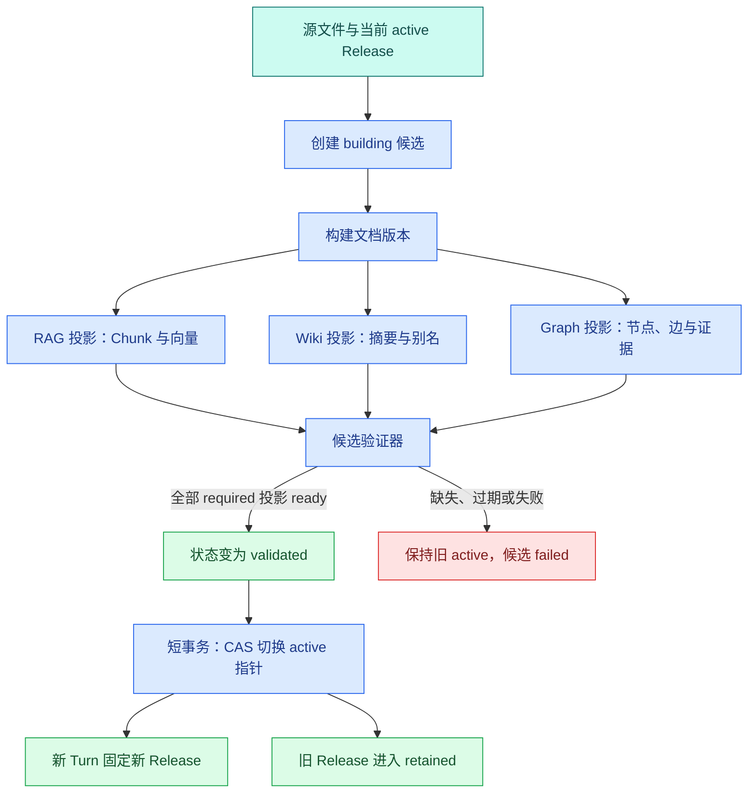

# 知识版本、候选索引与 Release：为什么不能边导入边上线

假设一份“访问手册”从 v7 更新到 v8，共有 80 个片段。Worker 已写入 v8 的标题和前 30 个向量，随后 Embedding 服务超时。如果在线检索按“文档 ID + 最新更新时间”查询，用户可能同时读到 v8 的标题、v7 的旧正文和 v8 的半份向量。

这不是回答模型的问题，而是发布边界错了。知识导入是长事务式工作，但数据库事务不适合跨越解析、OCR、模型调用和索引构建数分钟不提交。工程上需要把长时间的**候选构建**与短时间的**在线激活**分开。

导入流水线会产生一组经过解析、切片和向量化的**候选**数据。这里要解决的是发布边界：旧版本在候选构建期间继续服务，新版本只有全部投影验证通过后才原子上线，并能在质量回归时切回旧版本。

## 先分清四个容易混用的“版本”

### 源文件版本

源文件版本描述原始输入字节。相同文件名不代表相同内容，因此它至少绑定内容哈希、对象键、大小和采集时间。输入改变后必须产生新版本，不能覆盖旧对象后继续沿用旧哈希。

### 文档版本

文档版本是解析、清洗和切片后的逻辑快照。它记录解析器版本、切片器版本、Chunk 数、覆盖率和来源定位。相同源文件用新解析器重建，也应得到新的文档版本，因为可检索结构已经变化。

### 索引版本

**索引版本**描述某种搜索投影，例如全文索引、Embedding 模型 revision、向量维度、距离函数和 ANN 参数。文档文本没变，只替换 Embedding 模型时，文档版本可以复用，但索引版本必须变化。

### 知识 Release

**Release** 是面向在线查询的不可变快照，它把一组文档版本及其 RAG、Wiki、知识图谱等投影固定在一起。在线系统查询的是 Release ID，而不是“每张表里最新的一行”。

| 名称 | 主要回答 | 改变示例 | 是否直接在线 |
| --- | --- | --- | --- |
| 源文件版本 | 原始字节是什么 | 文件重新上传 | 否 |
| 文档版本 | 解析和切片结果是什么 | OCR/解析器/切片器变化 | 否 |
| 索引版本 | 怎样搜索这些片段 | Embedding 或索引参数变化 | 否 |
| Release | 本次回答允许看哪套完整知识 | 一组候选投影通过验证 | 是，**激活**后 |

只保留一个 `version` 字段会把这些变化混在一起：无法判断需要重解析、只重建向量，还是仅重新激活旧快照。

## 候选构建与在线读取怎样隔离

新 Release 开始时处于 `building`。导入 Worker 可以分批提交数据，但每一行都带候选 `release_id`，在线 Retriever 只查询当前 `active_release_id`。候选失败不会修改在线指针。



`R/W/G` 是独立投影。不是每个项目都需要 Wiki 和 Graph，因此 Release 还要记录哪些投影是 required，哪些是 optional。required 投影失败会阻止激活；optional 投影失败可以形成带明确降级标记的候选，但发布策略必须预先定义，不能临时由模型决定。

激活完成后，新建 Turn 读取新指针。已运行 Turn 继续使用创建时固定的旧 Release，避免一次回答前半段查 v7、后半段查 v8。

## 状态机不只需要 active 和 failed

一个实用状态集可以是：

| 状态 | 谁写入 | 允许动作 | 不允许动作 |
| --- | --- | --- | --- |
| `building` | 发布服务/Worker | 写候选投影、记录检查 | 在线查询、覆盖旧 Release |
| `validating` | 验证器 | 只读检查、写检查结果 | 新增未经登记的投影 |
| `validated` | 验证器 | 等待激活、重新检查过期条件 | 直接写候选内容 |
| `active` | 激活事务 | 为新 Turn 提供快照 | 原地修改内容 |
| `retained` | 激活事务 | 为旧 Turn/**回滚**保留 | 接收新流量 |
| `failed` | Worker/验证器 | 修复后创建新 attempt | 激活 |
| `superseded` | 发布服务 | 审计、按保留策略清理 | 再作为最新候选激活 |

`validated` 不能永久等待。若验证后源对象、ACL 快照或上游文档版本又改变，候选已经过期。激活事务要再次比较基线版本，防止旧候选覆盖更新的 Release，这就是 Compare-And-Swap（CAS）语义。

## 发布前到底验证什么

“Chunk 数量大于 0”远远不够。至少分五层检查。

### 输入完整性

源对象存在，大小和 SHA-256 与登记一致；所有计划文档都有确定终态；解析器没有把不支持格式静默当成空文件。

### 结构覆盖

标题、段落、列表、表格、代码和图片/OCR 页面有覆盖统计；稳定 ID 无重复；父子与相邻关系不悬空；引用位置可以回到源页或源段。

### 索引一致性

每个需要向量的 Chunk 恰好有一个当前模型 revision 的向量；维度一致；全文与结构化字段已写入；索引构建完成；候选精确扫描能找到标注样本。

### 权限与安全

文档、Chunk、Wiki、Graph Evidence 使用同一 ACL 快照；敏感扫描没有阻断项；指定范围检索不会回退到全库；候选缓存键包含 Release 和 Scope。

### 质量与可运维性

离线 RAG Eval 没有触发安全门禁，关键查询 Recall 不低于发布策略；候选可通过 Release ID 独立查询；旧 Release 和回滚指针仍存在；检查结果有规则版本与证据。

每条检查应记录 `check_name`、`status`、`actual`、`expected`、`evidence_location` 和 `checker_version`。只保存一个布尔 `validated=true`，以后无法解释当时为什么允许上线。

## 实现一个最小 Release 聚合

下面先在内存中表达状态语义。输入是 expected 投影与各投影结果；输出是明确的状态迁移。这个模型不替代数据库事务，但可以用于单元测试状态规则。

```python
# Release 聚合片段、向量和权限投影的计数；所有校验通过后才允许原子激活。
from __future__ import annotations

from dataclasses import dataclass, field
from enum import StrEnum


class ReleaseStatus(StrEnum):
    BUILDING = "building"
    VALIDATING = "validating"
    VALIDATED = "validated"
    ACTIVE = "active"
    RETAINED = "retained"
    FAILED = "failed"


class ProjectionStatus(StrEnum):
    PENDING = "pending"
    READY = "ready"
    FAILED = "failed"


@dataclass(frozen=True)
class Projection:
    name: str
    required: bool
    status: ProjectionStatus
    expected_items: int
    actual_items: int
    version: str

    def errors(self) -> list[str]:
        problems: list[str] = []
        # 先检查当前状态是否允许继续推进，避免终态被重复任务或迟到结果覆盖。
        if self.status is ProjectionStatus.FAILED:
            problems.append(f"{self.name}:failed")
        # 先检查当前状态是否允许继续推进，避免终态被重复任务或迟到结果覆盖。
        if self.status is ProjectionStatus.READY and self.actual_items != self.expected_items:
            problems.append(f"{self.name}:count_mismatch")
        if not self.version:
            problems.append(f"{self.name}:missing_version")
        return problems


@dataclass
class KnowledgeRelease:
    release_id: str
    base_release_id: str
    source_snapshot: str
    status: ReleaseStatus = ReleaseStatus.BUILDING
    projections: dict[str, Projection] = field(default_factory=dict)
    validation_errors: list[str] = field(default_factory=list)

    def register(self, projection: Projection) -> None:
        # 先检查当前状态是否允许继续推进，避免终态被重复任务或迟到结果覆盖。
        if self.status is not ReleaseStatus.BUILDING:
            raise ValueError("projections can only change while building")
        self.projections[projection.name] = projection

    # 校验函数在数据进入下一阶段前执行，失败时返回稳定错误或直接阻断。
    def validate(self, required_names: set[str]) -> None:
        if self.status is not ReleaseStatus.BUILDING:
            raise ValueError("only a building release can be validated")
        self.status = ReleaseStatus.VALIDATING

        missing = required_names - self.projections.keys()
        # 只保留 ERROR 与 CRITICAL 进入摘要，普通日志数量仍记录在 matched_count。
        errors = [f"{name}:missing" for name in sorted(missing)]
        for projection in self.projections.values():
            if projection.required or projection.name in required_names:
                errors.extend(projection.errors())

        self.validation_errors = errors
        self.status = ReleaseStatus.FAILED if errors else ReleaseStatus.VALIDATED


@dataclass
class ActivePointer:
    release_id: str
    source_snapshot: str

    def compare_and_swap(self, candidate: KnowledgeRelease) -> str:
        # 先检查当前状态是否允许继续推进，避免终态被重复任务或迟到结果覆盖。
        if candidate.status is not ReleaseStatus.VALIDATED:
            raise ValueError("candidate is not validated")
        if candidate.base_release_id != self.release_id:
            raise RuntimeError("candidate base release is stale")
        if candidate.source_snapshot != self.source_snapshot:
            raise RuntimeError("source changed after candidate creation")

        previous = self.release_id
        self.release_id = candidate.release_id
        candidate.status = ReleaseStatus.ACTIVE
        return previous
```

`Projection.errors` 把每个投影的失败、数量不一致和版本缺失转换为稳定错误码。`KnowledgeRelease.register` 只允许 building 阶段写投影，避免验证后继续变更候选。`validate` 先进入 validating，再检查 required 投影；存在错误就进入 failed，没有错误才进入 validated。

`ActivePointer.compare_and_swap` 模拟激活事务：候选必须从当前 active 构建，并且源快照在验证后没有变化。返回旧 Release ID，调用方可以把它标记为 retained。数据库实现应在同一个短事务里锁定知识空间记录、重复这些比较、切换指针和写审计事件。

## 用测试证明失败不会影响旧版本

测试会建立一个旧指针、一个完整候选和一个向量数量不一致的候选。观察点是：失败候选不能改变 active 指针，过期候选也不能覆盖新版本。

```python
# 测试让候选校验失败，并断言在线指针仍指向旧 Release，读请求不会看到半成品。
def ready(name: str, count: int, *, required: bool = True) -> Projection:
    return Projection(name, required, ProjectionStatus.READY, count, count, "v1")


# 这个用例走正常路径，并同时核对返回状态和关键业务字段。
def test_complete_candidate_activates_atomically() -> None:
    pointer = ActivePointer("release-7", "source-snapshot-8")
    candidate = KnowledgeRelease("release-8", "release-7", "source-snapshot-8")
    candidate.register(ready("rag", 80))
    candidate.register(ready("wiki", 1, required=False))
    candidate.validate({"rag"})

    previous = pointer.compare_and_swap(candidate)

    assert previous == "release-7"
    assert pointer.release_id == "release-8"
    assert candidate.status is ReleaseStatus.ACTIVE


# 这个用例固定版本快照，确认一次运行不会混用新旧知识、策略或模型配置。
def test_count_mismatch_keeps_old_release() -> None:
    pointer = ActivePointer("release-7", "source-snapshot-8")
    candidate = KnowledgeRelease("release-8", "release-7", "source-snapshot-8")
    candidate.register(
        Projection("rag", True, ProjectionStatus.READY, 80, 30, "v1")
    )
    candidate.validate({"rag"})

    assert candidate.status is ReleaseStatus.FAILED
    assert candidate.validation_errors == ["rag:count_mismatch"]
    assert pointer.release_id == "release-7"


# 这个用例删除硬约束或检查原记录，确认压缩验证失败不会覆盖原始上下文。
def test_stale_candidate_cannot_overwrite_new_active() -> None:
    pointer = ActivePointer("release-9", "source-snapshot-9")
    candidate = KnowledgeRelease("release-8", "release-7", "source-snapshot-8")
    candidate.register(ready("rag", 80))
    candidate.validate({"rag"})

    # 从这里进入可能失败的外部边界，下面只转换已经明确分类的异常。
    try:
        pointer.compare_and_swap(candidate)
    except RuntimeError as error:
        assert str(error) == "candidate base release is stale"
    else:
        raise AssertionError("stale candidate unexpectedly activated")
```

`ready` 只是测试数据工厂。第一条覆盖完整激活；第二条证明 30/80 的半成品进入 failed，旧指针仍是 v7；第三条模拟 v9 已先上线，基于 v7 创建的 v8 即使验证通过也会被 CAS 拒绝。运行 `python3 -m pytest -q` 应看到三条通过。三个测试的输入分别改变投影完整性和基线版本，输出不仅检查异常，还检查 active 指针没有被失败路径修改；数据库集成测试还要观察事务回滚后的状态与发布事件是否一致。

## 数据库激活事务应该有多短

解析和向量化发生在事务外，候选数据可以分批提交。激活事务只做四件事：

1. 锁定知识空间的发布指针；
2. 检查 candidate 状态、base Release 和源快照；
3. 把旧 active 标记为 retained，把指针切到 candidate；
4. 写一条不可变发布事件并提交。

不要在持有发布锁时调用 Embedding、重建 HNSW 或运行大规模 Eval。它们耗时不可控，会阻塞其他发布和在线管理操作。

查询端在 Turn 创建时读取并保存 Release ID。后续 Retriever、缓存、Evidence 和引用都携带它。这样激活发生在回答中途也不会改变本轮视图，这类似数据库中的快照读取，但 Release 是应用层显式快照。

## 回滚不是删除新索引

质量回归时，最快的恢复动作是把 active 指针切回仍被保留的旧 Release。回滚前仍要检查旧 Release 的对象、索引和 ACL 快照可用；回滚事务也要 CAS，防止覆盖另一个刚完成的发布。

新 Release 保持为 failed 或 quarantined，供离线分析。立刻删除会丢失证据，还可能误删正在被旧 Turn 引用的数据。清理任务只能删除超过保留期、没有活跃 Turn 引用、不是 active/rollback target，且对象与索引引用计数为零的版本。

### 排查“已发布但搜不到”

按数据流依次看：

1. 新 Turn 固定的 Release ID 是否真的是候选；
2. 候选包含目标文档版本吗；
3. RAG 投影检查是否 ready，Chunk/向量是否对账；
4. Retriever 查询是否带相同 Release 和 Scope；
5. 缓存键是否包含 Release，是否命中旧缓存；
6. 精确基线能否找到目标，ANN 是否漏召回；
7. 候选进入证据包后是否又被预算或验证器移除。

这条顺序能把发布、索引、过滤、缓存、召回和生成问题分开。

## 带到工作的 Release 状态表

为自己的系统填写：

```text
Release ID 与 base Release：
源快照/hash：
required 投影：
optional 投影及降级语义：
每个投影的 expected/actual/version/status：
解析与结构覆盖检查：
ACL 与敏感内容检查：
RAG Eval 门禁：
激活 CAS 条件：
Turn 固定 Release 的位置：
上一可回滚 Release：
清理保留期与引用判断：
```

完成这张状态表后，应能解释为什么“数据已经写入”不等于“知识已经上线”，也能画出 building、validated、active、retained 和 failed 之间的责任边界。

## 常见问题

### 文档版本和知识 Release 有什么区别？

文档版本描述单个来源内容的一次变化，知识 Release 是在线查询使用的一整套一致快照，可能包含许多文档版本、Chunk、向量、图谱、别名和 ACL 投影。更新一个文档会产生候选文档版本，但只有这些投影全部对账并激活后，才进入新 Release。把两者混用会让一次查询看到新正文配旧向量，或新图谱配旧**权限**，最终无法复现答案来自哪个知识状态。

### 为什么激活操作要短而原子？

耗时解析与索引不应放在激活事务中，它们在 building 阶段完成。激活只重新确认候选仍为 validated、当前 active 仍是预期 base，然后用 CAS 更新指针并记录事件。事务越短，锁竞争和失败窗口越小；CAS 还能阻止两个候选互相覆盖。若激活时还在复制向量或扫描全文，一旦中途失败就可能产生部分可见状态，也会拖慢所有在线读请求。

### 一个 Turn 为什么要固定 Release，而不是每次检索读取最新版本？

一次回答可能进行多轮改写、检索和验证。如果每个步骤都读取当前 active，发布切换发生在中途时，同一答案会混用两个版本，引用也无法复查。Turn 在准入时保存 Release ID，后续所有检索、缓存和证据查询都使用该快照。新 Turn 可以看到新版本，旧 Turn 继续完成或按策略取消。版本固定不是长期锁住数据库，而是把读取条件变成明确字段。

### 回滚为什么不是删除新 Release？

回滚的首要动作是把 active 指针切回已验证的 retained 版本，并让新 Turn 使用旧快照。失败版本仍应保留状态、评测结果和构建证据，便于诊断；已经固定到该版本的 Turn 也可能需要查询最终结果。确认无引用并经过保留期后再清理投影。直接删除会破坏正在运行的请求和审计链，也让团队失去解释质量回归的证据。

### “发布成功但搜不到”应该先查什么？

先确认 Turn 固定的 Release ID 是否真是目标版本，再看候选是否包含文档版本、各投影状态与计数是否 ready。随后检查 Retriever 是否同时带相同 Release 与 Scope、缓存键是否错误命中旧版本，最后比较精确基线与 ANN。这个顺序从发布、投影、过滤、缓存到召回逐层缩小范围；一开始就调 HNSW 参数，可能掩盖真正的版本或权限条件缺失。
