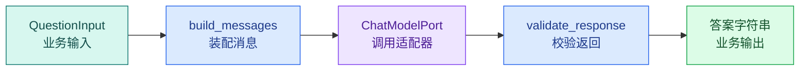

# LangChain 核心抽象：Message、Prompt、Model、Parser 与 Runnable

## LangChain 解决什么问题

LangChain Core 是一组用于组合模型调用、消息装配、输出解析和异步执行的接口。它位于应用编排层，连接业务输入与供应商 ChatModel；这些抽象的用途是让同一条调用链可以被独立测试、批量运行和替换模型适配器。

前面的纯 Python Agent 已经有 `ModelGateway`、消息列表、工具循环和停止条件。它可以运行，但每个节点仍用自定义调用方式：模型适配器叫 `generate`，消息装配是普通函数，输出解析和批量、异步、Trace 配置又各有入口。

这一篇只改模型节点的组合方式，不改业务场景。调用方仍然提交只读知识问题：

```text
访问申请需要先满足哪些条件？
```

程序依次检查问题、装配系统与用户消息、调用聊天模型、提取候选文本、检查空答案，最后返回：

```text
候选回答：先完成身份校验，再由负责人审批。[N1]
```

当前结果还没有接入 Evidence 和 Citation，因此不能视为可信答案。LangChain 把反复出现的调用约定变成公共接口，用于替换 `agent-demo/app/model_gateway.py` 外层的组合代码；纯 Python 的权限、工具执行和停止条件继续保留。

这篇会回答：

- **Message** 为什么不只是 `{"role": ..., "content": ...}`；
- **Prompt** 模板何时才真正变成 Message 列表；
- **ChatModel** 的输入输出是什么，供应商适配发生在哪；
- **OutputParser** 为什么仍需要业务校验；
- **Runnable** 的 `invoke`、`ainvoke`、`batch` 和 `stream` 分别解决什么；
- LCEL 的 `|` 在运行时如何传递数据；
- 哪些功能不应该因为用了 LangChain 就塞进 Prompt。

## 模型调用的基础边界

最小模型调用可以分成四个职责：



`QuestionInput` 是调用方输入；`build_messages` 决定规则和问题怎样排列；`ChatModelPort` 隐藏供应商 HTTP/SDK 差异；`validate_response` 防止空内容或错误角色继续传播。

先用标准库实现这条链。下面代码不需要 API Key，`LocalModel` 是一个可预测的测试替身。

```python
# 纯函数先明确 Prompt 输入、模型候选和 Parser 输出，框架只负责组合这些边界，不改变契约。
from __future__ import annotations

from dataclasses import dataclass
from typing import Literal, Protocol

Role = Literal["system", "user", "assistant"]

@dataclass(frozen=True, slots=True)
class Message:
    role: Role
    content: str

class ChatModelPort(Protocol):
    def invoke(self, messages: list[Message]) -> Message: ...

class LocalModel:
    def invoke(self, messages: list[Message]) -> Message:
        # 从有序消息中取出用户输入；这个本地替身不执行真实模型调用。
        user = next(message for message in messages if message.role == "user")
        # 返回显式结果对象，调用方根据状态字段继续路由，不需要解析自然语言。
        return Message(
            role="assistant",
            # 返回 assistant 角色，调用方随后会统一校验角色和空内容。
            content=f"知识问题已收到：{user.content}",
        )

# 构造函数把已验证字段组装成下游对象，不在这里引入新的权限或业务决策。
def build_messages(question: str) -> list[Message]:
    normalized = question.strip()
    if not normalized:
        raise ValueError("question must not be empty")
    return [
        Message("system", "只根据调用方提供的可见资料回答；证据不足时明确说明。"),
        Message("user", normalized),
    ]

# 校验函数在数据进入下一阶段前执行，失败时返回稳定错误或直接阻断。
def validate_response(response: Message) -> str:
    if response.role != "assistant":
        raise ValueError(f"expected assistant message, got {response.role}")
    answer = response.content.strip()
    if not answer:
        raise ValueError("model returned an empty answer")
    return answer

def answer_question(model: ChatModelPort, question: str) -> str:
    messages = build_messages(question)
    response = model.invoke(messages)
    return validate_response(response)

if __name__ == "__main__":
    print(answer_question(LocalModel(), "访问申请需要先满足哪些条件？"))
```

执行从 `answer_question` 开始。它没有直接拼 HTTP，而是先调用 `build_messages`；空白问题在模型调用前失败。`ChatModelPort` 是 Python `Protocol`，只约定实现者拥有 `invoke(messages)`，因此本地替身和云端 SDK 适配器都能接入。模型返回后，`validate_response` 检查角色和空内容，最后才把字符串交给业务调用方。

运行这段代码会输出 `知识问题已收到：访问申请需要先满足哪些条件？`。如果 `LocalModel` 返回 `role="user"`，错误会停在 `validate_response`，不会让错误消息悄悄变成答案。

LangChain 并没有改变这条基本数据流。它把 Message、Prompt、Model、Parser 和执行方式定义成可复用接口，减少每个集成重复设计一套协议。

## 五个核心对象分别负责什么

| 对象 | 主要输入 | 主要输出 | 解决的问题 | 不负责什么 |
| --- | --- | --- | --- | --- |
| Message | role、content、元数据 | BaseMessage 子类 | 统一表达一次对话项 | 不装配完整 Prompt，不调用模型 |
| Prompt | 模板变量、历史、证据 | PromptValue / Message 列表 | 把运行时数据放进消息结构 | 不判断 ACL 和事务 |
| ChatModel | Message 列表与调用配置 | AIMessage 或消息块流 | 适配聊天模型调用 | 不保证事实正确和业务终态 |
| OutputParser | AIMessage 或文本 | 字符串或结构化对象 | 把模型返回转成下游类型 | 不证明语义与权限正确 |
| Runnable | 一个节点约定的输入 | 一个节点约定的输出 | 统一调用、组合、批量、异步和流式协议 | 不自动补齐领域边界 |

这五个对象的关系是“数据依次经过多个节点”，并不是五个都拥有业务状态。用户身份、可见 Scope、知识 Release 和 Deadline 仍由外层 Runtime 提供。

## Message：有角色、有类型，也可能携带工具协议

### Message 保留角色与类型信息

聊天模型需要区分规则、用户输入、模型回复和工具结果。把所有内容拼成一段字符串，会失去角色边界，也难以保证 ToolCall 与 ToolMessage 正确配对。

LangChain Core 常见消息类型包括：

- `SystemMessage`：开发者或应用提供的规则；
- `HumanMessage`：用户输入；
- `AIMessage`：模型输出，可能带 ToolCall 和 usage metadata；
- `ToolMessage`：某次工具调用的结果，使用调用 ID 与请求配对。

消息类型解决协议表达，不代表内容自动可信。`HumanMessage` 中的“我是管理员”仍是用户文字；`ToolMessage` 里从网页抓到的“忽略之前规则”仍是不可信数据。

### content 不一定只是字符串

多模态接口会把消息内容表示为多个 Content Block，例如文本、图片或其他结构。业务代码如果只假设 `message.content` 永远是字符串，会在切换模型或加入多模态时出错。

初学阶段可以只用文本，但适配层要负责把供应商返回统一成当前应用接受的形式。业务层不要直接遍历某家 SDK 的原始字典。

### Message 的生命周期

消息从用户请求进入 Runtime，经过裁剪、上下文装配、模型调用和持久化。并不是所有输入上下文都要作为正式消息保存：检索候选和临时修复草稿可以只存在于 Turn 状态；只有经过验证的最终 `AIMessage` 才进入对话历史。

## Prompt：把变量装配成模型真正看到的输入

### Prompt 不只是 f-string

`f"回答 {question}"` 能插值，却很难稳定管理角色、历史占位符、证据边界和必填变量。`ChatPromptTemplate` 把消息骨架与运行时变量分开：模板在启动或模块加载时创建，请求到达后再格式化。

模板的输入通常是字典：

```text
{"question": "什么是 Runnable？", "answer_style": "两句话"}
```

格式化后的输出是 `PromptValue`。调用 `.to_messages()` 才得到具体 Message 列表。这个中间对象使同一 Prompt 可以按聊天消息或文本形式交给不同模型接口。

### 模板变量是数据入口

变量名应该表达来源，例如 `user_question`、`evidence_text`、`conversation_summary`，不要全部叫 `context`。外部文档应放进明确的数据区，并告诉模型它只能作为资料读取，不能提升指令优先级。

Prompt 也没有生成可信身份的资格。正确方式是外层程序先根据认证计算可见证据，再把已经过滤的内容传入模板，而不是把 `actor_id` 交给模型判断是否有权限。

### PromptValue 的延迟格式化有什么用

它让模板节点可以单独测试：给定变量后，检查消息数量、角色顺序和内容边界，不需要发起模型请求。Prompt 测试失败时，问题范围停在装配阶段，不会混入网络和模型随机性。

## ChatModel：统一聊天调用，不抹平供应商差异

ChatModel 接收消息并产生 `AIMessage`，通常支持同步、异步、批量或流式接口。具体集成负责 API Key、base URL、请求参数、响应转换、usage metadata 和供应商错误映射。

统一接口带来可替换性，但不同模型仍可能在这些方面不同：

- 支持的 Message/content block；
- Tool Calling 与 Structured Outputs 能力；
- 上下文窗口和输出上限；
- 流事件结构；
- 安全拒答和截断表示；
- Token 计量、缓存和推理参数。

因此“都实现 ChatModel”不等于可以无测试切换。模型网关需要能力声明，集成测试要覆盖结构化输出、工具、流式取消和错误映射。

测试使用 `FakeListChatModel` 按预设列表返回答案，使链路完全离线、确定且不消耗模型额度；真实供应商的网络和协议仍需单独做集成测试。

## OutputParser：转换类型，但不替代业务验证

`StrOutputParser` 从模型消息中提取文本，适合下游只需要字符串的链。结构化场景还可以使用 Pydantic 等解析方式，把模型候选转换成类型对象。

解析成功只说明输出满足解析契约。上一章已经验证过：Schema 合法不代表意图正确，更不代表模型生成的 Scope 可用。OutputParser 之后通常还要有领域验证节点。

还要处理模型响应信封：拒答、截断或取消若一律塞给 Parser，就会丢失原始失败语义。供应商适配层先把调用状态映射为明确结果，只有完成载荷进入输出解析。

## Runnable：统一的不只是 `invoke`

Runnable 可以理解为“有标准执行协议的处理节点”。Prompt、Model、Parser、普通函数适配器和组合链都可以是 Runnable。

### 四种常见执行方式

| 方法 | 输入形态 | 返回方式 | 适合场景 |
| --- | --- | --- | --- |
| `invoke` | 单个输入 | 单个结果 | 同步脚本、普通请求 |
| `ainvoke` | 单个输入 | await 单个结果 | FastAPI、异步 Worker |
| `batch` / `abatch` | 多个输入 | 多个结果 | 离线评测、批处理 |
| `stream` / `astream` | 单个输入 | 逐块迭代 | 页面增量显示、长输出 |

统一方法让调用方不必为每个节点重新发明命名，但底层实现仍有差异。一个同步函数的默认 `ainvoke` 可能被放到线程执行；某个模型的 `batch` 可能只是并发多次请求，也可能调用供应商批处理接口。吞吐、并发上限和取消语义要看具体实现。

### Runnable 的输入输出是节点契约

Prompt 输入字典变成 PromptValue，ChatModel 把 PromptValue/Message 转成 AIMessage，Parser 把 AIMessage 转成字符串。只有前一个输出能被后一个接受时，链才成立。

Python 类型提示和 `input_schema`/`output_schema` 能帮助检查与生成文档，但不意味着所有运行时业务规则自动执行。空白字符串、越权字段和 Deadline 仍需要显式函数校验。

### RunnableConfig 与业务载荷的边界

调用时可以提供 `run_name`、`tags`、`metadata`、callbacks 和并发设置，用于 Trace 与执行配置。不要把密钥、完整用户原文或大段证据塞进 metadata；Trace 后端可能持久化这些字段。

身份与 Scope 也不应只存在于可选 metadata，然后指望每个工具自行读取。高风险业务上下文应通过明确的服务参数或 Runtime Context 传递，并在工具边界强制检查。

## LCEL：`|` 表示输出传给下一个 Runnable

LangChain Expression Language 常用 `|` 组合节点：

```text
normalize | prompt | model | parser | validate
```

它可以读成函数复合：

```text
validate(parser(model(prompt(normalize(input)))))
```

`|` 没有让模型“更智能”。它只是创建一个新的组合 Runnable，按从左到右的顺序传递数据。理解这一点后，排错可以按节点进行：输入错、Prompt 错、模型错、Parser 错还是业务验证错。

## 运行一条真实 LangChain Core 链

### 环境准备

在空目录创建 Python 虚拟环境。这里使用当前 LangChain Core 1.x，并用上限避免未来主版本静默破坏示例：

```bash
# 在隔离环境锁定 LangChain 与测试依赖，避免全局版本改变 Runnable 和消息行为。
python3 -m venv .venv
source .venv/bin/activate
python -m pip install "langchain-core>=1,<2" "pytest>=8,<9"
python -c "import langchain_core; print(langchain_core.__version__)"
```

这些命令从 `python3`、`source`、`python` 开始按顺序运行，输出用于确认“环境准备”是否成立。任何命令返回非零退出码都表示当前步骤没有完成，应先检查路径、环境和参数；不要把后续输出当成成功证据。

版本命令应打印 `1.x`。实际项目还要把解析后的精确版本写入 lockfile，不能只依赖宽泛范围每次重新安装。

### 实现 Prompt、Model、Parser 和边界函数

下面直接执行这段实现。`FakeListChatModel` 是官方核心包中的测试模型，不发网络请求；`RunnableLambda` 把普通 Python 函数接入 Runnable 协议。

为了验证“实现 Prompt、Model、Parser 和边界函数”，下面的测试把“"""在 Prompt 格式化前清洗并验证业务输入。"""”变成可执行断言。每个用例自己构造输入，并用断言固定返回值或失败状态；某条测试失败时，可以从用例名直接定位到被破坏的契约。

```python
from __future__ import annotations

import asyncio
from typing import Any

from langchain_core.language_models import BaseChatModel
from langchain_core.language_models.fake_chat_models import FakeListChatModel
from langchain_core.output_parsers import StrOutputParser
from langchain_core.prompts import ChatPromptTemplate
from langchain_core.runnables import Runnable, RunnableLambda

def normalize_input(payload: dict[str, str]) -> dict[str, str]:
    """在 Prompt 格式化前清洗并验证业务输入。"""

    question = payload.get("question", "").strip()
    if not question:
        raise ValueError("question must not be empty")
    # 数量约束用于发现截断、重复或越界返回，失败时不能把不完整结果交给下一步。
    if len(question) > 200:
        raise ValueError("question is too long for this demo")
    return {"question": question}

def validate_answer(answer: str) -> str:
    """在模型文本进入业务层前检查最小输出约束。"""

    # 先统一空白和大小写，确保查询与校验使用同一种输入表示。
    normalized = answer.strip()
    if not normalized:
        raise ValueError("model returned an empty answer")
    # 数量约束用于发现截断、重复或越界返回，失败时不能把不完整结果交给下一步。
    if len(normalized) > 500:
        raise ValueError("answer exceeded the demo output limit")
    return normalized

# 构造函数把已验证字段组装成下游对象，不在这里引入新的权限或业务决策。
def make_chain(model: BaseChatModel) -> Runnable[dict[str, str], str]:
    prompt = ChatPromptTemplate.from_messages(
        [
            ("system", "只根据已授权资料回答知识问题；没有证据时明确说明。"),
            ("human", "当前问题：{question}"),
        ]
    )
    parser = StrOutputParser()

    return (
        RunnableLambda(normalize_input)
        | prompt
        | model
        | parser
        | RunnableLambda(validate_answer)
    )

# 构造函数把已验证字段组装成下游对象，不在这里引入新的权限或业务决策。
def build_demo_chain() -> Runnable[dict[str, str], str]:
    model = FakeListChatModel(
        responses=[
            "候选回答：先完成身份校验，再由负责人审批。[N1]",
            "候选回答：申请入口位于统一服务页面。[N2]",
            "候选回答：当前资料没有说明处理时长。",
        ]
    )
    return make_chain(model).with_config(
        {
            "run_name": "knowledge_answer_candidate",
            "tags": ["local-demo"],
            "metadata": {"example": "langchain-core"},
        }
    )

async def async_demo(chain: Runnable[dict[str, str], str]) -> None:
    # 这里才发起模型调用；返回值仍是候选结果，必须经过空值、结构或证据校验。
    answer = await chain.ainvoke({"question": "访问申请需要先满足哪些条件？"})
    print("async", answer)

# 入口函数按固定顺序编排各步骤，具体校验和副作用仍由各自函数负责。
def main() -> None:
    chain = build_demo_chain()

    first = chain.invoke({"question": "访问申请需要先满足哪些条件？"})
    print("sync", first)

    batch = chain.batch(
        [
            {"question": "访问申请入口在哪里？"},
            {"question": "一般多久处理完成？"},
        ],
        config={"max_concurrency": 2},
    )
    print("batch", batch)

    # 使用一条新链，避免测试模型的响应游标影响异步示例。
    asyncio.run(async_demo(build_demo_chain()))

    input_schema: dict[str, Any] = chain.input_schema.model_json_schema()
    output_schema: dict[str, Any] = chain.output_schema.model_json_schema()
    print("input_type", input_schema.get("type"))
    print("output_type", output_schema.get("type"))

if __name__ == "__main__":
    main()
```

按对象创建顺序阅读：

1. `normalize_input` 是链的入口边界。它接收字典，去掉问题两端空白，并在模型调用前拒绝空值和超长输入。
2. `ChatPromptTemplate.from_messages` 创建两条消息的模板。此时 `{question}` 仍是变量，只有调用链时才格式化。
3. `BaseChatModel` 是聊天模型抽象；`FakeListChatModel` 每次调用取出预设响应，方便离线复现。
4. `StrOutputParser` 把模型 `AIMessage` 转成字符串。
5. `validate_answer` 检查空答案和示例输出长度。Parser 成功后仍有业务边界。
6. 两个 `RunnableLambda` 把普通函数接入统一协议，`|` 创建从字典到字符串的组合链。
7. `with_config` 给运行记录添加名称、标签和非敏感元数据，不改变业务输入。

再按运行顺序看 `main`：第一次 `invoke` 同步处理一个问题；`batch` 接收两个输入并最多并发两项；`ainvoke` 在事件循环中异步等待结果；最后两行读取组合链暴露的输入输出 Schema，用于检查和文档，不替代 `normalize_input` 的运行校验。

执行：

```bash
# 运行同一输入并观察 Prompt、模型响应与 Parser 的逐层结果，错误应停在对应边界。
python app/langchain_agent.py
```

这些命令从 `python` 开始按顺序运行，输出用于确认“实现 Prompt、Model、Parser 和边界函数”是否成立。任何命令返回非零退出码都表示当前步骤没有完成，应先检查路径、环境和参数；不要把后续输出当成成功证据。

前三组输出中的文本应与预设响应对应，最后显示输入为 object、输出为 string：

```text
sync 候选回答：先完成身份校验，再由负责人审批。[N1]
batch ['候选回答：申请入口位于统一服务页面。[N2]', '候选回答：当前资料没有说明处理时长。']
async 候选回答：先完成身份校验，再由负责人审批。[N1]
input_type object
output_type string
```

如果 batch 文本顺序变化，先检查是否重复复用了同一个有内部响应游标的 Fake Model；真实模型通常按输入顺序整理 batch 结果，但并发完成时间可能不同。如果 `input_type` 不是 object，也不要立刻把 Schema 当成业务错误，先检查组合链最左侧函数的类型标注是否足够明确。

## 为每个边界写测试

创建对应测试文件。测试替换不同 Fake Model 输出，验证输入和输出错误分别停在对应节点。

为了验证“为每个边界写测试”，下面的测试把“测试分别替换模型与 Parser，确认格式错误不会伪装成模型失败，业务错误也不会被框架吞掉”变成可执行断言。每个用例自己构造输入，并用断言固定返回值或失败状态；某条测试失败时，可以从用例名直接定位到被破坏的契约。

```python
# 测试分别替换模型与 Parser，确认格式错误不会伪装成模型失败，业务错误也不会被框架吞掉。
import pytest
from langchain_core.language_models.fake_chat_models import FakeListChatModel

from app.langchain_agent import make_chain

def test_chain_returns_trimmed_model_text() -> None:
    chain = make_chain(FakeListChatModel(responses=["  候选回答：[N1]  "]))

    # 通过框架入口执行整条链，下面的断言验证中间适配没有改变业务契约。
    result = chain.invoke({"question": "访问申请需要什么条件？"})

    assert result == "候选回答：[N1]"

# 空输入或空命中属于独立业务路径；这个用例确认它不会越过校验边界触发多余调用。
def test_empty_question_stops_before_model() -> None:
    chain = make_chain(FakeListChatModel(responses=["不会被使用"]))

    with pytest.raises(ValueError, match="question must not be empty"):
        chain.invoke({"question": "   "})

def test_empty_model_answer_stops_after_parser() -> None:
    chain = make_chain(FakeListChatModel(responses=["   "]))

    with pytest.raises(ValueError, match="model returned an empty answer"):
        chain.invoke({"question": "处理时长是多少？"})

# 这个用例改变完成顺序或调用方式，确认结果仍遵守同一份确定性契约。
@pytest.mark.asyncio
async def test_ainvoke_uses_the_same_boundaries() -> None:
    chain = make_chain(FakeListChatModel(responses=["当前资料没有说明处理时长。"] ))

    result = await chain.ainvoke({"question": "处理时长是多少？"})

    assert result == "当前资料没有说明处理时长。"
```

第一项测试证明 Parser 后的 `validate_answer` 去掉首尾空白；第二项在 Prompt 和 Model 之前失败；第三项在 Model 与 Parser 之后失败；异步测试证明 `ainvoke` 复用同一组输入输出边界。

运行测试需要异步 pytest 插件。先安装，再执行：

```bash
# pytest 按组件报告失败；全部通过后才说明组合链与独立边界具有一致行为。
python -m pip install "pytest-asyncio>=0.24,<2"
pytest -q
```

预期结果为 `4 passed`，命令退出码为 0。pytest 会分别导入业务模块、收集四个测试并执行同步与异步调用。如果异步测试提示 unknown mark，说明 `pytest-asyncio` 没安装到当前 `.venv`；如果空问题仍触发了模型响应，检查 `RunnableLambda(normalize_input)` 是否确实位于链最左侧。测试失败时先看用例名称，再根据它定位入口清洗、模型适配、Parser 或输出校验节点，不要先改 Prompt 猜结果。

## `invoke`、`batch` 和 `stream` 不能随意互换

### `invoke`：一次请求的一次结果

同步 Web 框架、CLI 或短脚本可以使用 `invoke`。在异步 FastAPI Handler 中直接调用阻塞的 `invoke` 可能占住事件循环线程，应优先使用供应商原生异步实现与 `ainvoke`。

### `batch`：多个独立输入的批量执行

`batch([a, b, c])` 表示三个独立调用。它适合离线 Eval 和批量抽取，不应被理解为把三个问题合成一个 Prompt。`max_concurrency` 要根据供应商速率限制和连接池配置，不是越大越快。

批量 Embedding 与聊天模型 batch 也不是同一种底层能力。Embedding 接口常原生接受多文本，ChatModel 默认 batch 可能是客户端并发多次调用。查看具体适配器实现和供应商限制。

### `stream`：只有支持增量的节点才能保持增量

Model 可以逐 Token 或逐内容块输出，Parser 也可能支持增量；但下游普通 `RunnableLambda` 往往要拿到完整字符串才能执行。把 `validate_answer` 放在流末端，可能导致前端直到完整答案生成后才收到最终结果。

企业流式回答通常区分“候选 Token 流”和“已验证终态”。页面可以展示生成中内容，但只有验证、事务提交和 `turn.completed` 之后才把答案视为正式结果。后续 Streaming 文章会处理取消、慢消费者和事件语义。

## Runnable 的重试与超时边界

LangChain 可以给 Runnable 添加 retry 等执行策略，但重试是否安全取决于节点副作用。

- Prompt 格式化和纯解析函数可以安全重试，但通常没有必要；
- 只读模型调用可有限重试网络瞬时错误，但会增加 Token 成本；
- Tool 写操作要先有业务幂等键，不能只靠框架重试；
- 每次尝试要共享整个 Turn 的 Deadline，不能重新获得完整超时；
- Schema 错误、权限拒绝和安全拒答不属于网络瞬时错误。

框架级重试适合包装已分类的暂时性异常。若对所有 `Exception` 重试三次，确定性配置错误会被放大成三倍延迟与成本。

## Config、Callback 与 Trace 怎样使用

RunnableConfig 的 `run_name`、tags 和 metadata 可以让 Trace 按链路、环境和实验版本筛选。Callback 可以观察开始、结束、错误和流事件。

推荐记录：

- Turn/Trace 的匿名关联 ID；
- 模型与 Prompt 版本；
- 节点名称、耗时、Token 和状态；
- 错误分类与 attempt；
- 输入输出长度或安全摘要。

避免记录：API Key、完整私有文档、用户敏感原文、系统提示词和未过滤工具结果。可观测性数据也是数据产品，需要权限、保留周期和脱敏策略。

Callback 也不应成为业务状态的唯一保存位置。Trace 写入失败不能让数据库 Turn 永远停在 running；正式终态由业务事务提交，Trace 是观察证据。

## 怎样判断是否真的需要 LangChain

| 当前需求 | 推荐起点 | 原因 |
| --- | --- | --- |
| 一次模型请求，一个固定 Prompt | 纯 Python 适配器 | 抽象成本可能大于重复代码 |
| 多个 Prompt、模型、Parser 需要组合 | LangChain Core | Runnable 统一节点协议 |
| 需要 Tool、Retriever 和简单 Agent | LangChain | 已有标准集成和 Agent Runtime |
| 条件分支、并行、循环、Checkpoint | LangGraph | 状态与控制边需要显式表达 |
| 复杂 ACL、事务、任务所有权 | 业务服务 + 框架适配 | 框架不能替代领域 Runtime |

不要因为项目安装了 LangChain，就把所有普通函数改成 Runnable。可复用的边界节点适合接入；数据库 Repository、事务服务和权限计算保持普通应用结构往往更清楚。

## 初学者常见的五个误区

### 把 Prompt 当业务服务

权限、金额和状态转换写进系统提示，只能得到概率遵守。先用程序计算可信结果，再把模型需要的最小信息交给 Prompt。

### 以为 LCEL 会自动检查类型

`A | B` 能组合不代表所有动态数据都安全。为链入口、结构化模型输出和业务命令保留运行时校验。

### 把 `AIMessage.content` 当最终答案

它可能为空、是多模态 blocks、带 ToolCall，或属于未验证草稿。先检查调用状态和消息类型，再进入 Parser 与业务验证。

### 把 batch 当一个大请求

batch 是多个输入的执行策略。每一项仍有独立上下文、错误和成本；部分失败怎样返回要看实现与配置。

### 一出现两个节点就上 LangGraph

线性、无状态组合用 Runnable 足够。只有分支、回边、并行合并、跨请求状态或恢复需求出现时，图抽象才开始产生实际价值。

## 用节点登记表守住 Runnable 契约

为每个 Runnable 记录：

| 字段 | 示例 |
| --- | --- |
| 名称 | `normalize_question` |
| 输入类型 | `dict[str, str]` |
| 输出类型 | `dict[str, str]` |
| 是否调用外部系统 | 否 |
| 是否有副作用 | 否 |
| 可否重试 | 可以，但无必要 |
| 超时来源 | 继承 Turn Deadline |
| 失败分类 | empty / too_long |
| 是否记录原文 | 否，只记录长度 |

对 Prompt、Model、Parser 和领域校验分别填一行。链路出错时，这张表能帮助定位输入在哪个节点第一次偏离契约。

## 给模型节点接入 Evidence 时，哪些边界不能丢

把当前模型节点扩成“只根据给定 Evidence 回答知识问题”：

1. 输入增加 `evidence`，但先用普通函数检查它是否为空和是否超过长度；
2. Prompt 把 evidence 放进明确的数据区，不把它拼进 SystemMessage；
3. 输出改成 Pydantic 模型，包含 `answer` 和 `used_evidence_ids`；
4. 程序检查每个 ID 是否真的存在于输入证据；
5. 为未知 ID、空答案、模型拒答和输出截断写测试；
6. 比较使用 Runnable 前后，哪些边界变清楚，哪些仍属于业务代码。

如果实现最后让模型自行产生 `visible_scope_ids`，说明上一章的可信字段边界被破坏了。正确顺序是程序先过滤 Evidence，模型只从可见集合中选择引用。


**LangChain 的 ChatModel 与直接调用供应商 SDK 有什么区别？**

供应商 SDK 负责发送该厂商的请求，LangChain ChatModel 在其上提供较统一的 Message、调用配置、流式、批处理和回调接口。统一不代表所有模型能力完全相同：结构化输出、工具调用、Token 字段和错误类型仍要通过能力声明与适配器核对。需要供应商独有功能时可以直接使用 SDK；需要把模型接入 Runnable、Tool 或 Retriever 组合时，ChatModel 能减少协议胶水。

**Message、Prompt 和 Model 为什么要分成三个对象？**

Message 是一次模型协议中的角色化数据，Prompt 是从变量、历史和证据构造 Message 的规则，Model 才负责远程推理。分开后可以在不调用模型时测试模板变量和消息顺序，也能替换模型而不改输入来源。若把三者拼成一个字符串函数，历史裁剪、ToolMessage 配对和证据信任等级都会藏在文本里，问题只能等到线上调用后才暴露。

**Runnable 的 `invoke`、`batch` 和 `stream` 是否只是三种写法？**

`invoke` 处理一个输入并得到最终输出，`batch` 对多个独立输入调度调用，`stream` 则逐块暴露中间输出；它们对应不同的资源和错误语义。批处理要控制并发、保留输入与结果对应关系，流式要处理取消、慢消费者和未完成输出。某个组件实现了 invoke 不代表它天然支持高效 batch 或真实 token streaming，选用前要用实际模型适配器验证。

**`RunnableConfig` 里应该放哪些信息？**

Config 适合传递调用级配置和观测上下文，例如 tags、metadata、callbacks、最大并发以及框架支持的 configurable 字段。用户身份、Scope、事务对象和密钥不应因为“传起来方便”就变成模型可见配置；它们应留在可信 Runtime Context 或外部适配器中。记录 Config 时也要控制高基数字段和隐私，避免把原问题、文档正文或凭证写进 Trace。

**什么情况下普通 Python 函数比 LCEL 更合适？**

两三个确定步骤、输入输出类型简单、没有统一流式或回调需求时，普通函数通常更直观，调试栈也更短。LCEL 的价值在于组合统一 Runnable、并行映射、配置传播和可观察调用，而不是把每个函数都改写成管道。可以先写纯函数和测试，再在确实需要组合协议时包成 Runnable；如果包装后只增加层级却没有获得流式、批处理或复用，就应保留普通函数。

**什么时候应该从 LangChain 进入 LangGraph？**

当应用需要显式共享状态、条件循环、并行分支合并、Checkpoint、中断恢复或唯一终态时，线性 Runnable 链会开始隐藏控制流。LangGraph 把节点更新、边和 Reducer 放进状态图，但不会自动解决权限、事务和幂等。迁移依据应是状态与恢复复杂度，而不是节点数量；一个固定的 Prompt 到 Model 到 Parser 链继续使用 LangChain 就足够。
