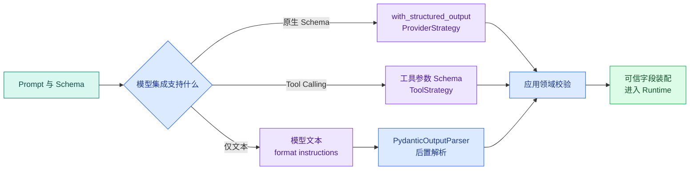

# LangChain 结构化输出：原生约束、Pydantic 解析与有限修复

通用结构化输出文章已经回答“格式合法为什么仍不等于业务可信”。这一篇聚焦 LangChain：当 Prompt、ChatModel 和 Parser 已经接成 Runnable 后，结构化对象究竟在哪一步产生？

假设 Planner 要返回一个 SearchPlan。它的输入是一条自然语言问题，输出不是最终答案，而是一份交给检索执行器的候选计划。执行器会读取 `objective` 了解本轮目标，遍历 `branches` 发起多路检索，再用 `max_research_rounds` 和 `evidence_budget` 限制循环次数与最多保留的证据数量。

先观察一份合法结果。这里暂时不讨论模型怎样生成它，只看 Parser 即将收到的原始 JSON，以及每个字段会怎样影响下游执行：

```jsonc
{
  "objective": "找到访问申请入口和前置条件",
  "branches": [
    {
      "branch_id": "entry",
      "channel": "fulltext",
      // query 是模型可提供的业务输入，长度和空白仍由 Server Schema 校验。
      "query": "访问申请入口",
      "top_k": 8
    },
    {
      "branch_id": "requirements",
      "channel": "vector",
      // query 是模型可提供的业务输入，长度和空白仍由 Server Schema 校验。
      "query": "申请系统访问前需要满足什么条件",
      "top_k": 8
    }
  ],
  "max_research_rounds": 1,
  "evidence_budget": 12
}
```

这个对象将决定检索分支、查询和资源预算，因此需要比“能解析 JSON”更严格的边界。模型可以提出 query 和 channel，服务端仍掌握 actor、Scope、Release、Deadline 和允许的 channel 白名单。

本篇最终实现一个离线解析器：**Pydantic** 检查嵌套字段、枚举、范围、重复分支和额外字段；第一次解析失败时可以调用一个受控 repair 函数，第二次仍失败便停止。

## LangChain 中有三条结构化路径



三条路径最终都进入应用领域校验。差异在于模型生成时受到多少约束。

## `with_structured_output`：让模型集成负责结构化调用

许多 LangChain ChatModel 集成提供 `with_structured_output(schema)`。它返回一个新的 Runnable：输入仍是模型消息，输出变成 Pydantic 对象或字典，具体取决于传入 **Schema** 与配置。

底层常见两种策略：

- **Provider-native structured output**：供应商 API 接收 JSON Schema，在生成时限制字段和类型；
- **Tool Calling strategy**：把目标结构表示成工具参数 Schema，让模型生成一次受限 ToolCall，再把参数解析成对象。

不是所有供应商、模型和 Schema 都支持同一策略。模型网关需要能力声明，测试目标模型能否注册 Schema、是否处理 nullable 字段、拒答和截断怎样表示。

`with_structured_output` 简化调用，不取消应用校验。供应商适配器、缓存历史结果和模型升级都可能引入边界变化；权限与业务字段也继续由服务端装配。

## `PydanticOutputParser`：模型先生成文本，Parser 再验证

`PydanticOutputParser` 接收 Pydantic 模型类型，可以：

1. 生成格式说明，放进 Prompt；
2. 从模型返回文本中提取 JSON；
3. 调用 Pydantic 把 JSON 验证成对象；
4. 失败时抛出 `OutputParserException`。

关键区别是：Parser 在生成**之后**工作。模型仍可能输出 Markdown、截断 JSON 或错误枚举。格式说明只是 Prompt 内容，不是约束解码。

当供应商没有原生 Schema 能力，或应用需要独立解析历史文本时，后置 Parser 很有用；能使用原生严格结构化输出时，通常优先减少格式失败，再保留本地 Pydantic 防御性校验。

## Format instructions 是提示，不是协议保证

`parser.get_format_instructions()` 会根据模型生成一段格式要求。将它作为模板变量插入 System/Human Prompt，可以告诉模型字段与 JSON 形状。

它不能保证：

- 模型一定输出完整 JSON；
- 输出一定符合字段关系；
- 模型不会拒答或截断；
- 字段语义正确；
- `scope=all` 获得权限。

因此应用要先检查模型响应状态，再把 completed 文本交给 Parser。不要把 refusal 文本反复要求“修成合法 JSON”。

## SearchPlan 需要哪些结构与领域规则

### SearchBranch

每个分支包含稳定 ID、受限 channel、非空 query 和 top_k。模型不填写 Scope 和 Deadline；Executor 从 Runtime 注入。

### SearchPlan

计划包含 objective、有限分支、最大研究轮数和证据预算。领域规则包括：

- branch_id 唯一；
- 分支数量有上限；
- `evidence_budget` 至少覆盖分支数量；
- `max_research_rounds` 有确定上限；
- extra 字段全部拒绝。

### 允许 channel 与当前用户策略

Pydantic 枚举说明系统“实现过哪些 channel”，Runtime Policy 决定本轮“允许哪些 channel”。例如系统支持 graph，但快速模式或某租户未启用，Executor 仍要在装配阶段拒绝。模型 Schema 不承载动态权限。

## 实践：离线解析嵌套 SearchPlan

### 环境准备

下面的命令接收本节“环境准备”已经说明的目录、依赖或参数，并按出现顺序执行。运行前先确认当前路径，观察每一步退出码和后文列出的可见结果；前一步失败时不要继续。
```bash
# 锁定 LangChain、Pydantic 与测试依赖，模型候选会使用同一 Schema 解析和校验。
python3 -m venv .venv
source .venv/bin/activate
python -m pip install "langchain-core>=1,<2" "pydantic>=2.11,<3" "pytest>=8,<9"
```

这些命令从 `python3`、`source`、`python` 开始按顺序运行，输出用于确认“环境准备”是否成立。任何命令返回非零退出码都表示当前步骤没有完成，应先检查路径、环境和参数；不要把后续输出当成成功证据。

### 模型、Parser 与有限修复

下面直接运行这段实现：

下面把“模型、Parser 与**有限修复**”落成最小实现。代码关注“首次候选先经过 Pydantic；只对格式缺口提供一次修复，可信 Scope 与业务约束仍由程序注入”；输入从函数参数或上文定义的状态对象进入，关键分支负责校验或修改状态，返回值再交给后续调用。

```python
# 首次候选先经过 Pydantic；只对格式缺口提供一次修复，可信 Scope 与业务约束仍由程序注入。
from __future__ import annotations

from collections.abc import Callable
from typing import Literal

from langchain_core.exceptions import OutputParserException
from langchain_core.output_parsers import PydanticOutputParser
from pydantic import BaseModel, ConfigDict, Field, model_validator

Channel = Literal["exact", "fulltext", "vector", "structured"]

class SearchBranch(BaseModel):
    model_config = ConfigDict(extra="forbid", strict=True)

    branch_id: str = Field(min_length=1, max_length=80)
    channel: Channel
    query: str = Field(min_length=1, max_length=300)
    top_k: int = Field(ge=1, le=50)

class SearchPlan(BaseModel):
    model_config = ConfigDict(extra="forbid", strict=True)

    objective: str = Field(min_length=1, max_length=300)
    branches: list[SearchBranch] = Field(min_length=1, max_length=6)
    max_research_rounds: int = Field(ge=0, le=2)
    evidence_budget: int = Field(ge=1, le=60)

    # 校验函数在数据进入下一阶段前执行，失败时返回稳定错误或直接阻断。
    @model_validator(mode="after")
    def validate_plan_invariants(self) -> SearchPlan:
        ids = [branch.branch_id for branch in self.branches]
        # 数量约束用于发现截断、重复或越界返回，失败时不能把不完整结果交给下一步。
        if len(ids) != len(set(ids)):
            raise ValueError("branch ids must be unique")
        if self.evidence_budget < len(self.branches):
            raise ValueError("evidence budget must cover every branch")
        return self

class PlanParseError(ValueError):
    def __init__(self, *, attempts: int, last_error: str) -> None:
        super().__init__(f"search plan parsing failed after {attempts} attempt(s)")
        self.attempts = attempts
        self.last_error = last_error

parser = PydanticOutputParser(pydantic_object=SearchPlan)

def parse_plan(raw_text: str) -> SearchPlan:
    return parser.parse(raw_text)

def parse_with_one_repair(
    raw_text: str,
    repair: Callable[[str, str], str],
) -> SearchPlan:
    # 从这里进入可能失败的外部边界，下面只转换已经明确分类的异常。
    try:
        return parse_plan(raw_text)
    except OutputParserException as first_error:
        repaired_text = repair(raw_text, str(first_error))

    # 从这里进入可能失败的外部边界，下面只转换已经明确分类的异常。
    try:
        return parse_plan(repaired_text)
    except OutputParserException as second_error:
        raise PlanParseError(
            attempts=2,
            last_error=str(second_error),
        ) from second_error

def deterministic_demo_repair(raw_text: str, error: str) -> str:
    del error
    return raw_text.replace('"top_k": "8"', '"top_k": 8')

def demo() -> None:
    raw_text = """{
      "objective": "找到访问申请入口和前置条件",
      "branches": [
        {
          "branch_id": "entry",
          "channel": "fulltext",
          "query": "访问申请入口",
          "top_k": "8"
        }
      ],
      "max_research_rounds": 1,
      "evidence_budget": 8
    }"""

    # plan 是校验后的执行契约，可信 Scope、版本和预算由程序合并。
    plan = parse_with_one_repair(raw_text, deterministic_demo_repair)
    print("objective", plan.objective)
    print("branch", plan.branches[0].channel, plan.branches[0].top_k)
    print("format_instructions_chars", len(parser.get_format_instructions()))

if __name__ == "__main__":
    demo()
```

`SearchBranch` 与 `SearchPlan` 都使用 strict 和 extra forbid。字符串 `"8"` 不会被静默转换成整数，模型额外生成 `scope` 也会失败。字段约束先检查单个值，`validate_plan_invariants` 再检查跨分支唯一性和预算覆盖。

`PydanticOutputParser.parse` 完成文本提取、JSON 解析和 Pydantic 校验，失败统一抛 `OutputParserException`。`parse_with_one_repair` 明确只有两次 parse：初次失败后调用 repair 一次，第二次失败转换为带 attempt 的 `PlanParseError`。

演示 repair 是确定字符串替换，只为离线复现。真实 repair 可以调用模型，但输入应只含安全裁剪后的原输出、Schema 和错误字段，不携带权限、密钥或不可见证据；它也共享当前 Turn 的 Deadline 和 Token 预算。

运行：

```bash
# 运行后比较首次候选、校验错误和修复结果，二次失败必须进入稳定错误而非继续循环。
python structured_plan.py
```

这些命令从 `python` 开始按顺序运行，输出用于确认“模型、Parser 与有限修复”是否成立。任何命令返回非零退出码都表示当前步骤没有完成，应先检查路径、环境和参数；不要把后续输出当成成功证据。

预期输出显示字符串 top_k 被唯一一次修复为整数，格式说明长度是一个大于零的数字：

```text
objective 找到访问申请入口和前置条件
branch fulltext 8
format_instructions_chars 1000
```

格式说明的具体字符数会随 LangChain/Pydantic 版本变化，不应在测试中固定为 1000；这里只表达它存在。若程序直接在第一次 parse 成功，检查 strict 是否仍启用；若二次仍失败，打印错误字段路径而不是完整私有模型输出。

## 测试合法、越权和二次失败

下面直接运行这段实现：

为了验证“测试合法、越权和二次失败”，下面的测试把“测试证明合法对象通过、越权字段被业务编译器拒绝、连续格式错误只消耗一次修复预算”变成可执行断言。每个用例自己构造输入，并用断言固定返回值或失败状态；某条测试失败时，可以从用例名直接定位到被破坏的契约。

```python
# 测试证明合法对象通过、越权字段被业务编译器拒绝、连续格式错误只消耗一次修复预算。
import json

import pytest
from langchain_core.exceptions import OutputParserException

from structured_plan import PlanParseError, parse_plan, parse_with_one_repair

def valid_payload() -> dict[str, object]:
    return {
        "objective": "查找访问申请信息",
        "branches": [
            {
                "branch_id": "entry",
                "channel": "fulltext",
                "query": "访问申请入口",
                "top_k": 8,
            }
        ],
        "max_research_rounds": 1,
        "evidence_budget": 8,
    }

def test_valid_plan_becomes_pydantic_object() -> None:
    # 模型或路由器给出候选动作后，Runtime 仍要校验类型、参数和剩余预算。
    plan = parse_plan(json.dumps(valid_payload(), ensure_ascii=False))

    assert plan.branches[0].branch_id == "entry"
    assert plan.branches[0].top_k == 8

# 这个用例走失败或拒绝分支，确认错误码、终态和副作用都符合契约。
def test_unknown_channel_is_rejected() -> None:
    payload = valid_payload()
    payload["branches"][0]["channel"] = "internet"  # type: ignore[index]

    with pytest.raises(OutputParserException, match="literal_error"):
        parse_plan(json.dumps(payload, ensure_ascii=False))

# 这个用例重复提交或恢复同一运行，确认 Checkpoint、幂等键或事件序号阻止重复副作用。
def test_duplicate_branch_id_is_rejected() -> None:
    payload = valid_payload()
    first = dict(payload["branches"][0])  # type: ignore[index]
    payload["branches"] = [first, {**first, "query": "访问前置条件"}]

    with pytest.raises(OutputParserException, match="branch ids must be unique"):
        parse_plan(json.dumps(payload, ensure_ascii=False))

# 这个用例固定权限边界：越权字段不能进入结果，也不能触达受保护的数据访问。
def test_model_cannot_add_scope() -> None:
    payload = valid_payload()
    payload["scope_ids"] = ["all"]

    with pytest.raises(OutputParserException, match="extra_forbidden"):
        parse_plan(json.dumps(payload, ensure_ascii=False))

def test_repair_is_called_only_once() -> None:
    calls = 0

    def still_invalid(raw_text: str, error: str) -> str:
        nonlocal calls
        calls += 1
        assert raw_text == "not-json"
        assert error
        return "still-not-json"

    with pytest.raises(PlanParseError) as captured:
        parse_with_one_repair("not-json", still_invalid)

    assert calls == 1
    assert captured.value.attempts == 2
    assert captured.value.last_error
```

测试使用 `json.dumps` 生成结构文本，避免测试数据本身写错 JSON。未知 channel 命中 Literal 校验，重复 ID 命中跨字段不变量，额外 scope 命中 extra forbid。

最后一项用计数器证明 repair 只调用一次：初次 parse 失败、repair 返回仍非法文本、第二次 parse 失败，然后抛 `PlanParseError(attempts=2)`。没有第三轮模型调用。

运行：

```bash
# pytest 同时检查结构和语义边界，避免“能解析 JSON”被误判为“可以执行”。
pytest -q
```

`pytest` 会发现以 `test_` 开头的五个函数并逐个执行；`-q` 只压缩终端展示，不会减少检查内容。预期终端返回 `5 passed`，说明合法路径、非法枚举、重复 ID、越权字段和修复上限都被实际执行。

若某一项失败，先用 `pytest -q -vv` 查看失败函数，再检查异常的 `__cause__`。LangChain 或 Pydantic 升级后，人类可读错误文本可能变化，但底层错误类型和字段位置仍应稳定，所以测试不应断言整段错误消息。测试结束不会创建数据库或网络资源，不需要额外清理。

## Parser 错误应该怎样分类

| 阶段 | 例子 | 错误类型 | 是否修复 |
| --- | --- | --- | ---: |
| 模型调用 | timeout/refusal/incomplete | model_call_error | 按原始语义处理 |
| 文本提取 | Markdown 或残缺 JSON | parse_syntax_error | 可修复一次 |
| Pydantic 字段 | 非法枚举、错类型 | schema_error | 可修复一次 |
| Pydantic领域 | 重复 ID、预算不足 | domain_schema_error | 视错误决定 |
| Runtime 装配 | channel 未启用、无 Scope | policy_rejected | 不通过模型修复 |
| Executor | 工具超时、取消 | execution_error | 按 Deadline/幂等策略 |

修复模型只能处理候选结构，无法创造权限、延长 Deadline 或启用未配置通道。把 policy_rejected 发回模型重试只会浪费成本。

## `include_raw` 为什么有用

部分 `with_structured_output` 集成支持返回 raw message、parsed object 和 parsing_error。调试与观测时，这能区分模型响应、解析结果和错误。

生产日志不要无条件保存 raw：其中可能有用户原文、证据或供应商元数据。可以保存响应 ID、模型版本、Schema 版本、错误类型和安全摘要。只有受控调试环境在权限与保留周期内读取原始内容。

## Schema 生成与供应商子集

`SearchPlan.model_json_schema()` 能生成标准 JSON Schema，但目标模型 API可能只支持子集。上线前执行：

1. 在目标模型版本注册/调用 Schema；
2. 覆盖 nullable、数组、嵌套对象和数值边界；
3. 检查 additionalProperties 和 required；
4. 测试 refusal、截断和内容过滤；
5. 切换供应商后重跑同一契约测试。

不要因为 Pydantic 能表达某个 validator，就假设模型 API能在生成时执行它。跨分支唯一性通常仍由本地 model_validator 检查。

## Structured Output 与 Tool Calling 怎样选择

模型要返回一个“供应用消费的计划或答案对象”，适合 structured response；模型要请求应用执行 search、fetch 或 calculate，适合 Tool Calling。Tool 参数同样可以用 Pydantic Schema，但执行前还要校验工具白名单、身份、Scope、超时和副作用。

SearchPlan 是 Runtime 的内部候选，可以结构化返回；真正执行每个分支时由 Executor 调用检索工具。不要让模型用一个巨型 ToolCall 同时声明计划、权限和最终状态。

## 版本与兼容

Pydantic 模型是内部协议。新增必填字段、重命名 branch_id 或删除 channel 枚举都会影响历史 Checkpoint 和评测快照。

每个 Turn 保存 schema_version。消费者先兼容新旧版本，生产者再开始输出新版本；历史对象通过确定迁移函数升级。模型 Prompt、Schema 和 Parser 版本要一同记录，避免只更新其中一层。

## 三种结构化路径怎样选择

| 条件 | 推荐路径 |
| --- | --- |
| 供应商原生支持目标 Schema | **with_structured_output** + 本地 Pydantic |
| 模型通过 Tool Calling 输出参数 | Tool Schema + 执行前 Pydantic/权限校验 |
| 只返回文本或兼容旧模型 | Format instructions + PydanticOutputParser |
| 高风险确定字段 | 不交给模型，由服务端装配 |
| 解析错误可修复 | 最多一次、共享 Deadline 的 repair |
| 权限/策略拒绝 | 直接终态，不请求模型“改权限” |

## SearchPlan 加入依赖关系后怎样校验

为 SearchPlan 增加 `depends_on`：

1. 依赖只能引用已存在 branch_id；
2. 分支不能依赖自己；
3. 检测依赖环；
4. Runtime 只并行执行依赖已满足的分支；
5. 模型仍不能填写 Scope 和 Deadline；
6. v1 历史计划迁移到 v2 时默认空依赖；
7. 测试未知依赖、自环、双节点环和合法 DAG。

如果依赖执行需要中断、恢复和持久状态，下一步不应继续堆 Parser，而是进入 LangGraph。

## 常见问题

### `with_structured_output` 与自己接 Pydantic Parser 有什么区别？

`with_structured_output` 让模型适配器使用供应商支持的结构化输出或工具机制，并直接返回指定类型；Parser 通常接收模型文本后在本地解析。前者能在生成阶段限制形状，但受供应商 Schema 子集影响；后者兼容面更广，却更容易遇到截断和非法 JSON。无论哪种方式，应用都要运行领域校验，并分别处理拒答、未完成和解析失败。

### Pydantic 对象创建成功，为什么结果仍可能错误？

Pydantic 证明字段类型、约束和自定义校验成立，不证明模型对用户意图、事实或权限的判断正确。一个合法的 `intent=greeting` 可能与真实知识查询不符，一个合法 query 也可能包含错误实体。语义正确性要用标注样本、证据和确定性上下文复核；身份、Scope、Release 与 Deadline 则由服务端注入，不给模型填写。

### 严格模式为什么可能让以前能通过的数据失败？

宽松解析会把字符串数字、单值数组或其他可转换输入悄悄变成目标类型，方便表单却会隐藏模型契约漂移。严格模式要求模型真正返回约定类型，因此能更早暴露变化。启用前要用真实响应样本回放，并把错误类型纳入有限修复策略；不要为了保持通过率而在下游继续做不可追踪的隐式转换。

### 模型拒答和 Pydantic 校验失败应该走同一重试吗？

不应该。拒答是模型或供应商明确不提供内容，校验失败是已经有载荷但形状不合法；输出截断又是第三种未完成状态。普通缺字段可以在同一 Deadline 内带最小错误修复一次，拒答不应被诱导绕过，截断则先调整输入输出预算。分类后记录 attempt 和终态，才能避免把所有失败都变成昂贵的盲重试。

### 怎样避免模型通过结构化字段扩大权限？

从模型 Schema 中彻底删除身份、租户、Scope、可访问资源 ID 和审批状态，只保留它有资格提出的语义候选。解析成功后，应用创建新的命令对象，从认证上下文和数据库注入可信字段；即使模型把 `scope=all` 塞进额外字段，extra forbid 也会拒绝。执行工具和检索时仍要按可信字段做条件过滤，不能只依赖 Prompt。

### 结构化输出 Schema 变更时要测试什么？

为对象保存 Schema 版本，并回放历史响应、队列消息和 Checkpoint。新增必填字段、字段重命名与枚举收缩都可能让旧消费者无法解析；发布时通常先让消费者兼容新旧版本，再让生产者写新版本，最后清理兼容。测试不仅断言解析成功，还要检查迁移后的默认值、字段所有权和领域语义没有改变。
