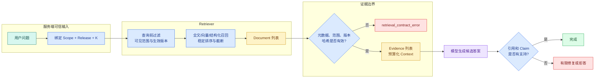

# LangChain Retriever 与 2-Step RAG：从 Document 到 Evidence

Retriever 是应用层的检索接口：接收查询，返回候选 `Document`；2-Step RAG 是把检索固定放在生成之前的流程。它位于用户问题与模型上下文之间，用来控制召回、范围过滤和 Evidence 装配，不等于某一种向量数据库。

用户问“访问申请在哪里提交？”如果系统每次都应该先查内部知识，再根据当前可见资料回答，最简单的实现不是 Agent 自由循环，而是一条固定链：

```text
question
  → Retriever 返回当前 Scope 与 Release 下的 Documents
  → 程序把 Documents 校验成 Evidence
  → 程序按 Token 预算装配 Context
  → Model 根据 Context 生成候选答案
  → Validator 检查引用后返回或拒答
```

这叫 **2-Step RAG**：检索一定发生在生成之前，路径和最多调用次数在写代码时已经确定。它解决模型上下文有限、训练知识静态的问题，同时比“让 Agent 自己决定查不查”更容易控制延迟、权限和测试。

LangChain `BaseRetriever` 接收查询并返回 **Document**，Document 再转换成带稳定 ID、位置、版本和内容哈希的 Evidence，最后由 LCEL 组成可离线运行的固定链。向量库只是 Retriever 的一种实现，不能替代 RAG 的应用接口和信任边界。

[Streaming、Callback 与 Middleware](/docs/ai-agent/langchain-streaming-middleware-retry) 已经定义检索开始、候选数量和无证据终态怎样成为公开事件。Retriever 沿用这套事件，不另造进度协议。固定链出现条件路由、并行研究和恢复需求后，再把相同 Retriever 放进 LangGraph 节点。

## RAG 解决的不是“模型不会背资料”这么简单

把全部文档复制进 Prompt 有三个直接限制：

1. 文档总量通常超过上下文窗口；
2. 每次发送全部内容增加延迟和 Token 成本；
3. 用户只能看其中一部分资料，应用不能先把越权内容交给模型再要求它忽略。

RAG 在查询时选择少量相关片段，让生成阶段只看到当前问题需要、当前用户可见、当前知识版本生效的 **Evidence**。它并不保证答案正确：检索可能漏召回，文档可能过期，模型也可能错误概括。因此 RAG 至少包含“召回、上下文装配、生成、验证”四个责任，而不只是调用一次向量搜索。

### 输入、内部状态和输出

| 阶段 | 输入 | 关键状态 | 输出 |
| --- | --- | --- | --- |
| Query | 用户问题 | Scope、**Release**、过滤条件、K | 规范化查询 |
| Retrieve | 查询与可信过滤 | 索引版本、通道、排序参数 | Documents |
| Evidence mapping | Documents | 稳定 ID、位置、哈希、权限复核 | Evidence |
| Context assembly | Evidence | Token 与证据预算、排序 | 模型上下文 |
| Generate | 问题与上下文 | 模型、Prompt、Schema | 候选答案与引用 |
| Validate | 候选答案与 Evidence | Claim 支持、引用、敏感信息 | 完成、修复或拒答 |

实践代码用确定性模板代替生成模型，让检索和 Evidence 契约可以离线测试。接入真实 ChatModel 后，前四步和验证仍然保留。

## Retriever 不是向量库

### 向量库负责存储和近邻查询

向量库或带向量扩展的关系库保存 Embedding，并执行相似度搜索、过滤和索引扫描。它关注距离函数、HNSW/IVF 参数、分片、持久化和运维。

### Retriever 是应用层查询接口

LangChain **Retriever** 接收非结构化 query，返回 `list[Document]`。它背后可以是：

- 全文索引；
- 向量库；
- SQL 或图数据库；
- 外部搜索 API；
- 多路召回、融合与重排；
- 本文的内存实现。

业务链依赖 Retriever 接口后，可以替换底层检索实现，而不用重写 Prompt 与答案验证。反过来，如果业务代码直接依赖某个数据库的距离算子，权限、测试和迁移会与存储细节绑在一起。

### Retriever 也不是 Agent Tool

Retriever 是 `query → Documents` 的 Runnable。把它包装成 Tool 后，模型可以决定何时调用并生成 query；那属于 Agentic RAG。固定 2-Step RAG 由程序每次调用 Retriever，不需要模型选择。

| 需求 | 更合适的入口 |
| --- | --- |
| 每个问题都先查一次同一知识库 | Retriever 固定链 |
| 模型在多个外部来源中选择 | Retriever/搜索适配器包装成 Tool |
| 先查一次，不足时有限补搜 | 显式条件图或 Hybrid RAG |

“能包装成 Tool”不代表“必须使用 Agent”。控制流越简单，越容易验证成本和权限。

## Document 是框架对象，Evidence 是业务对象

LangChain `Document` 通常包含：

- `page_content`：片段正文；
- `metadata`：标题、来源、位置、版本、分数等附加字段；
- 可选 `id`：框架级标识。

仅返回正文不够。最终引用需要知道它来自哪份文档、哪个片段、什么位置和哪个知识版本；权限变化后也要重新复核。

本文把 Document 映射成自己的 Evidence：

| Evidence 字段 | 用途 |
| --- | --- |
| `evidence_id` | 在 Prompt 和答案引用中使用的稳定 ID |
| `document_id` / `chunk_id` | 定位原文与去重 |
| `title` / `location` | 给用户展示可理解来源位置 |
| `content` | 经过准入和裁剪的证据正文 |
| `content_hash` | 检查引用内容是否变化 |
| `release_id` | 固定本轮使用的知识版本 |
| `retrieval_score` | 解释候选排序，不当作答案置信度 |

Evidence 是进入 Agent Runtime 的领域契约。换掉 LangChain 或向量库时，只要还能生成相同 Evidence，答案验证层无需跟着重写。

## 权限与知识版本必须在召回前过滤

假设索引里同时有 public 和 private 文档。若先召回所有内容，再在 Prompt 中写“请忽略 private”，越权正文已经进入模型上下文，日志、缓存和供应商请求都可能留下副本。

正确顺序是：

1. 认证与授权层生成不可变 Scope 快照；
2. Turn 开始时固定 active Release；
3. Retriever 查询把 Scope 和 Release 放入数据访问过滤；
4. 返回 Document 后再做一次防御性复核；
5. Context 只接收复核通过的 Evidence。



图中查询前过滤是主要授权边界，Document 后复核是纵深防御。后者发现越权 Document 时，应报告检索契约错误并阻断整次上下文装配，不能只静默删掉后继续假装检索正常，因为底层过滤已经失效。

## 相似度分数不是答案置信度

全文分数、余弦相似度、RRF 排名和 Rerank 分数只描述“候选与查询在某个模型或算法下有多相关”。它们不证明：

- 文档内容是真的或仍然生效；
- 片段足以回答全部问题；
- 用户有权读取；
- 模型生成的 Claim 被原文支持。

因此字段名用 `retrieval_score`，不要叫 `confidence`。答案质量需要额外评估 Evidence 覆盖、Claim 支持与引用正确性。

## 实践：实现 Scoped Retriever 与固定 RAG 链

### 环境、输入与预期产物

安装 LangChain Core、Pydantic 和 pytest。程序不调用远程模型或数据库：

```bash
# 安装 Retriever、向量与测试依赖，示例使用固定匿名文档和当前 Scope 作为输入。
python3 -m venv .venv
source .venv/bin/activate
python -m pip install "langchain-core>=1,<2" "pydantic>=2.11,<3" "pytest>=8,<9"
```

这些命令从 `python3`、`source`、`python` 开始按顺序运行，输出用于确认“环境、输入与预期产物”是否成立。任何命令返回非零退出码都表示当前步骤没有完成，应先检查路径、环境和参数；不要把后续输出当成成功证据。

输入是问题 `访问 申请`，可信状态是 Scope=`public`、Release=`release-1`。索引还包含 private 片段和旧版本片段；预期只有当前 public 片段变成 Evidence，答案引用 `[E1]`。下面直接运行这段实现：

```python
# Retriever 返回带稳定 ID、来源和 Scope 的 Document，答案链只消费通过过滤的候选。
from __future__ import annotations

import hashlib
import re
from dataclasses import dataclass
from typing import Literal

from langchain_core.callbacks import CallbackManagerForRetrieverRun
from langchain_core.documents import Document
from langchain_core.retrievers import BaseRetriever
from langchain_core.runnables import RunnableLambda, RunnablePassthrough
from pydantic import ConfigDict, Field

@dataclass(frozen=True)
class ScopeSnapshot:
    scope_ids: tuple[str, ...]
    release_id: str
# Evidence 保存可追溯来源、稳定标识和可见范围，供 Claim 绑定与引用校验。

@dataclass(frozen=True)
class Evidence:
    evidence_id: str
    document_id: str
    chunk_id: str
    title: str
    location: str
    content: str
    content_hash: str
    release_id: str
    retrieval_score: float

@dataclass(frozen=True)
class RagResult:
    status: Literal["completed", "no_evidence"]
    answer: str
    citations: tuple[str, ...]
    context: str

class ScopedMemoryRetriever(BaseRetriever):
    model_config = ConfigDict(arbitrary_types_allowed=True)

    documents: tuple[Document, ...]
    scope: ScopeSnapshot
    k: int = Field(default=3, ge=1, le=10)

    def _get_relevant_documents(
        self,
        query: str,
        *,
        run_manager: CallbackManagerForRetrieverRun,
    ) -> list[Document]:
        del run_manager
        terms = [term for term in re.split(r"\s+", query.casefold().strip()) if term]
        if not terms:
            raise ValueError("query must not be empty")

        ranked: list[tuple[int, str, Document]] = []
        # 逐项保留正文之外的来源和稳定标识，后续引用才能回到原始位置。
        for document in self.documents:
            metadata = document.metadata
            if metadata.get("scope_id") not in self.scope.scope_ids:
                continue
            if metadata.get("release_id") != self.scope.release_id:
                continue

            searchable = f"{metadata.get('title', '')} {document.page_content}".casefold()
            score = sum(1 for term in terms if term in searchable)
            if score == 0:
                continue
            evidence_id = str(metadata.get("evidence_id", ""))
            ranked.append((score, evidence_id, document))

        ranked.sort(key=lambda item: (-item[0], item[1]))
        return [
            Document(
                page_content=document.page_content,
                metadata={**document.metadata, "retrieval_score": float(score)},
            )
            for score, _evidence_id, document in ranked[: self.k]
        ]

REQUIRED_METADATA = {
    "evidence_id",
    "document_id",
    "chunk_id",
    "title",
    "location",
    "content_hash",
    "scope_id",
    "release_id",
    "retrieval_score",
}

def documents_to_evidence(
    documents: list[Document],
    scope: ScopeSnapshot,
) -> list[Evidence]:
    # evidence 保存检索结果的稳定引用，生成答案前必须能够追溯来源。
    evidence: list[Evidence] = []
    seen_ids: set[str] = set()
    for document in documents:
        missing = REQUIRED_METADATA - document.metadata.keys()
        if missing:
            raise ValueError(f"document metadata missing: {sorted(missing)}")
        if document.metadata["scope_id"] not in scope.scope_ids:
            raise PermissionError("retriever returned out-of-scope document")
        if document.metadata["release_id"] != scope.release_id:
            raise ValueError("retriever returned a different release")

        evidence_id = str(document.metadata["evidence_id"])
        if evidence_id in seen_ids:
            raise ValueError(f"duplicate evidence id: {evidence_id}")
        seen_ids.add(evidence_id)
        evidence.append(
            Evidence(
                evidence_id=evidence_id,
                document_id=str(document.metadata["document_id"]),
                chunk_id=str(document.metadata["chunk_id"]),
                title=str(document.metadata["title"]),
                location=str(document.metadata["location"]),
                # page_content 是 Retriever 返回的正文；metadata 单独保留追溯字段。
                content=document.page_content,
                content_hash=str(document.metadata["content_hash"]),
                release_id=str(document.metadata["release_id"]),
                retrieval_score=float(document.metadata["retrieval_score"]),
            )
        )
    return evidence

def build_context(evidence: list[Evidence]) -> str:
    return "\n\n".join(
        f"[{item.evidence_id}] {item.title} · {item.location}\n{item.content}"
        for item in evidence
    )

def assemble_answer(payload: dict[str, object], scope: ScopeSnapshot) -> RagResult:
    documents = payload["documents"]
    if not isinstance(documents, list):
        raise TypeError("retriever output must be a list")
    evidence = documents_to_evidence(documents, scope)
    if not evidence:
        return RagResult(
            status="no_evidence",
            answer="当前可见资料中没有足够证据。",
            citations=(),
            # 可信上下文由应用侧创建并注入，模型只能读取允许字段，不能自行构造权限和截止时间。
            context="",
        )

    context = build_context(evidence)
    first = evidence[0]
    return RagResult(
        status="completed",
        answer=f"根据 [{first.evidence_id}]：{first.content}",
        citations=(first.evidence_id,),
        # 将实际送入生成阶段的证据上下文返回，便于测试和审计。
        context=context,
    )

def build_rag_chain(retriever: ScopedMemoryRetriever):
    return (
        {
            "question": RunnablePassthrough(),
            "documents": retriever,
        }
        | RunnableLambda(lambda payload: assemble_answer(payload, retriever.scope))
    )

def retrieval_cache_key(query: str, scope: ScopeSnapshot) -> str:
    raw = "|".join(
        [
            query.casefold().strip(),
            scope.release_id,
            *sorted(scope.scope_ids),
        ]
    )
    return hashlib.sha256(raw.encode("utf-8")).hexdigest()

def make_document(
    *,
    evidence_id: str,
    scope_id: str,
    release_id: str,
    content: str,
) -> Document:
    return Document(
        page_content=content,
        metadata={
            "evidence_id": evidence_id,
            "document_id": f"doc-{evidence_id}",
            "chunk_id": f"chunk-{evidence_id}",
            "title": "访问申请说明",
            "location": "第 2 节",
            "content_hash": hashlib.sha256(content.encode("utf-8")).hexdigest(),
            "scope_id": scope_id,
            "release_id": release_id,
        },
    )

# 构造函数把已验证字段组装成下游对象，不在这里引入新的权限或业务决策。
def build_retriever() -> ScopedMemoryRetriever:
    scope = ScopeSnapshot(scope_ids=("public",), release_id="release-1")
    return ScopedMemoryRetriever(
        scope=scope,
        k=3,
        documents=(
            make_document(
                evidence_id="E1",
                scope_id="public",
                release_id="release-1",
                content="访问申请入口在服务门户，提交前确认设备条件。",
            ),
            make_document(
                evidence_id="E2",
                scope_id="private",
                release_id="release-1",
                content="访问申请的内部审批名单。",
            ),
            make_document(
                evidence_id="E3",
                scope_id="public",
                release_id="release-0",
                content="旧版访问申请入口。",
            ),
        ),
    )

def demo() -> None:
    retriever = build_retriever()
    documents = retriever.invoke("访问 申请")
    print("retrieved", [document.metadata["evidence_id"] for document in documents])

    result = build_rag_chain(retriever).invoke("访问 申请")
    print("status", result.status)
    print("answer", result.answer)
    print("citations", result.citations)
    print("cache_key_prefix", retrieval_cache_key("访问 申请", retriever.scope)[:12])

if __name__ == "__main__":
    demo()
```

### Retriever 怎样绑定可信 Scope

`ScopedMemoryRetriever` 继承 `BaseRetriever`。它把 `documents`、`scope` 和 `k` 作为构造状态；调用方只向 `invoke` 传 query，用户文本无法覆盖绑定的 Scope 与 Release。

`_get_relevant_documents` 是同步 Retriever 的核心实现。它先拆查询词，再逐份检查 scope 和 release，只有通过过滤的 Document 才参与相关性计算。真实全文或向量查询应把这两个过滤条件下推到数据库；内存循环只是可观察的接口替身。

相关性分数是命中词数。排序键先按分数降序，再按 evidence_id 升序，保证同分结果稳定。返回时创建新 Document 并加入 retrieval_score，避免修改共享索引对象。

`BaseRetriever` 本身是 Runnable，因此支持 `invoke`、`ainvoke`、`batch`、Callback 和 LCEL 组合。实现层只关心怎样得到 Documents，链路层不需要知道是内存、全文还是向量索引。

### Document 怎样变成 Evidence

`documents_to_evidence` 检查九个必需 metadata。任何缺失都属于检索契约错误，而不是让后面用空字符串凑一个引用。它还再次检查 Scope 和 Release，并拒绝重复 evidence_id。

只有全部检查通过后才创建不可变 Evidence。这个转换点适合加入内容长度、MIME、来源状态和内容哈希复核。若一个 Document 越权，应阻断整次装配并告警底层过滤失效。

### LCEL 怎样组成固定 RAG

`build_rag_chain` 的字典会构造并行 Runnable：`question` 分支用 Passthrough 保留原问题，`documents` 分支调用 Retriever。两者完成后，RunnableLambda 调用 `assemble_answer`。

示例的确定性答案模板只引用第一条 Evidence。换成真实 ChatModel 时，payload 会先变成 Prompt，模型输出结构化答案与 citations，再由 Validator 检查；Retriever 与 Evidence 契约不变。

`no_evidence` 是合法终态。Retriever 返回空列表表示查询执行成功但当前范围没有候选；它与超时、权限契约错误或依赖不可用不同。

### 缓存键为什么包含 Scope 和 Release

`retrieval_cache_key` 同时哈希规范化 query、release 和排序后的 scope IDs。只用 query 做键会让 public 用户命中 private 用户的候选，也会在知识版本切换后返回旧结果。

权限发生变化时，即使新 Scope 生成不同键，旧缓存仍要有 TTL 或版本化失效策略。缓存值取出后继续复核 Document metadata，不能把缓存当作授权来源。

### 运行并观察结果

```bash
# 运行命中、无结果和受限范围查询，观察候选、Evidence 与最终终态，而不是只看答案文本。
python scoped_rag.py
```

这些命令从 `python` 开始按顺序运行，输出用于确认“运行并观察结果”是否成立。任何命令返回非零退出码都表示当前步骤没有完成，应先检查路径、环境和参数；不要把后续输出当成成功证据。

预期结果只有 E1：

```text
retrieved ['E1']
status completed
answer 根据 [E1]：访问申请入口在服务门户，提交前确认设备条件。
citations ('E1',)
cache_key_prefix <12 个十六进制字符>
```

E2 与问题相关但不在 public Scope，E3 是旧 Release，因此都不参与评分。缓存前缀由 SHA-256 计算，具体值可以稳定断言完整哈希，也可以像演示一样只确认非空；不要把哈希当成加密权限凭证。

若输出包含 E2，优先检查 Retriever 构造时的 scope，而不是要求模型“别引用”；若包含 E3，检查 Turn 是否固定 Release；若 citations 为空但 status completed，检查 Evidence 到答案的验证边界。

## 九个测试固定检索和证据契约

下面直接运行这段实现：

为了验证“九个测试固定检索和证据契约”，下面的测试把“九条测试覆盖检索输入、过滤、稳定 ID、空结果、引用、超时和无证据拒答等契约”变成可执行断言。每个用例自己构造输入，并用断言固定返回值或失败状态；某条测试失败时，可以从用例名直接定位到被破坏的契约。

```python
# 九条测试覆盖检索输入、过滤、稳定 ID、空结果、引用、超时和无证据拒答等契约。
from dataclasses import replace

import pytest
from langchain_core.documents import Document

from scoped_rag import (
    ScopeSnapshot,
    build_rag_chain,
    build_retriever,
    documents_to_evidence,
    make_document,
    retrieval_cache_key,
)

# 这个用例固定权限边界：越权字段不能进入结果，也不能触达受保护的数据访问。
def test_retriever_filters_scope_and_release_before_ranking() -> None:
    documents = build_retriever().invoke("访问 申请")
    assert [document.metadata["evidence_id"] for document in documents] == ["E1"]

# 这个用例核对证据与引用关系，防止无来源 Claim 被当成已经验证的答案。
def test_equal_scores_use_stable_evidence_id_order() -> None:
    retriever = build_retriever()
    extra = make_document(
        evidence_id="E0",
        scope_id="public",
        release_id="release-1",
        content="访问申请还可以在帮助台咨询。",
    )
    ranked = retriever.model_copy(update={"documents": (*retriever.documents, extra)})
    assert [doc.metadata["evidence_id"] for doc in ranked.invoke("访问 申请")] == ["E0", "E1"]

def test_base_retriever_batch_keeps_each_query_result() -> None:
    # 用当前查询和可信范围执行检索；返回候选会继续接受去重、排序或证据校验。
    results = build_retriever().batch(["访问 申请", "报销"])
    assert [doc.metadata["evidence_id"] for doc in results[0]] == ["E1"]
    assert results[1] == []

def test_empty_query_is_rejected_before_search() -> None:
    with pytest.raises(ValueError, match="must not be empty"):
        build_retriever().invoke("   ")

# 这个用例核对证据与引用关系，防止无来源 Claim 被当成已经验证的答案。
def test_rag_chain_returns_citation_and_context() -> None:
    result = build_rag_chain(build_retriever()).invoke("访问 申请")
    assert result.status == "completed"
    assert result.citations == ("E1",)
    assert "[E1]" in result.answer
    assert "[E1]" in result.context

# 空输入或空命中属于独立业务路径；这个用例确认它不会越过校验边界触发多余调用。
def test_empty_retrieval_has_explicit_no_evidence_result() -> None:
    result = build_rag_chain(build_retriever()).invoke("报销")
    assert result.status == "no_evidence"
    assert result.citations == ()
    assert result.context == ""

def test_missing_metadata_is_a_contract_error() -> None:
    broken = Document(page_content="访问申请", metadata={"evidence_id": "E-broken"})
    with pytest.raises(ValueError, match="metadata missing"):
        documents_to_evidence(
            [broken],
            ScopeSnapshot(("public",), "release-1"),
        )

# 这个用例重复提交或恢复同一运行，确认 Checkpoint、幂等键或事件序号阻止重复副作用。
def test_duplicate_evidence_id_is_rejected() -> None:
    retriever = build_retriever()
    document = retriever.invoke("访问 申请")[0]
    with pytest.raises(ValueError, match="duplicate evidence id"):
        documents_to_evidence([document, document], retriever.scope)

# 这个用例固定权限边界：越权字段不能进入结果，也不能触达受保护的数据访问。
def test_cache_key_isolated_by_scope_and_release() -> None:
    base = ScopeSnapshot(("public",), "release-1")
    private = replace(base, scope_ids=("private",))
    old_release = replace(base, release_id="release-0")
    keys = {
        retrieval_cache_key("访问 申请", base),
        retrieval_cache_key("访问 申请", private),
        retrieval_cache_key("访问 申请", old_release),
    }
    assert len(keys) == 3
```

前三项验证 Retriever 的过滤、稳定排序和 Runnable batch。空 query 在搜索前失败，避免把“没有问题”误作“没有资料”。

第五、六项区分正常 Evidence 和成功空结果。后两类契约错误分别覆盖缺 metadata 与重复 ID；它们不会退化成 no_evidence，因为那会掩盖数据损坏。最后一项证明缓存不会跨 Scope 或 Release 复用。

运行：

```bash
# pytest 的逐层断言可以区分 Retriever、Evidence 选择和生成失败，避免所有错误都归因于模型。
pytest -q
```

`pytest` 会执行九条路径，预期得到 `9 passed` 且进程退出码为 0。排序失败时先查看 score 与 evidence_id；越权或旧版本命中时检查查询前过滤；Evidence 错误未抛出时检查 metadata 复核。示例只使用内存 Document，不创建数据库、向量索引或缓存文件。

## 空结果、失败和权限拒绝怎样区分

| 情况 | Retriever 是否完成查询 | 推荐状态 | 是否让模型回答 |
| --- | ---: | --- | ---: |
| 当前范围无候选 | 是 | `no_evidence` | 只允许明确拒答或有限改写 |
| 查询参数非法 | 否 | `invalid_query` | 否 |
| 依赖超时 | 否 | `retrieval_timeout` | 不把它说成“没有资料” |
| 用户 Scope 为空 | 取决于策略 | `forbidden` 或受限空结果 | 不扩大范围 |
| Document 越权/版本错误 | 查询返回违反契约 | `retrieval_contract_error` | 否，并告警 |
| 候选足够且验证通过 | 是 | `completed` | 是 |

“空列表”只能表达第一行。Repository 抛错、缓存损坏和权限拒绝要保留不同错误类型，Runtime 才能决定重试、拒答还是告警。

## 2-Step、Agentic 和 Hybrid RAG 怎样选择

### 2-Step RAG

程序固定先检索再生成。优点是调用次数可预测、权限边界清晰、延迟较稳定；缺点是不能根据首轮结果动态补搜。FAQ、文档问答和多数单知识库查询应先从这里开始。

### Agentic RAG

Retriever 作为 Tool，模型决定何时查、查哪个来源和是否继续。它适合研究型、多来源、步骤未知的任务；代价是调用次数、延迟和轨迹更不确定，需要严格停止、权限和 Eval。

### Hybrid RAG

程序保留主要控制权，但在查询改写、候选充分性和答案验证处允许有限分支。例如首轮不足时最多改写一次，再次检索；仍不足便拒答。它常比完全自由的 Agentic RAG 更容易满足业务可靠性。

| 需求 | 2-Step | Hybrid | Agentic |
| --- | ---: | ---: | ---: |
| 每次都必须检索 | 最合适 | 可用 | 过度动态 |
| 延迟和成本需要上界 | 容易 | 可控制 | 较难 |
| 多来源动态选择 | 有限 | 合适 | 合适 |
| 补搜和验证修复 | 不擅长 | 最合适 | 可实现但更不确定 |
| 长任务恢复 | 需外部 Runtime | 需要状态图 | 需要状态图 |

## 什么时候进入 LangGraph

固定链可以继续用 LCEL 的条件：一次 query、一次 retrieve、一次 generate、一次 validate，失败直接终态。出现下列状态后，显式图更清晰：

- 查询理解产生多个 SearchBranch；
- 多路 Retriever 并行，结果需要融合和去重；
- 首轮 Evidence 不足时有限改写与补搜；
- 生成后 Claim 验证失败允许一次修复；
- 任务跨请求，需要 Checkpoint、取消和恢复；
- 每个阶段要写事件、持久状态和独立指标。

迁移时保留现有 Retriever，把它作为 LangGraph 节点或 Tool 使用，继续复用 ScopeSnapshot、Document→Evidence 和错误语义。重新实现会产生两套权限与检索逻辑。

## 接入真实全文或向量检索时的顺序

1. 保持 `query + bound scope → list[Document]` 接口不变。
2. 用固定 query 集建立精确或可解释基线。
3. 将 Scope、Release 和状态过滤下推到数据库。
4. 映射稳定 metadata，不只返回正文与 distance。
5. 记录通道、索引版本和 retrieval_score。
6. 用 Recall@K、MRR、nDCG 和延迟比较候选。
7. 对 Document 再做权限、版本和内容哈希复核。
8. 缓存键包含 query、Scope、Release、检索配置和索引版本。
9. Eval 通过后再替换线上 Retriever，不同时改 Prompt 和索引。

向量库和混合检索的选型会在后续 RAG 专题详细展开。此处的目标是让应用链先有稳定边界，避免存储实现反向控制业务协议。

## 接入 Retriever 前逐项检查契约

- Retriever 与向量库责任分开，调用方只依赖 Document 契约；
- Scope、Release、K 和过滤由服务端绑定；
- 权限过滤发生在召回查询之前，返回后再次复核；
- Document 带稳定来源、位置、版本和内容哈希；
- Document 进入 Runtime 前转换成 Evidence；
- retrieval_score 不被称为答案 confidence；
- 空结果、依赖失败、权限拒绝和契约错误可区分；
- 排序在同分时稳定，批量查询不会串结果；
- 缓存键包含权限、版本和检索配置；
- 固定流程先用 2-Step，出现动态分支和恢复需求再升级图。

## 从单路 Retriever 演进到两路固定召回

把 `ScopedMemoryRetriever` 替换成“两路召回但仍是固定链”的实现：

1. 一路按词项命中，一路使用预先给定的向量相似度；
2. 两路都在召回前应用相同 Scope 和 Release；
3. 用 RRF 合并，不直接相加不同分数尺度；
4. duplicate chunk 只保留一份，并记录来自哪些通道；
5. 最终 Document 保留 `channel_ranks` 和稳定 evidence_id；
6. 用固定问题比较单路和融合后的 Recall@K；
7. 两路任一失败时明确选择整体失败还是可解释降级；
8. 若 Evidence 不足允许补搜，画出升级 LangGraph 后的状态和停止条件。

question、ScopeSnapshot、Documents、Evidence 与 RagResult 都应进入显式状态，动态分支不再藏在一个 RunnableLambda 中。


**Retriever 与 VectorStore 有什么区别？**

VectorStore 负责向量保存、过滤和相似度查询，Retriever 是面向问题返回 Document 的检索接口，可以在内部组合向量、全文、查询改写、压缩或其他数据源。把调用方依赖在 Retriever 上，后续能替换检索策略而不改生成链；但 Retriever 的统一接口不会抹平各后端的过滤、分数和一致性差异，这些仍要通过元数据与测试表达。

**Document 的 metadata 为什么和正文同样重要？**

正文用于模型理解，metadata 保存 document ID、chunk ID、标题路径、来源位置、Scope、Release、内容哈希和检索通道。没有这些字段，候选无法去重、过滤、引用或在版本切换后回放。metadata 也不能由模型补猜，必须从导入与权限系统继承；进入 Prompt 前只暴露回答所需字段，完整内部元数据留在 Evidence 记录。

**固定 2-Step RAG 什么时候比 Agentic RAG 更合适？**

问题能用一次查询或确定的查询改写召回，生成前不需要根据观察选择不同工具时，固定的检索、生成、验证路径更便宜，也更容易稳定评测。Agentic RAG 适合多跳、动态通道和有限补搜，但会增加循环与停止条件。应先用固定 RAG 测出 Recall 与答案基线，确认失败来自动态研究后再引入 Planner，不要用 Agent 掩盖切片或索引问题。

**Scope 与 Release 应该在哪个阶段过滤？**

它们应进入实际查询条件，让不可见或错误版本的片段根本不成为候选，而不是检索全库后再让模型选择。缓存键也要包含权限与版本语义，Rerank 和 Evidence 选择继续保留这些字段；最终输出前再复核当前权限。前置过滤降低泄露面，末端复核处理执行期间撤权，两者解决不同时间点的问题。

**Retriever 返回的 Document 为什么还不是 Evidence？**

Document 只是召回候选，可能相关性不足、重复、版本冲突或无法支撑具体 Claim。Evidence 需要经过权限与 Release 过滤、融合、Rerank、内容安全和预算选择，并保存可回溯位置。生成阶段绑定 Claim 与 Evidence，验证器才能指出哪条事实缺支撑。直接把 Top K Documents 全部塞进 Prompt，会把检索分数误当成事实证明。

**怎样测试一个 Retriever RAG，而不是只看回答顺不顺？**

先用标注查询检查正确 chunk 是否进入 Top K、无权内容是否始终缺席、空结果与依赖失败是否分开，再测试 Document metadata 和引用回溯。随后用脚本化模型验证 Prompt 只收到允许证据，最后才做答案忠实度评测。固定查询、Release、Embedding 与索引版本，并记录候选列表；否则最终答案变化时无法判断是召回、生成还是模型随机性造成。
