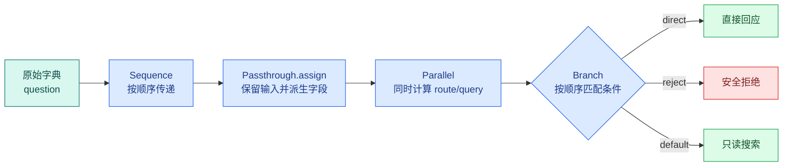

# Runnable 与 LCEL：串行、并行、分支和异常怎样传播

Runnable 是 LangChain 中统一输入、输出和调用方式的可组合执行单元；LCEL 是用这些单元声明串行、并行和分支的组合语法。它位于模型调用前后的应用编排层，用于让数据流、批量、异步和异常传播保持可观察；它不是带持久状态和回边的 Agent 图。

系统规则、历史、证据和当前问题已经可以装配成 Message。现在回到模型调用之前，解决一个更基础的工程问题：多个处理节点怎样组合，输入输出怎样在组合过程中变化？

我们实现一个知识问题管道：

1. 清洗输入；
2. 并行计算 `route` 和 `normalized_query`；
3. 根据 route 进入 `direct`、`reject` 或 `search`；
4. 返回统一结果结构。

输入可能是“你好”“删除所有资料”或“访问申请入口是什么”。三条路径的计算不同，最终都返回：

```text
{"route": ..., "status": ..., "answer": ..., "events": [...]}
```

LCEL 是 LangChain Expression Language，最常见语法是用 `|` 连接 Runnable。真正需要掌握的不是符号，而是每次连接时前一个节点返回什么、后一个节点接收什么，并行结果怎样合并，异常在哪一层停止。

## 四种组合抽象先放到一张图里



`Sequence` 是整体调用顺序，`Passthrough.assign` 保留已有字典并增加键，新增键可以由 `Parallel` 同时计算，`Branch` 再根据结果只选择一条 Runnable。

这张图描述请求内的一次执行。它没有持久化状态、Checkpoint 或跨请求恢复；进程退出后不会从中间继续。这就是 LCEL 与后面 LangGraph 的重要边界。

## RunnableSequence：输出成为下一个节点的输入

表达式：

```text
A | B | C
```

等价于按顺序执行：

```text
a_output = A.invoke(input)
b_output = B.invoke(a_output)
result = C.invoke(b_output)
```

如果 A 输入是 `dict`、输出是字符串，而 B 期待字典，运行时会在 B 失败。`|` 只负责连接，不会猜测字段映射。

### Sequence 的状态在哪里

Sequence 本身没有业务状态对象。每个节点的输出就是传给下一节点的数据。如果中途需要同时保留原始问题、派生查询、证据和事件，就要返回包含这些字段的新字典，或使用 Passthrough 保留输入。

### Sequence 怎样传播异常

A 抛异常时 B 和 C 不执行；B 抛异常时 C 不执行。调用方收到异常，除非某一节点显式配置 retry 或 fallback。异常不是一个正常输出值，不应被默认 Parser 转成“暂无答案”。

## RunnableParallel：同一输入发送给多个子节点

Parallel 接收一个输入，把它同时交给多个命名 Runnable，最后按名称返回字典：

```text
input = {"question": "访问申请入口是什么"}

parallel output = {
  "route": "search",
  "normalized_query": "访问申请入口"
}
```

两个子节点默认看到的是同一个输入。它们不应该修改共享可变字典，否则线程或异步**并发**会产生数据竞争。更安全的做法是把输入当不可变值，每个分支返回自己的结果，再由外层合并。

### 并行不等于无限并发

同步 batch 可能使用线程池，异步 Runnable 使用任务并发，具体行为取决于实现。`max_concurrency` 控制并发上限；还要同时遵守模型供应商速率限制、数据库连接池、HTTP 连接池和全局准入槽。

### 一个分支失败时发生什么

关键 Parallel 中任一分支抛异常，组合调用整体失败。其他分支可能已经开始甚至完成，不能假设它们一定被即时取消。因此并行分支最好是只读或幂等操作。需要精确取消、部分成功和持久状态时，显式 Runtime 比简单 Parallel 更合适。

## RunnablePassthrough.assign：保留输入并添加字段

单独使用 Parallel 会返回子结果字典，原始字段可能丢失。`RunnablePassthrough.assign` 适合输入已经是字典，希望保留全部键并派生新键：

```text
before = {"question": "访问申请入口是什么", "request_id": "demo-1"}

after = {
  "question": "访问申请入口是什么",
  "request_id": "demo-1",
  "route": "search",
  "normalized_query": "访问申请入口"
}
```

新增键若与原键同名，会覆盖旧值。权限、身份和版本字段不应允许由模型派生结果覆盖；字段所有权需要在进入 assign 前明确。

输入不是字典时，`assign` 无法按键合并。初学者遇到这类错误时，应打印每个节点的类型和键集合，而不是在 Prompt 中补说明。

## RunnableBranch：按顺序匹配，只执行一个分支

Branch 由多个 `(condition, runnable)` 和一个默认 Runnable 组成。运行时按声明顺序检查条件，第一个为真者执行，后面的条件不再判断；都不匹配时执行默认分支。

条件顺序会改变行为。例如“包含删除关键词”既可能被分类为 search，也应该被安全拒绝。若通用 search 条件放在 reject 前，危险请求可能走错分支。高优先级拒绝与显式命令通常放在更前面。

Branch 要求各分支最终输出能被下游统一消费。direct 返回字符串、search 返回字典，会让后续节点出现动态类型分裂。实践中让所有分支返回统一 `PipelineResult` 字典或 Pydantic 模型更容易测试。

## 实践：实现三路知识问题管道

### 环境准备

```bash
# 安装 Runnable、Fake 模型与测试依赖，后续 LCEL 组合可以在本地稳定重放。
python3 -m venv .venv
source .venv/bin/activate
python -m pip install "langchain-core>=1,<2" "pytest>=8,<9" "pytest-asyncio>=0.24,<2"
```

这些命令从 `python3`、`source`、`python` 开始按顺序运行，输出用于确认“环境准备”是否成立。任何命令返回非零退出码都表示当前步骤没有完成，应先检查路径、环境和参数；不要把后续输出当成成功证据。

这篇只使用 LangChain Core，不调用模型和数据库。搜索数据是内存中的匿名演示内容。

### 完整实现

下面直接执行这段实现。阅读顺序是：先看 `normalize_input` 的入口形状，再看 `classify_route` 和 `rewrite_query` 两个派生节点，然后看三个终态分支，最后看 `make_pipeline` 的组合表达式。

下面把“完整实现”落成最小实现。代码关注“Runnable 链把规范化输入依次交给 Prompt、模型与 Parser，并用显式分支处理无需模型的请求”；输入从函数参数或上文定义的状态对象进入，关键分支负责校验或修改状态，返回值再交给后续调用。

```python
# Runnable 链把规范化输入依次交给 Prompt、模型与 Parser，并用显式分支处理无需模型的请求。
from __future__ import annotations

import asyncio
from typing import Literal, TypedDict

from langchain_core.runnables import (
    Runnable,
    RunnableBranch,
    RunnableLambda,
    RunnablePassthrough,
)

Route = Literal["direct", "reject", "search"]

class PipelineInput(TypedDict):
    # question 保存原始用户输入，后续改写查询不能覆盖它。
    question: str
    request_id: str

class PipelineResult(TypedDict):
    route: Route
    # status 区分继续执行、答案就绪和需要追问，调用方无需解析回答文本判断终态。
    status: Literal["completed", "rejected", "insufficient"]
    answer: str
    events: list[str]

def normalize_input(payload: PipelineInput) -> PipelineInput:
    # 入口只保留去除首尾空白后的可信形状；缺少问题或请求 ID 时，不让脏数据进入链。
    question = payload.get("question", "").strip()
    request_id = payload.get("request_id", "").strip()
    if not question:
        raise ValueError("question must not be empty")
    if not request_id:
        raise ValueError("request_id must not be empty")
    return {"question": question, "request_id": request_id}

def classify_route(payload: PipelineInput) -> Route:
    question = payload["question"]
    # 寒暄不需要检索，直接返回固定答复，节省一次无意义的外部调用。
    if question in {"你好", "谢谢"}:
        return "direct"
    # 只读助手在路由阶段拒绝写操作；后续 search 分支不会收到这类请求。
    if any(word in question for word in ("删除", "转账", "导出全部")):
        return "reject"
    return "search"

def rewrite_query(payload: PipelineInput) -> str:
    question = payload["question"]
    # 这里只移除已知问句后缀，不补写实体或权限，避免改写改变用户原意。
    for suffix in ("是什么？", "是什么", "怎么申请？", "怎么申请"):
        if question.endswith(suffix):
            question = question[: -len(suffix)]
            break
    return question.strip(" ？?")

def direct_answer(payload: dict[str, object]) -> PipelineResult:
    del payload
    return {
        "route": "direct",
        "status": "completed",
        "answer": "你好，请告诉我想查询的知识内容。",
        "events": ["route:direct", "completed"],
    }

def reject_write_action(payload: dict[str, object]) -> PipelineResult:
    del payload
    return {
        "route": "reject",
        "status": "rejected",
        "answer": "这个只读助手不会执行写操作。",
        "events": ["route:reject", "rejected"],
    }

# 查询函数只接收业务查询参数；可信 Scope、版本和上限由调用侧一并传入。
def search_notes(payload: dict[str, object]) -> PipelineResult:
    notes = {"访问申请入口": "访问申请入口位于统一服务台。"}
    query = str(payload["normalized_query"])
    answer = notes.get(query, "")
    if not answer:
        return {
            "route": "search",
            "status": "insufficient",
            "answer": "当前可见资料中没有找到答案。",
            "events": ["route:search", "search:empty", "insufficient"],
        }
    return {
        "route": "search",
        "status": "completed",
        "answer": answer,
        "events": ["route:search", "search:hit", "completed"],
    }

# 构造函数把已验证字段组装成下游对象，不在这里引入新的权限或业务决策。
def make_pipeline() -> Runnable[PipelineInput, PipelineResult]:
    derive_fields = RunnablePassthrough.assign(
        route=RunnableLambda(classify_route),
        normalized_query=RunnableLambda(rewrite_query),
    )
    choose_path = RunnableBranch(
        (
            lambda payload: payload["route"] == "direct",
            RunnableLambda(direct_answer),
        ),
        (
            lambda payload: payload["route"] == "reject",
            RunnableLambda(reject_write_action),
        ),
        RunnableLambda(search_notes),
    )
    return RunnableLambda(normalize_input) | derive_fields | choose_path

async def demo() -> None:
    pipeline = make_pipeline()
    inputs: list[PipelineInput] = [
        {"question": "你好", "request_id": "demo-1"},
        {"question": "删除所有资料", "request_id": "demo-2"},
        {"question": "访问申请入口是什么？", "request_id": "demo-3"},
        {"question": "未知制度是什么？", "request_id": "demo-4"},
    ]

    # abatch 保持输入与结果的顺序，并把同时执行数限制为 2，避免无上限并发。
    results = await pipeline.abatch(inputs, config={"max_concurrency": 2})
    for result in results:
        print(result["route"], result["status"], result["answer"])

if __name__ == "__main__":
    asyncio.run(demo())
```

`normalize_input` 返回新的两键字典，避免下游修改调用方原对象。`derive_fields` 同时把这个字典交给分类与改写节点，然后将 `route` 和 `normalized_query` 合并回原字典。此时 Branch 输入有四个键：question、request_id、route、normalized_query。

`choose_path` 先检查 direct，再检查 reject，最后默认 search。因为 `classify_route` 已经把危险关键词归为 reject，两个条件互斥；显式顺序仍让行为可读。三个分支都返回相同 `PipelineResult` 形状。

`search_notes` 只使用 normalized_query，不根据用户文本扩大范围。空结果进入 `insufficient`，与 reject 分开。真实系统还要传入 Scope、Release、Deadline 和 Evidence，这里刻意保持最小数据流。

`demo` 使用 `abatch` 处理四个独立请求，最多并发两个。返回列表仍按输入位置对应，完成时间则可能不同。每个请求拥有独立 request_id 和结果字典。

运行：

```bash
# 运行示例并观察每个 Runnable 的输入输出；异常应保留组件名称与原始错误类别。
python lcel_pipeline.py
```

这些命令从 `python` 开始按顺序运行，输出用于确认“完整实现”是否成立。任何命令返回非零退出码都表示当前步骤没有完成，应先检查路径、环境和参数；不要把后续输出当成成功证据。

预期输出：

```text
direct completed 你好，请告诉我想查询的知识内容。
reject rejected 这个只读助手不会执行写操作。
search completed 访问申请入口位于统一服务台。
search insufficient 当前可见资料中没有找到答案。
```

命令退出码为 0 时，说明 `abatch` 的四个输入都获得了对应结果；`max_concurrency=2` 只限制同时执行数量，不改变返回列表与输入列表的对应顺序。若第三条变成 insufficient，先打印 `normalized_query`，确认后缀改写后是否得到“访问申请入口”；若危险请求进入 search，先检查 Router 的条件优先级，不要在 search 分支里再用字符串补丁拦截。某一项抛出未处理异常时，批量调用会失败，调用方需要按目标 API 决定是否使用返回异常模式或拆分重试。

## 用测试证明分支与异常语义

下面直接运行这段实现：

为了验证“用测试证明分支与异常语义”，下面的测试把“测试覆盖普通链、条件分支和 Parser 异常，确认分支不会重复调用模型或吞掉失败”变成可执行断言。每个用例自己构造输入，并用断言固定返回值或失败状态；某条测试失败时，可以从用例名直接定位到被破坏的契约。

```python
# 测试覆盖普通链、条件分支和 Parser 异常，确认分支不会重复调用模型或吞掉失败。
import asyncio

import pytest
from langchain_core.runnables import RunnableLambda, RunnableParallel

from lcel_pipeline import make_pipeline

# 参数表覆盖证据已齐、仍有缺口、轮次耗尽和 Deadline 到期四种停止条件。
@pytest.mark.parametrize(
    ("question", "expected_route", "expected_status"),
    [
        ("你好", "direct", "completed"),
        ("删除所有资料", "reject", "rejected"),
        ("访问申请入口是什么？", "search", "completed"),
        ("未知制度是什么？", "search", "insufficient"),
    ],
)
# 这个用例同时固定事件顺序、单调序号和唯一终态，避免客户端恢复出不同状态。
def test_each_input_enters_one_terminal_branch(
    question: str,
    expected_route: str,
    expected_status: str,
) -> None:
    result = make_pipeline().invoke({"question": question, "request_id": "test-1"})

    assert result["route"] == expected_route
    assert result["status"] == expected_status
    assert result["events"][0] == f"route:{expected_route}"

# 这个用例固定“成功但无结果”的语义，不能把它误报为依赖异常或编造答案。
def test_empty_question_stops_before_parallel_derivation() -> None:
    with pytest.raises(ValueError, match="question must not be empty"):
        make_pipeline().invoke({"question": "  ", "request_id": "test-empty"})

@pytest.mark.asyncio
async def test_parallel_starts_both_children() -> None:
    both_started = asyncio.Event()
    started = 0
    lock = asyncio.Lock()

    async def child(value: str) -> str:
        nonlocal started
        async with lock:
            started += 1
            if started == 2:
                both_started.set()
        await asyncio.wait_for(both_started.wait(), timeout=0.5)
        return value.upper()

    parallel = RunnableParallel(
        first=RunnableLambda(child),
        second=RunnableLambda(child),
    )

    result = await parallel.ainvoke("ok")

    assert result == {"first": "OK", "second": "OK"}

# 这个用例走失败或拒绝分支，确认错误码、终态和副作用都符合契约。
def test_critical_parallel_failure_propagates() -> None:
    def fail(_: str) -> str:
        raise RuntimeError("route service unavailable")

    parallel = RunnableParallel(
        route=RunnableLambda(fail),
        query=RunnableLambda(lambda value: value.strip()),
    )

    with pytest.raises(RuntimeError, match="route service unavailable"):
        parallel.invoke("question")
```

参数化测试一次覆盖四个终态，并通过首事件确认只有所选分支执行。空输入测试证明错误在 Parallel 之前发生。

并行测试没有依赖脆弱的毫秒阈值：两个协程都增加 `started`，只有第二个启动后 Event 才打开。若 **RunnableParallel** 串行执行，第一个会等待超时；当前结果证明两条子链确实同时进入执行。

最后一项让 route 分支抛错。组合调用把**异常传播**给调用方，没有拿 query 分支结果拼成伪成功。真实服务应在外层把这个错误映射为明确 failed 终态和事件。

运行：

```bash
# pytest 输出会指出哪条 Runnable 路径改变；退出码为 0 才表示组合语义稳定。
pytest -q
```

参数化用例会展开为四项，总计预期 `7 passed`。如果并行测试超时，检查两个子 Runnable 是否都使用 `ainvoke` 可执行的异步函数；如果关键失败被吞掉，检查是否在节点里捕获了过宽的 `Exception` 并返回空字符串。

## 异常、retry 与 fallback 的边界

### 异常应保留分类

输入错误、权限拒绝、无证据、网络超时和程序 Bug 不应共享一个 fallback。示例把无证据建成正常 `insufficient` 结果，把配置或代码异常继续抛出。

### retry 只处理暂时性失败

Runnable 可附加 retry，但要指定可重试异常与次数。网络连接重置可能重试一次；空问题、未知工具和权限拒绝重试不会改变结果。重试继续使用整轮剩余 Deadline。

### fallback 也要满足同一输出契约

主模型不可用时切换备用模型，fallback 仍应返回相同类型。若主链返回结构化对象、fallback 返回道歉字符串，下游会在更远位置失败。

写操作在 LCEL retry/fallback 前必须有业务幂等设计。框架看到函数异常，并不知道外部系统是否已经完成副作用。

## Parallel 的结果怎样合并

命名 Parallel 返回字典，键来自分支名称。合并策略本身是确定的，但值之间可能冲突。例如两个检索器都返回 score，刻度不一定相同；不能仅因为放在同一字典就直接排序。

需要融合时增加显式节点：

```text
parallel retrieval -> normalize scores -> deduplicate -> fuse -> rerank
```

每一步定义输入类型、排序语义和预算。RAG 章节会具体实现多路检索融合。

## Branch 为什么仍然不是 Agent 循环

Branch 一次选择路径，Sequence 向前执行。即使组合多个 Branch，控制图仍然没有回边。ReAct 需要根据 Tool Observation 返回模型节点，Reflection 需要验证后有限回到修复节点；用嵌套 LCEL 手写循环会让状态和停止条件分散。

出现以下信号时进入 LangGraph：

- 节点需要回到前一个阶段；
- 多个分支并行后使用 Reducer 合并共享状态；
- 需要 Checkpoint 和 Thread 恢复；
- 用户可以中断或恢复；
- 需要人机审核节点；
- 节点事件和状态要持久化；
- 失败后从安全边界重放，而不是整条链重跑。

## 数据形状调试方法

遇到 `KeyError` 或类型不匹配时，按节点逐个调用：

1. 调用 normalize，打印键名和类型；
2. 调用 derive_fields，检查原键是否保留、新键是否存在；
3. 单独运行每个 Branch 条件；
4. 单独运行选中的终态函数；
5. 最后组合完整链。

日志只记录键名、长度、状态和匿名 ID，不要为了调试把完整证据与用户原文写出。

## 用 LCEL 节点表观察数据形状

| 节点 | 输入键 | 输出键/类型 | 并发 | 失败语义 | 副作用 |
| --- | --- | --- | ---: | --- | --- |
| normalize | question/request_id | 同形状 | 否 | invalid_input | 无 |
| classify | question | Route | 可并行 | classifier_failed | 模型版可能有调用成本 |
| rewrite | question | str | 可并行 | rewrite_failed | 模型版可能有调用成本 |
| direct | 派生字典 | PipelineResult | 单分支 | 无 | 无 |
| reject | 派生字典 | PipelineResult | 单分支 | rejected | 无 |
| search | normalized_query | PipelineResult | 单分支 | insufficient/tool_failed | 只读 |

表里任何一个写操作都要补充幂等键、事务和重放边界。LCEL 只描述调用组合，不自动提供这些业务语义。

## 两路检索怎样接入现有 search 分支

为 search 路径并行增加 exact 与 semantic 两个检索器：

1. 两个分支返回统一 `list[Candidate]`；
2. Candidate 包含 source、document_id、chunk_id 和 score；
3. 增加 normalize 节点，避免直接比较不同 score；
4. 一个检索器超时时，决定整轮失败还是有条件降级；
5. Deadline 只创建一次，并把剩余时间传给两个分支；
6. 写测试证明重复 chunk 被合并；
7. 记录两个分支各自事件与耗时。

如果需要二次查询或根据覆盖不足回到 rewrite，就停止继续嵌套 Runnable，改用显式状态图。


**LCEL 中 `|` 左右两边的数据是怎样传递的？**

左侧 Runnable 的返回值会原样成为右侧 Runnable 的输入，因此每个节点都应有明确的输入输出类型。若前一个节点返回字典，后一个 Prompt 却期待字符串，错误会在运行时暴露。设计时先画出每条边的数据形状，再决定是否需要 RunnableLambda 做适配；不要靠节点内部猜测多个可能字段，否则管道表面简洁，契约却变得更隐蔽。

**`RunnableParallel` 是否会让所有任务真正并行？**

它表达多个分支接收同一输入并合并结果，但实际并发取决于同步或异步调用、执行器、模型适配器和 max_concurrency。CPU 阻塞函数放进 async 链仍可能阻塞事件循环，供应商也可能按账户限流。并行前要确认分支相互独立、结果键不冲突，并为每支设置超时与错误语义；合并节点还要决定某支失败时整体失败还是降级。

**什么时候应该使用 `RunnableLambda`？**

它适合把一个已有、职责清晰的纯函数接入 Runnable 协议，例如规范化输入或把模型对象转换成领域候选。若 Lambda 内开始读数据库、改共享状态、重试网络和吞掉异常，它就成了不可观察的黑盒。复杂逻辑应拆成有名字、有类型和独立测试的组件，外部依赖通过适配器注入，再用 RunnableLambda 做很薄的连接。

**LCEL 管道中的异常会怎样传播？**

默认情况下，节点抛出的异常会中断当前调用并向上游调用者传播；并行和 fallback 组合可能有自己的收集或替代语义。应用应在外层把供应商超时、Schema 错误、领域拒绝和取消映射为稳定错误，而不是在每个 Lambda 里返回一段错误字符串。错误字符串进入下游模型后会被当作普通数据，空结果与依赖失败也会失去区别。

**为什么 LCEL 链仍然需要单独测试每个节点？**

端到端测试只能告诉你最终结果失败，不能快速定位是规范化、Prompt、模型、Parser 还是领域校验。每个节点用固定输入断言输出形状，再用集成测试验证组合后的配置传播、异常和顺序，可以把随机模型替换成脚本化 Fake。尤其要测试额外字段、空输入、并行分支失败和流式取消，这些边界在一条正常 invoke 示例中不会出现。

**怎样判断 LCEL 已经不适合继续承载控制流？**

当管道需要多轮循环、根据状态回到旧节点、持久化中间结果或在进程退出后恢复时，用 **RunnableBranch** 和 Lambda 继续嵌套会让状态与停止条件难以看见。此时应把已有 Runnable 作为节点能力放入显式状态图，并由 Runtime 管理终态和 Checkpoint。LCEL 仍负责节点内组合，LangGraph 负责节点间控制，不需要把已验证组件全部重写。
