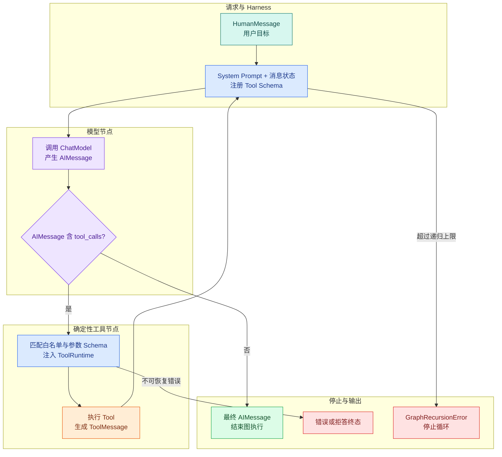

# LangChain create_agent：模型、工具与消息循环怎样闭合

## create_agent 是什么

`create_agent` 是 LangChain 用来组装模型、工具和消息循环的工厂。它返回一个可调用的状态图：模型根据消息提出 ToolCall，工具节点执行受控能力并追加 ToolMessage，模型再决定继续调用还是给出最终 AIMessage。它适合边界清楚的有限 Agent，不替代业务侧的权限、持久化、用量和终态管理。

`search_notes` Tool 只允许模型填写查询和数量，Runtime 注入可信范围，执行结果通过 **ToolMessage** 返回。现在还缺一个控制者，它要完成下面这段对话：

```text
HumanMessage  用户：访问申请在哪里？
AIMessage     模型：调用 search_notes(query="访问申请")
ToolMessage   工具：找到一条当前用户可见的说明
AIMessage     模型：根据这条说明回答入口，并在无证据时拒答
```

这四条消息就是最小 Agent 循环的可观察轨迹。模型没有直接执行函数；工具也没有直接面向用户回答。`create_agent` 在两者之间维护消息状态：调用模型、发现 **ToolCall**、执行白名单 Tool、追加 ToolMessage，再次调用模型，直到模型不再请求工具。

LangChain 1.x 的 `create_agent` 可以实际运行这条轨迹。离线 `ScriptedChatModel` 不需要 API Key，只替代模型怎样选择动作；消息协议、Tool 执行节点、ToolRuntime 注入和图递归限制都由真实 LangChain 执行。

## Agent 比固定链多的是“由模型提出下一步”

固定链在写代码时就确定顺序，例如：先检索，再生成，再校验。Agent 的控制流里有一个模型决策点：模型可以请求工具，也可以直接回答；拿到工具观察后，还能再次请求工具。

这并不意味着模型拥有无限控制权。一个可运行的 Agent 至少由两部分组成：

- **Model**：根据当前消息和工具 Schema 产生 AIMessage；
- **Harness**：包围模型的运行框架，负责 Prompt、工具列表、Middleware、状态、循环和停止边界。

LangChain 当前把这个关系概括为 `Agent = Model + Harness`。`create_agent` 是一个 Harness 工厂：输入 Model、Tools、System Prompt、Middleware、上下文与 Checkpointer 等配置，返回一个编译后的状态图。

### Agent 与单次工具调用的区别

一次函数调用只有输入和返回。Agent 循环还要保留：

- 原始用户目标；
- 每次 AIMessage 及其 ToolCall；
- 每次 ToolMessage 及其调用 ID；
- 当前调用次数、递归步数和剩余 Deadline；
- 终止原因，例如正常回答、拒答、超时或循环耗尽。

没有消息历史，第二次模型调用就看不到工具结果；没有**停止条件**，模型可以反复调用；没有工具执行边界，模型参数会直接碰到权限和外部依赖。

## create_agent 内部怎样走一圈



从数据变化看，第一轮模型读取 HumanMessage 和 Tool Schema，返回包含 `tool_calls` 的 AIMessage。工具节点逐个执行 ToolCall，并把结果追加为 ToolMessage。第二轮模型看到完整历史；若它返回普通 AIMessage，图进入结束节点，若仍返回 ToolCall，图继续循环。

图中的 `P` 不是每次把全部数据随意拼进 Prompt。Harness 会按消息协议传递历史，Middleware 还可以在模型前裁剪或总结上下文。权限、Deadline 和数据连接继续通过 Runtime 进入工具，不应写进 System Prompt 让模型决定。

失败分支也分层：参数问题可能作为 ToolMessage 让模型修正一次；权限拒绝和 Deadline 到期应由 Runtime 终止；模型始终不停止时，图递归上限负责兜底。后面会解释为什么这个上限不等于完整的业务预算。

## 四条消息分别保存什么

### HumanMessage 保存用户目标

HumanMessage 是当前用户输入，不等于认证身份。身份来自 HTTP 鉴权上下文；把 `user_id=...` 写进消息只是一段模型可见文本，不能作为权限依据。

### 第一条 AIMessage 保存候选 ToolCall

模型选择 `search_notes`，并生成 `query`、`limit` 和唯一 `id`。AIMessage 本身也会进入消息历史，下一轮模型需要同时看到“我请求了什么”和“工具返回了什么”。

### ToolMessage 保存执行观察

ToolMessage 必须使用原 ToolCall 的 ID。它的 `content` 给模型阅读，`artifact` 可以给程序保存结构化证据。`status=success` 只表示工具执行成功，不表示资料足够支持最终答案。

### 最后一条 AIMessage 表示模型不再请求工具

当 AIMessage 没有 ToolCall，标准循环会停止。此时得到的是模型候选答案；高风险系统还要执行引用、权限、敏感信息和 Claim 支持验证，不能因为循环结束就直接信任全部文字。

## `create_agent` 和历史 `AgentExecutor` 的版本边界

旧文章经常使用 `initialize_agent`、`create_react_agent` 加 `AgentExecutor`。这些 API 解释了 Agent 的历史演进，但不应在新项目中未经版本核对直接复制。

当前 LangChain 1.x 的高层入口是 `create_agent`。它返回 `CompiledStateGraph`，底层使用 LangGraph 的模型节点和工具节点。这带来三个直接结果：

1. 输入和输出是包含 `messages` 的状态，而不是只返回一个字符串；
2. 可以使用图的 `stream`、`astream`、Checkpoint 和递归限制；
3. Middleware 运行在编译图内部，而不是图外的一层日志装饰。

看到旧示例时先检查安装版本和迁移文档，不要仅凭类名相似就混用参数。本文后面的代码以实际安装的 LangChain 1.x 接口为准。

## 实践：不使用 API Key 跑真实 create_agent

### 环境、输入和预期轨迹

安装 LangChain 1.x、Pydantic 和 pytest；示例不会连接模型供应商：

```bash
# 安装 Agent、Fake 模型和测试依赖，预期轨迹由固定 AIMessage 与 ToolCall 驱动。
python3 -m venv .venv
source .venv/bin/activate
python -m pip install "langchain>=1,<2" "pydantic>=2.11,<3" "pytest>=8,<9"
```

这些命令从 `python3`、`source`、`python` 开始按顺序运行，输出用于确认“环境、输入和预期轨迹”是否成立。任何命令返回非零退出码都表示当前步骤没有完成，应先检查路径、环境和参数；不要把后续输出当成成功证据。

运行目标不是测试模型知识，而是验证 Harness 的真实控制流。输入“访问申请在哪里？”，预期消息类型依次为 Human、AI、Tool、AI；ToolMessage 的 ID 与第一条 AIMessage 中的 ToolCall ID 相同。

保存下面程序为 `simple_agent.py`：

```python
# Agent 循环把模型候选 ToolCall 交给受控工具，再将对应 ToolMessage 放回消息历史直到终态。
from __future__ import annotations

import json
from dataclasses import dataclass
from time import monotonic
from typing import Any, Literal, Sequence

from langchain.agents import create_agent
from langchain.tools import ToolRuntime, tool
from langchain_core.callbacks import CallbackManagerForLLMRun
from langchain_core.language_models import BaseChatModel
from langchain_core.messages import AIMessage, BaseMessage, HumanMessage, ToolMessage
from langchain_core.outputs import ChatGeneration, ChatResult

@dataclass(frozen=True)
class Note:
    note_id: str
    scope_id: str
    title: str
    content: str

@dataclass(frozen=True)
class RequestContext:
    actor_id: str
    scope_ids: tuple[str, ...]
    deadline_at: float
    notes: tuple[Note, ...]

# 查询函数只接收业务查询参数；可信 Scope、版本和上限由调用侧一并传入。
@tool(response_format="content_and_artifact")
def search_notes(
    query: str,
    runtime: ToolRuntime[RequestContext],
) -> tuple[str, list[dict[str, str]]]:
    """在当前用户可见的只读说明中查找操作入口和前置条件。"""
    if monotonic() >= runtime.context.deadline_at:
        raise TimeoutError("turn deadline exceeded")

    normalized = query.casefold()
    items = [
        {
            "note_id": note.note_id,
            "title": note.title,
            "content": note.content,
        }
        for note in runtime.context.notes
        # 在数据进入下游前应用可信权限范围，用户文本和模型参数都不能扩大可见集合。
        if note.scope_id in runtime.context.scope_ids
        and (normalized in note.title.casefold() or "访问" in normalized and "访问" in note.title)
    ]
    content = json.dumps(
        {"status": "ok", "count": len(items), "items": items},
        ensure_ascii=False,
    )
    return content, items

class ScriptedChatModel(BaseChatModel):
    mode: Literal["normal", "direct", "loop"] = "normal"

    @property
    def _llm_type(self) -> str:
        return "scripted-tool-calling-model"

    def bind_tools(
        self,
        tools: Sequence[Any],
        *,
        tool_choice: str | None = None,
        **kwargs: Any,
    ) -> ScriptedChatModel:
        del tool_choice, kwargs
        names = [registered_tool.name for registered_tool in tools]
        if names != ["search_notes"]:
            raise ValueError(f"unexpected tools: {names}")
        return self

    def _generate(
        self,
        messages: list[BaseMessage],
        stop: list[str] | None = None,
        run_manager: CallbackManagerForLLMRun | None = None,
        **kwargs: Any,
    ) -> ChatResult:
        del stop, run_manager, kwargs
        observations = [message for message in messages if isinstance(message, ToolMessage)]

        if self.mode == "direct":
            response = AIMessage(content="你好，我可以帮助查询公开说明。")
        elif self.mode == "loop" or not observations:
            question = next(
                str(message.content)
                for message in reversed(messages)
                if isinstance(message, HumanMessage)
            )
            response = AIMessage(
                content="",
                tool_calls=[
                    {
                        "name": "search_notes",
                        "args": {"query": question},
                        "id": f"call-{len(observations) + 1:03d}",
                        "type": "tool_call",
                    }
                ],
            )
        else:
            # 把影响结果的边界字段组成规范化载荷，缓存键不能遗漏权限或版本。
            payload = json.loads(str(observations[-1].content))
            if payload["count"] == 0:
                response = AIMessage(content="当前可见资料中没有足够证据。")
            else:
                first = payload["items"][0]
                response = AIMessage(
                    content=f"根据可见说明 {first['note_id']}：{first['content']}"
                )

        return ChatResult(generations=[ChatGeneration(message=response)])

# 构造函数把已验证字段组装成下游对象，不在这里引入新的权限或业务决策。
def build_context() -> RequestContext:
    return RequestContext(
        actor_id="user-demo",
        scope_ids=("public",),
        deadline_at=monotonic() + 5,
        notes=(
            Note("N1", "public", "访问申请", "在服务门户提交申请。"),
            Note("N2", "private", "访问申请内部审批", "仅管理员可查看。"),
        ),
    )

def run_agent(
    # question 保存原始用户输入，后续改写查询不能覆盖它。
    question: str,
    *,
    mode: Literal["normal", "direct", "loop"] = "normal",
    recursion_limit: int = 6,
) -> list[BaseMessage]:
    agent = create_agent(
        model=ScriptedChatModel(mode=mode),
        tools=[search_notes],
        context_schema=RequestContext,
        system_prompt="只根据当前可见工具结果回答；没有证据时明确拒答。",
    )
    # 用户问题进入 messages；可信 Scope、Deadline 和只读数据源由 context 注入，
    # 不允许模型通过 Tool 参数自行扩大查询范围。
    result = agent.invoke(
        {"messages": [{"role": "user", "content": question}]},
        context=build_context(),
        config={"recursion_limit": recursion_limit},
    )
    return result["messages"]

def demo() -> None:
    for index, message in enumerate(run_agent("访问申请在哪里？")):
        if isinstance(message, AIMessage) and message.tool_calls:
            detail = message.tool_calls
        elif isinstance(message, ToolMessage):
            detail = {"tool_call_id": message.tool_call_id, "content": message.content}
        else:
            detail = message.content
        print(index, type(message).__name__, detail)

if __name__ == "__main__":
    demo()
```

### 模型替身只替换模型决策

`ScriptedChatModel` 继承 LangChain 的 `BaseChatModel`。`bind_tools` 是模型适配器接收工具 Schema 的入口；示例检查注册列表只有 `search_notes`，真实供应商适配器会把这些 Schema 转成自己的请求格式。

`_generate` 模拟三种模型行为。`normal` 模式第一次返回 ToolCall，看到 ToolMessage 后返回答案；`direct` 模式直接回答，用来证明没有 ToolCall 就不会执行工具；`loop` 模式持续请求工具，用来验证停止上限。

它没有模拟模型能力、Token 计费或供应商错误。替换真实模型时，ToolCall 参数和最终措辞会变得不确定，但 Harness 的消息关系保持一致。不要把这个脚本模型的可重复性当成 LLM 的确定性。

### Tool 读取的是 Runtime context

`search_notes` 的 `query` 来自模型，`scope_ids` 和 Deadline 来自 `runtime.context`。它先检查 Deadline，再按 public 范围过滤。返回 `content_and_artifact` 后，LangChain 工具节点创建 ToolMessage，并自动使用 ToolCall ID。

这里用内存 Note 让程序离线运行。真实 Repository 应在数据库或搜索引擎查询中应用 Scope 和知识版本；Python 返回后还要防御性复核。N2 与查询相关，但它是 private，不能进入 ToolMessage。

### create_agent 维护消息与循环

`run_agent` 把模型、工具、Context Schema 和 System Prompt 交给 `create_agent`。`invoke` 的状态输入只有用户消息，可信 Context 通过独立的 `context=` 参数传入。`recursion_limit` 放在 Runnable config 中，限制编译图最多推进多少步。

返回值不是最终字符串，而是状态字典。`result["messages"]` 保存完整轨迹；应用可以从最后一条读取候选回答，也可以检查 ToolCall、ToolMessage、错误和使用量。

### 运行并逐条观察消息

```bash
# 运行后逐条核对 Human、AI、Tool 和最终 AI 消息，call_id 必须成对且步数不超上限。
python simple_agent.py
```

这些命令从 `python` 开始按顺序运行，输出用于确认“运行并逐条观察消息”是否成立。任何命令返回非零退出码都表示当前步骤没有完成，应先检查路径、环境和参数；不要把后续输出当成成功证据。

输出中的 JSON 空格可能随版本变化，但消息类型和调用关系应该稳定：

```text
0 HumanMessage 访问申请在哪里？
1 AIMessage [{'name': 'search_notes', 'args': {'query': '访问申请在哪里？'}, 'id': 'call-001', 'type': 'tool_call'}]
2 ToolMessage {'tool_call_id': 'call-001', 'content': '{"status": "ok", ...}'}
3 AIMessage 根据可见说明 N1：在服务门户提交申请。
```

第一条 AIMessage 的 content 为空并不表示调用失败；它把动作放在 `tool_calls` 字段。ToolMessage 的 `tool_call_id` 与 `call-001` 一致。最后一条 AIMessage 没有 ToolCall，所以标准循环结束。

如果只有前两条就失败，先检查 Tool 参数或 Runtime Context；如果不断出现 AI/Tool 对，说明模型没有满足停止条件；如果最终答案包含 N2，说明权限过滤失效，应立即阻断而不是调整 Prompt 掩盖问题。

## 用七个测试固定消息和停止语义

下面的测试不依赖具体回答文风。它验证消息类型、调用关联、Runtime 隐藏、范围、直接结束、空证据和递归耗尽。下面直接运行这段实现：

为了验证“用七个测试固定消息和停止语义”，下面的测试把“测试覆盖直接回答、工具成功、空结果、未知工具、参数错误、重复调用和最大步数终止”变成可执行断言。每个用例自己构造输入，并用断言固定返回值或失败状态；某条测试失败时，可以从用例名直接定位到被破坏的契约。

```python
# 测试覆盖直接回答、工具成功、空结果、未知工具、参数错误、重复调用和最大步数终止。
import pytest
from langchain_core.messages import AIMessage, HumanMessage, ToolMessage
from langgraph.errors import GraphRecursionError

from simple_agent import run_agent, search_notes

def test_normal_run_has_complete_message_loop() -> None:
    # 按角色顺序装配 system 与 user 消息；消息顺序会直接改变模型看到的指令层级。
    messages = run_agent("访问申请在哪里？")
    assert [type(message) for message in messages] == [
        HumanMessage,
        AIMessage,
        ToolMessage,
        AIMessage,
    ]

def test_tool_message_matches_original_call_id() -> None:
    # 按角色顺序装配 system 与 user 消息；消息顺序会直接改变模型看到的指令层级。
    messages = run_agent("访问申请在哪里？")
    first_ai = messages[1]
    tool_result = messages[2]
    assert isinstance(first_ai, AIMessage)
    assert isinstance(tool_result, ToolMessage)
    assert first_ai.tool_calls[0]["id"] == tool_result.tool_call_id

# 这个用例提交不受支持的工具或参数，确认请求在真正执行前被契约校验拒绝。
def test_model_schema_hides_runtime_context() -> None:
    schema = search_notes.tool_call_schema.model_json_schema()
    assert set(schema["properties"]) == {"query"}

def test_private_note_never_reaches_tool_artifact() -> None:
    messages = run_agent("访问申请在哪里？")
    tool_result = messages[2]
    assert isinstance(tool_result, ToolMessage)
    assert [item["note_id"] for item in tool_result.artifact] == ["N1"]

def test_direct_answer_does_not_execute_tool() -> None:
    # 按角色顺序装配 system 与 user 消息；消息顺序会直接改变模型看到的指令层级。
    messages = run_agent("你好", mode="direct")
    assert [type(message) for message in messages] == [HumanMessage, AIMessage]
    assert "你好" in str(messages[-1].content)

def test_empty_evidence_produces_explicit_refusal() -> None:
    # 按角色顺序装配 system 与 user 消息；消息顺序会直接改变模型看到的指令层级。
    messages = run_agent("报销规则是什么？")
    assert isinstance(messages[-2], ToolMessage)
    assert messages[-2].artifact == []
    assert messages[-1].content == "当前可见资料中没有足够证据。"

def test_non_stopping_model_hits_graph_limit() -> None:
    with pytest.raises(GraphRecursionError, match="Recursion limit"):
        run_agent("访问申请在哪里？", mode="loop", recursion_limit=5)
```

前四项固定正常链路和权限边界。ToolMessage 的 artifact 只有 N1，说明工具执行使用了 Runtime Scope；Tool Schema 只有 query，说明模型无法生成 scope 或 Deadline。

第五项证明 Agent 不等于“每次必须调用工具”。对于寒暄、格式转换或已有上下文足够的问题，模型可以返回没有 ToolCall 的 AIMessage，循环立即结束。

第六项把“工具成功但没有证据”与工具异常分开。它仍产生 ToolMessage，但最终回答明确资料不足。第七项使用真实 `GraphRecursionError` 证明持续调用不会无限运行。

执行：

```bash
# pytest 失败时会暴露消息配对或停止条件变化，不能只检查最终字符串。
pytest -q
```

预期 `7 passed`。如果递归测试没有停止，不要继续提高限制来掩盖循环；先检查模型为何反复选择同一工具、ToolMessage 是否被正确配对、System Prompt 是否给出停止规则。测试完成后没有数据库和远程资源需要清理。

## 三种“上限”不能混为一个参数

### recursion_limit 限制图推进步数

一个工具调用通常涉及模型节点和工具节点，多次调用会消耗更多图步数。`recursion_limit=6` 不是“最多调用六次工具”，也不是六秒超时。它只是防止状态图长期不触发停止条件。

### 工具调用预算限制业务动作数量

应用可以单独规定每个 Turn 最多调用多少次 Tool、某个昂贵工具最多几次、并行调用最多多少个。这个预算要进入显式状态或 Middleware，并记录每次消耗。它比图步数更贴近成本和外部依赖压力。

### Deadline 限制整轮墙钟时间

Deadline 是绝对截止时刻。模型、工具、重试和验证都共享剩余时间。把每次调用设置为 20 秒，不能阻止三次调用累计到 60 秒；每个子调用都要从同一个 Deadline 计算剩余 timeout。

| 限制 | 约束对象 | 到达时的动作 |
| --- | --- | --- |
| `recursion_limit` | 图节点推进次数 | 抛 GraphRecursionError，转换成循环耗尽终态 |
| tool/model call budget | 调用数量与成本 | 阻止下一次调用，返回预算耗尽 |
| absolute Deadline | 整个 Turn 的墙钟时间 | 传播取消，释放模型和工具资源 |

企业 Runtime 通常三者同时使用。只设置 recursion limit，无法处理慢工具；只设置 timeout，无法阻止快速死循环；只限制工具次数，模型本身仍可能重复推理。

## 正常终态与答案可信度的区别

`create_agent` 的标准停止条件是模型不再返回 ToolCall。它不知道你的业务要求“每个事实必须有可见证据”，也不知道 N1 是否仍属于当前知识版本。

在只读知识 Agent 中，最后一条 AIMessage 之后通常还要经过：

1. 将答案拆成可验证 Claim；
2. 检查每个 Claim 是否绑定 Tool artifact 或检索 Evidence；
3. 验证引用位置、Scope、Release 和内容哈希；
4. 检查敏感信息与提示注入影响；
5. 允许一次受限修复，仍失败则拒答。

简单演示把这些留到后面的可信运行部分。这里需要记住：循环终止是控制流结果，答案可信是业务验证结果。

## 什么时候简单 Agent 已经足够

适合继续使用 `create_agent` 高层 Harness 的场景：

- 工具数量少，调用主要是串行；
- 任务在单次请求内结束；
- 只需要标准模型 → 工具 → 模型循环；
- Middleware 足以表达日志、重试、限流和简单上下文处理；
- 不要求外部系统观察每个业务状态。

需要显式 LangGraph 或独立 Runtime 的信号：

- 先理解问题，再并行多路检索和融合；
- Planner、Research、Validate、Repair 有独立状态与上限；
- 长任务需要 Checkpoint、取消、断线恢复和重放；
- Worker 需要 Lease、任务所有权和停滞恢复；
- 权限快照、知识版本与证据预算要贯穿所有节点；
- 每个状态变化都要持久化事件和审计。

这不是按代码行数判断。核心问题是：业务是否需要显式观察、恢复和验证中间状态。如果需要，把所有逻辑继续塞进 Tool 或 Middleware 会使状态重新变得隐形。

## 真实模型接入时还要验证什么

把 `ScriptedChatModel` 换成供应商 ChatModel 后，至少增加以下契约测试：

- 目标模型是否支持 Tool Calling；
- Tool Schema 的嵌套、枚举和 additionalProperties 是否兼容；
- refusal、内容过滤和截断怎样表示；
- 并行 ToolCall 的 ID 是否稳定且唯一；
- 流式 ToolCall 参数能否正确合并；
- 模型不调用工具时，答案验证器能否阻断无证据事实；
- 模型版本变化后，工具选择率、循环次数和空证据拒答是否回归。

不要把本地脚本模型测试删掉。它负责快速验证 Harness 和业务边界；真实模型测试负责验证供应商协议与行为。两层测试解决不同问题。

## 怎样判断最小 Agent 已经跑对

- 输入消息、可信 Context 和 Runnable config 分开传递；
- Model 只收到需要的消息和 Tool Schema；
- ToolCall 先经过白名单、参数、权限和 Deadline；
- ToolMessage 与原调用 ID 一一对应；
- 空结果、工具错误、权限拒绝和循环耗尽有不同状态；
- recursion limit、调用预算和 Deadline 分别设置；
- 最终 AIMessage 还要经过答案与证据验证；
- Trace 能还原每次模型调用、工具调用和停止原因；
- 真实模型之外保留确定性模型替身测试；
- 中间状态需要恢复时及时进入显式 LangGraph 设计。

## 从一次 search 演进到 search 后按 ID 读取

在脚本中增加第二个工具 `get_note(note_id)`，让模型先 search，再按返回 ID fetch：

1. 正常轨迹变成 Human → AI(search) → Tool(search) → AI(get) → Tool(get) → AI(final)；
2. `get_note` 只能读取本轮 search artifact 中的候选 ID；
3. 两次 ToolCall 使用不同 ID；
4. 设置单个工具最多一次、总工具最多两次；
5. search 空结果时不得调用 get；
6. get 超时时不得把 search 摘要冒充详情；
7. 将 recursion limit、调用预算和 Deadline 分别写入测试。

完成后再为 `loop` 模式打印每一步的模型和工具事件。


**一个简单 LangChain Agent 内部到底循环了什么？**

每轮把当前 Messages 交给模型；若返回普通 AIMessage 就结束，若返回 ToolCall，Runtime 校验并执行工具，再追加匹配的 ToolMessage，随后重新调用模型。循环状态至少包含消息、步骤、已见动作和剩余时间。`create_agent` 封装了图与工具节点，但应用仍要设置工具白名单、可信 Context、停止条件和失败终态。

**为什么 ToolCall 后必须追加对应的 ToolMessage？**

模型需要知道某个调用 ID 的真实观察，才能决定回答或继续行动。ToolMessage 应包含相同 ID、结构化成功或错误结果，并保持调用顺序；缺失或错配会导致供应商拒绝消息，或模型重复工具。多个 ToolCall 并行执行时也要按 ID 关联，不能只把几个结果拼成一段无来源文本。

**怎样防止 Agent 重复调用同一个工具？**

Runtime 可把工具名和规范化参数组成稳定 action key，在执行前与本轮已见集合比较；重复时停止、改写或进入有限纠正，而不是再次消耗依赖。还要同时设置 max_steps 与绝对 Deadline，因为参数轻微变化可能绕过完全相等判断。Trace 中记录候选、是否执行和停止原因，才能区分模型重复与工具重试。

**寒暄是否也应该进入工具 Agent？**

通常不需要。入口 Router 可以把寒暄、输入不足和明确危险请求走短路径，避免为一句“你好”发送工具 Schema、启动循环和占用检索资源。Router 只做有限分类，知识问题才进入 Agent；权限与安全检查仍在入口执行。是否短路应由可测试规则或结构化分类决定，不应靠工具返回空结果后再猜。

**一次返回多个 ToolCall 时应该串行还是并行？**

先分析工具之间是否有数据依赖、共享资源和副作用。互相独立的只读查询可以在并发上限内并行，结果按调用 ID 合并；后一个查询依赖前一个实体时必须串行。并行分支要有各自超时和统一 Join，ACL 失败通常阻断整轮，非关键辅助数据超时可以降级。不能只因为模型一次给出多个调用就默认并发。

**为什么这个简单 Agent 还不能直接当企业 Runtime？**

它通常在单进程内保存 Messages，缺少持久化 Turn、幂等提交、任务所有权、Lease、版本快照、事件重放、Checkpoint 和最终权限复核。进程退出或浏览器断线时，状态与副作用边界都不明确。简单 Agent 适合用来理解模型和工具的循环；当请求变长、分支增多或需要恢复时，应把状态放入显式 Runtime，不要继续在回调里堆逻辑。
