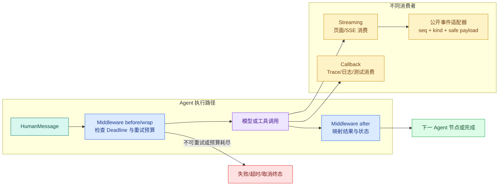

# LangChain Streaming、Callback、Middleware 与有限重试

Streaming、Callback 和 Middleware 是 LangChain Runtime 的三种不同扩展点。Streaming 把运行数据送给调用方，Callback 旁路记录生命周期，Middleware 进入执行路径并包裹模型或工具调用。三者都围绕同一次 Agent 运行，但只有 Middleware 会改变是否继续、重试或终止。

它们分别用于构造进度 UI、记录 Trace，以及在共享 Deadline 内控制错误恢复。三者都位于 Agent Runtime 的执行扩展层；区分数据路径后，才能知道哪些事件可以公开、哪些逻辑可以重试。

直接调用 `create_agent` 并等待 `result["messages"]` 时，调用方只能在最后看到结果。一次真实知识查询可能在检索、工具和模型阶段停留数秒；页面需要知道“正在查资料”，运维需要知道“哪次模型调用**重试**了”，Runtime 还要在客户端取消后停止下游工作。

这三个需求看起来都在“观察过程”，却对应不同机制：

- **Streaming** 把运行中的数据交给调用方，例如页面或 SSE 适配器；
- **Callback** 旁路观察框架生命周期，常用于 Trace、日志、Token 统计和测试；
- **Middleware** 位于 Agent 执行路径中，可以在模型或工具调用前后检查、包装、重试或终止。

如果把它们写成一个 `print()`，页面协议会依赖框架内部对象，日志可能泄露原始证据，重试也无法共享 Deadline。同一个只读 `search_notes` Agent 可以分离这些职责：工具发出自定义进度，Streaming 转成稳定公开事件，Callback 只记录生命周期名称，**Middleware** 对短暂模型连接错误最多重试一次。

System、Human、AI 与 Tool 四类消息构成输入；产出的事件、Deadline 和**取消**语义还会进入 SSE 序列、断线重放和任务终态。

## 同步、流式与事件数据路径



**Streaming** 和 Callback 都能看到模型或工具活动，但消费者不同。Streaming 是业务输出的一部分，要考虑序号、断线、重放和终态；Callback 是旁路观测，回调失败不应随意改变答案。Middleware 则在主执行链上，它是否调用内部 handler、调用几次、抛出什么错误，都会影响 Agent 结果。

图中的公开**事件**适配器非常关键。LangChain 的 Python 消息对象适合进程内开发，却不是稳定的浏览器协议；版本升级可能改变内部字段，原始 ToolMessage 还可能包含不该公开的 artifact。应用需要把框架事件转换成自己的 `kind + seq + safe payload`。

## Streaming 的三个常用模式

当前 LangChain Agent 继承编译图的流式接口。`stream`/`astream` 可以使用不同 `stream_mode`：

| 模式 | 主要数据 | 适合谁 | 注意点 |
| --- | --- | --- | --- |
| `updates` | 每个图步骤完成后的状态更新 | 进度 UI、调试、业务事件适配器 | 是节点更新，不是逐 Token |
| `messages` | 模型消息块与节点 metadata | Token/ToolCall 参数增量展示 | 供应商要真正支持流式块 |
| `custom` | 节点或工具主动写出的自定义数据 | 解析进度、检索阶段、批次进度 | 先定义允许公开的 Schema |

可以一次订阅多个模式。使用 v2 事件封装时，每项包含 `type`、命名空间 `ns` 和 `data`。例如 `updates` 的 `data` 可能是 `{"tools": {"messages": [...]}}`，`custom` 的 `data` 则是工具写入的普通字典。

### updates 是状态变化，不是文字动画

对最小 Agent，updates 通常依次出现：

1. `model` 节点输出带 ToolCall 的 AIMessage；
2. `tools` 节点输出 ToolMessage；
3. `model` 节点输出最终 AIMessage。

这适合显示“已请求工具、工具已完成、答案已完成”。它不会自动把一段答案拆成字符。

### messages 是否逐 Token 取决于模型适配器

真实流式供应商会产生 AIMessageChunk，`messages` 模式可以连续收到文本块或 ToolCall 参数块。本文的离线脚本模型只实现完整 `_generate`，所以它会一次交出完整消息。这个差异是有意保留的：框架支持 streaming 不等于目标模型一定逐 Token 返回。

工具调用参数也可能分多个 chunk 到达。在参数 JSON 完整并通过 Schema 校验前，页面可以展示“模型正在准备工具”，执行器不能提前运行半截参数。

### custom 由业务代码定义

长工具可以通过 `ToolRuntime.stream_writer` 发出安全进度，例如 `{"kind": "tool_progress", "stage": "searching"}`。它适合表示已进入哪个阶段，不适合把每条原始数据库记录直接推到浏览器。

custom event 仍是运行中提示。只有最终 ToolMessage 和业务终态能说明操作结果；进度写出后工具仍可能失败或取消。

## Callback 观察生命周期，但不承担公开协议

**Callback** Handler 可以接收 chat model start/end、tool start/end、chain start/end、错误和自定义事件。它适合：

- 创建 Trace span 并记录父子 run ID；
- 统计模型调用次数、耗时和 Token；
- 记录工具名、状态和安全错误码；
- 在测试中证明执行了哪些组件。

Callback 中不要把原始问题、完整 Prompt、证据正文、密钥或用户标识放进低基数指标标签。Trace 若需要内容级调试，应放到受权限和保留周期控制的存储中。

Callback 原则上不改变业务结果。需要阻止调用、修改请求或重试时，应使用 Middleware 或显式 Runtime 节点。否则一个看似“日志回调”的异常会让业务行为难以推演。

## Middleware 位于真正的执行路径

Middleware 有两类常见 Hook：

| Hook 类型 | 典型位置 | 适合操作 |
| --- | --- | --- |
| node-style | `before_agent`、`before_model`、`after_model`、`after_agent` | 检查、记录、状态更新、受控跳转 |
| wrap-style | `wrap_model_call`、`wrap_tool_call` | 重试、fallback、缓存、调用级错误映射 |

Wrap Hook 接收一个 `handler`。调用零次相当于短路，一次是正常执行，多次就是重试。这个能力很强，也意味着每次多调用都要受预算、Deadline 和幂等语义约束。

Middleware 不是独立于 Agent 的另一套运行时。`create_agent` 会把 Hook 编进底层 LangGraph。将整个 Agent 作为子图放入更大流程时，这些 Hook 仍会跟随执行。

## 重试先按错误分类，再计算剩余时间

“失败就重试三次”会制造新的问题。先判断失败是否可能通过原样重放恢复：

| 失败 | 原样重试是否有意义 | 原因 |
| --- | ---: | --- |
| 临时连接中断 | 有，次数有限 | 依赖可能已恢复 |
| 429/部分 5xx | 可能 | 需要遵守 Retry-After 和剩余 Deadline |
| 参数 Schema 错误 | 没有 | 相同请求仍然非法 |
| 认证或权限拒绝 | 没有 | 重试不会产生权限 |
| 上下文超限 | 没有 | 需要先压缩或裁剪 |
| 工具成功但无结果 | 没有 | 这是业务观察，不是传输失败 |
| CancelledError | 没有 | 调用方已要求停止，应向下传播 |

每轮重试还要从同一个绝对 Deadline 计算剩余时间。假设 Turn 在 `12:00:10` 截止，第一次模型调用用了 7 秒，第二次最多只剩 3 秒；重试不能重新获得完整 10 秒。

## 实践：流出稳定事件并限制模型重试

### 环境和观察目标

安装 LangChain 1.x 与 pytest：

```bash
# 安装流式、Callback 与测试依赖，Fake 适配器会产生可控 token、错误和取消信号。
python3 -m venv .venv
source .venv/bin/activate
python -m pip install "langchain>=1,<2" "pytest>=8,<9"
```

这些命令从 `python3`、`source`、`python` 开始按顺序运行，输出用于确认“环境和观察目标”是否成立。任何命令返回非零退出码都表示当前步骤没有完成，应先检查路径、环境和参数；不要把后续输出当成成功证据。

程序会运行一个 Agent，订阅 `updates` 与 `custom`，再把内部事件映射成四个公开事件：`tool_requested`、`tool_progress`、`tool_completed`、`answer_completed`。脚本模型可以在第一次调用抛 `ConnectionError`，Middleware 只允许两次总尝试，并让所有尝试共享 RequestContext 中的 Deadline。

下面直接运行这段实现：

```python
# Middleware 在调用前后记录版本与预算，Streaming 逐事件输出，重试只包住声明可恢复的适配器调用。
from __future__ import annotations

import asyncio
import json
from collections.abc import Awaitable, Callable, Sequence
from dataclasses import dataclass
from time import monotonic
from typing import Any
from uuid import UUID

from langchain.agents import create_agent
from langchain.agents.middleware import AgentMiddleware, ModelRequest, ModelResponse
from langchain.tools import ToolRuntime, tool
from langchain_core.callbacks import BaseCallbackHandler, CallbackManagerForLLMRun
from langchain_core.language_models import BaseChatModel
from langchain_core.messages import AIMessage, BaseMessage, HumanMessage, ToolMessage
from langchain_core.outputs import ChatGeneration, ChatResult

@dataclass(frozen=True)
class Note:
    note_id: str
    scope_id: str
    title: str
    content: str

@dataclass(frozen=True)
class RequestContext:
    scope_ids: tuple[str, ...]
    deadline_at: float
    notes: tuple[Note, ...]
# PublicEvent 保存可排序、可重放的事件状态，让断线恢复仍能重建相同执行轨迹。

@dataclass(frozen=True)
class PublicEvent:
    seq: int
    kind: str
    data: dict[str, Any]
    terminal: bool = False

@tool(response_format="content_and_artifact")
def search_notes(
    query: str,
    runtime: ToolRuntime[RequestContext],
) -> tuple[str, list[dict[str, str]]]:
    """在当前用户可见的只读说明中查找操作入口。"""
    runtime.stream_writer({"kind": "tool_progress", "stage": "searching"})
    # 外部调用前检查整轮剩余时间；超时后停止继续消耗模型、工具和数据库资源。
    if monotonic() >= runtime.context.deadline_at:
        raise TimeoutError("turn deadline exceeded")

    items = [
        {"note_id": note.note_id, "title": note.title, "content": note.content}
        for note in runtime.context.notes
        if note.scope_id in runtime.context.scope_ids and "访问" in query and "访问" in note.title
    ]
    content = json.dumps(
        {"status": "ok", "count": len(items), "items": items},
        ensure_ascii=False,
    )
    return content, items

class ScriptedChatModel(BaseChatModel):
    failures_before_success: int = 0
    delay_seconds: float = 0.0

    @property
    def _llm_type(self) -> str:
        return "scripted-streaming-model"

    def bind_tools(
        self,
        tools: Sequence[Any],
        *,
        tool_choice: str | None = None,
        **kwargs: Any,
    ) -> ScriptedChatModel:
        del tool_choice, kwargs
        if [registered.name for registered in tools] != ["search_notes"]:
            raise ValueError("unexpected tool registration")
        return self

    def _generate(
        self,
        messages: list[BaseMessage],
        stop: list[str] | None = None,
        run_manager: CallbackManagerForLLMRun | None = None,
        **kwargs: Any,
    ) -> ChatResult:
        del stop, run_manager, kwargs
        if self.failures_before_success > 0:
            self.failures_before_success -= 1
            raise ConnectionError("temporary model connection error")

        observations = [message for message in messages if isinstance(message, ToolMessage)]
        # 第一轮还没有工具观察，Planner 只能先产生查询动作，不能直接给最终答案。
        if not observations:
            question = next(
                str(message.content)
                for message in reversed(messages)
                if isinstance(message, HumanMessage)
            )
            response = AIMessage(
                content="",
                tool_calls=[
                    {
                        "name": "search_notes",
                        "args": {"query": question},
                        "id": "call-001",
                        "type": "tool_call",
                    }
                ],
            )
        else:
            payload = json.loads(str(observations[-1].content))
            response = AIMessage(
                content=(
                    f"根据可见说明：{payload['items'][0]['content']}"
                    if payload["count"]
                    else "当前可见资料中没有足够证据。"
                )
            )
        return ChatResult(generations=[ChatGeneration(message=response)])

    async def _agenerate(
        self,
        messages: list[BaseMessage],
        stop: list[str] | None = None,
        run_manager: Any = None,
        **kwargs: Any,
    ) -> ChatResult:
        if self.delay_seconds:
            await asyncio.sleep(self.delay_seconds)
        return self._generate(messages, stop, run_manager, **kwargs)

class DeadlineRetryMiddleware(AgentMiddleware):
    def __init__(self, *, max_attempts: int = 2) -> None:
        super().__init__()
        self.max_attempts = max_attempts

    async def awrap_model_call(
        self,
        request: ModelRequest,
        handler: Callable[[ModelRequest], Awaitable[ModelResponse]],
    ) -> ModelResponse:
        last_error: Exception | None = None
        for attempt in range(1, self.max_attempts + 1):
            remaining = request.runtime.context.deadline_at - monotonic()
            # 外部调用前检查整轮剩余时间；超时后停止继续消耗模型、工具和数据库资源。
            if remaining <= 0:
                raise TimeoutError("turn deadline exceeded before model call")
            try:
                async with asyncio.timeout(remaining):
                    return await handler(request)
            except ConnectionError as error:
                last_error = error
                if attempt == self.max_attempts:
                    break
                await asyncio.sleep(min(0.01, max(0.0, remaining / 10)))
        raise ConnectionError("model retry budget exhausted") from last_error

class RecordingCallback(BaseCallbackHandler):
    def __init__(self) -> None:
        self.events: list[str] = []

    def on_chat_model_start(
        self,
        serialized: dict[str, Any],
        messages: list[list[BaseMessage]],
        *,
        run_id: UUID,
        parent_run_id: UUID | None = None,
        **kwargs: Any,
    ) -> Any:
        del serialized, messages, run_id, parent_run_id, kwargs
        self.events.append("model_start")

    def on_llm_end(
        self,
        response: Any,
        *,
        run_id: UUID,
        parent_run_id: UUID | None = None,
        **kwargs: Any,
    ) -> Any:
        del response, run_id, parent_run_id, kwargs
        self.events.append("model_end")

    def on_tool_start(
        self,
        serialized: dict[str, Any],
        input_str: str,
        *,
        run_id: UUID,
        parent_run_id: UUID | None = None,
        **kwargs: Any,
    ) -> Any:
        del serialized, input_str, run_id, parent_run_id, kwargs
        self.events.append("tool_start")

    def on_tool_end(
        self,
        output: Any,
        *,
        run_id: UUID,
        parent_run_id: UUID | None = None,
        **kwargs: Any,
    ) -> Any:
        del output, run_id, parent_run_id, kwargs
        self.events.append("tool_end")

# 构造函数把已验证字段组装成下游对象，不在这里引入新的权限或业务决策。
def build_context(*, expired: bool = False) -> RequestContext:
    return RequestContext(
        scope_ids=("public",),
        deadline_at=monotonic() + (-1 if expired else 5),
        notes=(Note("N1", "public", "访问申请", "在服务门户提交申请。"),),
    )

# 构造函数把已验证字段组装成下游对象，不在这里引入新的权限或业务决策。
def build_agent(model: ScriptedChatModel):
    return create_agent(
        model=model,
        tools=[search_notes],
        middleware=[DeadlineRetryMiddleware(max_attempts=2)],
        context_schema=RequestContext,
        system_prompt="只根据当前可见工具结果回答。",
    )

def to_public_event(raw_event: dict[str, Any], seq: int) -> PublicEvent | None:
    event_type = raw_event["type"]
    data = raw_event["data"]
    if event_type == "custom":
        return PublicEvent(seq, "tool_progress", {"stage": data["stage"]})

    node, update = next(iter(data.items()))
    message = update["messages"][-1]
    if node == "model" and isinstance(message, AIMessage) and message.tool_calls:
        call = message.tool_calls[0]
        return PublicEvent(seq, "tool_requested", {"name": call["name"]})
    if node == "tools" and isinstance(message, ToolMessage):
        return PublicEvent(
            seq,
            "tool_completed",
            {"name": message.name, "status": message.status},
        )
    if node == "model" and isinstance(message, AIMessage):
        return PublicEvent(seq, "answer_completed", {"text": str(message.content)}, True)
    return None

async def stream_agent(
    model: ScriptedChatModel | None = None,
    *,
    context: RequestContext | None = None,
) -> tuple[list[PublicEvent], list[str]]:
    callback = RecordingCallback()
    public_events: list[PublicEvent] = []
    agent = build_agent(model or ScriptedChatModel())

    async for raw_event in agent.astream(
        {"messages": [{"role": "user", "content": "访问申请在哪里？"}]},
        # 调用方可以传入过期上下文测试 Deadline；正常路径则创建五秒预算。
        context=context or build_context(),
        config={"callbacks": [callback], "recursion_limit": 6},
        stream_mode=["updates", "custom"],
        version="v2",
    ):
        public = to_public_event(raw_event, len(public_events) + 1)
        if public is not None:
            public_events.append(public)
    return public_events, callback.events

async def demo() -> None:
    events, callbacks = await stream_agent()
    for event in events:
        print(event.seq, event.kind, event.data, "terminal=" + str(event.terminal))
    print("callbacks", callbacks)

if __name__ == "__main__":
    asyncio.run(demo())
```

### 工具怎样产生 custom 进度

`search_notes` 在真正查询前调用 `runtime.stream_writer`。写出的字典只包含阶段名，不包含查询原文和证据内容。随后它检查 Deadline、按 Scope 过滤并返回 ToolMessage 数据。进度事件先到并不保证工具成功，调用方必须等待 `tool_completed` 或失败终态。

### 脚本模型怎样支持重试和取消实验

`failures_before_success` 控制前几次模型调用抛出 `ConnectionError`，用于测试可重试失败。`delay_seconds` 在异步 `_agenerate` 中等待，用于模拟长模型调用；Task 被取消时，`asyncio.sleep` 会收到 CancelledError。

脚本模型没有实现逐 Token `_astream`，所以本文订阅节点 updates 与业务 custom。接入真实流式模型后可增加 `messages` 模式；公开协议仍应经过 `to_public_event` 适配，不直接序列化 AIMessageChunk。

### Middleware 怎样共享 Deadline

`DeadlineRetryMiddleware.awrap_model_call` 包围每次异步模型调用。每轮开始都用 `deadline_at - monotonic()` 计算剩余时间，再用 `asyncio.timeout(remaining)` 约束 handler。它只捕获 `ConnectionError`，不会吞掉 CancelledError、权限错误或程序异常。

`max_attempts=2` 表示总尝试次数是两次，即第一次加一次重试。命名成 attempts 可以避免“max_retries=2 到底是总共两次还是额外两次”的歧义。短暂 backoff 也消耗同一个 Deadline。

### Callback 记录什么

`RecordingCallback` 只记录 `model_start/model_end/tool_start/tool_end`，用于测试执行轨迹。真实 Trace 可以用 run ID 和 parent run ID 连接父子调用，再记录耗时、状态、模型名和 Token 数。

示例刻意不保存 `input_str`、完整 response 和 Tool output。那些对象可能包含用户问题与证据；Callback 接收到不等于可以无条件写日志。

### 公开事件适配器怎样裁剪内部对象

`to_public_event` 识别 v2 envelope 的 `type`。custom 事件只保留 stage；updates 事件根据 node 和最后一条消息映射为稳定 kind。ToolMessage 对外只暴露工具名与状态，不暴露 artifact。

`seq` 在本例内存中递增。真实异步任务需要把序号和事件一起持久化，保证断线重放后仍然单调；多个 Worker 也不能各自从 1 开始生成同一 Turn 的序号。

### 运行并观察两条轨迹

```bash
# 分别运行成功流与一次暂时失败，核对 token 顺序、attempt、Deadline 和最终关闭事件。
python streaming_agent.py
```

这些命令从 `python` 开始按顺序运行，输出用于确认“运行并观察两条轨迹”是否成立。任何命令返回非零退出码都表示当前步骤没有完成，应先检查路径、环境和参数；不要把后续输出当成成功证据。

预期公开事件是：

```text
1 tool_requested {'name': 'search_notes'} terminal=False
2 tool_progress {'stage': 'searching'} terminal=False
3 tool_completed {'name': 'search_notes', 'status': 'success'} terminal=False
4 answer_completed {'text': '根据可见说明：在服务门户提交申请。'} terminal=True
callbacks ['model_start', 'model_end', 'tool_start', 'tool_end', 'model_start', 'model_end']
```

两个 model start/end 对应工具前后的两次模型调用；一对 tool start/end 对应一次搜索。Callback 顺序是框架内部轨迹，公开事件则是产品协议，两者不需要使用相同名称。

若 tool_progress 后没有后续事件，说明 Runtime 缺少失败或取消终态；若 answer_completed 出现两次，检查重试是否在已经公开最终结果后重新执行；若公开事件包含完整 Note artifact，说明适配器裁剪失败。

## 七个测试验证流、重试、Deadline 和取消

测试使用 `asyncio.run`，不额外依赖 pytest-asyncio。下面直接运行这段实现：

为了验证“七个测试验证流、重试、Deadline 和取消”，下面的测试把“测试确保流事件有序、重试不重复副作用、Deadline 不重置、取消保持控制信号”变成可执行断言。每个用例自己构造输入，并用断言固定返回值或失败状态；某条测试失败时，可以从用例名直接定位到被破坏的契约。

```python
# 测试确保流事件有序、重试不重复副作用、Deadline 不重置、取消保持控制信号。
import asyncio

import pytest

from streaming_agent import (
    ScriptedChatModel,
    build_agent,
    build_context,
    stream_agent,
)

# 这个用例同时固定事件顺序、单调序号和唯一终态，避免客户端恢复出不同状态。
def test_public_event_order_and_terminal() -> None:
    events, _ = asyncio.run(stream_agent())
    assert [event.kind for event in events] == [
        "tool_requested",
        "tool_progress",
        "tool_completed",
        "answer_completed",
    ]
    assert [event.seq for event in events] == [1, 2, 3, 4]
    assert [event.terminal for event in events] == [False, False, False, True]

def test_public_tool_event_does_not_expose_artifact() -> None:
    events, _ = asyncio.run(stream_agent())
    completed = events[2]
    assert set(completed.data) == {"name", "status"}

def test_callbacks_observe_two_model_calls_and_one_tool() -> None:
    _, callbacks = asyncio.run(stream_agent())
    assert callbacks == [
        "model_start",
        "model_end",
        "tool_start",
        "tool_end",
        "model_start",
        "model_end",
    ]

# 这个用例走失败或拒绝分支，确认错误码、终态和副作用都符合契约。
def test_one_transient_model_failure_is_retried() -> None:
    model = ScriptedChatModel(failures_before_success=1)
    events, _ = asyncio.run(stream_agent(model))
    assert events[-1].kind == "answer_completed"
    assert model.failures_before_success == 0

# 这个用例推进重试分支，确认次数预算耗尽后停止而不是无限再次调用。
def test_retry_budget_exhaustion_stays_connection_error() -> None:
    model = ScriptedChatModel(failures_before_success=3)
    with pytest.raises(ConnectionError, match="retry budget exhausted"):
        asyncio.run(stream_agent(model))

# 这个用例把时间推进到截止边界，确认超时保持独立错误语义并释放资源。
def test_expired_deadline_stops_before_model_call() -> None:
    with pytest.raises(TimeoutError, match="deadline exceeded"):
        asyncio.run(stream_agent(context=build_context(expired=True)))

# 这个用例主动取消运行，确认取消信号不会被重试或普通异常处理吞掉。
def test_task_cancellation_is_not_converted_to_retry() -> None:
    async def cancel_slow_run() -> None:
        agent = build_agent(ScriptedChatModel(delay_seconds=10))
        task = asyncio.create_task(
            agent.ainvoke(
                {"messages": [{"role": "user", "content": "访问申请在哪里？"}]},
                # 使用正常 Deadline，确保取消来自 task.cancel() 而不是超时分支。
                context=build_context(),
            )
        )
        await asyncio.sleep(0.01)
        task.cancel()
        with pytest.raises(asyncio.CancelledError):
            await task

    asyncio.run(cancel_slow_run())
```

第一项同时固定顺序、单调序号和唯一终态。第二项检查公开 Tool 事件没有泄露 artifact。第三项用 Callback 证明 Agent 实际调用了两次模型和一次工具。

第四项让第一次模型调用失败，第二次在同一 Deadline 内恢复。第五项证明总尝试两次后仍抛 ConnectionError，没有无限循环。第六项在模型调用前就发现 Deadline 已过，因此不应该出现公开进度。

第七项创建慢模型 Task，主动取消后断言 CancelledError 原样传播。Middleware 只捕获 ConnectionError，所以取消不会被当成短暂网络错误再次发起模型调用。

运行：

```bash
# pytest 同时断言输出事件与适配器调用次数，防止“界面结束”掩盖后台仍在重试。
pytest -q
```

`pytest` 会依次执行事件、Callback、重试、Deadline 和取消七条路径，预期返回 `7 passed`。失败时先按测试名定位边界：顺序错误检查 `to_public_event`，重试次数错误检查 Middleware 的 attempt 循环，取消变成 ConnectionError 则检查异常捕获范围。

取消测试只等待 0.01 秒，不会真的睡满 10 秒；若整组测试明显变慢，说明底层异步模型调用没有响应 Task 取消。测试不启动 HTTP 服务，也不产生需要清理的数据。

## 部分 Token 发出后为什么很难重试

假设模型已经向页面发送“请在服务”，连接随后中断。若 Middleware 重新调用模型，新流可能再次从“请在”开始，页面会看到重复文本；更糟糕的是，第二次生成的措辞可能完全不同。

常见策略有三种：

1. 在可接受延迟内先缓冲，达到安全边界后再公开；
2. 每次尝试带 `attempt`，重试时发 `attempt_replaced`，客户端丢弃旧尝试内容；
3. 一旦公开不可撤回内容，就不做透明重试，改为失败终态或显式继续。

ToolCall 参数流也有同样问题。半截 JSON 只能展示，不能执行；重试后新的 ToolCall ID 不能和旧调用结果混用。

## 客户端断开不自动等于任务取消

浏览器关闭 SSE 连接，只证明传输消费者离开。后台可能仍在 Worker 中运行，也可能需要继续完成并支持重放。产品要先决定语义：

- **同步轻任务**：断开即请求取消，传播到模型与工具；
- **后台长任务**：断开不取消，事件持久化，用户重连后继续读取；
- **用户显式取消**：无论是否在线，都写入 cancel_requested 并让 Runtime 收敛到 cancelled。

不要在网络层静默猜测。传输断线、任务取消和最终 cancelled 是三个状态。完整 Runtime 还要记录取消请求时间、下游是否响应和迟到结果怎样丢弃。

## 从 LangChain 事件到 SSE 还缺哪些能力

本文的 PublicEvent 已经有 seq、kind、data 和 terminal，但生产 SSE 还需要：

- 持久化 event_id 与单调序号；
- `Last-Event-ID` 或游标重放；
- 心跳与代理缓冲配置；
- 多 Worker 下的唯一写入者或原子序号；
- 慢消费者的缓存上限和断开策略；
- token 类瞬时事件与状态类可重放事件的区别；
- 终态之后拒绝新业务事件；
- SSE 不可用时的轮询终态入口。

这些属于 Agent Runtime 的事件平面，不应该全部塞进 LangChain Callback。

## 事件、观测和重试的落地顺序

1. 先定义业务事件 kind、payload、seq 和终态，不直接暴露框架对象。
2. 决定使用 updates、messages、custom 中的哪些源数据。
3. 对每个公开字段做隐私与大小检查。
4. Callback 只记录安全的调用关系、耗时、状态和计量。
5. Middleware 只处理明确的横切逻辑，权限与业务状态仍显式存在。
6. 为错误建立可重试分类，不使用宽泛 `except Exception`。
7. 所有尝试共享绝对 Deadline、调用预算和资源槽。
8. 明确部分输出后的重试策略。
9. 明确传输断线、用户取消和后台继续之间的产品语义。
10. 测试正常、临时失败、耗尽、超时、取消、慢消费者和唯一终态。

## 把 PublicEvent 演进成可重放协议

把 `PublicEvent` 扩展为可重放事件协议：

1. 加入 `turn_id`、`event_id`、`attempt` 和 `created_at`；
2. token delta 标记为 transient，stage 和 terminal 标记为 replayable；
3. 模拟第一次模型流发出两个 delta 后失败；
4. 选择“替换旧 attempt”或“不透明重试”并写出客户端状态机；
5. 用户取消时依次产生 cancel_requested、cancel_propagated、cancelled；
6. 终态后写入任何事件都应失败；
7. 重连从 last_seq + 1 开始读取，不能重复应用终态。

固定 Retriever 接进 Agent 后仍沿用这里的事件边界，同时还要处理 Document、Scope、Release、Evidence，以及何时从固定 2-Step RAG 升级到 LangGraph。


**Token 流、Message 流和状态事件有什么区别？**

Token 流适合逐字展示模型输出，Message 流表示完整消息或工具调用块，状态事件则表达 `retrieving`、`tool.completed`、`validated` 等业务阶段。只有 Token 无法说明工具为何停住，只有状态又不能提供打字体验。应用可以同时保留展示流和持久化事件，但最终成功应以数据库终态为准，不能把最后一个 Token 当作已提交答案。

**Middleware 与 Callback 分别适合做什么？**

Middleware 位于执行链上，可以在调用前后改变受控输入、拒绝请求或映射错误，适合预算、模型路由和策略；Callback 主要观察已发生的模型、工具和链事件，适合 Trace、指标与调试。若在 Callback 中偷偷修改权限或重试业务，会让控制流不可见；若 Middleware 记录完整敏感内容，又会扩大日志风险。两者都不能替代数据库事务。

**模型调用失败时为什么不能无限自动重试？**

重试只适合短暂网络错误、限流等明确可恢复失败，并且要服从整轮 Deadline、最大 attempt 和幂等边界。Schema 拒绝、权限不足、无证据和取消不会因重复调用自然恢复。每次重试应记录原因、退避和剩余时间；工具或写操作还要确认上一次是否已经提交。无限重试会放大供应商故障、消耗预算并拖住 Worker。

**用户点击停止后，取消信号应该传播到哪里？**

入口先记录 cancel_requested，Runtime 在节点边界检查，再取消尚未完成的模型流、工具请求和并行 Task。已经提交的终态不可被迟到取消覆盖，已经产生外部副作用也要按幂等事实处理。仅关闭浏览器连接不一定等于取消后台任务，因此产品要明确断线语义；服务端应把 cancelled、client_disconnected 和 timeout 分开记录。

**慢客户端为什么会造成背压问题？**

模型或工具生成速度可能快于网络发送和浏览器消费，若服务端无界缓存所有 chunk，单个慢连接就会持续占用内存。可使用有界队列、批量合并低价值 token、心跳和写超时，并让终态与完整答案持久化。丢弃展示型增量时不能丢业务事件；客户端重连后应从持久化事件或最终快照恢复，而不是要求模型重跑。

**Streaming 事件里哪些内容不应该直接发送？**

完整 Prompt、工具密钥、不可见候选、原始文档、内部异常栈和模型隐藏推理都不适合进入前端流。事件只携带 turn ID、序号、阶段、可公开进度和稳定错误码；答案片段也要服从当前用户 Scope。详细诊断留在受控 Trace，并做脱敏和访问控制。这样即使浏览器日志或代理被查看，也不会泄露执行内部数据。
