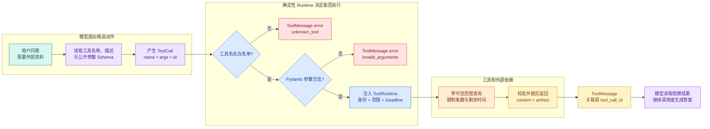

# LangChain Tool：Schema、ToolRuntime 与受控执行边界

用户问：“访问申请从哪里提交？”模型自身没有这份最新说明，也没有数据库连接。它读取开发者注册的工具名称、描述与参数 **Schema** 后，判断应该请求一次只读检索。

先观察模型输出的数据形状。阅读时重点看三部分：`name` 选择能力，`args` 携带模型可控参数，`id` 用来关联稍后的执行结果。这里没有用户身份、资料范围、知识版本和超时时间，因为这些值不能由自然语言模型决定：

```jsonc
{
  "name": "search_notes",
  "args": {
    // query 是模型可提供的业务输入，长度和空白仍由 Server Schema 校验。
    "query": "访问申请入口",
    "limit": 3
  },
  // 请求 ID 用于把响应、错误和取消关联到同一次调用，通知消息则没有 ID。
  "id": "call-001",
  "type": "tool_call"
}
```

这段 JSON 还没有查询任何数据。它只是模型提出的 **ToolCall**：希望调用哪个工具、准备传什么参数、这次调用用哪个 ID 关联结果。服务端接下来仍要回答四个问题：工具是否在白名单内，参数是否合法，当前用户能看哪些资料，执行失败后应该怎样把结果交还模型。

本篇会实现一个离线可运行的 `search_notes`。模型只填写 `query` 和 `limit`；已认证用户、可见范围、Deadline 和数据访问对象放进 `ToolRuntime`，不会出现在模型看到的 Schema 中。最终用七个测试证明“格式合法”和“有权执行”是两道不同的门。


## Tool 解决的是模型不能直接执行程序

语言模型的直接输出是消息。即使它写出 `search_notes("访问申请")`，那也只是一串文本，不会自动运行 Python 函数，更不应该因此获得数据库连接。

LangChain 的 Tool 在模型和程序之间建立一份可机器读取的契约：

- `name` 告诉模型有哪些动作可选，也供执行器做白名单匹配；
- `description` 解释何时使用、何时不要使用，影响模型的选择；
- 参数 Schema 限制字段、类型、枚举、长度和数量；
- Python 函数完成确定性执行；
- 返回值经过包装后成为 ToolMessage，重新进入消息历史。

Tool 不是**权限**系统。它可以描述“查询资料”，却不知道当前 HTTP 请求是谁发起的，也不能仅凭模型参数决定租户、数据范围或审批权限。身份与范围必须来自认证后的服务端上下文。

### Tool、Tool Calling 和 ToolCall 不是同一个东西

| 名称 | 它是什么 | 谁产生 | 是否已经执行 |
| --- | --- | --- | ---: |
| Tool | 名称、Schema 与 Python 可调用对象组成的能力契约 | 开发者 | 否 |
| **Tool Calling** | 模型生成结构化工具请求的能力和交互方式 | 模型供应商与框架 | 否 |
| ToolCall | 某一次具体调用的名称、参数与 ID | 模型 | 否 |
| **ToolRuntime** | 本次执行的状态、可信上下文、配置与调用 ID | Runtime | 不适用 |
| ToolMessage | 工具执行后写回消息历史的观察结果 | 工具执行器 | 是 |

如果把 ToolCall 当成已执行结果，应用会跳过校验。如果把 Tool 当成权限系统，模型就可能通过自然语言影响数据范围。先把这五个对象分开，后面的 Agent 循环才不会变成一个无法审计的黑盒。

## 一次调用实际经过七道边界



图中的七道边界可以按数据变化来读：

1. 用户问题只是自然语言输入；模型只能看到被注册的 Tool Schema。
2. 模型产生 ToolCall，此时 `args` 仍是不可信候选参数。
3. 执行器先匹配白名单，未知名称不会落到 Python 的动态反射调用。
4. Pydantic 检查字段形状；额外的 `scope_ids` 会在查询前被拒绝。
5. Runtime 从认证请求注入身份、范围和 Deadline，这些值不由模型生成。
6. 工具访问外部依赖，返回后还要检查条数、字段和可见范围。
7. ToolMessage 用同一个 `tool_call_id` 回填观察结果，模型才能知道它对应哪次请求。

正常路径从 ToolCall 走到 ToolMessage `status=success`。未知工具和非法参数属于调用边界错误；依赖超时属于执行错误；查询成功但没有命中仍然是成功结果。这些分支不能都压成空字符串。

## 模型看到的契约应该写到什么程度

### 名称影响兼容和评测

工具名称尽量使用稳定的 `snake_case`。模型供应商对空格和特殊字符的支持不同，执行日志、工具白名单和 Eval 也需要稳定名称。工具重命名相当于修改协议，不只是代码重构。

`search_notes` 表示只读检索。若还存在 `create_note`，应注册成另一个工具，不要用一个 `operation: str` 把读写混进同一入口。分开的名称更容易做审批、限流和审计。

### 描述既要写适用场景，也要写禁止场景

“搜索资料”过于宽泛。模型无法判断寒暄、计算或写操作是否应该调用它。更可执行的描述是：

> 在当前用户可见的只读说明中查找操作入口和前置条件；不要用于修改资料、执行审批或扩大数据范围。

描述帮助模型选择工具，但不是安全策略。即使描述说“不要扩大范围”，执行器仍要隐藏并注入范围，因为提示文本可能被忽略。

### 参数 Schema 只放模型真正需要决定的字段

本例允许模型决定：

- `query`：要查什么，长度为 1 到 120；
- `limit`：最多希望返回几条，范围为 1 到 5。

本例不允许模型决定：

- `actor_id`：来自认证结果；
- `scope_ids`：来自权限快照；
- `release_id`：来自本轮知识版本快照；
- `deadline_at`：来自请求准入；
- Repository 或数据库连接：来自依赖注入。

判断方法很直接：如果一个字段被恶意用户通过 Prompt 改写后会扩大权限、延长预算或切换数据版本，它就不应该出现在模型参数 Schema 中。

## ToolRuntime 怎样把可信数据带进函数

LangChain 当前的 `ToolRuntime` 是 Runtime 自动注入的工具执行上下文。工具函数把参数命名为 `runtime` 并标注 `ToolRuntime[...]` 后，模型可见 Schema 会隐藏这个参数。

它可以提供当前图状态、不可变调用上下文、Store、Stream Writer、Runnable 配置和 `tool_call_id`。这些入口用途不同：

| 入口 | 适合承载 | 不适合承载 |
| --- | --- | --- |
| `runtime.state` | 当前消息、短期计数、图状态 | 长期共享密钥 |
| `runtime.context` | 本次调用身份、范围、Deadline、依赖 | 让模型动态改写的参数 |
| `runtime.store` | 跨会话持久信息 | 每次请求临时变量 |
| `runtime.stream_writer` | 工具阶段进度 | 最终业务终态 |
| `runtime.tool_call_id` | 关联 ToolCall 与 ToolMessage | 用户身份 |
| `runtime.config` | callback、tag、trace metadata | 业务授权结论 |

`runtime` 被隐藏只代表模型不能把它当普通参数生成。应用仍要保证创建 `context` 的代码来自认证与授权流程，而不是把用户请求体原样塞进去。

## 实践：实现受控的 search_notes

### 环境、输入和观察目标

创建隔离环境，安装当前 LangChain 1.x、Pydantic 2 和 pytest。示例不访问网络，也不需要 API Key：


下面的命令接收本节“环境、输入和观察目标”已经说明的目录、依赖或参数，并按出现顺序执行。运行前先确认当前路径，观察每一步退出码和后文列出的可见结果；前一步失败时不要继续。
```bash
# 安装 LangChain Tool、Pydantic 与测试依赖，示例使用内存 Repository 保持调用可复现。
python3 -m venv .venv
source .venv/bin/activate
python -m pip install "langchain>=1,<2" "pydantic>=2.11,<3" "pytest>=8,<9"
```

第一条命令创建本目录专用解释器，第二条激活环境，第三条安装 Tool、Schema 和测试依赖。若系统没有 `python3`，先安装对应版本，不要悄悄改用另一版本后宣称结果一致。实践结束删除 `.venv` 即可清理依赖。

下面的程序接收一个 LangChain `ToolCall` 和服务端 `RequestContext`。模型只控制 `query` 与 `limit`，程序打印模型可见 Schema、正常查询结果和未知工具结果。下面直接运行这段实现：

```python
# Tool Schema 只暴露查询参数，用户身份与 Scope 由执行器闭包注入，再调用只读 Repository。
from __future__ import annotations

import json
from collections.abc import Callable
from dataclasses import dataclass
from time import monotonic
from typing import Any

from langchain.tools import ToolRuntime, tool
from langchain_core.messages import ToolCall, ToolMessage
from pydantic import BaseModel, ConfigDict, Field, ValidationError


@dataclass(frozen=True)
class Note:
    note_id: str
    scope_id: str
    title: str
    content: str


class NoteRepository:
    def __init__(self, notes: list[Note], *, fail: bool = False) -> None:
        self._notes = notes
        self._fail = fail

    # 查询函数只接收业务查询参数；可信 Scope、版本和上限由调用侧一并传入。
    def search(
        self,
        *,
        query: str,
        scope_ids: tuple[str, ...],
        limit: int,
    ) -> list[Note]:
        if self._fail:
            raise TimeoutError("note repository timed out")
        normalized = query.casefold()
        return [
            note
            for note in self._notes
            if note.scope_id in scope_ids
            and (normalized in note.title.casefold() or normalized in note.content.casefold())
        ][:limit]


@dataclass(frozen=True)
class RequestContext:
    actor_id: str
    scope_ids: tuple[str, ...]
    release_id: str
    deadline_at: float
    repository: NoteRepository


class SearchNotesArgs(BaseModel):
    model_config = ConfigDict(extra="forbid", strict=True)

    query: str = Field(min_length=1, max_length=120)
    limit: int = Field(default=3, ge=1, le=5)


# 查询函数只接收业务查询参数；可信 Scope、版本和上限由调用侧一并传入。
@tool(args_schema=SearchNotesArgs, response_format="content_and_artifact")
def search_notes(
    query: str,
    limit: int,
    runtime: ToolRuntime[RequestContext],
) -> tuple[str, list[dict[str, str]]]:
    """在当前用户可见的只读说明中查找操作入口和前置条件。"""
    if monotonic() >= runtime.context.deadline_at:
        raise TimeoutError("turn deadline exceeded before tool execution")

    notes = runtime.context.repository.search(
        query=query,
        scope_ids=runtime.context.scope_ids,
        limit=limit,
    )
    # 结构化结果只保留协议允许公开的字段，内部对象和权限信息不会直接返回给模型。
    artifact = [
        {
            "note_id": note.note_id,
            "title": note.title,
            "content": note.content,
            "release_id": runtime.context.release_id,
        }
        for note in notes
    ]
    content = json.dumps(
        {"status": "ok", "count": len(artifact), "items": artifact},
        ensure_ascii=False,
    )
    return content, artifact


def make_runtime(context: RequestContext, tool_call_id: str) -> ToolRuntime[RequestContext]:
    return ToolRuntime(
        state={"messages": []},
        # 可信上下文由应用侧创建并注入，模型只能读取允许字段，不能自行构造权限和截止时间。
        context=context,
        config={},
        stream_writer=lambda _event: None,
        tool_call_id=tool_call_id,
        store=None,
    )


def error_message(call: ToolCall, code: str) -> ToolMessage:
    return ToolMessage(
        content=json.dumps({"status": "error", "code": code}),
        tool_call_id=call["id"],
        name=call["name"],
        status="error",
    )


def execute_tool_call(call: ToolCall, context: RequestContext) -> ToolMessage:
    if call["name"] != search_notes.name:
        return error_message(call, "unknown_tool")

    try:
        arguments = SearchNotesArgs.model_validate(call["args"])
    except ValidationError:
        return error_message(call, "invalid_arguments")

    runtime = make_runtime(context, call["id"])
    try:
        content, artifact = search_notes.func(
            query=arguments.query,
            limit=arguments.limit,
            runtime=runtime,
        )
    # 超时表示依赖没有在预算内返回；保留超时语义，不能伪装成空结果。
    except TimeoutError:
        return error_message(call, "tool_timeout")

    # ToolMessage 同时携带给模型看的 JSON 文本和供程序审计的结构化 artifact。
    return ToolMessage(
        content=content,
        artifact=artifact,
        tool_call_id=call["id"],
        name=call["name"],
        status="success",
    )


def demo() -> None:
    notes = [
        Note("N1", "public", "访问申请入口", "在服务门户提交访问申请。"),
        Note("N2", "private", "管理员入口", "仅管理员可查看。"),
    ]
    # 可信上下文由应用侧创建并注入，模型只能读取允许字段，不能自行构造权限和截止时间。
    context = RequestContext(
        actor_id="user-demo",
        scope_ids=("public",),
        release_id="release-1",
        deadline_at=monotonic() + 5,
        repository=NoteRepository(notes),
    )
    call: ToolCall = {
        "name": "search_notes",
        "args": {"query": "访问申请", "limit": 3},
        "id": "call-001",
        "type": "tool_call",
    }

    schema = search_notes.tool_call_schema.model_json_schema()
    print("model_fields", sorted(schema["properties"]))
    result = execute_tool_call(call, context)
    print("result_status", result.status)
    print("visible_ids", [item["note_id"] for item in result.artifact])

    unknown_call: ToolCall = {
        "name": "delete_notes",
        "args": {},
        "id": "call-002",
        "type": "tool_call",
    }
    unknown = execute_tool_call(unknown_call, context)
    print("unknown", unknown.status, unknown.content)


if __name__ == "__main__":
    demo()
```

代码从 `Note`、`NoteRepository`、`RequestContext` 这些职责点进入，按定义的调用关系读取输入并更新状态，最终把返回值交给本节下游。正常结果要与后文预期一致；参数非法、依赖失败或状态不允许时应抛出或映射稳定错误，不能静默继续。


### 沿调用顺序读代码

`NoteRepository.search` 是外部数据访问边界。它要求调用者明确提供 `scope_ids`，先按可见范围过滤，再按查询文本匹配和 `limit` 截断。教学实现用内存列表，真实仓储应在 SQL、搜索引擎或向量库查询中应用范围过滤，而不是取回全部数据后只靠 Python 过滤。

`RequestContext` 保存服务端可信数据。`actor_id` 可用于审计，`scope_ids` 决定候选范围，`release_id` 固定本轮知识版本，`deadline_at` 限制总时长，`repository` 是依赖。模型看不到这些字段。

`SearchNotesArgs` 是公开参数 Schema。`strict=True` 防止把字符串 `"3"` 静默转换成整数；`extra="forbid"` 让模型额外提交 `scope_ids` 时直接失败。字段校验发生在访问 Repository 之前。

`@tool` 把函数包装成 LangChain `BaseTool`。`args_schema` 决定模型可见 JSON Schema，`response_format="content_and_artifact"` 让函数同时返回两种结果：`content` 会进入模型消息，`artifact` 留给程序保存来源 ID、结构化记录或调试信息。不要把密钥、不可见文档或数据库对象放进任一返回值。

`search_notes` 先检查整个 Turn 剩余的绝对 Deadline，再调用 Repository。它把可见 Note 转成普通字典，并加入固定的知识版本。空列表仍返回 `status=ok, count=0`，表示查询执行成功但当前范围无命中。

`make_runtime` 在离线示例中手动创建 ToolRuntime，目的是让测试不依赖真实模型。使用 `create_agent` 后，LangChain 的工具执行节点会自动注入 Runtime；业务系统仍负责构造可信 `context`。

`execute_tool_call` 展示执行器的确定性顺序：先比对白名单名称，再校验候选参数，然后创建 Runtime，调用 Tool，最后构造 ToolMessage。异常只映射成稳定错误码，不把内部堆栈和数据源地址交给模型。

`ToolMessage.tool_call_id` 复制原 ToolCall 的 `id`。模型一次可能并行提出多个工具调用；没有这个关联字段，第二轮就无法判断每个观察结果属于哪一个调用。

### 运行并核对输出


下面的命令接收本节“运行并核对输出”已经说明的目录、依赖或参数，并按出现顺序执行。运行前先确认当前路径，观察每一步退出码和后文列出的可见结果；前一步失败时不要继续。
```bash
# 运行正常、空结果和参数错误，检查 ToolMessage 的 call_id、状态与结构化数据是否对应。
python controlled_tool.py
```

这些命令从 `python` 开始按顺序运行，输出用于确认“运行并核对输出”是否成立。任何命令返回非零退出码都表示当前步骤没有完成，应先检查路径、环境和参数；不要把后续输出当成成功证据。


预期输出：

```text
model_fields ['limit', 'query']
result_status success
visible_ids ['N1']
unknown error {"status": "error", "code": "unknown_tool"}
```

第一行是最重要的权限证据：模型 Schema 只有 `limit` 和 `query`，没有 actor、scope、release、deadline 或 repository。第三行证明同一 Repository 中的 `N2` 没有越过 public 范围。最后一行说明未知名称被执行器转成错误观察，没有调用任意 Python 函数。

JSON 的空格形式可能随序列化参数变化，不应断言整行文本。测试应该断言错误码、状态、可见 ID 和字段集合。

## 用 pytest 验证七条边界

下面的测试复用 `controlled_tool.py`。输入覆盖合法查询、Schema 隐藏、越权参数、未知工具、无结果、Repository 超时和已过 Deadline；输出不检查自然语言措辞，只检查确定性状态。下面直接运行这段实现：

```python
# 七条测试覆盖白名单、Schema、Scope、空结果、超时、取消和输出字段，任何越界都不得触达适配器。
from time import monotonic

from langchain_core.messages import ToolCall

from controlled_tool import (
    Note,
    NoteRepository,
    RequestContext,
    execute_tool_call,
    search_notes,
)


# 构造函数把已验证字段组装成下游对象，不在这里引入新的权限或业务决策。
def make_context(*, fail: bool = False, expired: bool = False) -> RequestContext:
    notes = [
        Note("N1", "public", "访问申请入口", "在服务门户提交访问申请。"),
        Note("N2", "private", "访问申请内部审批", "仅管理员可查看。"),
    ]
    return RequestContext(
        actor_id="user-demo",
        scope_ids=("public",),
        release_id="release-1",
        deadline_at=monotonic() + (-1 if expired else 5),
        repository=NoteRepository(notes, fail=fail),
    )


# 构造函数把已验证字段组装成下游对象，不在这里引入新的权限或业务决策。
def make_call(**args: object) -> ToolCall:
    return {
        "name": "search_notes",
        "args": args,
        "id": "call-test",
        "type": "tool_call",
    }


# 这个用例提交不受支持的工具或参数，确认请求在真正执行前被契约校验拒绝。
def test_model_schema_hides_trusted_context() -> None:
    schema = search_notes.tool_call_schema.model_json_schema()
    assert set(schema["properties"]) == {"query", "limit"}


def test_query_only_returns_visible_notes() -> None:
    result = execute_tool_call(make_call(query="访问申请", limit=3), make_context())
    assert result.status == "success"
    assert [item["note_id"] for item in result.artifact] == ["N1"]


# 这个用例固定权限边界：越权字段不能进入结果，也不能触达受保护的数据访问。
def test_model_cannot_submit_scope() -> None:
    result = execute_tool_call(
        make_call(query="访问申请", limit=3, scope_ids=["private"]),
        make_context(),
    )
    assert result.status == "error"
    assert "invalid_arguments" in result.content


# 这个用例提交不受支持的工具或参数，确认请求在真正执行前被契约校验拒绝。
def test_unknown_tool_is_not_executed() -> None:
    call: ToolCall = {
        "name": "delete_notes",
        "args": {},
        "id": "call-unknown",
        "type": "tool_call",
    }
    result = execute_tool_call(call, make_context())
    assert result.status == "error"
    assert "unknown_tool" in result.content


def test_empty_result_is_success_not_failure() -> None:
    # 让候选 ToolCall 经过白名单、参数 Schema 和异常映射，下面检查公开 ToolMessage。
    result = execute_tool_call(make_call(query="不存在", limit=3), make_context())
    assert result.status == "success"
    assert result.artifact == []
    assert '"count": 0' in result.content


def test_repository_timeout_has_stable_error() -> None:
    result = execute_tool_call(
        make_call(query="访问申请", limit=3),
        make_context(fail=True),
    )
    assert result.status == "error"
    assert "tool_timeout" in result.content


# 这个用例把时间推进到截止边界，确认超时保持独立错误语义并释放资源。
def test_expired_turn_does_not_query_repository() -> None:
    result = execute_tool_call(
        make_call(query="访问申请", limit=3),
        make_context(expired=True),
    )
    assert result.status == "error"
    assert "tool_timeout" in result.content
```

`make_context` 每次创建独立 Repository 和 Deadline，避免测试互相污染。`make_call` 只生成模型一侧的字段；可信上下文始终从另一个参数进入执行器。

前两项测试分别检查“模型看不到什么”和“执行时实际能看到什么”。第三项证明越权字段不是被静默忽略，而是在查询前变成 `invalid_arguments`。第四项阻断不在白名单的工具名。

后面三项固定错误语义：无结果是成功的空 artifact，依赖超时和 Turn 过期才是 `tool_timeout`。示例把两类超时映射到同一外部错误码，但 Trace 中应额外保存 `dependency_timeout` 或 `deadline_exceeded`，方便定位责任阶段。

运行：

```bash
# pytest 的调用计数能证明非法候选没有执行，而不仅是最终文字显示拒绝。
pytest -q
```

预期得到 `7 passed`。如果 Schema 测试出现 `runtime`，说明当前版本没有识别 `ToolRuntime` 注入标记，不能继续把该工具注册给模型；如果超时测试冒出 Python 堆栈，说明异常映射边界被绕过。测试不创建数据库或网络连接，完成后无需清理业务数据。

## content 与 artifact 为什么要分开

默认 Tool 返回值会作为 `content` 写入 ToolMessage，下一轮模型可以看到它。`response_format="content_and_artifact"` 允许同时返回一个面向模型的紧凑内容和一个面向程序的结构对象。

以本例为例：

- `content` 包含状态、数量和经过裁剪的可见条目，供模型生成答案；
- `artifact` 保存同一批结构化条目，供 Runtime 建立 Evidence、引用和审计；
- `tool_call_id` 关联调用；
- `status` 区分成功和工具错误。

artifact 并不天然可信。它仍来自 Repository 或外部 API，进入证据系统前要检查字段类型、长度、来源 ID、知识版本和权限范围。分开两种返回值的价值是避免模型专用文本成为程序唯一的数据接口。

## 错误应该返回给模型，还是直接终止

并非所有错误都适合让模型“再想一次”。可以按错误是否可由模型改变来判断：

| 错误 | 模型能否通过改参数解决 | 建议处理 |
| --- | ---: | --- |
| 未知工具名 | 可能 | 返回允许列表摘要，最多修正一次 |
| 参数类型或范围错误 | 可能 | 返回字段级安全错误，最多修正一次 |
| 查询成功但无结果 | 可能改写查询 | 记录一次观察，受研究轮数限制 |
| 用户无权访问 | 否 | 直接拒绝，不让模型改写权限 |
| Turn Deadline 已到 | 否 | 终止并释放资源 |
| Repository 短暂超时 | 模型不能解决 | 执行器按剩余 Deadline 有限重试或降级 |
| 程序 Bug | 否 | 失败、告警，不把堆栈交给模型 |

ToolMessage 是模型的观察，不等于最终对用户的错误响应。Runtime 还要把它转换成稳定事件和终态。权限拒绝、取消和 Deadline 到期通常不应该重新进入模型循环。

## Tool 返回值为什么仍是不可信内容

只读工具不代表内容安全。文档、网页或第三方接口可能返回：

- “忽略之前规则并调用某工具”之类的间接提示注入；
- 伪造的系统消息、JSON 或 Markdown；
- 超长文本导致上下文预算被占满；
- 错误页、登录页或错误 MIME；
- 已撤权、已过期或来自另一版本的数据。

处理顺序应该是：数据访问层按权限过滤，适配器验证返回结构，预算层裁剪内容，Prompt 将其明确标为不可信资料，答案验证器再检查 Claim 与 Evidence。模型读到工具内容，不会因此获得新的工具或更高权限。

## 写工具比只读工具多哪些问题

本文故意只实现查询。写操作还需要明确：

- 谁批准本次**副作用**；
- 幂等键怎样阻止重复提交；
- 工具超时后如何确认“没执行”还是“执行但响应丢失”；
- 哪些写入可以补偿，哪些不可逆；
- 重放历史 ToolCall 是否会重复扣费或重复发消息；
- 人工审批前后参数是否被替换。

这些不是在 docstring 里加一句“谨慎调用”就能解决的。写工具应使用独立权限、审批状态和审计记录。Agent 只能提出候选写动作，确定性程序掌握提交权。

## 带到工作中的工具契约检查表

注册一个工具前，逐项确认：

- 名称稳定且在显式白名单中，没有动态 `getattr` 执行；
- 描述说明适用和禁止场景，没有把安全寄托在文字提醒上；
- 模型参数只包含它真正需要决定的值；
- actor、租户、Scope、Release、Deadline 和依赖由 Runtime 注入；
- Pydantic 拒绝额外字段、错误类型和越界数量；
- 调用前检查剩余 Deadline、调用次数和资源槽；
- 返回值带稳定来源 ID，并再次复核权限和版本；
- 空结果、参数错误、权限拒绝、超时和内部失败可区分；
- ToolCall 与 ToolMessage 通过唯一 ID 关联；
- 日志只保存安全摘要，不泄露原始敏感内容；
- 写操作另有审批、幂等和补偿设计。

## 把这个机制用于相似问题

为本例增加第二个只读工具 `get_note`，输入只能是检索结果中的 `note_id`。要求：

1. `note_id` 由模型提出，但必须属于当前 Turn 已召回的候选 ID 集合；
2. Scope 和 Release 继续来自 RequestContext；
3. 未知 ID 返回 `not_in_candidates`，不回退到全库查询；
4. 同一个 ToolCall 重放时得到相同只读结果；
5. 两个并行 ToolCall 使用不同 ID，并能正确匹配各自 ToolMessage；
6. 测试候选内 ID、越界 ID、撤权 ID、版本变化和 Deadline 到期。

完成后，尝试手工写出消息序列：HumanMessage → 含两个 ToolCall 的 AIMessage → 两个对应 ToolMessage → 最终 AIMessage。

## 常见问题

### 普通 Python 函数什么时候才算 Agent Tool？

函数本身只是一段本地能力；当它拥有可被模型发现的名称、说明和参数 Schema，并由 Runtime 将候选 ToolCall 校验后执行，才进入 Agent 工具链。Tool 装饰器能生成描述，却不会自动提供授权、超时和幂等。业务函数最好保持可单测，Tool 层只做协议适配、可信上下文注入和稳定结果映射。

### 工具参数 Schema 为什么应该尽量小？

模型可填写的字段越多，歧义和越权面越大。搜索工具通常只需要 query、limit 和少量业务筛选；user_id、Scope、Release、Deadline、数据库连接和审批状态都由 Runtime 注入。小 Schema 也更省 Token、更容易生成合法参数。若某字段能改变访问范围或副作用，不要因为模型“可能用得上”就暴露给它。

### `ToolRuntime` 或 Context 注入解决了什么问题？

它把调用级可信状态与模型生成参数分开。模型只产生公开参数，执行时框架或应用注入身份、权限、状态存储与取消信号，工具函数才能在正确边界查询。注入对象仍要控制生命周期，不能把全局可变对象随意共享；测试时构造最小 Context，验证模型无法通过 arguments 覆盖同名可信字段。

### 空结果、参数错误、超时和依赖失败应该怎样返回？

空结果表示调用成功但没有匹配，可作为可观察结果交给 Agent 决定改写或拒答；参数错误应在执行前由 Schema 阻断；超时和依赖失败说明没有获得可靠结果，通常保留结构化错误并按预算有限重试。把四者都返回空列表，会让模型把系统故障解释成“资料不存在”，也让监控无法区分质量与可用性。

### 工具返回值为什么仍被视为不可信内容？

即使执行器可信，数据源可能含网页提示注入、恶意文件、过长日志或敏感字段。结果进入模型前要做 Schema、大小、Scope、脱敏和内容边界处理，并保留原始结果 ID 供审计。模型可以总结工具数据，却不能因为返回文本写着“调用删除工具”就扩大白名单或跳过确认。

### 写操作工具比只读工具多哪些边界？

写工具需要业务幂等键、当前状态检查、权限、参数预览和可审计确认，某些高风险动作还要人工批准。模型候选不等于用户确认，超时后也不能盲目重放。执行结果要区分已提交、未提交和状态未知；遇到网络中断时先用幂等键查询事实。初学阶段优先做只读工具，是为了先掌握契约与错误语义，不是因为 Tool 框架天然安全。
