# LangGraph Checkpoint、Thread 与恢复：进程重启后如何继续

## Checkpoint、Thread 与恢复分别是什么

Checkpoint 是 LangGraph 在节点边界保存的 State 快照，Thread 是把这些快照串成一条图执行历史的标识。它们位于图运行时的恢复层：Checkpoint 记录“停在哪里、下一步是什么”，Thread 负责找到哪条历史；业务 Turn 仍然负责用户权限、取消和最终状态。

这套机制解决的是进程中断后的继续执行，不是把任意副作用自动变成幂等操作。要做到可恢复，系统还要给外部写入配置幂等键、给业务 Turn 做条件更新，并在恢复前重新检查 Deadline 和权限。

假设 Agent 已经完成文档检索，正在等待模型生成答案时 Worker 被杀掉。用户刷新页面后，系统不能重新从第一步开始盲跑，也不能因为恢复重复扣费、重复写事件或重复调用外部工具。**Checkpoint** 解决的是“图状态在哪个位置被持久化”，Thread 解决的是“哪一组执行历史属于同一条会话线程”；它们都不是业务 Turn 的替代品。

示例构建一个能暂停和**恢复**的只读图，并观察 State 快照、下一步任务和恢复输入。`langgraph>=0.6,<0.7` 与内存 Saver 能证明协议和节点重放行为，不能证明跨进程耐久性。生产环境还需要 PostgreSQL 等持久化 Saver 和数据库集成测试。

## 四个标识先分开

| 名称 | 作用 | 生命周期 | 典型存储 |
| --- | --- | --- | --- |
| Conversation | 用户可见的对话容器 | 长期 | 业务数据库 |
| Turn | 一次问题执行单元 | 从创建到终态 | 业务数据库 |
| **Thread** | LangGraph 的图执行上下文 | 可跨多个调用 | Checkpointer |
| Checkpoint | 某个节点边界的状态快照 | 随 Thread 增长 | PostgreSQL/Redis 等 |

还要认识两个次级标识：`checkpoint_id` 指向 thread 历史中的某个具体快照；`checkpoint_ns` 给子图或不同用途隔离命名空间。日常恢复通常只传 `thread_id`，由 Saver 找最新快照。只有调试、分叉历史或指定回放位置时才显式使用 `checkpoint_id`。

Thread ID 可以等于 Turn ID，也可以使用独立映射；关键是把映射写入业务记录。只看 Thread 无法判断用户是否取消或权限是否改变，只有业务 Turn 才拥有终态和权限语义。

`thread_id` 选择一条历史，`checkpoint_id` 选择这条历史中的一个具体快照。正常继续通常读取 thread 的最新快照；调试、回放或从旧分支派生时才显式指定 checkpoint。若同一个用户请求误用了另一个 Turn 的 thread ID，模型会看到错误状态，因此 thread 映射既是恢复字段，也是数据隔离边界。

```mermaid
flowchart LR
  subgraph Before[第一次 Worker]
    A[业务库把 Turn 置为 running]:::data --> B[Graph 使用 thread_id 执行]:::program
    B --> C[research 完成并保存快照]:::data
    C --> D[interrupt 暂停并返回待确认数据]:::fail
  end
  subgraph After[恢复 Worker]
    E[读取业务 Turn 并取得执行 Lease]:::program --> F[按 thread_id 读取最新 Checkpoint]:::data
    F --> G[Command resume 注入确认结果]:::input
    G --> H[从中断节点继续到 answer]:::model
    H --> I[业务库条件更新为 completed]:::ok
  end
  D -. 进程退出或等待用户 .-> E
  classDef input fill:#d9f7ef,stroke:#0f766e,color:#134e4a
  classDef program fill:#dbeafe,stroke:#2563eb,color:#1e3a8a
  classDef model fill:#ede9fe,stroke:#7c3aed,color:#4c1d95
  classDef data fill:#fef3c7,stroke:#d97706,color:#78350f
  classDef ok fill:#dcfce7,stroke:#16a34a,color:#14532d
  classDef fail fill:#fee2e2,stroke:#dc2626,color:#7f1d1d
```



Checkpoint 记录图状态和下一步位置，业务数据库记录 Turn 状态。恢复前必须再次检查租约、Deadline、权限快照和是否已经进入终态。

图中第一次 Worker 先让业务 Turn 进入运行态，再以稳定 `thread_id` 调用图。`research` 提交证据后形成可恢复快照，`interrupt` 让图暂停。恢复 Worker 不能直接继续：它先确认业务 Turn 仍可执行并取得 Lease，再读取同一 thread 的快照，通过 `Command(resume=...)` 给中断点返回值。图完成后，业务库使用条件更新进入 `completed`，防止取消请求或另一个 Worker 的终态被覆盖。

## Checkpoint 在什么时候产生

LangGraph 按图执行步骤推进。一个步骤里可以有一个或多个可并行节点，Reducer 合并它们的状态更新后，Checkpointer 保存当前 channel values、下一步任务和相关元数据。可以把它理解为“节点边界后的可恢复快照”，而不是 Python 每执行一行就保存一次。

这个粒度直接影响重放。若节点先调用外部服务，再在节点返回前崩溃，当前步骤没有完成，恢复时节点可能再次执行。把一个十分钟节点接上 Checkpointer，并不会自动得到十分钟内部的断点续跑；要么把它拆成多个有意义的节点，要么让节点内部使用业务 Checkpoint 和**幂等**键。

快照还需要 Schema 版本。给 State 新增必填字段、修改枚举含义或删除 channel 后，旧快照可能无法由新代码读取。发布时要选择兼容读取、迁移快照、让旧版本排空，或者明确终止旧 Turn，不能假定 Python 类型提示会自动迁移持久化数据。

## 一份 Checkpoint 里有哪些信息

从使用者角度，一份状态快照至少要回答四个问题：

- `values`：各个 State channel 当前已经提交的值是什么；
- `next`：下一轮准备执行哪些节点；
- `tasks`：本轮任务及其错误、中断或待处理写入是什么；
- `config`：它属于哪个 `thread_id`、命名空间和 checkpoint 位置。

不同 Saver 的数据库表和序列化细节会变化，不要让业务代码直接依赖底层表结构。业务代码通过 Checkpointer 接口写入和读取；运维层负责连接池、保留周期、备份和孤立快照清理。

节点在一个 super-step 中完成后，运行时先合并 channel 更新，再形成下一份快照。如果某个并行节点失败，Saver 可能已经记录同一轮其他成功写入的 pending writes，恢复时不一定要重跑所有兄弟节点。你仍应通过集成测试验证当前 LangGraph 与 Saver 版本的行为，不能仅凭表里“有一行”就认为恢复语义正确。

### State 值与业务制品要分开

把整份 PDF、几十万字证据或模型二进制响应放进 State，会放大每次序列化、数据库写入和恢复成本。更稳妥的做法是：正文、证据、模型原始响应存入各自的制品存储；State 只保存稳定 ID、版本、摘要和校验信息。

例如 `evidence_ids=["e-1", "e-2"]` 适合放进快照，但恢复时必须用快照里的 `release_id` 和 ACL 范围重新读取，不能用“当前最新版本”替换。否则同一 checkpoint 会在不同时间得到不同证据，失去可复现性。

## 恢复边界与副作用重放

纯计算节点通常可以重放：分类、格式化、排序。外部**副作用**必须有幂等边界：发送邮件、写入任务、扣费、发布事件、创建对象都需要稳定幂等键，或者在 Checkpoint 前后记录已经完成的事实。

一个安全原则是：先把副作用的“已提交事实”写入可查询存储，再允许图继续到下一个节点。若 Worker 在外部调用成功后、写入 Checkpoint 前崩溃，恢复逻辑必须通过幂等键查询结果，而不是再次盲调。

可以按副作用性质决定节点策略：

| 节点类型 | 例子 | 默认能否重放 | 需要的保护 |
| --- | --- | --- | --- |
| 纯计算 | 查询改写、排序、格式化 | 可以 | 固定输入与版本 |
| 只读外部调用 | 检索、读取对象 | 通常可以 | Deadline、缓存、结果版本 |
| 幂等写 | 以稳定键写入向量 | 有条件可以 | 唯一键、条件更新 |
| 不可逆写 | 发通知、外部扣费 | 不可盲目重放 | Outbox、幂等 API 或人工确认 |

Checkpoint 只证明“图保存到了哪里”，不证明外部系统完成了什么。外部事实必须能通过幂等键、调用记录或 Outbox 查询回来。

## 最小恢复图

下面使用 `langgraph` 和内存 Checkpointer 演示“运行到人工确认处暂停，再从同一个 thread 恢复”。第一段输入是问题，第二段输入是 `Command(resume=True)`；预期第一次结果包含中断信息，第二次结果包含答案。内存实现只适合学习和测试，进程退出后数据会消失。

```python
# 图使用 thread_id 关联 Checkpoint，节点完成后保存 State，进程重启可以从持久快照继续。
from __future__ import annotations

from typing import TypedDict

from langgraph.checkpoint.memory import MemorySaver
from langgraph.graph import END, START, StateGraph
from langgraph.types import Command, interrupt

class State(TypedDict, total=False):
    # question 保存原始用户输入，后续改写查询不能覆盖它。
    question: str
    evidence: list[str]
    answer: str
    approved: bool

def research(state: State) -> State:
    return {"evidence": [f"资料：{state['question']}"]}

def request_approval(state: State) -> State:
    # interrupt 保存当前 State 并暂停线程，恢复时 Command 的值会成为 approved。
    approved = interrupt(
        {"question": state["question"], "evidence": state["evidence"]}
    )
    return {"approved": bool(approved)}

def answer(state: State) -> State:
    return {"answer": f"基于 {state['evidence'][0]} 的回答"}

def route_after_approval(state: State) -> str:
    return "answer" if state["approved"] else END

# 先用 State 类型创建图构建器，后续节点读写字段都会受这份状态契约约束。
builder = StateGraph(State)
builder.add_node("research", research)
# 把纯节点函数注册为图节点；注册本身不会执行函数。
builder.add_node("request_approval", request_approval)
builder.add_node("answer", answer)
builder.add_edge(START, "research")
builder.add_edge("research", "request_approval")
builder.add_conditional_edges("request_approval", route_after_approval)
builder.add_edge("answer", END)
checkpointer = MemorySaver()
# 编译阶段检查图结构，并把 Checkpointer 注入可恢复的运行时。
graph = builder.compile(checkpointer=checkpointer)

config = {"configurable": {"thread_id": "turn-demo"}}
first = graph.invoke({"question": "访问申请"}, config)
print(first["__interrupt__"])

second = graph.invoke(Command(resume=True), config)
print(second["answer"])
```

`research` 产生证据后进入 `request_approval`。`interrupt` 把给调用方看的确认数据写入中断结果，并要求已经配置 Checkpointer 和稳定 `thread_id`。第一次 `invoke` 在这里停住，`answer` 尚未运行。第二次通过 `Command(resume=True)` 给中断点传回确认值，LangGraph 从保存的 thread 状态继续，通过条件边进入 `answer`。

`route_after_approval` 返回节点名或 `END`，所以拒绝确认会直接结束，不会生成答案。恢复值来自可信业务 API，不应直接接受浏览器随意提交的布尔值；服务端还要验证操作者、Turn 状态和确认版本。示例没有数据库 Checkpointer，也没有真正杀进程，因此它证明的是暂停/恢复协议，不是跨进程耐久性。

第一次 `invoke` 后可以读取快照，而不是猜测图停在哪里：

```python
# 首次 invoke 写入中断前快照，恢复调用沿用同一 thread_id，避免创建另一条执行历史。
snapshot = graph.get_state(config)

print(snapshot.values["evidence"])
print(snapshot.next)
print(snapshot.tasks[0].interrupts)
```

`get_state` 使用同一份 `config` 定位 thread 的最新快照。`values` 应包含 `research` 已提交的证据；`next` 指向尚未完成的确认节点；`tasks` 中可以看到中断信息。读取快照适合诊断与管理界面，但不要把原始 State 全量返回给浏览器，其中可能包含权限范围、内部错误或未脱敏证据。

### `interrupt` 恢复时会重进当前节点

恢复并不是从 Python 函数的下一行继续。包含 `interrupt` 的节点会从函数开头重新执行；再次调用 `interrupt` 时，运行时返回 `Command(resume=...)` 提供的值。因此，`interrupt` 之前的代码必须可以安全重放，或者移到前一个节点。

下面的写法有风险：

```python
# 当前节点可能在恢复时重新进入，因此副作用使用幂等键，已确认结果先查询再决定执行。
def unsafe_approval(state: State) -> State:
    send_notification(state["question"])  # 恢复时可能再次发送。
    approved = interrupt({"question": state["question"]})
    return {"approved": bool(approved)}
```

第一次运行先发送通知再暂停；恢复后函数从头执行，会再次发送。改法是把通知放在独立节点，并使用稳定幂等键，或者让外部通知接口支持同一键只提交一次。`interrupt` 节点本身尽量只准备展示数据、暂停和校验恢复值。

若 `research` 已调用外部服务，恢复前要检查 `external_call_id`。有 ID 就读取原结果，没有 ID 才执行；这就是幂等边界。Checkpoint 本身不替你生成这个 ID。

## 用测试证明已完成节点没有重跑

下面的测试给 `research` 增加调用计数。第一次执行会运行检索并暂停；恢复同一 thread 后，已经完成的 `research` 不应再次运行，而当前中断节点会按协议重新进入。

```python
# 测试记录节点调用次数，证明已提交 Checkpoint 的前置节点不会因恢复重复执行。
def test_resume_reuses_completed_research_checkpoint() -> None:
    research_calls = 0

    def counted_research(state: State) -> State:
        nonlocal research_calls
        research_calls += 1
        return {"evidence": [f"资料：{state['question']}"]}

    test_builder = StateGraph(State)
    test_builder.add_node("research", counted_research)
    test_builder.add_node("request_approval", request_approval)
    test_builder.add_node("answer", answer)
    test_builder.add_edge(START, "research")
    test_builder.add_edge("research", "request_approval")
    test_builder.add_conditional_edges("request_approval", route_after_approval)
    test_builder.add_edge("answer", END)

    test_graph = test_builder.compile(checkpointer=MemorySaver())
    test_config = {"configurable": {"thread_id": "resume-test"}}

    # 首次运行停在 interrupt，此时 research_calls 必须恰好为一。
    first = test_graph.invoke({"question": "访问申请"}, test_config)
    assert first["__interrupt__"]
    assert research_calls == 1

    # 用相同 thread_id 恢复后从审批节点继续，前置研究节点不能再次执行。
    completed = test_graph.invoke(Command(resume=True), test_config)
    assert completed["approved"] is True
    assert completed["answer"].startswith("基于")
    assert research_calls == 1
```

测试中的计数器是观察点，不是业务幂等实现。它证明同一内存 Saver、同一 `thread_id` 恢复时，前一节点不会重跑。要验证跨进程恢复，需要第一次使用持久化 Saver 写入快照，销毁图和连接，再创建新图实例读取同一 thread；同时断言数据库或外部适配器的副作用次数。

## 一次安全恢复的确定顺序

恢复入口拿到 `turn_id` 后，不应立刻调用 `graph.invoke`。先读取业务 Turn，确认它不是 completed、failed 或 cancelled；再用条件更新取得任务 Lease；随后检查绝对 Deadline、用户当前权限、知识 Release 和模型配置是否仍允许沿旧快照继续；最后才根据保存的 `thread_id` 与 `checkpoint_id` 恢复。

如果权限变窄，旧快照里可能残留现在已无权访问的 Evidence ID。最保守的做法是使旧快照失效，重新检索；若业务允许继续，也必须重新执行 ACL 和 Release 校验。模型配置变化则要看兼容策略：提示词小版本可能继续，工具契约或 State Schema 改变通常应启动新 Turn。

恢复成功后记录 `resumed_from_checkpoint`、恢复原因、旧 Worker、当前 Lease owner 和重放节点。这样出现重复模型调用或迟到事件时，可以从 Trace 还原“为什么这一步又执行了一次”。

## Checkpoint 的保存范围

保存适合恢复的结构化状态：问题、计划、候选 ID、已验证证据、下一节点、重试次数和版本快照。不要把未脱敏密钥、整段敏感原文或无法序列化的连接对象放进状态。大文本应存对象或证据表，状态只放引用。

恢复流程按顺序检查：Turn 是否已终态、租约是否仍归当前 Worker、Deadline 是否过期、知识 Release 是否允许继续、Checkpoint schema 是否兼容。任何一项不通过都进入可审计失败或重新准入，不直接继续图。

## 怎样验证没有重复副作用

测试不要只比较最终 answer。给副作用适配器增加调用计数和稳定幂等键，在中断前后分别制造异常，再断言外部提交次数、状态记录和图节点次数。至少覆盖：节点执行前崩溃、外部调用成功后崩溃、Checkpoint 成功后 Worker 丢失、旧 Lease owner 恢复四个窗口。

数据库集成测试还要真正换成持久化 Checkpointer：第一次进程写入中断快照后销毁图实例，第二个实例使用同一数据库与 `thread_id` 恢复。只有这个测试才能证明跨进程恢复；内存 saver 的单进程测试只能证明图协议。

## 用中断测试证明恢复没有重复执行

用内存 saver 测试同一 thread 恢复后不重复 `research`；再写一个模拟 Worker 崩溃的测试，确认幂等键能取回已有结果。进一步验证是把状态分为“可重放”和“必须查询事实”两类，并为每个外部副作用写出崩溃窗口。


**`thread_id` 是用户 ID、会话 ID 还是 Turn ID？**

它是 Checkpointer 查找一条执行状态历史的命名空间，具体映射由应用决定。企业 Runtime 通常用稳定且不会跨请求串线的执行 ID，并在配置外继续校验用户和租户；不能把可猜的 thread_id 当作权限。Conversation 可以包含多个 Turn，若全部复用一个 thread 还要清楚状态累积和并发写语义。

**Checkpoint 什么时候写入，保存了什么？**

运行时通常在 super-step 边界保存 channel 值、版本、待执行任务和必要元数据，使图能从一致节点边界继续。它不是每行代码的快照，也不应复制大文件与密钥。设计 State 时优先保存稳定 ID、版本和中间产物引用；恢复时再从事实存储读取当前可用数据，并检查 Schema 与 Policy 兼容。

**恢复后为什么可能重复外部调用？**

进程可能在工具成功后、Checkpoint 提交前退出，恢复点仍显示工具未完成。Checkpointer 无法知道外部系统已经接受请求，因此工具必须使用业务幂等键，恢复前先查询已有结果。只读调用可以有限重放，但要考虑成本；写操作若没有幂等或查询接口，不能自动恢复成再次执行。

**怎样处理 State Schema 升级后的旧 Checkpoint？**

Checkpoint 要记录 State 或 Runtime 版本。新代码读取旧状态时先执行确定性迁移，补默认字段或重命名，再进入图；无法安全迁移就结束旧 Turn 或交由旧 Worker 处理。发布顺序是读取方先兼容、新写入后启用，最后清理旧版本。用真实旧快照做恢复测试，比只创建新 State 更能发现问题。

**Checkpoint 应该保留多久，怎样删除？**

保留期取决于请求最长恢复窗口、审计和隐私要求。终态完成后可以压缩或按策略清理中间快照，但最终答案、事件和证据属于业务记录，不跟 Checkpoint 一起删除。清理任务按终态、更新时间和引用关系精确删除，并记录数量；活跃或无明确归属的 thread 不能用全表清理。
