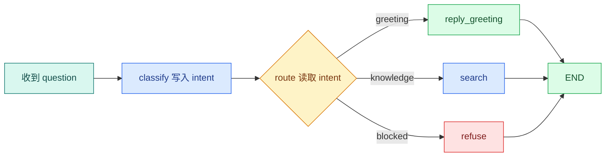

# LangGraph 条件路由与 Reducer：分支为什么不会互相覆盖

在 `State`、`Node` 和 `Edge` 的基础上加入两个真实问题：寒暄不需要检索，危险请求必须拒绝；知识问题则要继续搜索。与此同时，多个节点都可能向 `events` 写入记录，如果没有合并规则，后写入的列表会把前面的列表覆盖。

本篇最终得到一张三分支状态图，并用状态快照验证路由与 **Reducer**。这里的关键不是会背 `add_conditional_edges`，而是知道路由函数读什么、返回什么，节点能改哪些字段，以及同一字段出现多份更新时如何合并。

示例依赖 `langgraph>=0.6,<0.7` 和 `pytest>=8,<9` 的 Python 环境。读者需要先能解释 State、Node 和 super-step；Reducer 的问题只有在理解**状态更新**后才会变得清楚。

## 条件路由是什么

**条件路由**是一次确定的状态选择：它读取当前状态，返回一个路由键，图根据路由键选择下一节点。路由函数不应该调用模型、写数据库或偷偷修改状态；否则同一个快照可能因为副作用得到不同路径，恢复和测试都会变得困难。



`classify` 负责产生结构化 `intent`；`route` 只把它映射成节点名。拆开这两个职责后，可以分别测试“分类结果是否正确”和“状态是否走到正确节点”。

逐节点读图时，先看 `classify`：它可以调用规则或模型，但必须把结果收敛成有限枚举。再看菱形 `route`：它不重新理解问题，只读取已经校验的 `intent`。三条边分别进入寒暄、知识检索和拒答节点，最后都到 `END`；虽然图都结束了，业务结果却分别是成功回答、继续搜索和安全拒绝。

## 为什么分类和路由不能写在一个函数里

模型擅长把自然语言归纳成结构化意图，但它的输出可能缺字段、出现未知值或受提示注入影响。路由属于控制流，一旦选错就会调用不该调用的工具。因此可以让模型提出分类结果，却要经过 Schema 和业务规则后再进入路由函数。

一条稳妥的链路是：

1. 分类器接收问题，返回 `greeting | knowledge | blocked` 和理由。
2. Pydantic 校验枚举、字段长度和置信度范围。
3. 确定性规则覆盖不可委托的边界，例如写操作请求直接标为 `blocked`。
4. 节点把最终 `intent` 写入 State。
5. 路由函数只读取 `intent`，返回固定键。

这里的“确定性”不是说分类永远正确，而是同一份已校验 State 必须得到同一条边。不要在路由函数里再次调用模型、读取当前时间或写数据库，否则 Checkpoint 回放同一状态时可能走向不同节点。

路由键和节点名可以相同，也可以不同。显式映射更容易演进：业务枚举 `knowledge` 可以映射到节点 `retrieve`；将来替换节点名时，无需修改分类协议。

## Reducer 解决什么问题

LangGraph 节点返回的是状态更新，不是要求你原地修改同一个字典。普通字段默认采用覆盖语义：新值替换旧值。用 `Annotated[list[T], operator.add]` 声明的列表则采用追加语义：框架把多份更新合成一个新列表。

这和数据库事务不是一回事。Reducer 只定义图状态更新怎样合并，不提供跨进程锁，也不会替你去重。如果两个并行节点都返回同一个事件，`operator.add` 会保留两份；需要稳定 ID 或去重时，应写自定义 Reducer。

### 没有 Reducer 时究竟发生什么

普通 State 字段使用单值 channel。串行节点先后更新它没有问题，新值覆盖旧值；但同一个 super-step 中有多个节点同时更新这个字段时，运行时无法判断哪个值代表正确结果，应暴露并发更新冲突。不要依赖“完成得晚的节点覆盖完成得早的节点”，并行完成顺序不稳定，而且这会掩盖状态所有权错误。

Reducer 接收两个值：channel 已有值 `left` 和本次更新 `right`，返回合并后的新值。并行更新可能以不同组合顺序进入 Reducer，所以一个用于并行聚合的 Reducer 最好满足：

- 结合律：`merge(merge(a, b), c)` 与 `merge(a, merge(b, c))` 一致；
- 交换律：如果业务不关心完成顺序，`merge(a, b)` 与 `merge(b, a)` 一致；
- 幂等性：发生重试时，`merge(a, a)` 不制造重复数据；
- 确定性：相同输入集合始终得到相同排序和内容。

`operator.add` 对列表满足结合律，但不满足交换律和幂等性：顺序变化会改变列表顺序，重复输入会保留两份。因此它适合只追加、允许重复且顺序有明确来源的简单日志，不适合直接作为生产证据融合规则。

| 字段 | 合并规则 | 适合的数据 | 风险 |
| --- | --- | --- | --- |
| `intent` | 覆盖 | 单一分类结果 | 多节点同时写会互相覆盖 |
| `answer` | 覆盖 | 终态文本 | 只能有一个所有者 |
| `events` | 追加 | 节点事件 | 需要稳定顺序和去重 |
| `evidence` | 自定义去重 | 多路证据 | 不能只按正文去重 |

## 为证据写一个真正可用的 Reducer

下面的 `Evidence` 带稳定 ID、来源通道和分数。Reducer 按 ID 去重；同一证据被多路召回时保留较高分版本，并把通道集合并起来；最后按分数降序、ID 升序排列。输入是两份证据列表，输出仍是一份新列表，不修改任何输入对象。

```python
from __future__ import annotations

from typing import Annotated, TypedDict


# Evidence 保存可追溯来源、稳定标识和可见范围，供 Claim 绑定与引用校验。
class Evidence(TypedDict):
    id: str
    text: str
    score: float
    channels: list[str]


def merge_evidence(
    left: list[Evidence],
    right: list[Evidence],
) -> list[Evidence]:
    # 使用稳定证据 ID 建表，而不是拿可能重复的正文当键。
    merged: dict[str, Evidence] = {}

    for item in [*left, *right]:
        evidence_id = item["id"]
        current = merged.get(evidence_id)

        # 在选择高分版本前先保留双方通道，避免覆盖时丢信息。
        all_channels = set(item["channels"])
        if current is not None:
            all_channels.update(current["channels"])

        if current is None or item["score"] > current["score"]:
            # 创建新字典，避免后续修改调用方传入的对象。
            merged[evidence_id] = {
                **item,
                "channels": sorted(all_channels),
            }
            current = merged[evidence_id]
        else:
            # 当前高分版本胜出时，也合并新到结果贡献的通道。
            current["channels"] = sorted(all_channels)

    # 并行完成顺序不稳定，所以显式建立最终排序。
    return sorted(
        merged.values(),
        key=lambda item: (-item["score"], item["id"]),
    )


class RetrievalState(TypedDict, total=False):
    evidence: Annotated[list[Evidence], merge_evidence]
```

函数先把 `left` 和 `right` 展开为一个只读遍历序列，再用 `id` 查找同一证据。发现旧 ID 时，必须在选择高分版本之前保存两边的通道集合；否则高分对象覆盖低分对象时会把旧通道一起丢掉。随后保留高分内容，并把 `channels` 写成集合并集。最后的双关键字排序消除了并行返回顺序带来的波动。

这个 Reducer 仍有边界。不同检索器的原始分数不一定同量纲，不能因为向量分数 `0.82` 大于 BM25 分数 `0.76` 就直接认定更相关。工程里通常先在通道内排名，再用 RRF 或 Reranker 统一排序；这里的分数比较只处理“同一个稳定 ID 的多个版本”。权限和知识版本也不应在 Reducer 中补救，越界候选必须在进入合并前被过滤。

## 写出三条路径

环境需要 `langgraph`。代码先定义完整 State，再定义节点和路由，最后连接图。输入只有 `question`，输出包含 `intent`、`answer` 和完整事件列表。


为了验证“用 Python 写出三条路径”，下面的测试把“条件函数只根据已验证状态选择有限**分支**，Reducer 再合并消息与证据而不覆盖其他字段”变成可执行断言。每个用例自己构造输入，并用断言固定返回值或失败状态；某条测试失败时，可以从用例名直接定位到被破坏的契约。

```python
# 条件函数只根据已验证状态选择有限分支，Reducer 再合并消息与证据而不覆盖其他字段。
from __future__ import annotations

import operator
from typing import Annotated, Literal, TypedDict

from langgraph.graph import END, START, StateGraph


class AgentState(TypedDict, total=False):
    # question 保存原始用户输入，后续改写查询不能覆盖它。
    question: str
    intent: Literal["greeting", "knowledge", "blocked"]
    answer: str
    events: Annotated[list[str], operator.add]


def classify(state: AgentState) -> AgentState:
    question = state["question"].strip()
    if question in {"你好", "hello"}:
        intent = "greeting"
    elif "删除" in question or "导出全部" in question:
        intent = "blocked"
    else:
        intent = "knowledge"
    return {"intent": intent, "events": [f"classified:{intent}"]}


def route(state: AgentState) -> str:
    return state["intent"]


def reply_greeting(_state: AgentState) -> AgentState:
    return {"answer": "你好，需要查询什么资料？", "events": ["finished:greeting"]}


# 查询函数只接收业务查询参数；可信 Scope、版本和上限由调用侧一并传入。
def search(state: AgentState) -> AgentState:
    return {"answer": f"准备检索：{state['question']}", "events": ["finished:search"]}


def refuse(_state: AgentState) -> AgentState:
    return {"answer": "当前请求不在只读能力范围内。", "events": ["finished:blocked"]}


# 先用 State 类型创建图构建器，后续节点读写字段都会受这份状态契约约束。
builder = StateGraph(AgentState)
builder.add_node("classify", classify)
# 把纯节点函数注册为图节点；注册本身不会执行函数。
builder.add_node("greeting", reply_greeting)
builder.add_node("knowledge", search)
builder.add_node("blocked", refuse)
builder.add_edge(START, "classify")
# 条件边只接受路由函数返回的有限标签，未知结果不会被当作任意节点名执行。
builder.add_conditional_edges(
    "classify",
    route,
    {"greeting": "greeting", "knowledge": "knowledge", "blocked": "blocked"},
)
builder.add_edge("greeting", END)
builder.add_edge("knowledge", END)
builder.add_edge("blocked", END)
graph = builder.compile()


print(graph.invoke({"question": "你好", "events": []}))
```

调用顺序是 `START -> classify -> route -> 某个终态节点 -> END`。`classify` 返回增量状态，没有把原状态整体复制回来；这能减少节点误写无关字段。`route` 的返回值受映射表限制，若返回未知值，图会明确失败，而不是随便进入某个默认分支。两个节点都写 `events`，Reducer 会得到 `classified:greeting` 和 `finished:greeting` 两条记录。

预期输出的 `intent` 是 `greeting`，`answer` 是寒暄回答，`events` 长度为 2。把问题改成“删除所有资料”会进入 `blocked`，改成“访问申请怎么做”会进入 `knowledge`。

示例中的关键词分类只用于让三条路由可重复运行，不代表企业系统应靠“出现删除二字就拒绝”。真实分类器要使用结构化输出；权限边界则由服务端基于身份、资源范围和工具能力判断。模型负责理解语言，不能负责授予权限。

## 自定义 Reducer 什么时候需要

证据列表不能只用 `operator.add`。同一个片段可能被全文和向量两条通道同时召回，合并时应该按 `evidence_id + release_id` 去重，并保留更高分数或更完整的位置。自定义 Reducer 必须满足确定性：相同输入集合应得到相同输出，最好定义稳定排序，避免并行完成顺序改变最终 Prompt。

```text
输入 A = [E1(score=0.7), E2(score=0.6)]
输入 B = [E1(score=0.8), E3(score=0.5)]
输出   = [E1(score=0.8), E2(score=0.6), E3(score=0.5)]
```

这段推演说明 Reducer 同时承担合并与冲突规则。若冲突涉及权限或版本，不能简单选高分，需要先拒绝越界候选。

## 用性质测试检查 Reducer

只测一组固定输入不够。至少要交换左右输入、重复合并同一结果，并检查输入对象未被修改。下面的测试直接验证前面列出的三个性质。

```python
# 这个用例重复提交或恢复同一运行，确认 Checkpoint、幂等键或事件序号阻止重复副作用。
def test_merge_evidence_is_order_independent_and_idempotent() -> None:
    exact: list[Evidence] = [
        {"id": "e-1", "text": "版本 A", "score": 0.7, "channels": ["exact"]},
        {"id": "e-2", "text": "说明 B", "score": 0.6, "channels": ["exact"]},
    ]
    vector: list[Evidence] = [
        {"id": "e-1", "text": "版本 A", "score": 0.8, "channels": ["vector"]},
        {"id": "e-3", "text": "说明 C", "score": 0.5, "channels": ["vector"]},
    ]

    forward = merge_evidence(exact, vector)
    reversed_result = merge_evidence(vector, exact)

    # 左右输入交换后，内容和顺序都应该一致。
    assert forward == reversed_result
    assert [item["id"] for item in forward] == ["e-1", "e-2", "e-3"]
    assert forward[0]["channels"] == ["exact", "vector"]

    # 把结果再合并一次，不应制造重复证据。
    assert merge_evidence(forward, forward) == forward
    # Reducer 不应改写调用方输入。
    assert exact[0]["channels"] == ["exact"]
```

执行 `pytest -q` 应通过。第一组断言验证交换输入后结果相同；第二组验证稳定排序和通道并集；第三组验证幂等；最后一组防止原地修改输入。若删掉 `sorted`，并行完成顺序变化时第一组断言就可能失败。

## 路由、Reducer 和业务状态机各管什么

这三个概念经常被混成“流程控制”：

| 机制 | 它回答的问题 | 输入 | 输出 |
| --- | --- | --- | --- |
| 条件路由 | 下一步运行哪个节点 | 已提交 State | 路由键、节点名或 Send |
| Reducer | 同一字段的多份更新怎样合并 | 旧 channel 值与新更新 | 新 channel 值 |
| 业务状态机 | Turn 能否从当前状态进入目标状态 | 持久化状态、操作者和条件 | 成功更新或拒绝 |

例如，路由可以选择 `refuse` 节点，Reducer 可以合并两条安全扫描结果，但只有业务状态机能保证已经 `cancelled` 的 Turn 不会被迟到 Worker 改回 `completed`。LangGraph 负责图执行语义，不替代数据库中的条件更新。

## 测试与边界

用 `pytest.mark.parametrize` 覆盖三种问题，断言 `intent`、终态答案和事件序列。再单独测试 `route` 收到非法 intent 时失败。不要只断言最终文本，因为错误路由也可能碰巧生成相似文本。

条件路由适合路径能被有限枚举的状态机。若路由数量由模型动态产生，例如 Planner 创建任意多个研究任务，

带走的练习是为 `evidence` 写一个按稳定 ID 去重的 Reducer，并验证输入顺序交换后输出不变。

完成练习后，再增加 `release_id`：同一个 `evidence.id` 如果来自不同知识版本，Reducer 必须拒绝混合或把版本纳入复合键。写出你的选择和理由，这会直接影响后续 Checkpoint 恢复是否还能复现旧答案。

## 常见问题

### 条件边应该依赖模型原始文本吗？

不应该直接依赖。模型先输出经过 Schema 与领域校验的有限枚举，例如 `knowledge`、`greeting` 或 `reject`，路由函数再把枚举映射到节点。直接匹配自然语言会因措辞变化走错路径，也可能让提示注入构造节点名。路由目标必须在图编译时可枚举，未知值进入明确失败或澄清分支。

### Reducer 解决的只是列表拼接吗？

列表拼接只是最常见例子。Reducer 定义同一 channel 收到多个更新时如何合并，可以是去重集合、最大研究轮次、按稳定键合并候选或结构化错误聚合。它必须满足可预测性，最好具备结合性并避免依赖完成顺序。单值字段若不允许并发写，应让运行时暴露冲突，而不是随便选择最后完成者。

### 为什么错误也需要 Reducer？

并行分支可能同时产生超时、空结果与 ACL 拒绝。只保留最后一个错误会丢掉根因，简单拼字符串又无法决定是否降级。结构化错误至少包含 branch、kind、retryable 和 severity，Reducer 按分支稳定合并；Join 再根据策略判断 ACL 阻断整轮、可选通道超时降级或所有通道为空进入证据不足。

### 条件路由与在 Node 里写 `if` 有什么区别？

节点内部 if 适合局部计算，外部无法单独观察每条路径；条件边把下一节点写进图结构，便于 Trace、测试和 Checkpoint 恢复。若分支影响后续多个节点、终态或资源使用，应优先显式路由。小型字段计算留在节点内即可，避免把每个布尔判断都画成边。选择依据是控制流是否值得独立观测。

### 如何测试条件边和 Reducer？

先把路由函数作为纯函数，用每个合法枚举和未知值测试目标；再直接给 Reducer 不同顺序的更新，证明结果稳定。图级测试覆盖寒暄、知识查询、拒绝、并行写和冲突字段，断言访问过的节点与最终 State，而不是只看答案。故意让两个分支完成顺序相反，可以发现依赖时序的错误合并。
