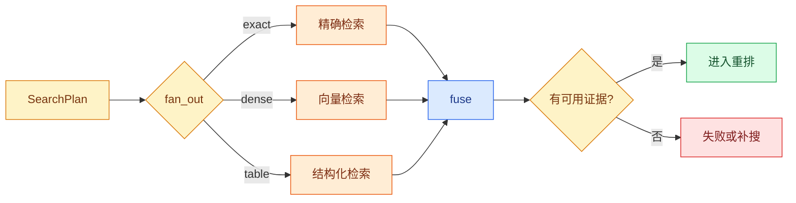

# LangGraph 并行扇出与融合：同时查多种知识源

并行扇出是把一份已校验的父状态拆成多个可独立执行的子任务，扇入再把子任务结果合回父流程。它位于计划和融合之间，用于同时查询互不依赖的知识源；`Send` 描述子任务，Reducer 合并返回值，融合节点决定结果是否足够。

这套机制的用途是缩短互不依赖分支的总等待时间，同时保留每个分支的状态、错误和来源。它属于 LangGraph 的并行编排层，不会自动扩大权限，也不会让单个数据库查询本身变快。

错误码适合精确或全文检索，同义问题适合向量检索，表格字段适合结构化查询。把三条通道串行执行会累加延迟；把它们直接 `asyncio.gather` 在一个节点里，又会隐藏每个分支的状态和错误。LangGraph `Send` 可以把研究计划动态拆成分支，再由融合节点统一处理结果。

可解释的并行链要求父状态在**扇出**前固定问题、权限范围和预算；每个分支只携带自己的通道参数；成功、无结果和失败都转换成结构化信封；融合节点按稳定规则去重、排序并决定是否继续。这个顺序可以防止并行绕过权限或把异常伪装成“没有资料”。

## 扇出和扇入分别是什么

扇出把一份父状态拆成多份子任务。每份子任务共享经过校验的问题和范围，但携带不同的通道配置。**扇入**把子任务结果合回父流程，执行去重、分数归一、排序和错误判断。

在 LangGraph 中，`Send` 不是普通的函数调用，而是向下一步提交一份局部状态。图运行时会为每个 `Send` 产生一个任务；当这些任务都完成后，**Reducer** 按字段合并返回值。父状态中的 `question` 可以只读共享，`active_branch` 只属于子任务，`candidates` 通过追加 Reducer 汇聚，不能让一个分支直接覆盖另一个分支。

“都完成后再融合”带来一个重要语义：融合节点看到的是本轮已经返回的结果，不代表所有分支都成功。每个分支必须返回 `status=ok`、`status=empty` 或稳定错误码，融合器再判断是否有足够证据。把异常直接抛出会使一个非关键通道拖垮整张图；把所有错误吞成空列表又会让回答看起来像“确实没有资料”。



**并行**不会让单个数据库查询变快，它减少的是互不依赖分支的墙钟时间。若三条通道争用同一个连接池或模型资源槽，并行反而可能造成排队，因此扇出数量必须受预算和资源限制。

## `Send` 传递的不是“共享可变对象”

`Send(node_name, arg)` 描述一个待执行的分支任务：目标节点名由图决定，`arg` 是该分支看到的局部输入。它不是 Python 线程，也不是把同一个字典引用交给多个函数。运行时会把每份 `arg` 当作独立任务输入，待目标节点返回后，再依据父 State 的 Reducer 汇总更新。

因此要把父字段和分支字段区分开：

| 数据 | 扇出前的所有者 | 分支是否可以改 | 汇合方式 |
| --- | --- | --- | --- |
| `question` | 父流程 | 只读 | 每个分支携带副本或引用 |
| `acl_scope` | 准入阶段 | 只读 | 不重新计算 |
| `active_branch` | 当前分支 | 可以设置自己的值 | 只进入分支日志，不写共享单值 |
| `candidates` | 各分支 | 追加自己的候选 | 稳定 ID Reducer |
| `errors` | 各分支 | 追加错误信封 | 按 branch 排序 |

如果把可变的 `dict` 或列表放进自定义对象再到多个分支中原地修改，仍然会有竞态。`Send` 的隔离是状态消息层面的，不会拯救你在外部全局变量里存的可变对象。

### 扇出前必须完成三次裁决

1. **权限裁决**：根据用户身份和请求范围生成不可由分支修改的 `acl_scope`，不能把全库 ID 交给分支后再指望它自觉过滤。
2. **预算裁决**：限制最大分支数、每个分支 `top_k`、剩余时间和模型/数据库资源槽。
3. **计划裁决**：只允许白名单通道，未知通道要被拒绝或记录为计划错误。

扇出后再做这三件事已经晚了：不可信分支可能先发起越界查询，多个分支也可能已经耗尽全局预算。

并行的时间预算也要按阶段传播。父请求有一个绝对 Deadline，扇出前先计算 `remaining = deadline - now`，每个子任务只能使用这段剩余时间，不能各自重新从 30 秒开始。通道超时应写入 `timeout` 结果并释放连接；融合器如果已经获得足够覆盖，可以继续，否则进入一次定向补搜或证据不足终态。这样能避免一个慢分支把其他结果也拖到超时。

## 子任务状态要与父状态分开

父状态保存 `question`、`scope`、`branches` 和**合并**后的 `candidates`。子任务还要有 `active_branch`，告诉研究节点当前执行哪一条通道。每个分支返回结构化结果：成功候选、通道名、耗时或稳定错误码。

不要让分支抛出的所有异常直接终止整张图。连接失败可能允许其他通道继续，权限错误则应阻止整个请求。错误分类必须由程序决定，而不是让模型阅读异常字符串。

每个分支都返回同一份错误信封，融合节点才有机会作出一致判断：

```python
from dataclasses import dataclass
from typing import Literal

@dataclass(frozen=True)
class BranchResult:
    branch: str
    # status 区分继续执行、答案就绪和需要追问，调用方无需解析回答文本判断终态。
    status: Literal["ok", "empty", "timeout", "denied", "failed"]
    candidates: tuple[str, ...] = ()
    error_code: str = ""

def classify_branch_failure(branch: str, error: Exception) -> BranchResult:
    # 只有已知异常才转换成可判断的稳定错误码。
    if isinstance(error, TimeoutError):
        return BranchResult(branch, "timeout", error_code="deadline")
    # 在数据进入下游前应用可信权限范围，用户文本和模型参数都不能扩大可见集合。
    if isinstance(error, PermissionError):
        return BranchResult(branch, "denied", error_code="acl")
    return BranchResult(branch, "failed", error_code=type(error).__name__)
```

`BranchResult` 用不可变 `dataclass` 表达一个分支的最终报告。`status=timeout` 说明通道没有在预算内完成，`empty` 说明正常完成但没有命中，`denied` 是安全错误，不应被当成普通空结果。`classify_branch_failure` 保留分支名并把已知异常映射成稳定错误码；生产代码还要在信封里带 `turn_id`、`branch_id`、`attempt` 和耗时。

不要在最外层用 `except Exception: return []`。这种写法会把编程错误、数据库故障、权限拒绝和真实空结果压成同一个状态，融合器无法判断是否可以继续。允许降级的异常要逐类列出，未知异常应让当前执行失败并留下 Trace。

| 错误 | 局部继续 | 是否重试 | 终态影响 |
| --- | --- | --- | --- |
| 某通道超时 | 可以 | 剩余 Deadline 内有限重试 | 记录降级 |
| 查询参数非法 | 不应继续该通道 | 否 | 计划错误 |
| ACL 校验失败 | 不可以 | 否 | 整体拒绝 |
| 无结果 | 可以 | 可触发一次定向补搜 | 证据不足 |

## 最小图

下面使用 `Send` 创建三个研究任务。为保持示例可运行，检索函数返回固定匿名数据；真实仓储只需维持相同的结果契约。

下面把“最小图”落成最小实现。代码关注“图把同一只读查询扇出到精确、全文与向量分支，结果携带通道状态后由 Reducer 汇合”；输入从函数参数或上文定义的状态对象进入，关键分支负责校验或修改状态，返回值再交给后续调用。

```python
# 图把同一只读查询扇出到精确、全文与向量分支，结果携带通道状态后由 Reducer 汇合。
from __future__ import annotations

import operator
from typing import Annotated, TypedDict

from langgraph.graph import END, START, StateGraph
from langgraph.types import Send

class ResearchState(TypedDict, total=False):
    # question 保存原始用户输入，后续改写查询不能覆盖它。
    question: str
    branches: list[str]
    active_branch: str
    candidates: Annotated[list[dict[str, object]], operator.add]
    errors: Annotated[list[dict[str, str]], operator.add]
    answer: str

def fan_out(state: ResearchState) -> list[Send]:
    # 先按可信范围裁剪候选，越权数据不会进入后续排序、缓存或返回值。
    allowed = {"exact", "dense", "table"}
    branches = [name for name in state["branches"] if name in allowed]
    return [Send("research", {**state, "active_branch": name}) for name in branches]

def research(state: ResearchState) -> ResearchState:
    branch = state["active_branch"]
    if branch == "table" and "负责人" not in state["question"]:
        return {"errors": [{"branch": branch, "code": "not_applicable"}]}
    return {
        "candidates": [
            {"id": f"{branch}:1", "source": branch, "score": 0.8, "text": "匿名证据"}
        ]
    }

def fuse(state: ResearchState) -> ResearchState:
    best_by_id: dict[str, dict[str, object]] = {}
    for item in state.get("candidates", []):
        current = best_by_id.get(str(item["id"]))
        if current is None or float(item["score"]) > float(current["score"]):
            best_by_id[str(item["id"])] = item
    ordered = sorted(best_by_id.values(), key=lambda item: (-float(item["score"]), str(item["id"])))
    if not ordered:
        return {"answer": "当前可见范围没有足够证据。"}
    return {"answer": f"融合得到 {len(ordered)} 条候选。"}

# 先用 State 类型创建图构建器，后续节点读写字段都会受这份状态契约约束。
builder = StateGraph(ResearchState)
builder.add_conditional_edges(START, fan_out)
# 把纯节点函数注册为图节点；注册本身不会执行函数。
builder.add_node("research", research)
builder.add_node("fuse", fuse)
builder.add_edge("research", "fuse")
builder.add_edge("fuse", END)
# 编译阶段检查图结构，并把 Checkpointer 注入可恢复的运行时。
graph = builder.compile()

result = graph.invoke(
    {"question": "访问申请怎么办", "branches": ["exact", "dense", "table"], "candidates": [], "errors": []}
)
print(result["answer"], result["errors"])
```

`fan_out` 先用白名单过滤模型或 Planner 给出的通道，随后为每个通道生成一份子状态。`research` 只读取 `active_branch`，返回候选或错误增量。`candidates` 和 `errors` 使用追加 Reducer，因此并行结果不会覆盖。`fuse` 再按稳定 ID 去重，并用分数和 ID 建立稳定排序。

示例中 table 分支返回 `not_applicable`，exact 与 dense 仍会提供候选，最终输出 `融合得到 2 条候选`。如果所有分支都不适用，融合节点进入证据不足，不应该让模型用常识补答案。

注意 `fan_out` 的 `allowed` 是程序白名单，不能直接相信 `state["branches"]`。在真实 Agent 中，`branches` 往往来自 Planner 的结构化输出；Planner 可以建议“查图谱”，但只有当前用户有图谱范围、系统还有资源槽时，准入节点才把它变成 `Send`。分支返回的 `source` 也要来自服务端赋值，不接受模型在结果里伪造来源。

## 分支为什么要有局部超时和全局 Deadline

父请求的 Deadline 是一个绝对时间点，例如 `2026-08-11T12:00:10Z`，不是每个分支都能重新获得的 5 秒。执行器在创建 `Send` 前计算剩余时间，再把 `branch_deadline` 写入子任务。分支内部所有数据库、HTTP 和模型调用都必须使用更短的超时；超时后返回 `timeout` 信封并释放资源。

假设父请求还剩 900ms：全文分支分配 500ms，向量分支分配 700ms，结构化分支分配 300ms。三个数字不用相加，因为它们是并行预算；但重试必须从父请求剩余时间中扣除，不能在向量超时后再无条件重试 700ms。

融合器使用“证据充分”作为提前停止条件时，仍要记录被取消分支的终态。否则用户看见答案，却无法知道结构化通道是成功、超时还是尚未开始。事件和指标至少区分 `branch_started`、`branch_completed`、`branch_timeout`、`branch_cancelled`。

示例里的 `score` 只是教学数据，不能直接比较不同检索器的真实分数。全文检索可能返回 BM25 分数，向量检索返回余弦相似度，量纲和分布都不同。工程上可以先在各通道内取 Top-K，再使用 Reciprocal Rank Fusion（RRF）等基于名次的融合：

```python
# 每个分支取局部上限与全局剩余时间的较小值，失败只标记该通道且不会重置整轮 Deadline。
from collections import defaultdict

def reciprocal_rank_fusion(rankings: list[list[str]], constant: int = 60) -> list[str]:
    # 同一文档在不同通道的名次贡献累加到 scores，键使用稳定文档 ID。
    scores: dict[str, float] = defaultdict(float)
    for ranking in rankings:
        for position, document_id in enumerate(ranking, start=1):
            scores[document_id] += 1 / (constant + position)
    # 按融合分数降序返回，并用稳定文档 ID 打破同分，确保结果可以复现。
    return sorted(scores, key=lambda document_id: (-scores[document_id], document_id))

print(reciprocal_rank_fusion([["a", "b"], ["b", "c"]]))
```

`rankings` 是每条通道按自身规则排好的 ID 列表；`position` 越靠前，贡献的倒数分越高；同一文档出现在多条列表中会累加分数；最后用 ID 作为并列时的稳定次关键字。输出会优先考虑同时被多路召回的文档。RRF 仍然不替代 ACL、版本过滤和 Rerank，实际文本要在融合后再按证据覆盖和权限检查。

RRF 的输入是每个通道自己的名次，不是原始分数，因此适合分数不可直接比较的场景。它也有边界：一个通道如果返回了大量重复切片，可能通过名次影响融合；需要在通道内先按稳定文档/片段 ID 去重，并限制每路 Top-K。融合之后还要做版本、权限和父子片段去重，最后才把有限证据交给重排或生成。

## 并行状态为什么还需要预算

一次扇出会放大数据库连接、Embedding、Rerank 和 Token 消耗。SearchPlan 应为每个分支声明目的、最大候选数和剩余时间；执行器还要施加全局并发上限。一个请求最多三条分支，不代表十个请求可以同时占用三十个模型槽。

并行完成顺序也不稳定。最终 Prompt 不能直接使用“谁先返回谁在前”，应由融合节点按明确规则排序。否则同一个问题可能因为网络抖动改变证据顺序，导致回答和评测波动。

测试还要验证 Reducer 的类型边界：一个分支返回 `candidates`，另一个返回 `errors`，两者都应出现在融合输入；如果把字段写成普通 `list`，后写的分支可能覆盖先写结果。并行任务的日志必须带 `turn_id`、`branch`、`attempt` 和 `deadline_at`，这样慢分支被取消时仍能解释它是否真的结束。

## 用乱序和部分失败检验并行语义

测试一条分支成功、一条分支超时、全部空结果和 ACL 失败四种情况。断言候选来源、错误码、融合顺序和终态。进一步验证是加入第四个 `graph` 分支，但把全局最大分支数限制为 3，并说明 Planner 如何选择舍弃项。

可以把分支测试写成不依赖网络的纯函数测试：传入固定的 `SearchPlan`，断言生成的 `Send` 数量不超过上限；传入一条 `denied` 信封，断言融合器拒绝输出；交换候选返回顺序，断言最终 ID 顺序不变。再做一次故障注入：让向量分支抛出 `TimeoutError`，验证全文证据仍能进入回答，但终态事件里保留降级原因。


**哪些 Agent 任务适合并行扇出？**

任务必须共享已冻结输入、彼此没有数据依赖，并且结果可以在明确 Join 中合并，例如全文、向量和结构化检索。后一个查询依赖前一个实体、多步审批或会修改相同资源的动作不适合直接并行。扇出前还要限制分支数、总预算和每支输出大小，否则 Planner 一次生成几十个任务会同时压垮依赖。

**LangGraph `Send` 与固定并行边有什么区别？**

固定并行边在建图时就知道分支数量和节点；`Send` 可以根据当前 State 动态创建多个同类任务，并给每个任务独立输入。动态不等于无限，Runtime 仍要校验任务 Schema、通道白名单和最大分支数。结果通过 Reducer 汇入共享 channel，不能让每个 **Send** 直接覆盖同一个 candidates 字段。

**一个分支超时，其他分支结果是否应该丢弃？**

取决于该分支的责任。ACL 或版本校验失败通常阻断整轮，因为继续可能泄露；可选的别名扩展或某个辅助检索超时，可以保留其他候选并标记 degraded。策略应在扇出前写进分支契约，Join 根据结构化 severity 决定。不能让模型读取异常文本后临时判断，因为它不了解安全和可用性边界。

**并行分支怎样共享 Deadline？**

入口计算绝对 deadline_at，每支开始前用当前时间计算 remaining，并从同一总预算分配局部 timeout。并行不意味着每个分支重新获得完整时限；某支重试也只能消耗剩余时间。Join 在总 Deadline 到达时取消未完成 Task，保留已完成结果和超时状态，再按覆盖策略决定降级、补搜或结束。

**怎样让并行结果不依赖完成顺序？**

每个结果带稳定 branch ID、task ID、score、来源和错误类型，Reducer 先按稳定键去重，融合再使用明确排序与 tie-breaker。不要 append 后直接取前 K，因为网络快的分支会获得位置优势。测试时交换完成顺序并断言最终候选、错误集合和终态相同；若不同，就说明合并函数仍包含时间竞争。
