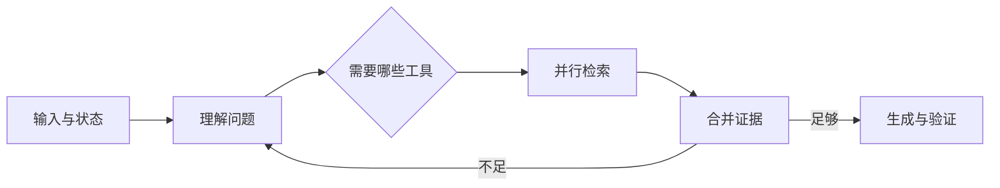

# LangGraph 与状态编排

一个最小 Agent 只需“模型决定工具、程序执行、把结果交回模型”的循环。流程增加并行检索、人工暂停和恢复后，循环里会出现大量条件，开发者很难回答当前运行到了哪里。

本篇先比较常见方案的关注点，再解释为什么状态图适合复杂后端编排。框架没有统一的“最好”，选择取决于谁控制循环、状态和部署。

## 常见 Agent 方案怎样理解

| 方案 | 主要关注点 | 更适合的起点 |
| --- | --- | --- |
| OpenAI Agents SDK | Agent 循环、工具、交接、护栏、会话和 Trace | 希望 SDK 管理重复工具循环 |
| LangGraph | 显式状态、条件边、并行与持久化 | 复杂流程需要查看和恢复状态 |
| AutoGen | 多 Agent 消息和协作模式 | 研究多角色协作 |
| CrewAI | 角色、任务与团队编排 | 快速表达角色分工 |
| Semantic Kernel | 插件、流程与企业应用集成 | .NET 或多语言企业系统 |
| Dify | 可视化编排、模型和知识库运营 | 低代码验证与运营配置 |

OpenAI 官方将 Responses API 与 Agents SDK 区分为“应用自己控制循环”和“SDK 管理 Agent 运行循环”。LangGraph则更强调应用显式定义图状态和边。

## 状态图把流程拆成什么

节点接收状态并返回增量，边决定下一节点，Reducer 合并并行结果，Checkpointer 可在配置后保存图快照。

## 第一步：先写普通串行函数

理解、检索和生成只有固定顺序时，先用普通函数。它容易调试，也能帮助团队明确每步输入与输出。

当出现三类复杂度时再考虑图：路径由结果决定、独立分支需要并行、运行要暂停或恢复。不要为了使用框架把简单请求拆成十几个空节点。

## 第二步：定义最小状态

状态只保存跨节点需要的信息，例如问题、访问范围、计划、证据和验证问题。数据库连接与 SDK 客户端通过依赖提供，不塞进状态。

并行字段要定义合并规则。证据列表可以追加后去重，研究轮次可以取最大值；不能依赖哪个分支最后完成就覆盖其他结果。

## 第三步：条件边负责停止

模型可以建议“继续检索”，程序根据轮次、时间和 Token 预算决定是否允许。证据不足且仍有预算时回到研究，达到上限就返回不足，不形成无限循环。

Checkpoint 也不是默认开启越多越好。短请求可以直接运行，需要恢复或人工暂停的模式再持久化。

## 正常结果和失败结果

正常图在两个检索分支完成后合并证据，覆盖足够就生成；覆盖不足只补充缺口，并在最大轮次结束。

失败图让节点直接修改共享全局对象，并行完成顺序不同就得到不同结果；又把循环条件交给模型，导致不断调用工具。

## 框架之外仍要自己负责什么

认证、ACL、数据库事务、工具副作用、幂等、成本预算和业务终态属于应用责任。状态图能表达这些步骤，却不会自动保证它们正确。

Agent 实践第 08 篇会把真实知识问答拆成状态、动态分支与 Reducer。

## 从普通流程推导一张状态图

初学 LangGraph 时不要先背 API。先写出一条能运行的串行流程，再标记哪些地方会出现选择、循环、并行或暂停。以资料问答为例，`understand -> retrieve -> answer -> verify` 可以先作为普通函数；只有验证发现证据缺口时，才增加一条回到检索的条件边。

| 设计对象 | 要回答的问题 | 资料问答示例 |
| --- | --- | --- |
| State | 后续节点确实需要保留什么 | 问题、访问范围、证据、剩余轮次 |
| Node | 这个步骤能独立测试什么 | 检索节点输入查询，输出证据增量 |
| Edge | 哪个已知结果决定下一步 | `evidence_sufficient` 决定生成或补检 |
| Reducer | 并行结果怎样稳定合并 | 按证据 ID 去重，而非后完成者覆盖 |
| Checkpoint | 中断后从哪里恢复才有价值 | 等待人工确认或长时间研究模式 |

画图时给每条循环边写上程序可判断的上限，例如剩余轮次、Deadline 或工具预算。只有“模型认为还要继续”而没有硬停止条件，图就可能一直循环。并行分支也要先定义合并规则，否则相同输入会因为完成顺序不同得到不同状态。

### 先验证图，再接模型

用固定假数据替代模型和检索：第一次返回证据不足，第二次返回两条证据。断言节点顺序为“理解、检索、补检、生成、验证”，并断言补检最多发生一次。这样可以确认编排本身正确。随后再接真实模型，语义波动与流程错误就不会混在一起。

当流程只有固定三步、无需恢复也没有分支时，继续使用普通函数。状态图的价值来自显式控制复杂路径，不来自节点数量。

## 参考资料

- [OpenAI：Agents SDK](https://developers.openai.com/api/docs/guides/agents)
- [LangGraph：Graph API](https://docs.langchain.com/oss/python/langgraph/graph-api)
- [Microsoft AutoGen](https://microsoft.github.io/autogen/stable/)
- [Dify Documentation](https://docs.dify.ai/)
