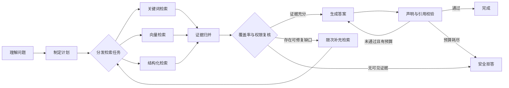

# LangGraph 与状态编排

把三个函数依次调用，并不会因为换成 LangGraph 就自动成为可靠的 Agent。图编排真正解决的是另一组问题：一次执行经过了哪些稳定状态，哪个节点可以重试，多个分支怎样合并，进程中断后从哪里恢复，以及已经发生的外部副作用会不会重复。

本文以“带权限范围的证据问答”为例，按状态协议、Reducer、路由、并行、Checkpoint、Interrupt 和测试顺序推导一套可恢复工作流。示例根据 LangGraph 官方 Graph API 与 Persistence 文档重新编写，不复制任何业务项目源码；其中涉及数据、标识和指标的地方均为模拟场景。

## 先定义问题：图不是流程图，而是状态转换系统

假设一次问答需要完成以下工作：理解问题、制定检索计划、从多个通道取证、合并与复核证据、生成答案、验证引用。某些问题没有可见证据就必须拒答，某些写操作还必须等待人工审批。



图中的箭头只描述拓扑，无法回答下面这些工程问题：

| 问题 | 必须落到的协议 |
| --- | --- |
| 两个检索分支同时写 `evidence` 会发生什么 | Reducer 的合并语义 |
| Worker 在检索后崩溃，从哪里继续 | Checkpoint 与线程标识 |
| 恢复是否会再次发送通知 | 领域幂等键与操作日志 |
| 补充检索最多执行几次 | 显式预算与终止条件 |
| 等待人工批准期间资源是否被占用 | Interrupt 与持久化恢复 |
| 部署后能否恢复旧任务 | State Schema 与图版本迁移 |

因此设计顺序应是：先定义状态和转换不变量，再画节点与边，最后选择 Checkpointer 和运行基础设施。

## State 是节点间的公开协议

LangGraph 节点接收当前 State，并返回一份部分更新。State 不只是“方便函数共享数据的字典”，它还是并行归并、持久化、调试和版本迁移共同依赖的协议。

```python
from __future__ import annotations

from typing import Annotated, Literal, TypedDict


class Evidence(TypedDict):
    evidence_id: str
    source_ref: str
    excerpt: str
    channel: Literal["keyword", "vector", "structured"]
    score: float


class ValidationResult(TypedDict):
    unsupported_claims: list[str]
    forbidden_evidence_ids: list[str]
    passed: bool


class AgentState(TypedDict):
    schema_version: Literal[3]
    turn_id: str
    query: str
    allowed_scope_ids: tuple[str, ...]
    plan: dict[str, object] | None
    evidence: Annotated[list[Evidence], merge_evidence]
    answer: str | None
    validation: ValidationResult | None
    research_round: int
    remaining_tool_calls: int
    deadline_at: str
    terminal_reason: str | None
```

这份 State 刻意只保存可序列化的业务事实和稳定引用，不保存以下对象：

- 数据库 Session、HTTP Client、线程锁和文件句柄；
- 函数、回调和依赖注入容器；
- 未裁剪的整篇文档、模型隐藏推理和任意调试对象；
- 只在某个进程内有效的缓存地址或临时路径。

基础设施对象应在节点的短生命周期内获取并及时释放。大型原文写入文档存储，State 只保存证据标识、公开摘录和版本。否则 Checkpoint 会不断膨胀，恢复还可能因为对象不可序列化或资源已经失效而失败。

### 状态字段要表达事实，不表达偶然过程

`research_round` 是可以恢复的业务事实；“当前 for 循环执行到第几次”只是函数内部过程。`allowed_scope_ids` 是本次执行的权限快照；数据库查询对象不是。`terminal_reason` 说明为什么进入终态；只写一个布尔值 `done` 会丢掉拒答、超时、取消和失败之间的语义。

状态字段越模糊，路由函数越容易重新解析字符串。例如把 Planner 的整段自然语言塞进 `planText`，后续用 `includes("vector")` 决定节点，这种图既不可验证，也会在模型措辞变化后走错分支。模型输出应先经过 Schema 校验，转换成有限枚举和结构化任务。

## Reducer 决定并行状态能否一致

LangGraph 对普通字段采用覆盖语义；并行节点若同时更新同一个普通字段，运行时无法替业务猜测如何合并。通过 `Annotated` 绑定 Reducer，才能声明并发更新的归并规则。

一个证据 Reducer 至少需要解决：重试重复、更优版本覆盖、稳定排序和不可见字段清理。

```python
def merge_evidence(
    left: list[Evidence],
    right: list[Evidence],
) -> list[Evidence]:
    by_id = {item["evidence_id"]: item for item in left}

    for item in right:
        current = by_id.get(item["evidence_id"])
        if current is None or item["score"] > current["score"]:
            by_id[item["evidence_id"]] = item

    return sorted(
        by_id.values(),
        key=lambda item: (-item["score"], item["evidence_id"]),
    )
```

`list.extend` 只完成了“追加”，没有完成一致性协议：节点重试会产生重复证据，并行完成顺序会影响最终列表。使用 `set` 也不完整，因为它会丢失更优版本和稳定次序。

Reducer 应尽量满足以下性质：

| 性质 | 验证问题 | 缺失后的表现 |
| --- | --- | --- |
| 确定性 | 相同输入是否得到逐字相同结果 | 回放或快照随机漂移 |
| 幂等性 | 同一批更新应用两次是否不变 | 重试制造重复消息或证据 |
| 结合性 | `(a+b)+c` 是否等于 `a+(b+c)` | 并行分组方式改变结果 |
| 稳定次序 | 同分项是否有明确次级排序 | 测试偶发失败、答案引用抖动 |

```python
def test_merge_is_idempotent() -> None:
    batch = [
        {
            "evidence_id": "e-1",
            "source_ref": "document-1",
            "excerpt": "example",
            "channel": "keyword",
            "score": 0.8,
        }
    ]
    assert merge_evidence(batch, batch) == batch


def test_merge_is_associative() -> None:
    a, b, c = evidence_batches()
    assert merge_evidence(merge_evidence(a, b), c) == merge_evidence(
        a, merge_evidence(b, c)
    )
```

如果两个更新根本无法无损合并，例如两个分支都要修改一份复杂计划，不应继续写一个“万能 Reducer”。更清晰的方式是让分支写入独立结果字段，再由一个单线程裁决节点生成新计划。

## 节点返回增量，错误不能伪装成空结果

理想节点像一个显式状态转换：只读取声明字段，返回新的字段增量，不原地修改共享列表，也不在内部悄悄发送通知。

```python
async def understand(state: AgentState) -> dict[str, object]:
    parsed = await understanding_service.parse(
        query=state["query"],
        allowed_scopes=state["allowed_scope_ids"],
        deadline_at=state["deadline_at"],
    )
    return {"plan": parsed.model_dump(mode="json")}
```

“检索成功但没有命中”和“数据库不可用”不能都返回 `evidence=[]`。前者是业务结果，后者是运行失败。若节点捕获所有异常并转换为空数组，下游会认为检索已经完成，进而生成没有依据的答案。

建议把错误至少分为三类：

| 类型 | 例子 | 图层策略 |
| --- | --- | --- |
| 可重试运行错误 | 连接重置、短期限流 | 在截止时间内退避重试 |
| 不可重试输入错误 | Schema 不合法、未知通道 | 安全失败或请求澄清 |
| 业务无结果 | 指定范围确实没有可见证据 | 拒答，不回退到越权范围 |

## 条件边只消费结构化判断

路由函数应当是确定性的纯函数。它读取校验结果、预算和终态字段，返回有限节点名，而不是再次调用模型或解析自然语言。

```python
from typing import Literal


def route_after_validation(
    state: AgentState,
) -> Literal["complete", "repair", "reject"]:
    result = state["validation"]
    if result is None:
        return "reject"
    if result["forbidden_evidence_ids"]:
        return "reject"
    if result["unsupported_claims"]:
        if state["remaining_tool_calls"] > 0:
            return "repair"
        return "reject"
    return "complete"
```

有限枚举让所有边都能进入测试矩阵。新增一个路由值时，类型检查和图构建能够暴露未处理分支；字符串包含判断则只能等线上出现特殊措辞。

## 动态 fan-out：先分预算，再创建 Send

固定三路检索可以直接添加三条边；当通道由计划动态决定时，LangGraph 的 `Send` 可以为同一节点创建多份输入。关键不是 API 本身，而是扇出前必须限制分支数并分配总预算。

```python
from langgraph.types import Send


def dispatch_retrieval(state: AgentState) -> list[Send] | str:
    tasks = list(state["plan"].get("retrieval_tasks", []))[:4]
    if not tasks:
        return "fuse"

    available = max(0, state["remaining_tool_calls"])
    if available == 0:
        return "reject"

    selected = tasks[:available]
    return [
        Send(
            "retrieve",
            {
                "turn_id": state["turn_id"],
                "query": task["query"],
                "allowed_scope_ids": state["allowed_scope_ids"],
                "channel": task["channel"],
                "budget": 1,
            },
        )
        for task in selected
    ]
```

如果 State 写着“还剩 10 次工具调用”，然后四个分支各自继承完整数字，理论预算会膨胀为 40 次。可以在扇出前静态分配，也可以让分支从一个原子配额服务领取；不能靠 Prompt 要求模型“省一点”。

fan-in 后也不要让每个分支各生成一份答案再投票。这会重复消耗生成 Token，并让权限、引用和冲突裁决分散到多个上下文。更稳定的链路是：各分支只返回候选证据，Reducer 归并后统一做权限复核、重排和答案生成。

## 编译图：拓扑应能从代码直接读出来

下面是缩小后的图声明，展示节点、普通边和条件边如何组合。生产实现还需要依赖注入、超时、追踪和 Checkpointer。

```python
from langgraph.graph import END, START, StateGraph


builder = StateGraph(AgentState)
builder.add_node("understand", understand)
builder.add_node("retrieve", retrieve)
builder.add_node("fuse", fuse)
builder.add_node("compose", compose)
builder.add_node("validate", validate)
builder.add_node("repair", repair)
builder.add_node("reject", reject)

builder.add_edge(START, "understand")
builder.add_conditional_edges("understand", dispatch_retrieval)
builder.add_edge("retrieve", "fuse")
builder.add_edge("fuse", "compose")
builder.add_edge("compose", "validate")
builder.add_conditional_edges(
    "validate",
    route_after_validation,
    {
        "complete": END,
        "repair": "repair",
        "reject": "reject",
    },
)
builder.add_edge("repair", "compose")
builder.add_edge("reject", END)
```

这段代码有两个必须额外验证的地方。第一，多个 `retrieve` 分支是否真的在预期的 barrier 后进入 `fuse`，需要图级测试确认，而不是只看示意图。第二，`repair -> compose -> validate` 构成循环，必须由 `remaining_tool_calls`、修复次数或截止时间保证终止。

## Checkpoint 保存图状态，不保存外部世界

启用 Checkpointer 后，LangGraph 可以按 `thread_id` 保存 State 快照，并从节点边界恢复。它能够记住哪些图内步骤已经完成，但无法回滚已经发送的邮件、外部系统写入或计费动作。

恢复能力至少包含四个组件：

1. 稳定且经过授权的线程标识；
2. 与运行环境匹配的持久化 Checkpointer；
3. 可序列化、可迁移的 State；
4. 对图外副作用独立生效的幂等协议。

下面的集成测试比“Mock 了 saver 方法”更有证明力：它使用持久 Checkpointer，在第一个节点后中断，再以同一线程恢复，并断言第一个节点没有被重放。

```python
async def test_resume_does_not_replay_completed_node(checkpointer) -> None:
    calls = {"first": 0, "second": 0}

    async def first(state: CounterState) -> dict[str, int]:
        calls["first"] += 1
        return {"value": state["value"] + 1}

    async def second(state: CounterState) -> dict[str, int]:
        calls["second"] += 1
        return {"value": state["value"] + 1}

    graph = build_counter_graph(first, second).compile(checkpointer=checkpointer)
    config = {"configurable": {"thread_id": "example-turn-1"}}

    interrupted = await graph.ainvoke(
        {"value": 0},
        config=config,
        interrupt_after=["first"],
    )
    assert interrupted == {"value": 1}
    assert (await graph.aget_state(config)).next == ("second",)

    resumed = await graph.ainvoke(None, config=config)
    assert resumed == {"value": 2}
    assert calls == {"first": 1, "second": 1}
```

API 不能接受客户端任意传入一个可猜测 `thread_id` 后直接读取 Checkpoint。线程需要绑定当前主体、租户或会话，并在每次恢复时重新鉴权。权限可能在暂停期间被撤销，因此 State 里的旧权限快照不能永远当作授权事实。

## 外部副作用需要领域幂等，不存在“自动恰好一次”

假设发布节点成功调用外部服务，但进程在写 Checkpoint 前崩溃。恢复后该节点可能再次执行。仅靠“调用前查询本地日志”仍有时间窗口：外部调用已经成功，本地日志却还没来得及记录。

```python
async def publish_answer(state: AgentState) -> dict[str, object]:
    operation_key = f"{state['turn_id']}:publish-answer:v1"

    known = await operation_store.find(operation_key)
    if known and known.status == "succeeded":
        return {"published_ref": known.result_ref}

    result = await publisher.publish_once(
        idempotency_key=operation_key,
        content=state["answer"],
    )
    await operation_store.record_success(operation_key, result.public_ref)
    return {"published_ref": result.public_ref}
```

真正闭合窗口需要下游也识别相同幂等键，或者提供按幂等键查询操作状态的能力。对于无法幂等的第三方副作用，应设计人工确认、补偿流程或 transactional outbox，而不是声称 Checkpoint 提供了 exactly-once。

## Interrupt：人工审批必须绑定原提案

`interrupt()` 可以暂停图并向调用方返回审批材料；恢复时通过 `Command(resume=...)` 传回决定。恢复数据仍是外部输入，必须重新校验身份、有效期以及它是否对应原提案。

```python
from langgraph.types import interrupt


def request_approval(state: WriteState) -> dict[str, str]:
    proposal = state["write_proposal"]
    decision = interrupt(
        {
            "action": proposal["action"],
            "public_target": proposal["public_target"],
            "argument_digest": proposal["argument_digest"],
            "expires_at": proposal["expires_at"],
        }
    )

    if decision["argument_digest"] != proposal["argument_digest"]:
        raise PermissionError("approval does not match current proposal")
    if not decision["approved"]:
        return {"approval_state": "rejected"}
    return {"approval_state": "approved"}
```

批准后如果工具参数、目标资源或主体发生变化，必须重新审批。等待期间不应占用 Worker、数据库事务或长连接；图依靠持久 Checkpoint 休眠，事件层只保存可公开的审批摘要，不泄露工具原始响应和隐藏上下文。

## 重试、修复循环和恢复不是一回事

这三个机制经常被混在一起：

| 机制 | 解决的问题 | 典型上限 |
| --- | --- | --- |
| 节点重试 | 短暂网络错误、限流 | 次数 + 指数退避 + deadline |
| 业务修复循环 | 证据覆盖不足、引用校验失败 | 研究轮数 + Token/工具预算 |
| Checkpoint 恢复 | 进程退出、人工等待后继续 | State/图版本兼容 + 重新鉴权 |

不要在 SDK、节点函数和图策略三层同时重试同一个请求。每层重试三次，最坏会放大为 27 次调用。统一决定谁拥有重试策略，并把尝试次数、等待时间和最终错误类型写入 Trace。

## State 与图都需要版本演进

持久化图意味着新版本部署后，数据库里仍可能存在旧 State。新增可选字段通常可以提供默认值；字段重命名、类型变化和语义拆分需要显式迁移。

```python
def migrate_state(raw: dict[str, object]) -> AgentState:
    version = int(raw.get("schema_version", 1))

    if version == 1:
        raw["allowed_scope_ids"] = tuple(raw.pop("collections", []))
        raw["remaining_tool_calls"] = 6
        raw["schema_version"] = 2
        version = 2

    if version == 2:
        raw["terminal_reason"] = None
        raw["schema_version"] = 3

    return AgentState(**raw)
```

迁移函数必须拿旧版本 fixture 做测试。对于无法安全迁移的长任务，更保守的发布方法是让旧 Worker 只完成旧图线程，新 Worker 只接收新线程，待旧任务排空后再下线旧版本。

## 验证：从节点单测扩展到恢复和副作用

仅给每个节点写 Mock 单测，不能证明图正确。测试应分层：

| 层级 | 重点 | 关键断言 |
| --- | --- | --- |
| 节点单测 | 输入到增量的转换 | 不原地修改、错误分类正确 |
| Reducer 性质测试 | 幂等、结合、稳定排序 | 并行次序变化不改变结果 |
| 图路由测试 | 每个条件值和循环上限 | 不可达边为零、预算耗尽必终止 |
| Checkpoint 集成测试 | 中断、重启、恢复 | 已完成节点不重放 |
| 副作用故障注入 | 调用成功后进程崩溃 | 相同幂等键不重复执行 |
| 权限回归 | 暂停后撤销访问范围 | 恢复时拒绝旧权限 |
| 版本迁移 | 加载旧 State fixture | 成功迁移或明确终止 |

生产前至少执行以下故障演练：随机延迟并行分支、把同一更新应用两次、在节点返回后杀死 Worker、在副作用成功但未记录时中断、让审批过期、让 Checkpoint 数据库短暂不可用。没有故障注入的“全绿测试”可能只覆盖了理想路径。

## 可观测性：Trace 记录状态变化，不记录隐藏推理

每个节点建立 Span，记录图版本、节点名、输入输出字段名、State 字节数、耗时、尝试次数和结果类型。并行分支保留父 Span，fan-in 记录各通道候选数、去重数和权限过滤数。Checkpoint 记录保存/加载耗时与大小，便于在 State 膨胀影响数据库之前发现问题。

需要告警的信号包括：

- 图循环接近上限或没有进入任何终态；
- Checkpoint 反序列化、迁移或鉴权失败；
- Reducer 冲突、状态更新为空或证据数量异常膨胀；
- 等待审批超过业务时限；
- 节点重试被多层放大；
- 答案引用了权限复核后已经移除的证据。

Trace 不应记录模型隐藏推理、完整私密文档或长期凭证。为了复现，应记录输入摘要、模型/Prompt/工具版本、结构化决定、证据 ID 和输出哈希，而不是无限保存原始内容。

## 常见误区

- **先画图再补 State**：状态协议才决定并行、持久化和迁移是否成立。
- **Reducer 等于数组拼接**：重试和并行会让追加列表产生重复与顺序漂移。
- **捕获异常并返回空证据更稳**：这会把基础设施故障伪装成业务无结果。
- **Checkpoint 等于事务**：它保存图状态，不会回滚图外副作用。
- **启用 Checkpointer 就是 exactly-once**：外部系统仍需幂等键、状态查询或补偿。
- **每个并行分支继承完整预算**：总成本会按分支数放大。
- **Interrupt 返回 approved 就可以执行**：还要验证审批者、参数摘要、有效期和当前权限。
- **部署新图后直接恢复所有旧线程**：State 与拓扑不兼容会在恢复阶段失败。

## 参考资料

- [LangGraph Graph API](https://docs.langchain.com/oss/python/langgraph/graph-api)：State、Reducer、节点、边、`Send` 与 `Command` 的现行接口说明。
- [LangGraph Persistence](https://docs.langchain.com/oss/python/langgraph/persistence)：线程、Checkpoint、State snapshot 与恢复模型。
- [LangGraph Interrupts](https://docs.langchain.com/oss/python/langgraph/interrupts)：`interrupt`、恢复输入及人工介入流程。
- [LangGraph GitHub](https://github.com/langchain-ai/langgraph)：运行时与 Checkpointer 的源码和版本变更；阅读实现时应锁定实际依赖版本。
- [OpenTelemetry Trace 规范](https://opentelemetry.io/docs/specs/otel/trace/)：节点、工具、并行分支和跨服务调用的追踪关系。
- [一文入门 LangChain.js，从 0-1 实现智能客服系统](https://juejin.cn/post/7504926961628364819)：我的早期 LangChain/RAG 全栈实践；本文在此基础上补齐状态编排、恢复和副作用边界。

LangGraph 最值得掌握的不是某个 `add_edge` 写法，而是如何把一次不可预测的模型执行约束成可序列化、可恢复、可验证的状态转换。只要 State、Reducer、权限、预算和副作用语义没有设计清楚，图画得再漂亮也只是一条更难调试的函数链。
