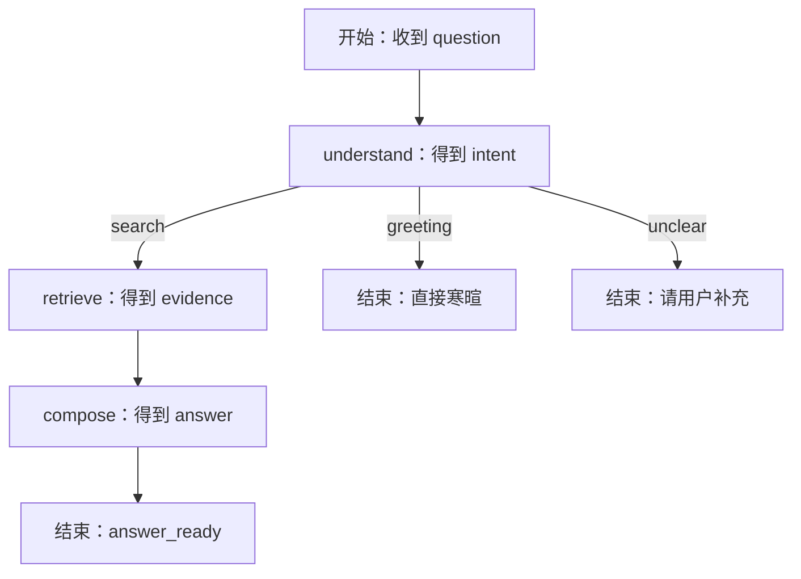
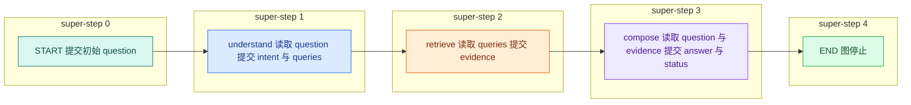
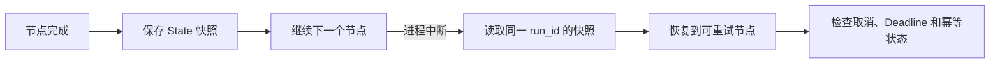

# LangGraph 是什么：用 State、Node 和 Edge 运行第一个状态图

LangGraph 是一个用共享状态和有向图组织长流程的运行库。State 保存节点之间要传递的数据，Node 完成一次计算并返回局部更新，Edge 决定下一步。Reducer 处理同一轮的多份更新，Checkpoint 保存可恢复的执行快照。

它的用途是把有分支、并行或需要恢复的 Agent 流程写成可观测的状态图；它位于 Agent Runtime 的编排层，负责状态传递和执行顺序，不负责模型权限或业务数据库事务。

如果一上来只看 `add_edge`，这几个概念很容易搅在一起。先看一次请求经过哪些步骤，再把步骤画成图，顺序会自然很多。

本文把 [LangChain Retriever 与固定 RAG](/docs/ai-agent/langchain-retriever-rag) 中已经存在的只读问答流程改成一张小图。它仍处理知识问题、寒暄和无法判断的问题，Retriever 与 Evidence 契约不变；变化的是控制流从嵌套函数变成显式 State、Node、Edge、条件分支、Reducer 和 **Checkpoint**。

读完后应能回答四个问题：节点能看见哪些数据，并行更新怎样合并，图为什么要编译，以及 `END` 为什么不等于“回答成功”。

## LangGraph 的作用与核心组件

LangGraph 是一个用“共享状态 + 执行图”组织长流程的运行库。它解决的不是“让模型更聪明”，而是让程序明确记录：现在走到了哪一步、下一步由什么条件决定、多个结果怎样合并、暂停后从哪里继续。

它尤其适合这些流程：

- 同一个问题可能进入检索、寒暄、拒答等不同路径；
- 检索、记忆、安全检查可以并行；
- 中间状态需要观测、测试或持久化；
- 任务可能超过一次 HTTP 请求，需要取消、恢复或人工确认。

如果你的程序只是“拼好 Prompt，调用一次模型，返回文本”，普通 Python 函数已经足够。把一条直线强行改成图，只会增加状态字段、调试和升级成本。

先区分五个容易混淆的词：

| 名称 | 在图里表示什么 | 不是什么 |
| --- | --- | --- |
| **State** | 当前运行可读取的共享数据 | 不是业务数据库整行，也不是全局变量 |
| **Node** | 接收 State、返回局部更新的计算单元 | 不是必须调用模型的函数 |
| **Edge** | 决定节点执行先后或分支的连接 | 不是数据本身 |
| **Reducer** | 同一 State 字段收到多份更新时的合并函数 | 不是数据库事务 |
| Checkpoint | 某个执行步骤后的状态快照 | 不是业务终态或外部副作用记录 |

## 状态图的目标执行路径



普通问题会经过理解、检索和组织答案；寒暄不需要查资料；无法判断的问题直接请求用户补充。图中每条终点都代表一个业务结果，`END` 只表示图执行结束，不代表每次都成功回答。

这张图的数据流也要读出来：入口提供 `question`；`understand` 增加 `intent`，知识问题还会增加 `queries`；`retrieve` 增加 `evidence`；`compose` 最后增加 `answer` 和终态 `status`。Edge 只决定谁先运行，真正的数据始终通过 State 传递。

## 用普通函数固定业务边界

先用普通函数验证业务顺序，可以避免把框架语法误认为业务逻辑。

```python
# 纯函数先定义问题分类、检索和回答的输入输出，便于验证业务逻辑不依赖图框架。
def understand(question: str) -> dict:
    """把用户输入归类成最小的三种意图。"""
    text = question.strip()
    if text in {"你好", "hello"}:
        return {"intent": "greeting"}
    # 数量约束用于发现截断、重复或越界返回，失败时不能把不完整结果交给下一步。
    if len(text) < 4:
        return {"intent": "unclear"}
    return {"intent": "search", "queries": [text]}

# 查询函数只接收业务查询参数；可信 Scope、版本和上限由调用侧一并传入。
def retrieve(queries: list[str]) -> list[str]:
    """调用已经带权限过滤的检索器，返回证据摘要。"""
    return [f"与“{queries[0]}”相关的资料片段"]

def compose(question: str, evidence: list[str]) -> str:
    """把问题和证据组织成一个教学用答案。"""
    return f"问题：{question}\n依据：{'；'.join(evidence)}"
```

`understand` 的输入是字符串，输出意图和可能的查询词；`retrieve` 接收查询词，真实版本应访问带权限过滤的检索器；`compose` 使用原问题和证据生成答案。这里的关键词判断只负责稳定触发测试路径，不代表生产 Agent 的意图理解方式。

## 用 State 声明共享数据

State 是图运行期间共享的数据契约。它不等于数据库所有字段，而是节点之间需要传递的最小状态。

```python
# State 只保存节点间需要共享的业务字段；每个字段的更新方式和终态含义显式声明。
from typing import Literal, TypedDict

class AgentState(TypedDict, total=False):
    # question 保存原始用户输入，后续改写查询不能覆盖它。
    question: str
    intent: Literal["search", "greeting", "unclear"]
    queries: list[str]
    # evidence 保存检索结果的稳定引用，生成答案前必须能够追溯来源。
    evidence: list[str]
    answer: str
    status: Literal["running", "answer_ready", "need_more_input"]
```

`question` 保存原始输入，避免后续节点只能看到改写结果；`intent` 是条件边使用的枚举；`queries` 保存检索词；`evidence` 保存当前证据；`answer` 保存候选答案；`status` 让 API 能够把图终态映射成可观察的业务状态。使用 `total=False` 表示节点可以只返回自己负责的字段，而不必每次重新构造完整状态。

### State 不是“把所有变量塞进 TypedDict”

设计 State 时，可以逐字段回答四个问题：谁创建它、谁读取它、谁能更新它、恢复时是否需要它。

| 字段 | 创建者 | 读取者 | 更新规则 | 是否适合持久化 |
| --- | --- | --- | --- | --- |
| `question` | 入口 | 理解、回答节点 | 只写一次 | 视隐私要求决定 |
| `intent` | 理解节点 | 路由函数 | 单一所有者覆盖 | 是 |
| `queries` | 理解节点 | 检索节点 | 单一所有者覆盖 | 是 |
| `evidence` | 检索节点 | 回答节点 | 单路覆盖，多路需 Reducer | 保存 ID 优于保存大段原文 |
| `answer` | 回答节点 | API 适配器 | 单一所有者覆盖 | 业务库应另存终态答案 |
| `status` | 流程节点 | 路由和 API | 受状态机约束 | 是，但不是唯一事实源 |

数据库连接、打开的文件、HTTP Client 和模型 SDK 实例不要放进 State。这些对象往往无法序列化，也不应该随 Checkpoint 持久化；可以通过依赖注入或 `Runtime` context 传给节点。

`total=False` 只表示类型层面允许字段暂时不存在，不表示任何读取都安全。`retrieve_node` 直接访问 `state["queries"]`，因此图结构必须保证它只会在理解节点成功产出查询词后执行。若这个前置关系可能被外部恢复或版本升级破坏，就应在节点入口显式校验并返回稳定错误。

## 用 Node 提交局部状态更新

Node 是一个读取当前 State、返回局部更新的函数。它不应该偷偷修改全局对象，否则日志和重试很难解释。

```python
# Node 从完整 State 读取所需字段，只返回本次更新，不在函数外修改共享可变对象。
def understand_node(state: AgentState) -> dict:
    # 结构化理解先把原问题映射为有限 intent 和查询列表，节点再决定更新哪些 State 字段。
    result = understand(state["question"])
    if result["intent"] == "greeting":
        return {"intent": "greeting", "answer": "你好，需要查询什么资料？", "status": "answer_ready"}
    if result["intent"] == "unclear":
        return {"intent": "unclear", "answer": "请补充要查询的资料主题。", "status": "need_more_input"}
    return {"intent": "search", "queries": result["queries"], "status": "running"}

# 查询函数只接收业务查询参数；可信 Scope、版本和上限由调用侧一并传入。
def retrieve_node(state: AgentState) -> dict:
    evidence = retrieve(state["queries"])
    return {"evidence": evidence}

def compose_node(state: AgentState) -> dict:
    # 生成节点同时读取原问题和证据；空证据已经被前置条件路由拦截。
    answer = compose(state["question"], state.get("evidence", []))
    return {"answer": answer, "status": "answer_ready"}
```

`understand_node` 读取问题并返回意图、查询词或直接答案；寒暄和不清楚的输入不需要进入检索。`retrieve_node` 只负责调用检索函数，返回证据列表；如果真实检索器返回空数组，节点应明确返回“没有证据”的状态，而不是让生成节点假装有资料。`compose_node` 使用原问题和证据生成答案，并把状态改为 `answer_ready`。

这里最重要的约束是“节点返回更新，不原地修改共享对象”。以下写法虽然是合法 Python，却会让重试、并行和状态快照难以推演：

```python
def unsafe_node(state: AgentState) -> AgentState:
    # 直接修改传入列表，其他代码持有同一引用时也会看到变化。
    state.setdefault("evidence", []).append("新增证据")
    # 返回整份 state，还可能把无关字段再次写回 channel。
    return state
```

`unsafe_node` 同时读取并修改同一个可变列表。如果节点被重试两次，证据可能追加两次；并行分支共享引用时，结果还会取决于执行时序。更容易测试的写法是创建新列表并只返回本节点拥有的字段：`return {"evidence": [*state.get("evidence", []), "新增证据"]}`。进入并行阶段后，则把旧值和新值的合并交给明确的 Reducer。

## 用 Edge 连接固定路径与条件分支

现在才引入图 API。普通边描述固定顺序，条件边根据 State 返回下一节点名称。

```python
# 普通边表达固定顺序，条件边只返回有限路由名；未知路由会在编译或运行时被拒绝。
from langgraph.graph import END, START, StateGraph

def route_after_understand(state: AgentState) -> str:
    return state["intent"]

# 先用 State 类型创建图构建器，后续节点读写字段都会受这份状态契约约束。
builder = StateGraph(AgentState)
builder.add_node("understand", understand_node)
builder.add_node("retrieve", retrieve_node)
# 把纯节点函数注册为图节点；注册本身不会执行函数。
builder.add_node("compose", compose_node)
builder.add_edge(START, "understand")
builder.add_conditional_edges(
    "understand",
    route_after_understand,
    {"search": "retrieve", "greeting": END, "unclear": END},
)
builder.add_edge("retrieve", "compose")
builder.add_edge("compose", END)
# 编译阶段检查图结构，并生成可调用对象；本例尚未配置 Checkpointer。
app = builder.compile()
```

`StateGraph(AgentState)` 告诉框架每个节点使用哪份状态契约；三个 `add_node` 把函数注册到图中；`START` 把入口连到理解节点；条件边调用 `route_after_understand`，再按返回值选择检索或直接结束；检索固定进入组织答案；组织答案后到 `END`。如果意图枚举增加了 `cancelled` 却没有增加对应路由，图应该在测试中失败，而不是静默走错分支。

### `compile()` 到底检查和产出了什么

Builder 是图的声明阶段：注册节点、入口、出口和边。`compile()` 把声明转换成可调用的 Pregel 运行对象，并检查没有入口、未知节点等结构问题；如果传入 Checkpointer、缓存或中断配置，也是在编译时绑定。

编译不会替你证明业务一定正确。下面这些错误仍要靠类型、运行时校验和测试发现：

- 路由函数返回了映射表以外的值；
- 节点读取尚未产生的字段；
- 两个并行节点写同一普通字段而没有 Reducer；
- `status` 写成业务状态机不允许的跳转；
- 节点调用外部系统后失败，重试造成重复副作用。

因此，`compile()` 更像“图结构可执行”，不是“Agent 已经可靠”。

## 编译并运行状态图

编译后的 `app` 接收一个初始 State，返回最终 State。下面的输入分别覆盖正常问题、寒暄和不清楚问题。

```python
# 三个输入分别触发知识查询、寒暄和输入不足。
for question in ["如何申请远程访问", "你好", "嗯"]:
    result = app.invoke({"question": question})
    print(question, "=>", result["status"], result.get("answer"))
```

循环每次创建一份只包含 `question` 的新状态；`invoke` 从 `START` 开始，按边执行节点并合并局部更新；打印 `status` 和 `answer`，可以验证三条终态是否符合预期。正常问题应经过检索和组织答案，寒暄应直接得到问候，不清楚的问题应得到补充提示。生产服务还要把运行 ID、终态原因和错误保存到事件表，而不是只打印文本。

### 运行伴随示例

完整代码位于 `examples/ai-agent-runtime/`。示例使用 LangGraph 0.6 系列，不连接在线模型和数据库。在博客仓库根目录执行：

```bash
# 进入伴随工程并创建隔离环境，避免依赖污染博客仓库的其他工具。
cd examples/ai-agent-runtime
python3 -m venv .venv
source .venv/bin/activate
# 安装锁定范围内的运行与测试依赖，再分别验证测试路径和命令行输出。
python -m pip install -e '.[test]'
pytest tests/test_langgraph_basics.py
python -m ai_agent_runtime.langgraph_basics
```

本文在 Python 3.13.2、LangGraph 0.6.11 下实际运行。定向测试输出 `5 passed`；入口打印四条路径：`answer_ready`、`greeting`、`need_more_input` 和 `no_evidence`。内置 Retriever 只是一组确定性测试数据，不能证明真实检索质量。

## 图不是按代码行运行，而是按 super-step 推进

LangGraph 的执行模型借鉴 Pregel。你可以先把一个 super-step 理解为“一批当前可以运行的节点读取同一轮已提交状态，完成后再合并更新”。串行图中每轮通常只有一个节点；出现并行边时，同一轮会有多个节点。



`Step 0` 只提交入口值。`Step 1` 完成意图理解后，新的 `intent` 才对下一轮可见。`Step 2` 的检索不会看到节点执行到一半的临时变量，只能看到已提交的 `queries`。`Step 3` 读取完整证据并提交答案。最后到达 `END` 后图停止。

这个模型解释了并发写冲突：如果同一个 super-step 里的两个节点都更新 `answer`，运行时不能靠“最后一个完成者”随意决定结果。没有声明合并规则时应该暴露冲突；需要收集多份结果的字段必须定义 Reducer。

## 把“无证据”设计成状态，而不是空字符串

当前最小示例总会返回一条模拟证据。真实 Retriever 可能返回空数组。此时 `compose_node` 不应继续请求模型“尽量回答”，否则 RAG 会退化成没有依据的普通生成。

可以把检索后路由写成确定性判断：

```python
from typing import Literal

def route_after_retrieve(state: AgentState) -> Literal["compose", "no_evidence"]:
    # 至少有一条非空证据才允许进入生成节点。
    usable = [item for item in state.get("evidence", []) if item.strip()]
    return "compose" if usable else "no_evidence"

def no_evidence_node(_state: AgentState) -> AgentState:
    # 不让模型自由补全，直接产生可解释的业务终态。
    return {
        "answer": "当前可见资料中没有找到足够依据。",
        "status": "need_more_input",
    }
```

`route_after_retrieve` 的输入是检索后的 State，输出只能是两个已知路由键。它先剔除空字符串，再决定是否允许生成。`no_evidence_node` 没有调用模型，它把证据不足转换成稳定答案和状态。生产系统可以把状态进一步拆成 `insufficient_evidence`，不要与“用户输入不清楚”混用。

连接图时，用 `add_conditional_edges("retrieve", route_after_retrieve, {"compose": "compose", "no_evidence": "no_evidence"})` 替换原来的 `retrieve -> compose` 普通边。这样，是否生成答案由程序读取证据状态后决定，而不是由 Prompt 请求模型自律。

## Reducer 处理并行状态更新

当只有一条检索链时，后一次更新覆盖前一次并不明显。现在假设我们同时查全文和向量两个通道，它们都返回 `evidence`。如果最后完成的节点直接覆盖字段，先返回的证据会丢失。

Reducer 定义同一字段收到多个更新时如何合并。对于证据，常见规则是按稳定 ID 去重，并保持确定性顺序；对于计数器可以相加；对于互斥版本号，发现两个值时应该报冲突。

```python
# Reducer 把并行分支结果按稳定规则合并；没有 Reducer 时后写分支可能覆盖先到证据。
from typing import Annotated
import operator

class ParallelState(TypedDict, total=False):
    query: str
    evidence: Annotated[list[str], operator.add]
```

`Annotated` 告诉图运行时，`evidence` 不是简单覆盖，而是使用 `operator.add` 合并列表。两个分支分别返回 `["全文命中"]` 和 `["向量命中"]` 时，最终状态包含两项。生产版本应把列表元素换成带稳定 ID 的对象，并在 Reducer 中去重；单纯相加会把重试产生的重复证据保留下来。

Reducer 属于字段级 channel 语义。`evidence` 使用追加，不代表 `answer`、`intent` 也自动追加。每个 State 字段都要单独决定：覆盖、追加、取最大值、自定义去重，还是禁止并发写入。把所有列表一律写成 `operator.add` 会隐藏重复事件和重试问题。

## Checkpoint 保存可恢复状态

Checkpoint 是图运行过程中的状态快照和执行位置。进程中断后，运行时可以从快照恢复，但它不是数据库事务，也不会撤销已经发出的外部副作用。



节点完成后先保存状态，进程中断时按 `run_id` 找到最近快照，恢复前检查任务是否已经取消或超时，再决定是否重试。若节点已经发送邮件、写入外部系统，恢复可能再次执行副作用，因此要用幂等键或把副作用放到可对账的任务表。短小的只读问答可以不启用持久 Checkpoint；长时间研究和人工暂停才值得增加存储成本。

## 用 pytest 验证路径，而不是只看一句答案

下面的测试复用前文编译出的 `app`。输入覆盖知识问题、寒暄和空问题，断言同时检查路由、终态与节点轨迹；这样即使最终文案变化，也能发现条件边走错、检索被跳过或拒答分支丢失。测试失败时先比较实际 `route` 和 `status`，再根据 `trace` 定位哪个节点没有返回预期状态更新。

```python
import pytest

@pytest.mark.parametrize(
    ("question", "expected_intent", "expected_status"),
    [
        ("如何申请远程访问", "search", "answer_ready"),
        ("你好", "greeting", "answer_ready"),
        ("嗯", "unclear", "need_more_input"),
    ],
)
# 这个用例同时固定事件顺序、单调序号和唯一终态，避免客户端恢复出不同状态。
def test_graph_routes_to_expected_terminal_state(
    question: str,
    expected_intent: str,
    expected_status: str,
) -> None:
    result = app.invoke({"question": question})

    # 先验证结构化状态，再验证回答存在。
    assert result["intent"] == expected_intent
    assert result["status"] == expected_status
    assert result["answer"].strip()

# 这个用例核对证据与引用关系，防止无来源 Claim 被当成已经验证的答案。
def test_search_path_keeps_original_question_and_evidence() -> None:
    result = app.invoke({"question": "如何申请远程访问"})

    # 原问题不能被查询改写覆盖，证据也必须进入最终状态。
    assert result["question"] == "如何申请远程访问"
    assert result["queries"] == ["如何申请远程访问"]
    assert result["evidence"] == ["与“如何申请远程访问”相关的资料片段"]
```

参数化测试依次覆盖知识问题、寒暄和输入不足。第一组断言 `intent` 与 `status`，能发现路由走错但答案文本碰巧相似的问题；第二个测试检查完整的数据传递链：入口问题、查询词、检索证据都没有在节点间丢失。

仓库内测试比上面的推导多覆盖一条无证据路径。执行 `pytest tests/test_langgraph_basics.py`，应看到 `5 passed`。如果把 greeting 错接到 retrieve，路由断言会失败；如果空检索仍进入 compose，`no_evidence` 的 Trace 会失败。

## 从输入手工推演一次状态变化

拿输入“如何申请远程访问”逐步写出状态：

1. 入口状态只有 `question`。
2. `understand_node` 读取问题，提交 `intent=search`、`queries=[原问题]`、`status=running`。
3. 条件边读取 `intent`，选择 `retrieve`。
4. `retrieve_node` 读取 `queries`，提交 `evidence`。
5. `compose_node` 读取 `question` 和 `evidence`，提交 `answer` 与 `status=answer_ready`。
6. 图到达 `END`，调用方取得最终 State。

如果你不能明确写出某一步“读哪些字段、写哪些字段”，说明 State 契约还不够清楚。先补契约和测试，不要继续堆节点。

## 从可理解性和运行语义检查这张图

资深检查：State 是否混入不该持久化的敏感数据，条件边是否覆盖所有枚举，Reducer 是否能处理乱序和重复，Checkpoint 恢复是否有 Deadline 和副作用幂等。

初学者检查：能否从一条输入开始，写出节点执行顺序；能否说明每个节点读什么、改什么；能否解释为什么寒暄不需要检索；能否判断并行分支为什么需要 Reducer。

## 这套状态图的边界

状态图适合把有多个明确阶段、分支或恢复点的 Agent 流程写成可检查的执行图。它不替代模型质量评测，也不替代数据库事务：节点里的外部写操作仍要自己处理幂等，状态里的敏感内容也不能因为能序列化就永久保存。只有一条不可暂停的模型调用时，直接函数调用通常更简单。

可以把本文方法迁移到审核 Agent：把 `question` 换成待审核内容，把 `intent` 换成风险分类，把 `retrieve` 换成规则和历史案例查询。迁移时先画状态字段所有权表，再写节点；不要先复制 `add_edge` 代码。


**LangGraph State 与聊天消息历史是一回事吗？**

不是。State 是整张图在一次执行中的共享数据契约，可以包含问题、版本快照、候选、证据、错误和预算；Messages 只是其中一种 channel。把所有状态塞进消息会让权限、计数和错误只能靠模型读文本推断。State 字段应有明确所有者和更新规则，敏感字段也不必发送给模型，节点只读取完成职责所需的子集。

**Node 为什么返回局部更新，而不是直接修改全局对象？**

节点返回局部更新后，运行时可以记录本次写了哪些 channel，并在同一 super-step 的并行结果到达时按 Reducer 合并。原地修改共享字典会让执行顺序影响结果，Checkpoint 也难以重建变化。节点的输入是当前状态快照，输出应是可序列化更新；外部副作用需要单独幂等，不能因为返回了状态就假设事务已经完成。

**Edge 是否会执行代码？**

普通 Edge 只描述一个节点完成后允许进入哪个节点，不承担业务计算；条件边会调用路由函数，根据当前 State 返回有限目标。真正改变状态的是节点。把检索或权限逻辑藏进路由函数，会让 Trace 看不到一次重要执行，也难以重试和测试。路由应尽量纯粹，只读取已验证字段，并为未知值提供显式失败方向。

**super-step 对并行更新意味着什么？**

同一 super-step 中可运行节点读取的是同一逻辑状态快照，各自完成后再合并更新，而不是谁先完成就让另一个看到新值。因此两个分支同时写单值字段会冲突；列表、计数或最大轮次要声明相应 Reducer。理解这一点才能解释为什么并行检索不应互相修改候选，也不能依赖完成时间决定最终排序。

**Checkpoint 能替代业务数据库吗？**

不能。Checkpoint 保存图执行状态和下一步位置，适合中断恢复与调试；Conversation、Turn、权限、最终答案和审计事件仍应由业务数据库管理。Checkpoint 里的大文档可保存引用，不必复制原文；执行外部副作用后还要用业务幂等键确认事实。否则删除 Checkpoint 就会丢业务记录，恢复图也可能重复已经提交的操作。

**怎样判断一张图是否拆得过细？**

一个节点应对应可命名的状态转换、独立失败语义或需要观测/恢复的边界。只是给变量改名、没有独立输入输出和错误处理的步骤，拆成节点只会增加 Trace 噪声。反过来，把规划、检索、融合和生成都塞进一个节点又失去中间状态。可用测试问题判断：是否需要单独重试、并行、设超时、检查权限或保存 Checkpoint；都不需要时通常保留普通函数。
