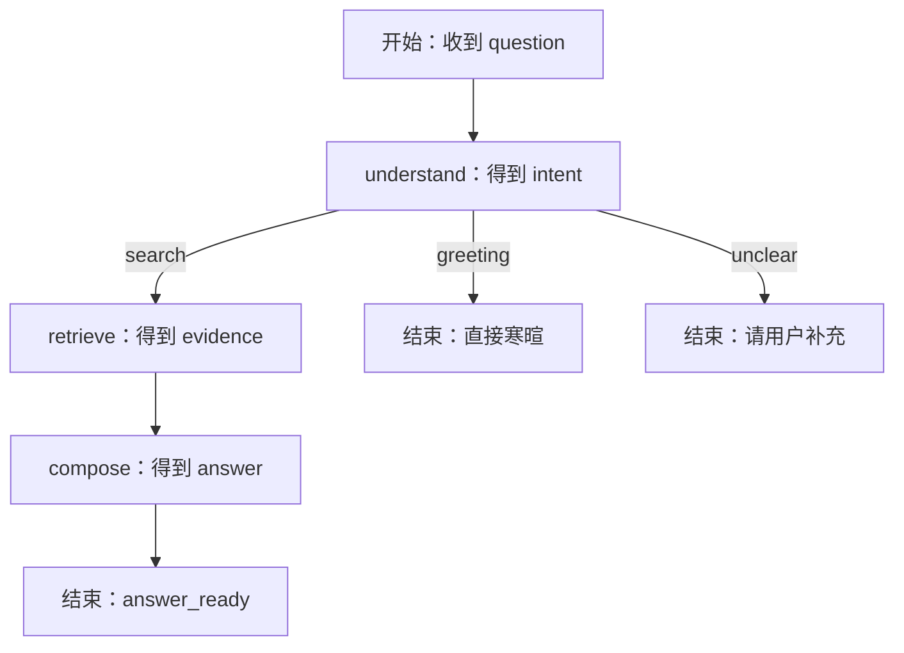
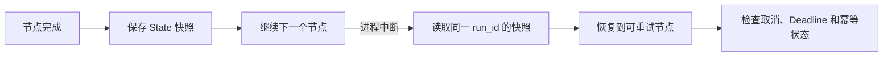

# LangGraph State、Node、Edge、Reducer 与 Checkpoint：从零看懂一张图

很多人第一次看到 LangGraph，先看到的是一段 `add_edge` 代码，然后被 `State`、`Reducer` 和 `Checkpoint` 一起淹没。阅读顺序应该反过来：先理解一次请求要经过哪些步骤，再用状态图表达这些步骤。

本文只构建一张很小的只读问答图。它能处理三种输入：知识问题、寒暄和无法判断的问题。我们先写普通 Python 函数，再逐步加 State、Node、Edge、条件分支、Reducer 和 Checkpoint。

## 先画执行结果



普通问题会经过理解、检索和组织答案；寒暄不需要查资料；无法判断的问题直接请求用户补充。图中每条终点都代表一个业务结果，`END` 只表示图执行结束，不代表每次都成功回答。

## 第一步：先写没有框架的函数

先用普通函数验证业务顺序，可以避免把框架语法误认为业务逻辑。

```python
def understand(question: str) -> dict:
    """把用户输入归类成最小的三种意图。"""
    text = question.strip()
    if text in {"你好", "hello"}:
        return {"intent": "greeting"}
    if len(text) < 4:
        return {"intent": "unclear"}
    return {"intent": "search", "queries": [text]}

def retrieve(queries: list[str]) -> list[str]:
    """调用已经带权限过滤的检索器，返回证据摘要。"""
    return [f"与“{queries[0]}”相关的资料片段"]

def compose(question: str, evidence: list[str]) -> str:
    """把问题和证据组织成一个教学用答案。"""
    return f"问题：{question}\n依据：{'；'.join(evidence)}"
```

`understand` 的输入是字符串，输出是意图和可能的查询词；`retrieve` 接收查询词，真实版本应访问带权限过滤的检索器；`compose` 接收原问题和证据，输出答案文本。这里的关键词判断只是为了让读者看见三条路径，不代表生产 Agent 的意图理解方式。先分别调用三个函数，可以确认每个函数的输入输出，再进入图编排。

## 第二步：把共享数据写成 State

State 是图运行期间共享的数据契约。它不等于数据库所有字段，而是节点之间需要传递的最小状态。

```python
from typing import Literal, TypedDict

class AgentState(TypedDict, total=False):
    question: str
    intent: Literal["search", "greeting", "unclear"]
    queries: list[str]
    evidence: list[str]
    answer: str
    status: Literal["running", "answer_ready", "need_more_input"]
```

`question` 保存原始输入，避免后续节点只能看到改写结果；`intent` 是条件边使用的枚举；`queries` 保存检索词；`evidence` 保存当前证据；`answer` 保存候选答案；`status` 让 API 能够把图终态映射成可观察的业务状态。使用 `total=False` 表示节点可以只返回自己负责的字段，而不必每次重新构造完整状态。

## 第三步：把函数变成 Node

Node 是一个读取当前 State、返回局部更新的函数。它不应该偷偷修改全局对象，否则日志和重试很难解释。

```python
def understand_node(state: AgentState) -> dict:
    result = understand(state["question"])
    if result["intent"] == "greeting":
        return {"intent": "greeting", "answer": "你好，需要查询什么资料？", "status": "answer_ready"}
    if result["intent"] == "unclear":
        return {"intent": "unclear", "answer": "请补充要查询的资料主题。", "status": "need_more_input"}
    return {"intent": "search", "queries": result["queries"], "status": "running"}

def retrieve_node(state: AgentState) -> dict:
    evidence = retrieve(state["queries"])
    return {"evidence": evidence}

def compose_node(state: AgentState) -> dict:
    answer = compose(state["question"], state.get("evidence", []))
    return {"answer": answer, "status": "answer_ready"}
```

`understand_node` 读取问题并返回意图、查询词或直接答案；寒暄和不清楚的输入不需要进入检索。`retrieve_node` 只负责调用检索函数，返回证据列表；如果真实检索器返回空数组，节点应明确返回“没有证据”的状态，而不是让生成节点假装有资料。`compose_node` 使用原问题和证据生成答案，并把状态改为 `answer_ready`。

## 第四步：连接普通边和条件边

现在才引入图 API。普通边描述固定顺序，条件边根据 State 返回下一节点名称。

```python
from langgraph.graph import END, START, StateGraph

def route_after_understand(state: AgentState) -> str:
    return state["intent"]

builder = StateGraph(AgentState)
builder.add_node("understand", understand_node)
builder.add_node("retrieve", retrieve_node)
builder.add_node("compose", compose_node)
builder.add_edge(START, "understand")
builder.add_conditional_edges(
    "understand",
    route_after_understand,
    {"search": "retrieve", "greeting": END, "unclear": END},
)
builder.add_edge("retrieve", "compose")
builder.add_edge("compose", END)
app = builder.compile()
```

`StateGraph(AgentState)` 告诉框架每个节点使用哪份状态契约；三个 `add_node` 把函数注册到图中；`START` 把入口连到理解节点；条件边调用 `route_after_understand`，再按返回值选择检索或直接结束；检索固定进入组织答案；组织答案后到 `END`。如果意图枚举增加了 `cancelled` 却没有增加对应路由，图应该在测试中失败，而不是静默走错分支。

## 第五步：运行三条路径

编译后的 `app` 接收一个初始 State，返回最终 State。下面的输入分别覆盖正常问题、寒暄和不清楚问题。

```python
for question in ["如何申请远程访问", "你好", "嗯"]:
    result = app.invoke({"question": question})
    print(question, "=>", result["status"], result.get("answer"))
```

循环每次创建一份只包含 `question` 的新状态；`invoke` 从 `START` 开始，按边执行节点并合并局部更新；打印 `status` 和 `answer`，可以验证三条终态是否符合预期。正常问题应经过检索和组织答案，寒暄应直接得到问候，不清楚的问题应得到补充提示。生产服务还要把运行 ID、终态原因和错误保存到事件表，而不是只打印文本。

## 第六步：Reducer 解决并行结果覆盖

当只有一条检索链时，后一次更新覆盖前一次并不明显。现在假设我们同时查全文和向量两个通道，它们都返回 `evidence`。如果最后完成的节点直接覆盖字段，先返回的证据会丢失。

Reducer 定义同一字段收到多个更新时如何合并。对于证据，常见规则是按稳定 ID 去重，并保持确定性顺序；对于计数器可以相加；对于互斥版本号，发现两个值时应该报冲突。

```python
from typing import Annotated
import operator

class ParallelState(TypedDict, total=False):
    query: str
    evidence: Annotated[list[str], operator.add]
```

`Annotated` 告诉图运行时，`evidence` 不是简单覆盖，而是使用 `operator.add` 合并列表。两个分支分别返回 `["全文命中"]` 和 `["向量命中"]` 时，最终状态包含两项。生产版本应把列表元素换成带稳定 ID 的对象，并在 Reducer 中去重；单纯相加会把重试产生的重复证据保留下来。

## 第七步：Checkpoint 只解决可恢复状态

Checkpoint 是图运行过程中的状态快照和执行位置。进程中断后，运行时可以从快照恢复，但它不是数据库事务，也不会撤销已经发出的外部副作用。



节点完成后先保存状态，进程中断时按 `run_id` 找到最近快照，恢复前检查任务是否已经取消或超时，再决定是否重试。若节点已经发送邮件、写入外部系统，恢复可能再次执行副作用，因此要用幂等键或把副作用放到可对账的任务表。短小的只读问答可以不启用持久 Checkpoint；长时间研究和人工暂停才值得增加存储成本。

## 资深工程师和初学者各自要检查什么

资深检查：State 是否混入不该持久化的敏感数据，条件边是否覆盖所有枚举，Reducer 是否能处理乱序和重复，Checkpoint 恢复是否有 Deadline 和副作用幂等。

初学者检查：能否从一条输入开始，写出节点执行顺序；能否说明每个节点读什么、改什么；能否解释为什么寒暄不需要检索；能否判断并行分支为什么需要 Reducer。

下一篇会进入 Tool Calling：状态图决定什么时候调用工具，工具契约决定允许调用什么、参数怎样校验以及错误怎样回到图中。

## 这套状态图的边界

状态图适合把有多个明确阶段、分支或恢复点的 Agent 流程写成可检查的执行图。它不替代模型质量评测，也不替代数据库事务：节点里的外部写操作仍要自己处理幂等，状态里的敏感内容也不能因为能序列化就永久保存。只有一条不可暂停的模型调用时，直接函数调用通常更简单。
