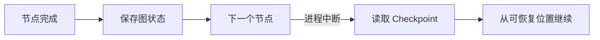

# LangGraph 的 State、Node、Edge、Reducer 与 Checkpoint

先从一段普通代码开始：理解问题、检索资料、生成回答。三个函数按顺序调用时很好懂，问题出现在需要分支、并行、重试和恢复之后：状态散落在局部变量中，哪一步修改了什么也难追踪。

LangGraph 把流程表示成“共享状态 + 节点 + 边”。本章只搭一张最小图，并在最后加入一个并行合并例子。Checkpoint 不会被当成自动解决所有故障的开关，而会说明它到底保存了什么。

## State：整张图共享的数据契约

State 不是把所有业务对象塞进一个字典。它应该只保存图运行需要传递和合并的数据。

```python
from typing import Annotated, Literal, TypedDict
import operator

class AgentState(TypedDict):
    question: str
    intent: Literal["search", "greeting", "unclear"]
    queries: list[str]
    evidence: Annotated[list[str], operator.add]
    answer: str
```

`question` 是原始问题；`intent` 决定分支；`queries` 保存检索词；`evidence` 声明用列表相加合并更新；`answer` 保存候选答案。

真实系统中的用户身份、知识版本和 Deadline 通常在创建运行时就钉住，避免节点中途换范围。但数据库实体不必全部复制到图状态，只保存稳定标识即可。

## Node：读取状态并返回局部更新

节点是普通同步或异步函数。它接收当前状态，返回要更新的字段。

```python
def understand(state: AgentState) -> dict:
    text = state["question"].strip()
    if text in {"你好", "hello"}:
        return {"intent": "greeting", "answer": "你好，需要查询什么资料？"}
    if len(text) < 4:
        return {"intent": "unclear"}
    return {"intent": "search", "queries": [text]}

async def retrieve(state: AgentState) -> dict:
    rows = await search_readable_documents(state["queries"][0])
    return {"evidence": [row.summary for row in rows]}
```

`understand` 只负责本章的最小分支，`retrieve` 只负责调用经过权限约束的检索服务。节点返回更新而不是随意修改全局对象，运行时才能记录每一步输入输出。

在真实 Agent 中，意图识别不会依赖几个关键词特判，而会使用结构化理解和回归评测；这里的规则只是帮助初学者观察图分支。

## Edge：决定执行顺序和条件分支

普通边表示固定顺序，条件边根据状态选择下一节点。

```python
from langgraph.graph import END, START, StateGraph

graph = StateGraph(AgentState)
graph.add_node("understand", understand)
graph.add_node("retrieve", retrieve)
graph.add_node("compose", compose_answer)

graph.add_edge(START, "understand")
graph.add_conditional_edges(
    "understand",
    lambda state: state["intent"],
    {"search": "retrieve", "greeting": END, "unclear": END},
)
graph.add_edge("retrieve", "compose")
graph.add_edge("compose", END)

app = graph.compile()
```

从 `START` 进入理解节点。`search` 分支检索并生成，另外两条分支直接结束。`END` 表示图终止，不等于业务一定成功；状态中还应有明确的终态与原因，供 API 映射。

### 推演两次运行

输入“你好”时：`START → understand → END`，状态里已有直接回答。输入知识问题时：`START → understand → retrieve → compose → END`。

推演是设计状态图最有效的检查之一。每条条件边都要有可达输入，每个终点都要能解释业务结果。

## Reducer：多个更新怎样合并

没有 Reducer 时，同一字段的后一次更新通常覆盖前一次更新。并行检索分支都返回 `evidence`，若直接覆盖，就只剩最后完成的分支。

State 中的 `Annotated[list[str], operator.add]` 声明列表追加。两个分支分别返回 `[E1]` 和 `[E2]`，合并结果为 `[E1, E2]`。

Reducer 要满足业务语义，不是见到列表就相加：

- 消息历史可能使用框架提供的消息 Reducer，处理消息 ID 和覆盖；
- 证据需要按稳定 ID 去重，而不只是拼接；
- 计数器可以相加；
- 唯一版本号若出现两个不同值，应该报错而不是任选一个。

可以为证据写确定性 Reducer：保留首次出现顺序，按证据 ID 去重。并行完成顺序可能变化，所以后续排序不能偷偷依赖哪个请求先返回。

## 并行分支与 Send

当理解节点得到三个独立查询时，可以动态创建三个检索任务。LangGraph 的 `Send` 用于把不同输入发送到同一节点。

```python
from langgraph.types import Send

def fan_out(state: AgentState):
    return [Send("retrieve_one", {"query": query}) for query in state["queries"]]
```

每个 `retrieve_one` 返回证据更新，Reducer 负责合并。并行并不意味着无限并发：外层服务仍要设置分支上限、每个调用超时和整轮 Deadline。慢分支超时后，系统还要判断已有证据是否足够。

## Checkpoint 保存的是什么

Checkpoint 保存图在某个线程或运行标识下的状态快照和执行位置，使暂停、人机审批或进程中断后的恢复成为可能。它不等于数据库事务，也不会撤销已经发出的邮件或付款。



使用 Checkpoint 前要回答：

- 哪些运行模式真的需要恢复；
- 线程 ID 怎样与用户和回合绑定；
- Checkpoint 保存多久，谁能读取和删除；
- 恢复前如何检查业务任务是否已经取消；
- 节点包含外部副作用时怎样保证幂等。

短小只读问答可以不启用持久 Checkpoint，减少存储和隐私负担。长时间研究、人工中断或需要容错的模式再按需启用。

## 状态图的测试方法

测试不要只调用整张图看最终文字。至少分三层：

1. 节点测试：给定状态，断言局部更新；
2. 路由测试：给定意图，断言下一节点；
3. 图测试：替换模型和检索器，断言节点序列与终态。

还要覆盖 Reducer：并行结果乱序、重复证据和空分支怎样合并。Checkpoint 测试应在节点间中断，再确认恢复后不会重复外部副作用。

## 本章实践检查表

- State 字段是否只保存图需要的内容；
- 每个节点能否用一句话描述职责；
- 条件边是否覆盖所有枚举；
- 并行写同一字段时是否定义 Reducer；
- Reducer 对乱序和重复是否稳定；
- Checkpoint 是否有明确用途、保留期和身份边界；
- 外部副作用是否具备幂等或对账机制。

下一章进入工具调用。状态图决定“什么时候调用”，工具契约决定“允许调用什么，以及错误怎样回到图中”。

## 参考资料

- [LangGraph Graph API](https://docs.langchain.com/oss/python/langgraph/graph-api)
- [LangGraph Persistence](https://docs.langchain.com/oss/python/langgraph/persistence)
- [LangGraph Send API](https://langchain-ai.github.io/langgraph/reference/types/#langgraph.types.Send)

