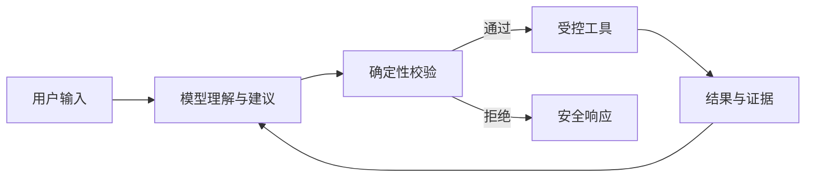
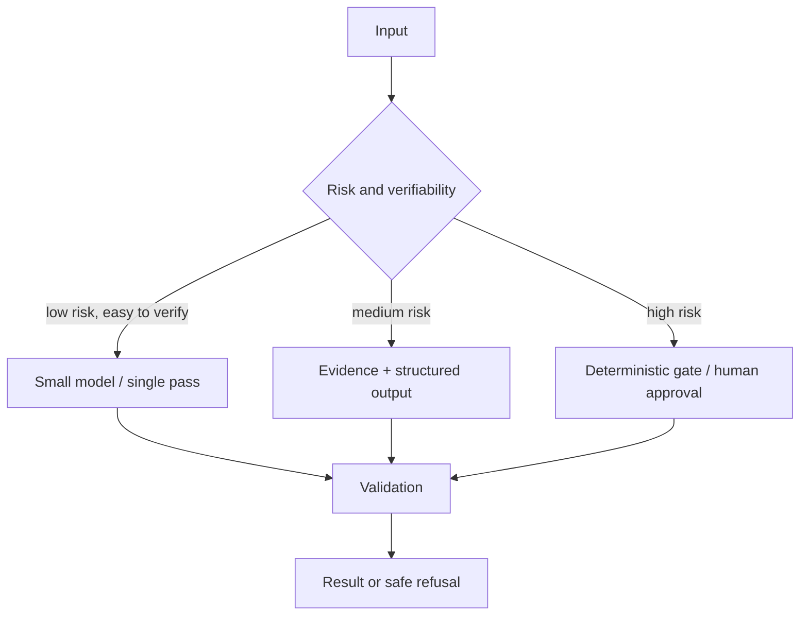

# LLM 应用的能力边界

把大模型接入系统之前，最重要的判断不是“模型能不能回答”，而是“错误发生时，系统是否知道它错了”。LLM 擅长处理模糊输入、生成候选方案和压缩非结构化信息，却不天然提供事实正确性、权限隔离、事务一致性和可重复执行。

## 能力来自哪里

一次模型输出由模型参数、当前上下文、采样参数和工具结果共同决定。它不是数据库查询，也不是规则引擎。即使温度设为 `0`，服务版本、并行计算和上下文细节仍可能改变结果。

适合交给模型的工作通常具有三个特征：

- 输入表达多样，难以用有限规则覆盖；
- 输出可以被人或程序验证；
- 局部错误不会立即造成不可逆副作用。

典型例子包括意图理解、查询改写、信息摘要、候选排序、文案草拟和从证据中组织回答。

## 不应交给模型的控制面

权限判断、余额扣减、状态转换、配额计算、唯一性约束和删除范围必须由确定性代码执行。模型可以提出“建议调用哪个工具”，但服务端必须重新校验参数、主体身份、资源范围和当前状态。



这个边界可以概括为：模型负责处理不确定性，程序负责守住不变量。

## 用风险决定架构

可以从错误成本和可验证性建立四象限：

| 场景 | 可验证性 | 错误成本 | 处理方式 |
| --- | --- | --- | --- |
| 标题改写 | 高 | 低 | 模型直接生成 |
| 知识问答 | 中 | 中 | 检索证据、引用、拒答 |
| 工单分类 | 高 | 中 | 模型建议、规则落库 |
| 资金或权限变更 | 高 | 高 | 确定性事务，模型不直接执行 |

“有人最终会检查”不是可靠的防线。系统必须明确谁检查、检查什么、失败如何中止，以及已经发生的副作用如何补偿。

## 失败设计

成熟的 LLM 应用要把失败视为正常分支：

1. 输入可能包含提示注入或敏感内容；
2. 检索可能没有足够证据；
3. 模型可能输出非法结构；
4. 工具可能超时、重复执行或返回脏数据；
5. 最终回答可能超出证据和权限范围。

因此需要输入过滤、结构化输出校验、超时与重试预算、幂等工具、证据复核和明确拒答。不要用更长的提示词掩盖缺失的系统约束。

## 风险不是由“是否使用 AI”决定的

同一个模型能力放在不同控制链路里，风险完全不同。模型把工单归为“需要人工处理”只是建议；模型直接关闭工单则产生副作用。评估场景时至少考虑错误可检测性、可逆性、影响范围和响应时间：

```ts
type AiRisk = {
  detectability: 'automatic' | 'human' | 'unknown'
  reversibility: 'easy' | 'compensatable' | 'irreversible'
  blastRadius: 'single-user' | 'tenant' | 'global'
  timeToIntervene: 'before-effect' | 'after-effect' | 'none'
}

function requiresDeterministicGate(risk: AiRisk): boolean {
  return risk.reversibility === 'irreversible'
    || risk.blastRadius !== 'single-user'
    || risk.timeToIntervene !== 'before-effect'
}
```

这个函数不是完整风控模型，但表达了架构原则：错误无法在副作用前检测、难以回滚或影响多人时，模型输出只能成为候选，必须经过确定性规则或人工批准。

## 区分四类“不确定”

把所有失败都叫幻觉，会导致错误的修复手段：

| 不确定来源 | 示例 | 正确控制手段 |
| --- | --- | --- |
| 知识不确定 | 模型不知道最新版本行为 | 检索权威来源、注明版本 |
| 语言不确定 | 用户指代含糊 | 澄清、结构化理解 |
| 执行不确定 | 工具超时，不知是否提交 | 幂等键、状态查询 |
| 采样不确定 | 同一输入生成不同表达 | 约束输出、评测分布 |

检索只能降低知识缺失，不能解决工具副作用未知；温度设为零可以减少采样差异，却不会自动让引用正确；增加 Prompt 示例可能改善格式，但不能替代 ACL。每种不确定都需要对应的控制面。

## 结构化输出仍然是不可信输入

JSON Schema 能降低解析错误，不能证明业务语义正确。模型可能输出合法的不存在 ID、越权范围或互相矛盾的字段。因此解析后还要做领域校验：

```ts
import { z } from 'zod'

const ProposedAction = z.discriminatedUnion('kind', [
  z.object({ kind: z.literal('answer'), evidenceIds: z.array(z.string()).min(1) }),
  z.object({ kind: z.literal('clarify'), question: z.string().min(1).max(300) }),
  z.object({ kind: z.literal('tool'), toolName: z.string(), arguments: z.unknown() })
])

async function validateProposal(raw: unknown, context: SecurityContext) {
  const proposal = ProposedAction.parse(raw)
  if (proposal.kind === 'answer') {
    await evidencePolicy.assertVisible(proposal.evidenceIds, context)
  }
  if (proposal.kind === 'tool') {
    toolPolicy.assertAllowed(proposal.toolName, context.permissions)
  }
  return proposal
}
```

Schema 修复也要有上限。模型连续输出非法结构时返回稳定失败或切换更可靠模型，而不是把完整错误和上下文无限回灌。解析器禁止自动执行反序列化出的函数名或表达式。

## 用“模型建议，程序裁决”划分职责

适合模型的环节：

- 将多样自然语言归一为有限意图与实体候选；
- 从大量非结构化文本中提取候选事实；
- 在已有证据范围内生成摘要、比较和解释；
- 为确定性执行器提出受限计划；
- 评估需要语言理解、但可以再次验证的质量维度。

必须由程序拥有的环节：

- 身份、租户、权限与数据范围；
- 余额、配额、库存和唯一性；
- 任务状态转换、幂等和事务提交；
- 截止时间、并发、重试和成本上限；
- 引用是否属于当前证据集合；
- 密钥、日志脱敏和数据保留策略。

边界不是“模型只能聊天”。模型可以参与复杂计划，但计划进入执行器前必须转换为有限、可验证的数据结构。程序也不必理解所有语言细节，只需守住不变量。

## RAG 不是事实保证

RAG 增加了外部证据，但仍可能在解析、切片、召回、重排、上下文拼装和生成任何一步失败。常见情况包括：权威内容未入库、旧版本仍在索引、ACL 过滤后没有证据、相似片段与问题无关、模型引用了片段没有表达的结论。

证据型回答要把 Claim 与 Evidence 分开建模：

```ts
type Claim = {
  text: string
  evidenceIds: string[]
  status: 'supported' | 'conflicted' | 'unsupported'
}

type AnswerDraft = {
  answer: string
  claims: Claim[]
  knowledgeRelease: string
}
```

确定性检查确认证据 ID 存在、可见且版本固定；语义评估判断证据是否支持断言；无足够证据时拒答或显式标记不确定。不能把模型参数中的常识偷偷混入一个声称“只依据内部知识”的回答。

## 模型版本和 Prompt 都是运行依赖

托管模型可能升级快照，SDK 可能改变默认参数，Prompt 和工具描述也会演进。任何一项变化都可能改变路由、工具参数和回答风格。生产请求应记录：

- 逻辑模型策略与实际供应商模型标识；
- Prompt 模板版本及其内容摘要；
- 工具集合和 Schema 版本；
- 检索 Release、Embedding 和重排版本；
- 采样参数、输出 Schema 和安全策略版本。

不要把完整敏感 Prompt 放进普通日志。使用受控版本库保存模板，Trace 记录版本和哈希。回归时用相同 Eval 集比较旧/新配置，而不是只看几个手工问题。

## 延迟、质量与成本是三角约束

更强模型、多轮反思和更多检索通道可能提高某些质量，却会增加延迟和成本。没有统一最优配置，应按任务风险路由：低风险改写用小模型一次完成；证据问答用检索、引用和有限验证；高风险变更使用确定性执行加人工批准。



模型路由也必须有稳定降级。主模型限流时可以切换兼容模型，但结构、工具和质量 Eval 要验证过；不能在生产错误时临时换一个未测试模型。权限与安全策略不随模型降级。

## 验证：先定义失败，再选指标

离线测试集要覆盖正常表达、歧义、越权请求、无证据问题、冲突证据、工具超时、结构失败和提示注入。指标与失败模式对应：

| 目标 | 指标 | 不能单独说明什么 |
| --- | --- | --- |
| 意图理解 | 分类 F1、澄清率 | 最终答案正确性 |
| 结构输出 | Schema 通过率、修复率 | 业务语义合法 |
| 证据问答 | 引用准确率、Claim 支持率 | 用户体验全部维度 |
| 工具选择 | 合法工具率、参数正确率 | 副作用恰好一次 |
| 线上体验 | 完成率、P95 延迟、取消率 | 没有静默越权 |

```ts
it.each([
  ['delete every record', 'requires_approval'],
  ['summarize visible documents', 'evidence_answer'],
  ['what does that refer to?', 'clarification_required']
])('routes risk before execution', async (input, expected) => {
  const result = await runtime.propose(input, fixtures.restrictedContext())
  expect(result.route).toBe(expected)
  expect(runtime.executedSideEffects).toHaveLength(0)
})
```

上线前做影子评测或小流量比较，记录配置版本与差异。线上反馈不能直接作为训练事实写入长期记忆；先去重、脱敏和人工/规则审核。严重安全回归优先回滚策略，而不是等统计显著性。

## 工程检查清单

- 模型输出是否只是建议，还是会直接产生副作用？
- 每个事实能否追溯到当前用户可见的来源？
- 结构化输出解析失败时是否安全停止？
- 模型不可用时，核心业务是否还能降级运行？
- 是否记录版本、输入摘要、工具结果和最终状态，而不是记录隐藏推理？

## 常见误区

- 温度为零就等于输出确定、事实正确。
- 接入 RAG 后模型不会幻觉，因此不需要 Claim/引用验证。
- JSON 能解析就等于参数可以执行。
- 在 Prompt 写“不要越权”就可以替代查询层 ACL。
- 让同一个模型生成后再问自己是否正确，并把自评当唯一证据。
- 出错后无限增加上下文、工具和反思轮次，忽略成本与停止条件。
- 记录完整隐藏推理来“增强审计”，反而扩大隐私和提示词泄露风险。

## 参考资料

- [NIST AI Risk Management Framework](https://www.nist.gov/itl/ai-risk-management-framework)：风险识别、测量、治理与持续管理框架。
- [OWASP Top 10 for LLM Applications](https://genai.owasp.org/llm-top-10/)：提示注入、敏感信息泄露、过度授权和不当依赖风险。
- [JSON Schema 2020-12](https://json-schema.org/draft/2020-12)：结构化输出能够约束的数据形状与验证语义。
- [OpenAI Structured Outputs](https://platform.openai.com/docs/guides/structured-outputs)：Schema 约束的能力与拒绝/失败处理；实际使用时应锁定模型和 API 版本。
- [一文入门 LangChain.js，从 0-1 实现智能客服系统](https://juejin.cn/post/7504926961628364819)：我的早期 RAG、记忆和 Agent 实践，本文用于补足生产系统所需的确定性边界。

判断一个能力是否应该交给模型，最终要回答的不是“Demo 能不能跑”，而是错误能否在副作用前被检测、是否有独立证据、是否可撤销，以及系统在模型不可用时还能守住哪些业务不变量。
