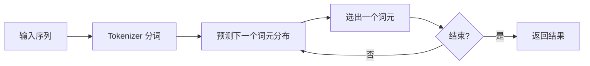
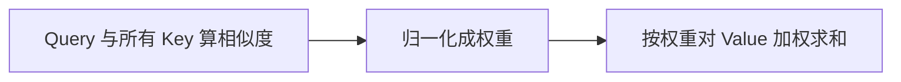
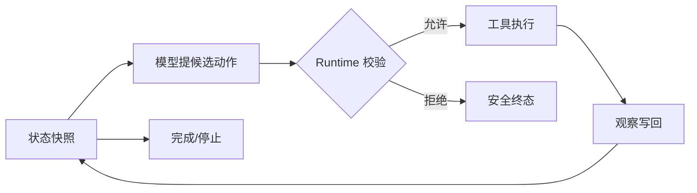
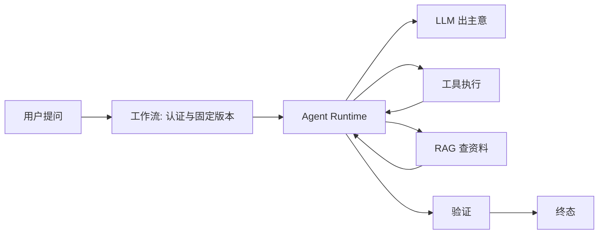

# LLM、工作流、RAG 与 Agent 如何分工

LLM、工作流、RAG、Agent 这四个词，在 AI 应用开发的资料里几乎总是同时出现，却很少被放在一起讲清它们的关系。有人把 Agent 理解成"LLM 加工具"，有人把 RAG 当成一种特殊的 Agent，还有人觉得工作流和 Agent 是二选一的方案。

这些说法各有各的错处，根子在于没把四样东西放回一个完整的系统里看。这篇文章用一个具体的场景把它们逐个展开：一个内部知识助手，要回答员工"远程访问为什么被拒绝"的问题。看这个问题从进来到答完，每一步该由谁来干、为什么是它干。

四个概念先摆一张总览，心里有个地图，后面逐个细看：

| 概念 | 职责 | 本质 |
| --- | --- | --- |
| LLM | 生成文字 | 根据输入预测输出，不知道实时事实 |
| RAG | 补外部知识 | 先查资料再回答，让结论有据可查 |
| 工作流 | 固化固定顺序 | 步骤写死，可审计、可枚举失败 |
| Agent | 动态决定下一步 | 看一步、想一步、再走一步的循环 |

读完你会发现，它们之间不是并列的四选一，而是一条因果链上的四个环节：一个解决不了的，引发下一个。

---

## LLM：能生成，但不知道事实

### 一次生成，本质是预测下一个词元

**LLM（Large Language Model，大语言模型）** 是一类靠海量文本预训练出来的神经网络模型。它的核心任务是**语言建模（Language Modeling）**，也就是给定一段文字，预测下一个 Token 的概率分布。

**Token（词元）** 是理解 LLM 的第一道门槛，值得先把量感建立起来。它既不是"字"也不是"词"，而是分词器定义的一种中间单位。一个粗略的换算：1 个 Token 大约等于 0.75 个英文单词，或者 0.5 个中文字符，"Hello World" 大约是两个 Token。模型计费和上下文窗口，全都是以 Token 为单位的。

分词由 **Tokenizer（分词器）** 完成。现在主流用的是 **BPE（Byte Pair Encoding，字节对编码）** 算法，思路是从字符出发，反复统计语料里最常一起出现的相邻字符对，把它们合并成新单位。"transformer" 最后可能被拆成 "transform" 加 "er"，因为这两个片段在语料里足够常见。中文里一个汉字通常是 1 到 2 个 Token。

拆成 Token 之后，生成是**自回归（Autoregressive）**的过程：模型预测出下一个 Token，把它拼回序列，再预测下下个，循环下去，直到预测出结束标记、达到长度上限，或触发其他停止条件。



图里"预测下一个词元分布"这一步，是理解 LLM 的关键：模型算出来的从来不是一个唯一答案，而是一组候选的概率。这也决定了模型的输出始终是候选，不是查表查出的唯一事实。

::: tip 一句话记住 LLM 的本质

LLM 不是"查答案"，而是**逐个 Token 续写一段概率上最合理的文字**。

:::

还有一层量感要建立：**上下文窗口（Context Window）**。模型一次调用能"看到"的 Token 数量是有限的，比如 128K 的窗口大约相当于 9.6 万个英文单词。注意这个窗口是**输入和输出共用的**，输入的提示词、历史对话、检索资料，加上留给输出的空间，全部挤在这一个窗口里。

窗口的昂贵程度，还跟语言有关。同样一句意思，不同语言消耗的 Token 数差别很大：英文大约每 4 个字符一个 Token，中文大约每 1.5 个字符一个 Token，代码大约每 3 个字符一个 Token。也就是说，**同样语义的中文内容比英文更烧 Token**，这是在中文场景做 AI 应用时绕不开的成本现实。

更要紧的是，窗口不是塞得越满越好。模型内部靠自注意力处理整个序列，计算量随 Token 数**平方级增长**：一万个 Token 大约一亿次注意力计算，五万个 Token 就是二十五亿次。计算量暴增的直接后果，是模型对窗口里信息的召回准确率会随长度逐渐下滑，这种现象叫**上下文腐蚀（Context Rot）**。换句话说，往窗口里塞更多资料，不一定让回答更准，反而可能让它抓不住重点。

这两个事实合起来，正是后面 RAG 存在的直接原因：资料太多、塞不进去，而且塞进去越多越不准，所以必须"检索出最相关的那几条"，而不是全量灌进去。

### 它能看懂整句话，靠的是自注意力

模型要预测"下一个 Token"，光看前一个 Token 是不够的。"它"指代什么、"这个"修饰谁，信息可能藏在很前面的句子里。模型需要一种机制，让每个位置的 Token 都能"看到"整个序列，并决定该重点看哪些位置。这个机制就是**自注意力（Self-Attention）**。

自注意力的实现，落到每个 Token 身上，是生成三个向量：

- **Query（查询向量）**：表达"我在找什么"。每个 Token 用它来发问：序列里有没有和我相关的信息？
- **Key（键向量）**：表达"我是什么"。每个 Token 用它来回答别人的查询。
- **Value（值向量）**：表达"我携带什么内容"。找到相关位置之后，实际被取走的是这部分信息。

计算分三步。第一步，拿当前 Token 的 Query，去和序列里所有 Token 的 Key 算相似度，得到一组**注意力权重**。第二步，把权重归一化。第三步，按权重把所有位置的 Value 加权求和，得到当前 Token"融合了上下文之后"的新表示。



用"它"来感受这个过程。句子是"他昨天买了它，因为它很便宜"。当"它"这个位置在生成 Query 的时候，这个 Query 会和句子里所有位置的 Key 比对，结果"书"那个位置的 Key 和它最匹配，权重最高。于是加权求和时，"书"的 Value 被大量取过来，"它"这个位置就"知道"自己指代的是书了。

这就是**长距离依赖**能力：两个词之间隔着再多的字，注意力也能直接把它们连起来。这也是 Transformer 相对早期循环网络（RNN）的关键优势，RNN 必须一步步顺序传递信息，距离一远，前面的信息就衰减得差不多了。

### 训练和推理，是两件不同的事

前面看的都是模型"已经会了"的样子。但这个能力不是天生的，它来自一次大规模的训练。要理解模型为什么"知道某些东西、又不知道另一些"，得先分清它生命周期里的两个阶段。

**训练阶段**，也就是**预训练（Pre-training）**，做的事朴素到有点让人意外：把海量的网页、书籍、代码丢给模型，让它反复做一道题，**"给定上文，预测下一个字"**。预测错了，就调整内部权重，也就是**参数（Parameters）**。这道题做上几万亿次，模型就慢慢学会了语法、常识、推理模式，甚至某种程度的"世界知识"。学到的所有东西，都压缩在这几百亿到上万亿个参数里。

注意"压缩"的含义：参数是一组数值权重，是训练结果的统计沉淀。它**不是一张可以按主键读取的事实表**。模型见过很多"远程访问申请"相关的表达，能判断"在家连接"和"外网办公"是近义说法；但某个具体公司今天改成什么制度，参数里不存在，也没法查。

**推理阶段**，就是我们日常调用模型的阶段。加载训练好的参数，对新的输入做一次前向计算，得到下一个 Token 的分布再采样。这一步参数是冻结的，模型不会因为这次对话而"记住"任何东西。上一轮对话的内容，下一轮想让它看到，必须由应用重新塞进输入。

::: warning 这个区分推出全文最重要的一条结论

**LLM 只会根据参数和当前输入生成候选，它不知道任何训练之后新发生的事实。**

:::

公司今天改了制度，训练好的参数不会跟着变。验证这个差别很简单：同一个模型调两次，第二次在上下文里加入最新制度，回答会随证据改变；只改数据库、不把结果带进输入，模型两次都看不到变化。

把 LLM"不知道"的范围归归类，其实可以落成四类，这四类也正是后面所有补丁要解决的问题：

| 类型 | 表现 | 后果 |
| --- | --- | --- |
| 实时信息 | 训练数据是历史的，问"今天"的事答不上 | 编造或拒绝 |
| 精确计算 | 语言模型不是计算器 | 大数运算经常算错 |
| 外部系统 | 不能发请求、不能读文件、不能操作数据库 | 对真实世界无能为力 |
| 私有数据 | 公司制度、账号状态训练时没见过 | 完全不知道 |

这四类里，**私有数据**正是 RAG 要解决的：模型不知道的私有知识，现场查出来喂给它。实时信息和外部系统，则要靠后面 Agent 的工具去补。精确计算这类确定性的事，直接交给普通代码更合适。

回到开头那个场景：知识助手要回答"远程访问为什么被拒"，光靠 LLM 本身答不对，因为它既不知道这个员工的账号状态，也不知道公司当前的制度。要补上这个短板，唯一的办法是让它在回答前先拿到资料。这就是下一个概念要解决的问题。

---

## RAG：先查资料，再回答

### 三个动作，缺一不可

**RAG** 是 **Retrieval-Augmented Generation** 的缩写。要理解它，得把三个词拆开，因为它们对应三个独立的动作，也正好对应"查资料回答问题"的三步：

- **Retrieval（检索）**：不在模型里，而是去知识库把和问题相关的内容找出来。它解决的是"模型不知道，但我可以去查"。
- **Augmented（增强）**：把刚检索到的内容，拼进要发给模型的输入。所谓"增强"，就是让模型输入里带着参考资料。
- **Generation（生成）**：到这一步模型才出场，让它基于查到的资料作答，而不是凭训练记忆瞎编。

一句话串起来：**先检索，再增强输入，最后生成**。它的价值，是给模型补上实时、准确、有据可查的知识。

### 查资料之前，先得把资料准备好

RAG 的检索不是"现查现用"那么简单。文档不会自己变成"能被检索的东西"，这中间有一条**离线链路（Offline Pipeline）**要先跑完：


这条链路里的每个环节都值得展开，因为它们中的任何一环偷懒，最终都会以"问到了但答案错"的形式报应回来。

#### 解析与准入：能解析，不等于能入库

知识库的原始材料可能来自任何地方：Word 文档、PDF、网页、Markdown、扫描件。解析这一步，是把它们统一成结构化的文本，并且保留标题层级、列表、表格这些结构信息。

不同格式的解析难度差异很大，这直接决定后面切块的质量：

- **Markdown 和 HTML** 是最友好的：标题层级、列表、代码块在源文件里就是显式结构，解析器几乎不用猜。
- **Word（docx）** 有标题样式、大纲级别这些天然结构，按样式层级解析就能还原文档骨架，属于结构可靠的一档。
- **PDF 是重灾区**：它的格式是为"打印排版"设计的，不是为"内容结构"设计的。标题和正文在 PDF 里可能只是两段字号不同的文字，解析器要靠字号、位置去猜哪个是标题。双栏排版、页眉页脚、跨页表格都会干扰判断。**扫描版 PDF 更麻烦**，它是图片，需要先 OCR 才能拿到文字，而 OCR 自带识别错误。
- **PPT（pptx）** 的结构单位是"页"，每页的标题、正文、备注是分开存放的，天然适合按页切块。但幻灯片里大量的文字藏在图片和图形里，需要 OCR 补充，这一部分的内容质量明显低于文本内容。

这里有一条工程原则值得记住：**"能解析"和"能入库"是两件事**。解析成功只说明拿到了文本，不代表这份文本可以成为可检索、可引用的知识。OCR 出来的文字尤其如此，它天然带着识别错误的可能，必须标记来源，不能和原生文本同等信任。入口处的文件类型、大小、内容安全也都要校验，恶意内容在进库之前就该被拦下。

#### 切块：决定检索的"颗粒度"

一篇一万字的制度文档，不能整篇塞进检索结果。真要塞进去了，模型拿到一大坨文字，反而抓不住重点。所以要把文档切成小块，这个操作叫**切块（Chunking）**，它决定了检索的颗粒度，是 RAG 质量的第一道关口。

切块不能图省事按固定字数硬切，那样会从中间截断一个完整的意思。正确的做法是**结构感知切块**，顺着文档自身的结构来：

- 标题成为新的小节标记，跟着后面的内容走；
- 段落保持完整，不拦腰截断；
- 列表的边界保持住，不把一条列表拆到两个块里；
- 代码块保持围栏完整，不能把半截代码交给模型；
- 表格单独处理，这个下面专门讲。

切分的位置优先选在句号、问号、分号和空行这些**语义边界**上，而不是数到第 1000 个字就砍一刀。工程上通常定两个长度：目标长度和最大长度，比如目标 1000 字符、上限 1800 字符，切分先按语义单元来，实在切不开才允许一个块长到上限。切出来的块还要记录前后邻接关系，也就是每个块知道自己的上一个块和下一个块是谁。这样检索命中某一块时，可以顺带把它的邻居一起取出来，补全上下文。

**表格为什么要单独处理**，是切块环节最容易被人忽略、又最容易出错的地方。看一个例子：

| 环境 | 灰度比例 | 负责人 |
| --- | ---: | --- |
| 预发 | 30% | 许澄 |
| 生产 | 15% | 沈川 |

如果整张表当作一段普通文字去向量化，用户问"生产环境的负责人是谁"，向量可能把表格召回了，但模型读到的是一段行列关系模糊的文字，很容易答串行。工程上的做法，是把表格拆成两种块：小表保留完整表格，同时**逐行生成结构化块**，每行把表头作为字段名、行值作为字段值存下来，比如"环境=生产，灰度比例=15%，负责人=沈川"。这样"15%"和"沈川"永远绑定在同一行，不会串。

#### 向量化：让"意思相近"变成"距离相近"

切完块，还差最后一步才能被"语义检索"：**向量化（Embedding）**。这一步用一个专门的 embedding 模型，把每个块映射成一串固定长度的数字，也就是一个向量。

这个映射不是随机的。embedding 模型在训练时的目标，就是让**语义相近的文本在向量空间里靠得近**。"远程访问怎么申请"和"怎样开通外网登录"，字面上几乎不重叠，但语义是一回事，embedding 之后两个向量之间的距离会很近。

把文本变成向量这件事，技术上有过几代演进，了解这条脉络能帮你理解现在的 embedding 模型为什么是这个样子：

- **词袋模型（Bag-of-Words）和 TF-IDF**：最早的做法，本质还是数词。把一段文字变成"每个词出现了几次"的向量，最多用词频加权。它能算"词面重叠"，但完全不懂语义，"远程访问"和"外网登录"对它来说就是两个毫不相干的词。
- **静态词向量（Word2Vec、GloVe）**：给每个词训练一个固定向量，"国王"和"王后"的向量距离会比"国王"和"苹果"近。进步在于向量开始携带语义，但局限是**一个词只有一个向量**，不管它出现在什么句子里，"苹果"永远是同一个"苹果"，分不清是水果还是手机。
- **上下文向量（BERT 系列）**：同一个词，放进不同的句子，得到不同的向量。"苹果"在"吃苹果"和"苹果发布新机"里向量不同。这是关键一跃，因为语义本来就依赖上下文。
- **现代 Embedding 模型**：现在做 RAG 用的 embedding 模型（比如 OpenAI 的 text-embedding 系列、开源的 BGE、E5 系列），基本都站在 BERT 这一类架构上，专门为"检索"这个任务训练，把一段文字（不是单个词）整体映射成一个向量，维度常见的有 768、1024、1536。选型时除了精度，还要看它支不支持中文、维度和成本。

对 RAG 来说，这条演进的意义很直接：**只有上下文向量这一代开始，"说法不同、意思相同"才能稳定地在数学上变成"距离相近"**，语义检索才真正可用。此前的词袋和静态词向量，撑不起"换个说法也能命中"这件事。

检索的时候，把用户的查询也做一次 embedding，然后计算它和知识库里每个块向量的距离。距离近的，就是语义相关的候选。这样检索就从"逐字匹配"升级成了"按意思匹配"，用户换个说法也能命中同一段资料。

工程上还有几个细节。每个块实际拿去向量化的文本，不一定等于原文，往往会拼上文档标题、章节路径这些元信息。为什么？因为用户问"索引发布冲突怎么办"时，光靠正文可能召回不到，但拼上章节标题"发布与回滚"，就能帮向量找到正确的块。另外，向量化是批量进行的，每一批回来都要校验数量和维度是否与预期一致，任何一批不一致，整次导入就应当失败，而不是悄悄留个残次索引。

这里也要划清边界：**向量表达的是模型学到的相似度，不是权限，也不是事实**。距离近只说明"意思像"，不说明"用户能看"，也不说明"内容是对的"。向量检索还有三个天然盲区：会把相似的错误码和编号混在一起、看不懂表格的行列约束、完全不感知权限。这些缺口都要由在线链路的其他环节来补。

#### 校验与原子发布：让坏索引上不了线

所有块都向量化完之后，还不能直接切换上线。发布前要做一轮**质量门禁**：

- **内容保留率**：切块有没有把原文切丢？保留率过低说明解析或切块有 bug。
- **重复块**：有没有一模一样的块被重复生成？
- **邻接完整性**：块的"上一个、下一个"引用有没有悬空？
- **超限检查**：有没有漏网的超长块？

任何一项不过，整次导入判失败，旧版本继续服务。这条原则可以总结成一句话：**先构建一份完整、可验证的新索引，再整体切换；绝不在旧版本上边改边覆盖。** 否则用户会在毫无提示的情况下，突然问不到某些内容。

### 在线链路：四个环环相扣的问题

离线链路把资料备好了，在线回答时还要解决四个环环相扣的问题。这四个问题不是并列的检查项，而是一条链：**先决定谁能看，再看是不是现行版本，再看搜得准不准，最后看能不能给结论上锁**。

**首先是谁能看。** 检索结果里可能有一篇跟问题高度相关、但属于机密部门的文档。向量相似度算的是"语义近不近"，**它和权限毫无关系**。所以权限过滤必须在召回之前就做掉，把它写进查询条件，也就是 **ACL（Access Control List，访问控制列表）** 前置。等检索完再靠文本判断"这条该不该删"，越权内容可能已经混进了候选，甚至进了模型上下文。要记住的原则是：**先过滤，后召回**，让没权限的内容根本不进入候选集。

**其次是不是现行版本。** 制度会改，一份"远程访问申请条件"可能有多个版本，旧版已经作废。检索不区分版本，就会把过期规定当现行规定喂给模型。RAG 用 **Release（发布版本）** 管这件事：每次检索绑定一个明确的 Release，只有属于当前生效 Release 的内容才有资格进候选。这正好接上离线链路末尾的"原子发布"，发布机制保证了任何时刻只有一个明确的 active 版本。

**再次是搜得准不准。** 向量检索擅长"说法不同、意思相近"，但对错误码、需求编号这类短标识符很无力，因为它们本身没多少语义。所以 RAG 要保留精确检索和全文检索兜底：语义问题走向量，具体编号走精确。语义检索解决表达差异，精确检索解决身份确认，两者缺一不可。

**最后是结论能不能上锁。** 模型生成一句话之后，怎么保证不是它编的？答案是**证据绑定（Evidence Binding）**：把答案拆成一个个事实断言（Claim），每个断言必须对应到检索出来的具体片段。绑得上，结论有据可查；绑不上，就删掉或拒答。这一步让 RAG 从"给模型塞资料"升级成"给结论上一道必须被绑定的锁"。

这四步走下来，RAG 才是可靠的。它不会自动消灭幻觉，但给每个结论加了一道证据约束。

还有一件事要分清：RAG 只负责"取证据"，不负责"决定下一步"。"查完制度后要不要再查账号"，这是另一个问题。RAG 把知识问题解决了，但引出了一个新问题：它解决不了"顺序"。

---

## 工作流：把固定顺序写死

### 有些事，跟"知不知道"无关，只跟"顺序"有关

RAG 解决了"模型不知道实时知识"。但回头想，知识助手里还有一类事，跟"知不知道为什么"没关系，只跟"顺序不能乱"有关。

比如"申请远程访问"：先提交申请，再主管审批，审批通过才开通权限。这个顺序是死的，不需要查什么资料，也不需要临场发挥，就是一个固定的流程。

把这种**已经定好的顺序写进程序**，每一步干什么、满足什么条件进下一步、走到哪算结束，全在代码里定死。这就是**工作流（Workflow）**。它可以是普通函数、队列任务、状态图，或持久化工作流实例。是否异步、有没有重试，都不改变它的本质：**控制路径在开发时就定了**。

看一段固定路径的伪实现：

```python
def explain_remote_access(user_id: str, question: str) -> Answer:
    # 状态按当前用户查，user_id 来自认证层，不是模型给的
    status = access_repository.get_status(user_id)

    # 范围和版本由程序固定，模型无权改动
    evidence = policy_search.search(
        query=question,
        scope=["employee-visible"],
        release=current_release(),
    )

    # 无证据时直接拒答，而不是让模型用常识补一段
    if not evidence:
        return Answer.refused("当前版本中没有可核对的申请说明")

    # 模型只参与最后一步的文字组织
    return answer_model.compose(question=question, status=status, evidence=evidence)
```

查询顺序、范围、无证据拒答都写在程序里。将来加"设备合规检查"，是开发者改代码、补测试，模型不会因为读到相关文档就自动获得调用新服务的权力。

工作流最大的好处是**可审计、可提前枚举失败**。身份无效、账号不存在、制度未发布、下游超时，每个错误对应明确终态。出问题能指认"卡在第几步、为什么"，而不是面对一段无法归因的模型输出。

### 但它的天花板，正是"流"是死的

工作流好，但它的限制就藏在名字里。当问题可能涉及设备合规、地区限制、临时冻结、多份制度时，要把每个分支提前列全会越来越难。你写的判断逻辑可能比业务本身还长，而且用户换个问法，你就得再补一个分支。

更关键的是，还有些任务，它的下一步**没法提前知道**。查完账号发现"培训没过"，接下来该查什么，是走了这一步才知道的。这种"走一步、看一眼、再决定下一步"的需求，工作流和 RAG 都解决不了。这把我们引向最后一个、也是最重要的概念。

---

## Agent：让下一步由现场决定

### 它补的是"动态决策"这块缺角

回头看前三个概念，它们的共同点是：LLM 一次性生成，RAG 只补证据，工作流把顺序写死。它们都不需要"根据中途的结果，现场调整下一步"。

而"远程访问被拒"这种问题，恰恰卡在这里：查一步，才知道下一步该查什么。这个"走一步、看一眼、再决定下一步"的循环，就是 **Agent（智能体）**。

::: info Agent 的定义

**Agent 是一个围绕模型运行的控制循环**。它保存目标与状态，让模型根据当前观察提出候选动作，由运行时校验并执行允许的动作，把执行结果作为新的观察写回，直到达成目标或触发停止条件。

:::



这个定义里最关键的一句：**智能在模型里，也在模型外**。模型只提供"下一步做什么"的候选，真正决定"能不能做、做完怎么继续、什么时候停"的，是外面的运行时。

### ReAct：Agent 循环的标准形态

Agent 循环有一个业界最通行的形态，叫 **ReAct（Reason + Act，推理与行动交织）**。它把每一圈拆成三个阶段：

- **Reason（思考）**：读当前状态，决定下一步做什么。输入是目标和历史观察，输出是"下一步动作 + 为什么"。这里有个关键原则：**只想一步**。让模型想太远，它会发散。
- **Act（行动）**：执行刚才决定的动作，比如查账号状态、搜制度文档。原则是**一轮只推进一个关键动作**，动作越小越容易定位问题。
- **Observe（观察）**：记录执行结果，喂给下一轮。原则是**观察要客观**，只记事实，不做判断，判断留给下一轮的 Reason。

用"远程访问被拒"走一遍：第一圈 Reason 决定"先查账号状态"，Act 执行查询，Observe 记下"设备不合规"；第二圈 Reason 看到这个结果，决定"查设备整改流程"，Act 再执行……循环往复，直到能回答为止。

### 循环什么时候停：六种终止条件

ReAct 循环最容易被忽略、又最容易出事故的问题，是**它什么时候停**。停太早任务没完成，停太晚 Token 烧光。工程上要覆盖六种终止条件，其中前四种是硬性的：

| 终止条件 | 说明 | 性质 |
| --- | --- | --- |
| 用户中断 | 用户主动停止 | 硬性，最高优先 |
| 预算耗尽 | 达到 Token 或成本上限 | 硬性护栏 |
| 超时 | 达到端到端时延上限 | 硬性护栏 |
| 最大轮数 | 达到预设的最大迭代次数 | 硬性兜底 |
| 任务完成 | 模型明确表示完成 | 正常终止 |
| 结果收敛 | 连续几轮观察没有新进展 | 软性判断 |

注意"预算耗尽"和"最大轮数"是两回事：前者约束的是花钱，后者约束的是步数。一个循环可以步数没超但已经烧穿了预算，也可以步数超了但预算还很充裕，两个护栏要同时存在。这也回到前面说过的分工：**这些停止条件全部由程序执行，模型在 Prompt 里写"最多五步"只是建议，真正一刀切下去的是运行时。**

生产实现里，这些终止条件通常落到三个具体参数上，每个参数都在防一种真实事故：

- **MaxIterations（最大轮数）**：防无限循环。经典事故是 Agent 搜索"Python 安装教程"，第一个结果是广告页，读完发现没用，再搜一次，因为搜索词没变，又命中同一个广告页，如此循环二十次零产出。生产环境通常设 10 到 15。
- **MinIterations（最小轮数）**：防偷懒。用户问"明天北京天气"，模型可能第一轮就编一个"晴，25 度"交差，根本没调用天气工具。强制最小轮数为 1，保证至少有一次真实的工具调用。这个参数的存在，也反过来印证了前面说的：模型输出是候选，不给它约束，它连工具都可能不用。
- **ObservationWindow（观察窗口）**：防 Token 爆炸。每轮的工具结果都堆进上下文，几十轮下来窗口就满了。工程上只保留最近几条观察，更早的压缩成摘要，保留关键信息、丢弃细节。

### 确定性 vs 概率性：Agent 与传统软件的本质差别

Agent 和传统软件的本质差别，是**确定性和概率性**的差别：

```text
传统软件:  输入 -> 固定逻辑 -> 输出
Agent:     输入 -> 模型思考 -> 工具调用 -> 观察结果 -> 再思考 -> ... -> 输出
```

传统软件给定输入 A，必然产出 B。Agent 给定输入 A，模型"思考"该怎么做，可能产出 B，也可能产出 C，每轮运行的路径都可能不同。这个差别带来灵活性，也带来不确定性。如何控制这种不确定性，是 Agent 系统设计的核心挑战，也是后面所有章节（预算、安全、观测、恢复）的出发点。

### 一个最小循环，看代码就明白

光说"循环""状态""运行时"还是抽象。下面用一个最小实现落到代码上。先看示意伪代码，讲清三个职责：**状态、决策器、运行时**：

```text
# 状态：记录循环走到哪了
class AgentState:
    question      # 用户的问题
    observations  # 目前看到了什么
    steps         # 转了几圈

def run_agent(模型, 工具集, 问题, 最大步数=4):
    状态 = AgentState(问题=问题)

    while 状态.steps < 最大步数:
        # 每一圈：把"问题 + 已看到的东西"交给模型，
        # 问它：继续查点什么，还是可以回答了？
        决定 = 模型.做决定(状态.question, 状态.observations)
        状态.steps += 1   # 步数是程序在数，模型加不了

        if 决定.类型 == "回答":
            return 决定.文本

        工具 = 工具集.get(决定.工具名)
        if 工具 is None:
            raise 报错("没有这个工具")   # 不存在的工具，直接拒绝

        try:
            结果 = 工具(决定.参数)      # 执行工具的是程序，不是模型
        except 超时:
            状态.observations.append("查超时了")
            continue                    # 回到循环开头，再让模型判断

        状态.observations.append(结果)   # 记下结果，进入下一圈

    raise 报错("步数用尽，没完成")
```

换成真正能跑的 Python：

```python
from dataclasses import dataclass, field

@dataclass
class Decision:
    """模型每一轮给出的决定：要么回答，要么调用工具。"""
    kind: str              # "answer" 或 "call_tool"
    text: str = ""         # kind == "answer" 时，这里是答案
    tool_name: str = ""    # kind == "call_tool" 时，工具名
    arguments: dict = None # kind == "call_tool" 时，工具参数


@dataclass
class AgentState:
    """Agent 记下的当前处境。"""
    question: str
    observations: list[str] = field(default_factory=list)
    steps: int = 0


def run_agent(model, tools, question, max_steps=4):
    state = AgentState(question=question)

    while state.steps < max_steps:
        decision = model.decide(state.question, state.observations)
        state.steps += 1

        if decision.kind == "answer":
            return decision.text

        tool = tools.get(decision.tool_name)
        if tool is None:
            raise LookupError(f"没有这个工具: {decision.tool_name}")

        try:
            result = tool(decision.arguments)
        except TimeoutError:
            state.observations.append("工具超时了")
            continue

        state.observations.append(result)

    raise RuntimeError("步数用尽，未完成")
```

配合一个测试替身，不调真实 API，只验证循环逻辑：

```python
class FakeModel:
    """测试用的假模型：固定套路出牌，只验证循环逻辑。"""

    def decide(self, question, observations):
        if not observations:
            return Decision("call_tool", tool_name="check_access", arguments={})
        if observations[-1] == "工具超时了":
            return Decision("answer", text="抱歉，现在查不到状态，请稍后再试。")
        return Decision("answer", text=f"根据查到的结果：{observations[-1]}")
```

这段代码的价值不在"能跑"，而在讲清一个容易误解的事：**Agent 的"聪明"来自模型每轮的现场判断，但"循环稳不稳、会不会死循环、工具挂了怎么办"是纯代码逻辑，可以脱离真实模型、用一个假模型单独验证**。把"模型在想什么"和"程序在做什么"分开测，是写 Agent 之后要反复用的习惯。

---

## 一条线串起来：四个概念怎么拼

走到这里，四个概念是被一条因果链"引发"出来的：LLM 不会实时知道事实，引发了 RAG；RAG 解决不了固定流程，引发了工作流；工作流解决不了动态决策，引发了 Agent。它们不是一个菜单，而是同一个系统在不同位置上的四个能力。

回到开头那个知识助手，它最终会长成这样：



- 入口**工作流**完成认证、建立 Turn、固定 Release 和 Policy；
- **Agent Runtime** 根据当前状态选择只读动作；
- **RAG** 作为受权限约束的能力返回 Evidence；
- **LLM** 生成计划候选和最终说明；
- 验证器检查断言、引用和终态，事件层把进度交给客户端。

信任在这个过程中不断变化：用户文本和文档内容是不可信数据，不能直接变成系统策略；模型输出是候选，不是命令；工具返回按来源分类；身份、权限、版本、终态由确定性程序维护。

反过来，职责重叠是故障的温床。Agent 的 Planner 不该重新决定用户可见范围；RAG 不该绕过 Runtime 读任意数据；模型不该生成服务端身份字段；工作流也不该把"检索为空"自动替换成模型常识。

同一句"回答不对"，可能来自不同层。定位时沿输入、状态、调用、输出、终态回放：

::: tip 四类错误的典型表现

- **模型层错误**：证据进了上下文，输出仍漏字段、结构不合法，或与证据冲突。
- **工作流错误**：该跳的节点没跳、失败被吞、重试重复副作用。
- **RAG 错误**：文档未发布、权限漏了、召回不到、融合丢候选、引用断裂。
- **Agent 错误**：选了无关动作、重复调用、预算耗尽、取消后继续、无证据就结束。

:::

一条能用的 Trace 至少回答：用了哪个策略与知识版本、模型每轮看到哪些可信字段、提了什么动作、程序为何允许或拒绝、工具返回什么状态、哪些证据进了答案、最后由哪个条件结束。缺了这些，调 Prompt 就是猜。

---

## 什么时候该用哪个

理解了整条因果链，最后一个实际问题：一个具体需求，到底上哪个？

判断标准不是"哪个听起来高级"，而是看**不确定性藏在哪**。可以把它理解成一条渐进增强的阶梯，每往上升一级，都是用成本和复杂度换能力：

| 阶梯 | 适用场景 |
| --- | --- |
| 一次 LLM 调用 | 资料已给全，只需摘要、改写、分类、抽取 |
| LLM + RAG | 回答依赖外部文档且要引用 |
| 工作流 | 顺序固定、失败代价高，需要可审计 |
| Agent（ReAct） | 中间结果改变下一步、分支列不完 |

实践中大部分任务停在阶梯的前两级就够了，能走到 Agent 的其实是少数。这里给一个判断任务适不适合 Agent 的简单方法，叫**实习生测试**：

::: tip 实习生测试

**如果这个任务你能用文字清楚地教给一个实习生怎么做，那它大概率适合 Agent。如果连你自己都说不清"怎么算做好了"，那 Agent 也搞不定。**

:::

比如"查一下账号状态、找到对应的制度条款、组织成一段说明"，每一步都能写清楚，适合 Agent；而"想一个颠覆性的商业模式"，你自己都说不清成功标准，Agent 也只能瞎转。这个测试把"适不适合用 Agent"从一个抽象问题，变成了一个可以立刻上手操作的问题。

判断口诀和前面一致：

::: warning 一条守则，请记住

**能写死，就别上 Agent。** Agent 的代价是更慢、更贵、更不确定，还附带循环怎么停、出错怎么回滚、如何防越权的一系列问题。固定流程能干净利落解决的，用工作流更稳、更省、更好维护。

:::

最后用失败路径反问是否过度设计：模型不可用能否降级、检索为空是否拒答、工具超时会不会重复副作用、用户取消后谁停 Worker、版本更新会不会改变进行中的请求。固定程序能完整回答这些，就没有必要为"更智能"加循环。

四个概念的分工，说到底是四个问题的答案：**LLM 回答"谁来生成"，RAG 回答"谁来补知识"，工作流回答"谁来固定顺序"，Agent 回答"谁来动态决定下一步"**。它们是一条因果链上的四个环节，分清它们，一个知识查询系统该长什么样，心里就有数了。
