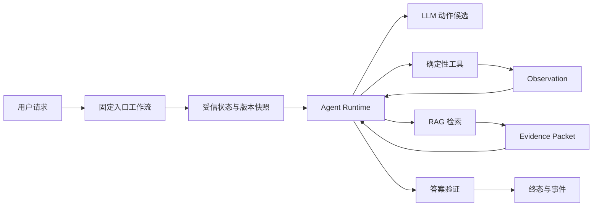
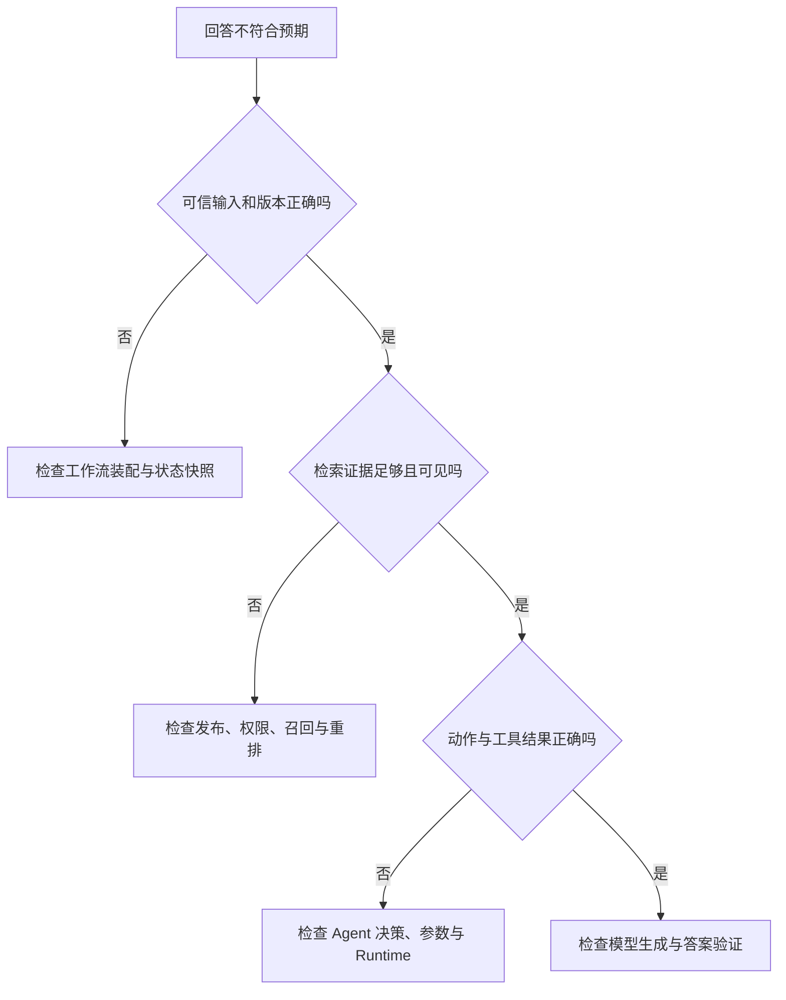

# LLM、工作流、RAG 与 Agent 如何分工

员工在内部知识助手里问："远程访问为什么被拒绝，我该怎样申请？"一句话背后至少有三类信息。账号当前是否具备远程访问权限，属于业务系统里的实时状态；申请条件和操作步骤来自已经发布的制度；怎样把查询结果组织成容易理解的说明，才是语言生成问题。

如果把这些工作都交给一次模型调用，回答可能写得流畅，却没有办法证明账号状态和制度版本。反过来，把每一种问法都写成条件分支，程序很快会被同义表达和追问压垮。**LLM**、工作流、**RAG** 与 **Agent** 的分工，就是在生成能力和确定性控制之间划清责任。

::: info 四个概念放在同一张系统图中

- **LLM** 根据当前输入和上下文生成候选文本或结构，位于模型层。
- **工作流** 由程序预先定义步骤、分支和终态，位于应用编排层。
- **RAG** 先从外部知识中检索证据，再把证据交给模型生成，横跨检索层与模型层。
- **Agent** 保存运行状态，让模型提出候选动作，再由程序校验、执行并决定是否继续，位于控制运行时。

:::

这四个概念并不是四款互相替代的产品。一个生产系统通常同时使用其中几种：工作流先完成身份校验，RAG 查询制度，LLM 生成说明；只有查询路径会根据中间结果变化时，才需要 Agent 循环。判断系统属于哪一类，要看**谁拥有下一步的决定权**，而不是界面上有没有聊天框。

## 用同一个问题比较四条执行路径

先固定输入和目标，才能看清差别。输入是一条用户消息和已经通过认证的用户身份，目标是解释拒绝原因并给出合规申请步骤。系统可能访问两个只读能力：`get_access_status` 查询账号状态，`search_policy` 查询当前生效的制度。任何方案都不能修改权限，也不能代替审批人做决定。

### 只调用 LLM

应用把用户问题直接交给模型：

```text
input:
  user_message = "远程访问为什么被拒绝，我该怎样申请？"

model_output:
  "可能是账号没有开通权限，请联系管理员申请。"
```

这条路径里，模型只能利用训练参数和本次输入。"可能"是合理的语言限定，却暴露了事实缺口：模型没有读取账号，也没有看到当前制度。输出适合作为一般解释，不适合作为针对该用户的结论。

如果应用要求模型返回 JSON，结果可以变成 `{"reason":"权限未开通"}`。JSON 能解析，不代表 `reason` 已经查证。格式约束没有增加事实来源。

### 使用固定工作流

程序可以把业务步骤写死：

```text
authenticate
  -> get_access_status(user_id)
  -> search_policy(policy_type="remote_access", active_only=true)
  -> render_answer(status, policy)
```

账号查询和制度检索每次都执行，顺序由代码决定。用户把问题改成"我在家为什么连不上"，只要入口已经把它归入远程访问流程，后面的控制路径不会改变。状态保存在工作流变量或持久化任务记录里，失败终态也可以提前列出：身份无效、账号不存在、制度未发布、下游超时。

固定工作流的好处是容易审计。缺点也明确：当问题可能涉及设备合规、地区限制、临时冻结或多份制度时，预先列完所有分支会越来越困难。模型可以在入口做分类，业务分支仍由程序控制。

### 加入 RAG

RAG 解决制度内容不在模型参数里的问题。系统先用查询词和权限范围检索当前 Release 中的文档，再把少量证据放进模型上下文：

```text
query = "远程访问 申请条件"
scope = ["employee-visible"]
release = "当前请求开始时固定的知识版本"

retrieval_result:
  evidence_1 = "申请人需要完成设备合规检查……"
  evidence_2 = "审批通过后权限在有效期内生效……"
```

模型现在可以基于制度写出申请步骤。账号状态仍然缺失，因为 RAG 检索的是知识库，不是任意业务数据库。即使把账号表也做成向量索引，向量相似度也不能替代按用户身份执行的精确查询，更不能保证数据实时。

RAG 的控制者可以是固定程序，也可以是 Agent。"先检索再生成"只描述知识怎样进入回答，没有规定谁决定查询几次、是否改写问题或何时停止。

### 使用 Agent 循环

Agent 运行时保存目标、观察和剩余预算。模型读取当前状态后提出下一动作，程序再决定能否执行：

```text
step 0:
  state = {question, user_scope, observations: [], remaining_steps: 4}
  model_proposal = get_access_status()

runtime:
  inject trusted user_id
  validate permission and arguments
  execute read-only tool

step 1:
  observation = {status: "missing_device_compliance"}
  model_proposal = search_policy(topic="device compliance for remote access")

step 2:
  observation = {evidence: [...], release_id: "..."}
  model_proposal = final_answer(...)
```

模型没有得到任意工具执行权。`user_id` 由服务端从认证上下文注入，模型不能换成另一个账号；检索范围和知识版本由运行时固定；每次调用前检查剩余时间和步数。模型负责的是在允许的动作集合中提出候选，程序负责身份、权限、参数、执行、副作用和终态。

四条路径处理的是同一个问题，状态和控制者却不同：

| 方案 | 主要输入 | 状态保存在何处 | 谁决定下一步 | 可核对输出 | 典型失败终态 |
| --- | --- | --- | --- | --- | --- |
| LLM | 消息与上下文 | 单次模型调用 | 模型继续生成 | 候选文本或结构 | API 错误、输出截断 |
| 工作流 | 业务请求与确定字段 | 程序变量或工作流状态 | 代码与状态机 | 业务步骤结果 | 已定义的失败状态 |
| RAG | 查询、范围与知识版本 | 检索请求和证据包 | 固定程序或 Agent | 带来源的候选证据 | 无结果、超时、版本不可用 |
| Agent | 目标、观察、动作集合与预算 | Agent Runtime | 模型提议，程序裁决 | 终态、事件和证据绑定 | 拒绝、取消、Deadline、步数耗尽 |

## LLM 怎样根据上下文生成候选

LLM 接收的是一串 Token。应用把系统规则、用户消息、历史、工具结果和检索证据序列化成输入，模型根据参数和已经出现的 Token 计算下一个 Token 的分布。生成过程不断重复，直到命中停止条件、达到输出上限或调用失败。

模型可以把"远程访问"、"在家连接"和"外网办公"理解为相近表达，也能把零散证据整理成连贯说明。这类能力来自训练阶段学到的语言和模式。它不知道应用数据库中哪个账号属于当前用户，除非应用把查询结果放入上下文。

### 模型参数保存统计规律

参数是训练结果，不是一组可以按主键读取的事实记录。模型也许学过常见的远程访问流程，却无法据此判断某个组织此刻采用哪套制度。制度在今天更新，已经训练完成的参数不会随之变化。要获得当前事实，应用需要读取权威系统或检索当前发布版本。

可观察后果很直接：两次调用使用相同模型，但第二次上下文加入了最新制度，回答会随证据变化；只改数据库、不把结果带入输入，模型看不到变化。

### 上下文只影响当前调用

上下文是这次生成临时可见的信息。应用没有持久化上一轮消息，下一次调用就不会自动记得；应用保存了消息但没有重新装配，模型同样看不到。长期记忆由应用选择、保存、检索和撤回，不能把供应商是否保留请求日志与模型记忆混为一谈。

这条边界也约束安全设计。工具结果里出现"忽略系统规则"，它仍是外部数据。应用要保留来源和信任级别，以数据容器放入上下文，不能因为它已经变成一段文字，就让它获得与系统指令相同的优先级。

### 生成是候选选择过程

数据库按索引、条件和事务读取记录；LLM 在候选 Token 之间继续生成。降低温度或采用确定性解码可以减少措辞变化，却不会把生成变成事实查询。输入缺少账号状态时，稳定地回答"权限未开通"仍然可能稳定地出错。

模型也可能给出多个语义相近但形式不同的答案。应用如果依赖某个字段，就应使用结构化输出约束形状，再对字段做业务验证，而不是靠解析自然语言猜测。

### 结构化输出只约束返回形状

Schema 可以要求 `reason_code` 只能取几个枚举值，要求 `steps` 是字符串数组，或者拒绝多余字段。它能解决解析不稳定和字段缺失，但不能证明模型选择了正确枚举。

账号 ID、租户范围、权限 Scope、知识 Release、策略版本和 Deadline 都不应由模型自行填写。程序从可信环境补入这些字段，执行前再次校验。模型返回的业务对象即使通过 Pydantic 或 JSON Schema，也只是一个形状正确的候选。

这四条边界属于 LLM，是因为它们都在限定同一件事：模型负责根据输入生成候选，事实读取、长期保存、业务授权和真实性确认属于模型之外的系统。

## 工作流怎样固定控制路径

工作流把已经知道的业务顺序写进代码或状态机。每个节点有明确输入和输出，边表示满足什么条件后进入下一步。它可以是普通函数、队列任务、状态图或持久化工作流，是否异步并不改变它的本质。

远程访问申请适合用工作流处理确定部分：认证必须先完成，账号状态必须按当前用户查询，写操作必须经过审批，审批成功后才能修改权限。这些规则不应由模型临场发挥。

### 控制图在开发时确定

下面的伪代码展示一条固定路径：

```python
def explain_remote_access(user_id: str, question: str) -> Answer:
    status = access_repository.get_status(user_id)
    evidence = policy_search.search(
        query=question,
        scope=["employee-visible"],
        release=current_release(),
    )
    if not evidence:
        return Answer.refused("当前版本中没有可核对的申请说明")
    return answer_model.compose(question=question, status=status, evidence=evidence)
```

模型只参与最后的文字组织。查询顺序、范围和无证据拒答都写在程序中。将来增加设备合规检查，需要开发者修改控制图并补测试，模型不会因为读到相关文档就自动获得调用新服务的权力。

### 工作流同样需要状态与恢复

长工作流可能跨越队列、人工审批和多个服务。状态要保存已完成节点、输入版本、幂等键和失败原因。Worker 重试时从确定边界继续，已经确认的写操作不能重复。

固定控制不等于没有复杂度。它只是把复杂度放在可审查的代码里。步骤数量多但依赖稳定的任务，通常仍适合工作流；分支少量增加时，状态机比 Agent 更容易验证。

### 失败路径可以提前枚举

身份校验失败时立即拒绝；账号服务超时可以重试或返回暂不可查；制度检索为空时不能用模型常识补齐；生成服务失败时可以退回结构化模板。每个错误对应不同证据和恢复动作。

工作流最怕的是把不同失败压成同一个空值。`status=None` 可能代表账号不存在、请求超时或程序解析失败。没有稳定错误类型，后面的节点只能猜，最终答案也会把系统故障说成业务事实。

## RAG 怎样把外部知识带进回答

RAG 包含两条链路。离线链路把文档变成可检索单元，在线链路根据问题取回证据并生成答案。只讨论向量查询，会漏掉文件准入、解析、切块、版本、权限和引用这些决定可信度的部分。

### 离线链路准备可发布知识

原始文件先经过类型和大小检查，保存内容哈希与对象位置；解析器把 PDF、Office、HTML 或 Markdown 统一成带章节和页码的 Block；切块器在语义边界拆分内容，保留父章节与邻接关系；Embedding 服务生成向量；候选版本通过数量、维度、来源和权限校验后才原子激活。

发布前失败不能污染在线检索。假设文档解析出 100 个 Chunk，向量化只成功 73 个，系统应保留旧 Release 继续服务，并记录候选版本失败。把 73 个结果直接标成 active，查询会在没有提示的情况下漏掉内容。

### 在线链路先固定范围再检索

在线请求先确认用户身份、可见知识库和 Release，再执行精确、全文、向量或结构化检索。候选需要保留稳定身份，融合和重排后仍能回到原文。缓存键也要包含权限范围和知识版本，缓存命中后重新鉴权。

以远程访问问题为例，精确检索适合业务编号和制度名称，全文检索能命中中文词项，向量检索补充不同表述。重排模型只改变候选顺序，不能把无权限内容变成可见证据。

### Evidence 才能进入事实回答

相似结果只是候选。应用要检查来源是否属于当前范围、内容是否来自固定 Release、分数是否达到最低条件，以及证据是否覆盖问题中的关键部分。通过检查的内容进入 Evidence Packet，包含来源 ID、章节定位、显示文本和权限指纹。

模型生成后，系统还要把答案中的事实断言绑定到 Evidence。某句话没有证据时，可以删除、有限修复或安全拒答。RAG 减少了模型凭参数回答的机会，却不会自动消除幻觉。

### RAG 不负责通用行动控制

查询改写、多路检索和重排可以构成复杂检索流程，但它们仍围绕获取证据。"查完制度后是否需要查账号"属于任务控制；"从哪些文档中找制度"属于检索。把两者分开，权限和测试才有稳定入口。

## Agent 怎样根据观察选择下一步

Agent 适合中间结果会改变后续动作，而且无法用少量固定分支提前表达的任务。运行时至少保存目标、当前状态、可用动作、观察、预算和终止条件。少一个都可能让循环失去约束。

### 模型提出动作候选

模型看到的是工具名称、用途和参数 Schema。它可以返回 `get_access_status` 或 `search_policy` 的调用候选，也可以返回最终回答。候选结果是一种结构化提议，不是命令。

工具描述写得含糊，会导致模型选择错误；描述写得再清楚，也不能代替服务端授权。运行时按照注册表确认工具存在，校验参数类型，注入用户身份和租户范围，再判断当前策略是否允许执行。

### Runtime 持有状态和执行权

状态在每轮开始前持久化或至少保存在运行时内存中。模型拿到状态副本，不能直接改写已执行记录。工具完成后，Runtime 把结果包装成带来源、状态码和信任级别的 Observation，再进入下一轮。

副作用工具要更严格。删除文件、发送消息或修改权限可以要求人工审批，也可以完全不出现在可用动作里。Agent 的自主性来自选择空间，选择空间由程序定义。

### 终止条件由程序执行

最终回答是正常终止之一。运行时还要处理最大步数、Deadline、用户取消、权限拒绝、连续无进展和不可恢复错误。把"最多四步"写进 Prompt 只能形成建议，有效的步数上限要由循环条件检查。

临时超时是否重试要看剩余预算和工具幂等性。未知工具通常说明模型候选与当前能力不一致，盲目重复相同请求没有意义。已经执行写操作后发生取消，需要幂等记录或补偿，不是简单丢弃状态。

### 一次失败推演

假设账号服务在第一步超时，Trace 应记录工具名、调用 ID、开始时间、Deadline、错误类型和是否产生副作用。Runtime 还有 20 秒预算，并且该工具只读，可以进行一次带退避的重试。第二次仍失败后，状态进入 `dependency_unavailable`，模型只能生成"当前无法核对账号状态"，不能根据制度猜测拒绝原因。

验证这条路径时，不需要真实模型。脚本化 Adapter 固定返回工具调用，假的账号服务连续抛出超时，测试断言调用次数为两次、终态正确、答案不包含未经查询的账号结论。这个测试证明控制逻辑，不证明真实模型会选择同样动作。

## 四类系统怎样组合

生产系统很少只属于一种类型。比较可靠的组合方式，是让每一层只承担自己能够证明的工作。

入口工作流完成认证、建立 Turn、固定 Release 和 Policy；Agent Runtime 根据当前状态选择只读动作；RAG 作为一个受权限约束的能力返回 Evidence；LLM 生成计划候选和最终说明；验证器检查断言、引用和终态；事件层把进度交给客户端。



图里的箭头也表达信任变化。用户文本和文档内容是不可信数据，不能直接变成系统策略；模型输出是候选；工具返回需要按来源分类；身份、权限、版本和终态由确定性程序维护。

### 组合后仍要避免职责重叠

Agent Planner 不应重新决定用户可见范围，RAG 不应绕过 Runtime 读取任意数据，模型不应生成服务端身份字段，工作流也不应把检索为空自动替换成模型常识。多个组件都能做同一件事时，故障会变得难以定位。

状态也不能散落。Turn 的终态由 Runtime 保存，知识 Release 由发布系统管理，证据身份由检索链维护，用户记忆有独立的写入和撤回规则。模型上下文只是这些状态在某次调用中的投影。

### 框架名称不改变边界

状态图框架可以实现 Agent 循环，工作流引擎可以持久化长任务，向量数据库可以执行相似检索，模型 SDK 可以提供 Tool Calling。它们提供实现手段，不会自动补上业务权限、证据验证和恢复策略。

评估一个框架时，可以把它映射回这四类职责：模型调用怎样适配，固定节点怎样编排，检索证据怎样保留来源，运行时怎样保存状态和停止循环。无法回答的部分仍要由应用实现。

## 从同一症状判断该查哪条路径

同一句"回答不对"可能来自完全不同的层。定位时应沿输入、状态、调用、输出和终态回放，而不是直接调整 Prompt。



::: tip 先固定证据，再调整模型

只看到最终文字时，先补齐请求快照、工具调用和 Evidence 记录。Prompt 调整只能处理生成层问题，无法修复旧 Release、权限过滤或重复副作用。

:::

模型层错误常表现为证据已经正确进入上下文，但输出遗漏字段、结构不合法或表达与证据冲突。工作流错误表现为不该跳过的节点被跳过、失败状态被吞掉或重试重复副作用。RAG 错误可能是文档未发布、权限过滤错误、查询没有召回、融合丢失候选或引用定位断裂。Agent 错误则包括选择了无关动作、重复调用、预算耗尽、取消后继续执行或在无证据时结束。

一条可用 Trace 至少能回答：请求使用哪个策略与知识版本，模型在每轮看到哪些可信字段，提出了什么动作，程序为何允许或拒绝，工具返回什么状态，哪些证据进入答案，最终由哪个条件结束。缺少这些记录时，调整模型只是在猜。

回归测试也要按层拆开。模型 Adapter 测请求与响应映射；工作流测试节点和终态；检索测试 Recall、排序、权限与版本；Agent 测动作、观察、预算、取消和恢复；端到端用例再确认它们组合后没有改变边界。

## 用测试证明四类职责没有混在一起

架构图只能表达设计意图，测试才说明代码是否守住边界。测试环境可以用脚本化模型、内存仓库和假的只读工具控制输入，这些替身只验证应用控制逻辑，不能当成真实模型质量或生产性能证据。

### 模型层测试只检查生成契约

给 Adapter 一份固定响应，验证应用能读取文本、结构化字段、完成原因和 usage；再返回缺字段、拒答或截断响应，确认调用方能区分。测试不应该声称模型知道账号状态，它只证明 SDK 对象被正确转换为应用对象。

```python
def test_model_output_is_still_a_candidate() -> None:
    response = {"reason_code": "NO_PERMISSION", "steps": ["提交申请"]}
    parsed = AnswerCandidate.model_validate(response)

    assert parsed.reason_code == "NO_PERMISSION"
    assert not hasattr(parsed, "verified_user_id")
```

这里故意不让模型返回 `verified_user_id`。如果业务对象需要这个字段，服务端应在身份校验后生成另一个已验证类型。把候选对象和已验证对象分开，比在同一个对象上加 `trusted=True` 更不容易误用。

### 工作流测试固定节点与终态

账号仓库返回 `missing_device_compliance`，制度检索返回一条有效证据，工作流应依次调用两个能力并进入 `completed`。把制度检索改成空结果，终态应变成 `insufficient_evidence`，生成器不能被调用。

这项断言很重要。很多系统虽然写了"无证据不回答"，代码仍会在空列表时调用模型，模型随后用参数知识补出一段听起来合理的申请步骤。测试需要检查调用次数，而不只是检查最终字符串中有没有"无法确认"。

```text
given:
  account_status = missing_device_compliance
  evidence = []

expect:
  terminal_status = insufficient_evidence
  answer_model.call_count = 0
  permission_write.call_count = 0
```

### RAG 测试固定权限与版本

准备两个知识版本：旧版本允许直接申请，新版本要求先完成设备检查。请求开始时固定新版本，即使执行过程中又发布第三个版本，本次检索也只能返回新版本证据。另一个租户中有标题相同的文档，权限过滤必须在融合与缓存之前生效。

测试先用严格查询命中制度编号，再用同义问法验证全文或向量通道，最后关闭向量服务，确认系统可以降级到非稠密检索，并明确记录降级状态。降级后的 Recall 可能下降，不能把"请求仍返回 200"写成检索质量不受影响。

缓存还要做一组反例：用户 A 的查询先命中缓存，用户 B 使用相同文本请求。缓存层可以复用候选 ID，却必须按用户 B 的范围重新鉴权。若测试直接返回 A 的完整 Evidence Packet，就说明缓存越过了权限边界。

### Agent 测试固定动作和停止条件

脚本化模型第一轮请求账号，第二轮请求制度，第三轮返回答案。测试记录每轮状态，确认工具结果只以 Observation 追加，模型不能覆盖用户身份和 Release。再把脚本改成连续请求同一个工具，运行时应在步数或无进展条件命中时停止。

取消测试要覆盖竞态。取消信号到达时，如果工具尚未开始，调用次数应保持为零；工具已经完成只读查询时，可以保存观察后进入 `cancelled`；工具已经产生写入时，终态必须记录副作用身份，交给幂等或补偿流程处理。简单地抛出 `CancelledError` 会丢掉最后一种情况。

### 组合测试检查最终事实来源

端到端测试输入仍是"远程访问为什么被拒绝，我该怎样申请？"。账号工具返回设备未合规，知识库提供当前申请条件，模型 Adapter 故意在答案中加入一条证据里没有的"审批会在当天完成"。验证器应删除或拒绝这条断言，保留有证据的步骤，并让引用指向实际使用的制度片段。

最终验证结果至少包含终态、所用知识版本、工具调用记录、选中证据 ID、断言与证据绑定，以及被拒绝的无依据内容。这样才能从结果反查：账号结论来自业务工具，申请条件来自 RAG，措辞来自 LLM，动作顺序由 Agent Runtime 控制。

## 怎样选择最小可行方案

资料已经随请求提供，只需摘要、改写、分类或抽取时，一次 LLM 调用通常够用。字段会驱动业务动作时，加 Schema 和服务端验证。

步骤明确、分支有限、失败代价高的任务优先工作流。是否需要异步、重试或人工暂停，可以在工作流内部解决，不构成使用 Agent 的理由。

回答依赖外部文档而且需要引用时加入 RAG。先把文件发布、权限、版本、召回和证据定位做好，再讨论 Agentic RAG。检索链本身不可靠时，让 Agent 多查几轮只会放大噪声和成本。

中间观察确实会改变下一步，分支又无法用少量规则列完时，才引入 Agent。实施前至少写清动作白名单、可信字段来源、最大步数、Deadline、取消语义、所有终态和无证据时的处理。写不清这些内容，换成任何 Agent 框架都不会自动变可靠。

最后用失败路径反问方案是否过度设计：模型不可用时能否降级，检索为空时是否拒答，工具超时会不会重复副作用，用户取消后谁停止 Worker，知识版本更新会不会改变进行中的请求。固定程序能够完整回答这些问题，就没有必要为了"更智能"增加循环。
