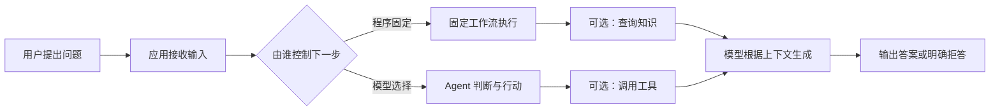
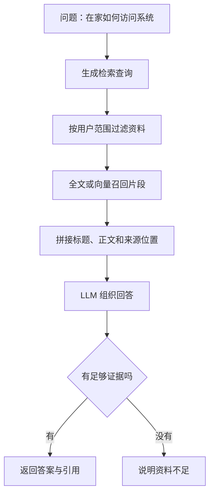

# LLM、工作流、RAG 和 Agent 到底是什么，有什么区别

用户问：“远程办公时，怎样申请系统访问权限？”

这句话可以交给大模型直接回答，也可以先查固定流程、搜索知识库，或者让 Agent 自己判断要不要查资料。四种做法都能叫“AI 应用”，但它们的控制方式完全不同。没有分清这一点，项目很容易一开始就引入 Agent，最后却只实现了一个昂贵的聊天接口。

本文只解决一个问题：面对一个具体需求，怎样判断它应该使用 LLM、工作流、RAG 还是 Agent。读完后，你应该能画出执行路径，而不是只会背四个缩写。

## 先约定一个共同场景

假设我们有三份资料：

- 《远程访问申请说明》：说明申请条件和入口；
- 《账号安全规范》：说明设备和网络要求；
- 《常见问题》：解释“申请被拒”时该怎么办。

用户的问题不一定会使用资料中的原词。“在家怎么连系统”可能对应“远程访问”，“权限没开通怎么办”可能对应“申请被拒”。系统要做的事情可以拆成四步：理解问题、找到相关信息、组织答案、把结果返回给用户。



图中的关键不是“有没有模型”，而是“下一步由谁决定”。固定工作流由程序决定；Agent 可以根据当前状态选择检索、调用工具或结束。RAG 是一种给模型补充外部资料的方法，它本身不是一个独立的控制器。

## LLM：会根据输入生成内容的模型

LLM 是 Large Language Model，大语言模型。它接收一组消息，按照训练得到的概率分布预测后续 Token，最终生成文本或结构化结果。

### 它解决什么问题

如果我们把问题直接发给模型，模型可以：

- 把口语问题改写成正式表达；
- 总结一段已经提供的文字；
- 生成邮件、代码或解释；
- 从几个候选意图中选择一个。

这些任务的共同点是：所需信息已经在输入中，或者任务不要求查当前系统数据。

### 它不知道什么

模型不会自动知道你的内部申请入口、今天的服务状态或某个用户的权限。它可能生成一段看起来合理的答案，但这不等于答案来自你的资料。把“语言表达能力”误认为“实时知识访问能力”，是初学者最常见的误解。

最小调用可以写成下面这样。示例没有绑定具体供应商，重点是观察输入消息如何成为模型上下文，`temperature` 如何影响输出随机性，以及程序怎样处理返回值。

```ts
type Message = { role: 'system' | 'user'; content: string }

async function answerWithModel(messages: Message[]) {
  const response = await modelClient.chat({
    model: 'chosen-model',
    messages,
    temperature: 0.2,
  })
  return response.outputText.trim()
}

const answer = await answerWithModel([
  { role: 'system', content: '只根据用户提供的资料回答，不确定时说明不知道。' },
  { role: 'user', content: '请把这段申请说明改写成三步操作：提交申请、等待审批、查看结果。' },
])
console.log(answer)
```

`Message` 只描述本例需要的两种消息角色。`answerWithModel` 把消息数组交给客户端，等待异步网络请求完成，再取出文本并删除首尾空白。调用处提供系统约束和用户任务，所以模型只能在这段输入范围内组织语言。运行时应观察三件事：请求是否成功、返回是否为空、模型是否遵守了“只根据资料回答”的约束。生产代码还要处理超时、供应商错误、输出长度和敏感信息，不应直接把异常堆栈返回给用户。

## 工作流：程序提前写好执行顺序

工作流是由程序控制的固定步骤。它可以包含模型，但模型不负责决定下一步。

### 例子：固定的申请说明流程

我们可以规定：

1. 先读取申请说明；
2. 再读取账号安全规范；
3. 把两段资料交给模型改写；
4. 输出三步操作。

无论用户怎么提问，程序都执行这四步。用户问“怎么申请”和“申请入口在哪”，可能都走同一条路径。

```text
用户输入
  -> 读取固定的两份资料
  -> 组合上下文
  -> 调用模型改写
  -> 返回答案
```

工作流的优点是容易测试。给定同样的输入，程序调用的资料和步骤固定，日志也容易解释。缺点是灵活性有限：如果问题其实是“申请被拒后怎么办”，固定流程仍然会读取两份无关资料。

### 什么时候优先工作流

- 步骤是业务规定，不能由模型改变；
- 需要审批、扣费、写数据库等副作用；
- 分支数量有限，能用状态机或条件语句描述；
- 团队需要稳定的延迟和可预测成本。

“有模型”不等于“需要 Agent”。一个翻译、摘要、固定字段抽取或审批前校验流程，通常先做工作流更合适。

## RAG：回答前先找外部资料

RAG 是 Retrieval-Augmented Generation，检索增强生成。它把回答拆成两个阶段：先从外部知识源检索候选片段，再把候选片段放进模型上下文生成答案。

### RAG 解决什么问题

模型训练数据不包含你的私有文档，或者文档会持续更新。RAG 不要求每次更新都重新训练模型，而是在请求时把当前允许查看的片段找出来。

一次 RAG 请求至少包含：

1. 用户问题；
2. 查询改写或检索词；
3. 过滤后的候选片段；
4. 带来源上下文的生成请求；
5. 引用、拒答或答案。



“按用户范围过滤”必须发生在召回前，而不是先召回所有资料再让模型自行判断权限。模型可以帮助理解问题，但权限、版本和证据可见性应由确定性程序控制。

### RAG 不是训练模型

训练会改变模型参数，通常需要专门的数据和计算流程。RAG 保持模型不变，只在请求上下文中临时加入片段。文档更新后，通常重新解析、切片和向量化；已经运行的模型不需要重新训练。

### RAG 什么时候不够

- 资料没有被正确解析，表格和标题在导入时丢失；
- 查询和片段语义不匹配，召回不到答案；
- 用户无权查看的片段被缓存或引用；
- 检索到了相关片段，但模型把多个片段拼错；
- 问题需要实时数据库状态，而知识库只是静态文档。

所以 RAG 不是“接一个向量库就完成”。文档解析、切片、Embedding、权限过滤、引用和答案验证会在后面的文章分别展开。

## Agent：模型可以选择下一步行动

Agent 是一种运行方式：模型根据目标和当前状态，决定是否需要调用工具、调用哪个工具、使用返回结果后是否继续，直到满足停止条件。

### 仍然使用同一个场景

用户问：“我在家访问系统被拒了，应该怎么处理？”

Agent 可能这样执行：

1. 判断这是“远程访问 + 拒绝原因”；
2. 先检索申请说明；
3. 发现资料要求查看当前账号状态；
4. 调用只读账号状态工具；
5. 观察工具结果；
6. 再检索安全规范；
7. 证据足够后回答，或在预算耗尽时停止。

这里的“选择先查哪份资料、是否需要账号工具”不是固定写死的，而是由模型结合状态做出的决策。程序仍然需要限制工具白名单、权限、调用次数、超时和总预算。

```text
目标：解释访问被拒的处理方法
状态：问题、用户范围、已找到的证据、剩余预算
模型决策：检索 -> 观察 -> 再检索 / 回答 / 拒答
程序约束：只能调用只读工具，不能越权，最多执行 N 次
```

### Agent 解决什么问题

- 用户任务可能需要多个步骤，但步骤取决于中间结果；
- 工具数量和查询路径不能提前完全枚举；
- 需要根据证据缺口动态补充研究；
- 运行过程要记录状态，并允许在预算或 Deadline 到达时停止。

### Agent 不适合什么

- 只有一个稳定 API 调用；
- 所有步骤都是固定审批或事务操作；
- 任务错误代价很高，但没有足够评测和人工确认；
- 通过一个 SQL 查询就能得到结果；
- 团队还没有工具契约、权限和观测能力。

在这些场景中，工作流通常更简单、更便宜，也更容易证明正确。

## 四种方式放在一张表里

| 方式 | 谁控制下一步 | 知识来源 | 适合的任务 | 主要风险 |
| --- | --- | --- | --- | --- |
| LLM | 调用方固定一次调用 | 输入消息和模型已有知识 | 改写、总结、分类、生成 | 幻觉、格式不稳定 |
| 工作流 | 程序和状态机 | 固定 API、数据库或文档 | 审批、同步、固定处理链 | 变化时需要改流程 |
| RAG | 程序固定检索链 | 文档、数据库、搜索索引 | 私有知识问答、带引用回答 | 召回错误、权限泄露 |
| Agent | 模型在程序边界内选择 | 工具、知识库和外部系统 | 多步研究、动态工具组合 | 成本、延迟、循环和不可预测性 |

判断时不要从“现在流行什么框架”开始，先问三个问题：步骤是否固定？答案是否依赖外部资料？中间结果是否会改变下一步？

## 选型练习

### 任务一：把十段产品说明改成摘要

输入已经包含全部资料，步骤固定，不需要访问外部系统。选择一次 LLM 调用即可。

### 任务二：每天把新文档同步到搜索索引

解析、切片、向量化和写入顺序固定，失败要重试。选择后台工作流，不要让 Agent 决定数据库写入顺序。

### 任务三：回答用户的内部规范问题

答案依赖持续更新的资料，需要检索和引用。先做 RAG；只有当检索路径会根据中间证据变化时，再考虑 Agent。

### 任务四：跨三类资料调查一个故障

需要先查服务日志，再根据错误码查运行手册，最后根据版本查变更记录。若路径无法提前枚举，可以使用受限 Agent；否则用显式工作流更容易审计。

## 一张可以带走的判断卡

```text
问题是否只需要输入中的信息：是 -> LLM
步骤是否固定且需要稳定执行：是 -> 工作流
是否需要从外部资料补充答案：是 -> RAG
中间结果是否会改变下一步：是 -> 在工作流/RAG 外评估 Agent
是否涉及权限、写入、扣费或审批：先由程序控制，不能交给模型
是否有工具白名单、预算、Deadline、日志和评测：没有 -> 先不要上 Agent
```

这张卡的输入是一个具体需求，输出是实现形态和需要补齐的工程约束。它不是框架排行榜：同一个产品可以同时使用工作流、RAG 和 Agent，关键是每一层的职责要能解释。

下一篇会拆开消息、Token 和上下文窗口，说明模型实际收到的输入是什么，以及为什么上下文预算会影响 RAG 和 Agent 的设计。
