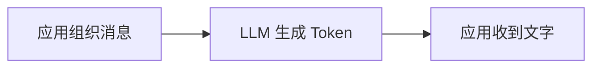
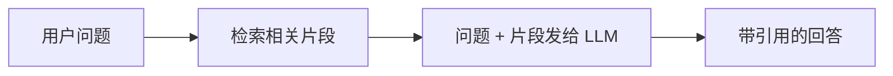
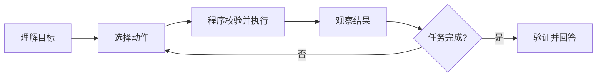

# LLM、工作流、RAG 和 Agent 到底有什么区别

先看一个很普通的问题：

> 公司员工问：“我在外地办公，怎样申请系统访问权限？”

如果把这句话直接发给大模型，它可能给出一套听起来合理的申请流程。但模型没有读取公司的现行制度，也不知道提问者属于哪个团队。文字流畅不代表答案正确。

解决这个问题有四种常见做法：直接调用 LLM、固定工作流、RAG 和 Agent。它们不是由低到高的“升级路线”，而是四种不同的控制方式。本章会用同一个问题逐层改造，最后得到一张可以用于实际选型的判断表。

## 先认识 LLM：它只负责根据输入生成输出

LLM 是 Large Language Model，大语言模型。应用把一组消息发给模型，模型根据训练参数和当前上下文预测后续 Token，再把 Token 还原成文字。



这里有两个容易忽略的事实。

第一，模型看到的只有本次请求提供的内容。它不会自动读取数据库、公司文档或实时网页。第二，模型生成的是概率结果。即使输入完全相同，也可能因为模型版本或采样参数得到不同表达。

直接调用 LLM 适合这些任务：

- 改写一段已经提供的文字；
- 按给定材料生成摘要；
- 对不要求外部事实的内容做分类或抽取；
- 允许人工复核的创意草稿。

它不适合独立决定权限、金额、订单状态，也不适合回答依赖私有资料和实时状态的问题。

### 用直接调用解决示例问题会缺什么

我们把员工问题发给模型，没有提供制度原文。模型只能依赖训练时见过的通用流程。它不知道申请入口、审批角色和当前版本，所以只能写成“建议联系人事或管理员”。

这不是模型“笨”，而是输入中没有事实。先把问题定位为“缺资料”，后面才知道为什么需要 RAG。

## 工作流：步骤由程序提前决定

假设访问申请的路径完全固定：验证登录、读取用户部门、查询申请表、返回地址。我们可以把步骤写在普通程序里。


工作流的控制者是程序。每一步何时执行、失败后走哪条分支，都由开发者提前写好。LLM 可以在某一步承担“把结果解释得更自然”，但它不负责决定关键业务路径。

工作流的优点是可预测、好测试、成本稳定。登录、计费、审批、状态迁移这类规则明确的业务，优先使用工作流。

工作流的限制也很直接：当用户的问题开放、需要动态选择资料或步骤时，固定分支会快速膨胀。例如“比较三份制度的差异并找出冲突条款”很难提前列出所有比较路径。

## RAG：先检索资料，再让模型根据资料回答

RAG 是 Retrieval-Augmented Generation，中文常译为“检索增强生成”。它没有改变模型本身，而是在调用模型前增加了一次资料检索。



仍然使用“怎样申请访问权限”这个问题。系统先在用户有权查看的制度中搜索，找到“远程访问”和“账号申请”两个段落，再把它们连同问题交给模型。回答中的流程因此可以绑定到具体资料。

一个最小 RAG 包含四部分：

1. **数据导入**：把 PDF、网页或文档解析成文本；
2. **切片与索引**：把长文档拆成可检索片段；
3. **检索**：根据问题找出候选片段；
4. **生成**：让模型只根据候选片段组织答案。

RAG 适合知识问答、资料摘要、制度比较和带来源的内容生成。它仍然可以是固定工作流：问题进来后永远按“检索一次、生成一次”的路径运行。

RAG 不能自动保证正确。检索可能找错片段，用户可能无权查看某条资料，模型也可能把两个片段错误拼接。后续课程会分别处理切片、检索、权限和引用验证。

## Agent：模型参与选择下一步动作

Agent 没有一个覆盖所有框架的唯一代码定义。工程上可以先使用这个可操作的模型：

> Agent 是一个由程序约束的执行循环。模型根据目标和当前状态提出下一步动作，程序验证并执行动作，再把结果交还给模型，直到得到终态。



对于示例问题，Agent 可能先判断用户是在问制度，再选择知识检索工具。如果问题改成“比较旧版和新版制度”，它会检索两个版本；证据不足时可以补充检索；用户指定了不可见范围时，程序会在执行工具前拒绝。

Agent 的关键不是“用了大模型”，而是路径在运行时才确定。路径越开放，越需要限制工具、步数、时间、费用和权限。

### Agent 不等于自主运行的黑盒

模型只提出动作，应用仍然掌握控制权：

- 工具是否允许调用，由程序白名单决定；
- 参数是否合法，由 Schema 和业务规则决定；
- 数据是否可见，由身份与 ACL 决定；
- 是否继续循环，由步数、Deadline 和终态规则决定；
- 最终回答是否可发布，由引用、安全和质量检查决定。

如果把这些决定也交给模型，系统会变得难以测试。后面的架构章节会反复使用一个原则：语义判断可以交给模型，权限、状态和资源边界由确定性程序控制。

## 把四种方案放在一张表里

| 方案 | 谁决定步骤 | 外部知识从哪里来 | 结果稳定性 | 适合任务 |
| --- | --- | --- | --- | --- |
| 直接 LLM | 单次模型调用 | 请求中已有内容或模型参数 | 表达有概率变化 | 改写、摘要、抽取、草稿 |
| 工作流 | 程序 | 数据库、API、固定输入 | 路径稳定 | 登录、审批、计费、固定自动化 |
| RAG | 通常由程序固定 | 检索到的私有或公开资料 | 受检索和生成共同影响 | 知识问答、资料比较、引用回答 |
| Agent | 模型提议，程序约束 | 工具、RAG、API 等 | 路径和表达都可能变化 | 开放研究、动态工具选择、多步任务 |

这四类可以组合。一个 Agent 可以调用 RAG 工具；Agent 内部的权限检查仍然是固定工作流；最后一步可以调用 LLM 生成自然语言。选型时不要问“哪种更先进”，而要问“哪一步真的需要运行时决策”。

## 用五个问题完成选型

拿到一个 AI 需求时，按顺序回答：

1. **输入里是否已经包含完成任务所需的全部事实？** 是，可以先尝试直接 LLM。
2. **业务步骤能否提前完整列出？** 能，优先工作流。
3. **答案是否依赖大量外部资料？** 是，在工作流中加入 RAG。
4. **系统是否需要根据中间结果动态改变步骤？** 是，才考虑 Agent。
5. **动态决策带来的收益能否覆盖测试、观测和成本？** 不能，就退回更简单的方案。

### 三个练习

请先自己选择，再看判断依据。

| 任务 | 建议起点 | 判断依据 |
| --- | --- | --- |
| 把用户提供的邮件改得更礼貌 | 直接 LLM | 所需内容已经在输入中 |
| 创建订单并扣减库存 | 工作流 | 状态和事务必须确定 |
| 根据内部手册回答设备故障 | RAG | 路径固定，但依赖私有资料 |
| 比较多份报告，证据不足时继续查找 | Agent + RAG | 下一步取决于中间结果 |

## 带到工作中的选型卡

在方案评审中记录以下内容：

```text
任务目标：
所需事实是否都在输入中：
固定步骤：
需要动态决定的步骤：
允许调用的外部能力：
必须由程序控制的规则：
停止条件：
错误结果的影响：
最终选择：LLM / 工作流 / RAG / Agent / 组合
```

如果“需要动态决定的步骤”一栏为空，就没有必要为了 Agent 这个名字增加执行循环。下一章会拆开一次模型请求，先弄清消息、Token 和上下文窗口到底怎样限制系统。

## 参考资料

- [OpenAI Prompt Engineering：消息与模型输入](https://platform.openai.com/docs/guides/prompt-engineering)
- [LangGraph Workflows and Agents](https://docs.langchain.com/oss/python/langgraph/workflows-agents)
- [Retrieval-Augmented Generation 原始论文](https://arxiv.org/abs/2005.11401)

