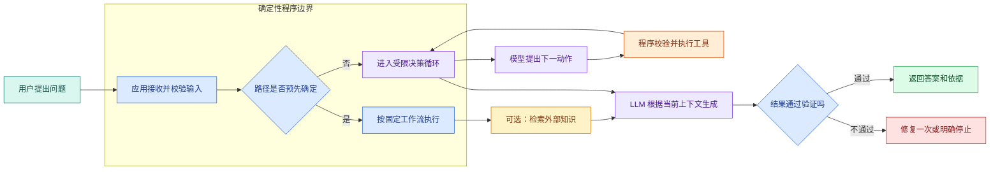
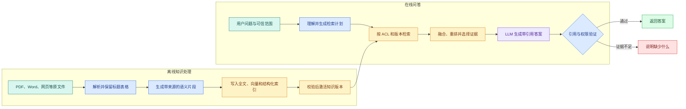
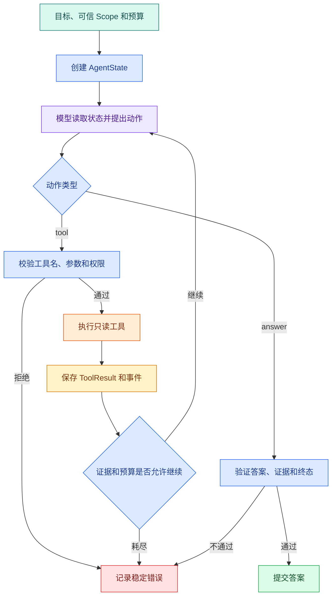
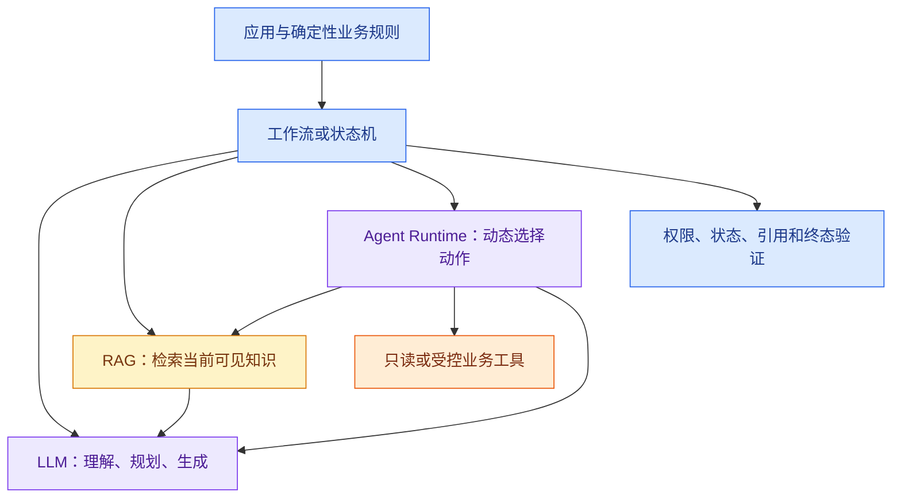

# LLM、工作流、RAG 和 Agent 到底是什么，有什么区别

先把四个词放在同一张地图上：LLM 是根据上下文生成候选文本或结构的模型；工作流是程序预先写好的固定步骤；RAG 是“检索外部知识后再生成”的组合方式；Agent 是由运行时保存状态、让模型提出下一动作并由程序决定是否执行的受限循环。LLM 位于模型层，工作流位于应用编排层，RAG 横跨检索和生成，Agent 位于更上层的控制运行时。

它们解决的问题不同：LLM 处理语言不确定性，工作流保证顺序可预测，RAG 把回答连接到当前资料，Agent 在步骤不固定时选择下一动作。实际系统通常组合它们，而不是四选一。

用户问：“我在家访问系统时被拒绝了，应该怎么办？”

只看这句话，四种系统都可能给出回答：

- LLM 根据输入直接组织一段说明；
- **固定工作流**依次读取指定资料，再生成结果；
- **RAG** 先检索与“远程访问”和“拒绝原因”相关的片段；
- **Agent** 先查申请规则，再根据中间结果决定是否查询账号状态。

它们的页面都可能只显示一个聊天框，底层却是四套不同的执行逻辑。真正的区别不在“有没有用大模型”，而在三个问题：知识从哪里来，下一步由谁控制，系统怎样判断应该停止。

同一个匿名场景分别运行四种实现，可以直接比较它们的输入、内部状态、处理过程、输出和失败方式。执行路径会显示哪些需求只需要普通程序，哪些才需要 RAG 或 Agent。

## 开始前先准备什么

本文示例只依赖标准库，不需要安装第三方包或配置模型密钥。

你需要先知道两个基础词：

- **HTTP 请求**：一个程序向另一个服务发送输入并等待响应。模型 API、搜索服务和业务 API 通常都通过 HTTP 访问。
- **JSON**：由对象、数组、字符串、数字和布尔值组成的结构化文本。模型工具参数和服务响应经常使用 JSON 表示。

Token、向量数据库和 LangGraph 先以可观察的输入、状态或执行节点出现，具体机制再按各自依赖展开。

## LLM、Workflow、RAG 与 Agent 的系统位置

下面这张图只回答一件事：一次请求进入系统后，谁决定下一步。



图里有两条主路。左边是工作流：程序在写代码时已经决定调用顺序，检索和模型只是其中的步骤。右边是 Agent：模型可以提出下一动作，但动作必须经过程序校验后才能执行。

RAG 位于“检索外部知识”这一步。它既能被固定工作流调用，也能成为 Agent 的一个工具。LLM 位于“理解、决策或生成”位置，它可以单独使用，也可以嵌入另外三种系统。

最终的 `VERIFY` 仍属于**确定性程序**。模型可以生成候选答案，却不应自己宣告权限正确、引用完整或任务已经安全结束。

下面固定使用六个问题观察每一种系统：

1. 它解决什么问题？
2. 输入是什么？
3. 内部保存什么状态？
4. 谁决定下一步？
5. 输出是什么？
6. 失败时怎样被观察和停止？

## LLM：负责理解和生成，不负责自动查系统

### 为什么普通程序难以完成这类任务

普通程序擅长精确规则。例如字符串完全等于“远程访问”时读取某个文件。但用户可能说“在家连不上”“异地办公被拒”“账号为什么没有远程权限”。这些表达指向相近意图，却没有相同关键词。

LLM 的价值首先是处理语言的不确定性。它能根据上下文做分类、改写、摘要、信息抽取和生成，让应用不必为每一种自然语言表述编写分支。

### LLM 到底是什么

LLM 是 Large Language Model，大语言模型。调用时，应用把 System、User 等消息编码成 Token。模型根据训练得到的参数和当前上下文，为下一个 Token 计算概率分布，选择一个 Token，再把它追加到上下文中继续预测，直到遇到停止标记或输出上限。

这里有四个容易混淆的边界：

- **模型参数**保存训练阶段学到的统计规律，不等于一张可以精确查询的事实表。
- **上下文**是本次调用临时提供的消息、资料和工具结果，不会自动变成长期知识。
- **生成**是在候选 Token 中继续选择，不是在数据库里查到唯一答案后原样返回。
- **结构化输出**能约束返回形状，但不会自动证明字段内容真实。

一次最小模型调用可以拆成下面五步：

| 阶段 | 输入 | 内部处理 | 输出 |
| --- | --- | --- | --- |
| 消息装配 | System、User 消息 | 按角色和顺序组合 | 有序消息列表 |
| Tokenize | 消息文本 | 按目标 tokenizer 编码 | Token ID 序列 |
| 推理 | Token 与模型参数 | 计算下一个 Token 分布 | 候选概率 |
| Decode | 已生成 Token | 重复预测直到停止 | 输出 Token 序列 |
| 协议解析 | 模型响应 | 检查状态、长度、格式 | 文本或结构化对象 |

### 看清应用与模型的边界

下面的程序不连接任何供应商。它使用 `ModelGateway` 表示真实模型网关，再用 `DemoModel` 作为可重复替身。输入是一组消息，输出是一段文本；运行时重点观察应用怎样校验输入和响应，而不是把模型客户端散落在业务代码中。

```python
# 应用负责组装消息、调用模型和校验输出；模型只根据输入生成候选文本，不直接访问业务数据。
from __future__ import annotations

from dataclasses import dataclass
from typing import Protocol

@dataclass(frozen=True)
class Message:
    role: str
    content: str

class ModelGateway(Protocol):
    def generate(self, messages: list[Message], *, max_output_tokens: int) -> str:
        """真实适配器可在这里调用托管模型或自建推理服务。"""

class DemoModel:
    def generate(self, messages: list[Message], *, max_output_tokens: int) -> str:
        question = messages[-1].content
        if "申请" in question:
            return "请根据已经提供的申请说明完成操作。"
        return "当前输入中没有足够资料。"

def answer_once(model: ModelGateway, question: str) -> str:
    # 去掉首尾空白后仍为空，说明没有可处理输入；在模型或检索调用前直接拒绝。
    if not question.strip():
        raise ValueError("question_is_empty")

    # 按角色顺序装配 system 与 user 消息；消息顺序会直接改变模型看到的指令层级。
    messages = [
        Message("system", "只使用当前输入中的资料；缺少资料时明确说明。"),
        Message("user", question),
    ]
    # 这里才发起模型调用；返回值仍是候选结果，必须经过空值、结构或证据校验。
    answer = model.generate(messages, max_output_tokens=200)
    if not answer.strip():
        raise RuntimeError("model_returned_empty_text")
    return answer.strip()

print(answer_once(DemoModel(), "把申请说明整理成三步。"))
print(answer_once(DemoModel(), "今天账号为什么被拒绝？"))
```

`Message` 只保存角色和正文，让消息顺序成为显式输入。`ModelGateway` 是协议：业务函数只依赖 `generate`，以后可以替换不同供应商，而不修改 `answer_once`。

`DemoModel.generate` 用确定性规则模拟两类输出。它不是 LLM，也没有伪造真实推理；它的作用是让我们在没有密钥和网络时验证调用边界。真实适配器还要处理认证、HTTP 超时、限流、供应商错误和响应字段差异。

`answer_once` 先拒绝空问题，再装配 System 和 User 消息，随后设置最大输出 Token。返回后还要拒绝空文本。运行结果说明一件事：模型只能使用本次输入。如果问题需要今天的账号状态，而输入里没有状态数据，应用不能期待模型自动查到答案。

### 什么时候只用一次 LLM 调用

适合单次模型调用的任务通常满足这些条件：

- 所需资料已经完整放在输入中；
- 只需要改写、摘要、分类、抽取或生成；
- 不需要根据中间结果选择工具；
- 失败后可以重新输入或交给用户确认；
- 调用前后没有复杂业务状态。

例如把十段公开说明压成三点、把自然语言转换成已定义 Schema、解释一段用户提供的代码，都可以先从一次调用开始。

### LLM 单独使用时的限制

模型不会自动获得当前数据库、私有文档、用户权限和线上状态。即使它“记得”某类申请流程，也无法证明回答与当前组织规则一致。

低 `temperature` 只会降低采样随机性，不会把概率生成变成数据库查询。相同输入也可能因模型版本、服务端配置或推理实现变化得到不同措辞，所以关键业务判断要由程序验证。

## 固定工作流：程序拥有控制权

### 工作流解决什么问题

假设申请流程明确规定：验证用户身份，检查必要字段，读取两份公开规则，生成说明，最后保存审计记录。这五步无论用户怎样表达都不能改变。

这时需要的是工作流。它把业务顺序写成代码或状态机，使每一步的输入、输出、重试和终态都可预测。工作流可以调用 LLM，但 LLM 只完成其中一个局部任务。

### 工作流是什么，又不是什么

工作流是一组由程序预先定义的步骤和条件分支。下一步取决于代码条件、状态机或编排配置，而不是模型临时规划。

它不等于“所有步骤必须同步执行”。工作流可以排队、并行、暂停、重试和人工审批。决定它是不是工作流的关键，是控制图在开发时已经确定。

一条可运行工作流至少包含：

- 输入契约，例如 `question` 和可信用户范围；
- 状态，例如 `validated`、`documents_loaded`、`completed`；
- 节点函数，每个函数只负责一个步骤；
- 条件边，例如输入非法时进入 rejected；
- 终态，例如 completed、failed 或 rejected；
- 可观察事件，用于解释停在哪一步。

### 实现一个固定申请流程

输入是一个 `Request`；流程固定执行校验、读取公开规则和渲染三个步骤。预期第一条请求完成，第二条因空问题进入拒绝终态。代码没有调用模型，目的是先把控制权和状态说清楚。

```python
# 固定工作流按预设状态检查材料与审批条件，任何一步失败都进入确定终态，不由模型改路径。
from __future__ import annotations

from dataclasses import dataclass, field
from enum import StrEnum

class Status(StrEnum):
    RECEIVED = "received"
    VALIDATED = "validated"
    COMPLETED = "completed"
    REJECTED = "rejected"

@dataclass(frozen=True)
class Request:
    request_id: str
    # question 保存原始用户输入，后续改写查询不能覆盖它。
    question: str
    scope: str

@dataclass
class WorkflowState:
    request: Request
    status: Status = Status.RECEIVED
    rules: list[str] = field(default_factory=list)
    answer: str = ""
    events: list[str] = field(default_factory=list)

PUBLIC_RULES = {
    "application": "先确认设备符合要求，再提交访问申请。",
    "rejection": "申请被拒时查看原因；信息不完整时补充后重新提交。",
}

# 校验函数在数据进入下一阶段前执行，失败时返回稳定错误或直接阻断。
def validate(state: WorkflowState) -> None:
    if not state.request.question.strip():
        # 把空输入写成 rejected，并记录对应事件；后续步骤看到非 validated 状态会直接跳过。
        state.status = Status.REJECTED
        state.events.append("request.rejected:empty_question")
        return
    # 输入通过后进入 validated，只有这个状态允许读取规则或访问下游依赖。
    state.status = Status.VALIDATED
    state.events.append("request.validated")

def load_rules(state: WorkflowState) -> None:
    # 先检查当前状态是否允许继续推进，避免终态被重复任务或迟到结果覆盖。
    if state.status is not Status.VALIDATED:
        return
    state.rules = [PUBLIC_RULES["application"], PUBLIC_RULES["rejection"]]
    state.events.append("rules.loaded")

def render_answer(state: WorkflowState) -> None:
    if not state.rules:
        return
    # 规则已经齐备后再生成确定性文本，并在下一行提交 completed 终态。
    state.answer = " ".join(state.rules)
    state.status = Status.COMPLETED
    state.events.append("request.completed")

def run_workflow(request: Request) -> WorkflowState:
    # 为这次运行创建独立状态对象；节点只通过它交换需要持久化或恢复的字段。
    state = WorkflowState(request=request)
    validate(state)
    load_rules(state)
    render_answer(state)
    return state

ok = run_workflow(Request("req-1", "访问申请被拒怎么办？", "public"))
bad = run_workflow(Request("req-2", "   ", "public"))
print(ok.status, ok.events, ok.answer)
print(bad.status, bad.events, bad.answer)
```

`Status` 定义允许观察的阶段，避免用“处理中”一个字符串覆盖所有状态。`Request` 是不可变输入，其中 `scope` 应由认证服务提供，不应从用户问题里推断。

三个节点函数按固定顺序执行。`validate` 发现空问题时写入 rejected，后续函数通过前置状态直接返回；`load_rules` 始终读取同样的两条规则；`render_answer` 只在资料存在时写入 completed。

`run_workflow` 是编排器，它没有问模型“下一步做什么”。运行输出中，`req-1` 的事件顺序固定为 validated、rules.loaded、completed；`req-2` 只产生 rejected。真实系统可以把每个事件写进数据库，并为读文件和调用模型设置超时。

### 工作流为什么更容易验证

同样输入进入同样版本的程序，节点顺序和状态转换保持一致。测试可以断言某个节点是否运行、终态是什么、产生了几次副作用，而不必比较一整段模型文字。

固定控制流也更适合写操作。扣费、审批、创建订单和数据库迁移需要明确事务与回滚，模型最多提出建议，最终状态转换仍由程序决定。

### 工作流什么时候开始吃力

如果用户可能询问几十类问题，每类问题又要根据检索结果选择不同工具，手写所有分支会快速膨胀。此时不是立刻“换成 Agent”，而是先区分哪些变化可以通过路由表、规则引擎或配置解决。

只有中间状态确实无法提前枚举，而且动态选择能带来价值时，才需要把一部分决策交给模型。

## RAG：让回答建立在当前外部知识上

### RAG 解决什么问题

模型训练参数不包含刚更新的内部说明，也无法天然知道当前用户能看哪些文档。把整套文档每次全部放进 Prompt，又会遇到上下文长度、成本、噪声和权限问题。

RAG 是 Retrieval-Augmented Generation，检索增强生成。它先从外部知识源找出与问题相关、当前用户可见的证据，再把有限证据放进模型上下文生成答案。

RAG 没有修改模型参数。文档更新时，系统更新解析产物和索引；查询发生时，系统检索当前版本。它与微调、继续预训练是不同路径。

### RAG 有离线和在线两条链

只讲“问题转向量，再搜索”会漏掉一半系统。文档必须先经过离线知识处理，查询才能在线召回。



离线链把原文件变成可检索、可引用、可版本化的 Block。解析阶段丢失标题或表格后，Embedding 无法把结构重新创造出来。索引写完也不能立即上线，要先检查数量、引用回溯和权限字段，再激活 Release。

在线链从可信用户范围开始。查询理解可以由模型辅助，但 ACL、知识版本和结果数量由程序控制。Evidence 进入模型前要保留来源 ID；答案生成后还要验证每个关键结论是否有可见证据。

### 检索不只等于向量搜索

不同问题适合不同通道：

| 通道 | 擅长解决什么 | 例子 | 容易失败的地方 |
| --- | --- | --- | --- |
| 精确检索 | ID、错误码、固定名称 | `ERR-1042` | 用户没有输入准确词 |
| 全文检索 | 关键词、短语、词频 | “远程访问被拒” | 同义表达可能漏召回 |
| 向量检索 | 语义相近、口语改写 | “在家连不上系统” | 相似不等于事实正确 |
| 结构化查询 | 时间、状态、负责人 | 当前账号是否启用 | Schema 和权限必须明确 |

成熟的 RAG 往往先做确定性过滤，再并行使用多种检索，最后融合和重排。向量库是其中一个组件，不是 RAG 的完整定义。

### 运行一个最小 RAG

下面的实验用关键词集合代替真实全文与向量索引。输入是问题和可信 `scope`，处理过程是过滤可见文档、计算词语重合、选择证据并生成引用，输出是 `Answer`。它不会冒充语义向量检索，但能完整展示 RAG 的数据流。

```python
# RAG 先用查询从可见片段中取证，再把来源与问题交给模型；没有证据时不调用生成补事实。
from __future__ import annotations

from dataclasses import dataclass

@dataclass(frozen=True)
class Document:
    document_id: str
    scope: str
    title: str
    text: str
    terms: frozenset[str]

@dataclass(frozen=True)
class Answer:
    text: str
    citations: tuple[str, ...]
    status: str

DOCUMENTS = [
    Document(
        "doc-application",
        "public",
        "访问申请",
        "先确认设备条件，再提交申请。",
        frozenset({"访问", "申请", "设备"}),
    ),
    Document(
        "doc-rejection",
        "public",
        "拒绝处理",
        "查看拒绝原因；资料不全时补充后重新提交。",
        frozenset({"拒绝", "原因", "补充"}),
    ),
    Document(
        "doc-private",
        "private",
        "内部配置",
        "这条内容不允许公开范围读取。",
        frozenset({"访问", "配置"}),
    ),
]

# 查询函数只接收业务查询参数；可信 Scope、版本和上限由调用侧一并传入。
def retrieve(question_terms: set[str], scope: str, limit: int = 2) -> list[Document]:
    visible = [document for document in DOCUMENTS if document.scope == scope]
    # 排序键先按相关度降序，再用稳定 ID 打破同分，重复运行才能得到相同顺序。
    ranked = sorted(
        visible,
        key=lambda document: (-len(question_terms & document.terms), document.document_id),
    )
    return [document for document in ranked if question_terms & document.terms][:limit]

def answer_with_rag(question_terms: set[str], scope: str) -> Answer:
    # 用当前查询和可信范围执行检索；返回候选会继续接受去重、排序或证据校验。
    evidence = retrieve(question_terms, scope)
    if not evidence:
        # 用 no_evidence 明确表示“检索成功但没有依据”，调用方不必从空字符串猜原因。
        return Answer("当前可见范围没有足够资料。", (), "no_evidence")

    text = " ".join(document.text for document in evidence)
    citations = tuple(document.document_id for document in evidence)
    return Answer(text, citations, "completed")

result = answer_with_rag({"访问", "拒绝"}, scope="public")
print(result)
```

`Document` 把正文、检索词、来源 ID 和 Scope 放在一起。真实系统还要保存 Release、标题路径、页码、片段 ID 和内容哈希。`Answer` 把状态与文字分开，`no_evidence` 不会伪装成正常答案。

`retrieve` 的第一步是 Scope 过滤，之后才计算相关性。私有文档即使包含“访问”，也不会进入候选。排序使用“命中词数量降序、文档 ID 升序”，因此相同输入得到稳定顺序；真实多路检索需要分数归一、融合和 Rerank。

`answer_with_rag` 在无证据时返回明确终态。有证据时，它拼接正文并保存引用 ID。生产实现会把 Evidence 交给 LLM 组织语言，但生成器不得添加证据没有表达的条件，也不得把引用 ID 替换成不可回查的链接文本。

### RAG 的常见失败并不都在模型

一条回答错误，可能来自多个阶段：

| 现象 | 先观察什么 | 可能原因 |
| --- | --- | --- |
| 完全检索不到 | 查询、过滤后候选数 | 解析丢失、词语不匹配、ACL 过严 |
| 找到相似但错误内容 | 候选来源和 Release | 向量只看相似、旧版本未下线 |
| 回答漏掉一个条件 | Claim 覆盖和证据预算 | Top-K 重复、上下文被截断 |
| 引用了无权资料 | 检索 SQL、缓存键、输出复核 | Scope 未进入查询或缓存串租户 |
| 文档写了但答案编错 | Evidence 与 Claim 对照 | 生成阶段扩写、引用验证缺失 |

因此 RAG 的评测不能只问“最后答得像不像”。还要测 Recall@K、引用正确性、Claim 支持率、权限隔离、延迟和成本。

## Agent：在程序边界内动态选择下一步

### Agent 解决什么问题

用户只问“访问被拒怎么办”时，系统不知道是否需要查询账号状态。先查规则后，资料可能说明“如果账号未启用，需要联系管理员；如果设备不合规，需要重新登记”。下一步取决于第一次查询的结果。

固定工作流可以把所有分支写出来，但当工具多、路径动态、任务需要多轮研究时，分支数量和维护成本会增长。Agent 让模型根据目标和当前状态提出下一动作，用于处理这种“中间结果改变后续路径”的任务。

### Agent 的准确含义

Agent 是一个受控运行循环。它反复执行：读取目标和状态、提出动作、由程序校验并执行、观察结果、更新状态，然后继续或停止。

Agent 不是一个拥有数据库权限的模型，也不是“把 Prompt 写得很长”。模型只产生候选动作。工具白名单、参数 Schema、用户 Scope、Deadline、最大步数和终态仍由确定性 Runtime 控制。

一次 Agent 运行至少需要这些数据：

| 数据 | 作用 | 谁可以修改 |
| --- | --- | --- |
| goal | 当前任务目标 | 用户输入后由应用固定 |
| scope | 用户可见范围 | 认证与权限服务 |
| observations | 已执行工具的结构化结果 | 工具执行器 |
| step | 已执行次数 | Runtime |
| budget | Token、工具和时间余量 | Runtime |
| proposed_action | 模型建议的下一动作 | 模型 |
| terminal_status | completed、failed、rejected 等 | 状态机 |

### 从输入到终态的循环



`MODEL` 可以反复出现，但每次循环都会消耗步数、时间或 Token。工具结果进入 `OBSERVE` 后只是资料，里面即使出现“忽略规则并调用删除工具”，也没有增加工具权限。

正常路径在证据足够时进入答案验证。失败路径同样重要：非法工具立即拒绝，预算耗尽明确停止，答案无证据不允许提交。Agent 的终止条件来自 Runtime，不依赖模型自觉说“我完成了”。

### 实现一个受限 Agent 循环

`DemoPlanner` 模拟模型决策，工具集合只有两个只读函数。输入是目标和可信 Scope；预期执行“搜索规则 → 查询账号状态 → 回答”三步，并打印每次事件。示例重点是控制循环，不包含真实 LLM 和数据库。

```python
# Agent 每轮只能从允许动作中选择，Runtime 执行并返回观察；达到答案或最大步数后停止。
from __future__ import annotations

from dataclasses import dataclass, field
from typing import Literal, Protocol

@dataclass(frozen=True)
class Action:
    kind: Literal["tool", "answer"]
    name: str = ""
    arguments: dict[str, str] = field(default_factory=dict)
    answer: str = ""

@dataclass
class AgentState:
    goal: str
    scope: str
    observations: list[dict[str, str]] = field(default_factory=list)
    events: list[str] = field(default_factory=list)
    steps_left: int = 4

class Planner(Protocol):
    def decide(self, state: AgentState) -> Action: ...

class DemoPlanner:
    def decide(self, state: AgentState) -> Action:
        # 第一轮还没有工具观察，Planner 只能先产生查询动作，不能直接给最终答案。
        if not state.observations:
            return Action("tool", "search_rules", {"query": state.goal})
        # 已有一条规则证据后再读取当前状态；第二次观察会成为回答所需的事实输入。
        if len(state.observations) == 1:
            return Action("tool", "read_account_status", {"account_id": "self"})
        rules = state.observations[0]["content"]
        account = state.observations[1]["content"]
        # 两次观察都已存在后才返回 Answer Action；Runtime 还会检查证据和终态条件。
        return Action("answer", answer=f"规则：{rules} 账号状态：{account}")

# 白名单执行器只接受两个只读动作；未知动作和不满足 Scope 的动作都会被拒绝。
def execute_tool(action: Action, scope: str) -> dict[str, str]:
    # 规则查询不读取账号状态，可以在 public 范围直接执行。
    if action.name == "search_rules":
        return {"tool": action.name, "status": "ok", "content": "资料不全时补充后重提。"}
    # 账号状态查询还要校验服务端传入的 Scope，模型不能通过 arguments 绕过。
    if action.name == "read_account_status" and scope == "public":
        return {"tool": action.name, "status": "ok", "content": "当前账号等待资料补充。"}
    raise PermissionError("tool_or_scope_not_allowed")

# Runtime 负责循环、预算、动作校验和工具执行；Planner 只负责提出候选动作。
def run_agent(goal: str, scope: str, planner: Planner) -> AgentState:
    # 每次请求创建独立状态，可信 Scope 不放进模型可以修改的 Action 参数。
    state = AgentState(goal=goal, scope=scope)
    while state.steps_left > 0:
        # Planner 读取已有观察后给出候选动作，动作尚未通过 Runtime 校验。
        action = planner.decide(state)
        # 动作一经选择就消耗一步，工具失败也不能把预算偷偷加回来。
        state.steps_left -= 1

        if action.kind == "answer":
            # 最终回答必须同时具有非空正文和至少一条工具观察。
            if not action.answer.strip() or not state.observations:
                raise ValueError("answer_without_evidence")
            state.events.append("turn.completed")
            # 最终文本也记录为显式观察，调用方可以统一读取最后一个结果。
            state.observations.append({"tool": "final", "status": "ok", "content": action.answer})
            return state

        # 非回答动作只能是带名称的 Tool Action，不能执行任意字符串。
        if action.kind != "tool" or not action.name:
            raise ValueError("invalid_action")

        # Runtime 使用可信 Scope 执行白名单工具，再把返回值交给下一轮 Planner。
        result = execute_tool(action, state.scope)
        state.observations.append(result)
        state.events.append(f"tool.completed:{action.name}")

    # 步数耗尽是明确失败终态，不能继续让模型选择动作。
    state.events.append("turn.failed:step_budget_exhausted")
    return state

finished = run_agent("访问申请被拒怎么办？", "public", DemoPlanner())
print(finished.events)
print(finished.observations[-1]["content"])
```

`Action` 把模型输出限制为 `tool` 或 `answer`。工具动作需要名称和参数，答案动作需要正文。真实系统会使用 Pydantic 或模型原生结构化输出校验这些字段。

`AgentState` 保存目标、可信 Scope、观察结果、事件和剩余步数。`scope` 由调用方传入，`DemoPlanner` 没有修改权限。`steps_left` 每轮先扣减，模型无法通过重复失败恢复预算。

`DemoPlanner.decide` 根据观察数量选择动作：没有资料时查规则，有规则后查账号，拥有两条结果后回答。真实 LLM 的决策不稳定，可能提出不存在的工具或错误参数，因此执行器必须独立校验。

`execute_tool` 是白名单执行器。它不会根据任意字符串动态查找 Python 函数；账号工具还检查 Scope。未知工具和越权访问产生 `PermissionError`，不能转成“没有结果”。

`run_agent` 实现循环和停止条件。答案必须非空且已有观察结果，完成后写入终态事件；步数耗尽则写入明确失败。运行结果应包含两个工具完成事件和一个 Turn 完成事件，最终文本同时使用规则与账号状态。

### Agent 失败时要区分什么

Agent 增加了动态性，也增加了失败类型：

| 失败 | 可观察状态 | 合理处理 |
| --- | --- | --- |
| 模型提出未知工具 | `tool_not_allowed` | 拒绝动作，可有限修正一次 |
| 参数不符合 Schema | `invalid_arguments` | 返回字段错误，不执行工具 |
| 只读工具超时 | `tool_timeout` | 在 Deadline 内有限重试 |
| 工具成功但无资料 | `no_result` | 改写查询或证据不足 |
| 用户取消 | `cancel_requested` | 向模型、工具和 Worker 传播取消 |
| 步数或 Token 耗尽 | `budget_exhausted` | 返回受限结果或失败终态 |
| 答案没有证据 | `answer_validation_failed` | 有限修复后拒答 |

“无资料”和“工具失败”不能合并。无资料说明查询真实完成但没有命中，工具失败则意味着系统没有获得可判断的结果。它们的重试、告警和用户提示都不同。

## 四者不是竞争关系，而是组合关系

一个真实系统经常同时使用四者：



最外层始终是应用和确定性规则。它负责身份、权限、状态、预算和最终提交。工作流组织固定阶段；LLM 完成语言任务；RAG 提供外部知识；Agent 只在确实需要动态路径的局部发挥作用。

因此以下说法都不准确：

- “用了向量库就是 Agent”：向量检索只是 RAG 的一个通道。
- “用了 LLM 就不是工作流”：固定流程完全可以包含多个模型节点。
- “Agent 会自己调用数据库”：模型只提出动作，程序才执行工具。
- “RAG 能消除幻觉”：RAG 提供候选证据，仍需要引用和答案验证。
- “Agent 比工作流先进”：两者解决的控制问题不同，固定任务优先选择更简单的工作流。

## 用同一个问题推演四条执行轨迹

现在重新看“访问申请被拒怎么办”。

### 轨迹一：只调用 LLM

输入只有用户问题和 System 消息。模型根据训练知识组织回答，输出可能通顺，却没有当前规则、账号状态和来源。适合解释一般概念，不适合回答当前组织流程。

可观察信息只有模型请求、Token、响应和错误。若答案错误，很难证明它依据了哪份内部说明。

### 轨迹二：固定工作流

程序固定读取申请说明和拒绝处理说明，再让模型改写。路径稳定，容易测试；即使用户只问申请入口，也会读取两份资料。

它适合问题类型少、资料范围固定的场景。添加第十类问题时，开发者需要增加路由和节点。

### 轨迹三：RAG

程序把问题转成检索查询，按用户 Scope 和当前 Release 查找片段，再把命中的申请与拒绝说明交给模型。答案能够携带引用，也能在无证据时拒答。

路径仍然固定为“理解、检索、生成、验证”。检索返回什么会变化，但模型没有自行选择业务工具。

### 轨迹四：受限 Agent

Agent 先用 RAG 查规则，观察到“需要检查账号资料状态”，再提出只读账号工具调用。执行器校验身份和参数后返回状态，Agent 结合两类证据回答。

这条路径解决了动态研究问题，同时引入循环、超时、工具错误、权限和成本。只有动态步骤带来的收益大于这些复杂度时，Agent 才值得使用。

## 怎样为真实需求选型

不要从框架名称开始。先填写下面的判断表：

| 判断问题 | 是 | 否 |
| --- | --- | --- |
| 所需信息已完整包含在输入中吗 | 从一次 LLM 调用开始 | 继续判断知识来源 |
| 步骤和分支可以提前写清吗 | 使用工作流或状态机 | 继续判断动态性 |
| 答案依赖持续更新的外部资料吗 | 加入 RAG | 不必为了“智能”建知识库 |
| 中间结果会改变下一步工具吗 | 评估受限 Agent | 保持固定流程 |
| 涉及扣费、审批、删除等副作用吗 | 由程序和人工确认控制 | 只读工具仍需权限 |
| 已有 Eval、Trace、预算和停止条件吗 | 可以小范围验证 Agent | 先补工程基础 |

选型结果不是四选一。一个需求可能是“固定导入工作流 + RAG 查询 + 一次 LLM 生成”，另一个需求可能在同一基础上增加受限 Agent 调查。

### 从最简单方案逐级演进

更稳妥的实现顺序通常是：

1. 先确认纯代码或 SQL 是否已经能解决问题；
2. 需要自然语言理解时增加一次 LLM 调用；
3. 需要当前外部知识时加入 RAG；
4. 需要多个固定步骤时显式建立工作流；
5. 只有路径取决于中间观察时，才增加 Agent 循环；
6. 动态范围只覆盖必要节点，权限和终态继续由程序管理。

这条演进路线的好处是每一步都有基线。Agent 效果不好时，可以退回固定 RAG；模型供应商故障时，可以保留确定性查询；新增工具时，也知道复杂度来自哪里。

## 三个实践任务

### 任务一：客服摘要

需求是把用户已经提供的聊天记录总结为“问题、已尝试方法、下一步”。资料完整包含在输入中，不访问外部系统。

选择一次 LLM 调用，并使用结构化输出。验证字段完整、没有增加输入不存在的事实。这里不需要 RAG，也不需要 Agent。

### 任务二：内部规范问答

需求是回答持续更新的规范，并给出来源位置。用户只能查看自己范围内的文档。

选择固定 RAG：导入文档、建立 Release、按 Scope 检索、生成引用、验证 Claim。先用评测集证明召回和权限正确，再考虑动态查询改写。

### 任务三：多源故障调查

需求是先查错误码，再根据结果决定查日志、运行手册或变更记录。不同错误会走不同路径，并且查询次数有上限。

可以评估受限 Agent。工具全部只读，模型提出动作，Runtime 控制 Scope、Deadline、最大步骤和终态。若工具集合只有两个固定分支，状态机仍然是更简单的选择。

## 用一张设计卡记录选型依据

面对一个新 AI 需求，先写完这张卡，再选框架：

```text
用户真正要完成的任务：
输入中已经有哪些资料：
还需要查询哪些当前事实：
固定步骤和固定分支：
哪些中间结果会改变下一步：
允许使用的只读工具：
涉及的写操作和人工确认：
可信 Scope 从哪里获得：
正常终态、失败终态和拒绝终态：
最大 Token、工具次数和 Deadline：
怎样验证证据、答案和权限：
不使用 Agent 时的基线方案：
```

如果“中间结果会改变下一步”仍然为空，就没有必要为了名称引入 Agent。如果“可信 Scope”和“失败终态”填不出来，也不具备安全运行 Agent 的前置条件。


**LLM 已经学过大量知识，为什么还需要 RAG？**

模型参数保存的是训练期间形成的统计规律，不是一个可以按文档版本、用户权限和原文位置查询的事实库。它可能知道“访问申请”通常怎么做，却不知道某个组织今天生效的流程，也无法证明一句话来自哪一节资料。RAG 在调用模型前取得当前可见证据，并把来源位置带进生成和验证链。因此它解决的是**外部知识、时效、权限和可追溯性**，不是把模型本身变成数据库。

**工作流里用了 LLM，它还是固定工作流吗？**

判断标准是下一步由谁控制，而不是有没有模型。程序预先规定“抽取字段、查询数据、生成说明、校验结果”四个节点，即使其中三个节点调用 LLM，路径仍然是固定工作流。只有中间观察会让模型提出不同工具或改变研究顺序，并且 Runtime 根据候选动作继续循环时，才进入 Agent 控制模式。固定流程更容易测试和恢复，动态性没有明确收益时不应升级成 Agent。

**用了向量数据库是否就等于做了 RAG？**

不等于。向量库只负责保存向量并按距离返回候选；RAG 还包含资料解析、切片、Embedding 版本、权限与发布版本过滤、查询改写、全文或结构化召回、融合、Rerank、证据预算、答案生成和引用验证。向量 Top K 很高也不能证明答案有支撑。判断 RAG 是否工作，应同时查看正确片段能否召回、不可见片段是否被过滤、Claim 是否绑定 Evidence，以及答案能否回到原文。

**Agent 真正解决了什么问题？**

Agent 解决的是**执行路径无法在运行前完全写死**的问题。例如先查错误码，观察结果后才知道应查日志、发布记录还是运行手册；不同观察会产生不同的下一步。模型在这里提供动作候选或计划，应用仍负责白名单、参数校验、Scope、预算、执行和停止。若路径始终是“检索一次再生成”，Agent 不会增加知识，只会增加循环、错误分支、延迟和成本。

**为什么不能让模型直接执行它选择的工具？**

模型输出是不可信候选，可能包含不存在的工具、错误类型、越权范围或重复写操作。执行器要先按 Schema 校验参数，再注入服务端身份、Scope、Deadline 和幂等键，只调用白名单工具，并把成功、空结果、超时、拒绝和失败包装成稳定结果。模型只能观察经过裁剪的返回值。这个边界把语言推理与权限、事务和副作用控制分开，避免一句 Prompt 变成系统权限。

**RAG 和 Agent 是二选一吗？**

不是。RAG 描述“怎样把外部资料取回并加入生成”，Agent 描述“谁根据中间观察决定下一步”。固定 RAG 可以完全没有 Agent；Agent 也可以调用天气、数据库或工单工具而不用文档检索。企业知识问答常见组合是：确定性导入建立知识版本，固定或受限 RAG 提供证据，Agent 只负责复杂问题的查询分解与有限补搜，最终权限和验证仍由程序管理。

**怎样判断一个需求值得从 RAG 升级成 Agent？**

先用固定 RAG 建立可比较基线，再查看失败是否来自动态研究，而不是切片、召回或 Prompt。只有当不同中间结果确实要求不同工具、查询或研究轮次，并且这种变化能在 Eval 中提高任务完成率，才考虑受限 Agent。升级前还要定义最大步骤、Deadline、工具白名单、失败终态、Trace 和成本上限。若这些边界无法写清，动态 Agent 只会把原本可定位的问题变成难以复现的循环。
