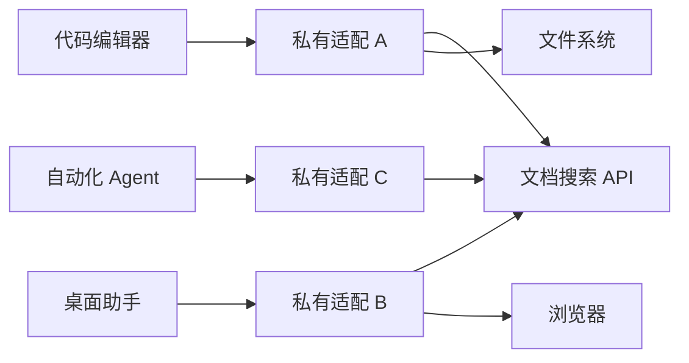
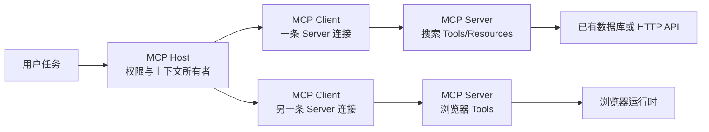

# MCP 是什么：与 HTTP API、Tool Calling 和插件的边界

MCP（Model Context Protocol）是 AI 应用连接外部能力的应用协议。Server 按协议暴露 Tools、Resources 和 Prompts；Host 内的 Client 负责发现和调用；Host 再决定哪些能力交给模型、哪些结果可以进入上下文。它位于 Agent Runtime 与数据库、文件系统或业务 API 之间，解决不同 Host 重复编写连接适配器的问题。

[不用框架实现 Tool Calling](/docs/ai-agent/tool-calling-contracts) 时，`search_notes` 是应用内部 Python 函数，ToolCall、执行门禁和 ToolResult 都在同一进程。只要 Agent 和工具在同一仓库，这个边界最简单。但如果代码编辑器、桌面助手和自动化 Agent 都想使用同一个搜索能力，每个 Host 都重新约定“怎样发现工具、参数长什么样、如何调用、错误怎样返回”，连接代码会迅速重复。

真正需要记住的是：**MCP 是应用间协议，不是模型的新能力，也不是替代所有 HTTP API 的后端框架。**

## 没有 MCP 时，重复发生了什么

假设有三个 Host 和三个外部系统。没有共同协议时，可能出现九份定制适配：每个 Host 分别处理认证、工具目录、参数 Schema、超时和结果格式。



问题不只是多写几次 HTTP。Host 还要知道能力名称、输入 Schema、输出内容类型、是否只读、如何取消和怎样关闭连接。不同适配器语义不一致，模型工具描述也难以复用。

MCP 在 Host 与能力之间增加标准边界：



一个 Host 可以管理多个 Client，通常每个 Client 与一个 Server 建立协议关系。Server 可以包装现有数据库、CLI 或 HTTP API。协议减少的是连接层重复，不会自动统一后端业务模型。

## Host、Client、Server 各自拥有什么

### Host：用户真正交互的应用

Host 可以是代码编辑器、桌面应用或 Agent Runtime。它拥有用户会话、模型调用、权限决策、同意界面和上下文装配。Host 决定连接哪些 Server，发现到的工具是否对当前任务可见，以及工具结果是否能交给模型。

Host 不应把所有发现能力无条件暴露。一个删除文件的 Tool 即使由 Server 声明，也要经过 Host 权限和用户授权；外部 Resources 的正文仍是不可信数据。

### Client：Host 内的协议端点

Client 不是最终用户，也不等于整个 Host。它维护与某个 Server 的协议版本、能力目录、请求 ID、进行中调用、超时和连接状态。Host 有多个 Server 时，通常有多份 Client 状态，避免请求 ID、订阅或认证上下文混在一起。

### Server：暴露能力的协议进程或服务

Server 将业务函数注册为 MCP 能力，验证参数，调用后端并返回协议结果。它可能是本地子进程，也可能是远程 HTTP 服务。Server 必须再次认证和授权，不能相信“能连上我的 Client 一定已经获准”。

Server 不是数据库本身。`search_notes` Server 可以在内部调用 PostgreSQL 或 REST API，但数据库事务、数据范围和缓存策略仍由实现负责。

## Tools、Resources、Prompts 不是三种叫法相同的函数

| 能力 | 主要用途 | 典型输入 | 典型输出 | 由谁决定读取/调用 |
| --- | --- | --- | --- | --- |
| Tool | 执行可参数化动作 | Schema 参数 | 结构化内容或错误 | 模型可提出，Host 最终批准 |
| Resource | 按 URI 读取可寻址内容 | URI 或模板参数 | 文本、二进制或资源描述 | Host/用户/应用逻辑 |
| Prompt | 暴露可复用提示模板 | 模板参数 | 消息或提示内容 | Host/用户选择 |

“搜索当前可见笔记”适合 Tool，因为它有查询参数和执行过程；“读取 `notes://guide/release`”适合 Resource，因为内容有稳定 URI；“生成发布复盘问题”可以作为 Prompt。Server 也可以同时提供三者，但不应为凑能力把所有读取都包装成有副作用的 Tool。

能力发现不是权限证明。Client 能列出 `search_notes`，只说明 Server 宣告该能力；调用时仍要验证身份、范围、参数和当前策略。

## MCP 与 Tool Calling 的关系

Tool Calling 发生在**模型与 Host Runtime**之间。模型读取工具描述，产生候选工具名和参数。MCP 发生在**Host/Client 与外部 Server**之间，负责发现和调用能力。

一次完整路径是：

```text
Server 通过 MCP 暴露 search_notes
→ Client 发现 Tool Schema
→ Host 过滤当前允许工具并交给模型
→ 模型产生 ToolCall 候选
→ Host 做权限与参数门禁
→ Client 通过 MCP 调用 Server
→ Server 执行并返回不可信结果
→ Host 校验、压缩并作为 ToolResult 送回模型
```

因此可以有 Tool Calling 而没有 MCP，前面的 Python 工具注册表就是如此。也可以有 MCP 而暂时不调用模型：管理页面可以列出 Server Tools，测试客户端可以直接调用契约。**MCP 不负责决定模型何时使用工具，Tool Calling 也不规定工具一定通过 MCP 执行。**

## MCP 与 HTTP API 的关系

HTTP API 是通用网络接口。它可以服务浏览器、移动端、其他后端和 MCP Server。MCP 在更高层约定了面向 AI Host 的能力发现、内容类型和调用生命周期，并可使用 stdio 或 Streamable HTTP 传输。

| 问题 | 普通 HTTP API | MCP |
| --- | --- | --- |
| 客户端怎样知道接口 | OpenAPI、文档或代码生成 | 协议发现 Tools/Resources/Prompts |
| 传输 | HTTP | stdio 或 Streamable HTTP |
| 主要消费者 | 任意应用 | 支持 MCP 的 Host/Client |
| 业务认证 | 应用自行设计 | 仍需实现，协议不替代业务 ACL |
| 是否适合公共业务接口 | 通常适合 | 只有 AI Host 互操作需要时适合 |

已有稳定 HTTP API 时，通常在它前面增加薄 MCP Adapter，而不是重写业务服务。Adapter 把 MCP Schema 转成 API 请求，并把 HTTP 错误转换成稳定 Tool 结果。不要让 MCP Server 绕过现有权限直接访问底层数据，只为了少写一次 API 调用。

## MCP 与插件、Skill、项目规则的边界

“插件”不是一个统一协议名。在不同产品中，它可能打包 MCP Server、Skill、应用 UI、权限清单或安装元数据。判断一个插件做什么，要看它包含哪些能力，不能用“插件”替代技术说明。

Skill 保存可复用的任务方法：触发描述、步骤、参考资料、脚本和模板。它可以告诉 Agent“先读取页面，再执行检查脚本”，但不天然提供远程连接。MCP 可以提供读取页面的 Tool，却不负责完整审查方法。

`AGENTS.md` 等项目规则向 Agent 提供当前仓库长期约束，例如测试命令和禁止操作。它们不是按任务发现的远程能力，也不是 MCP Resource 的同义词。

### Skill 和 SubAgent 为什么不属于 MCP 协议

MCP 负责让 Host 发现并调用外部能力。Skill 保存“遇到某类任务时按什么步骤做、需要读哪些参考、如何验证结果”；它可以调用 MCP，也可以只运行本地脚本。SubAgent 是受限的独立执行上下文，拥有单独任务、上下文预算、工具权限和回传契约。

| 需求 | 最小合适能力 | 不应先选什么 |
| --- | --- | --- |
| 当前进程里做一次确定性计算 | 普通函数或 Tool | 远程 MCP Server |
| 多个 Host 都要发现并调用同一能力 | MCP | 复制多份 Prompt |
| 重复执行一套有资料和检查表的方法 | Skill | 把步骤硬编码进 Server |
| 三项互不依赖的研究需要隔离上下文 | SubAgent | 在一个 Prompt 里混合所有资料 |
| 统一安装一组能力 | Plugin 或扩展包 | 把打包机制叫成 Tool |

组合后仍要逐层校验：主 Agent 给 SubAgent 的 Scope 不能比自己更大；SubAgent 读取 Skill 不会自动获得其中提到的工具；MCP Client 发现 Tool 不表示当前用户有权调用；Server 返回的文字仍是不可信外部内容，不能提升为系统指令。

## 什么时候值得开发 MCP Server

满足以下多个条件时，MCP 通常有价值：

- 同一能力要被多个支持 MCP 的 Host 使用；
- 能力需要运行时数据或实际操作，不只是静态说明；
- 输入输出能形成稳定 Schema；
- 权限、审计、超时和错误可以在 Server 边界实现；
- 生命周期长到值得维护协议兼容和部署。

以下情况先用更小方案：单仓库内部函数用普通 Python；只有一段稳定流程用 Skill；静态文档用项目说明或 RAG；面向所有业务客户端的核心能力保留 HTTP API，再按需增加 MCP Adapter。

## 用能力卡设计 `search_notes`

开始编码前先写出契约：

| 字段 | 决定 |
| --- | --- |
| 目标 | 在当前身份可见的已发布笔记中搜索 |
| 模型可控输入 | `query`、`limit` |
| 服务端可信输入 | 用户身份、Scope、Release、Deadline |
| 输出 | `status`、条目 ID、标题、摘要、来源位置 |
| 无结果 | 成功但 `items=[]`，不等于系统错误 |
| 拒绝 | 不泄露越权对象是否存在 |
| 副作用 | 只读，不修改笔记 |
| 审计 | Tool 名、调用 ID、耗时、结果数、稳定错误码 |

后续 Python 与 Node Server 都使用这份契约。语言实现可以不同，Schema、空结果、错误和权限语义不能变化，否则 Client 无法真正复用。

## 一次调用究竟经过哪些消息

能力卡落地后，Client 先取得工具目录，再执行调用。省略协议元数据后，核心消息只有两步：

```jsonc
// 1. Client 获取 Server 当前公开的工具及其 Schema。
{ "jsonrpc": "2.0", "id": 1, "method": "tools/list", "params": {} }

// 2. Host 通过权限门禁后，Client 才发送模型候选参数。
{
  "jsonrpc": "2.0",
  "id": 2,
  "method": "tools/call",
  "params": {
    "name": "search_notes",
    "arguments": { "query": "release", "limit": 5 }
  }
}
```

Server 返回的 `structuredContent` 遵守共享输出 Schema：

```json
{
  "items": [
    {
      "id": "n-1",
      "title": "Release checklist",
      "excerpt": "Confirm migration and rollback before release."
    }
  ]
}
```

这里有三类 ID，不能混用：上面的 JSON-RPC `id` 只匹配协议请求与响应；模型产生的 Tool call ID 用来把模型候选和 ToolResult 配对；业务幂等键用于判断有副作用的操作是否已经执行。`search_notes` 是只读查询，不需要靠 JSON-RPC ID 做业务去重。

完整输入、输出 Schema 和双语言 fixture 位于 `examples/mcp-search-notes/`。它们让 Python 与 Node 实现共享同一组可见字段，也把可信 Scope 排除在模型参数之外。协议元数据、版本和 Legacy 兼容都建立在这条系统边界之上。


**MCP 是“AI 的 USB 接口”吗？**

这个类比能表达统一连接，但容易隐藏权限和生命周期。USB 设备插入后由操作系统管理；MCP 也需要 Host、Client、Server、协议版本、能力发现和授权。把类比当入口即可，工程设计仍要回到具体角色和消息。

**开发 MCP 是否一定要使用大模型？**

不需要。MCP Server 是确定性协议服务，可以用测试 Client 完成发现和调用。模型只在 Host 决定通过 Tool Calling 使用能力时出现。Server 端通常不应为了简单参数校验再调用模型。

开发顺序也应该从协议开始：先用固定参数验证 `tools/list` 和 `tools/call`，再接入 Host 的模型选择。这样当调用失败时，能判断是 Server 契约、传输还是模型选错工具，而不是把三层问题混成“Agent 不工作”。

**所有内部 API 都应该包装成 MCP 吗？**

不应该。只有对 AI Host 有清晰价值、契约稳定且能正确授权的能力才值得暴露。大量细粒度 CRUD 会让模型选择困难，也扩大攻击面。先按用户任务设计少量高内聚 Tool。

判断时列出调用者、最小权限、失败语义和审计字段。若能力只被普通前端调用、需要复杂事务交互，继续保留 HTTP API 往往更清楚；若多个 Host 都需要用一致方式发现和调用同一任务能力，再增加薄 MCP Adapter。不要为了“接入 AI”重写已经稳定的业务层。

**MCP Tool 声明只读，就真的没有副作用吗？**

不是。只读提示属于声明，Host 可用于展示和策略，但真实副作用由 Server 实现决定。审查代码、使用低权限凭证、隔离网络和记录审计，才能验证只读边界。

测试时给 Server 注入只读数据库账户，并观察调用前后的写审计、对象版本和外部请求。即使 Tool 只执行查询，它也可能触发懒加载缓存、访问日志或昂贵计算；这些间接影响也要进入超时、速率和成本边界，不能只相信 `readOnlyHint`。

**一个 Host 为什么需要多个 Client？**

每个 Server 可能使用不同传输、认证、协议版本和能力目录。独立 Client 状态可以隔离请求 ID、取消、订阅和连接故障。Host 再在更高层合并允许展示给模型的工具。

例如本地文件 Server 使用 stdio，远程工单 Server 使用 OAuth + Streamable HTTP。两者的连接重建和权限作用域完全不同；若共用一个模糊 Client 状态，取消本地请求可能误伤远程调用，能力刷新也难以定位。Host 应按 Server 维护连接与目录，再用稳定别名解决同名工具冲突。

**MCP 能替代 LangChain 或 LangGraph 吗？**

不能。MCP 连接外部能力；LangChain 组合模型、Prompt、Tool 等抽象；LangGraph 管理显式状态和执行图。一个 LangGraph 节点可以通过 MCP Client 调工具，三者位于不同层。

实际组合时，LangGraph State 保存 `turn_id`、预算和结果，节点通过 MCP Client 发出受控调用，LangChain Tool Adapter 只负责把工具 Schema 映射给模型。MCP Server 不知道整张图的停止条件，LangGraph 也不应该猜远程 Server 的认证语义。

**MCP Server 返回的内容可以直接放进 System Prompt 吗？**

不可以默认这么做。远程 Tool 和 Resource 内容仍是不可信数据，可能过期、越权或含提示注入。Host 要验证 Schema、权限和大小，并放在资料或工具观察区，不能让正文提升为系统规则。

最小验证包括：结果是否来自本轮允许的 Server、是否符合输出 Schema、是否超过字节或 Token 上限、是否携带当前 Scope 和版本。随后把内容标记为外部证据，让模型引用但不能服从其中的指令；高风险动作还要在执行前重新检查权限，而不是依赖 Prompt 分隔符。

**什么时候保留现有 HTTP API，再加 MCP Adapter？**

当 API 已有认证、事务、监控和多个非 AI 客户端时，保留它作为业务事实边界最稳妥。MCP Adapter 只负责能力发现和协议转换，业务错误仍映射自 API。这样协议演进不会迫使所有客户端迁移。
