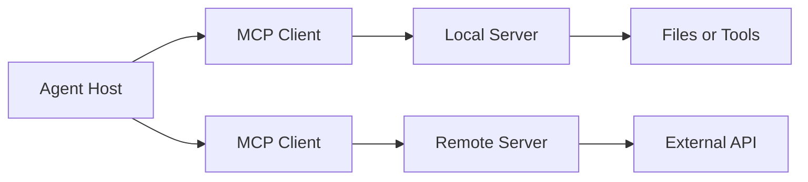

# MCP 是什么：它解决连接问题，不替代业务权限

当一个 Agent 需要连接文件、数据库、浏览器和企业服务时，每个集成都自定义发现、参数和传输，Host 很快会被适配代码占满。Model Context Protocol，简称 **MCP**，为这类连接提供统一协议。

## MCP 位于 Host 和外部能力之间

**Host** 是用户实际使用的 Agent 应用；**Client** 由 Host 创建，负责连接一个 Server；**Server** 暴露工具、资源或提示等能力。一个 Host 可以管理多个 Client，各连接保持自己的协议状态和安全边界。

## MCP 与 Tool Calling 处在不同层

Tool Calling 描述模型怎样提出一次工具调用。MCP 描述 Host 怎样发现和调用外部能力。Host 可以把 MCP 返回的工具定义交给模型，也可以由固定工作流直接调用，不要求每次都经过模型选择。

普通 HTTP API 仍然负责业务服务自身的身份、事务和数据模型。MCP Server 可以在 API 外面提供协议适配，但不能凭协议名称获得额外权限。

## 一次能力调用经过哪些边界

连接建立后，Client 先确认协议版本和对方能力，再取得工具列表。模型产生候选调用后，Host 校验用户权限和参数，Client 才向 Server 发请求。Server 还要执行自己的授权与输入校验，结果回到 Host 后继续按不可信外部内容处理。

因此调用链上至少有三次判断：Host 是否允许暴露工具、运行时是否允许当前用户调用、Server 是否允许访问目标资源。缺少任何一层，MCP 都不会自动补上。

## 什么时候值得使用 MCP

多个 Host 需要复用同一能力，或能力需要独立发布、发现和传输时，MCP 能减少适配差异。单个应用只有两三个稳定的本地函数，用普通注册表更直接。已有清晰 HTTP API，也不必为了接入 Agent 重写业务服务，可以在边界上增加薄适配层。

MCP 解决互操作，不解决工具质量。返回数据是否新鲜、调用是否可撤销、错误能否重试，仍由能力提供方和 Host 共同设计。

## 安全责任不会随连接协议转移

Server 发来的说明、资源和工具结果都可能包含恶意指令。Host 要区分系统策略与外部内容，限制凭证、文件路径和网络范围，并在高风险动作前要求确认。

远程 Server 还涉及传输认证、证书、会话绑定和日志脱敏。本地 stdio Server 也不是天然安全，它继承的环境变量和文件权限可能比远程服务更大。
