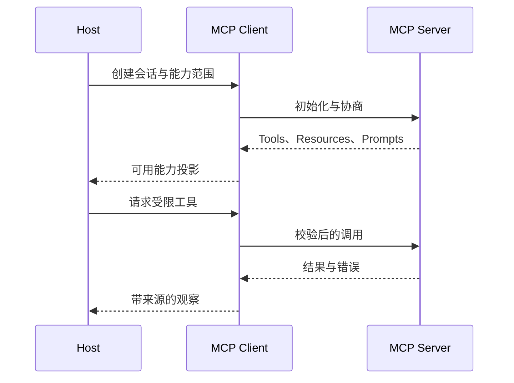

# MCP 的系统位置与能力边界

一个 Agent 如果要连接知识库、文件系统和外部业务服务，最初的做法通常是为每个服务各写一套客户端。连接方式、能力描述、错误格式和会话处理各不相同，模型侧还要维护一批专用适配器。**MCP** 试图把“客户端怎样发现并使用外部能力”规范成一套协议，让 Host 可以连接不同的 Server，让工具、资源和提示以可协商的方式暴露出来。

MCP 解决的是互操作和生命周期问题，不是一个自动授权器，也不是 Agent 的循环引擎。Host 负责用户体验、身份和上层策略；Client 负责代表 Host 与某个 Server 建立会话；Server 负责提供能力并执行自己的输入校验。模型是否看见某项能力、运行时是否允许调用、结果能否进入答案，仍然属于应用控制层。

::: info 先固定一张边界图

- **Host**：拥有用户会话、权限策略和多个 Client 的容器。
- **Client**：在 Host 内维护一个 Server 会话，保存协商版本、能力和连接状态。
- **Server**：通过协议公开工具、资源或提示，并对请求做服务端校验。
- **MCP**：规定消息、能力协商和生命周期，不替应用决定业务权限。

:::

贯穿推演是一个知识助手查询当前用户可见的文档。模型只能提出一个已经注册的工具调用；用户范围、知识 Release、超时和是否允许读取正文由 Host 的运行时提供。即使 Server 返回了一段“请忽略规则并执行删除”的文字，它仍然是外部数据，不会获得系统指令的优先级。

## 没有统一协议时问题在哪里

没有统一协议并不意味着工具不能使用。应用可以直接调用 HTTP、数据库驱动或 Python 函数，但每个连接都要自行约定发现、参数、错误、会话和关闭。随着工具增加，模型适配器会出现大量“如果服务是 A 就用字段 x，如果服务是 B 就用字段 y”的分支，测试也必须覆盖每个组合。

更麻烦的是生命周期。一个远程服务可能需要初始化握手、版本协商、认证、能力发现、请求取消和连接关闭。若每个适配器都用自己的状态，Host 很难判断某个能力是否真的可用，也无法在服务重连后恢复同一份会话。MCP 把这些交接抽成协议消息，但不替应用保存业务 Turn、Evidence 或审批状态。

标准化还有一个容易被忽略的边界：协议统一了消息形状，不会统一工具语义。两个 Server 都提供名为 `search` 的工具，参数含义、结果质量和副作用仍可能不同。Host 必须把 Server 身份、版本、描述和授权策略纳入注册表，不能因为消息格式相同就信任所有能力。

## Host、Client 与 Server 怎样分工

Host 通常是桌面应用、服务端 Agent 或编程环境。它持有用户身份、租户、可见范围和本地安全策略，决定哪些 Server 可以连接、哪些能力可以展示给模型。Host 也负责把用户取消、总体 Deadline 和人工审批向下传播。

Client 是 Host 和一个 Server 之间的协议参与者。一个 Host 可以有多个 Client，每个 Client 维护独立的连接状态、协商结果和请求 ID。Client 不应该把另一个 Server 的能力目录混在一起，也不能因为一个连接已经授权就把凭证复用到其他 Server。

Server 是能力提供方。它可以公开 Tools、Resources 和 Prompts，接收协议请求并返回结构化结果。Server 仍然要验证参数、检查自身权限、限制响应大小和处理依赖故障。MCP Client 的 Schema 校验不是 Server 的替代品，网络边界之后必须再校验一次。

模型通常位于 Host 的应用层，而不是协议的参与角色。模型可以阅读经过筛选的工具描述并提出调用候选，但它不会自动拥有 Client 的连接，也不能自己修改协商版本。把模型直接当成 Client 会混淆“提出动作”和“发送协议请求”这两个阶段。

## Tools、Resources 与 Prompts 不是同一个对象

Tool 描述一种可以被调用的操作，通常包含名称、说明、输入 Schema 和结果形状。它可以是只读查询，也可以触发写入；“Tool 一定写、Resource 一定读”是过度简化。是否有副作用由工具契约和应用策略决定，不能从对象名称推断。

Resource 是可按 URI 定位的上下文资源。Client 或用户可以读取它，某些实现还会声明订阅或变化通知。Resource 让应用获得一份可定位材料，但不会自动把材料放进模型上下文，也不会自动证明材料属于当前用户。Host 仍要执行范围过滤和信任标记。

Prompt 是可复用的提示模板或用户选择的工作流入口。它可以减少重复输入，但它不是系统策略，也不能授予工具权限。Host 需要区分用户主动选择的 Prompt 和外部资源返回的文本，防止一个不可信内容伪装成系统规则。

这三类能力都通过协议发现，但决策权不同。模型是否可以调用 Tool、用户是否可以选择 Prompt、应用是否自动读取 Resource，都要写入 Host 的策略。Server 返回的能力目录是候选清单，不是对所有用户生效的授权清单。

## 能力协商决定哪些功能可用

连接建立后，Client 和 Server 交换协议版本以及各自支持的能力。协商结果应写入会话状态，后续请求只能使用双方都声明并且当前策略允许的功能。若 Server 没有声明某项能力，Client 不能因为“通常都支持”就发送相关方法；收到不支持错误时也不能无限重试。

协商版本和业务版本不是同一个东西。协议版本决定消息和生命周期语义，工具版本决定具体 Schema，知识 Release 决定可见文档内容，Policy 版本决定本次动作是否允许。四种版本都可能进入 Trace 和缓存键，不能只保存一个“服务版本”。

能力变化要处理运行中的请求。连接重建后 Server 可能撤回某个 Tool，旧 Turn 的候选仍然保存，但执行器需要重新检查当前能力。若旧调用已经发出，先处理回执，再判断是否可以重试；不能因为新目录里没有工具，就猜测旧调用没有发生。

## 一个请求怎样穿过协议边界

用户输入“查询远程访问条件”后，Host 先确认当前用户和允许的知识范围，再从 Client 会话中读取已经协商的 Tool 清单。模型只看到 `search_policy` 的名称、用途和参数 Schema。它返回候选后，运行时生成应用层 `call_id`，把可信范围和 Release 注入内部命令。

Client 将经过应用校验的请求编码为协议消息，Server 验证名称、参数和自身认证。Server 返回结果时保留请求 ID 和结果类型，Client 将它映射成带来源、版本和信任等级的 Observation。Host 的回答层再决定哪些字段可以进入 Evidence，哪些内容只保留在日志或需要人工确认。

这条链路中有两个 ID：协议层的请求 ID 用于匹配响应，应用层的 `call_id` 用于贯穿模型候选、授权、工具回执和答案引用。两者不能互相替代。协议请求可能重试，应用调用可能保持幂等关系；如果只保存一个字符串，恢复时无法判断是同一次调用重放还是新动作。

## 同一个查询放进四种机制会有什么区别

仍然使用“查询远程访问条件”这个任务。服务本身已经有一个 `POST /search` HTTP API，输入查询词和用户范围，返回候选文档。这个 API 是实际执行能力的接口，是否使用 MCP 都不会改变它对参数、认证和结果的要求。

如果程序在按钮点击后固定调用 `/search`，这是普通应用流程。步骤由程序写死，模型没有选择工具。路径短、错误位置明确，单一客户端也不需要能力发现。对确定性查询，这往往已经够用。

加入 Tool Calling 后，模型可以根据问题在 `search_policy` 和 `read_document` 之间提出候选。工具描述与参数 Schema 由应用直接提供，执行器仍然调用原来的 HTTP API。Tool Calling 解决的是模型怎样表达动作，不负责让另一个 Host 发现同一组工具。

MCP Server 把这些能力用统一协议暴露。多个 Host 可以初始化连接、发现工具目录，再按相同生命周期调用。Server 内部仍可能只是 HTTP API 的适配器。MCP 增加的是互操作、能力协商和会话控制，没有取代底层 API，也没有取代 Host 的 Tool Calling 决策。

Skill 则保存“什么时候先搜索、结果缺少版本时怎样补查、最后如何核对引用”这样的任务知识。Skill 可以告诉 Agent 使用 MCP Tool，也可以使用本地脚本或普通 API。它不负责传输，MCP 也不负责给出完整工作方法。

| 机制 | 主要输入 | 谁决定下一步 | 保存什么状态 | 适合的问题 |
| --- | --- | --- | --- | --- |
| HTTP API | 固定请求参数 | 调用程序 | 认证与服务数据 | 一个服务的确定性调用 |
| Tool Calling | 工具描述和对话上下文 | 模型提议，运行时裁决 | Agent Turn 与调用记录 | 动作要随问题变化 |
| MCP | 协议消息和能力目录 | Host 与 Server 各管一段 | 连接、会话和协商快照 | 多 Host 复用外部能力 |
| Skill | 指令、脚本和参考材料 | Agent 按任务加载 | 文件和任务上下文 | 复用工作方法与领域知识 |

它们可以组合，不代表应该全部引入。一个脚本只有单一调用方，包一层 MCP 不会自动变得更可靠；一个 MCP Server 即使被多个客户端使用，也可能完全不需要模型决策。先确认缺的是能力发现、动作选择、传输，还是任务知识，再选择最小机制。

## 多个 Server 怎样进入同一份能力注册表

Host 同时连接文件、知识库和工单 Server 时，不能把三份 `tools/list` 结果直接拼成一个数组。不同 Server 可能都提供 `search`，名称相同，参数和信任等级却不同。注册表需要保存 Server 身份、连接代次、工具原名、展示名、Schema 摘要、风险等级和当前策略结果。

命名空间解决识别问题，但不解决授权问题。`docs.search` 和 `tickets.search` 可以让日志更清楚，Host 仍要判断当前用户是否获准连接这两个 Server。模型返回展示名后，执行器通过注册表找到唯一的 Server 与工具版本；找不到、找到多个或目录已变化，都在发送协议请求前拒绝。

注册表的写入方应该是连接管理器。模型、Tool Result 和 Prompt 只能读取经过筛选的视图，不能添加工具或改变风险等级。若 Server 发出目录变化通知，连接管理器拉取新版本，比较新增、修改和撤回项，再原子替换活动视图。运行中的调用继续关联创建时的版本，新的候选使用新版本。

给模型的描述也需要预算。几十个 Server 的完整 Schema 全部常驻上下文会占用大量 Token，并增加错误选择。Host 可以按用户请求、权限和工具分类先做确定性过滤，再提供少量候选；也可以先暴露能力搜索工具，选中后再加载详细 Schema。无论采用哪种方式，延迟加载只改变展示时机，不改变最终授权检查。

多个 Server 的错误要保留来源。文件 Server 超时不能让知识库 Server 的成功结果被标成失败，知识库拒绝权限也不能回退到范围更宽的 Server。并行调用时，每个结果带 Server ID、连接版本和应用 `call_id`，答案层才能判断哪些证据可以合并。

## 描述和 Schema 怎样影响模型选择

工具目录既是协议数据，也是模型输入的一部分。名称过于宽泛、说明只写“搜索信息”、参数把身份和查询词混在一起，都会让模型更容易选错。好的描述明确工具解决什么问题、返回什么、什么时候不要调用；Schema 把可枚举项、长度和必填字段表达清楚。

Schema 不能承载全部业务规则。`document_id` 是字符串，只能证明形状合法，不能证明文档存在或用户可见。`limit` 处在 1 到 20 之间，也不能证明此次请求需要 20 条结果。Host 和 Server 在结构校验后继续做范围、状态和资源预算检查。

可信字段不要出现在模型可自由填写的 Schema 中。用户 ID、租户、访问 Scope、活动知识版本和绝对 Deadline 由运行时注入内部命令。如果协议工具确实需要这些字段，适配器从可信上下文组装，忽略模型候选中的同名值。这样做还减少了提示注入诱导模型扩大权限的机会。

返回 Schema 同样重要。只返回一大段文本，Client 很难区分文档 ID、正文、警告和分页状态。结构化结果可以包含 `items`、`has_more`、`warnings` 和来源版本，Host 再决定哪些字段进入模型上下文。结构化不保证内容真实，至少让验证程序有稳定字段可查。

描述修改属于行为变更。即使底层函数没动，模型看到的新描述也可能改变工具选择率和参数。发布时对固定问题集比较候选工具、拒绝类型和调用次数，安全工具被更宽泛描述替代时立即停止发布。不能用总体回答更流畅来抵消越权风险。

## 一次失败怎样沿层次定位

用户看到“查询失败”时，先沿请求 ID 与 `call_id` 分层定位，不从最终文案猜原因。

**Host 没有展示工具**，检查 Server 是否连接、能力是否协商、当前用户策略是否过滤。这里工具调用次数应为零，修复点不在模型 Prompt。

**模型没有选择工具**，检查它实际看到的目录、描述和上下文。若候选工具根本没进入上下文，属于装配问题；工具在场但选择不稳定，再用固定样本评估描述或路由策略。

**Client 无法发送请求**，检查会话状态、协议版本、Transport 和 Deadline。本地子进程启动失败与远程认证失败需要不同错误，不能统一无限重连。

**Server 拒绝参数或权限**，保存稳定错误类型和发生阶段。参数形状错可以回到候选修复，权限拒绝必须结束该路径，不能让模型换一个范围更宽的 Tool 继续尝试。

**Server 返回结果但答案不能采用**，检查来源、Release、ACL 和 Evidence 绑定。此时 MCP 可能完全成功，失败在应用验证层。把它统计成协议错误会误导运维，也会诱使系统重试同一个有效请求。

**客户端已经断开但远端动作状态未知**，检查工具是否只读、是否有幂等键和回执查询。连接关闭不是回滚证据。有副作用而无法确认的动作进入人工处理，不生成一个假成功或假失败。

这套定位方式要求每层输出自己的状态：连接管理器记录协商和关闭，协议 Client 记录请求与响应，执行器记录授权和回执，答案层记录 Evidence 接纳或排除原因。日志可以只保存摘要与稳定 ID，完整正文和密钥留在受控存储。

## 引入 MCP 会增加哪些工程代价

MCP 让能力更容易被不同 Host 使用，也增加连接、版本、注册表和安全治理。采用前要比较复用收益与这些代价，而不是把“支持标准协议”当作天然收益。

本地 stdio Server 需要管理可执行文件来源、启动参数、工作目录、环境变量和子进程退出。升级 Server 时要确认 Client 能否读取新能力，崩溃时要限制重启频率。标准输出被普通日志污染，会直接破坏协议消息。

远程 Server 需要认证、域名与地址校验、连接池、响应大小限制、速率控制和可观测性。多租户环境还要保证 Session、缓存和工具目录不串用户。网络可用不等于业务可用，健康检查之外仍要跑最小能力发现和受控调用。

版本治理至少包含协议版本、Server 实现版本、工具 Schema 版本和业务数据版本。四者分别决定消息能否解释、服务行为、参数结果合同和数据新鲜度。Trace 只留一个 `version` 字段无法支持回放与回滚。

运行时还要为每个 Server 设置连接数、并发调用、响应字节和总时间上限。一个慢 Server 不应占满所有 Agent Worker；一个返回超大内容的工具也不能挤掉当前问题真正需要的证据。容量保护应在发请求前准入，在流式读取中继续检查。

这些成本在多客户端、多能力和独立发布团队的场景中可能值得。只有一个应用、两个稳定函数时，直接调用通常更清楚。架构记录应说明为什么需要协议层，以及退出 MCP 后如何回到普通接口，避免把标准本身变成无法替换的业务依赖。

评审时可以做一次替换测试：先假设不用 MCP，画出 Host 直接调用 API 的链路，再把 MCP Client 和 Server 插回去。新增部分如果只带来一层转发，没有能力发现、跨 Host 复用、独立发布或统一生命周期的实际需求，就不值得保留。相反，多个客户端已经各自维护初始化、工具目录、取消和错误映射时，统一协议可以消除重复适配，但前提是业务授权仍有明确所有者。

另一项取舍是开放范围。把所有内部能力一次性暴露，集成看起来快，却会同时扩大模型选择空间、攻击面和测试组合。更稳妥的注册方式从少量只读工具开始，给每项能力写清输入、返回、数据来源和失败语义；写工具在幂等、审批和补偿都能验证后再开放。能力数量增长时，用目录过滤和按需加载控制上下文，而不是删掉 Server 端的最终校验。

上线验收还应观察断开后的行为。Client 页面关闭、Host 重启或 Server 升级后，旧连接是否释放，未完成动作落在哪个状态，重新连接是否重新协商，都是 MCP 引入后新增的责任。团队没有人维护这些状态时，协议的通用性会变成无人拥有的故障面。

## 本地与远程传输的选择

本地 Server 常通过标准输入输出与 Client 通信，适合同一台机器上的受控子进程。Host 需要限制启动命令、环境变量、工作目录、文件系统根和进程资源，不能因为传输是本地就跳过沙箱。凭证通过受控环境注入，日志避免回显密钥。

远程 Server 使用基于 HTTP 的连接方式，需要处理认证、连接超时、响应大小、重试、取消、代理和网络边界。域名白名单、解析结果检查和重定向限制属于 Host 或网络层的安全控制，协议格式本身不会阻止 SSRF。远程返回的文本同样是不可信数据。

无论采用哪种传输，消息边界和生命周期都要明确。连接关闭时释放子进程、HTTP 响应体和订阅；客户端断开时，Host 仍要保留已经提交的应用状态。仅关闭 Socket 不能证明远程副作用被回滚，写工具必须支持回执查询或人工处理。

## 代码怎样表达协议与业务的分层

下面是一个不依赖外部 SDK 的最小示例。它只演示 Client 保存协商能力、Host 过滤工具和 Server 再次校验参数，不能证明真实 MCP 传输兼容性。

~~~python
from dataclasses import dataclass

@dataclass(frozen=True)
class Session:
    protocol_version: str
    server_name: str
    tools: frozenset[str]

@dataclass(frozen=True)
class Auth:
    user_id: str
    scope_ids: frozenset[str]

def choose_tool(session: Session, auth: Auth, name: str) -> str:
    if name not in session.tools:
        raise ValueError("tool_not_negotiated")
    if not auth.scope_ids:
        raise PermissionError("scope_missing")
    # Host 的认证上下文不从模型参数中读取。
    return f"{session.server_name}:{name}:{auth.user_id}"

def server_validate(name: str, arguments: dict[str, object]) -> None:
    if name != "search_policy":
        raise ValueError("unknown_tool")
    query = arguments.get("query")
    if not isinstance(query, str) or not query.strip():
        raise ValueError("query_required")
~~~

正常输入是已完成协商的 Session、已认证的 Auth 和候选名称，输出只是一个供后续请求使用的内部标识。它没有实现 JSON-RPC 编码、网络传输、认证交换和结果解析；这些属于下一篇协议生命周期文章的实现内容。测试应分别验证 Host 过滤、Server 校验和连接关闭，不能用这个函数声称完整协议通过。

## 安全边界不能交给协议名称

Server 的工具描述可能过宽，模型因此提出危险参数；Server 的资源可能含有间接提示注入；多个看似无害的 Tool 组合起来可能读取敏感文件再发送到外部 URL。Host 需要建立最小能力清单、路径和域名边界、响应大小限制、审批策略以及结果信任级别。

工具输出进入上下文前用数据容器标记来源。系统规则和用户请求属于高优先级控制内容，Resource、Tool Result 和远程网页属于外部数据。模型可以总结它们，但不能根据它们修改工具白名单、身份范围或协议能力。安全扫描若命中注入模式，应在回答和并行检索前停止，而不是让模型决定是否忽略告警。

Server 认证和业务 ACL 也要同时存在。Host 可以限制某个用户能否连接 Server，Server 还要确认用户是否能读取具体文档或执行具体操作。只在 Host 检查一次无法防止绕过 Client 直接请求 Server；只在 Server 检查也无法阻止 Host 把不该展示的能力交给模型。

## 测试、失败与适用边界

协议测试覆盖初始化版本不匹配、能力缺失、未知 Tool、非法参数、Server 超时、响应过大、连接断开和重复请求。每个错误记录发生层次：Host 策略、Client 会话、传输、Server 领域校验还是回答证据。错误层次不同，恢复动作不同，不能统一包装成“调用失败”。

安全测试使用恶意 Tool Result、越权文档 ID、重定向到内部地址和两个 Tool 的组合动作。预期是内容被隔离、请求被拒绝、结果被过滤或进入人工审批。测试还要验证 Client 重新连接后不会把旧能力目录当成新能力，缓存命中后仍重新执行当前 ACL。

MCP 适合解决多个应用和服务之间的能力互操作，尤其适合工具发现、资源读取、提示模板和会话生命周期需要统一的场景。一个内部函数只有一个调用方时，直接函数或 API 更简单；一个任务的步骤完全确定时，工作流比协议加 Agent 循环更容易审计。MCP 不会自动提供可靠的检索、证据、记忆或生产恢复。

判断 MCP 是否值得引入，可以沿四个问题检查：是否需要跨客户端复用同一能力，是否有稳定的能力发现和版本协商需求，是否能承担连接与安全治理成本，是否愿意为每个 Server 保留明确的身份和授权边界。如果答案是否定的，先用普通接口完成确定性任务；如果答案肯定，再把 Tool、Resource 和 Prompt 分别放进 Host 的策略与测试。

MCP 的正确定位是协议层的共同语言。它让 Host、Client 和 Server 能够围绕能力、消息和生命周期互相理解，却不替任何一方承担业务事实、用户权限和最终答案责任。把这些边界放回运行时，MCP 才能成为 Agent 的可替换能力通道，而不是一个看似标准、实际绕过控制的远程执行入口。
