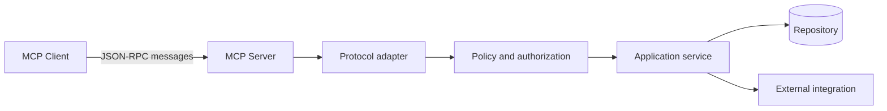
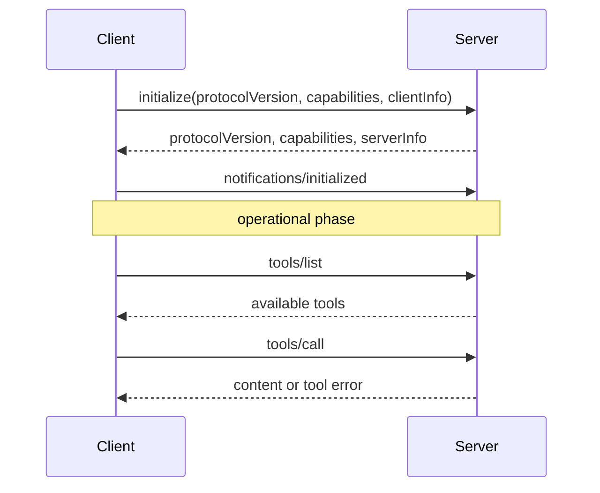
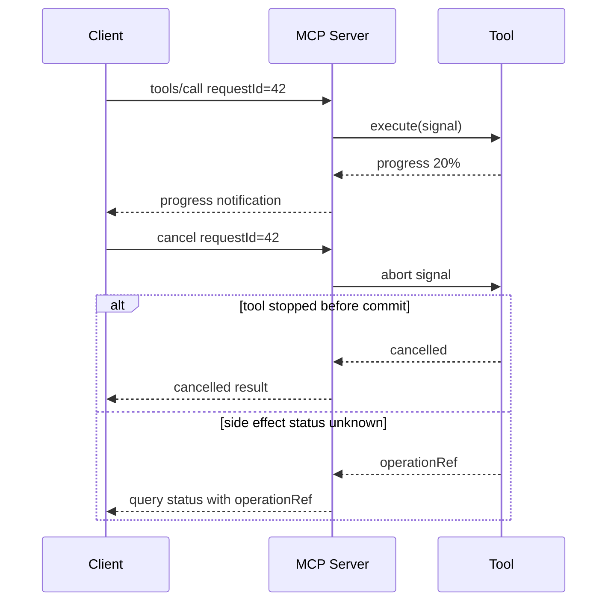

# MCP 协议与连接生命周期

Model Context Protocol（MCP）解决的不是“模型如何变聪明”，而是宿主应用如何用统一协议发现和调用外部能力。它把工具、资源、提示模板等能力从某一个 Agent 框架中解耦出来，使同一个服务可以被不同客户端接入，也使客户端不必为每个外部系统维护一套私有适配协议。

协议标准化不会自动带来安全、可靠或正确。一个能在本机演示的 MCP Server，与能够在多用户、远程网络、长连接和故障环境中运行的服务之间，还隔着连接生命周期、能力协商、授权、幂等、截止时间、取消、输出边界和可观测性。本篇从线上的失败路径反推这些设计。

## 先确定边界：MCP Server 是协议适配层

MCP Server 应负责把已有领域能力映射为协议对象，并处理传输、序列化、错误转换和连接状态。权限、事务、业务不变量和审计仍由领域服务拥有。



如果 Server 直接访问任意数据库表、复制核心权限规则或拼装复杂业务流程，它会成为第二套后端。业务规则修复时，HTTP API 与 MCP 工具可能产生不同结论。更好的做法是让 HTTP、队列消费者和 MCP 工具共同调用应用服务，适配层只转换输入与输出。

## 协议对象不是同一种能力

MCP 常见能力可以按控制权区分：

| 能力 | 谁决定使用 | 适合内容 | 关键风险 |
| --- | --- | --- | --- |
| Tools | 模型或宿主 | 有明确输入输出的操作 | 副作用、越权、重试 |
| Resources | 应用或用户 | 可寻址的上下文数据 | 范围泄露、内容过大 |
| Prompts | 用户或应用 | 参数化交互模板 | 版本漂移、指令边界 |
| Sampling | Server 请求 Client | 借用客户端模型能力 | 循环调用、预算失控 |
| Roots | Client 暴露范围 | 允许服务访问的文件根 | 路径逃逸、权限扩大 |

不要用 Tool 模拟所有对象。一个可读取的规范文档更适合作为 Resource；一个需要用户明确选择的工作模板可以是 Prompt；有副作用的发布行为才是 Tool。对象语义清楚后，客户端才能在 UI、授权和审计上采用不同策略。

## 生命周期从初始化开始

客户端与服务端建立传输后，第一件事不是调用工具，而是完成初始化握手。双方交换协议版本、实现信息和能力声明；客户端确认后再进入正常操作阶段。



服务端不能看到一个 JSON-RPC 请求就假设客户端支持所有能力。版本协商结果应固定到连接状态；后续消息只能使用双方都声明支持的能力。收到不兼容协议版本时，应在初始化阶段明确失败，而不是勉强运行后在某个工具上产生不可理解的错误。

生命周期可以建模为显式状态机：

```ts
type ConnectionState =
  | { phase: 'new' }
  | { phase: 'initializing'; requestId: string }
  | {
      phase: 'ready'
      protocolVersion: string
      clientCapabilities: ReadonlySet<string>
      connectedAt: number
    }
  | { phase: 'closing'; reason: string }
  | { phase: 'closed'; reason: string }

function assertReady(state: ConnectionState): asserts state is Extract<ConnectionState, { phase: 'ready' }> {
  if (state.phase !== 'ready') {
    throw new ProtocolError('CONNECTION_NOT_INITIALIZED')
  }
}
```

显式状态能拒绝重复初始化、初始化前调用和关闭后的迟到消息。把状态散落在几个布尔值中，很容易出现 `initialized=true` 但能力尚未保存，或 transport 已关闭却仍接受任务的问题。

## JSON-RPC 消息关联

MCP 使用 JSON-RPC 风格的请求、响应与通知。请求有 ID，并要求对应响应；通知没有 ID，不期待响应。实现时至少维护进行中请求表，用于关联结果、超时和取消。

```ts
type RequestId = string | number

type PendingRequest = {
  method: string
  startedAt: number
  deadlineAt: number
  abortController: AbortController
}

class RequestRegistry {
  private readonly pending = new Map<RequestId, PendingRequest>()

  claim(id: RequestId, request: PendingRequest): void {
    if (this.pending.has(id)) throw new ProtocolError('DUPLICATE_REQUEST_ID')
    this.pending.set(id, request)
  }

  cancel(id: RequestId, reason = 'cancelled by peer'): boolean {
    const request = this.pending.get(id)
    if (!request) return false
    request.abortController.abort(reason)
    return true
  }

  complete(id: RequestId): void {
    this.pending.delete(id)
  }
}
```

无论成功、协议错误、工具失败还是取消，都必须在 `finally` 中移除记录。否则长连接会持续泄漏内存。ID 只在当前连接内关联，不应直接用作跨重连幂等键；真正的业务幂等键需要由工具契约另行定义。

## stdio：简单但不是“随便读写控制台”

本地 MCP 常使用标准输入输出：客户端启动子进程，通过 stdin 发送协议消息，通过 stdout 接收响应。它的优点是部署简单、权限跟随本机进程、不需要开放端口；代价是进程生命周期、日志通道和 framing 必须严格管理。

stdout 只能输出协议帧。任何 `console.log`、调试 banner 或依赖库日志都可能破坏消息解析；诊断日志写入 stderr。服务需要处理父进程退出、stdin EOF、SIGTERM 和未完成任务清理。

```ts
import process from 'node:process'

const shutdown = async (signal: string) => {
  server.stopAcceptingRequests()
  await server.cancelPending(signal)
  await server.close({ timeoutMs: 3_000 })
  process.exitCode = 0
}

process.once('SIGTERM', () => void shutdown('SIGTERM'))
process.once('SIGINT', () => void shutdown('SIGINT'))
process.stdin.once('end', () => void shutdown('stdin ended'))
```

本地并不等于可信。Server 仍应限制可访问根目录，使用真实路径解析防止 `../` 和符号链接逃逸，不读取凭证目录，并对命令执行使用参数数组而不是拼接 shell 字符串。

## 远程 HTTP：会话、安全和代理行为

远程连接带来认证、跨网络超时、负载均衡、多实例和反向代理。现代 HTTP 传输不应照搬早期双端点 SSE 示例，而应按当前 MCP 规范实现 Streamable HTTP，并明确是否使用有状态会话。

无状态模式便于水平扩展，每个请求携带完整认证和协议信息；有状态模式可以维护通知流和会话资源，但需要会话标识、路由策略或共享状态。无论哪种模式，都不能把业务身份只保存在第一次握手的内存对象里而后续不校验。

```ts
type AuthenticatedSession = {
  sessionId: string
  subject: string
  tenantId: string
  scopes: ReadonlySet<string>
  expiresAt: number
  protocolVersion: string
}

function validateSession(session: AuthenticatedSession, now = Date.now()): void {
  if (now >= session.expiresAt) throw new ProtocolError('SESSION_EXPIRED')
  if (!session.scopes.has('mcp:connect')) throw new ProtocolError('INSUFFICIENT_SCOPE')
}
```

远程入口至少验证 TLS、认证令牌的发行方/受众/过期时间、Origin 或允许来源策略、请求体大小、并发数和速率。MCP Server 不应成为任意 URL 代理。工具需要访问外部地址时，执行 SSRF 防护：限制协议、解析 DNS、拒绝环回/私网/元数据地址、限制重定向并在每次重定向后重新校验。

反向代理必须允许流式响应，关闭不合适的缓冲，并设置大于心跳间隔的读超时。只调大超时仍不够：服务端需要业务心跳或进度事件，让客户端区别“正在处理”与“连接已死”。

## 能力发现与变化通知

`tools/list` 返回的工具不是永久不变。能力可能受用户授权、租户配置、服务版本和环境影响。列表必须基于当前安全上下文生成，高风险工具默认不出现；工具变化后，如果协议与客户端支持相应通知，再通知客户端刷新。

分页或大量工具需要控制结果规模。更重要的是，不要将所有工具描述无条件放进模型上下文。客户端可以先按权限和任务类型过滤，再选择少量相关工具参与模型决策。

工具定义要稳定版本化。改变必填参数、枚举语义或副作用属于破坏性变更，不能只覆盖原定义。可通过新工具名、版本字段或兼容扩展完成演进，并在观测中记录实际调用版本。

## 一个类型化的最小工具服务

下面示例只展示关键边界：运行时校验、可信上下文注入、领域服务复用和受控结果。具体 SDK API 以当前版本文档为准。

```ts
import { z } from 'zod'

const SearchInput = z.object({
  query: z.string().trim().min(2).max(300),
  limit: z.number().int().min(1).max(10).default(5)
}).strict()

type ToolContext = {
  tenantId: string
  actorId: string
  visibleCollectionIds: readonly string[]
  signal: AbortSignal
}

type SearchHit = {
  title: string
  excerpt: string
  sourceRef: string
}

async function searchDocuments(raw: unknown, context: ToolContext): Promise<SearchHit[]> {
  const input = SearchInput.parse(raw)
  const hits = await documentSearch.execute({
    query: input.query,
    limit: input.limit,
    tenantId: context.tenantId,
    collectionIds: context.visibleCollectionIds,
    signal: context.signal
  })

  return hits.map((hit) => ({
    title: hit.title,
    excerpt: hit.safeExcerpt.slice(0, 800),
    sourceRef: hit.publicRef
  }))
}
```

这里没有把 `tenantId` 和 `collectionIds` 暴露给模型，结果也没有返回数据库主键、完整正文或内部路径。`AbortSignal` 一直传入检索服务，客户端取消后底层请求才有机会尽早释放资源。

Tool 处理器还应区分协议错误和业务工具错误。参数不合法可以作为 tool error 返回给模型修正；整个 JSON-RPC 消息结构无效才是协议错误。业务“没有结果”通常是合法空结果，不应伪装成系统异常。

## 资源读取与 URI 设计

Resource URI 是稳定标识，不应直接暴露本机绝对路径、数据库表名或临时签名 URL。使用由服务控制的命名空间，例如 `knowledge://documents/{publicId}`，在读取时再次执行权限检查。

资源列表可见不代表内容永远可读。权限可能撤销，版本可能归档，因此每次 `resources/read` 都要校验当前主体和版本。大资源不应一次全部返回，可提供分页、范围、结构化摘要或指向受控下载流的短期引用。

Resource 内容仍是不可信数据。即使它来自内部知识库，也可能包含“忽略先前指令”等文本。客户端应将其标注为引用数据，模型生成的事实需要绑定来源；不能让资源内容改变工具白名单或授权策略。

## 取消、进度与截止时间

取消是协作信号，不是成功回滚保证。客户端发送取消后，Server 应触发本地取消令牌；底层 HTTP、数据库游标和模型流要尽量响应。已经提交的写操作可能无法撤销，此时结果应标记“取消请求已收到，但副作用状态待查询”。



进度值必须有语义。文档处理可以报告 `parsedPages/totalPages`，但模型生成常无法提供真实百分比，更适合报告阶段。不要为了保持连接而发送虚假的 99%。

总截止时间由宿主决定，Server 为每个步骤分配剩余预算。连接级超时、请求级截止时间和下游超时需要区分；否则代理 60 秒断开后，后台工具仍运行十分钟并产生费用。

## 错误模型与客户端决策

稳定错误码帮助客户端决定是否修参、重试、重新授权或停止：

| 错误 | 是否重试 | 客户端动作 |
| --- | --- | --- |
| 参数不合法 | 否，需修改参数 | 将字段错误交给模型修正 |
| 未授权/权限不足 | 否 | 请求登录或明确授权 |
| 限流 | 按 `retryAfter` | 退避并受总截止时间约束 |
| 下游暂时不可用 | 有限重试 | 指数退避与抖动 |
| 请求已取消 | 否 | 停止展示，必要时查询副作用 |
| 协议版本不兼容 | 否 | 升级或切换兼容端点 |

错误响应中加入相关 ID，但不返回堆栈、SQL、令牌或内部地址。服务日志保存完整异常时也要脱敏，并限制访问权限。

## 断线与恢复

stdio 子进程退出后，客户端通常需要重新启动并重新初始化；远程 HTTP 连接中断则可能重新建立传输。协议连接恢复不等于业务调用自动恢复。客户端应区分三类状态：

1. 尚未发送或确认的只读请求，可以按策略重试；
2. 有幂等键的写请求，可以查询或安全重放；
3. 副作用未知且无幂等保证的请求，必须提示人工确认。

Server 若维护会话状态，应设过期时间并支持清理。多实例环境不能依赖单机 Map 恢复会话；选择粘性路由、共享存储或无状态协议时，要明确各自的一致性与成本。

## 安全威胁模型

MCP 扩大了 Agent 的行动面，需要单独建模：

- **工具投毒**：描述或返回内容诱导客户端选择额外工具；应锁定可信 Server、审查版本，并把工具结果视为数据。
- **名称碰撞**：不同 Server 提供同名工具；客户端使用服务命名空间和稳定身份，不以显示名称判断来源。
- **权限混淆**：模型把一个用户看到的资源引用交给另一个上下文；每次读取都重新授权，缓存键包含主体与策略版本。
- **路径逃逸**：文件工具用 `../` 或符号链接越过 roots；使用 realpath 后验证仍位于允许根目录。
- **SSRF**：远程抓取工具访问内网或云元数据；协议/DNS/IP/重定向逐层校验。
- **供应链风险**：本地 Server 以用户权限运行；锁定依赖、检查发布者、最小权限并隔离敏感目录。
- **拒绝服务**：大输入、大输出、无限工具循环或慢消费者；设置字节、调用、并发、时间和 Token 预算。

敏感工具采用二次确认时，确认信息应直接展示实际动作、目标、风险和参数摘要，而不是只弹出“是否允许工具调用”。自动化环境中的批准需要策略签名与审计，不能把 `approved: true` 暴露给模型填写。

## 可观测性

一次 MCP 调用至少关联连接、协议请求和领域操作：

```ts
type McpSpanAttributes = {
  'mcp.protocol.version': string
  'mcp.transport': 'stdio' | 'streamable-http'
  'mcp.method': string
  'mcp.tool.name'?: string
  'mcp.tool.version'?: string
  'mcp.request.id_hash': string
  'mcp.result.bytes'?: number
  'mcp.error.code'?: string
  'enduser.id_hash'?: string
}
```

不记录原始参数和完整结果作为默认 Span 属性，它们可能含敏感正文且导致遥测成本失控。记录规范化参数摘要、数量、大小和结果引用即可。Metrics 关注请求率、错误率、延迟、进行中请求、取消率、输出大小、会话数和工具分布；日志用于离散错误与审计。

## 验证：协议与故障测试矩阵

只用 Inspector 成功调用一次不算完成。至少覆盖以下层次：

| 层次 | 用例 | 验证目标 |
| --- | --- | --- |
| 协议 | 初始化前调用、重复 ID、未知方法 | 状态机与错误码 |
| 协商 | 兼容版本、不兼容版本、缺少能力 | 不使用未协商能力 |
| 工具 | 参数边界、权限、超长结果 | 契约与安全范围 |
| 传输 | 分片读取、断线、代理超时 | framing 与清理 |
| 取消 | 读取取消、写入提交前后取消 | 资源释放与副作用语义 |
| 恢复 | 重连、幂等重放、会话过期 | 不重复副作用 |
| 负载 | 慢客户端、大结果、并发上限 | 背压和预算 |
| 安全 | 路径逃逸、SSRF、工具文本注入 | 不跨越信任边界 |

```ts
it('rejects calls before initialization', async () => {
  const connection = createTestConnection()
  const response = await connection.request({
    jsonrpc: '2.0',
    id: 1,
    method: 'tools/list'
  })

  expect(response.error?.code).toBeDefined()
  expect(connection.executedTools).toHaveLength(0)
})

it('propagates cancellation to the domain service', async () => {
  const service = createBlockingService()
  const call = client.callTool('search_documents', { query: 'state machine' })
  await service.started
  await client.cancel(call.requestId)

  await expect(call.result).rejects.toMatchObject({ code: 'CANCELLED' })
  expect(service.signal.aborted).toBe(true)
  expect(server.pendingRequestCount()).toBe(0)
})
```

端到端测试分别通过真实 stdio 子进程和测试 HTTP 代理运行，不能只调用处理函数。远程测试要模拟代理缓冲、客户端断开、实例切换和认证过期。发布前把协议兼容样本固定下来，SDK 升级时做回归。

## 生产检查清单

- Server 只做协议适配，复用已有应用服务与权限系统。
- 初始化前不接受业务请求，协商结果绑定当前连接。
- stdout 不输出日志；远程入口启用 TLS、认证、限流和来源控制。
- 工具候选在模型前完成确定性权限过滤。
- 所有输入运行时校验，可信上下文由宿主注入。
- 写操作拥有领域幂等键，断线后能够查询状态。
- 取消、截止时间和资源清理传播到下游。
- 输出大小、记录数和敏感字段有边界。
- 文件和 URL 工具防止路径逃逸与 SSRF。
- Trace 可关联但不保存凭证、完整正文和隐藏推理。
- 协议、传输、安全、负载和恢复测试进入 CI。

## 常见误区

“接入 SDK 并注册工具”只完成了演示的最短路径。真正容易出事故的是初始化状态未验证、日志污染 stdout、把租户作为模型参数、远程会话只在单机内存、取消没有传到底层、写操作断线后重复执行，以及工具输出将外部指令带回模型。

另一个误区是把 MCP 当成微服务替代品。MCP 统一 Agent 能力协议，但不会替代领域 API、事务、消息队列或服务治理。一个系统完全可以在内部通过应用服务和事件协作，仅在边缘提供 MCP 适配。

## 参考资料

- [Model Context Protocol Specification](https://modelcontextprotocol.io/specification/)：协议生命周期、传输和能力的规范来源，实施时应锁定具体版本。
- [MCP TypeScript SDK](https://github.com/modelcontextprotocol/typescript-sdk)：类型、Server 和传输实现参考。
- [JSON-RPC 2.0 Specification](https://www.jsonrpc.org/specification)：请求、响应、通知与错误对象语义。
- [OWASP SSRF Prevention Cheat Sheet](https://cheatsheetseries.owasp.org/cheatsheets/Server_Side_Request_Forgery_Prevention_Cheat_Sheet.html)：远程资源工具的网络边界。
- [从零开发 MCP 服务：原理到实战](https://juejin.cn/post/7490391876743921704)：我的 MCP 服务入门文章；本篇在其基础上补充生产生命周期、故障和治理。

