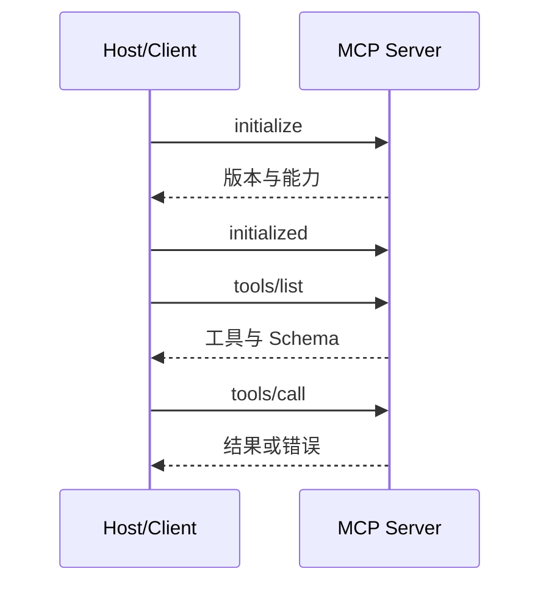

# MCP 协议与连接生命周期

每个 Agent 客户端都为内部文档、文件和第三方服务写一套私有插件，工具发现、参数和错误格式各不相同。MCP 提供一套客户端与服务器协商能力并调用工具的开放协议。

本篇讲协议生命周期，不把 MCP 误解成权限系统或 Agent 框架。服务器仍要自己实现认证、授权、业务逻辑和审计。

## MCP 中有哪些角色

**Host** 是承载 Agent 的应用，**Client** 在 Host 内维护与某个服务器的连接，**Server** 暴露工具、资源或提示等能力。不同服务器具有不同信任边界。

## 第一步：初始化和能力协商

双方在 `initialize` 中确认协议版本、客户端信息和能力。初始化完成前不直接调用业务工具。能力协商让客户端只使用服务器声明支持的功能。

协议版本会演进，实现应按官方当前规范处理版本，不用猜测未知字段，也不把服务器发来的说明当系统指令。

## 第二步：理解传输与会话

本地进程常使用 stdio，远程服务可以使用标准支持的 HTTP 传输。传输解决消息怎样到达，不自动加密业务数据或完成用户授权。

连接中断后，客户端根据传输和应用能力重新初始化或恢复；正在执行的副作用操作不能仅靠重连推断是否成功，需要幂等与状态查询。

## 第三步：发现和调用工具

客户端通过 `tools/list` 获取工具名、描述和输入 Schema，模型再选择候选工具。调用前 Host 可以执行许可检查，服务器执行时仍要进行最终权限裁决。

工具结果是外部数据，可能过大、格式错误或包含提示注入。Host 应限制体积、标记来源，并把它作为数据而非更高优先级指令。

## 第四步：取消、超时和错误

长调用要有 Deadline 和取消传播。客户端取消表示不再需要结果，服务器能否立即停止取决于底层操作；最终状态要明确区分已取消、超时和已经执行完成。

JSON-RPC 错误处理协议问题，业务错误使用稳定结构。不要把服务器堆栈和凭证返回给模型。

## 正常结果和失败结果

正常客户端初始化后列出只读搜索工具，验证用户允许使用，再调用服务器；服务端再次检查资源权限并返回精简结果。

失败客户端连接任意服务器后把全部工具自动交给模型，既不展示来源也不限制写操作。一次不可信内容就可能诱导后续高风险调用。

Agent 实践第 11 篇展示了只读知识 MCP 如何复用同一 Runtime 与 ACL。

## 用协议日志理解一次连接

第一次调试 MCP，建议先关闭模型选择环节，只让 Host 固定执行“初始化、列工具、调用一个只读工具”。为每条请求记录方向、请求 ID、方法、耗时和结果类型，不记录认证头或完整业务正文。这样可以把协议问题和模型决策问题分开。

| 观察到的现象 | 先检查哪里 |
| --- | --- |
| `tools/list` 前就失败 | 初始化是否完成、协议版本是否可协商 |
| 能列出工具但调用参数错误 | 工具 Schema 与客户端生成参数是否一致 |
| 调用超时后仍有副作用 | 服务器是否真正支持取消，写操作是否可查询和幂等 |
| 重连后重复执行 | 客户端是否把“未收到响应”误判成“服务端未执行” |
| 工具结果影响系统指令 | Host 是否把外部结果明确当作不可信数据 |

本地 stdio 场景还要区分“进程退出”和“业务方法报错”；远程 HTTP 场景要区分传输状态、JSON-RPC 错误和工具业务错误。三层混成一个字符串，Agent 就无法判断该重新连接、修改参数还是停止。

完成最小验证后，再让模型从两个只读工具中选择，并检查 Host 是否只暴露当前用户允许的能力。MCP 统一了发现和调用方式，但权限仍应在 Host 与 Server 两端按各自责任校验。理解这一点，就不会把“连上 MCP Server”等同于“可以安全使用全部工具”。

## 参考资料

- [MCP：Architecture](https://modelcontextprotocol.io/docs/learn/architecture)
- [MCP Specification](https://modelcontextprotocol.io/specification/2025-06-18)
- [JSON-RPC 2.0](https://www.jsonrpc.org/specification)
