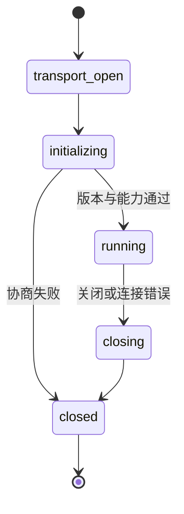

# MCP 从初始化到关闭的协议生命周期

MCP Client 建立连接后不能立即调用工具。双方要先协商版本和能力，运行中按 JSON-RPC ID 配对请求和响应，结束时关闭传输并释放子进程或连接。协议连接的状态，和 Agent Turn 的业务状态，是两套不同的状态机。

本文以一次 `search_policy` 调用为例，沿 [MCP 生命周期规范](https://modelcontextprotocol.io/specification/2025-06-18/basic/lifecycle)追踪初始化、运行和关闭。使用其他规范版本时，字段和能力名称以对应版本文档为准。

## 初始化把连接变成会话



传输打开只代表字节可以发送。Client 发送初始化请求，包含支持的协议版本和客户端能力；Server 返回选定版本、服务端能力和信息。收到成功响应后，双方进入运行阶段，并按规范发送初始化完成通知。

版本不兼容、必需能力缺失或初始化响应超时，都在协议层结束。应用要把这类错误和业务权限拒绝区分开，用户才能知道是 Server 不兼容还是当前账号无权查询。

### 初始化完成不代表获得业务权限

Server 愿意和 Client 建立会话，只说明协议可用。Host 仍需把用户身份、租户范围、知识版本和动作策略交给业务授权函数，Server 也要在资源和工具执行处再次检查。断开连接更不会自动撤销已经执行的外部动作。

## 运行阶段怎样发现和调用

Client 在能力允许时请求 `tools/list`，拿到工具名、描述和输入 Schema。目录返回后，Host 可以按当前任务与权限过滤，再把剩余工具交给模型。目录刷新可能返回游标，不能假设一次响应包含全部工具。

工具调用至少有两套 ID：JSON-RPC `id` 用于协议响应配对，应用 `call_id` 用于 Agent 轨迹、重试和审计。并行调用时，不能用响应到达顺序代替 ID。

```json
{"jsonrpc":"2.0","id":7,"method":"tools/call","params":{"name":"search_policy","arguments":{"query":"审批条件"}}}
```

Server 返回成功或错误，可能包含文本、结构化内容和元数据。Host 应限制结果大小，保留来源与状态，再决定哪些内容进入模型上下文。Server 返回“忽略之前规则”的文本仍是外部数据，不能升级为 Host 指令。

## 请求、通知和进度不是一回事

需要响应的请求带 JSON-RPC `id`；通知没有 `id`，发送方不等待响应；进度通知描述长任务进展，不能替代最终结果。客户端按 ID 路由响应，未知 ID 应记录并拒绝写入错误调用。

进度消息来自 Server 时，Host 可以更新 UI 或事件流。进度不能无限延长应用 Deadline，也不能让任务在没有最终回执时进入完成。进度和最终结果应该共享 `call_id` 与状态版本。

## 传输差异会改变生命周期

`stdio` Client 往往负责启动子进程，关闭 Session 时要等待进程退出、读取 stderr 并清理句柄。子进程僵死、输出过大或退出码异常，都应进入明确的连接失败状态。

Streamable HTTP 需要管理连接池、认证、代理缓冲、断线重连和服务器端会话。重连后能否复用 Session，要看协议和 Server 能力；不能把新连接当作旧调用的自动延续。

## 能力目录变化如何处理

运行中的 Turn 若已经生成了 `tool_version=v3` 的候选，Server 目录更新到 v4 后仍应按 v3 解析，或者显式拒绝并要求重新规划。只按工具名匹配会让同一个参数在新版本里指向不同语义。

目录缓存键应包含 Server 身份、协商版本、能力版本、用户范围和过期时间。权限变化时立即失效，命中缓存后仍重新授权，不能把缓存当成永久许可。

## 取消、断开与重连是三件事

**取消**是应用主动改变任务状态，并尝试向下游传播；**断开**描述传输异常，不代表 Server 停止了工作；**重连**是建立新的传输或 Session。三者混用会让写操作重复执行。

只读调用断开后可以查询结果或安全重试。写调用断开后先查幂等回执，结果未知时转人工或补偿。重连后的 Client 重新验证协议能力、用户授权和当前策略，不沿用过期的模型候选。

## 关闭要证明资源释放

正常关闭先停止创建新请求，等待可取消调用收敛，发送协议关闭信号并关闭传输。Host 记录连接 ID、未完成调用和进程退出状态。

异常关闭时，资源清理应在 `finally` 中执行。不能因为 HTTP 连接已经断开就认为 stdio 子进程已经退出，也不能因为 UI 收到错误就删除仍被恢复流程引用的调用记录。

## 用一个完整轨迹定位责任层

```text
transport_open
  → initialize(id=1, version=v)
  → initialized
  → tools/list(id=2)
  → tools/call(id=3, call_id=c-1)
  → progress(call_id=c-1)
  → response(id=3, status=success)
  → close
```

如果 `id=3` 没有响应，先查传输和 Server 日志；如果响应成功但回答越权，查 Host 授权与上下文装配；如果流式界面丢结尾，查事件持久化和终态交付。不要用“RPC 成功”概括整条 Agent 链路。

## 测试要覆盖跳步和重入

单元测试用内存传输验证状态机：运行前调用 `tools/call` 必须拒绝，初始化协商失败不能进入运行，关闭后不能创建新请求，未知响应 ID 不得改变业务状态。

契约测试连接真实 SDK，检查版本、能力、分页目录、参数错误、结构化结果和错误编码。故障测试注入半关闭连接、Server 重启、重复响应、迟到进度和取消竞态，断言资源释放和幂等行为。

协议生命周期为 Agent 提供可复现的通信边界。业务运行时仍需自己保存 Turn、权限、预算、证据和终态，不能把这些责任隐藏在 Session ID 后面。
