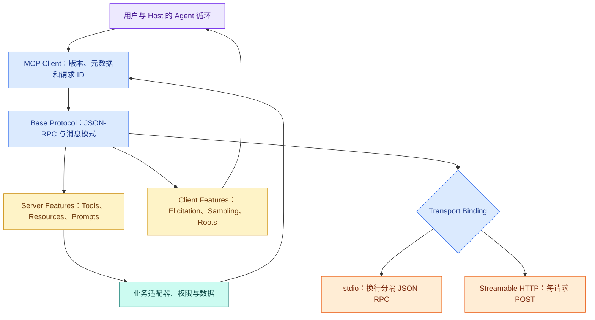
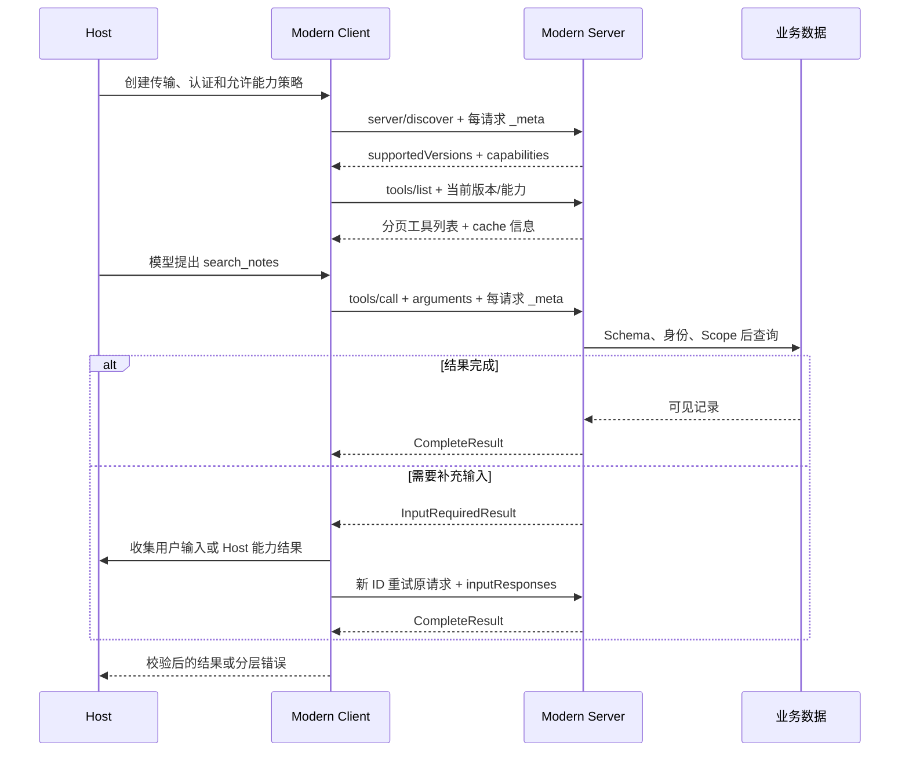

# MCP 协议：现代无状态请求、Legacy 握手与两种传输

搜索“**MCP** 开发教程”时，你会看到两套看似矛盾的生命周期：一套先发 `initialize`、再发 `notifications/initialized`；另一套直接调用 `server/discover` 或 `tools/list`，每个请求都携带协议版本和客户端能力。两套示例都可能曾经正确，但属于不同协议时代。

当前 `2026-07-28` 规范把 MCP 定义为无状态协议：不再依赖连接级初始化握手，每个请求自行携带版本、客户端身份和能力；**Server** 必须实现 `server/discover`。`2025-11-25` 及更早版本使用 `initialize` 会话握手，现称 Legacy。兼容实现可能同时支持两套，称为 dual-era。

本文先讲现代协议，再解释旧握手和兼容探测。实现 Server 时还要锁定具体 SDK 版本，因为 SDK 的包版本和协议日期不是一回事。

## MCP 仍然有 Host、Client 和 Server，但“连接”不等于“会话”

### Host

Host 是用户实际使用的 AI 应用，例如 IDE、桌面应用或 Agent Runtime。它拥有用户身份、模型循环、授权 UI、工具暴露策略和最终上下文。Host 可以同时管理多个 MCP **Client**。

### Client

Client 是 Host 内部连接某个 Server 的协议实现。它负责构造请求元数据、选择协议版本、匹配 **JSON-RPC** ID、调用 Tools/Resources/Prompts、处理流式通知和关闭传输。Client 不拥有 Server 的业务数据权限。

### Server

Server 暴露能力并执行最小业务逻辑。它从可信认证通道取得身份，验证参数和 Scope，返回结构化结果。Server 不负责主 Agent 的规划，也不能从模型参数相信 `user_id`。

现代协议无状态意味着：**stdio** 子进程或 HTTP 连接不是一个 Conversation/Thread。Server 不能因为“上一请求已经发过身份和能力”就省略当前校验，也不能把进程身份当用户身份。跨请求任务必须有显式 task/handle ID，并由客户端每次传入。

## MCP 协议栈包含什么



Base Protocol 定义 JSON-RPC 消息、版本和消息模式；Tools/Resources/Prompts 是 Server Features；Elicitation、Sampling、Roots 是 Client Features。Transport 只负责消息怎样成帧、传递和取消，不改变 `tools/call` 的业务语义。最底层业务适配器仍负责权限、数据库和外部 API。

## Tools、Resources 和 Prompts 分别表达什么

| 能力 | 交互方式 | 适合表达 | 不应该误解为 |
| --- | --- | --- | --- |
| Tool | 传参数并触发处理 | 搜索、计算、创建草稿 | 任意远程 API 自动安全化 |
| Resource | 按 URI 读取内容 | 文档、配置、快照 | 自动参与模型上下文 |
| Prompt | 获取参数化消息模板 | 审查或摘要模板 | Server 替 **Host** 调用模型 |

现代 `tools/list` 支持分页和缓存信息，工具集合可按当前请求的授权变化，但不应因同一连接里其他请求的副作用而变化。稳定顺序有助于客户端缓存和模型 Prompt Cache。工具 annotation 来自 Server，除非 Server 可信，否则 Client 仍将其视为不可信声明。

## JSON-RPC 请求、响应和通知

### 请求必须有唯一 ID


一次工具调用需要用 `id` 关联成功响应、错误响应和取消请求。输入是 Host 已选择的工具名、经过模型生成的业务参数，以及由 Client 填入的协议元数据；目标是观察 Server 怎样先识别方法，再校验参数，最后把同一个 `id` 带回响应。下面的注释用于标出字段职责，真正发送的 JSON 要移除注释。
```jsonc
{
  "jsonrpc": "2.0",
  // 请求 ID 用于把响应、错误和取消关联到同一次调用，通知消息则没有 ID。
  "id": "call-7",
  "method": "tools/call",
  // params 承载工具名、模型参数和协议元信息，Server 仍要逐层校验。
  "params": {
    "name": "search_notes",
    "arguments": { "query": "回滚步骤", "limit": 5 },
    // _meta 描述协议版本和客户端能力，不等于已经认证的用户身份或业务权限。
    "_meta": {
      "io.modelcontextprotocol/protocolVersion": "2026-07-28",
      "io.modelcontextprotocol/clientInfo": {
        "name": "knowledge-host",
        "version": "1.0.0"
      },
      "io.modelcontextprotocol/clientCapabilities": {}
    }
  }
}
```

这份对象的阅读入口是 `jsonrpc`、`id`、`method`、`params`。调用方先校验字段形状，再注入或核对可信上下文，最后把结果交给下一层；缺字段、额外字段与业务拒绝要保留不同错误，不能统一转换成空对象。


现代请求把协议版本、客户端实现信息和能力放在 `_meta` 中。`id` 在未完成请求之间保持唯一，用于把并发响应对应回来。`clientInfo` 是实现身份，不是已认证用户身份；业务认证仍走可信传输或授权框架。

### 成功响应包含 `resultType`


成功响应复用请求 `id`，并把完成类型、模型可见内容和结构化结果放进 `result`。输入是 Server 已执行完成的工具结果，目标是让 Client 区分协议完成状态、面向模型的内容块与面向程序的结构化字段；客户端先按协议解码，再按工具自己的输出 Schema 校验 `structuredContent`。
```jsonc
{
  // JSON-RPC 版本固定报文语义，当前 MCP 消息使用 2.0。
  "jsonrpc": "2.0",
  "id": "call-7",
  // result 固定返回或错误结构，让客户端不必猜测字段含义。
  "result": {
    "resultType": "complete",
    "content": [
      { "type": "text", "text": "找到 1 条可见记录" }
    ],
    "structuredContent": {
      "status": "ok",
      "count": 1,
      // items 只包含公开结果字段；内部权限、存储路径和原始对象不会透出。
      "items": [{ "id": "note-1", "title": "回滚步骤" }]
    },
    "isError": false
  }
}
```

响应 ID 与请求相同。`resultType="complete"` 表示本次请求得到最终结果；`input_required` 表示 Server 还需要客户端补充输入。为兼容旧 Server，缺少 `resultType` 时现代 Client 按 complete 处理，但新实现应该显式返回。

`isError=false` 表示 Tool 业务调用没有按工具语义失败，不证明正文可信。Client 仍要检查输出 Schema、Scope 和内容安全。

### Error Response 与工具业务错误分层

JSON-RPC Error 用于协议、方法、参数或版本层失败，包含整数 `code` 与消息。现代规范为不支持协议版本定义 `-32022`，响应会列出 Server 支持的版本。工具正常执行后发现“无匹配”通常仍是 complete 结果，不应返回协议错误。

### Notification 没有 ID

通知是一条不等待响应的消息，例如 stdio 取消、进度或订阅更新。接收方不能给通知发送普通响应。现代协议的消息方向受限：Client 发请求/通知，Server 发响应/通知；Server 需要用户输入、Sampling 或 Roots 时，使用后面讲的 MRTR，而不是任意发起 JSON-RPC Request。

## 现代版本发现：`server/discover`

现代 Server 必须实现 `server/discover`，Client 可以在其他请求前调用，也可以直接调用业务 RPC 并处理版本错误。discover 返回支持的协议版本、能力、Server 信息、可选 instructions 和缓存字段。


现代无状态连接把协议版本和客户端信息放在每次请求的 `_meta` 中。Server 根据这些元数据返回能力描述，但认证身份仍来自 HTTP 鉴权边界。
```jsonc
{
  "jsonrpc": "2.0",
  // 请求 ID 用于把响应、错误和取消关联到同一次调用，通知消息则没有 ID。
  "id": "discover-1",
  "method": "server/discover",
  // params 约束调用方输入，真实执行前仍要做业务与权限校验。
  "params": {
    "_meta": {
      "io.modelcontextprotocol/protocolVersion": "2026-07-28",
      "io.modelcontextprotocol/clientInfo": { "name": "demo-client", "version": "1.0.0" },
      "io.modelcontextprotocol/clientCapabilities": {}
    }
  }
}
```

Client 发送首选现代版本。若 Server 返回 DiscoverResult，从 `supportedVersions` 选共同版本；若返回 `UnsupportedProtocolVersionError`，从 error 的 supported 列表选择并重试；若 stdio Server 返回其他错误或超时，dual-era Client 才把它判断为 Legacy 候选并尝试 `initialize`。

`serverInfo` 是 Server 自报信息，只适合显示、日志和排障，不能用来做安全决策。不要因为 name 叫“trusted”就跳过认证。

## `initialize` 现在应该怎样理解

`2025-11-25` 及更早协议在连接开始时发送 `initialize`，协商版本、能力和实现信息，再发送 `notifications/initialized`。大量 SDK v1 教程仍采用这条链，因此初学者会看到：

```text
initialize -> initialize result -> notifications/initialized -> tools/list -> tools/call
```

这条链对 Legacy Server 仍然正确，但不应被描述成 `2026-07-28` 现代协议的必经步骤。Dual-era 实现根据开场消息选择语义：现代请求带每请求 `_meta`；Legacy `initialize` 选择连接/Session 范围的旧语义。

SDK 包版本也不要和协议版本混淆。本文核实时 Python 包为 2.0.0，Node 包为 1.30.0；这两个数字不能推导它们实现的协议日期。写代码前锁定包版本，查看对应文档和迁移说明，再用 discover/测试确认互操作。

## 现代调用的完整生命周期



Host 先准备传输和认证。Client 可选 discover，再列工具；模型提出调用后，Client 发一个自包含请求。Server 每次都重新读取版本、能力与认证信息，并在业务查询前做 Schema 和 Scope。若需要更多输入，MRTR 返回 InputRequiredResult；Client 收集输入后使用**新的 JSON-RPC ID**重试原请求。最终结果经 Client 校验后回到 Host。

## MRTR 为什么替代 Server 主动请求

Multi Round-Trip Requests（MRTR）让 Server 在处理请求时声明“还需要哪些客户端输入”，例如用户表单、Sampling 或 Roots。Server 返回 `resultType="input_required"`、`inputRequests` 和可选 `requestState`；Client完成这些输入后重试原方法，并带 `inputResponses` 与 `requestState`。

它不是让 Server 保持隐式 Session。`requestState` 是显式不透明状态，由 Client 原样带回；新请求使用新 ID。Client要限制补充轮数，验证请求类型，确保高风险输入经过用户界面确认。Server不能用 MRTR 绕过 Host 的工具和权限策略。

## Subscribe and Notify 处理长期变化

工具列表或 Resource 变化不是每次轮询的唯一办法。Client 可以调用 `subscriptions/listen`，声明想接收的通知类型，Server在这个长请求的响应流上发送 acknowledged 与后续 list_changed/resource_updated 通知。

订阅流仍是一条长生命周期 Request/Response，不是把整个连接变成会话。断线或 Server 重启后，Client重新建立订阅，并重新列取实际数据；通知只表示“可能变化”，不直接携带所有新状态。

## stdio：本地子进程和严格 stdout 纪律

stdio 由 Client 启动 Server 子进程。Client向 stdin 写一行一个 JSON-RPC 请求或通知；Server从 stdout 回一行一个响应或通知。消息 UTF-8 编码，不能在单条消息中嵌入未转义换行。

```text
Host 进程
  └─ MCP Client
       ├─ stdin  -> Server：请求/通知
       ├─ stdout <- Server：响应/通知
       └─ stderr <- Server：诊断日志
```

stdout 只能有合法 MCP 消息。Python `print()` 或 Node `console.log()` 写调试信息会污染协议；日志写 stderr。stderr 有内容不必然表示失败，Client可以捕获、转发或忽略，仍应以进程退出和协议消息判断状态。

关闭时 Client先关 stdin，等待 Server退出；超时后再按平台终止进程。Server应在 EOF 后尽快退出。意外退出时，现代协议无连接状态，Client可以重启并按幂等边界重试未完成读请求；订阅需要重新建立。写工具是否可重试取决于幂等和业务状态，不能因“协议无状态”就盲目重放。

stdio 的 modern/legacy 探测尤其重要：dual-era Client先发 discover。得到现代结果或现代版本错误就保持现代；得到其他错误/超时才回退 **initialize**。不能只匹配一个 `-32601`，因为 Legacy Server 的未知方法错误并不统一。

## Streamable HTTP：每条消息独立 POST

现代 **Streamable HTTP** 暴露一个 MCP POST 端点。每个 JSON-RPC 消息使用新的 HTTP POST；Server对请求返回单个 JSON 对象或仅属于该请求的 SSE 流。`2026-07-28` 已移除旧的 GET 流端点和协议级 Session。

每个请求至少要正确处理：

- `Content-Type: application/json`；
- `Accept` 同时支持 `application/json` 与 `text/event-stream`；
- `MCP-Protocol-Version` 与 body `_meta` 中版本一致；
- `Mcp-Method`，特定方法还需要 `Mcp-Name`；
- 当前认证授权；
- Server的 Origin 校验、TLS、限流和请求大小限制。

简单请求返回 JSON；需要进度时返回本请求的 SSE 流，最终 JSON-RPC Response 结束流。长生命周期列表变化通过 `subscriptions/listen` 的 SSE 响应流。现代规范不支持用 `Last-Event-ID` 恢复 SSE，断线后 Client要重新请求。

反向代理要关闭 SSE 缓冲，Server可返回 `X-Accel-Buffering: no`，并为安静的长流发送 SSE 注释保活。关闭某个请求的 SSE 流就是取消信号；Server停止该请求并不再发送消息。

## 为什么还会看到“旧 SSE 传输”

Streamable HTTP 在 `2025-03-26` 引入，用于替代 `2024-11-05` 的独立 HTTP+SSE 传输。旧方案通常有 GET SSE 端点和单独消息提交端点。兼容客户端可能继续支持，但新文章不应把它当默认实现。

迁移需要测试协议时代、POST/GET 行为、Session、请求级 SSE、取消、代理缓冲和 Server-to-Client 交互。只调用一次 tools/list 成功，不能证明长请求和兼容回退正确。

## 两种现代传输怎样选择

| 问题 | stdio | Streamable HTTP |
| --- | --- | --- |
| 部署位置 | Host 启动的本地进程 | 独立远程/本地 HTTP 服务 |
| 多客户端 | 每个 Host 通常有自己的进程 | 同一服务处理多个请求者 |
| 认证 | 环境、本机权限和进程边界 | HTTP 授权框架、TLS、网关 |
| 消息 framing | 一行一个 JSON-RPC | 每条消息一个 POST |
| 流式 | 同一 stdout 上按 ID/元数据关联 | 请求级 SSE 或订阅 SSE |
| 取消 | `notifications/cancelled` | 关闭对应响应流 |
| 常见故障 | PATH、cwd、stdout 污染、子进程退出 | DNS、TLS、Origin、Header、代理缓冲 |
| 适用 | IDE、本地工具、个人能力 | 团队服务、远程数据、集中治理 |

能力只在本机被一个 Host 使用时，stdio 通常更简单；多用户远程共享时选择 Streamable HTTP，但要同时承担认证、容量和运维。不要只为了“像微服务”把本地函数暴露到网络。

## 手工推演一次 search_notes

按下表逐步填写真实消息和日志：

| 阶段 | 输入 | 正常输出 | 失败先查 |
| --- | --- | --- | --- |
| transport | 启动命令或 `/mcp` URL | 子进程/HTTP 可达 | PATH、cwd、DNS、TLS、端口 |
| discover | 每请求 `_meta` | 共同版本与 capabilities | 版本、modern/legacy 时代 |
| list | tools/list + cursor | 稳定工具 Schema | 分页、缓存、授权后的工具集 |
| call | name、arguments、元数据 | complete 或 input_required | Schema、Scope、Repository |
| MRTR | inputRequests | 新 ID + inputResponses | 轮数、审批、requestState |
| subscribe | notification filter | acknowledged + 变化通知 | SSE、代理、重连 |
| cancel | stdio 通知/HTTP 关流 | 工作尽快停止 | 底层取消传播 |
| close | stdin EOF/HTTP 请求结束 | 无残留进程或任务 | finally、进程、连接池 |

练习一：给 Server 一个不支持的协议版本，验证它返回 supported 列表，Client选择共同版本而不是直接 initialize。练习二：让一个 Legacy Server对 discover 返回普通未知方法错误，dual-era Client才回退握手。练习三：给 tools/call 传 `limit="5"`，确认错误发生在 Schema 层，业务 Repository 调用次数为 0。

## 分层排障 Runbook

```text
1. 进程或 HTTP 端点是否可达？
2. stdio 是否只有单行 JSON-RPC，HTTP Header 与 body 元数据是否一致？
3. 对端属于 modern、legacy 还是 dual-era？
4. protocolVersion 是否共同支持，server/discover 是否正确？
5. tools/list 是否按当前授权返回稳定 Schema 和分页？
6. tools/call 参数、身份、Scope、Release 是否通过？
7. Complete、InputRequired、JSON-RPC Error、空结果是否分层？
8. MRTR 轮数、订阅流、进度和取消是否受预算约束？
9. 返回内容是否完成 Schema、大小、隐私和注入检查？
10. 断线、子进程退出和异常是否释放资源，并按幂等边界恢复？
```

这份顺序先排 transport，再排协议时代与版本，最后进入 Tool 业务。若 discover 都失败，不要先调数据库；若 Tool 返回 empty，不要反复重启 Server。

## 常见问题

### MCP 是 2024 年推出的，为什么现在的示例生命周期会不同？

MCP 规范通过日期版本演进，SDK 包也有自己的语义化版本，两条版本线不能混为一谈。早期实现常见 `initialize`、能力协商和会话式流程；当前规范可能引入新的发现或无状态请求语义，而某个 SDK 仍只实现旧时代。开发时应同时记录协议日期、SDK 名称与版本、使用的传输和契约测试结果。升级时让 Client 与 Server 做兼容探测，不能只看到 npm 或 PyPI 的“最新版本”就推断协议行为。

### JSON-RPC 成功响应为什么仍可能表示工具执行失败？

JSON-RPC 层的成功只说明请求被正确解析并由对应方法处理。工具回调内部仍可能返回业务错误、部分结果或需要补充输入的状态。相反，未知方法、无效参数或协议格式错误属于 JSON-RPC Error。Host 要保留这两层：协议错误通常检查版本和报文，工具错误则检查权限、依赖和业务参数。若把两者压成一条字符串，重试器就可能用业务参数修复协议错误，或重启连接来处理正常空结果。

### stdio 为什么不能用 stdout 打普通日志？

stdio transport 把子进程 stdout 当作协议数据通道，Client 会按 framing 规则解析其中的 JSON-RPC 消息。普通 `console.log` 或 `print` 混入后，解析器无法判断它是日志还是响应，常表现为握手失败或随机 JSON 错误。诊断日志应写 stderr，并避免包含凭证和完整文档。排查时先手工启动进程观察 stderr，再检查 stdout 是否只含协议帧；业务函数甚至尚未执行时，不要先修改检索逻辑。

### Streamable HTTP 是否意味着连接永远保持长连接？

不应这样理解。HTTP 请求可以独立 POST，响应可按需要使用普通 JSON 或请求级 SSE；服务端也可能提供订阅通知，但是否有会话状态取决于协议版本和实现。代理超时、缓冲、重连和负载均衡策略都要按实际消息路径验证。只用一次短 `tools/list` 请求成功，不能证明长工具调用、取消或事件流可用；至少还要测试慢响应、客户端断开和代理后的 Header 保留。

### 什么时候使用 stdio，什么时候使用 Streamable HTTP？

本地 IDE 或个人 Agent 启动一个只服务当前 Host 的进程时，stdio 配置少、延迟低，也不需要暴露网络端口。团队共享、多用户访问、集中认证和独立扩缩容时，Streamable HTTP 更合适，但会增加 TLS、OAuth、Origin、网关、容量和审计责任。选择依据是部署与治理约束，不是“HTTP 看起来更正式”。一个本地纯函数没有跨进程复用需求时，甚至不必使用 MCP。

### Client 可以在发现失败时自动回退所有旧协议吗？

只能在明确识别对端时代、错误类型和支持范围时做有限兼容。网络不可达、TLS 失败和认证拒绝都不代表对端是旧协议，盲目回退会掩盖真实故障，甚至绕开新的安全要求。兼容 Client 可以把“现代发现返回标准未知方法”作为候选信号，再进入受测试的 Legacy 握手；成功后记录最终协议版本。任何回退都应有次数限制和审计，而不是不断尝试不同报文直到某个返回 200。

### MCP 的 Session 和聊天 Conversation 是一回事吗？

不是。MCP Session 描述 Client 与 Server 之间的协议或传输状态，聊天 Conversation 保存用户与 Agent 的业务对话，两者生命周期和所有权不同。一个 Conversation 可能跨多个 MCP 连接，也可能在进程重启后恢复；一个远程 MCP Session 也可能服务多个独立 Turn。不要把会话 ID 互相复用，否则连接重建、权限审计和聊天恢复会耦合，排查时也无法区分是协议断线还是业务回合失败。

### 收到取消消息后，Server 立刻停止就算完成了吗？

取消是协作信号，不是自动回滚。Server 要把取消传播到底层 HTTP、数据库或任务执行，并阻止迟到结果写入已经结束的请求；已经提交的外部副作用还需要幂等键、状态查询或补偿。Host 也要给取消设置最终等待上限，超时后关闭流并标记状态。验证时不能只看 Client UI 停止转圈，还要检查 Server 工作是否结束、资源是否释放、终态是否被后来完成覆盖。
