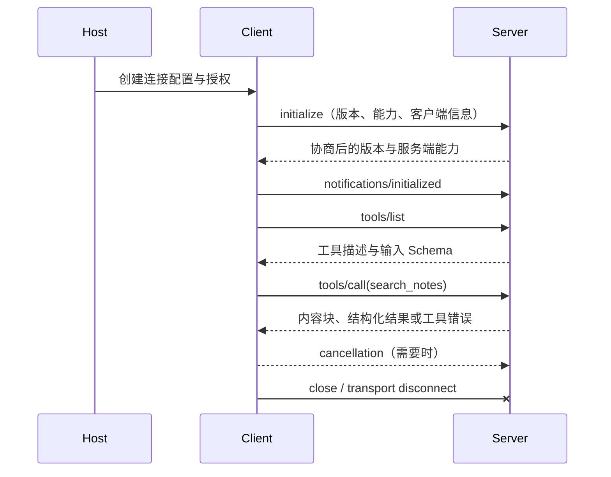

# MCP 协议：角色、能力、生命周期与传输方式

一个 MCP 工具调用在界面里可能只显示“正在搜索”。协议层实际做了更多事情：Host 创建 Client，Client 连接 Server，双方协商版本与能力，Client 发现工具，然后才发送业务调用。任何一步失败，排查位置都不同。

这篇文章不先写 Server 代码。我们先把协议跑一遍，弄清消息从哪里来、到哪里去，以及 `stdio` 和 Streamable HTTP 为什么不能只按“本地或远程”四个字草率选择。

## MCP 在哪一层

MCP 是 AI 应用与外部能力之间的应用层协议。它通常使用 JSON-RPC 表达请求、响应和通知，再把消息放到 `stdio` 或 Streamable HTTP 传输上。


用户只与 Host 交互。一个 Host 可以管理多个 Client，每个 Client 维护与一个 Server 的协议会话。Transport 负责搬运消息；Server 把协议请求转成业务调用；Repository 才是真正访问文件、数据库或远程 API 的位置。

这层次很重要。`tools/call` 返回错误时，不一定是网络断了；可能是参数不合法，也可能是 Repository 超时。反过来，`initialize` 都没有完成时，业务查询根本还没开始。

## Host、Client、Server 分别拥有哪部分状态

### Host：拥有用户体验和模型循环

Host 是 IDE、桌面应用或其他 AI 产品。它知道当前用户、会话、模型、授权界面和已经连接的 Server。它决定哪些工具描述可以进入模型上下文，也决定模型提出调用后是否还要人工确认。

### Client：拥有一条协议会话

Client 负责握手、版本协商、能力发现、请求 ID、响应匹配和连接关闭。一个 Client 通常对应一个 Server 会话。Host 同时连接浏览器、代码托管和设计系统时，会维护多条 Client 会话，而不是把所有工具放进一条匿名连接。

### Server：拥有能力实现和业务边界

Server 声明 Tools、Resources、Prompts 等能力，并处理调用。它必须知道怎样从可信通道获得身份，怎样过滤数据范围，怎样限制响应和怎样记录审计。Server 不应该相信模型在参数里自报的 `user_id` 或 `tenant_id`。

## Tools、Resources、Prompts 不是三个同义词

| 能力 | 客户端做什么 | 适合表达什么 | 例子 |
| --- | --- | --- | --- |
| Tool | 传参数并触发处理 | 有动作语义的操作 | 搜索笔记、创建草稿、运行检查 |
| Resource | 按 URI 读取内容 | 可寻址的数据 | 一份规范、一个配置快照 |
| Prompt | 取得可复用提示模板 | 可参数化的交互模板 | 代码审查提示、摘要模板 |

搜索笔记需要传入查询词、执行检索和返回候选，因此适合 Tool。读取固定的公开说明可以是 Resource。Prompt 只是一份模板，不会自动调用模型，也不会带来数据库权限。

Server 还可以声明其他协议能力。Client 不能仅凭 Server 名称猜测它支持什么，必须经过能力协商和对应的列表请求。

## JSON-RPC 的三种消息

MCP 以 JSON-RPC 为基础时，最先要分清请求、响应和通知。

### 请求有 `id`，等待对应响应

下面是一条工具列表请求。`id` 用来把响应对应回这次请求；`method` 表示要做什么；没有参数时可以省略 `params`。

```json
{
  "jsonrpc": "2.0",
  "id": 2,
  "method": "tools/list"
}
```

Client 发送后会等待 `id: 2` 的响应。多个请求并发时，响应顺序不一定和发送顺序一致，所以不能用“收到的第二条响应”代替 ID 匹配。

### 响应带相同 `id`，包含 `result` 或 `error`

```json
{
  "jsonrpc": "2.0",
  "id": 2,
  "result": {
    "tools": [
      {
        "name": "search_notes",
        "description": "Search visible notes",
        "inputSchema": {
          "type": "object",
          "properties": {
            "query": { "type": "string", "minLength": 1 }
          },
          "required": ["query"]
        }
      }
    ]
  }
}
```

这条响应只说明 Server 声明了工具和参数 Schema。它没有证明当前用户能读取所有笔记，也没有执行查询。权限会在具体调用时再次判断。

### 通知没有 `id`，发送方不等待响应

初始化完成通知、列表变更通知和取消通知都属于这一类。因为没有 `id`，接收方不应返回普通 JSON-RPC 响应。通知适合表达状态变化，不适合承载需要明确成功结果的业务操作。

## 从 initialize 到关闭连接

一条正常会话可以拆成八个阶段。



### 1. Host 准备连接

Host 解析配置，确定启动命令或远程 URL，准备必要的环境变量、认证和用户授权。若可执行文件不存在、工作目录错误或远程 DNS 失败，问题发生在建立协议会话之前。

### 2. Client 发送 initialize

Client 声明自己支持的协议版本、能力和实现信息。Server 必须先处理初始化，再接受普通能力请求。把业务调用抢在初始化前发送，属于生命周期错误。

### 3. Server 返回协商结果

Server 选择双方都支持的协议版本，并返回自己的能力。协议版本和 SDK 包版本不是同一个概念：SDK 是实现库，协议版本决定消息语义。升级 SDK 时要阅读迁移说明，不能假设所有 API 和默认行为不变。

截至本文更新时间，TypeScript 与 Python 官方 SDK 的稳定主线已进入 v2，并与 2026-07-28 协议版本配套；旧 v1 示例仍可能出现在搜索结果中。实际项目应该锁定依赖主版本和协议兼容范围。

### 4. Client 通知 initialized

这是一条通知，表示客户端已经接收协商结果。之后双方才进入正常操作阶段。

### 5. Client 发现能力

`tools/list`、`resources/list` 等请求让 Client 获得能力描述。工具列表可能分页，也可能在 Server 能力变化后触发列表变更通知。Host 需要更新自己的工具目录，不能把第一次结果永久缓存。

### 6. Client 发起调用

工具调用包含工具名和参数。Server 先用 Schema 验证参数，再进入业务处理。Schema 只处理结构合法性，身份、资源范围、速率和业务状态仍由程序校验。

### 7. 调用返回结果或失败

工具处理失败与协议失败需要区分。工具可以返回带 `isError` 的结果，让模型看到可恢复的业务错误；未知方法、非法协议消息等属于 JSON-RPC 或协议层错误。Client 不应该把所有异常都压成同一句“工具失败”。

### 8. 取消与关闭

Client 不再需要一个长请求时可以发取消通知。取消是协作信号，不是时间倒流：如果工具已经向外部系统提交写操作，收到取消不会自动撤销。读工具也要把取消传到数据库或 HTTP 调用，避免 Host 已离开而 Server 继续耗费资源。

关闭连接时，Client 应释放传输、子进程和待处理请求。异常路径同样要关闭，因此客户端代码通常把 `close()` 放在 `finally`。

## stdio：由 Host 管理的本地子进程

`stdio` 让 Host 启动 Server 子进程，通过标准输入发送协议消息，通过标准输出接收响应。它适合本地开发工具、个人 IDE 集成和凭证需要留在本机的场景。

它有一个很容易踩到的边界：**stdout 是协议通道**。Server 用 `console.log` 或 `print` 随意输出调试信息，会把非 JSON-RPC 字节混进协议流。日志应写到 stderr 或独立日志系统。

stdio 的进程关系如下：

```text
Host 进程
  └─ Client transport
       ├─ stdin  -> Server 请求
       ├─ stdout <- Server 响应
       └─ stderr <- 诊断日志
```

Host 拥有子进程生命周期。正常关闭、崩溃重启、环境变量和工作目录都由 Host 管理。它不是天然的多用户服务方式，也不适合直接暴露到网络。

## Streamable HTTP：面向远程与多客户端

Streamable HTTP 让 Server 作为 HTTP 端点运行。它适合一个服务被多个 Client 连接，也便于接入 TLS、网关、认证、限流和集中观测。

但“使用 HTTP”会增加一组必须处理的工程问题：

- TLS 与证书验证；
- Origin、Host 与 DNS rebinding 防护；
- OAuth 或其他认证流程；
- 会话标识与跨请求关联；
- 代理超时、缓冲和连接上限；
- 多租户数据范围；
- 多实例部署下的状态归属。

本地开发时，如果 HTTP Server 只打算监听本机，应绑定 loopback，并验证 Host/Origin。把开发端点绑定到 `0.0.0.0` 再依赖“没人知道端口”，不是权限控制。

## 旧 HTTP+SSE 方式怎样看

早期 MCP 实现常见独立 SSE 端点和消息提交端点。它仍可能为了旧客户端兼容而存在，但新实现应优先使用当前规范的 Streamable HTTP，并把旧传输视为兼容层，而不是继续扩展的默认方案。

迁移时要测试的不只是“连接成功”，还包括初始化、会话、并发调用、取消、代理缓冲和关闭行为。只测一次 `tools/list` 无法证明流式与长请求正确。

## 传输选择表

| 问题 | stdio | Streamable HTTP |
| --- | --- | --- |
| 谁启动 Server | Host 启动子进程 | 平台独立部署 |
| 谁管理生命周期 | Host | 服务平台与 Client |
| 主要认证边界 | 本机进程、文件和环境变量 | TLS、OAuth、网关和租户 |
| 多客户端复用 | 不适合共享一个子进程 | 适合 |
| 日志注意点 | stdout 只能承载协议 | HTTP 日志要脱敏并关联会话 |
| 常见故障 | 命令不存在、stdout 污染、子进程退出 | DNS、TLS、代理、认证、会话丢失 |
| 适合场景 | IDE、本地脚本、个人工具 | 团队服务、远程数据、集中治理 |

如果能力只在本机使用，stdio 通常更简单。若需要多用户远程访问，Streamable HTTP 更合适，但必须同时交付认证、权限和运行治理。不要仅为了“看起来像服务”把本地工具改成 HTTP。

## 手工推演一次 search_notes

现在用一张状态表检查自己是否真的理解协议：

| 阶段 | 输入 | Server/Client 做什么 | 可观察输出 | 失败先看哪里 |
| --- | --- | --- | --- | --- |
| 启动 | 命令或 URL | 建立 transport | 进程或 HTTP 连接存在 | PATH、DNS、TLS、端口 |
| 初始化 | 协议版本与能力 | 协商兼容版本 | initialize result | 版本与生命周期日志 |
| 发现 | `tools/list` | 返回工具 Schema | `search_notes` 描述 | 能力声明、分页 |
| 调用 | query、limit | 参数校验与查询 | content / structured result | Schema、权限、Repository |
| 取消 | request id 与原因 | 停止可取消工作 | 请求结束或取消状态 | 取消是否传播 |
| 关闭 | Client close | 释放连接和进程 | 无残留会话 | finally、进程与连接池 |

完成推演后，刻意制造两个失败：把 stdio 启动命令改成不存在的命令，确认错误发生在连接前；再给 `limit` 传字符串，确认错误发生在参数校验而不是 Repository。能分清这两类失败，后面写 Server 时才不会用一个 `catch` 把所有问题藏起来。

## 排查顺序

```text
1. Server 进程或 HTTP 端点是否真的可达？
2. transport 是否只承载合法协议消息？
3. initialize 是否完成，版本是否兼容？
4. Server 是否声明了预期能力？
5. tools/list 是否返回正确 Schema？
6. tools/call 的参数是否通过校验？
7. 可信身份和数据范围是否存在？
8. Repository、超时和取消是否正常？
9. 返回内容是否经过大小、类型和安全校验？
10. 异常路径是否关闭连接与子进程？
```

这份顺序把传输、协议和业务三层分开。下一篇会使用当前 TypeScript SDK，把同一个 `search_notes` 契约真正实现成可运行的 Node.js stdio Server。
