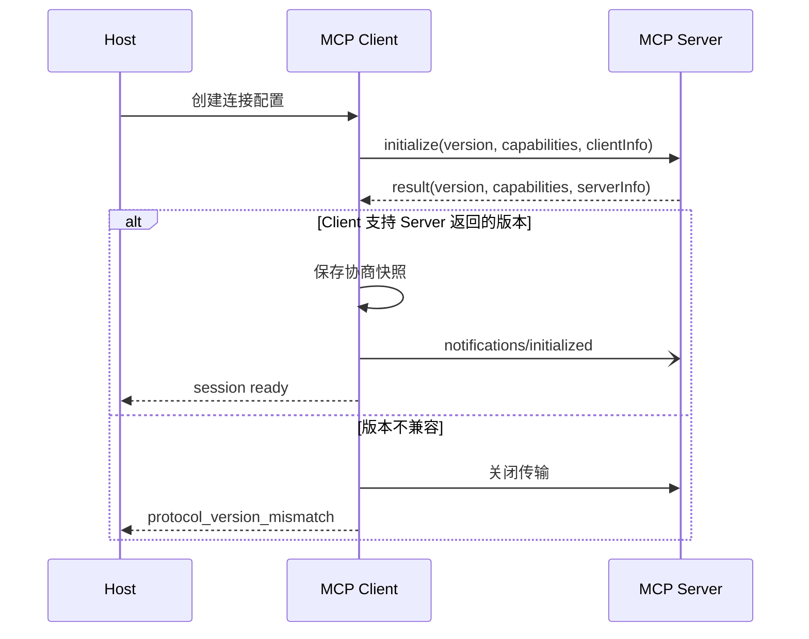
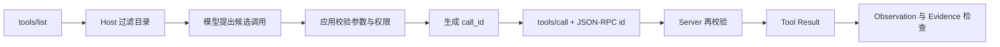
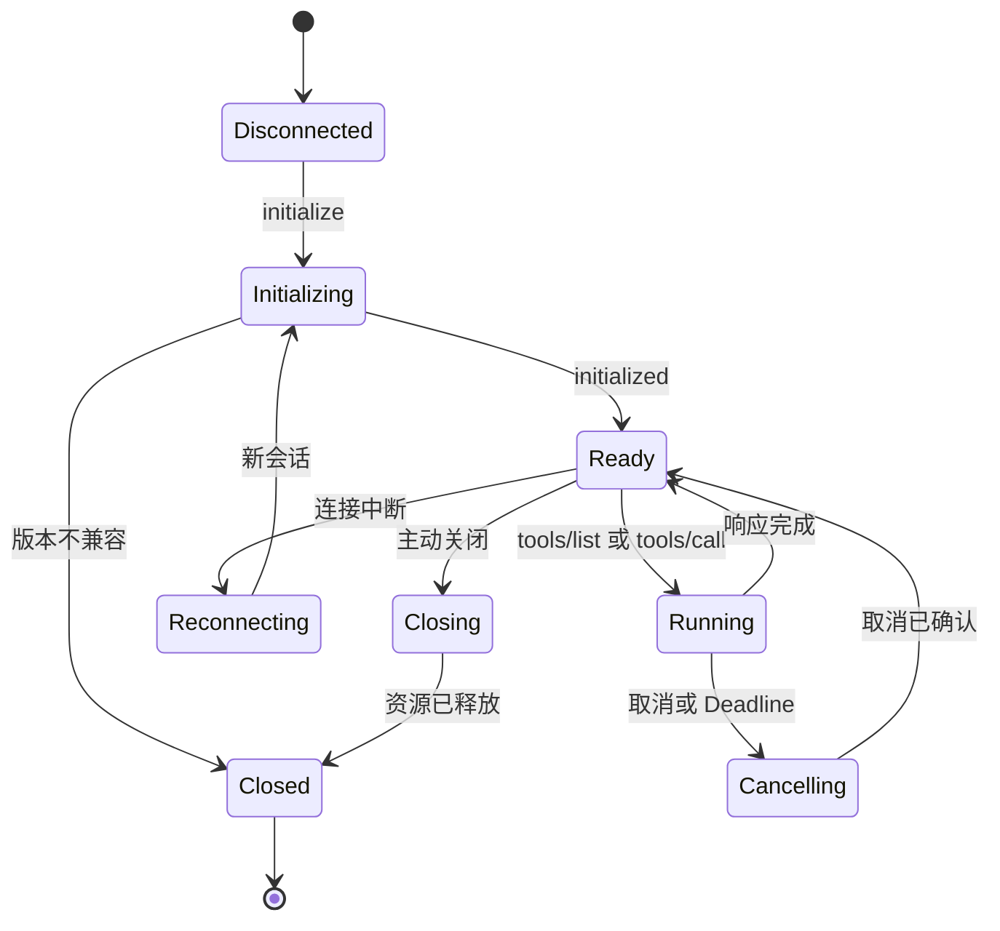
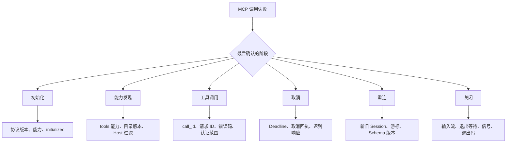

# MCP 从初始化到关闭的协议生命周期

MCP Client 不能连上 Server 就立刻调用工具。双方要先确认协议版本、交换能力，再进入可以处理普通请求的状态。会话结束时，Client 还要关闭传输并回收资源。把这段过程忽略掉，最常见的后果是：工具偶尔能调通，但重连、取消、升级或并发请求一来，响应就会串线，子进程也可能留在后台。

[MCP 生命周期规范](https://modelcontextprotocol.io/specification/2025-06-18/basic/lifecycle)把连接分为三个阶段：**初始化**、**运行**和**关闭**。这三个阶段描述协议连接，不等于 Agent 的业务状态。一个 Agent Turn 可以跨过多次 MCP 请求，也可能在 MCP 调用成功后因为证据不足而拒绝回答。若目标实现采用其他协议版本，应以对应版本的[官方生命周期定义](https://modelcontextprotocol.io/specification/latest/basic/lifecycle)核对字段和状态。

::: info 贯穿本文的请求

知识助手要调用远程 Server 的 `search_policy` 工具，查询“远程访问需要哪些条件”。Client 已经有用户授权，但还没有和 Server 建立会话。

我们会沿这次请求追踪四类状态：

- 协议版本和双方能力；
- JSON-RPC 请求 ID 与 MCP Session ID；
- 应用层 `call_id`、用户范围和剩余时间；
- 工具结果、取消原因和资源清理结果。

:::

## 生命周期先解决连接能不能工作

JSON-RPC 只规定请求、响应和通知的基本形状。它不知道 `tools/list` 是否可用，也不知道一方支持哪个版本。MCP 在 JSON-RPC 之上增加初始化与能力协商，让 Client 在调用前得到一份明确的连接合同。

一个连接至少要回答下面这些问题：

| 问题 | 由什么回答 | 不能混淆的对象 |
| --- | --- | --- |
| 双方按哪版协议解释消息 | `protocolVersion` | Server 自身版本、工具版本 |
| Server 暴露哪些能力 | `capabilities` | 当前用户是否获准使用 |
| 一条响应属于哪个请求 | JSON-RPC `id` | 应用层 `call_id` |
| 多个 HTTP 请求是否属于同一会话 | `Mcp-Session-Id` | 登录 Token、租户 ID |
| 请求何时停止等待 | Deadline 与取消通知 | TCP 断开 |

能力协商只表示协议层支持某项功能。Server 声明了 `tools`，说明它能处理工具相关消息；Host 仍然可以隐藏某些工具，Server 也必须重新检查调用者身份和参数。把 `capabilities` 当作权限清单，会让协议能力越过业务 ACL。

协议状态和业务状态也要分开保存。`initialized` 表示连接已就绪，不能推出 `search_policy` 已执行；HTTP 返回 200 只表示传输完成，不能推出工具结果满足当前用户范围；工具返回文本也不能直接推出 Agent 可以给出答案。每一层都有自己的成功条件。

## 初始化怎样完成版本和能力协商

初始化必须是 Client 和 Server 的第一次正式交互。Client 发送 `initialize` 请求，参数里带自己支持的协议版本、能力和实现信息。Server 返回它选择的协议版本、可提供的能力和实现信息。Client 接受结果后，再发送 `notifications/initialized` 通知。



最小请求可以写成下面这样。`id` 使响应能回到这次请求，`protocolVersion` 表示 Client 希望使用的版本，`clientInfo` 用来识别实现，不承担认证作用。

```json
{
  "jsonrpc": "2.0",
  "id": 1,
  "method": "initialize",
  "params": {
    "protocolVersion": "2025-06-18",
    "capabilities": {},
    "clientInfo": {
      "name": "knowledge-client",
      "version": "1.0.0"
    }
  }
}
```

版本协商不是“数字越新越好”。Server 支持 Client 请求的版本时，要返回相同版本；不支持时，可以返回自己支持的另一个版本。Client 如果无法解释这个返回版本，应关闭连接。继续发送请求虽然有时会碰巧成功，但遇到字段或传输语义变化时，故障会落在更晚的位置，日志也很难还原原因。

初始化结果应该作为不可变快照保存，至少包括协商版本、Server 信息、能力、建立时间和连接身份。后续请求读取这份快照，不能每次凭当前配置重新推断。连接重建后创建新快照，旧请求继续关联旧连接，避免升级过程中把两版能力混在一起。

::: warning 初始化完成不等于已经授权

协议握手证明双方能按同一种消息规则通信。用户能否调用 `search_policy`、能读取哪些文档，由 Host 策略和 Server 业务权限共同决定。模型在参数里填写的 `user_id`、`scope` 或 `release` 不能覆盖认证上下文。

:::

## 运行阶段怎样发现并调用工具

进入运行阶段后，Client 只能使用双方已经协商的能力。本文的 Server 声明了 `tools`，Client 才能发送 `tools/list`。返回的工具目录包含名称、说明和输入 Schema，Host 还会按当前用户、风险等级和应用配置过滤一次，再把允许的部分交给模型。

模型返回 `search_policy(query="远程访问")` 只是候选动作。运行时先校验工具是否还在当前目录、参数是否符合 Schema、调用是否越过用户范围，然后生成应用层 `call_id`。Client 再为这次协议请求生成 JSON-RPC `id`。

这两个 ID 解决不同问题：

- **JSON-RPC `id`** 只在协议消息中匹配请求与响应；
- **应用 `call_id`** 关联模型候选、授权结果、一次或多次协议尝试、工具回执和最终 Evidence。

网络响应丢失时，Client 可能使用新的 JSON-RPC `id` 重试，但业务层仍要知道它属于同一个 `call_id`。有副作用的工具还需要幂等键或回执查询，不能只换一个请求 ID 就再次执行。



工具结果进入 Agent 前要标明来源和可信度。远程 Server 返回的文本属于外部数据，其中即使出现“忽略上面的要求”也不能提升为系统指令。返回的文档 ID、版本和权限范围要与本次调用快照一致，冲突时保留原始结果并标记失败，不能让模型自行选择一个看起来合理的值。

## stdio 与 Streamable HTTP 保存的状态不同

[MCP 传输规范](https://modelcontextprotocol.io/specification/latest/basic/transports)定义了 **stdio** 和 **Streamable HTTP** 两种标准传输。它们承载相同的 JSON-RPC 消息，进程、连接和会话状态却不同。

stdio 由 Client 启动 Server 子进程。Client 写标准输入，Server 在标准输出写协议消息，日志写标准错误。标准输出中混入一行普通调试文本，就可能破坏消息解析。Client 关闭时要先关闭输入流，等待子进程退出；超时后再升级为终止信号。进程退出码、标准错误尾部和是否强制结束，都是清理证据。

Streamable HTTP 把 Server 作为独立服务。Client 用 POST 发送请求、通知或响应，服务端可以返回单个 JSON，也可以打开 SSE 流。Client 需要同时接受 `application/json` 和 `text/event-stream`。SSE 连接断开不等于取消业务请求，显式取消和网络断开必须分开记录。

Server 可以在初始化响应里返回 `Mcp-Session-Id`。Client 此后的 HTTP 请求携带该 Header，让多次 POST 属于同一逻辑会话。Session ID 不是 Bearer Token，也不该替代用户认证。Server 返回 404 表示该会话失效时，Client 重新初始化；它不能把旧 Session ID 换个 URL 继续请求。

远程传输还要处理协议以外的网络安全：验证目标 URL 和解析后的地址，限制重定向与响应大小，设置认证、Origin 校验和总体 Deadline。一个 URL 在首次解析时是公网地址，不代表重连时仍安全；连接建立后仍要核对实际对端。协议消息合法，也不能消除 SSRF、凭证泄漏和 DNS Rebinding 风险。

## 请求、通知与响应怎样配对

MCP 沿用 JSON-RPC 的三类消息。**请求**包含 `id`，发送方期待成功或错误响应；**通知**没有 `id`，接收方不返回普通响应；**响应**带回原请求的 `id`，并且 `result` 与 `error` 只能出现一个。区分三类消息是生命周期能够收敛的基础。

`initialize`、`tools/list` 和 `tools/call` 都是请求。Client 要为仍在等待的请求维护一张表，表中保存请求 ID、方法、发送时间、Deadline、应用 `call_id` 和完成状态。响应到达后先按 ID 找到记录，再解析结果。未知 ID 不能随便挂到最近一次调用上，它可能来自已经超时的旧请求、另一个会话，或有问题的 Server。

`notifications/initialized`、进度通知和取消通知属于通知。没有响应不表示消息一定送达，更不表示接收方完成了对应动作。比如 Client 发出取消通知后，只能把状态改为 `cancelling`，待工具停止、Server 返回终态或清理器确认资源释放后，才能进入 `cancelled`。

JSON-RPC 错误需要保留 `code`、`message` 和可选 `data`。应用不要靠中文或英文文案判断分支，先按错误码和发生阶段分类。常见的层次可以这样处理：

| 证据 | 表示什么 | 默认动作 |
| --- | --- | --- |
| HTTP 401 或 403 | 传输入口的认证或授权失败 | 刷新合法凭证或直接拒绝，不调用模型修复 |
| JSON-RPC `-32600` | 消息不是有效请求 | 修复客户端编码，不自动重放原动作 |
| JSON-RPC `-32601` | 方法不存在 | 刷新能力目录，检查协议与 Server 版本 |
| JSON-RPC `-32602` | 参数不符合方法要求 | 回到候选校验，不能按网络故障重试 |
| Server 自定义错误 | 工具或领域执行失败 | 按工具契约判断重试、降级或拒绝 |
| 超时且无响应 | 执行结果未知 | 只读调用可重试，写调用先查询回执 |

HTTP 状态和 JSON-RPC 错误也不能互相代替。一次 HTTP 请求可以传输一条 JSON-RPC 错误响应，此时网络是通的，协议或业务请求失败。相反，HTTP 网关返回 502 时，Client 可能根本没有收到 Server 的 JSON-RPC 结果。日志同时保存两层状态，排障才知道责任在代理、协议适配还是工具实现。

并发时，请求 ID 在当前连接或会话内必须保持唯一。简单递增整数可以工作，但重连后要明确是否重新开始；随机 ID 也要防止冲突。ID 只用于关联，不应携带用户邮箱、文档标题和密钥。需要跨系统 Trace 时另设 `trace_id` 或 `call_id`，不要把业务信息编码进 JSON-RPC ID。

## 能力目录变化怎样影响运行中的调用

Server 可以声明工具、资源或提示列表会发生变化。Client 收到变化通知后重新读取对应目录，并生成新的目录版本。目录刷新是一次状态替换，不是把新条目追加到旧数组；已经撤回的工具必须从模型可见清单和后续执行入口同时移除。

运行中的调用分三种情况。还没有授权的模型候选直接按新目录重新校验；已经授权但尚未发送的命令，如果 Schema 或风险等级变化，应拒绝或重新审批；已经发出的请求继续等待原回执，但结果进入应用层前要核对本次调用固定的目录版本。目录变化本身不能证明远端动作未执行。

缓存工具目录时，键至少包含 Server 身份、协商协议版本、会话或连接代次和目录版本。把所有用户共用一份未过滤目录，会让 A 用户连接时发现的工具出现在 B 用户的模型输入中。更合适的做法是缓存 Server 原始能力，再在每次装配模型输入时应用当前用户和当前策略过滤。

工具名称相同也不代表契约相同。新版本可能新增必填参数、改变返回内容或把只读查询改成写操作。兼容性检查要比较 Schema、风险标记和结果合同，不能只比较名称。需要平滑升级时，让旧、新版本同时存在于不同发布范围，新的 Turn 使用新快照，已开始的 Turn 按原版本完成或明确终止。

能力变化的回归测试可以先建立目录 v1，生成一个尚未执行的候选，再切到删除该工具的 v2。预期是候选被拒绝，协议调用次数为零。另一个用例在请求发出后切换目录，预期是旧响应不会成为新版本的普通结果，但仍保留在原 `call_id` 的审计记录中。

## Session、认证和业务范围各自负责什么

远程 MCP 常同时出现 Session ID、Bearer Token、用户身份和业务范围。四者混在一个字符串里，会让轮换、撤权和审计都变得困难。

**Session ID** 关联一组协议交互，使 Server 能找到连接级状态。它由 Server 生成并返回，Client 后续原样携带。Session 过期后重新初始化，不能据此自动恢复用户权限。

**访问凭证** 证明调用方可以访问 MCP 入口。凭证通过受控配置或认证流程注入，不写入模型上下文，也不出现在 URL 查询参数和普通日志。重试和重连时复用凭证要遵守它自己的过期与轮换规则。

**用户身份** 表示这次请求代表谁。Host 从已经验证的登录上下文获得身份，Server 根据自己的信任模型映射或再次验证。模型生成的 `user_id` 只是普通参数，不能替代认证身份。

**业务范围** 决定用户能读取哪些项目、文档和知识版本。它可能包含角色、资源集合、租户和活动 Release。Host 可以先过滤工具，Server 在真正读取数据前还要执行最终 ACL。缓存命中后同样重新鉴权，因为缓存保存的是候选结果，不是永久授权。

一次 `tools/call` 可以在协议上完全合法，却因为业务范围被拒绝。这不是 MCP 协议错误，而是正确的领域终态。返回结果要让上层区分 `permission_denied`、合法空结果和 Server 故障，不能统一成空数组。否则 Agent 会把越权拒绝解释成“资料不存在”，甚至转去范围更宽的工具继续搜索。

认证失败时日志只记录凭证种类、校验阶段和稳定错误，不能保存完整 Token。远程错误正文也要先去除 URL 中的 `token`、`key` 等参数和 Authorization Header，再进入 Trace。响应体设置字节上限，避免 Server 用超大错误页面耗尽内存。

## 用确定性状态机实现连接控制

SDK 会处理很多协议细节，应用仍需要一层明确的会话状态。下面的伪代码只展示状态迁移和请求准入，不负责真实网络 I/O。

```python
from dataclasses import dataclass, field
from enum import StrEnum

class Phase(StrEnum):
    DISCONNECTED = "disconnected"
    INITIALIZING = "initializing"
    READY = "ready"
    CLOSING = "closing"
    CLOSED = "closed"

@dataclass
class ClientSession:
    phase: Phase = Phase.DISCONNECTED
    protocol_version: str | None = None
    capabilities: frozenset[str] = field(default_factory=frozenset)
    pending: dict[str, str] = field(default_factory=dict)

    def begin_initialize(self) -> None:
        if self.phase is not Phase.DISCONNECTED:
            raise RuntimeError("invalid_initialize_state")
        self.phase = Phase.INITIALIZING

    def accept_initialize(self, version: str, capabilities: set[str]) -> None:
        if self.phase is not Phase.INITIALIZING:
            raise RuntimeError("initialize_response_without_request")
        if version not in {"2025-06-18"}:
            self.phase = Phase.CLOSING
            raise RuntimeError("unsupported_protocol_version")
        self.protocol_version = version
        self.capabilities = frozenset(capabilities)
        self.phase = Phase.READY

    def register_request(self, request_id: str, method: str) -> None:
        if self.phase is not Phase.READY:
            raise RuntimeError("session_not_ready")
        if request_id in self.pending:
            raise RuntimeError("duplicate_request_id")
        self.pending[request_id] = method

    def finish_request(self, request_id: str) -> str:
        try:
            return self.pending.pop(request_id)
        except KeyError as error:
            raise RuntimeError("unknown_response_id") from error
```

正常测试先调用 `begin_initialize`，再接纳兼容版本，最后注册与完成请求。错误测试覆盖未初始化调用、重复初始化、未知版本、重复 ID 和未知响应。真实实现还要在锁或事件循环边界内保护 `pending`，并保存 Deadline、取消状态和 Session ID。

状态机不负责决定模型是否应该调用工具，也不判断工具内容是否可信。它只保证连接按允许的顺序变化。这个职责看似窄，却能让错误尽量停在发生位置：未初始化请求不会穿到 Server，重复响应不会写进别的 Turn，关闭中的会话不再接收新任务。

## 进度通知不能无限延长请求

长工具可以发送进度通知。调用方借此区分“仍在工作”和“完全失联”，界面也能显示阶段信息。进度不是成功回执，`80%` 不能当作结果交付，进度文本更不能修改原调用参数。

每个外部请求都应有可配置超时。收到有效进度后可以刷新空闲超时，但还需要一个不可突破的绝对 Deadline。否则异常 Server 每隔几秒发送一条进度，就能永久占用连接和 Worker。

一个可执行的时间模型包含三项：连接超时限制建连，空闲超时限制长期无消息，绝对 Deadline 限制整个调用。子步骤只继承剩余时间，不重新获得完整预算。到达 Deadline 后，Client 发送取消通知并停止等待；Server 是否已经停下还要通过回执、状态查询或资源观察确认。

```text
10:00:00  tools/call 发出，deadline_at = 10:00:30
10:00:08  收到 progress 30%，刷新空闲计时
10:00:18  收到 progress 60%，刷新空闲计时
10:00:30  绝对 Deadline 到达，发送取消通知
10:00:31  Client 标记 cancelling，不再接纳新的普通结果
10:00:34  Server 返回 cancelled，状态收敛为 cancelled
```

如果 10:00:33 到达一个成功响应，运行时不能简单用“最后到达的消息”覆盖取消。状态迁移要有版本条件：取消已被持久化后，迟到成功只能进入审计，除非工具契约明确证明结果在取消前完成且可以接纳。

## 取消、断开与重连是三件事

取消表示调用方明确不再需要某个请求。网络断开只表示当前通道不可用，远端可能仍在执行。重连建立新通道或新会话，也不能证明上一次动作没有发生。

对只读搜索，响应未知时通常可以按同一 `call_id` 重试，并保存不同尝试 ID。对发送通知、修改配置这类动作，重试前先查询业务回执。Server 没有幂等能力时，状态应停在 `unknown` 或转人工确认，不能用第二次执行掩盖第一次的不确定性。

Streamable HTTP 可以用 SSE 事件 ID 和 `Last-Event-ID` 恢复一条流。事件游标只解决消息重放，不会回滚工具副作用，也不会自动恢复 Agent 的业务 Turn。Client 要分别保存事件游标、MCP Session ID、应用 `call_id` 和业务状态版本。

重连后的能力目录可能已经变化。Client 完成新初始化后重新读取目录，不沿用旧缓存。旧 Turn 如果还要继续，运行时重新检查工具是否存在、Schema 是否兼容、当前策略是否允许；不兼容时给出稳定的 `capability_changed`，而不是让模型猜一个新工具名。

## 关闭阶段怎样证明资源已经释放

MCP 没有一条通用的 `shutdown` 消息，关闭依赖底层传输。stdio 关闭输入并等待子进程退出，Streamable HTTP 关闭关联连接；Server 支持 Session 终止时，Client 还可以发送带 Session ID 的 DELETE 请求。

关闭动作要幂等。用户关闭页面、总体 Deadline、进程退出钩子可能同时触发清理，第二次关闭不应抛出新异常，也不能误杀另一个会话共享的连接。资源所有权应在创建时写清楚：谁创建子进程，谁负责等待；谁创建 HTTP Client，谁负责关闭；共享连接池由上层生命周期管理，单次 Tool Call 不能把它关掉。

一次完整的关闭记录至少包括：停止接收新请求的时间、未完成请求数量、取消是否发出、传输关闭结果、子进程退出码和超时强杀情况。只有 `finally` 被执行，不能证明异步任务、文件句柄和子进程都已经结束。

::: danger 不要把断开连接写成撤销动作

关闭 Socket 只能结束通信通道。远端已经发送邮件、写入配置或启动任务时，连接关闭不会自动撤销这些副作用。写工具需要业务幂等键、状态查询和补偿方案。

:::

## 一次请求的完整状态变化

回到“远程访问条件”的查询。初始状态是 `disconnected`。Client 发送 `initialize`，Server 返回兼容版本和 `tools` 能力，Client 保存协商快照并发送 `notifications/initialized`，连接进入 `ready`。

Client 请求 `tools/list`，Host 过滤后只向模型展示只读的 `search_policy`。模型提出参数 `{query: "远程访问"}`，运行时从认证上下文补入用户范围，并生成 `call-42`。协议层生成请求 ID `rpc-7`，Server 返回两条候选文档。

应用检查两条结果：第一条属于当前 Release 且用户可见，进入 Evidence；第二条来自旧版本，保留在 Trace 但不进入答案。最终输出是带一条引用的回答，同时记录“旧版本候选已排除”。工具协议成功、结果过滤和答案成功是三个连续步骤，没有压成一个布尔值。

失败轨迹把 Server 响应延迟到绝对 Deadline 之后。Client 在 30 秒时发出取消，调用进入 `cancelling`；4 秒后收到取消回执，终态为 `cancelled`。答案层收到的是稳定的取消状态，不生成“未找到资料”。空结果、超时和用户取消需要不同文案，也需要不同的重试按钮。



## 从事件回执定位协议责任层

一条“调用失败”不足以排障。先确定生命周期停在哪个阶段，再沿该阶段拥有的 ID、状态和回执查证据。



| 失败阶段 | 先核对的证据 | 处理边界 |
| --- | --- | --- |
| 初始化 | Client 请求版本、Server 返回版本、双方能力、`initialized` 是否发送 | 版本不兼容应修复支持范围或发布配置，重试工具调用没有作用 |
| 能力发现 | 协商快照中的 `tools`、`tools/list` 请求 ID、目录版本、Host 过滤结果 | “Server 没有工具”和“当前用户无权看到工具”必须使用不同终态 |
| 工具调用 | 应用 `call_id`、协议请求 ID、工具名、参数摘要、认证范围、错误码、响应大小 | `-32602` 参数错误不做网络重试；未知回执的写操作先查副作用状态 |
| 取消 | 取消发送时间、最后进度、绝对 Deadline、取消回执、迟到响应、资源清理 | Client 停止等待不等于远端已经停止执行 |
| 重连 | 新旧 Session ID、请求 ID 唯一性、事件游标、工具 Schema 版本 | 新会话不能复用旧能力缓存或把旧响应交给新调用 |
| 关闭 | 进程所有者、输入流关闭、退出等待、终止信号、最终退出码 | 标准错误混入标准输出也可能堵塞管道，不能只增加关闭超时 |

这样拆开后，错误信息不需要很长。稳定错误类型、阶段、可重试性和关联 ID 足以决定动作；详细响应留在受控 Trace，密钥、完整 Prompt 和用户正文不进入普通日志。

进度通知还要关联正确的进度 Token 和请求 ID。两个并发工具调用都报告 `50%` 时，百分比本身没有意义；Client 必须知道它属于哪个请求、是否来自当前 Session，以及该请求是否已经进入取消阶段。已经取消的旧请求迟到一条进度，只写入原调用审计，不能把新请求的空闲计时重新延长。

错误映射也应保留两层状态。HTTP 502 表示代理或上游连接没有交付正常协议响应，JSON-RPC 参数错误则表示传输成功、请求合同不成立。两者都显示“工具失败”可以，但重试按钮和后台策略不能相同：只读网络失败可能重试，稳定参数错误必须先修正候选。

版本协商失败时还要保存双方实际声明的版本，而不是只记 `unsupported_version`。发布回归需要据此判断是 Client 过旧、Server 提前移除兼容版本，还是请求被旧代理转发到了错误实例。修复后重新建立会话并走完整初始化，不能在原 Session 上手工改一个版本字段继续调用。能力快照也属于协商结果，新会话未重新取得目录前，旧工具 Schema 不具备执行资格。

## 用测试证明生命周期没有跳步

生命周期测试不能只断言最后拿到文本。最小测试组至少包含下面几条轨迹：

1. Client 先发 `initialize`，Server 返回兼容版本，Client 再发 `initialized`，之后才允许 `tools/list`。
2. Server 返回 Client 不支持的版本，Client 关闭连接，工具调用次数为零。
3. Server 未声明 `tools`，Host 不发送 `tools/list`，模型也看不到工具描述。
4. 两个并发请求按相反顺序返回，结果仍通过 JSON-RPC ID 回到正确的 `call_id`。
5. 进度持续到达但绝对 Deadline 已过，Client 仍发出取消并停止接纳普通结果。
6. HTTP Session 失效后重新初始化，新请求不携带旧 Session ID，也不沿用旧目录。
7. stdio Server 拒绝退出时，Client 依次关闭输入、等待、发送终止信号，并记录最终清理状态。

协议契约测试可以用 Fake Server 固定消息顺序，验证本地状态机和错误映射。传输集成测试再启动隔离的 stdio 子进程或 HTTP Server，验证编码、Header、SSE、断连和资源释放。只有第二类测试跑过，才能声称真实传输可用；Fake Adapter 只能证明控制逻辑。

生产回归还要加入故障注入：响应在 Server 执行后丢失、SSE 在最终响应前断开、取消通知迟到、能力在重连后被撤回、标准输出混入调试行。每个用例都检查终态和副作用次数，不用总通过数掩盖错误类型变化。

## 生命周期与 Agent Runtime 的边界

MCP Client 拥有协议连接状态，Agent Runtime 拥有 Turn、动作、Evidence 和终止条件。两者通过 `call_id` 和结构化结果交接，不能共享一个模糊的 `status` 字段。MCP 会话重新建立时，Agent Turn 可能继续；Agent 被用户取消时，Runtime 要把信号传播给所有未完成的 MCP 请求。

协议层适合处理版本协商、请求匹配、传输、进度、取消和关闭。权限快照、知识 Release、答案引用和是否安全拒答留在应用层。把业务状态塞进 MCP Session，会让多个工具调用互相污染；把连接状态只放在 Prompt，又无法在进程退出后恢复。

MCP 生命周期的验收标准很具体：初始化不能跳过，能力只能协商后使用，请求和响应可以稳定关联，Deadline 与取消会收敛，重连不会复用过期状态，关闭能证明资源已释放。满足这些条件后，MCP 才是一条可替换的能力通道。工具本身是否正确、结果是否可信、Agent 是否应该继续行动，仍由协议之外的程序负责。

面向用户的状态也应与这些边界一致。连接尚未初始化时显示“能力连接中”，工具请求已经发出时显示具体调用，进入取消阶段后提示正在停止；只有 Server 和运行时都确认结束，界面才显示已取消。把所有中间状态压成加载动画，会迫使用户通过等待时间猜测系统是否卡住，也会让重试按钮在结果未知时制造第二次调用。可见状态不需要暴露协议细节，但必须忠实反映运行时已经确认的事实。

部署升级时也按这套状态验证：旧连接继续按旧协商快照处理或被明确关闭，新连接完成初始化后才接收流量，回滚则恢复与旧协议兼容的 Server。仅检查进程存活无法发现能力目录为空、版本协商失败或取消不收敛，发布探针至少跑一次初始化、目录发现、只读调用和关闭。
