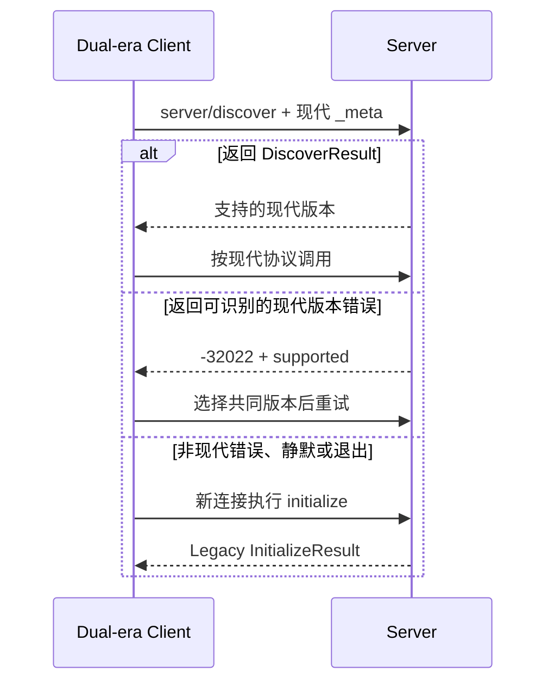

# MCP 协议：现代无状态请求、Legacy 握手与两种传输

MCP 协议规定 Client 与 Server 怎样描述版本、交换 JSON-RPC 消息、发现能力和返回结果。它位于 Host 的 Agent Runtime 与外部 Server 之间。协议能让不同语言的实现互通，但不负责模型规划、用户授权或业务事务。

以下机制以 `2026-07-28` 规范为准。该版本使用**每请求元数据**，不要求先建立协议 Session；`2025-11-25` 及更早版本则先执行 `initialize` 握手，规范把这类版本称为 Legacy。网上两种写法同时存在，通常来自协议版本差异。

SDK 包版本也不是协议日期。本文验证使用 Python `mcp==2.0.0`、Node `@modelcontextprotocol/server@2.0.0` 和 `@modelcontextprotocol/client@2.0.0`；它们支持 `2026-07-28`，也保留旧版本兼容能力。升级 SDK 时仍要查看其协议支持矩阵，不能只看数字大小。

## 一条现代请求包含什么

MCP 使用 JSON-RPC 2.0 的请求、响应和通知。现代请求在 `_meta` 中声明协议版本、Client 信息和 Client 能力：

```jsonc
{
  // JSON-RPC id 只负责把这次 tools/list 请求与响应配对。
  "jsonrpc": "2.0",
  "id": 7,
  "method": "tools/list",
  "params": {
    // 现代协议把版本、Client 身份说明和能力放进每一条请求。
    "_meta": {
      "io.modelcontextprotocol/protocolVersion": "2026-07-28",
      "io.modelcontextprotocol/clientInfo": {
        "name": "notes-host",
        "version": "1.0.0"
      },
      "io.modelcontextprotocol/clientCapabilities": {}
    }
  }
}
```

字段各有独立职责：

| 字段 | 作用 | 不代表什么 |
| --- | --- | --- |
| `jsonrpc` | 声明 JSON-RPC 版本 | MCP 协议版本 |
| `id` | 配对一条请求与响应 | 用户身份、业务幂等键 |
| `method` | 选择协议方法 | Tool 名称 |
| `_meta` | 携带本次请求的协议声明 | 可以信任的业务权限 |

现代协议不依赖“上一请求已经发过这些字段”。Server 按当前请求判断协议版本与能力，因此 HTTP 连接复用、stdio 子进程存活和聊天 Thread 都不能替代 `_meta`。

## `server/discover` 负责版本发现

现代 Server 必须实现 `server/discover`。Client 可以在第一次业务请求前调用它，取得 Server 支持的版本和能力；也可以直接发送业务请求，在版本不兼容时处理错误。

一次主动发现的请求形状如下：

```jsonc
{
  // Client 可在业务调用前主动询问 Server 支持的现代版本。
  "jsonrpc": "2.0",
  "id": 1,
  "method": "server/discover",
  "params": {
    // requested version 不被接受时，Server 返回 -32022 和 supported 列表。
    "_meta": {
      "io.modelcontextprotocol/protocolVersion": "2026-07-28",
      "io.modelcontextprotocol/clientInfo": {
        "name": "notes-host",
        "version": "1.0.0"
      },
      "io.modelcontextprotocol/clientCapabilities": {}
    }
  }
}
```

如果 Server 不支持请求版本，它返回 `UnsupportedProtocolVersionError`。规范分配的错误码是 `-32022`，并在 `data.supported` 中列出可接受版本：

```json
{
  "jsonrpc": "2.0",
  "id": 1,
  "error": {
    "code": -32022,
    "message": "Unsupported protocol version",
    "data": {
      "supported": ["2026-07-28", "2025-11-25"],
      "requested": "1900-01-01"
    }
  }
}
```

Client 可以从交集中选择版本后重试。如果没有交集，应报告明确的版本错误。它不能把版本不兼容悄悄改写成“工具不存在”，否则排障会从错误的层开始。

## Legacy 为什么需要 `initialize`

`2025-11-25` 及更早版本通过连接级握手建立版本和能力关系：

```text
Client -> Server: initialize
Server -> Client: InitializeResult
Client -> Server: notifications/initialized
Client -> Server: tools/list、tools/call ...
```

这条链对 Legacy Server 仍然正确。问题出在把它写成所有 MCP 实现永久不变的基础步骤。现代协议将版本、身份说明和能力移到每个请求，不再把 `initialize` 当必经入口。

Dual-era Server 可以同时支持两种语义：收到带现代 `_meta` 的请求时按现代协议处理；收到 `initialize` 开场时进入 Legacy 行为。Dual-era Client 则需要先判断对方属于哪个时代，再选择现代请求或旧握手。

## 自动探测并不等于随意回退

不同传输有不同兼容探测规则。以 stdio 为例，Dual-era Client 先对一次临时或当前连接发送 `server/discover`：



可识别的现代错误证明对方理解现代协议，此时应在现代版本中修正，不应降级。只有非现代结果才触发 Legacy 回退。判定结果还应按 Server 进程或 HTTP origin 缓存，避免每次调用重复探测。

本文伴随工程里的 Node Client 显式设置：

```ts
const client = new Client(
  { name: 'search-notes-cli', version: '1.0.0' },
  { versionNegotiation: { mode: 'auto' } },
)
```

Node v2 Client 的默认姿态仍是 Legacy；`mode: 'auto'` 才执行现代探测。Python v2 高层 `Client` 的默认 `mode` 是 `auto`。这属于 SDK 行为，不是规范要求所有 API 使用相同默认值。

## `tools/list` 返回能力目录

Server 声明 Tools 能力后，`tools/list` 返回工具名、描述、输入 Schema，并可带输出 Schema。现代版本还支持分页与缓存提示，Server 应保持稳定排序，减少 Host 每轮构造的工具描述无故变化。

`search_notes` 的目录项核心形状是：

```json
{
  "name": "search_notes",
  "description": "Search notes visible to the authenticated caller.",
  "inputSchema": {
    "type": "object",
    "properties": {
      "query": { "type": "string", "minLength": 1 },
      "limit": { "type": "integer", "minimum": 1, "maximum": 20, "default": 5 }
    },
    "required": ["query"],
    "additionalProperties": false
  }
}
```

目录是 Server 的能力声明，不是 Host 的最终工具列表。Host 仍要按当前用户、任务和策略过滤，再把允许项交给模型。一次 Agent Run 最好固定工具目录或 Schema 指纹，避免模型按旧结构计划、执行时却遇到新结构。

## `tools/call` 的成功与失败有两层

调用请求把工具名与参数放在 `params`：

```json
{
  "jsonrpc": "2.0",
  "id": 2,
  "method": "tools/call",
  "params": {
    "name": "search_notes",
    "arguments": { "query": "release", "limit": 2 }
  }
}
```

一条 JSON-RPC 成功响应仍可能表示 Tool 执行失败。需要分开处理：

- JSON-RPC `error`：未知方法、未知工具、协议参数或版本不成立，Client 通常以异常暴露；
- Tool result 的 `isError: true`：请求已进入 Tool 结果通道，但参数校验或执行报告失败，Host 可以把受控错误交给模型；
- 成功结果：`structuredContent` 符合 Tool 的输出 Schema，`content` 可提供文本表示。

本次实测中，越界 `limit=21` 返回 `isError: true`，Repository 调用次数保持为 0；调用不存在的工具则抛出 Protocol Error。两种失败不能共用一个“返回空数组”的分支。

现代成功结果包含 `resultType`。对普通完成结果，它是 `complete`；需要多轮补充输入的能力还可能返回 `input_required`。初次学习先把普通 `complete` 调用、错误和关闭走通，再引入 MRTR，避免把用户补充输入与 Tool 业务重试混在一起。

## 通知没有请求 ID

JSON-RPC Notification 没有 `id`，发送方不等待一一对应的响应。能力目录变化、日志或取消信号可以通过通知表达，但“没有响应”不等于“不需要错误处理”：接收方仍要验证 method、关联字段和当前状态。

现代取消语义还与传输绑定：stdio 使用 `notifications/cancelled`；Streamable HTTP 通过关闭本次响应流表示取消。[传输专题](/docs/ai-agent/mcp-transports-discovery-cancellation) 沿真实连接观察这两个动作，也解释为什么取消不能证明业务副作用没有发生。

## 手工检查一条请求

读到一条 MCP 消息时，按下面的顺序判断：

1. 它是 Request、Response 还是 Notification？
2. `jsonrpc` 与 `id` 是否符合消息类型？
3. 这是现代 `_meta` 请求，还是 Legacy 握手后的消息？
4. `method` 属于协议能力还是某个 Tool 名？
5. 错误来自 JSON-RPC、Tool result，还是 Tool 自己的业务状态？

这五步比背一张生命周期大图更实用。它能把“版本不支持”“工具未注册”“参数越界”和“搜索无结果”留在各自层级。


**为什么新版教程没有 `initialize`？**

因为 `2026-07-28` 使用每请求元数据。旧教程可能针对 `2025-11-25` 及更早版本，也可能使用默认进入 Legacy 模式的 SDK。排查时先看示例请求有没有现代 `_meta`，再核对规范日期、SDK 包和 Client 模式；若连接从 `initialize` 开始，就应按 Legacy 生命周期理解，不能把两套消息拼在一起。

**`server/discover` 是每次调用都必须先发吗？**

不是。Server 必须实现它，Client 可以主动调用，也可以直接发送带版本的业务请求并处理 `-32022`。Dual-era Client 常用它判断 Server 时代，判定后按 stdio 进程或 HTTP origin 缓存结果，不必每个 Tool 调用都重复探测；缓存假设失效时再探测，而不是把业务错误误判成协议降级信号。

**SDK 2.0 就一定使用 2026 协议吗？**

不能只看主版本。本文锁定的 Python 与 TypeScript v2 SDK 明确支持 `2026-07-28`，但 Client 默认模式不同，也可以主动连接 Legacy Server。验证时记录包锁版本、Client negotiation 配置和 `server/discover` 结果；只看到 `2.0.0`，不足以证明当前连接已经采用现代协议。

**JSON-RPC `id` 能用作 Tool call ID 或业务幂等键吗？**

不应混用。JSON-RPC `id` 只配对协议请求和响应；Tool call ID 连接模型候选与返回给模型的结果；业务幂等键保护外部副作用。连接重试时 JSON-RPC ID 可能变化，业务操作身份不能跟着丢失。日志应同时保存这三类关联字段，排查重复写入时先按业务幂等键查终态，而不是拿协议 ID 猜执行结果。

**`isError: true` 为什么不直接使用 JSON-RPC error？**

它们服务不同层。Tool 执行通道中的可解释失败可以作为 Tool result 返回，让 Host 或模型决定下一步；协议方法、版本或不存在的工具无法形成有效 Tool 结果，通常走 JSON-RPC error。Client 必须同时处理返回值和异常。

**现代协议无状态，是否意味着 Server 不能保存任何状态？**

不是。无状态指每个请求自行携带协议声明，不依赖初始化 Session。Server 仍可访问数据库、缓存或显式 Task 状态，但跨请求标识、权限和版本必须作为明确输入或可信上下文处理，不能依赖某条 HTTP 连接恰好还活着。

**Tool 目录变化后，进行中的 Agent 是否立刻换 Schema？**

通常不应。当前 Run 固定目录或 Schema 指纹，新 Run 再使用更新版本，否则模型可能按旧字段计划、却用新字段执行。安全下线可以立即阻断旧工具，但应返回明确的 `tool_unavailable` 并结束当前分支；不要静默换成名称相近的能力，也不要用参数错误掩盖版本变化。
