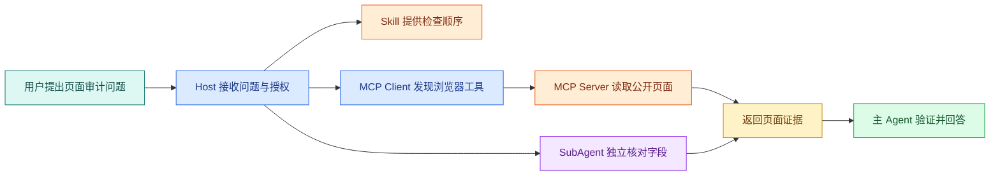

# MCP、Skill 与 SubAgent：先分清协议、方法和协作

假设我要让 Agent 完成一项工作：先读取网页，再按照固定规则检查页面，最后把独立的事实核对交给另一个执行单元。这里会同时出现 MCP、Skill 和 SubAgent，但它们没有在做同一件事。

- MCP 让 Agent **连接并调用外部能力**；
- Skill 告诉 Agent **这类任务应该怎样完成**；
- SubAgent 让主 Agent **把边界清楚的工作交给另一个上下文**。

这一篇先解决选型。协议报文、Node/Python Server、Skill 目录和 SubAgent 任务契约分别放到后面的独立文章，不再把几个重要概念压缩到三句话里。

## 先看三者怎样组合



图中的 Host 是用户直接使用的 AI 应用，例如 IDE 或桌面客户端。Host 读取 Skill 后知道审计步骤，通过 MCP Client 连接外部 Server，再把适合独立核对的任务交给 SubAgent。所有结果回到主 Agent 后还要验证，因为工具返回和子任务结论都只是输入材料，不会自动变成事实。

## MCP 解决“能力怎样连接”

MCP 全称 Model Context Protocol。Anthropic 在 2024 年 11 月公开它，目的不是再造一种模型，而是给 AI 应用与外部数据、工具之间建立一套通用协议。后来协议、SDK 和生态继续演进，所以开发时要同时锁定协议版本和 SDK 主版本，不能照抄早期示例。

### 没有 MCP 时会重复做什么

假设浏览器自动化、代码托管和设计工具都要接入三个不同的 AI 应用。没有统一协议时，每组组合都可能重新约定：

1. 服务怎样启动或连接；
2. 客户端怎样发现工具；
3. 参数用什么 Schema 描述；
4. 结果、错误、进度和取消怎样表示；
5. 连接何时关闭，断开后怎样处理。

MCP 标准化的是这层连接语言。Server 可以声明 Tools、Resources 和 Prompts，Client 可以发现并调用它们，Host 决定把哪些能力提供给模型。

### MCP 没有替你解决什么

MCP 不会自动完成业务认证、数据权限、审批、幂等或审计。一个 Server 暴露了 `search_notes`，只说明协议层可以调用它；当前用户能查哪些笔记，仍由 Server 根据可信身份和数据范围判断。

它也不保证返回内容可信。网页、仓库文件和工具描述都可能包含错误信息或提示注入。Host 仍要限制响应大小、标记来源、过滤敏感字段，并把返回值当作外部数据处理。

## Skill 解决“这类任务怎样做”

Skill 更接近一份可发现、可维护、可验证的任务说明。它可以包含入口文件、详细参考资料、确定性脚本、模板和资源。入口负责告诉 Agent 什么时候使用；正文负责执行顺序；脚本负责重复计算；模板负责输出稳定。

### Skill 不是更长的 Prompt

把两千行资料全部塞进一条 Prompt，会让每次任务都支付上下文成本，也会让不相关规则干扰当前问题。Skill 常用渐进式披露：

1. Agent 先看到名称和描述等触发元数据；
2. 任务匹配后读取 `SKILL.md`；
3. 遇到具体分支时再读取 `references/` 中对应文件；
4. 需要确定性检查时运行 `scripts/`；
5. 需要稳定交付格式时读取模板。

“渐进式披露”描述的是公开可观察的组织方式，不等于可以猜测某个产品没有公开的内部检索算法。不同 Agent 产品发现 Skill 的目录和优先级可能不同，应该以当前产品文档为准。

### Skill 也不会创造权限

如果 Skill 写着“读取仓库”，但运行环境没有仓库工具或用户授权，它不能凭文字获得访问能力。Skill 可以规定“先检查权限”，真正的访问仍由 Tool、MCP Server 或本地命令完成。

## SubAgent 解决“独立工作怎样委派”

SubAgent 是主 Agent 创建或调用的另一个执行上下文。它通常有自己的任务描述、上下文窗口、工具范围和结果格式。它的价值不是“多一个模型一定更聪明”，而是隔离上下文、并行处理独立任务，并让主 Agent 只接收结构化结果。

例如审查十篇文章时，可以把不同文章分给独立 SubAgent。若任务是“先修改同一个文件，再根据修改结果继续修改”，并行委派反而容易产生冲突。

一个适合委派的任务通常满足四个条件：

- 输入可以一次说清；
- 输出格式可以验证；
- 与其他任务共享状态很少；
- 失败不会让主任务失去所有上下文。

SubAgent 仍然继承或受限于权限边界。主 Agent 无权读取的数据，不能通过委派绕过；两个 SubAgent 同时改一个文件时，还需要所有权和冲突处理规则。

## Tool、Plugin、Prompt 和项目规则放在哪里

几个相近概念放在一张表里更容易判断：

| 机制 | 它保存或连接什么 | 典型输入 | 典型输出 | 是否自动获得外部权限 |
| --- | --- | --- | --- | --- |
| Tool | 一次可调用操作 | 结构化参数 | 结构化结果或错误 | 否，由运行时授予 |
| MCP | Client 与 Server 的协议会话 | JSON-RPC 消息 | Tools、Resources、Prompts 等能力 | 否 |
| Skill | 完成任务的方法和资源 | 用户任务与本地上下文 | 操作过程、报告或代码 | 否 |
| SubAgent | 一个独立执行上下文 | 边界明确的子任务 | 约定格式的结果 | 否 |
| Plugin | 产品可安装的一组扩展 | 产品清单和授权 | Skills、MCP、界面或其他资源 | 取决于产品 |
| Prompt | 发送给模型的指令或示例 | 文本与变量 | 模型输出 | 否 |
| `AGENTS.md` | 仓库内协作规则 | 项目范围内任务 | 对编辑、测试和交付的约束 | 否 |

Tool 是最小的动作契约；MCP 可以传递 Tool；Skill 可以指导 Agent 何时调用 Tool；Plugin 可以把多种能力打包；项目规则则约束 Agent 在特定仓库里怎样工作。它们可以组合，但职责不应混成一个“大 Agent 配置”。

## 当前 Codex 环境里可以怎样理解这些能力

不同机器的配置会变化，下面只列适合公开说明的能力类别，不代表每个 Codex 会话都默认拥有：

| 能力类别 | 更接近 MCP/工具还是 Skill | 适合完成什么 |
| --- | --- | --- |
| GitHub 连接 | 外部工具与应用连接 | 查看仓库、Issue、PR 和检查结果 |
| 浏览器控制 | 外部工具 | 打开页面、操作界面、做本地视觉检查 |
| Figma | MCP 与配套 Skill | 读取设计上下文、生成图表、连接设计与代码 |
| OpenAI 官方文档 | 专项 Skill 与文档能力 | 核对产品 API、参数和当前行为 |
| PDF、Word、PPT | 文档工具与 Skill | 读取、生成、渲染并检查文档 |
| 图片生成 | 模型工具 | 生成或编辑位图素材 |
| 文章写作 | Skill | 组织长文语气、证据和结构 |

这里刻意不列任何私有知识库、内部项目或业务平台能力。判断当前会话能否使用某项能力时，应查看实际工具和 Skill 清单，而不是从表格推断权限。

## 用三个问题做选型

### 场景一：让多个 AI 客户端查询同一套只读资料

重点是“同一能力被多个 Host 发现和调用”，优先把查询实现为 MCP Server。Server 内部仍要做身份、范围、超时和结果限制。

### 场景二：每次发布前都按同一套步骤检查

重点是“步骤、资料、脚本和输出格式可复用”，适合做 Skill。若检查过程要访问远程系统，Skill 再调用 MCP 或其他 Tool。

### 场景三：需要同时核对代码、文档和测试

三个任务输入相对独立，可以交给 SubAgent 并行处理。主 Agent 需要规定共同的结果 Schema，并在合并时解决冲突，不能把三个结论直接拼接。

## 一张可以直接带走的选择卡

```text
需要让多个 AI 应用连接同一外部能力？
  -> 先考虑 MCP。

需要把任务方法、检查规则、脚本和模板沉淀下来？
  -> 先考虑 Skill。

任务能独立描述、独立验证，并且并行有实际收益？
  -> 再考虑 SubAgent。

只是一次本地函数调用？
  -> 普通 Tool 或函数通常已经够用。

只是固定几步程序逻辑？
  -> 普通工作流更简单，不需要为了名词完整而同时引入三者。
```

检查这张卡是否用对的方法：把能力的输入、执行者、权限来源、输出、失败语义和所有者分别写出来。如果这些字段仍然混在一起，说明当前设计还没有真正分清协议、方法和协作边界。
