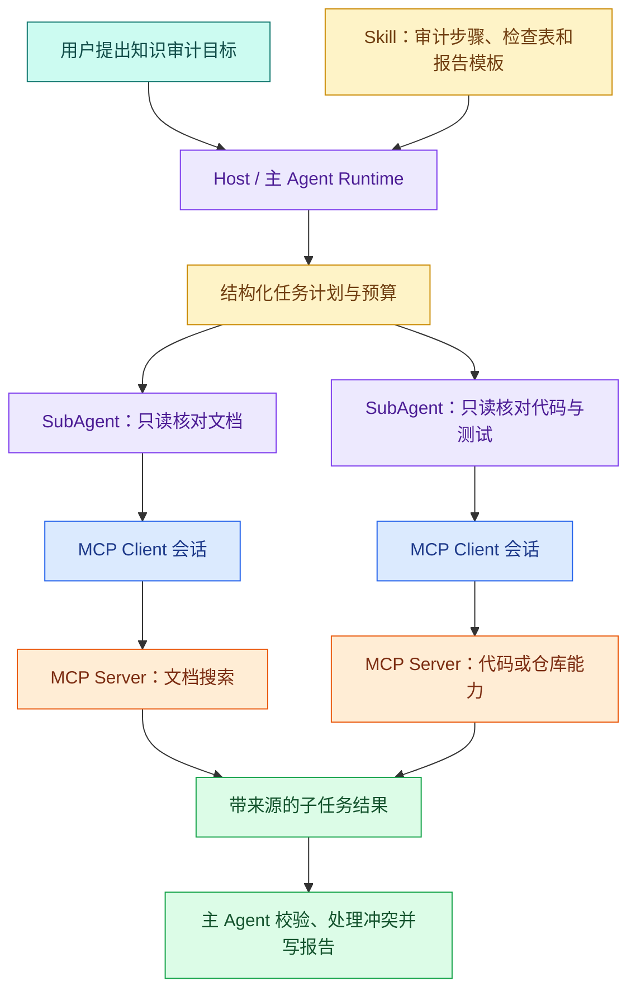

# MCP、Skill 与 SubAgent：连接能力、沉淀方法和隔离协作

假设你经常做“读取一组文档、调用搜索、核对实现、最后写审计报告”这类任务。三个需求很容易被混成一句“给 Agent 加能力”：让不同 AI 客户端都能调用文档搜索；让 Agent 每次都按同一套审计步骤工作；让代码核对和文档核对同时进行。

它们实际属于三层：MCP 让能力以协议形式连接，Skill 保存“这类任务怎样做”的方法，**SubAgent** 为一个可委派子任务提供独立上下文和执行生命周期。三者可以组合，但不能互相替代。

## 先用一句准确的话定义三者

- **MCP（Model Context Protocol）** 是 Host/Client 与 Server 之间交换能力和上下文的开放协议。它规定怎样协商、发现和调用 Tools、读取 Resources、获取 Prompts 等，不规定模型如何思考业务任务。
- **Skill** 是可复用的任务方法包。它通过元数据说明何时适用，通过正文、references、scripts、templates 或 assets 告诉 Agent 这类任务应该怎样完成和验证。
- **SubAgent** 是在独立上下文中执行一个有明确输入、权限、预算和输出契约的子任务实例。它解决隔离、并行和责任边界，不负责定义跨客户端协议。

一个是连接协议，一个是方法资产，一个是运行时协作单元。若只记住缩写而不理解输入和状态，设计时就会出现“把一份 Markdown 当远程服务”“为一个函数启动多个 Agent”这类过度设计。

## MCP 为什么出现，它解决了哪类重复工作

**MCP** 在 2024 年末公开发布，目标是让 AI 应用用一致方式连接外部数据和工具。此前每个 AI Host 往往为每个数据库、文件系统、协作平台写一套私有插件协议：认证、工具描述、请求响应、错误和连接生命周期重复实现。

MCP 把这层连接标准化。Server 可以暴露 Tools、Resources、Prompts；Host 为每个 Server 建立 Client 会话，完成版本与能力协商，再把允许的能力交给模型或 UI。相同 Server 可以被多个兼容 Host 使用，能力实现不必嵌入每个模型应用。

它解决的是“怎样连接和交换”，没有自动解决：

- Server 业务逻辑是否正确；
- 用户是否有权限调用；
- 工具返回是否可信；
- 模型何时应该调用；
- 任务需要哪些步骤和验收标准；
- 远程服务的容量、SLO 和数据治理。

因此，把普通 HTTP API 包一层 MCP 并不会自动变成安全 Agent。MCP Server 仍要实现认证、授权、Schema、超时、日志和最小副作用。

## Skill 为什么不是一段更长的 Prompt

一次性 Prompt 属于当前对话，适合表达本次目标和限制。**Skill** 面向重复任务，需要稳定触发条件、分层资料、可运行脚本和验证产物。它通常有目录结构和版本，能被多个项目或用户复用。

Skill 的核心价值是**渐进式披露**：Agent 先根据名称和 description 判断是否相关；命中后读取 `SKILL.md` 主流程；只有某个分支需要时才加载 references、脚本或模板。这样不必把所有领域说明永久塞进 System Prompt。

Skill 也不会创造新权限。正文写“查询数据库”并不代表 Agent 已拥有数据库工具；它只能编排当前环境允许的 MCP、CLI、浏览器或文件工具。脚本同样受沙箱、审批和项目规则约束。

## SubAgent 为什么不等于“再调用一次模型”

普通模型调用可以生成文本，但 SubAgent 还需要任务身份、独立上下文、工具权限、预算、状态和结果契约。主 Agent 把一个边界清晰的目标委派出去，例如“只读检查这五个测试文件，并返回失败用例表”；SubAgent 可以独立读取和验证，再把结构化结果交回主 Agent。

独立上下文能减少互相污染，也能并行执行不依赖的任务。代价是每个 SubAgent 都有上下文和模型成本，结果还可能冲突。主 Agent 必须负责拆分、取消传播、去重和确定性合并，不能简单让多个模型“投票”。

有顺序依赖或共享写状态的任务不适合直接并行。例如先改数据库 Schema、再改 Repository，后者依赖前者决定；两个 SubAgent 同时编辑同一文件也容易覆盖。可以先串行产出契约，再并行处理互不重叠模块。

## 三者怎样组合成一个系统

用户把目标交给 Host。Skill 给出审计流程和报告标准，主 Agent 将其转成有预算的任务计划。两个 SubAgent 在独立上下文里执行文档与代码核对，各自通过 MCP Client 调用允许的 Server。子任务返回带来源的结构化结果，主 Agent做权限复查、冲突处理和最终报告。

这张图不是说每个审计都需要两名 SubAgent。数据量小、步骤短时，主 Agent 顺序调用本地 Tool 更简单。只有连接需要复用时引入 MCP，方法需要复用时创建 Skill，任务能独立并行且收益大于成本时使用 SubAgent。

## 从五个维度比较

| 维度 | MCP | Skill | SubAgent |
| --- | --- | --- | --- |
| 主要输入 | 协议请求、参数、会话能力 | 用户任务和渐进加载的说明 | 子任务契约与最小上下文 |
| 内部状态 | 连接、协商版本、能力、请求 ID | 版本化文件与脚本，不一定有运行状态 | task、上下文、预算、事件和终态 |
| 处理者 | MCP Client/Server | 当前 Agent 按说明执行 | 独立 Agent Runtime |
| 输出 | Tool/Resource/Prompt 结果或协议错误 | 工程产物、报告、变更或判断 | 结构化子任务结果 |
| 生命周期 | 连接建立到关闭/重连 | 安装、触发、读取、执行、升级 | 创建、运行、完成/失败/取消 |
| 权限来源 | Host 与 Server 双侧策略 | 不新增权限，继承当前环境 | 显式委派的最小权限 |
| 常见风险 | 远程返回不可信、过宽授权 | 触发过宽、说明过载、脚本越界 | 上下文泄露、成本、冲突、失控并行 |

## Tool、MCP、Plugin、Prompt 和项目规则放在哪一层

### Tool

Tool 是模型可提议调用的一项具体能力，例如 `search_notes`。它可以是进程内 Python 函数，也可以由 MCP Server 暴露。只有一个 Host 使用、无需跨进程复用时，本地 Tool 往往足够。

### MCP

MCP 把 Tools/Resources/Prompts 放到标准连接上。它适合跨语言、跨进程或多个 Host 复用，并提供明确发现和生命周期。它不是 Tool 的替代词：一个 Server 可以有多个 Tool，一个 Tool 也可以不通过 MCP。

### Plugin

Plugin 通常是可安装分发包，可包含 Skills、MCP 配置、Hook、命令、资产或 UI。它解决“如何把一组扩展能力交付给用户”，范围比单个 Skill 或 MCP Server 大。不同产品的 Plugin 规范不同，不能假设通用。

### Prompt

Prompt 适合当前任务的目标、上下文和输出要求。需要跨任务复用、依赖脚本/参考资料和版本管理时，再提升为 Skill。不要把几百页规则永久塞进 Prompt。

### `AGENTS.md` / `CLAUDE.md`

项目规则保存仓库内长期约定，例如命令、目录边界、测试和发布限制。它们作用于该项目，不应拿来分发一个跨项目领域方法。Skill 可以引用项目规则，但不能覆盖更高优先级的用户和安全限制。

## 三个具体场景怎样选择

### 场景一：不同 AI 客户端查询同一套只读资料

核心问题是连接复用。先把搜索实现为受控 Tool，再由 MCP Server 暴露。Skill 可选，用来教 Agent 先查哪些字段；SubAgent 通常不需要。若只是一个应用内部函数，先不引入 MCP。

### 场景二：每次发布前都按固定步骤检查

核心问题是方法复用。创建 Skill，写清输入、步骤、失败边界、验证命令和报告模板。需要访问 CI 或仓库时调用现有 Tool/MCP。检查项少时由主 Agent执行，无需 SubAgent。

### 场景三：同时核对代码、文档和测试

核心问题是可独立并行的研究工作。Skill 定义总流程，主 Agent按文件范围创建三个不重叠的 SubAgent 任务，每个只拿所需工具和 Scope。MCP 只有在相关数据源通过该协议提供时才加入。

### 场景四：一个本地纯函数计算日期

直接写函数或 Tool。它没有跨客户端连接、复杂方法资产和独立上下文需求，MCP、Skill 与 SubAgent 都会增加维护成本。

## 当前 Codex 环境中哪些公开能力值得认识

不同安装和账号可用能力不同，不应把当前环境清单当成所有用户默认配置。公开、通用的 MCP/连接方向包括官方文档检索、GitHub 仓库与 PR、浏览器自动化、Figma 设计数据等；适合的 Skill 方向包括 PDF/Word/演示文稿处理、电子表格、图片生成、UI 设计审查和 Skill 创建。

选择时先看数据是否实时或受权限保护。实时 GitHub 状态、授权文档和设计文件适合连接器/MCP；“怎样写技术文章”“怎样验证 PDF”适合 Skill。不要把密钥、内部路径或业务数据写进 Skill；也不要为了让模型“知道”静态规则而搭一个远程 MCP。

## 权限在组合系统中如何传递

组合不是权限相加。主 Agent有某工具，不代表所有 SubAgent 自动继承；Skill 提到某能力，不代表环境允许；MCP Client发现某工具，也不代表当前用户能调用。

一条安全的授权链是：当前用户身份产生 Runtime Scope；主 Agent按子任务缩小 Scope 和工具集；MCP Client只暴露允许的 Server 能力；Server再次认证授权；结果返回后主 Agent复查来源与范围。任何一层都不能从不可信文本读取新的权限。

## 错误怎样向上游传播

MCP 连接失败、Skill 脚本失败和 SubAgent 超时不是同一种错误：

| 失败层 | 可观察状态 | 上游动作 |
| --- | --- | --- |
| MCP 进程未启动/HTTP 不通 | transport/connect error | 检查命令、网络、TLS，不原样重试业务调用 |
| MCP 协商不兼容 | initialize/capability error | 停止并报告版本，不降级猜协议 |
| Tool 业务无结果 | successful empty result | 改写查询或安全拒答 |
| Skill 触发不匹配 | 未加载或显式拒绝 | 使用普通任务流程 |
| Skill 脚本错误 | 命令、退出码、stderr | 修复输入/环境，不编造报告 |
| SubAgent 超时/取消 | task terminal event | 取消依赖任务，决定部分结果是否可用 |
| 子结果冲突 | merge conflict | 回到来源证据或要求确认，不投票 |

错误要保留层次和关联 ID，否则主 Agent只能给用户一句“Agent 失败”，无法排查连接、方法还是协作问题。

## 用决策树完成本篇实践

拿到一个“给 Agent 加能力”的需求，按顺序回答：

1. 能力是否只是当前进程内的确定性函数？是就先写 Tool/函数。
2. 是否需要多个 Host、语言或进程以统一协议连接实时数据/动作？是则考虑 MCP。
3. 是否有一套会重复执行、包含资料、脚本和产物标准的方法？是则考虑 Skill。
4. 是否能拆出上下文、权限和输出都独立的子任务，并且并行收益足够？是则考虑 SubAgent。
5. 组合后，谁拥有身份、Scope、Deadline、错误和最终结果？若说不清，先不要增加层次。

最终产出一张表：需求、最小能力、是否跨进程、是否实时数据、是否重复方法、是否独立上下文、权限所有者、失败终态、验证方式。它比“我们用 MCP + 多 Agent”这样的架构名词更能指导实现。

## 常见问题

### 已经有 HTTP API，为什么还要考虑 MCP？

HTTP 解决网络传输，MCP 在它之上约定了 AI Host 怎样发现能力、读取 Schema、调用工具和处理协议生命周期。若只有一个应用调用固定接口，直接写适配器通常更简单；当多个兼容 Host 需要复用同一组 Tools、Resources 或 Prompts，并希望统一发现与调用语义时，MCP 才能减少重复连接代码。原有 API 的认证、授权和业务逻辑仍应保留，不能因为套上 MCP 就重写成另一套权限系统。

### Skill 里写了一个脚本，它是不是就等于 Tool？

不是。脚本是 Skill 目录中的确定性资源，Skill 说明在什么条件下、以什么参数运行它以及怎样解释结果；Tool 是 Runtime 暴露给模型候选调用的一次输入输出能力。某个脚本可以被 Shell Tool 执行，也可以被 MCP Server 封装，但它本身没有自动发现、参数 Schema、权限上下文和调用结果协议。设计时先判断脚本是否只服务这一套方法，再决定是否值得提升为可复用 Tool。

### 一个 Skill 可以同时调用多个 MCP Server 吗？

可以，因为 Skill 描述的是完成任务的方法，而 MCP 提供外部能力连接。例如页面审计 Skill 可以从浏览器连接读取渲染结果，从代码仓库连接核对模板，再运行本地脚本整理字段。但调用前仍要检查当前环境是否真的提供这些能力，并为每个连接分别处理认证、Scope、超时和不可信返回。Skill 不能把不存在的工具“写出来”，也不能用说明文字覆盖 Host 或 Server 的权限限制。

### SubAgent 和普通并发模型调用有什么本质差异？

并发模型调用只是同时获得多段文本；可管理的 SubAgent 还需要任务 ID、最小上下文、工具白名单、数据范围、Deadline、预算、结果 Schema 和终态。主 Agent 还要传播取消、校验回传结果并按来源处理冲突。若这些状态都没有，系统只是并发 Prompt，无法回答某个子任务访问了什么、为何失败、是否还能使用部分结果，也很难阻止迟到结果覆盖已经取消的主任务。

### Plugin 与 Skill、MCP 的关系为什么容易混淆？

Plugin 通常是分发容器，不同产品可以在其中打包 Skill、MCP 配置、Hook、命令、资源甚至 UI。Skill 是任务方法，MCP 是能力连接协议，两者解决的问题更具体。安装一个 Plugin 可能同时新增方法和连接，但不能据此认为三者协议相同。评估时应展开包内容，逐项检查它新增了哪些文件、进程、网络权限和触发规则，而不是只看一个插件名称。

### 什么时候应该退回单 Agent 和本地函数？

当任务短、输入都在当前上下文、没有跨 Host 复用需求、子步骤存在强顺序依赖时，本地函数或单 Agent 往往更可靠。引入 MCP 会增加连接与版本故障，引入 Skill 会增加维护资产，引入 SubAgent 会增加上下文成本、取消和合并状态。先测量当前瓶颈：若问题只是一个确定性日期计算，函数已经足够；只有连接重复、方法重复或独立研究等待明显时，再增加对应层次。
