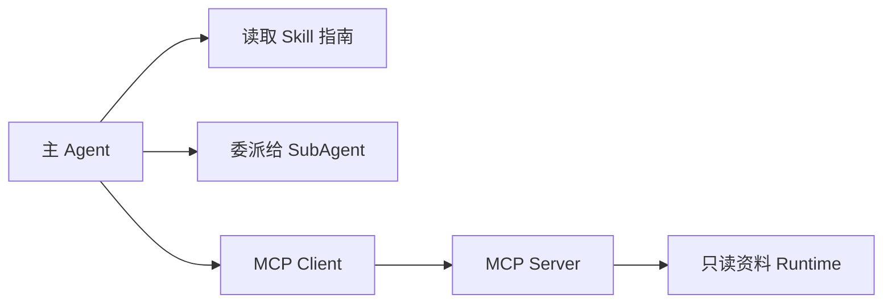
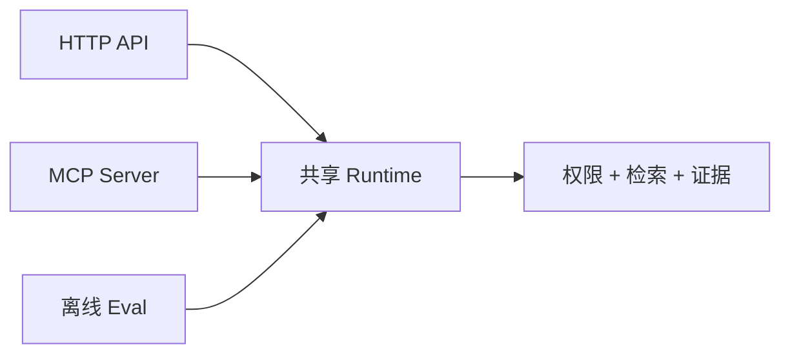

# MCP、Skill 与 SubAgent 的职责边界

同一个“查询资料”能力想被桌面客户端、IDE、离线评测和主 Agent 使用。应该做成 MCP、Skill，还是再创建一个 SubAgent？这三个名词经常一起出现，但解决的问题不在同一层。

先给结论：MCP 解决客户端怎样发现和调用外部能力；Skill 解决 Agent 应该怎样完成一类任务；SubAgent 解决主 Agent 怎样把一个有独立上下文的子任务委派出去。

## 先用一张图分层



Skill 通常是本地说明、模板或脚本；SubAgent 是另一个受控执行上下文；MCP 是 Client 和 Server 之间的协议。一个 SubAgent 可以读取 Skill，也可以作为 MCP Client 调工具，它们不是互斥选项。

## MCP：标准化连接和能力发现

Model Context Protocol 使用客户端—服务端模型。Host 是用户使用的应用，里面运行一个或多个 MCP Client；每个 Client 与一个 MCP Server 建立连接。Server 可以暴露 Tools、Resources 和 Prompts 等能力。

### 连接生命周期

典型过程如下：

1. Client 建立传输连接；
2. Client 发送 `initialize`，双方交换协议版本和能力；
3. Server 返回自身信息与能力；
4. Client 发送 `notifications/initialized`；
5. Client 列出工具或资源；
6. 运行期间发起调用、进度、取消等消息；
7. 连接关闭，Server 释放资源。

能力协商很重要。客户端不能假设所有 Server 都支持同一组特性；Server 也不能在未声明时使用客户端不认识的能力。

### 只读知识工具怎样暴露

可以暴露 `search_knowledge` 和 `read_evidence` 两个工具。MCP 层只做协议适配：认证调用方、解析参数、调用共享 Runtime、映射结果和错误。HTTP API、MCP 和离线 Eval 不应该各复制一套检索和权限逻辑。



这个边界让三种入口得到相同权限和证据语义。MCP 不是把内部函数自动公开；每个工具仍需要白名单、Schema、超时、输出限制和审计。

## Skill：把完成任务的方法封装成可发现知识

Skill 可以包含任务说明、适用条件、步骤、参考资料和可复用脚本。例如“SEO 页面审计 Skill”会告诉 Agent 先检查真实 GET、原始 HTML、渲染 DOM、robots 和 Sitemap，再给证据化建议。

Skill 的价值是把组织方法和领域知识从一次 Prompt 中抽出来。它不天然提供远程连接，也不代表拥有某项权限。Skill 写着“查询数据库”，但运行环境没有受控工具时，它仍然不能访问数据库。

好的 Skill 要说明：何时触发、需要什么输入、按什么顺序执行、什么不能做、如何验证。不要把所有领域资料放进一个超长 Skill，应该按任务渐进加载。

## SubAgent：用独立上下文处理可分离子任务

主 Agent 可以把“核对框架官方文档”和“检查测试覆盖”分别委派给两个 SubAgent。每个 SubAgent 有独立上下文、工具与输出契约，主 Agent 最后合并结果。

适合委派的任务通常具有三个特征：

- 子任务目标和交付物清楚；
- 与主任务可以并行或独立验证；
- 单独上下文能减少主 Agent 的信息负担。

不适合为了“看起来像多 Agent”拆分强耦合步骤。若两个角色不断交换同一份状态，通信开销和不一致风险可能大于收益。

SubAgent 不会扩大权限。主 Agent 无权读取的资料，不能通过委派绕过；工具和数据范围仍由运行时授予。

## 同一个需求怎样选择

| 需求 | 优先机制 | 原因 |
| --- | --- | --- |
| 多种客户端调用同一资料服务 | MCP | 需要标准协议、发现和调用 |
| 告诉 Agent 怎样执行发布检查 | Skill | 需要稳定步骤与规则说明 |
| 并行核对两类独立证据 | SubAgent | 需要隔离上下文和并行产出 |
| IDE 中按团队方法查询资料 | MCP + Skill | MCP 提供能力，Skill 提供方法 |
| 主 Agent 委派检索专项研究 | SubAgent + MCP | 子任务独立，仍通过受控协议访问工具 |

## MCP 的信任边界

无论 Server 是本地进程还是远程服务，都要把返回视为不可信数据：

- 本地 Server 可能来自第三方包；
- 远程 Server 可能返回恶意内容；
- 工具描述本身可能诱导模型扩大操作；
- Resource 中可能包含提示注入；
- 连接断开可能让调用结果未知。

Host 应向用户展示 Server 来源和请求的能力，最小化凭证范围，隔离不同 Server，并在敏感工具调用前保留明确控制。只读知识 Agent 不注册写工具，能直接减少审批、幂等和补偿的复杂度。

## 动手画一份能力封装

场景：一个团队规范查询能力，需要在 IDE 和管理后台使用；Agent 还要知道“先检索、再核对引用”。

合理拆分是：

1. 共享 Runtime 实现权限、检索和证据；
2. HTTP API 供管理后台调用；
3. MCP Server 供 IDE 和 Agent Client 调用；
4. Skill 说明查询、引用和无证据处理步骤；
5. 只有跨多来源研究时才创建 SubAgent。

验证时检查：HTTP 与 MCP 对同一身份和查询得到相同范围；MCP 断线有明确错误；恶意资料不会改变工具权限；SubAgent 输出只包含约定字段。

## 带到工作的判断卡

```text
需要解决的是：协议连接 / 任务知识 / 子任务委派
能力实际运行在哪里：
谁负责认证和权限：
谁持有凭证：
返回内容是否不可信：
是否需要独立上下文：
是否能用普通函数或工作流更简单完成：
选择：MCP / Skill / SubAgent / 组合
```

下一章进入 RAG 数据导入。Agent 要使用知识，第一步不是立刻做向量，而是把文档解析成结构完整、可追溯、可重建的数据。

## 参考资料

- [Model Context Protocol Architecture](https://modelcontextprotocol.io/docs/learn/architecture)
- [Model Context Protocol Specification](https://modelcontextprotocol.io/specification/latest)
- [OpenAI Agents SDK：Agents as Tools 与 Handoffs](https://openai.github.io/openai-agents-python/multi_agent/)

