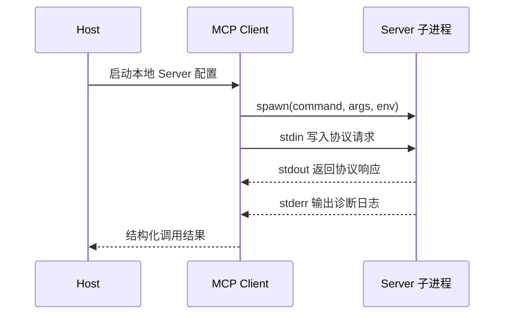
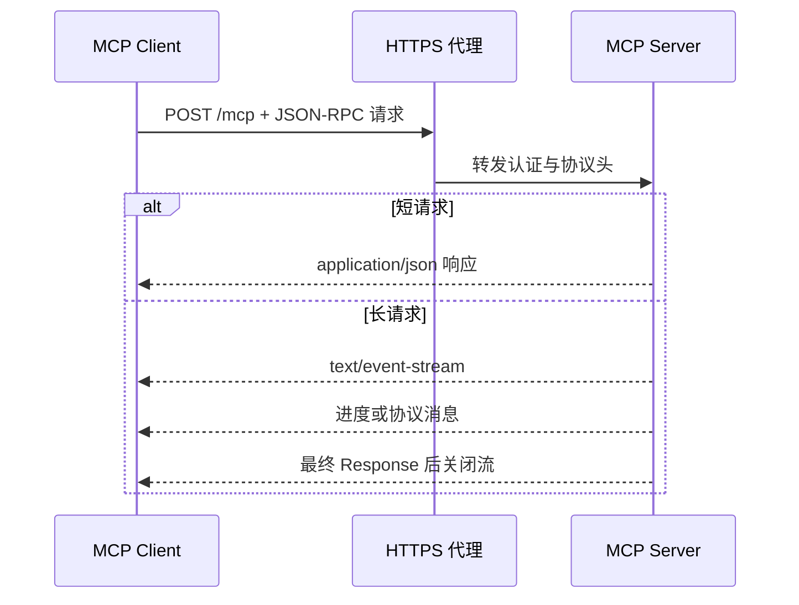
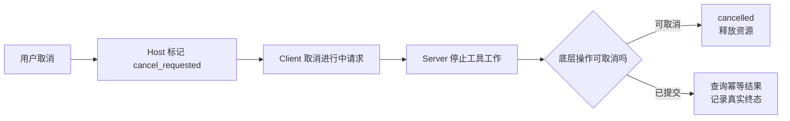

# MCP 传输与生命周期：stdio、Streamable HTTP、Legacy SSE、发现、取消和重连

MCP Client 调用 `search_notes` 时，业务参数可能完全相同，底层却有两条不同路径：本地 Host 启动子进程，通过 stdin/stdout 交换协议消息；远程 Host 向 HTTPS 端点发送请求，响应可能是普通 JSON，也可能是 SSE 流。

传输只负责搬运消息，不改变 Tool 契约。真正容易出错的是把传输、协议和业务状态混成一层：stdio Server 在 stdout 打日志会破坏协议；HTTP 连接断开后盲目重发调用可能重复副作用；旧 SSE 示例的 GET 端点也不应该被当成当前 Streamable HTTP 的默认结构。

## 一次调用同时经历四层状态

| 层 | 典型状态 | 失败示例 |
| --- | --- | --- |
| 进程/网络 | starting、connected、closed | 子进程退出、DNS/TLS 失败 |
| 传输 | stdin/stdout、HTTP request、SSE stream | 非协议输出、代理缓冲、连接中断 |
| 协议 | discovered、request pending、response received | JSON-RPC ID 不匹配、未知 method |
| 业务 | searching、ok、empty、denied | 参数错误、无结果、权限拒绝 |

“连接成功”只证明前两层基本可用，不代表 tools/list 成功，更不代表 `search_notes` 有权限返回数据。排障要沿层向下，不要把 HTTP 502 映射成“没有搜索结果”。

## stdio：一对父子进程的协议管道

stdio 模式通常由 Client 启动 Server 子进程。Client 写 Server 的 stdin，读取 Server 的 stdout；Server 日志写 stderr。



stdout 是协议通道。`print("server started")` 若默认写 stdout，Client 可能把它当协议消息解析并报错；Python 日志应配置到 stderr。环境变量也要最小化传递，不能把 Host 的全部凭证交给不相关 Server。

stdio 的优点是无需监听端口、适合本机工具、进程权限容易跟随当前用户；限制是 Server 和 Host 必须在同机，多个 Host 往往各自启动进程，升级和资源占用由本地管理。

## Streamable HTTP：请求和可选流式响应

远程连接使用 HTTP 端点。短请求可以返回单个 JSON 响应；长请求可以用 SSE 逐步发送属于该请求的消息。具体 Session、版本发现和恢复能力随协议版本与 SDK 实现变化，Client 必须按协商结果执行，不能用旧示例猜当前行为。



代理需要保留必要 Header、合理设置请求体与读超时，并避免缓冲需要实时到达的 SSE。HTTP 层认证通常使用 OAuth 或其他明确机制；`prompt_cache_key`、JSON-RPC ID 或 MCP Session 都不是用户身份。

## Legacy SSE 为什么仍会出现在配置里

早期 HTTP+SSE 传输常用一个 GET SSE 端点接收 Server 消息，再通过另一个 HTTP 端点提交 Client 消息。Streamable HTTP 后来将交互收敛到 MCP HTTP 端点和请求级响应流。

旧 Server 可能仍在运行，SDK 也可能保留兼容能力，所以文档和配置中还能见到 `sse`。兼容策略应显式记录：优先尝试的传输、允许回退的旧协议、弃用时间和测试矩阵。不要看到 HTTP 中出现 SSE 就断言它一定是 Legacy SSE；Streamable HTTP 的长响应同样可以使用 SSE 编码。

## 发现不是启动时只做一次的魔法

Client 需要知道 Server 提供哪些能力及 Schema。以 Tool 为例，发现结果至少包含名称、描述和输入 Schema；Host 再执行本地过滤，决定当前用户和任务能看到哪些 Tool。

```text
连接可用
→ 协议版本与能力关系建立
→ Client 请求工具目录
→ Server 返回分页或完整目录
→ Client 校验名称与 Schema
→ Host 按策略生成当前工具视图
→ 模型只能在当前视图中提出 ToolCall
```

目录可能变化。Client 应按协议通知或重新发现策略刷新，但进行中的 Run 要固定工具版本或 Schema 指纹，避免第一步按旧 Schema 计划，第二步突然按新 Schema 执行。

## JSON-RPC ID、Tool call ID 与业务幂等键不同

这三个 ID 经常被误用：

- JSON-RPC `id` 配对一条协议请求与响应；
- Tool call ID 配对模型提出的动作与返回给模型的结果；
- 业务幂等键防止外部副作用被重复执行。

连接断开后，Client 换一个 JSON-RPC ID 重新请求，不代表业务操作可以安全重做。只读搜索通常可以重试，但发送消息、创建工单等 Tool 必须使用业务幂等键，并先查询前一次结果。

## 取消是请求停止信号，不是“删除历史”

用户取消后，Host 先将当前 Run 标为取消请求，再通知 Client 停止进行中调用。Client 通过协议/传输取消 Server 工作；Server 将信号传播到底层 HTTP、数据库或子进程，并返回或记录取消终态。



关闭 HTTP 流或结束 stdio 进程可能中断传输，但业务操作是否已完成仍要查询。不能因为 Client 没收到响应就断言 Server 没有写入。只读 `search_notes` 可以丢弃迟到结果；写 Tool 必须记录操作 ID 和最终状态。

## 重连要先判断“丢了连接”还是“丢了事实”

stdio 子进程退出后，Client 可以按策略重新启动并重新发现能力；进行中的请求通常已经失败。远程 HTTP 短请求断开时，Server 可能仍在执行。恢复顺序应是：

1. 记录原请求、Tool call 与业务幂等键；
2. 判断操作是否只读或可安全重放；
3. 若有状态查询接口，先查询原操作；
4. 重新建立连接并确认协议/能力版本；
5. 只在剩余 Deadline 内有限重试；
6. 把“原请求未知”与“明确失败”分成不同状态。

指数退避可以降低故障放大，但不替代幂等。多个 Client 同时重连还要加入抖动，避免 Server 恢复瞬间被请求峰值再次压垮。

## 两种传输怎样选

| 约束 | stdio | Streamable HTTP |
| --- | --- | --- |
| 运行位置 | 与 Host 同机 | 可远程部署 |
| 分发 | 本地命令、包管理器 | URL 与服务发布 |
| 身份 | 进程用户、显式环境配置 | HTTPS 与明确认证 |
| 多客户端 | 通常各自进程 | 服务端可统一承载 |
| 网络治理 | 不需要公网端口 | 代理、TLS、限流、负载均衡 |
| 日志风险 | stdout 污染协议 | 代理缓冲和 Header 丢失 |
| 适合 | 本地文件、个人开发工具 | 团队共享、集中数据与审计 |

本地访问用户文件通常优先 stdio，权限随用户进程控制；集中数据查询通常更适合 HTTPS，因为认证、审计和版本可以统一管理。远程并不天然更“生产级”，本地也不天然更安全，关键看最小权限、更新链和可观测性。

## 一份分层 Runbook

遇到调用失败，按以下顺序检查：

```text
1. 进程/网络：Server 是否存活，DNS/TLS/代理是否可达
2. 传输：stdout 是否混入日志，Content-Type 与流是否被缓冲
3. 协议：版本、method、ID、Schema 与分页是否正确
4. Host 策略：Tool 是否被当前用户和任务允许
5. 业务：参数、Scope、Release、Deadline 与依赖是否通过
6. 终态：失败、取消、超时、未知结果是否被正确区分
```

`tools/list` 成功只能覆盖前面几层的一部分。还要测试合法调用、参数错误、空结果、超时、取消、Server 重启和能力变化。

## 常见问题

### stdio 是单向通信吗？

不是。Client 写 Server stdin，Server 从 stdout 返回消息，组成双向请求/响应关系。stdin 和 stdout 每条管道本身有方向，但整体协议交互是双向的。stderr 留给诊断日志。

如果调用一直等待，先检查 Server 进程是否存活、stdin 是否仍打开、stdout 是否混入普通日志，再按 JSON-RPC ID 查响应是否配对。仅看到进程存在不足以证明协议已完成发现；Host 还要分别记录启动、能力发现和业务调用状态。

### Streamable HTTP 是否一直保持一个长连接？

不能这样泛化。短请求可以是普通 HTTP 请求/响应，长请求可以使用 SSE 流；协议版本和实现还可能有会话或订阅能力。应按当前规范与 SDK 契约测试，不要把 WebSocket 或旧 SSE 心智模型直接套用。

### HTTP 200 是否代表 Tool 成功？

不代表。HTTP 200 只说明传输层返回了可处理响应；JSON-RPC 可能包含协议错误，Tool result 也可能是 `empty`、`denied` 或依赖失败。监控要分别记录 HTTP、协议和业务状态。

排查时先保存响应 Content-Type 和请求 ID，再解析 JSON-RPC 的 `result` 或 `error`，最后读取 Tool 自己的结构化状态。把三层状态压成一个布尔值，会让参数校验失败看起来像网络故障，也会让权限拒绝被误报成空结果。

### 连接断开后为什么不能立刻重试？

因为请求可能已经到达 Server 并产生副作用，只是响应丢失。先看 Tool 是否只读、是否有业务幂等键和状态查询；确认可安全重放后，才在剩余 Deadline 内有限重试。

日志至少关联 JSON-RPC ID、业务操作 ID、发送时间和断开阶段。若 Server 支持状态查询，先查询原操作；无法确认且操作有副作用时返回 `outcome_unknown`，交给人工或补偿流程。把网络断开直接映射成“未执行”会制造重复写入。

### Legacy SSE 与响应里的 SSE 有什么区别？

Legacy SSE 指早期独立 GET 事件通道加消息提交端点的传输结构；Streamable HTTP 也可为某次请求返回 `text/event-stream`。判断依据是端点和协议生命周期，不是只看 Content-Type。

接入旧 Server 时应先锁定其协议日期和 SDK 版本，再按旧生命周期测试；不要只因为响应是 SSE 就把现代 Client 配成 Legacy 模式。迁移时用同一份能力发现与工具契约测试两套传输，确认业务结果一致后再移除旧端点。

### 为什么 Server 日志不能写 stdout？

stdio 模式下 stdout 承载协议帧。普通日志会让 Client 解析到非法消息，表现为随机 JSON 错误或连接失败。日志写 stderr，并避免输出凭证和完整工具结果。

遇到 `parse error` 时可以把 stdout 原始字节保存到隔离测试日志，确认每一帧是否都是协议消息；再检查依赖库是否在启动时打印 banner。修复后用进程内 Client 连跑发现与调用，确保 stderr 日志再多也不会改变响应帧。

### 取消后 Server 仍返回结果怎么办？

Host 以当前 Run 的取消/终态锁决定是否接受迟到结果。只读结果可以记录耗时后丢弃；已提交副作用要查询真实状态并审计，不能用取消标记抹掉事实。Client 还应释放本地 pending request。

### 能力目录变化时，进行中的 Agent 应该立刻使用新 Schema 吗？

通常不应。一次 Run 固定工具目录或 Schema 指纹，保证计划和执行一致。新连接或新 Run 再使用更新目录。安全紧急下线可以立即阻断调用，但要产生明确 `tool_unavailable`，不能静默换成相似工具。
