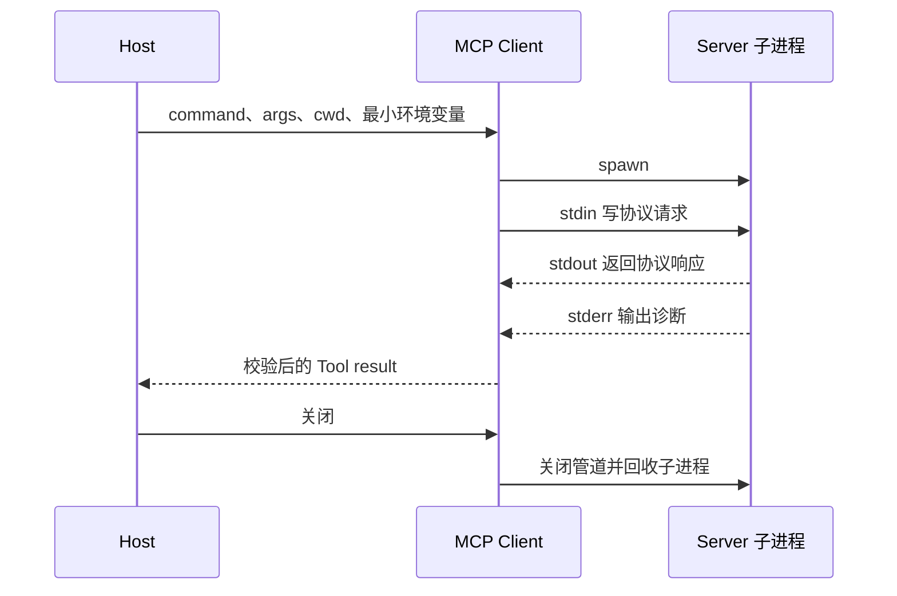
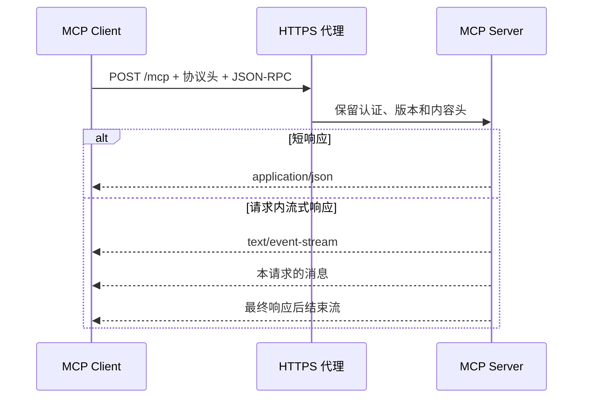
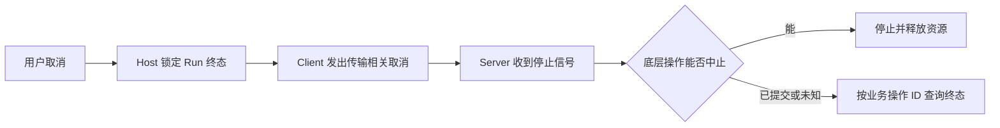

# MCP 传输与生命周期：stdio、Streamable HTTP、Legacy SSE、发现、取消和重连

## 传输与生命周期分别负责什么

MCP 传输负责在 Client 与 Server 之间搬运协议消息。stdio 使用父子进程的标准输入输出，适合同机能力；Streamable HTTP 使用远程 HTTP 端点，适合共享服务。它们不改变 `search_notes` 的输入输出 Schema，却决定进程怎样启动、日志写到哪里、取消怎样送达，以及连接中断后还能确认哪些事实。

最常见的误判，是把“传输已连接”当成“工具已成功”。一次调用至少有四层状态：

| 层 | 可观察证据 | 典型失败 |
| --- | --- | --- |
| 进程或网络 | 子进程 PID、DNS、TLS、HTTP 状态 | 命令不存在、证书失败、Server 退出 |
| 传输 | stdin/stdout 帧、Content-Type、响应流 | stdout 污染、代理缓冲、连接中断 |
| 协议 | 版本、method、JSON-RPC ID、Tool 目录 | 版本不兼容、未知工具、ID 不匹配 |
| 业务 | 参数、Scope、结果与副作用终态 | 参数拒绝、空结果、权限拒绝、终态未知 |

HTTP 502 不能映射成“搜索没有结果”，`tools/list` 成功也不能证明当前用户有权读取笔记。排障必须保留这四层。

## stdio 的进程所有权

stdio 模式通常由 Client 启动 Server 子进程。Client 把 JSON-RPC 消息写入子进程 stdin，从 stdout 读取响应；Server 的诊断日志只能写 stderr。



伴随工程中的 Client 配置把命令、参数和工作目录写明：

```ts
const transport = new StdioClientTransport({
  command: process.execPath,
  args: ['--import', 'tsx', 'src/server.ts'],
  cwd: nodeProject,
  stderr: 'inherit',
})
```

从博客根目录运行：

```bash
# 从仓库根目录启动 Client；它会创建 Server 子进程并查询 release。
yarn --cwd examples/mcp-search-notes/node tsx src/client.ts release
```

Client 先完成现代版本探测，再列出 Tools，最后调用 `search_notes`。正常输出包含两条 fixture 记录。`finally` 中的 `client.close()` 会关闭 transport 并回收它启动的子进程；测试在关闭后确认 PID 已清空。若命令能返回结果却一直不退出，问题通常在 Client 生命周期，而不是 Tool 业务函数。

## stdout 污染为什么会让协议随机失败

stdio 按行读取协议帧。若 Server 写出：

```ts
console.log('server started')
```

这行普通文本会混入 stdout。Client 可能在启动探测、工具发现或某次调用时才读到它，于是错误看起来并不总发生在日志打印的位置。Server 应使用 `console.error`；Python logging 也要明确输出到 stderr。

诊断时不要只看“Server 进程还在”：

1. 捕获隔离测试中的 stdout 原始行，确认每一行都是协议消息；
2. 检查运行时和依赖是否输出 banner；
3. 分别记录进程启动、版本探测、`tools/list` 和 `tools/call`；
4. 修复后从真实 Client 再跑一次，而不是只调用进程内 Server。

进程内测试没有 PATH、stdin/stdout 和子进程退出，因此无法证明 stdio 配置正确。

## Streamable HTTP 是按请求工作的远程传输

现代 Streamable HTTP 向同一个 MCP 端点发送 POST。短请求可以返回单个 JSON；长请求可以返回仅属于该请求的 SSE 流。`2026-07-28` 不使用旧式协议 Session，也没有单独的 GET 事件端点。



远程部署多了明确的网络边界：HTTPS、认证、CORS 或来源校验、反向代理超时、请求体上限、SSE 缓冲和限流。JSON-RPC ID、Tool call ID 与任意缓存键都不是用户身份；Server 必须从可信认证通道取得调用者，再计算 Scope。

用普通 `curl` 看到 `/mcp` 返回 200，只能证明 HTTP 入口可达。完整验证必须由 MCP Client 携带协议版本、Client 信息和能力元数据，执行 `server/discover`、`tools/list` 与受控调用。

## Legacy SSE 的兼容边界

早期 HTTP+SSE 传输通常用一个 GET SSE 端点接收 Server 消息，再用另一个端点提交 Client 消息。Streamable HTTP 后来把交互收敛为 MCP POST 端点，但某次 POST 的响应仍可以使用 `text/event-stream`。

判断依据是端点结构与协议生命周期，不是 Content-Type：

| 形态 | 请求入口 | SSE 的职责 |
| --- | --- | --- |
| Legacy HTTP+SSE | GET 事件端点 + 消息提交端点 | 长期 Server 消息通道 |
| 现代 Streamable HTTP | 每条消息 POST 到 MCP 端点 | 可选的请求级流式响应 |

旧 Server 仍可能需要兼容。配置中应写清协议日期、允许的回退路径、停止支持时间和契约测试，不能看到 `sse` 三个字就自动切换模式。

## 两种传输的取消语义

在 `2026-07-28` 现代协议中：

- stdio Client 发送 `notifications/cancelled`，关联要停止的请求；
- Streamable HTTP Client 关闭当前响应流，表示不再等待这次请求。

这两个动作都只表达“调用方希望停止”。Server 仍要把取消传播到底层 HTTP、数据库查询或子进程，并释放资源。若底层写操作已经提交，取消不会倒转事实。



只读 `search_notes` 的迟到结果可以记录后丢弃。创建工单、发送消息等写 Tool 必须携带业务幂等键，并保留 `succeeded`、`failed` 与 `outcome_unknown` 的区别。Host 的取消标记不能抹掉已经发生的副作用。

## 三种 ID 负责三件事

- JSON-RPC `id`：配对一条协议请求和响应；
- Tool call ID：配对模型提出的动作和返回给模型的结果；
- 业务幂等键：识别一次可能产生副作用的业务操作。

连接断开后换一个 JSON-RPC ID 重试，不代表业务可以安全重做。只读查询通常允许在剩余 Deadline 内有限重试；写操作应先按幂等键查询原状态。没有状态查询能力时，返回 `outcome_unknown` 比猜测“未执行”更诚实。

## 重连前先回答两个问题

第一个问题是“连接丢了，还是 Server 进程也没了？”stdio 子进程退出后，内存状态随进程消失；远程 HTTP 连接断开时，Server 可能还在执行。第二个问题是“这次调用能否安全重放？”

| 已知事实 | 动作 |
| --- | --- |
| 只读调用，Server 明确失败 | 在剩余 Deadline 内有限重试 |
| 写调用，有幂等键和状态查询 | 先查询原操作，再决定重试 |
| 写调用，响应丢失且无状态查询 | 标记 `outcome_unknown`，不要自动重放 |
| Server 重启或 origin 配置变化 | 重新探测版本并刷新能力目录 |
| Schema 已改变 | 当前 Run 停止，新 Run 使用新目录 |

指数退避和抖动可以减少恢复时的请求峰值，但解决不了重复副作用。它们是流量策略，不是幂等策略。

## 怎样选择传输

| 约束 | stdio | Streamable HTTP |
| --- | --- | --- |
| 运行位置 | 与 Host 同机 | 可远程部署 |
| 分发入口 | 本地命令与包 | HTTPS URL 与服务发布 |
| 身份边界 | 进程用户 + 显式最小环境 | TLS + 明确认证与授权 |
| 多 Client | 常见做法是各自子进程 | 服务端集中承载 |
| 主要风险 | stdout 污染、环境变量泄露、进程残留 | 代理头丢失、SSE 缓冲、网络暴露 |
| 典型能力 | 本地文件、个人开发工具 | 团队数据、集中审计服务 |

本地文件工具通常从 stdio 开始，集中数据查询通常选择 HTTPS。远程并不自动等于生产级，本地也不自动等于安全；最终仍看最小权限、更新链、认证和可观测性。

## 排障时按层收集证据

```text
1. 进程/网络：命令、PID、退出码，或 DNS/TLS/代理状态
2. 传输：stdout/stderr、Content-Type、响应流和关闭事件
3. 协议：探测结果、协议版本、method、JSON-RPC ID 和 Tool 目录
4. Host 策略：当前用户与任务能看到哪些 Tool
5. 业务：参数、Scope、Deadline、依赖和结构化结果
6. 终态：成功、失败、取消、超时和未知结果是否分开
```

`tools/list` 只覆盖其中一部分。发布前还要跑正常调用、空结果、参数拒绝、Server 退出、取消、关闭与能力变化；写 Tool 再补断线后的幂等测试。


**stdio 是单向通信吗？**

不是。Client 写 Server stdin，Server 从 stdout 返回消息；每条管道有方向，整体交互是双向的，stderr 则只承载诊断。若调用一直等待，分别检查 stdin 是否仍打开、stdout 是否只含协议帧、JSON-RPC ID 是否收到配对响应；只看到子进程存活，不能证明协议已经连通。

**为什么进程内测试通过，Host 仍然连不上？**

进程内测试绕过命令解析、PATH、工作目录、环境变量和标准流 framing。它能证明工具注册和 Schema，却不能证明 stdio。至少再由真实 Client 按目标配置启动一次子进程，完成版本探测、工具发现、调用和关闭；失败时再按命令、stderr、stdout 帧和退出码定位，而不是改业务函数碰运气。

**Streamable HTTP 是否一直保持一个长连接？**

不是。现代版本按请求 POST，短请求可以普通 JSON 返回；需要流式响应时，本次请求使用 SSE，最终响应结束后该流也随之结束。抓包时检查请求方法、端点和响应归属，不要把它等同于 WebSocket，也不要因为 Content-Type 是 SSE 就套用 Legacy 的长期 GET 事件通道。

**HTTP 200 是否代表 Tool 成功？**

不代表。还要解析 JSON-RPC `error` 或 `result`，再检查 Tool result 的 `isError`、`structuredContent` 和业务状态。监控应分别记录 HTTP 状态、协议错误码和 Tool 终态；否则参数拒绝会被统计成网络故障，权限拒绝也可能被误报为搜索无结果。

**为什么 `close()` 也要测试？**

stdio Client 拥有它启动的子进程。只测返回值会漏掉管道、PID 和后台任务泄漏；长时间运行的 Host 最终会堆积残留进程。测试要把关闭放在 `finally`，等待 transport 完成回收后确认 PID 已清空，并在异常路径重复相同断言，不能只验证成功调用后的退出。

**取消后 Server 仍返回结果怎么办？**

Host 先按本地 Run 终态决定是否接收迟到结果。只读结果可以记录耗时后丢弃；写操作要通过业务操作 ID 查询真实状态并保留审计，不能把取消当作回滚证明。若查询也无法确认，就返回 `outcome_unknown`，交给补偿或人工处理，而不是覆盖成 cancelled。

**连接断开后为什么不能立刻重试？**

请求可能已经到达 Server，只是响应丢失。先判断 Tool 是否只读，再检查业务幂等键、Server 日志和状态查询接口；确认原操作未执行或可幂等重放后，才在剩余 Deadline 内有限重试。无法确认的写操作进入未知终态，自动重放会把一次网络故障变成重复副作用。
